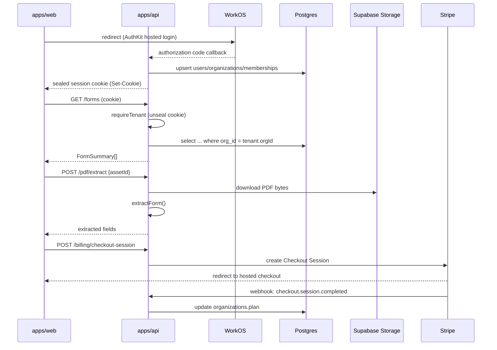

# feat: Live platform rollout — auth, forms API, enterprise API, PDF storage, billing

**Product Contract preservation:** No prior brainstorm/plan covers this scope. This plan is bootstrapped directly from the user's 5-item roadmap (stated across this session) and grounded in the existing DB schema, `apps/api` scaffolding, and the web fixture-store seam that was purpose-built for this swap.

---

## Summary

FormAI Enterprise's web app runs entirely on an in-memory fixture store (`apps/web/src/lib/data/store.ts`); `apps/api` exposes only `/health` and `/pdf` (extract/round-trip), gated by a `requireTenant` middleware that is a permanent 401 stub. The DB connection itself is live as of [2026-07-15-001-feat-db-connection-migrate-plan.md](2026-07-15-001-feat-db-connection-migrate-plan.md), and the full schema (orgs, users, memberships, form templates/versions, submissions, competencies, role permissions, audit log) already exists in `packages/db/src/schema/`. This plan wires five things end-to-end, in dependency order: (1) WorkOS auth + real tenant resolution, (2) forms/templates/submissions API + web wiring, (3) team/roles/audit/competency API + web wiring, (4) PDF storage off base64-in-request onto durable object storage, (5) Stripe billing. Each phase is independently shippable and mergeable; phase 1 blocks all others because every other route sits behind `requireTenant`.

---

## Problem Frame

"Make it real" currently stops at the DB layer — the schema exists, the connection is live, but nothing writes to it. `requireTenant` unconditionally 401s (`apps/api/src/middleware/tenant.ts:20-25`), so no authenticated route can be built or tested against a real request. The web app's entire enterprise surface (Phase 3: team/roles/audit/billing; Phase 4: competency gating) was built against `store.ts`'s in-memory fixtures specifically so the hook surface (`apps/web/src/lib/data/hooks.ts`) wouldn't need to change when real data arrives — that seam is the reason this rollout can proceed screen-by-screen without a UI rewrite.

---

## Requirements

- **R1** — A user can sign up or sign in via WorkOS (hosted SSO or WorkOS-managed email/password), landing with a real `organizations` + `users` + `memberships` row instead of a client-side-only route change.
- **R2** — `requireTenant` resolves `req.tenant = { userId, orgId, role }` from a verified WorkOS session and 401s when the session is absent/invalid — replacing the current unconditional-401 stub.
- **R3** — Form templates, template versions, and submissions are created, read, updated, and listed through `apps/api` REST routes backed by Postgres; the Dashboard, Template Library, Submissions table/detail, Builder, PDF Import, and Fill screens read/write through the real API instead of `store.ts`.
- **R4** — Team members (invite/list/set-role/remove), the role-permission matrix, the audit log, and competency rules (create/toggle/remove, plus fill-time gating) are persisted and reachable via API; the corresponding enterprise screens (`apps/web/src/screens/enterprise/**`) read/write through it.
- **R5** — PDF bytes for imported templates are stored in durable object storage and referenced by id (`form_template_versions.sourcePdfAssetId`, already in schema) rather than round-tripped as base64 in every extract/round-trip request.
- **R6** — An org can start a paid subscription via Stripe Checkout, manage it via the Stripe customer portal, and have `organizations.plan` reflect real subscription state via webhook.

---

## Key Technical Decisions

**KTD1 — Auth: WorkOS AuthKit hosted flow + sealed session cookie.**
`env.ts` already declares `WORKOS_API_KEY`/`WORKOS_CLIENT_ID` (optional) and `SESSION_SECRET`, and `LoginScreen.tsx` already brands the primary CTA "Continue with SSO … WorkOS". Use WorkOS's hosted AuthKit (redirect to WorkOS, authorization-code callback) rather than embedding a custom password form against WorkOS's user-management API — it's the lower-integration-surface option and matches what the UI already promises. The callback exchanges the code for a WorkOS profile, upserts `users`/`organizations`/`memberships` (creating the org on first sign-up), then seals `{ userId, orgId, role }` into an `httpOnly`, `sameSite=lax` cookie using WorkOS Node SDK's session-sealing helpers keyed by `SESSION_SECRET`. `requireTenant` unseals the cookie per request — no server-side session store needed for v1.

**KTD2 — LoginScreen's email/password fields become a secondary path, not removed.**
WorkOS AuthKit's hosted UI already offers email/password *and* SSO from one hosted screen, so the cleanest integration is: "Continue with SSO" button initiates the AuthKit redirect (covers both password and SSO — WorkOS decides the method per-org), and the inline email/password fields are removed from `LoginScreen.tsx` in favor of a single hosted-redirect entry point. This narrows the UI (fewer fields to keep in sync with a form we don't own) at the cost of one extra redirect hop — flagged as an assumption in Scope Boundaries; the alternative (keep local fields, use WorkOS's User Management API directly) is available if the user wants password entry to stay in-app.

**KTD3 — Forms/submissions API is a conventional REST surface under `/forms` and `/submissions`, mounted behind `requireTenant`.**
Mirrors `pdf.ts`'s existing shape (Router + `requireTenant` + zod-validated bodies + drizzle queries scoped by `req.tenant.orgId`). No GraphQL/RPC layer — there's exactly one client (the web app) and the fixture-store method names (`listForms`, `getForm`, `publishBuilder`, `publishImport`, `submitFill`, `submitInspection`) already describe the exact operations needed, so the route set is derived directly from `hooks.ts`, not invented fresh.

**KTD4 — Web wiring replaces `store.ts`'s internals, not `hooks.ts`'s surface.**
`hooks.ts`'s own header comment states this was "the Phase-2 stand-in for the API" specifically so screens wouldn't need to change. Each `store.*` method becomes a `fetch` call to the matching API route, keeping the same signatures. `queryClient`, query keys, and every hook stay as-is. This means phases 2 and 3 are additive to `store.ts`/`hooks.ts` call sites, not a screen rewrite.

**KTD5 — Team/roles/audit/competency API reuses the same `requireTenant` + drizzle pattern; permission checks read `role_permissions`.**
`packages/db/src/permissions.ts` and `packages/shared/src/roles.ts` (read in a prior session, unchanged) already define the `PermissionMatrix` shape stored per-org in `role_permissions`. Route handlers check `req.tenant.role` against that matrix before mutating; `rolePermissions` rows are seeded per-org at org creation (KTD1's signup path) from the existing prototype defaults referenced in `governance.ts`'s doc comment.

**KTD6 — PDF storage target: Supabase Storage, not a new S3 bucket.**
`SUPABASE_URL`/`SUPABASE_SERVICE_ROLE_KEY` are already declared in `env.ts` (currently unused) and `form_template_versions.sourcePdfAssetId`'s doc comment already says "Supabase Storage id of the original PDF" — the schema was built expecting this target. Using Supabase Storage avoids introducing a second cloud provider. `pdf.ts`'s `/extract` and `/round-trip` routes gain an asset-id path alongside (not replacing) the base64 path, so ad-hoc/one-off PDF processing still works without a stored asset.

**KTD7 — Billing: Stripe Checkout (hosted) + customer portal (hosted) + webhook, no custom card form.**
`STRIPE_SECRET_KEY` is already declared. Using Stripe-hosted Checkout/portal avoids PCI scope entirely and matches the "hosted flow" pattern already chosen for auth (KTD1). A webhook route updates `organizations.plan` on `checkout.session.completed` / `customer.subscription.updated` / `.deleted`.

**KTD8 — Sequencing is strict for phase 1, advisory after that.**
Phase 1 (auth) must land first — every other phase's routes sit behind `requireTenant`, and phases 2-3 cannot be manually tested end-to-end without it. Phases 2-5 have no cross-dependencies on each other's *route* code (forms, team, PDF storage, and billing touch disjoint tables/files) and may be built/reviewed/merged in any order or in parallel once phase 1 is on `main`. The 2→3→4→5 numbering reflects the user's stated priority, not a technical constraint.

---

## Scope Boundaries

**In scope:** WorkOS-backed auth + session middleware; forms/templates/submissions CRUD API and web wiring (including the mobile inspection-submit path, since it writes to the same `submissions` table); team/roles/audit/competency API and web wiring; PDF asset storage in Supabase Storage; Stripe Checkout + portal + webhook.

**Explicitly out of scope (this plan):**
- Rewriting the PDF extraction/round-trip *algorithms* themselves (`apps/api/src/pdf/**`) — only their storage input source changes.
- Any new screens or visual redesign — this is wiring existing screens to real data.
- SCIM / enterprise directory sync, SSO just-in-time provisioning edge cases beyond first-sign-up org creation.
- Email delivery for team invites (invite creates a `memberships` row with `status: 'invited'`; actually emailing the invitee is deferred).
- Usage-based billing, metering, proration edge cases, multiple simultaneous subscriptions per org.
- Rate limiting, CSRF tokens beyond `sameSite=lax`, and other hardening not already present in `apps/api` — tracked as a residual risk, not blocking.

### Deferred to Follow-Up Work
- Email delivery integration for invites (KTD-adjacent to R4).
- SCIM/directory sync.
- Stripe usage-based metering.
- Rate limiting middleware for `apps/api`.

---

## High-Level Technical Design



---

## Output Structure

```
apps/api/src/
  auth/
    workos.ts          # WorkOS SDK client + AuthKit URL builder, session seal/unseal
  routes/
    auth.ts             # GET /auth/login, GET /auth/callback, POST /auth/logout
    forms.ts             # /forms, /forms/:id, /forms/:id/versions
    submissions.ts        # /submissions, /submissions/:id
    team.ts                # /team/members, /team/permissions
    audit.ts                 # /audit
    competencies.ts            # /competencies, /competency-rules
    billing.ts                   # /billing/checkout-session, /billing/portal-session, /billing/webhook
  storage/
    supabase.ts                    # Supabase Storage client, upload/download by assetId
apps/web/src/lib/data/
  api-client.ts                      # fetch wrapper (credentials: 'include', JSON, error mapping)
  store.ts                           # (modified) delegates to api-client instead of in-memory arrays
```

---

## Implementation Units

### Phase 1 — WorkOS auth + real tenant middleware

### U1. WorkOS session infrastructure
**Goal:** Add a WorkOS client, hosted-login URL builder, and session seal/unseal helpers.
**Requirements:** R1, R2
**Dependencies:** none
**Files:** `apps/api/src/auth/workos.ts` (new), `apps/api/src/auth/workos.test.ts` (new), `apps/api/package.json` (add `@workos-inc/node`)
**Approach:** Fail-soft construction mirroring `apps/api/src/anthropic.ts`'s `getAnthropic()` pattern — `getWorkOS()` returns `null` when `WORKOS_API_KEY`/`WORKOS_CLIENT_ID` are unset. `sealSession({userId, orgId, role})` / `unsealSession(cookieValue)` wrap WorkOS SDK's sealed-session helpers keyed by `env.SESSION_SECRET`.
**Test scenarios:**
- `getWorkOS()` returns `null` when env vars unset; returns a client instance when set.
- `sealSession` → `unsealSession` round-trips the same `{userId, orgId, role}`.
- `unsealSession` returns `null` (not throw) for a tampered/expired/malformed cookie value.
**Verification:** Unit tests green; no live WorkOS call required for these tests (mock the SDK boundary).

### U2. Auth routes: hosted login, callback, logout
**Goal:** `GET /auth/login` redirects to WorkOS AuthKit; `GET /auth/callback` exchanges the code, upserts org/user/membership, sets the session cookie; `POST /auth/logout` clears it.
**Requirements:** R1
**Dependencies:** U1
**Files:** `apps/api/src/routes/auth.ts` (new), `apps/api/src/routes/auth.test.ts` (new), `apps/api/src/app.ts` (mount `/auth`)
**Approach:** Callback: exchange code via WorkOS SDK → get WorkOS profile (user id, email, name, org id if present). Upsert `users` by `workosUserId`; if no `organizations` row exists for the WorkOS org id, create one (first-sign-up path) with default `plan: 'Business'` and seed `role_permissions` from the existing prototype default matrix; upsert `memberships` (role defaults to `'admin'` for the org creator, `'viewer'` for subsequent joiners pending an explicit invite — see U9). Set sealed cookie, redirect to `env.WEB_ORIGIN`.
**Execution note:** Add characterization coverage for the org-creation-on-first-signup branch specifically — it's the one path with no prior fixture equivalent to reference.
**Test scenarios:**
- Callback with a new WorkOS user + no existing org → creates `organizations`, `users`, `memberships` (role admin), seeds `role_permissions`, sets cookie, 302s to `WEB_ORIGIN`.
- Callback with a returning WorkOS user → no duplicate `organizations`/`users` rows; existing `memberships` row reused.
- Callback with an invalid/expired code → 401, no rows written, no cookie set.
- `POST /auth/logout` clears the cookie regardless of prior session state.
**Verification:** Integration test via `createApp()` + real HTTP request (mirrors `db.test.ts`'s `GET /health` pattern), with WorkOS SDK calls mocked at the module boundary.

### U3. Real `requireTenant` middleware
**Goal:** Replace the unconditional-401 stub with real session resolution.
**Requirements:** R2
**Dependencies:** U1
**Files:** `apps/api/src/middleware/tenant.ts` (modify), `apps/api/src/middleware/tenant.test.ts` (new)
**Approach:** Read the session cookie, call `unsealSession`; on success set `req.tenant` and `next()`; on failure/absence, 401 as today. No DB lookup per request in v1 (role is embedded in the sealed session) — a residual risk noted below (stale role until re-login) is acceptable for this rollout.
**Test scenarios:**
- Valid cookie → `req.tenant` populated, `next()` called, no response sent by the middleware itself.
- Missing cookie → 401 `{error: 'unauthenticated'}`, `next()` not called.
- Tampered cookie → 401, same shape.
**Verification:** Unit tests directly exercising the middleware function with mock `req`/`res`/`next`; existing `pdf.test.ts`-style routes continue to pass once a valid session is supplied.

### Phase 2 — Forms/templates/submissions API + web wiring

### U4. Forms & template-versions API
**Goal:** `GET/POST /forms`, `GET /forms/:id`, `POST /forms/:id/versions` (publish builder or import) backed by `formTemplates`/`formTemplateVersions`.
**Requirements:** R3
**Dependencies:** U3
**Files:** `apps/api/src/routes/forms.ts` (new), `apps/api/src/routes/forms.test.ts` (new), `apps/api/src/app.ts` (mount `/forms`)
**Approach:** All queries filtered by `req.tenant.orgId`. Publishing a version follows `formTemplateVersions`' documented invariant: publishing freezes `fields`; further edits to a published version fork a new draft row, then `formTemplates.currentVersionId` is updated to point at it. Route shapes mirror `store.publishBuilder`/`store.publishImport`'s existing input contracts in `apps/web/src/lib/data/types.ts` so the web-side swap (U6) is a body/response mapping exercise, not a contract redesign.
**Test scenarios:**
- `POST /forms` with builder fields creates a template + first `draft` version.
- `POST /forms/:id/versions` on a template with a `published` current version forks a new draft rather than mutating the published row.
- `GET /forms` returns only the caller's `orgId` rows (cross-tenant isolation — create a second org+template and assert exclusion).
- `GET /forms/:id` for a nonexistent or cross-tenant id → 404.
**Verification:** Integration tests via `createApp()` against a real or mocked drizzle client; typecheck + build green.

### U5. Submissions API (incl. mobile inspection path)
**Goal:** `GET /submissions`, `GET /submissions/:id`, `POST /submissions` (fill) — the inspection-submit path (`store.submitInspection`) writes into the same table.
**Requirements:** R3
**Dependencies:** U3, U4
**Files:** `apps/api/src/routes/submissions.ts` (new), `apps/api/src/routes/submissions.test.ts` (new), `apps/api/src/app.ts` (mount `/submissions`)
**Approach:** `POST /submissions` pins `templateVersionId` to the template's *current* version at submit time (per `submissions.ts` schema's documented invariant — "never the live template" going forward). Competency gating (U11) hooks into this route later; this unit ships the unguarded write path first.
**Test scenarios:**
- Submitting against a template with a published version records `templateVersionId` = that version's id, not the template id.
- `GET /submissions` cross-tenant isolation, same shape as U4's forms test.
- Submitting invalid `values` (fails the `FormField`/`SubmissionValue` zod contract) → 400 with `zod.flatten()` detail, mirroring `pdf.ts`'s existing error shape.
**Verification:** Integration tests; contract parity check against `apps/web/src/lib/data/types.ts`'s `SubmissionDetail`/`SubmissionRow` shapes.

### U6. Web wiring: `api-client` + `store.ts` swap for forms/submissions
**Goal:** Replace `store.ts`'s in-memory forms/submissions methods with real `fetch` calls; `hooks.ts` and every screen stay unchanged.
**Requirements:** R3
**Dependencies:** U4, U5
**Files:** `apps/web/src/lib/data/api-client.ts` (new), `apps/web/src/lib/data/store.ts` (modify: `listForms`, `getForm`, `publishBuilder`, `publishImport`, `submitFill`, `listSubmissions`, `getSubmission`, `submitInspection`, `dashboard`)
**Approach:** `api-client.ts` wraps `fetch` with `credentials: 'include'` (so the session cookie rides along) and a shared error-mapping helper. `store.ts` methods keep their exact signatures (per KTD4) but their bodies become `await apiClient.get/post(...)` instead of array mutation. `dashboard()` aggregates client-side from `listForms`/`listSubmissions` calls unless the added round-trip cost proves material — flagged as an implementation-time call, not pre-decided here.
**Execution note:** Smoke-verify each swapped method against the running dev API before moving to the next — this is a seam-preservation refactor, not new logic, so runtime parity checking catches contract drift faster than unit tests alone.
**Test scenarios:**
- Existing web-side tests (if any target `store.ts`) still pass with `fetch` mocked to return the same fixture shapes.
- A manual/browser smoke pass: Dashboard, Template Library, Submissions table/detail, Builder publish, PDF Import publish, Fill submit, Mobile inspection submit — each round-trips through the real API in the dev server (see Verification Contract).
**Verification:** `pnpm --filter @formai/web typecheck`; browser-based smoke pass per the preview verification workflow.

### Phase 3 — Team/roles/audit/competency API + web wiring

### U7. Team & permissions API
**Goal:** `GET/POST /team/members`, `PATCH /team/members/:id`, `DELETE /team/members/:id`, `GET/PATCH /team/permissions`.
**Requirements:** R4
**Dependencies:** U3
**Files:** `apps/api/src/routes/team.ts` (new), `apps/api/src/routes/team.test.ts` (new), `apps/api/src/app.ts` (mount `/team`)
**Approach:** Mutating routes (`POST`/`PATCH`/`DELETE` members, `PATCH` permissions) check `req.tenant.role` against `role_permissions` before writing (KTD5) — this is the first unit that actually enforces the matrix rather than just storing it. Invite creates a `memberships` row with `status: 'invited'` (no email sent, per Scope Boundaries).
**Test scenarios:**
- A `viewer` role attempting `POST /team/members` → 403 (matrix-denied), no row written.
- An `admin` inviting a new member → `memberships` row created with `status: 'invited'`.
- `PATCH /team/permissions` updates the stored matrix for one role without affecting other roles' rows.
- Removing the last `admin` in an org — decide-and-document behavior (block, or allow — flagged as an open question below since no origin doc specifies it).
**Verification:** Integration tests; cross-tenant isolation test matching U4/U5's pattern.

### U8. Audit log API
**Goal:** `GET /audit`; internal `recordAudit()` helper called by every mutating route added in this plan.
**Requirements:** R4
**Dependencies:** U3
**Files:** `apps/api/src/audit/record.ts` (new), `apps/api/src/routes/audit.ts` (new), `apps/api/src/audit/record.test.ts` (new)
**Approach:** `recordAudit(tenant, {action, target, category, icon})` is a thin insert helper into `auditLogEntries`; called from U7 (team changes), U9 (billing/white-label save — already referenced by `useUpdateWhiteLabel` in `hooks.ts`), and U11 (competency rule changes). Built as its own unit first so later units can depend on it rather than each inventing insert logic.
**Test scenarios:**
- `recordAudit` inserts a row with `actorId`/`actorName` from the tenant context.
- `GET /audit` returns rows ordered newest-first, scoped to `orgId` (uses the existing `audit_org_created_idx`).
**Verification:** Unit + integration tests; typecheck.

### U9. Competency & competency-rules API + fill-time gating
**Goal:** `GET/POST/DELETE /competencies`, `GET/POST/PATCH/DELETE /competency-rules`; the Fill screen's section gating is enforced server-side, not just in the UI.
**Requirements:** R4
**Dependencies:** U3, U8, U5 (submissions route is where gating is enforced at submit time)
**Files:** `apps/api/src/routes/competencies.ts` (new), `apps/api/src/routes/competencies.test.ts` (new), `apps/api/src/routes/submissions.ts` (modify — gating check)
**Approach:** Per [phase-4-competency memory], fill-gating goes beyond the preview-only prototype — this unit is where that intent gets a real enforcement point. `POST /submissions` checks any enabled `competency_rules` row for the template's sections against the submitter's held competencies before accepting values for a gated section; violations return 403 with the specific `sectionRef`.
**Test scenarios:**
- A submission touching a gated section from a submitter without the required competency → 403, no `submissions` row written.
- A submission touching only ungated sections → succeeds regardless of competency state.
- Toggling a rule's `enabled` off removes the gate immediately for subsequent submissions.
**Verification:** Integration tests covering both the CRUD routes and the submission-time enforcement path together (this is the multi-layer scenario mocks alone won't prove).

### U10. Web wiring: team/roles/audit/competency screens
**Goal:** Swap `store.ts`'s `listMembers`, `perms`, `auditLog`, `inviteMember`, `setMemberRole`, `removeMember`, `togglePermission`, `updateWhiteLabel`, `listCompetencies`, `listCompetencyRules`, `addRule`, `toggleRule`, `removeRule` onto `api-client`.
**Requirements:** R4
**Dependencies:** U6 (establishes `api-client.ts`), U7, U8, U9
**Files:** `apps/web/src/lib/data/store.ts` (modify — remaining enterprise/competency methods)
**Approach:** Same pattern as U6 — signatures unchanged, bodies become `fetch` calls.
**Test scenarios:** Same shape as U6 — fixture-shape parity + browser smoke pass across Team, Roles, Audit Log, White-label, and Competency-gating screens (`apps/web/src/screens/enterprise/**`).
**Verification:** Typecheck; browser smoke pass.

### Phase 4 — PDF storage wiring

### U11. Supabase Storage client + asset-id upload/download
**Goal:** A storage module that uploads/downloads PDF bytes by org-scoped asset id.
**Requirements:** R5
**Dependencies:** U3
**Files:** `apps/api/src/storage/supabase.ts` (new), `apps/api/src/storage/supabase.test.ts` (new), `apps/api/package.json` (add `@supabase/supabase-js`)
**Approach:** Fail-soft construction mirroring `getAnthropic()`/`getWorkOS()` — `getStorageClient()` returns `null` when `SUPABASE_URL`/`SUPABASE_SERVICE_ROLE_KEY` are unset. `uploadPdf(orgId, bytes)` returns a generated asset id (stored as the object key, prefixed by `orgId` for tenant isolation at the storage layer too); `downloadPdf(orgId, assetId)` returns bytes or `null`/404 on a cross-tenant or missing id.
**Test scenarios:**
- Upload then download round-trips the same bytes.
- Download with a wrong `orgId` for a real `assetId` → not found (tenant isolation at the storage layer, not just the DB layer).
- `getStorageClient()` returns `null` when env unset (mirrors U1's pattern).
**Verification:** Unit tests with the Supabase client mocked at the module boundary; no live bucket required for tests.

### U12. Wire `pdf.ts` routes onto asset storage
**Goal:** `/pdf/extract` and `/pdf/round-trip` accept an `assetId` alongside the existing base64 path; imported templates persist `sourcePdfAssetId`.
**Requirements:** R5
**Dependencies:** U11, U4
**Files:** `apps/api/src/routes/pdf.ts` (modify), `apps/api/src/routes/pdf.test.ts` (modify — add asset-id cases)
**Approach:** Extend `extractBody`/request handling with an optional `assetId` field (mutually exclusive with `pdfBase64` — validated via zod `.refine`); when present, bytes come from `downloadPdf` instead of the request body. When a PDF-import template is published (U4's `POST /forms/:id/versions` import path), the uploaded asset's id is written to `sourcePdfAssetId`.
**Test scenarios:**
- `assetId` path: extract succeeds using bytes fetched from storage, matching the existing base64 path's output shape.
- Both `assetId` and `pdfBase64` present → 400 (ambiguous request).
- Neither present → 400 (existing behavior, now via the `.refine`).
- Publishing an import template persists `sourcePdfAssetId` correctly on the version row.
**Verification:** Integration tests; existing base64-path tests continue passing unmodified (backward compatible).

### Phase 5 — Billing

### U13. Stripe Checkout + customer portal + webhook
**Goal:** `POST /billing/checkout-session`, `POST /billing/portal-session`, `POST /billing/webhook`.
**Requirements:** R6
**Dependencies:** U3
**Files:** `apps/api/src/billing/stripe.ts` (new), `apps/api/src/routes/billing.ts` (new), `apps/api/src/routes/billing.test.ts` (new), `apps/api/src/app.ts` (mount `/billing`; webhook route needs raw-body parsing, mounted before the global `express.json()` middleware)
**Approach:** Fail-soft `getStripe()` mirroring U1/U11. Checkout/portal routes create a hosted Stripe session and return its redirect URL (no card data touches `apps/api`). Webhook verifies the Stripe signature (`STRIPE_SECRET_KEY`-derived) and updates `organizations.plan` on `checkout.session.completed` / `customer.subscription.updated` / `customer.subscription.deleted`. Webhook route is registered with `express.raw({type: 'application/json'})`, not the app-wide JSON parser, since Stripe signature verification needs the raw body.
**Test scenarios:**
- `POST /billing/checkout-session` returns a redirect URL and does not itself mutate `organizations`.
- Webhook with a valid signature and `checkout.session.completed` → `organizations.plan` updated.
- Webhook with an invalid signature → 400, no DB write.
- Webhook `customer.subscription.deleted` → `organizations.plan` reset to a defined free/canceled state.
**Verification:** Integration tests with the Stripe SDK/webhook signature verification mocked at the module boundary; no live Stripe calls in CI.

### U14. Web wiring: Billing screen
**Goal:** `store.billing()` reads real subscription/plan state; "Manage billing" / "Upgrade" actions call the checkout/portal routes and redirect.
**Requirements:** R6
**Dependencies:** U6 (api-client), U13
**Files:** `apps/web/src/lib/data/store.ts` (modify — `billing()`), `apps/web/src/screens/enterprise/BillingScreen.tsx` (modify — redirect-on-click for checkout/portal actions)
**Approach:** Same `store.ts` swap pattern as U6/U10. `BillingScreen.tsx`'s existing "upgrade"/"manage" affordances call the new routes and `window.location.assign()` the returned redirect URL (leaving Stripe's hosted UI to own the actual payment flow).
**Test scenarios:**
- Fixture-shape parity for `store.billing()`'s read path.
- Clicking "Manage billing" triggers a call to `/billing/portal-session` and redirects to its returned URL (verified via network-request inspection in the browser smoke pass, not a payment attempted).
**Verification:** Typecheck; browser smoke pass confirming the redirect fires (do not complete a real Stripe checkout in verification — this project's safety rules prohibit executing financial transactions on the user's behalf).

---

## Open Questions

- **Removing the last admin from an org (U7):** block the removal, or allow it and leave the org admin-less? No origin document specifies this — recommend blocking (400) as the safer default; confirm before U7 ships if the user has a preference.
- **LoginScreen's inline email/password fields (KTD2):** this plan removes them in favor of a single hosted-redirect entry point. If in-app password entry is a hard requirement, KTD2 changes to use WorkOS's User Management API directly instead of AuthKit's hosted UI — a larger integration surface. Flagging before U2 starts, since it changes that unit's approach.
- **`dashboard()` aggregation cost (U6):** whether client-side aggregation from `listForms`/`listSubmissions` is fast enough, or whether a dedicated `/dashboard` API route is warranted, is left as an implementation-time call once real data volumes are visible.

---

## Risks & Dependencies

- **Phase 1 is a hard blocker.** No other phase can be manually verified end-to-end (beyond mocked unit tests) until U1-U3 are on `main`, since every new route sits behind `requireTenant`.
- **Session role staleness (U3):** role is embedded in the sealed session cookie, not re-checked against `memberships` per request. A role change (via U7) doesn't take effect until the affected user's next login. Acceptable for this rollout; a future iteration could move to a per-request `memberships` lookup if staleness proves problematic.
- **No rate limiting.** `apps/api` has none today; auth and billing routes are the highest-value targets for it. Deferred per Scope Boundaries but worth flagging as a pre-production gap.
- **Webhook idempotency:** Stripe can redeliver webhooks. U13's handler should be written idempotently (upsert-by-event-id or safe-to-repeat updates) — called out here since it's easy to miss in the unit's own scope but matters at runtime.

---

## Definition of Done

- All 14 implementation units merged to `main`, each with passing typecheck, build, and its own test suite.
- `pnpm -r typecheck` and `pnpm -r build` green at the workspace root.
- A full browser smoke pass (per the preview verification workflow) covering: sign-up → org creation → build a form → publish → fill it → view submission → invite a team member → toggle a permission → view audit log → add a competency rule → attempt a gated fill → import a PDF → export round-trip → view billing screen → initiate (not complete) a Stripe checkout redirect.
- No route added in this plan is reachable without a valid `req.tenant` (verify via a request with no session cookie against each new route → 401).
