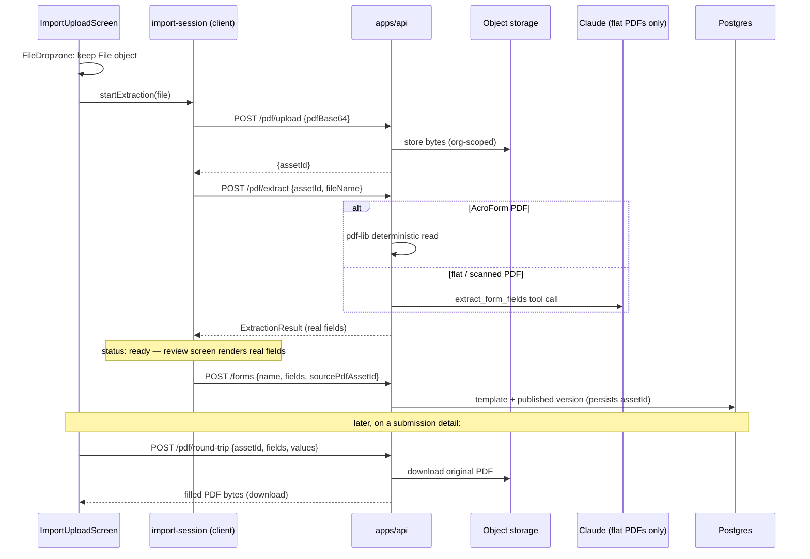

# feat: Wire remaining prototype UI to the real API — PDF import first

**Product Contract preservation:** Bootstrapped from the user's production-test report (PDF upload silently fell back to prototype fixture data) plus a completed full audit of every fixture-backed screen, cross-referenced against [the live-platform rollout plan](2026-07-15-002-feat-live-platform-rollout-plan.md), which this plan treats as origin. That rollout delivered auth, forms/submissions CRUD, team/roles/audit, and competencies; this plan closes out what it left unfinished (PDF import wizard wiring, round-trip export, dashboard, fill/mobile submission paths) plus gaps it never covered (Approve workflow, onboarding persistence, invites, builder entry points).

---

## Product Contract

### Summary

Wire every remaining fixture-backed screen in `apps/web` to the real `apps/api` backend, phased so the PDF import wizard lands first. Where no backend exists yet (Approve, dashboard, org settings, public fill links, invite email), build the missing routes; where the backend exists but the UI never calls it (PDF extract, round-trip, invites), connect them. A second, separate objective rides along: hardening PR #18's account-deletion cascade (atomicity + storage cleanup, R9/U11) — a review finding from this session, not a fixture gap. Billing stays with the origin rollout plan's phase 5.

### Problem Frame

The user's first production test — uploading a PDF to extract fields and build a form — silently produced the prototype's hardcoded "Facility inspection checklist" extraction regardless of what was uploaded. The import wizard never reads the dropped file's bytes, shows a fake 1400ms "scanning" animation, reviews a fixture (`IMPORT_EXTRACTION` in `apps/web/src/lib/data/fixtures.ts`), and publishes with a hardcoded `formId: 'f3'` and name. Meanwhile the backend extraction pipeline (`apps/api/src/routes/pdf.ts`, `apps/api/src/pdf/extract.ts`) is complete and tested — deterministic pdf-lib reads for AcroForm PDFs, Claude extraction for flat/scanned ones — and is never called.

The audit found the same "looks real, isn't" pattern across seven more areas: the round-trip export button and Approve button are toasts; Dashboard and Billing render static fixtures; the onboarding wizard's org name and branding are discarded (WorkOS auto-provisioning names the org instead); vendor-fill and mobile-inspection submissions write to in-memory state despite a real `POST /submissions` route; the builder always seeds from a fixed template; invite-member and white-label saves are local-only. Each gap erodes trust during production testing — the app confirms actions it did not perform.

### Requirements

- **R1** — Uploading a PDF in the import wizard extracts *that PDF's* actual fields through `POST /pdf/upload` + `POST /pdf/extract` (AcroForm and AI paths both reachable), with a real loading state, real error states, and a publish step that uses the real file name and creates a new form — no fixture, no fake timer, no hardcoded ids.
- **R2** — A submission detail's "Export filled PDF" downloads a genuine PDF produced by `POST /pdf/round-trip`, overlaying the submission's values on the original imported layout. (V1 scope: AcroForm-imported forms — AI-extracted flat PDFs carry no field positions yet; see Deferred.)
- **R3** — Approve/Reject on a submission persists a status change to the database, is reflected in the submissions list, and is recorded in the audit log.
- **R4** — The Dashboard shows real aggregates for the caller's org (form counts, submission counts, recent activity) instead of the static fixture.
- **R5** — The Builder can start from a blank form and can open an existing form's current version for editing; it no longer unconditionally seeds the fixed "Contractor site induction" template.
- **R6** — Org name and branding entered in onboarding (and edited later in white-label settings) persist to `organizations.name` / `organizations.branding` and are what the app shell and audit log display.
- **R7** — Inviting a team member creates persistent rows visible after a reload, the invitee receives an invite email (via Resend) telling them to sign in with that address, and they are linked to their invited membership on first WorkOS login (by verified email match).
- **R8** — An org member can generate a public fill link for a published form; an unauthenticated visitor can open it and submit, and the submission persists to the same `submissions` table. The mobile inspection screen submits through the real API against a real selected form.
- **R9** — Account deletion (shipped in PR #18) runs its org-wide cascade atomically and cleans up stored PDF assets.

### Scope Boundaries

**In scope:** everything in R1–R9; the small API contract extensions they need (`PATCH /submissions/:id`, `GET /dashboard`, `PATCH /org`, fill-link routes — `sourcePdfAssetId` on publish already exists server-side and only needs web wiring plus a test); two schema migrations: nullable `users.workosUserId` (U10) and the new `fill_links` table (U12); invite email delivery via Resend (U15 — the user has an existing Resend account).

**Explicitly out of scope:**
- Stripe billing — already planned as the origin rollout plan's phase 5 (U13/U14 there); the Billing screen keeps its fixture until that ships.
- Rate limiting on the new public fill routes — flagged as a residual risk, consistent with the origin plan's deferral.
- Any visual redesign; this is wiring existing screens.

#### Deferred to Follow-Up Work
- Multipart/binary PDF upload transport, replacing base64-in-JSON (removes U2's inflated-body-limit workaround; item 1C from the review walkthrough).
- AI extraction emitting field positions (bounding boxes) so AI-extracted flat/scanned PDFs can round-trip export — would make scanned forms fully round-trippable, a real differentiator (item 2B).
- Pass/Fail inspection card reintroduced as a field-type-specific mobile renderer on top of U14's shared renderer (item 13B).
- Rate limiting / abuse protection for public fill links (tracked as a pre-production gap).
- Competency gating for *external* (unauthenticated) fill-link submitters — gating rules key on internal members' held competencies; how they apply to outsiders is a product question (see Open Questions).
- Server-side PDF preview rendering in the review screen (the field-overlay panel stays schematic).

---

## Planning Contract

### Key Technical Decisions

**KTD1 — Import flow is upload-then-extract by `assetId`, not inline base64.**
"Extract fields" uploads the file's bytes once via `POST /pdf/upload` (base64 body, per the existing route contract), then calls `POST /pdf/extract` with the returned `assetId`. The asset is thereby stored durably at import time, which is exactly what R2's round-trip export needs later — the alternative (inline `pdfBase64` extract) would leave nothing stored to overlay values onto.

The global API body parser is `express.json({ limit: '2mb' })` — far below the advertised 25 MB cap once base64's ~33% inflation is counted. U2 therefore mounts a route-scoped JSON parser (~40 MB limit) on the `/pdf` router ahead of the global one, keeping the small limit for every other route. A multipart/binary upload transport (dropping base64-in-JSON entirely) is deferred to follow-up work.

**KTD2 — The import session keeps its `useSyncExternalStore` shape but is populated from the real `ExtractionResult`.**
`POST /pdf/extract` already returns the exact shape the session consumes (`fileName`, `pageCount`, `fields: ExtractedField[]`, `designNotes` — verified in `packages/shared/src/extraction.ts`), so `import-session.ts` gains an async "start extraction" entry point and a status field (`idle | uploading | extracting | ready | error`) instead of being rebuilt. The review screen's spinner binds to that status; the 1400ms timer is deleted. Screens keep their existing review/remap/confirm interactions untouched.

**KTD3 — Publish carries `sourcePdfAssetId` and the real file name; `POST /forms` is extended, not bypassed.**
The forms route's import path accepts an optional `sourcePdfAssetId`, written to `form_template_versions.sourcePdfAssetId` (column already in schema, currently unwritten by the web flow). Form name defaults to the uploaded file name (extension stripped), editable on the publish screen. The hardcoded `formId: 'f3'` goes away — publish creates a new template.

**KTD4 — Approve/Reject is a `PATCH /submissions/:id` status route using the existing enum.**
`submission_status` already includes `approved` and `rejected` — no migration. The route is permission-checked like other mutating routes, records an audit entry, and the web side swaps the toast for a real mutation with list invalidation.

**KTD5 — Dashboard gets a dedicated `GET /dashboard` route.**
The origin plan left "client-side aggregation vs dedicated route" open. Deciding for a dedicated route: one round-trip, org-scoped SQL counts (forms, submissions, pending review) plus the most recent audit entries for the activity feed. Fixture stats that have no real data source yet (e.g. the compliance score) are dropped from the screen rather than faked — honesty is the point of this plan.

**KTD6 — Invites attach to existing users at invite time; placeholders (nullable `workosUserId`) cover never-seen emails, claimed on first login by *verified* email.**
`memberships.userId` is a required FK, which is why the current invite is client-side only. At invite time: if a `users` row already exists with the invited email (case-insensitive — active user or earlier placeholder), attach the `invited` membership directly to it. This covers the common case of inviting someone who already tried the product — without it the login-time claim below is unreachable for them, because provisioning resolves returning users by `workosUserId` before any email check runs. Only for never-seen emails: create a placeholder `users` row (name, email, `workosUserId: null`) plus the `invited` membership. The WorkOS callback's provisioning gains one step: before creating a fresh user, look for a placeholder matching the profile's email and claim it (set `workosUserId`, flip membership to `active`) — **gated on the profile asserting the email is verified** (`emailVerified` propagated into `WorkOSProfile`; unverified profiles fall through to normal auto-provisioning). Email is an authorization input here, not display data, so the precondition is mechanical, not assumed. One migration: drop the NOT NULL on `workosUserId`, plus a partial unique index on `users.email WHERE workosUserId IS NULL` so at most one placeholder can exist per email; the claim lookup is scoped to placeholder rows only, so it can never match an active user or more than one row.

**KTD7 — Public fill links are unguessable tokens in a new `fill_links` table; the fill routes are deliberately outside `requireTenant`.**
`fill_links` rows carry token (random, URL-safe), `orgId`, `templateId`, optional expiry, and an active flag. Links resolve the template's **latest published version at request time** — a corrected form propagates to already-distributed links immediately (matching how mainstream form products behave), while auditability is preserved because each *submission* still pins the exact version the visitor filled: `GET /fill/:token` returns the current published version's fields + branding and echoes that version's id; `POST /fill/:token/submissions` inserts pinned to the echoed version id (validated to belong to the link's template). Token possession is the authorization — same model as every mainstream form product. Competency gating does not apply to external submitters in v1 (deferred; see Open Questions). The mobile inspection screen is authenticated and simply uses the existing `POST /submissions`.

**KTD8 — PR #18's account deletion cascade gets wrapped in `db.transaction()`, and org deletion deletes stored PDF assets.**
Follow-up to this session's review finding: the 8-statement cascade in `apps/api/src/routes/account.ts` is not atomic. Wrap it; extend the storage client interface with a delete-by-prefix operation (both Replit and Supabase backends) so the org's PDF folder goes with it. Storage deletion is best-effort *after* the transaction commits — a storage failure must not resurrect the org.

**KTD9 — Sequencing: phase 1 (PDF import) is independent and first; later phases are parallelizable.**
Phase 1 needs only the small route-scoped body-limit change (KTD1) on the API — everything else it calls already exists. Phases 2–5 touch disjoint routes/screens and can land in any order after their listed unit dependencies; the numbering reflects the user's testing priority, not technical constraints.

**KTD10 — Invite emails go through Resend, fail-soft.**
`getResend()` follows the same fail-soft construction as `getAnthropic()`/`getWorkOS()`: returns `null` when `RESEND_API_KEY` is unset. Sending is best-effort *after* the invite rows commit — a send failure (or unconfigured key) never rolls back the invite; the response carries `emailSent: boolean` and the UI toast degrades to "Invite created — the email couldn't be sent, ask them to sign in with this address directly." This keeps the invite dialog's "they'll get an email" promise true when configured and honest when not.

### Assumptions

- `ANTHROPIC_API_KEY` will be set in the production environment — without it, flat/scanned PDF extraction correctly fails with a 422 (`extraction_unavailable`), and the import wizard must surface that clearly rather than hang. AcroForm PDFs extract without it.
- `STORAGE_PROVIDER` remains `replit` in production (the default); both storage backends already implement the shared interface, so this plan is provider-agnostic.
- The prototype's fixture data (`IMPORT_EXTRACTION`, `BUILDER_SEED_FIELDS`, `DASHBOARD`, `MOBILE_INSPECTION`) is removed from the live paths it currently backs but the fixtures file itself is only pruned, not deleted, while Billing still reads from it.
- The `/pdf` router carries its own raised JSON body limit (~40 MB); the global 2 MB `express.json` cap stays for every other route. Without this the advertised 25 MB upload cap is undeliverable (base64 inflates ~33%).
- `RESEND_API_KEY` and a Resend-verified sender address will be set in production (existing Resend account). Invite email sending degrades gracefully — invite persists, UI says the email couldn't be sent — when unset or failing.
- WorkOS asserts `emailVerified` on AuthKit profiles, and the placeholder-claim step requires it; unverified logins fall through to normal auto-provisioning.

---

## High-Level Technical Design

Fill-link flow (phase 5): token row created by an authed member → public visitor `GET /fill/:token` (fields + branding, no session) → `POST /fill/:token/submissions` → same `submissions` table, pinned to the link's template version.

---

## Implementation Units

### Phase 1 — PDF import wizard (priority 1)

### U1. Import session: real extraction lifecycle
**Goal:** `import-session.ts` gains `startExtraction(file: File)` — reads bytes, calls `POST /pdf/upload` then `POST /pdf/extract`, tracks `status: idle | uploading | extracting | ready | error`, stores `assetId` and the real `ExtractionResult`. The fixture path (`store.importDraft()` / `IMPORT_EXTRACTION`) is removed from this flow.
**Requirements:** R1
**Dependencies:** none
**Files:** `apps/web/src/lib/data/import-session.ts` (modify), `apps/web/src/lib/data/import-session.test.ts` (new), `apps/web/src/lib/data/fixtures.ts` (prune `IMPORT_EXTRACTION` once nothing references it)
**Approach:** Keep the `useSyncExternalStore` external store; add status + error fields to the session. File → base64 via `arrayBuffer()`. Error mapping distinguishes 422 `extraction_unavailable` (AI key missing — "This PDF needs AI extraction, which isn't configured"), 503 `storage_unavailable`, 413 payload-too-large (translated to the same size-limit message U2 shows client-side), and generic failure, using the existing `ApiError` class.
**Test scenarios:**
- `startExtraction` with a mocked happy-path API sets `uploading` → `extracting` → `ready` and exposes the returned fields.
- A 422 from extract sets `status: error` with the AI-unavailable message; a 503 from upload sets the storage message; session keeps the file name so retry is possible.
- `resetImportSession()` returns to `idle` with no fields (no fixture fallback).
**Verification:** Unit tests green; `pnpm --filter @formai/web typecheck`.

### U2. Upload screen: real file handling
**Goal:** The dropzone keeps the `File`, the page-count claim ("N pages · ready to extract") disappears until real data exists, and "Extract fields" triggers `startExtraction` then navigates — disabled until a file is selected.
**Requirements:** R1
**Dependencies:** U1
**Files:** `apps/web/src/screens/import/ImportUploadScreen.tsx` (modify), `apps/api/src/app.ts` (modify — route-scoped body limit for `/pdf`), `apps/api/src/routes/pdf.test.ts` (modify — oversize-payload test)
**Approach:** Replace the name-only `onFiles` handler; the "ready to extract" card renders only when a file is held, showing size instead of fabricated page count. Enforce the advertised 25 MB limit client-side with a clear error. API side: mount `express.json({ limit: '40mb' })` on the `/pdf` router ahead of the global 2 MB parser so a 25 MB PDF's ~34 MB base64 payload parses (per KTD1).
**Test scenarios:**
- No file selected → "Extract fields" disabled; selecting a PDF enables it.
- Selecting a >25 MB file shows the size error and keeps the button disabled.
- Clicking "Extract fields" calls `startExtraction` with the held `File` and navigates to review.
- API: a `/pdf/upload` payload above the old global 2 MB limit parses successfully; one above the route limit returns a clean 413.
**Verification:** Browser smoke pass — drop a real PDF from `TestPDFS/`, watch the network tab show `/api/pdf/upload` + `/api/pdf/extract`.

### U3. Review screen: real loading, real fields, real errors
**Goal:** The scanning overlay binds to session status (delete the 1400ms timer); the source-preview panel header shows the real file name instead of the hardcoded "Facility Inspection Checklist"; an error state offers retry/back instead of rendering fixture fields.
**Requirements:** R1
**Dependencies:** U1
**Files:** `apps/web/src/screens/import/ImportReviewScreen.tsx` (modify)
**Approach:** Existing review interactions (remap signature, type correction, confirm table) already operate on session fields and carry over unchanged. Guard direct navigation: entering review with `status: idle` redirects back to upload.
**Test scenarios:**
- Overlay visible during `uploading`/`extracting`, gone at `ready`; field list renders the extraction's actual fields and confidences.
- `status: error` renders the message with a "Back to upload" action; no fixture fields appear.
- Deep-linking to `/app/import/review` with no session in flight redirects to `/app/import`.
**Verification:** Browser smoke pass with one AcroForm PDF and one flat PDF. `TestPDFS/` currently holds only the AcroForm fillable sample — add a flat/print-only PDF to `TestPDFS/` before this smoke pass so both extraction paths are exercisable from the repo. With `ANTHROPIC_API_KEY` unset locally, the flat PDF shows the AI-unavailable error rather than fake results.

### U4. Publish with real identity + persist the source asset
**Goal:** Publish screen shows an editable form name defaulted from the file name, summary rows derive from the session, and publishing sends `{name, fields, sourcePdfAssetId}` — creating a new form, no `formId: 'f3'`.
**Requirements:** R1, R2 (prerequisite)
**Dependencies:** U1
**Files:** `apps/web/src/screens/import/ImportPublishScreen.tsx` (modify), `apps/web/src/lib/data/store.ts` (modify `publishImport`), `apps/web/src/lib/data/types.ts` (extend publish input), `apps/api/src/routes/forms.ts` (verify only — no change expected), `apps/api/src/routes/forms.test.ts` (modify — add missing persistence test)
**Approach:** The API side already exists: `POST /forms` accepts optional `sourcePdfAssetId` and writes it to the version row (`apps/api/src/routes/forms.ts` — zod body and insert both handle it today; it just has no test coverage). The remaining work is web-side: `store.publishImport` sends the session's `assetId` and the edited real name. The static "Form name" row becomes an editable input pre-filled from the parsed file name, and the publish mutation gains an `onError` handler (error toast, user stays on the publish screen) — no silent failure. Success toast uses the real name.
**Test scenarios:**
- API: publishing with `sourcePdfAssetId` persists it on the version row; without it, null (builder path unaffected).
- Web: publish sends the edited name and the session's `assetId`; on success navigates to forms list where the new form appears (round-trips through `GET /forms`).
- A failed publish (mocked 500) shows an error toast and does not navigate.
**Verification:** Integration test on the route; end-to-end browser pass upload → extract → review → publish → form visible in library.

### Phase 2 — Submission detail honesty

### U5. Round-trip export, wired
**Goal:** "Export filled PDF" calls `POST /pdf/round-trip` with the submission's version fields, values, and the version's stored `sourcePdfAssetId`, and downloads the returned PDF. Hidden/disabled with an explanatory tooltip when **no field on the submission's version carries a `sourcePosition`** — asset presence alone is not exportability: the AI extraction path emits no positions and `roundTripExport` silently skips positionless fields, so only AcroForm-imported forms round-trip in v1 (AI-path position emission is deferred follow-up work).
**Requirements:** R2
**Dependencies:** U4
**Files:** `apps/web/src/screens/SubmissionDetailScreen.tsx` (modify), `apps/web/src/lib/data/store.ts` + `hooks.ts` (add export call), `apps/api/src/routes/submissions.ts` (include version's `sourcePdfAssetId` + `sourcePosition`-bearing fields in the detail response if not already exposed)
**Approach:** The route returns bytes with `Content-Type: application/pdf`; the client fetches as blob and triggers a download named after the form. Note `apiClient` is JSON-only — this call needs a small blob-aware variant.
**Test scenarios:**
- Submission on an imported form with a stored asset → download fires; response is a PDF (magic bytes) — covered at route level by existing round-trip tests, so the new web test asserts the request payload shape.
- Submission on a from-scratch form (no asset) or an AI-extracted form (asset but no `sourcePosition`s) → button disabled with tooltip, no request.
- API failure → error toast, no fake success.
**Verification:** Browser pass: fill an imported form, export, open the downloaded PDF.

### U6. Approve/Reject workflow
**Goal:** `PATCH /submissions/:id` accepts a status transition (`approved` / `rejected`), permission-checked, audit-logged; the detail screen's Approve button becomes a real mutation (plus a Reject affordance), and the list reflects the new status.
**Requirements:** R3
**Dependencies:** none (parallel-safe)
**Files:** `apps/api/src/routes/submissions.ts` (modify), `apps/api/src/routes/submissions.test.ts` (modify), `apps/web/src/lib/data/store.ts` + `hooks.ts` (add mutation), `apps/web/src/screens/SubmissionDetailScreen.tsx` (modify)
**Approach:** Enum already has the values — no migration. Follow the team-route pattern for role/permission checks; `recordAudit` with category `submissions`.
**Test scenarios:**
- Authorized role approves → row status `approved`, audit entry written, response reflects new status.
- Unauthorized role → 403, no change.
- Invalid transition target (e.g. arbitrary string) → 400.
- Web: approve invalidates the submissions queries so list + detail re-render with the badge.
**Verification:** Integration tests; browser pass approve → status visible after reload (persistence proof).

### Phase 3 — Dashboard and builder entry points

### U7. Real dashboard
**Goal:** `GET /dashboard` returns org-scoped aggregates (active form count, submission counts, pending-review count, recent audit activity); `store.dashboard()` calls it; the screen drops fixture-only stats it can't honestly compute.
**Requirements:** R4
**Dependencies:** U6 (pending-review count keys on real statuses)
**Files:** `apps/api/src/routes/dashboard.ts` (new), `apps/api/src/routes/dashboard.test.ts` (new), `apps/api/src/app.ts` (mount), `apps/web/src/lib/data/store.ts` (modify `dashboard()`), `apps/web/src/screens/DashboardScreen.tsx` (modify to match the honest stat set), `apps/web/src/lib/data/fixtures.ts` (prune `DASHBOARD`)
**Approach:** Plain org-scoped counts + the N most recent audit entries (reusing the audit table read pattern). Per KTD5, the compliance-score tile is removed rather than fabricated.
**Test scenarios:**
- Counts reflect seeded rows and are org-isolated (second-org exclusion test, same shape as the forms route tests).
- Empty org → zeros and an empty activity list, screen renders an empty state (not a crash).
**Verification:** Integration tests; browser pass shows numbers that change after publishing a form / submitting.

### U8. Builder entry points
**Goal:** `/app/builder` starts blank; "edit" on a form loads its current version's fields into the builder and publishing from that state creates a new version of *that* form (`POST /forms/:id/versions`); the fixed seed template no longer auto-loads.
**Requirements:** R5
**Dependencies:** U4 (publish contract), otherwise parallel-safe
**Files:** `apps/web/src/screens/builder/BuilderScreen.tsx` (modify), `apps/web/src/lib/data/store.ts` + `hooks.ts` (version-publish call if not yet exposed client-side), `apps/web/src/screens/FormsScreen.tsx` or form detail (add the edit entry point), `apps/web/src/lib/data/fixtures.ts` (prune `BUILDER_SEED_FIELDS`)
**Approach:** Route param or query (`/app/builder?form=<id>`) selects seed source: blank by default, fetched fields when editing. The reducer already takes seed fields as init — the change is what feeds it.
**Test scenarios:**
- Fresh `/app/builder` → empty canvas, publish creates a brand-new form.
- Edit entry → builder shows the form's current fields; publish creates a new version on the same template (list shows same form, bumped version), honoring the publish-freezes-fields invariant.
**Verification:** Browser pass both paths; version fork verified via the forms API response.

### Phase 4 — Org settings, invites, deletion hardening

### U9. Org settings persistence (name + branding)
**Goal:** `PATCH /org` updates `organizations.name` / `organizations.branding` (owner/admin-gated, audit-logged). Onboarding's finish step and the white-label screen both write through it; the app shell (already session-driven since PR #18) then displays the chosen name.
**Requirements:** R6
**Dependencies:** none
**Files:** `apps/api/src/routes/org.ts` (new), `apps/api/src/routes/org.test.ts` (new), `apps/api/src/app.ts` (mount), `apps/web/src/lib/data/store.ts` + `hooks.ts` (mutations; rewire `updateWhiteLabel`), `apps/web/src/screens/onboarding/OrgSetupScreen.tsx` + `BrandingScreen.tsx` (persist on finish), `apps/web/src/lib/onboarding.tsx` (context becomes UI-state only)
**Approach:** Branding column and `BrandingKit` type already exist — this is purely the missing write path. `GET /auth/me` already returns `orgName`; invalidate the session query after rename. Onboarding's "Finish setup" blocks navigation on the `PATCH /org` promise — loading state while in flight, error toast + retry keeping the user on the branding step on failure, navigate to `/app` only on success (the no-fake-success pattern U1/U3/U4 set).
**Test scenarios:**
- `PATCH /org` as owner updates name and branding, writes an audit entry; viewer → 403.
- Onboarding finish persists the typed org name — visible in the app shell after reload (the current behavior discards it; this is the regression test for the fix).
- White-label save round-trips branding and survives reload.
**Verification:** Integration tests; browser pass through onboarding with a custom org name.

### U10. Invites that persist
**Goal:** `store.inviteMember` calls the real `POST /team/members`; the API attaches the membership to an existing user by email or creates a placeholder (nullable `workosUserId`) + `invited` membership; the WorkOS callback claims placeholders by verified email on first login. The invite route is gated on the caller's `team.manage` permission via the same `canManageTeam` check the existing `PATCH`/`DELETE /team/members/:id` routes use.
**Requirements:** R7
**Dependencies:** none
**Files:** `packages/db/src/schema/organizations.ts` (migration: `workosUserId` nullable + partial unique index on placeholder emails), new drizzle migration file, `apps/api/src/routes/team.ts` (invite path: attach-or-placeholder), `apps/api/src/auth/workos.ts` (propagate `emailVerified` into `WorkOSProfile`), `apps/api/src/auth/tenant-provisioning.ts` (verified-email claim step), tests alongside each, `apps/web/src/lib/data/store.ts` (rewire `inviteMember`)
**Approach:** Per KTD6. Email match is case-insensitive at both invite time and claim time; the claim branches *before* the current auto-provision-new-org path and fires only when the profile's email is verified.
**Execution note:** Add characterization coverage around the existing provisioning flow before modifying it — it's the auth-critical path and currently the only spot that creates orgs.
**Test scenarios:**
- Invite of a never-seen email → placeholder user + `invited` membership persisted; visible in `GET /team/members` after reload.
- Inviting an email that already belongs to an active user → membership attached directly to that user, no placeholder; their next login lands with the invited org's membership active.
- Inviting the same never-seen email into a second org → reuses the existing placeholder row (one user row, two `invited` memberships — the partial unique index enforces this).
- First login with a *verified* WorkOS profile matching a placeholder → claims it (no new org created, membership `active`, role preserved).
- First login with an *unverified* email matching a placeholder → claim does NOT fire; normal auto-provisioning proceeds.
- First login with no matching placeholder → existing auto-provision behavior unchanged.
- A viewer-role caller invoking `POST /team/members` → 403 via the permission matrix, no rows written.
- Duplicate invite to the same email in the same org → 409 or idempotent (decide in-unit; assert whichever).
**Verification:** Integration tests including the claim path; migration applies cleanly to a DB with existing rows.

### U11. Account deletion hardening (PR #18 follow-up)
**Goal:** Wrap the org-wide cascade in `db.transaction()`; add `deletePrefix(orgId)` to the storage client interface (both backends) and call it best-effort after commit so orphaned PDFs are removed.
**Requirements:** R9
**Dependencies:** none
**Files:** `apps/api/src/routes/account.ts` (modify), `apps/api/src/routes/account.test.ts` (modify — mocks gain transaction support), `apps/api/src/storage/index.ts`, `replit.ts`, `supabase.ts` (extend interface)
**Approach:** Transaction covers the full cascade — the existing 8 deletes *plus* the conditional deleting-user row delete that follows the membership check (currently a 9th statement outside any boundary). Org deletion also removes placeholder users (`workosUserId IS NULL`) whose only membership was in the deleted org — otherwise U10's unclaimed invites become permanent debris in exactly the table the claim-by-email step searches. Storage cleanup runs after commit and logs (not throws) on failure, per KTD8.
**Test scenarios:**
- A failure injected mid-cascade rolls back everything (org still intact, submissions still present).
- Successful org deletion invokes storage cleanup with the org prefix; storage failure still returns 200 with `orgDeleted: true`.
- Deleting an org that holds an unclaimed invited placeholder removes the placeholder user row; a placeholder also invited to another org survives.
- Existing PR #18 account/auth tests keep passing.

### U15. Invite email delivery via Resend
**Goal:** The invite created in U10 actually sends the email the dialog promises — via Resend, fail-soft.
**Requirements:** R7
**Dependencies:** U10
**Files:** `apps/api/src/email/resend.ts` (new), `apps/api/src/email/resend.test.ts` (new), `apps/api/src/routes/team.ts` (modify — send after invite commit, return `emailSent`), `apps/api/src/env.ts` (add `RESEND_API_KEY`, `RESEND_FROM_EMAIL`), `apps/api/package.json` (add `resend`), `apps/web/src/screens/enterprise/TeamScreen.tsx` (degrade toast when `emailSent: false`)
**Approach:** Per KTD10. Plain transactional email: org name, inviter's name, and a sign-in link to the app's login URL, addressed to the invited email. Send fires only after the invite rows commit; the route never fails because the email did.
**Test scenarios:**
- Invite with Resend configured (mocked) → send called with the invited address and org name; response `emailSent: true`.
- Resend send failure → invite rows persist untouched, response `emailSent: false`, UI shows the degrade toast.
- `RESEND_API_KEY` unset → same degrade path, no throw.
**Verification:** Integration tests with the Resend SDK mocked at the module boundary; one real invite in the deployed app lands an email (requires `RESEND_API_KEY` + verified sender in production secrets).
**Verification:** Test suite green; no behavior change on the happy path.

### Phase 5 — Public fill links and mobile submissions

### U12. Fill-link backend
**Goal:** `fill_links` table + routes: authed `POST /forms/:id/fill-links` (create/revoke), public `GET /fill/:token` (current published fields + branding, echoing the served version id), public `POST /fill/:token/submissions` (validated insert pinned to the served version).
**Requirements:** R8
**Dependencies:** U9 (branding in the public payload)
**Files:** `packages/db/src/schema/` (new table + migration), `apps/api/src/routes/fill-links.ts` (new), `apps/api/src/routes/fill-links.test.ts` (new), `apps/api/src/app.ts` (mount public routes *outside* `requireTenant`)
**Approach:** Per KTD7. Token: crypto-random, URL-safe, unique-indexed. The public submit inserts pinned to the version id echoed from `GET /fill/:token`, validated to belong to the link's template. `values` are validated with a **real Zod schema mirroring the `SubmissionValue` union** — not `z.custom<SubmissionValue>()`, which performs no runtime check; apply the same schema to the existing authed `POST /submissions` while touching it. The public submit also writes a `recordAudit` entry (category `submissions`, attributed to the fill link rather than a member) so the dashboard activity feed and audit log capture external activity. Public routes never leak org internals beyond form fields + branding. Expired/revoked/unknown token → 404 (indistinguishable, deliberately). Submissions insert with `submitterName`/`submitterEmail` from the form body.
**Test scenarios:**
- Create → token resolves publicly to the published version's fields; revoke → 404.
- Public submit → row in `submissions` with the link's org/template/version; values validated (400 on contract violation).
- Unknown/expired token → 404 for both GET and POST; no org data in the response body.
- Malformed `values` (fails the `SubmissionValue` schema) → 400; nothing written.
- A public submission writes an audit entry visible in `GET /audit`, attributed to the fill link.
- After the template gains a new published version, an existing link serves the NEW version's fields; a submission made from an earlier-served payload still pins the version the visitor actually filled.
**Verification:** Integration tests; a curl-level check that the public routes work with no cookie.

### U13. Fill screen goes public
**Goal:** `FillScreen` loads from `GET /fill/:token` and submits via the public route (replacing the in-memory `submitFill`); the forms screen/detail gains a "Copy fill link" affordance that creates a link, plus minimal link management — the active link is shown with a **Revoke** action. Token unguessability is the only access barrier on these links, so killing a leaked link must be one click, not an API call.
**Requirements:** R8
**Dependencies:** U12
**Files:** `apps/web/src/screens/fill/FillScreen.tsx` (modify), routing (public `/fill/:token` path outside the authed shell), `apps/web/src/lib/data/store.ts` + `hooks.ts` (rewire `submitFill`, add link creation), `apps/web/src/screens/FormsScreen.tsx` (affordance)
**Approach:** The fill route must be reachable logged-out (it currently sits in the demo flow) — verify the router guard added in PR #17 doesn't bounce it to `/login`. Existing competency-gating UI in the fill view renders only for authed internal fills (external gating deferred per scope).
**Test scenarios:**
- Visiting a valid link logged-out renders the form with org branding; submitting persists (visible in the org's submissions list after the owner logs in).
- Invalid token → friendly not-found state, not a redirect loop to `/login`.
- Required-field validation blocks submit client-side and (bypassed) server-side.
- Revoking a link from the UI → the public URL immediately shows the not-found state.
**Verification:** Browser pass in a private window (no session) end-to-end.

### U14. Mobile inspection screen submits for real
**Goal:** `MobileScreen` selects a real published form (not the `MOBILE_INSPECTION` fixture) and `submitInspection` posts through `POST /submissions`.
**Requirements:** R8
**Dependencies:** U6 (status values visible in list), otherwise parallel-safe
**Files:** `apps/web/src/screens/mobile/MobileScreen.tsx` (modify), `apps/web/src/router.tsx` (move `/m` inside the `RequireAuth` group), `apps/web/src/lib/data/store.ts` (rewire `submitInspection`), `apps/web/src/lib/data/fixtures.ts` (prune `MOBILE_INSPECTION`/`MOBILE_CHECKLIST`)
**Approach:** A form picker (published forms via existing `GET /forms`) replaces the fixed checklist; the selected form's fields render through the **same shared field renderer `FillScreen` uses** — the current inspection-specific Pass/Fail cards can't present arbitrary field types (text, select, date, signature). The Pass/Fail card UX returns later as a field-type-specific renderer (deferred). Router: `/m` currently mounts outside `RequireAuth` (standalone shell), so a logged-out visitor would hit raw 401s — move it inside the guard so they're redirected to `/login` instead.
**Test scenarios:**
- Selecting a form renders its actual fields via the shared renderer; submit persists and appears in the submissions table with the submitter's session identity.
- Visiting `/m` logged-out redirects to `/login` (no raw 401 screens).
- No published forms → empty state.
**Verification:** Browser pass: mobile-viewport submit → row visible in submissions list.

---

## Verification Contract

- **Per-unit gates:** `pnpm --filter @formai/api test`, `pnpm --filter @formai/web typecheck`, and `pnpm -r build` green before each unit merges.
- **The user's original failing test becomes the acceptance test:** upload a real PDF from `TestPDFS/` in the deployed app → the review screen shows *that PDF's* fields → publish → the form appears in the library under the PDF's name → fill it → export the filled PDF and open it. This must pass with both an AcroForm PDF and a flat/scanned one (the latter requires `ANTHROPIC_API_KEY` in the environment; add a flat test PDF to `TestPDFS/` first — it currently holds only the AcroForm sample).
- **Honesty sweep:** after all phases, grep the live screens for remaining `fixtures.ts` imports — only the Billing screen (explicitly deferred) may remain.
- **Cross-tenant isolation:** every new route carries the second-org exclusion test shape used by the existing forms/submissions tests.

---

## Open Questions

- **Competency gating for external fill-link submitters (U12/U13):** rules key on internal members' competencies; external vendors have none. V1 skips gating on public links (documented in Deferred) — confirm that's acceptable before U12 ships, since the alternative (require named vendor identity + competency records) is a product design effort.
- **Duplicate invite semantics (U10):** reject with 409 vs idempotent re-invite. Recommend 409 with a clear message; decide in-unit.
- **Whether the builder keeps a "start from sample template" option (U8):** blank-start is the new default; keeping the old seed as an optional sample is cheap but adds a menu. Default: drop it.

---

## Risks & Dependencies

- **Provisioning changes (U10) touch the auth-critical path.** The claim-by-email branch runs before org auto-provisioning; a bug here can lock users out or create duplicate orgs. Mitigated by the characterization-first execution note and by landing U10 in isolation.
- **Public routes are the first unauthenticated surface beyond `/auth` and `/health`.** No rate limiting exists (deferred, flagged); token unguessability is the only barrier. Acceptable for controlled production testing; revisit before broad launch.
- **`ANTHROPIC_API_KEY` is an environment prerequisite, not a code change.** Flat-PDF extraction fails cleanly without it — the plan surfaces the error well, but the *capability* needs the key set in Replit's production secrets. Verify before declaring R1 done.
- **Blob download (U5) needs a non-JSON client path** — small, but easy to miss that `apiClient` throws on non-JSON responses today.
- **Fixture pruning is deliberately conservative** (per Assumptions) — deleting too eagerly breaks the Billing screen that legitimately still uses fixtures until the rollout plan's phase 5.

---

## Definition of Done

- All 15 units merged with their tests; `pnpm -r typecheck && pnpm -r build` green.
- The acceptance journey in the Verification Contract passes in the deployed app with a real PDF — the exact test that failed and prompted this plan.
- Approve, dashboard numbers, org name/branding, invites, fill-link submissions, and mobile submissions all survive a hard reload (persistence, not in-memory state).
- No live screen outside Billing imports fixture data.
- `ANTHROPIC_API_KEY` confirmed present in production, or the flat-PDF error path confirmed user-comprehensible.
