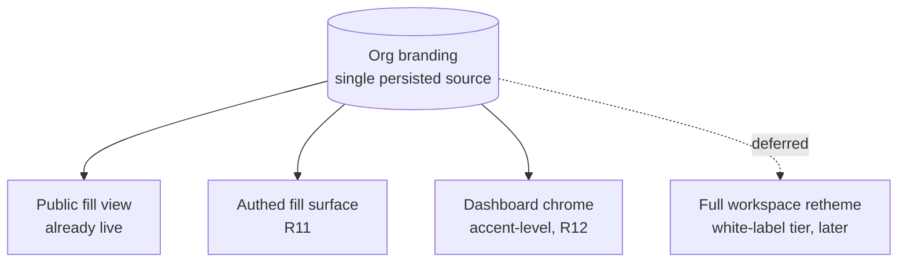
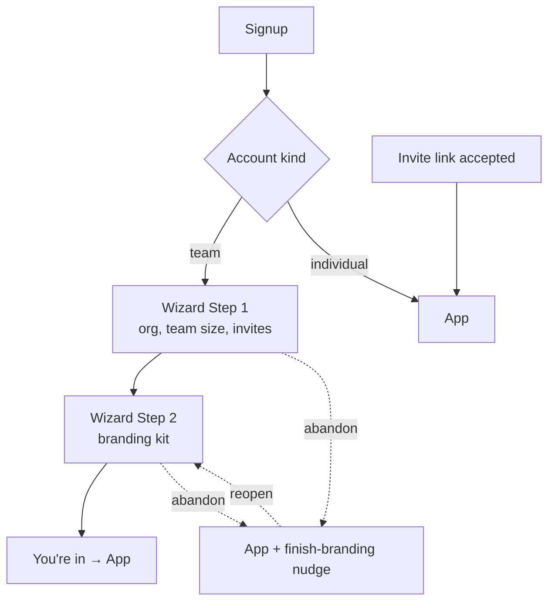
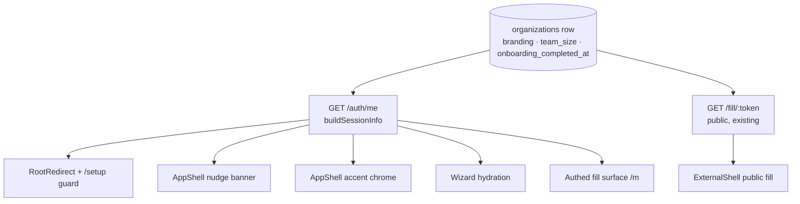
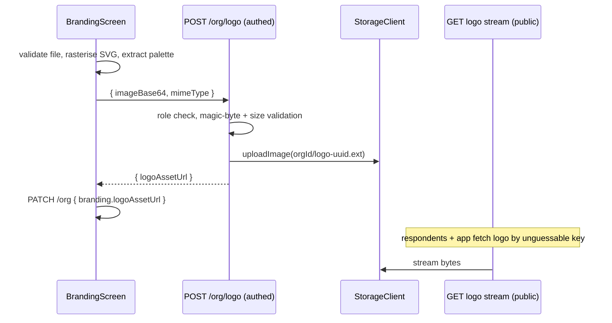

# Signup & Organisation Branding Onboarding - Plan

## Goal Capsule

- **Objective:** Make the existing setup wizard the real front door for self-serve team signups, ship a working branding kit (logo upload, palette pre-fill, Google Fonts), widen branding to the authed fill surface and accent-level dashboard chrome, and remove the Meridian placeholder identity.
- **Product authority:** Product Contract below (confirmed in brainstorm dialogue 2026-07-20). Planning Contract and Implementation Units govern the how; on conflict, the Product Contract wins.
- **Open blockers:** None. Remaining unknowns are execution-time details noted per unit.
- **Stop conditions:** Surface a blocker instead of guessing if implementation contradicts a Product Contract requirement, or if a schema/migration change beyond `team_size`/`onboarding_completed_at` appears necessary.

---

## Product Contract

### Summary

Route every new team signup into the already-built but unreachable setup wizard, where they confirm their auto-provisioned organisation, capture team size, invite teammates, and set a persisted branding kit. Branding then applies beyond the public fill view: to the authed fill surface and to accent-level dashboard chrome, delivered through the shared brand-token pipeline so full workspace theming can become a later white-label-tier feature.

### Problem Frame

The prototype promised a three-step onboarding (Organisation, Branding kit, You're in), and the wizard screens exist in the app at `/setup` and `/setup/branding` — but nothing routes into them. Signup provisions the org server-side and drops the user straight into the app, so no one ever names their org properly, invites teammates at the moment of highest intent, or sets branding. The branding data model is real and persisted, yet its logo upload is a stub, its font choice is a four-item preset list, and it only renders on the public fill view. Meanwhile "Meridian Operations" placeholder strings leak a demo identity into the product. The result: the product's core pitch — "forms carry your brand" — is undeliverable through the actual signup path.

### Key Decisions

- **Orgs stay auto-provisioned at signup; the wizard edits, it does not create.** Signup already creates the org and owner membership server-side. The wizard operates on that org rather than deferring creation, avoiding an org-less limbo state every screen would have to handle.
- **Wizard is required once, resumed softly.** Team signups route into the wizard immediately after account creation. Abandoning it mid-way lands the user in the app on next login with a persistent nudge to finish branding — no forced re-entry loop.
- **Branding is free at every tier; white-label stays paid.** Logo, colours, and font become a base feature and the product hook. Custom domain and sender email remain plan-gated.
- **Google Fonts picker instead of font upload.** Near-total coverage of real brand fonts without file storage, `@font-face` serving of arbitrary files, or font-licensing exposure. Font upload is specced as a follow-on phase.
- **Accent-level chrome, built token-ready.** The dashboard takes the org's logo, name, and brand colour on primary actions only — through the same brand-token pipe the fill view uses — keeping the blast radius contained when a customer palette is loud, while leaving full workspace retheme available as a future white-label-tier feature.
- **PDF/export branding is dropped from this effort.** Exports are overlays drawn onto the customer's own original PDF, so there is nothing meaningful to brand until a from-scratch export pipeline exists.

### Actors

- A1. **Org owner** — signs up self-serve as a team, runs the wizard, owns branding.
- A2. **Invited teammate** — joins via invite link; never sees the wizard.
- A3. **Individual user** — signs up with an individual account; skips the wizard.
- A4. **External respondent** — fills public forms; sees the org's branding, never the app.

### Requirements

**Signup and wizard entry**

- R1. A successful team signup routes the new owner into the setup wizard before the app; individual signups and invite acceptances go straight to the app.
- R2. Wizard Step 1 edits the already-provisioned org: confirm or rename it, set team size, and optionally invite teammates by email and role.
- R3. Team size is persisted on the organisation.
- R4. Invites added in Step 1 are sent through the existing team-invite mechanism, honouring seat limits.
- R5. Abandoning the wizard lands the user in the app on next login with a persistent nudge that reopens branding setup; completing the wizard means it is never shown again.

**Branding kit**

- R6. Logo upload works end-to-end: an image file is uploaded, stored, and its public URL persisted on the org's branding.
- R7. On logo upload, dominant colours are extracted and pre-fill the primary, secondary, and accent palette; the owner can override any of them.
- R8. The form font is chosen from a Google Fonts picker (any Google Font), replacing the four-preset list; the chosen font renders on every branded surface.
- R9. Branding (logo, colours, font) is saveable at every plan tier; white-label fields (custom domain, sender email) remain plan-gated.
- R10. Branding remains editable after onboarding from the existing settings surfaces.

**Branding application**

- R11. The authed fill surface renders org branding with the same fidelity as the public fill view. (Clarification recorded below: no separate "internal fill" screen exists; the authed fill surface is the mobile fill experience plus wizard/white-label previews.)
- R12. The dashboard chrome shows the org's logo and name in the navigation and applies the brand colour to primary actions — nothing broader.
- R13. Chrome branding flows through the same shared brand-token pipeline as the fill views, so widening coverage later requires no re-architecture.
- R14. Wherever a brand colour carries text, contrast is resolved automatically (e.g. the accent-button label locks to a readable ink).

**Placeholder cleanup**

- R15. No "Meridian" identity remains in app code: the demo org fallback, the `forms.meridian.co` / `noreply@meridian.co` white-label defaults, the org-name placeholder, the `meridian-mark.svg` label, and the `'M'` org-initial default are replaced with org-derived or neutral values. Test fixtures keep the name — API tests assert on it.

### Key Flows

- F1. **First team signup**
  - **Trigger:** New user completes a team signup.
  - **Actors:** A1
  - **Steps:** Account and org are provisioned; owner lands in Step 1, confirms org name, sets team size, adds invites; continues to Step 2, uploads logo (palette pre-fills), adjusts colours, picks a font against the live preview; finishes and lands in the app with branding saved and invites sent.
  - **Covers:** R1, R2, R3, R4, R6, R7, R8, R9
- F2. **Abandon and resume**
  - **Trigger:** Owner closes the tab mid-wizard.
  - **Actors:** A1
  - **Steps:** Next login lands in the app; a persistent nudge offers to finish branding; opening it resumes branding setup hydrated with any already-saved branding — the Step 1 name and team size were already persisted at the Step 1 → 2 transition, so nothing typed there is lost; saving clears the nudge.
  - **Covers:** R5
- F3. **Teammate joins**
  - **Trigger:** Invited teammate opens their invite link.
  - **Actors:** A2
  - **Steps:** They accept, join the org, and land in the app — already inside a branded workspace, no wizard.
  - **Covers:** R1

### Acceptance Examples

- AE1. **Covers R1.** Given a new user picks an individual account, when signup succeeds, then they land in the app and never see `/setup`.
- AE2. **Covers R1.** Given a user accepts a team invite, when they finish account creation, then they land in the inviter's org with its branding already applied and no wizard.
- AE3. **Covers R5.** Given an owner abandoned the wizard after Step 1, when they next log in, then they land in the app with a visible nudge, and opening it resumes branding setup with their org name and any saved branding intact.
- AE4. **Covers R9.** Given an org on the lowest tier, when the owner saves logo, colours, and font in the wizard, then the save succeeds; when they attempt to set a custom domain, then it remains gated behind an upgrade.
- AE5. **Covers R7.** Given an owner uploads a logo, when extraction completes, then the palette fields are pre-filled from the logo's colours and remain editable.
- AE6. **Covers R14.** Given an org whose accent colour only passes contrast with dark text, when a primary button renders in the dashboard or a fill view, then its label automatically uses the readable ink.

### Scope Boundaries

**Deferred for later** (specced as follow-on phases below)

- Font file upload (self-hosted brand fonts).
- Trial/billing mechanics.
- Full workspace retheme as a white-label-tier "workspace theming" feature — this effort lays only the token plumbing.

**Out of scope**

- PDF/export branding — exports overlay the customer's own original PDF; revisit when a from-scratch export pipeline exists.
- Per-org branding before authentication (branded login pages, org subdomains).
- Org discovery or domain-based joining — invites are the only way into an existing org.
- Rebranding semantic colours (error, success, destructive states keep product colours everywhere).
- Multi-org membership UX. A user who owns org A and accepts an invite to org B has their session re-sealed to B by the existing accept flow; org A keeps its incomplete-onboarding state. No org switcher is built here.

### Follow-on Phases

- FP1. **Font file upload.** Orgs upload licensed brand fonts (woff2/ttf) that a curated picker cannot serve. Requires font file storage and serving, `@font-face` delivery on public fill pages, fallback behaviour when a font fails to load, and a stated position on licensing responsibility (the org warrants it holds a web-font licence). Builds on the R8 picker; the picker remains the default path.
- FP2. **Trial/billing mechanics.** Real payment integration replacing the dev-only tier switch: plan selection with payment, a time-boxed trial with a defined downgrade path, and seat-limit enforcement tied to the paid plan. Interacts with R9's "branding free at every tier" — that decision stands; trials gate white-label and seat count, not branding.
- FP3. **Workspace theming (full retheme).** A white-label-tier toggle that widens the R13 token pipeline to the whole app surface: tonal ramps derived from the brand palette, automatic contrast resolution across all derived shades, dark-mode variants, and semantic-colour protection. Depends on the token coverage R13 establishes.

### Dependencies / Assumptions

- Loading Google Fonts on public fill pages is acceptable as an external dependency; if respondent-privacy rules (e.g. GDPR font-embedding rulings) matter for target customers, revisit by self-hosting the selected font files (FP1 machinery would cover this).
- "Branding free at every tier" is implemented in plan configuration; billing itself stays dev-only until FP2.
- The existing invite, seat-limit, and branding persistence mechanisms are sound and are extended, not rebuilt.

---

## Planning Contract

**Product Contract preservation:** unchanged, with two clarifications — R11's "internal fill view" is pinned to the authed fill surface that exists (the mobile fill experience at `/m` plus wizard/white-label previews; no separate internal fill screen exists today), and R15 gained one extra cleanup site (the `'M'` org-initial default) found during research.

### Key Technical Decisions

- KTD1. **Route team signups client-side at signup, and expose onboarding state in the session for everything else.** `LoginScreen`'s signup and sign-in success handlers check the pending invite first (`takePendingInvite()` from `apps/web/src/lib/pending-invite.ts` — today only `RootRedirect` consumes it, and direct `navigate()` calls bypass it): a pending token routes to the invite accept screen, never `/setup`, so a new invitee is not captured in a wizard for their own auto-provisioned org (that org keeps incomplete onboarding by design). Otherwise branch on the locally-held `accountKind`: `team` → `/setup`, `individual` → `/app`. Re-login routing, the nudge, the `/setup` guard, and wizard hydration all need server truth, so `SessionInfo` (built in `apps/api/src/routes/auth.ts` `buildSessionInfo`) gains `accountKind`, `branding`, `teamSize`, and `onboardingCompletedAt`. Session is the single client-side source for org branding state.
- KTD2. **Onboarding completion is a nullable `onboarding_completed_at` timestamp on `organizations`.** Set when the wizard finishes (via `PATCH /org`). The nudge renders while it is null for a `team` org; individuals get it stamped at provisioning so they never nudge. The migration backfills `onboarding_completed_at = now()` for every organisation existing at migration time, so only post-feature signups enter the wizard/nudge flow — existing branded orgs never see the nudge or the `/setup` guard. Completion does not lock `/setup` re-entry while incomplete; post-completion branding edits use the settings surface (R10, U9).
- KTD3. **Introduce a distinct `whiteLabel` plan feature; do not reuse `branding`.** `PLAN_CONFIG` in `packages/db/src/plans.ts` currently has only `features.branding` (false for individual/team). Flipping it free without a new flag would silently free white-label too, because white-label has no feature flag of its own. Change: `branding: true` for all tiers; add `whiteLabel` (true only for business/enterprise); the branding gate in `PATCH /org` is removed. The flag's consumer is U9: the settings surface gates its white-label block on `features.whiteLabel`.
- KTD4. **Logo upload generalises the existing storage seam; serving is a public API stream route restricted to the logo namespace.** The `StorageClient` interface and both adapters (`supabase.ts`, `replit.ts`) are PDF-only with opaque asset IDs and no public URLs, while `logoAssetUrl` must work for logged-out respondents on public fill pages. Add a content-type-aware image upload to the storage interface with **flat** keys `${orgId}/logo-${uuid}.{ext}` — flat because the Supabase adapter's `deletePrefix` does a single-level list and would silently orphan a nested `logo/` folder at org deletion, while flat keys are covered by both adapters unchanged. Add an owner/admin-gated `POST /org/logo` accepting `{ imageBase64, mimeType }` (mirrors the PDF upload's base64 convention; records an audit entry like `PATCH /org`), and a public, unauthenticated `GET` streaming route that **rejects any key not matching the logo namespace** (`^[^/]+/logo-[^/]+\.(png|jpe?g|webp)$`) before touching storage — without that check, removing auth from `GET /pdf/asset/*`-style mechanics would let a leaked or guessed PDF asset key be replayed unauthenticated. `Content-Type` is derived from the key's extension (the adapters return bare bytes, no stored metadata) and the response carries `X-Content-Type-Options: nosniff`. When `PATCH /org` persists a `logoAssetUrl` that differs from the previous value, the previous logo object is best-effort deleted so superseded logos are not publicly reachable forever. Logos live in the existing bucket under the org prefix; `logoAssetUrl` stores the public route's relative URL, keeping it provider-portable across Supabase/Replit.
- KTD5. **Accepted logo formats: PNG/JPG/WebP ≤ 2 MB; SVG is rasterised client-side.** Serving user-supplied SVG from the app origin is a stored-XSS vector; rather than adding a server-side sanitiser dependency, the client converts a selected SVG to PNG via canvas — deriving raster dimensions from the SVG `viewBox` at a fixed target width (~512px, aspect preserved), since brand SVGs commonly lack width/height attributes and would otherwise rasterise 0×0 or 300×150; a zero-dimension result is a validation error. Validation happens client- and server-side: the server verifies the decoded buffer's magic bytes match the whitelisted format (client-declared MIME is attacker-controlled) and enforces the size cap.
- KTD6. **Font choice persists as a validated family name against a bundled Google Fonts catalog snapshot.** Replace `formFont: z.enum(FORM_FONTS)` with a string validated against a static catalog data file in `packages/shared`. The snapshot stores per-family **available weights** (not names alone): a bare-family css2 request serves only weight 400 while branded surfaces render 500–700, and requesting a weight a static family lacks fails the whole css2 request — so `ensureFontLoaded(family)` requests the intersection of the family's available weights with {400, 500, 600, 700}. The util injects the `fonts.googleapis.com/css2` stylesheet idempotently — used by the picker, the public fill shell, the wizard preview, and the authed fill surface — with the existing sans-serif fallback stack so a failed fetch degrades silently. `FONT_STACK`'s fixed record gives way to dynamic stack construction; the four existing presets remain quick picks; existing saved values stay valid. This also fixes the pre-existing bug where Spectral is offered but never loaded.
- KTD7. **Palette extraction runs client-side with no new dependency.** Downscale the uploaded logo to a small canvas, bucket pixel colours, pick the top distinct hues for primary/secondary/accent. On any failure, keep the current palette — extraction pre-fills, never blocks (AE5's "remain editable" is the contract).
- KTD8. **Step 1 persists on transition; invites send best-effort on finish, never blocking completion.** The Step 1 "Continue" transition persists `{ name, teamSize }` via `PATCH /org` — otherwise an owner who renames the org and sets team size, then abandons at Step 2, silently loses both (the nudge reopens Step 2 only). Invite rows stay local until "Finish setup", then send through the existing `POST /team/members` per row; per-row success/failure (including `seat_limit_reached` — a fresh team org has seatLimit 5 with 1 seat used) renders as a compact per-email results list **on the finish screen itself** (the Step 1 rows are off-screen by then), shown before the transition to `/app`; completion proceeds regardless.
- KTD9. **`/setup` gets a client-side guard.** Redirect to `/app` unless the session shows a `team` org, an owner/admin role, and incomplete onboarding. The routes currently render with `shell: 'none'` and no checks.
- KTD10. **Contrast tokens widen to the primary colour.** `orgBrandVars` computes `--org-accent-text` but nothing for text on `--org-primary` (used by fill mastheads and soon chrome). Add `--org-primary-text` via the same `contrastText` helper and use it wherever text sits on the primary (R14/AE6).

### High-Level Technical Design

Session-driven branding fan-out — one server truth, consumed by every surface:

Logo upload and serving path:

### Assumptions

- External web research was skipped: the two external technologies (Google Fonts CSS2 API, canvas-based colour extraction) are stable and well-known; their integration details are recorded as KTDs above rather than researched findings.
- The Google Fonts catalog snapshot (family names) is bundled as generated data; staleness is acceptable (new families appear rarely and absence only narrows the picker).
- `replit.md`'s description of a fixture-backed data layer is stale for these surfaces — the org, invite, and fill endpoints verified in research are real and are the ones extended.
- Team-size options adopt the prototype's ranges (`1–9`, `10–49`, `50–200`, `200+`) stored as a text column; exact labels are an execution-time detail.
- The nudge is dismissible per session (local state) and reappears on next login until onboarding completes.
- Team size is write-once via the wizard for now — no post-onboarding edit surface is built; add one to U9's branding block later if it proves needed.
- The Google Fonts catalog snapshot is generated offline (Google Fonts metadata requires an API key or a vendored metadata source) and committed as data; its generation script is an execution-time detail.

---

## Implementation Units

### U1. Schema and plan-config foundation

- **Goal:** Persist team size and onboarding completion; make branding free at every tier with a distinct white-label gate.
- **Requirements:** R3, R5, R9
- **Dependencies:** None.
- **Files:** `packages/db/src/schema/organizations.ts`, `packages/db/src/plans.ts`, new migration under `packages/db/drizzle/` (generated), `apps/api/src/auth/tenant-provisioning.ts`, `apps/api/src/routes/org.test.ts`
- **Approach:** Add nullable `team_size` (text) and `onboarding_completed_at` (timestamp) to `organizations`, mirroring the `0006_plan_tiers.sql` column-add pattern; the migration also backfills `onboarding_completed_at = now()` for all existing organisations (KTD2) so pre-existing team orgs never see the wizard, guard, or nudge. Run `pnpm db:generate` and commit the migration (CI fails on drift). In `PLAN_CONFIG`, set `branding: true` for `individual` and `team`; add `whiteLabel: boolean` per tier (business/enterprise only). Stamp `onboarding_completed_at` at provisioning for `individual` orgs (KTD2). Note: `packages/db` uses extensionless imports, unlike the rest of the repo.
- **Test scenarios:**
  - `PLAN_CONFIG` exposes `branding: true` for all four tiers and `whiteLabel` only for business/enterprise.
  - Provisioning an individual org sets `onboarding_completed_at`; a team org leaves it null.
  - Migration backfill: an org row created before the migration has `onboarding_completed_at` set after it runs (assert the migration SQL contains the backfill `UPDATE`).
- **Verification:** `pnpm db:generate` produces no further diff; API tests green.

### U2. Session payload and org PATCH widening

- **Goal:** Expose org onboarding/branding state to the client and let the wizard persist everything it edits.
- **Requirements:** R1, R3, R5, R9, R10
- **Dependencies:** U1
- **Files:** `packages/shared/src/org.ts`, `apps/api/src/routes/auth.ts`, `apps/api/src/routes/org.ts`, `apps/web/src/lib/data/store.ts`, `apps/web/src/lib/data/hooks.ts`, `apps/api/src/routes/org.test.ts`, `apps/api/src/routes/auth.test.ts` (or nearest existing auth test file)
- **Approach:** Extend `SessionInfo` and `buildSessionInfo` with `accountKind`, `branding`, `teamSize`, `onboardingCompletedAt`. Widen `PATCH /org`'s Zod body to accept `teamSize` and `onboardingComplete: true` (stamps the timestamp); remove the branding feature gate (KTD3) while keeping owner/admin role checks and audit recording. Update `OrgSettingsDto`, `store.updateOrg`, and hook types to match. Follow the co-located vitest pattern (`fakeDb()`, `createApp()` on port 0, `sealSession` cookie — note tests import it from `../auth/workos.js`).
- **Test scenarios:**
  - `GET /auth/me` returns `accountKind`, `branding`, `teamSize`, `onboardingCompletedAt` for a seeded org.
  - Covers AE4. `PATCH /org` with branding succeeds for a `team`-tier org (no 403).
  - `PATCH /org { teamSize: '10–49' }` persists and round-trips.
  - `PATCH /org { onboardingComplete: true }` stamps the timestamp once; repeat calls don't reset it.
  - Viewer/builder roles still get 403 on `PATCH /org`.
- **Verification:** API tests green; typecheck green across `packages/shared` consumers.

### U3. Logo upload and public serving

- **Goal:** Real logo upload end-to-end with a public URL that works for logged-out respondents.
- **Requirements:** R6
- **Dependencies:** U2
- **Files:** `apps/api/src/storage/index.ts`, `apps/api/src/storage/supabase.ts`, `apps/api/src/storage/replit.ts`, `apps/api/src/routes/org.ts` (or a new `apps/api/src/routes/assets.ts`), `apps/web/src/screens/onboarding/BrandingScreen.tsx`, `apps/web/src/lib/data/store.ts`, `apps/web/src/lib/data/hooks.ts`, `apps/api/src/routes/org.test.ts`
- **Approach:** Per KTD4/KTD5 — generalise `StorageClient` with a content-type-aware image upload using flat keys `${orgId}/logo-${uuid}.{ext}` (both adapters; flat so existing `deletePrefix` cleanup covers logos). `POST /org/logo` is owner/admin-gated (mirror `PATCH /org`'s role check), validates the decoded buffer's magic bytes against the PNG/JPG/WebP whitelist plus the 2 MB cap, records an audit entry, and returns the public relative URL. The public unauthenticated streaming GET rejects keys outside `^[^/]+/logo-[^/]+\.(png|jpe?g|webp)$` before touching storage, derives `Content-Type` from the key extension, and sets `X-Content-Type-Options: nosniff`. `PATCH /org` best-effort deletes the previous logo object when `logoAssetUrl` changes. Client: replace the `hasLogo` stub with a file input → client validation → SVG-to-PNG rasterisation (viewBox-derived dimensions per KTD5) → upload mutation (mirror `useCreateFillLink`'s mutation shape) → set `branding.logoAssetUrl` in wizard state. After a successful upload the control renders the uploaded image as a thumbnail in place of the initial swatch, with Replace and Remove actions (Remove clears `logoAssetUrl` back to the empty upload prompt). On upload failure show an inline error and let the user finish without a logo. Storage unconfigured (`null` client) returns the existing 503 `storage_unavailable` shape.
- **Test scenarios:**
  - Happy path: PNG within cap uploads, returns a URL under the public route, and the URL round-trips through `PATCH /org` branding.
  - Oversized payload → 4xx with a clear error code.
  - Declared-MIME/content mismatch (e.g. PDF bytes declared as `image/png`) and disallowed types (`image/svg+xml` reaching the server) → 4xx via magic-byte check.
  - Viewer/builder role on `POST /org/logo` → 403.
  - Public GET serves a valid logo key without auth with extension-derived content type and `nosniff`; a PDF-style key (`orgId/uuid.pdf`) → 404 without touching storage.
  - `PATCH /org` with a changed `logoAssetUrl` deletes the previous logo object (best-effort; deletion failure doesn't fail the PATCH).
  - Storage unconfigured → 503 `storage_unavailable`.
- **Verification:** API tests green; manual smoke — upload in the wizard shows the logo thumbnail and the live preview.

### U4. Google Fonts picker and dynamic font loading

- **Goal:** Any Google Font selectable, actually rendering on every branded surface; Spectral bug fixed by construction.
- **Requirements:** R8
- **Dependencies:** U2
- **Files:** `packages/shared/src/branding.ts`, new catalog data file in `packages/shared/src/`, `apps/api/src/routes/org.ts`, `apps/web/src/lib/branding.ts`, new font-loader util in `apps/web/src/lib/`, `apps/web/src/screens/onboarding/BrandingScreen.tsx`, `apps/web/src/screens/fill/ExternalShell.tsx` (or `FillScreen.tsx`), `apps/web/src/lib/branding.test.ts`
- **Approach:** Per KTD6 — bundle a catalog snapshot of family names **with per-family available weights**; validate `formFont` server-side against it (replacing the enum); build `--org-font` stacks dynamically with the generic fallback; `ensureFontLoaded(family)` builds the css2 URL from the intersection of the family's available weights with {400, 500, 600, 700}, injects the stylesheet idempotently, and is called from the picker (on selection), the public fill shell (from `orgBranding.formFont`), and the wizard preview. Picker UI: a listbox-filtered-by-text pattern — live-filtered results below the input, a "No fonts found" empty state, click/Enter/arrow-key selection, no free-text submission outside the catalog (matching the server-side validation) — with the four existing presets as quick picks.
- **Test scenarios:**
  - Server accepts a catalog family (e.g. `Lora`), rejects a non-catalog string and an injection-shaped value.
  - Existing four preset values still validate (backward compatibility with saved orgs).
  - `orgBrandVars` builds a stack for an arbitrary family and falls back cleanly for null branding.
  - Font-loader builds a css2 URL requesting only weights the family actually has (intersection with {400,500,600,700}); injects one stylesheet per family (idempotent); a fetch failure leaves the fallback stack rendering (unit-level: loader swallows the error).
- **Verification:** Web unit tests green (`branding.test.ts` extended); public fill page renders the chosen family in a manual smoke.

### U5. Wizard wiring: entry, guard, hydration, invites, completion

- **Goal:** The wizard becomes the real signup path — entered on team signup, guarded, resumable without data loss, sending invites, and stamping completion; wizard-file Meridian strings removed.
- **Requirements:** R1, R2, R3, R4, R5, R15
- **Dependencies:** U1, U2
- **Files:** `apps/web/src/screens/onboarding/LoginScreen.tsx`, `apps/web/src/screens/onboarding/OrgSetupScreen.tsx`, `apps/web/src/screens/onboarding/BrandingScreen.tsx`, `apps/web/src/lib/onboarding.tsx`, `apps/web/src/lib/pending-invite.ts`, `apps/web/src/components/AuthGate.tsx` (or a new guard component), `apps/web/src/lib/screens.ts`
- **Approach:** Signup and sign-in success handlers check `takePendingInvite()` first — a pending token routes to the invite accept screen (KTD1) — then branch on local `accountKind`: team → `/setup`, individual → `/app`; `RootRedirect` stays `/app`. Add the `/setup` guard (KTD9). Hydrate `OnboardingProvider` from session `branding`/`teamSize` instead of `DEFAULT_BRANDING` when present (fixes the resume-overwrites-saved-branding hazard). Step 1 "Continue" persists `{ name?, teamSize }` via `PATCH /org` (KTD8). "Finish setup" sends: `PATCH /org { branding, onboardingComplete: true }`, then best-effort invites per KTD8, rendering the per-email results list on the finish screen before the transition to `/app`. Meridian cleanup in these files: `DEMO_ORG_NAME` fallback, `forms.meridian.co`/`noreply@meridian.co` defaults, org-name placeholder, `meridian-mark.svg` label (the `'M'` initial default in the settings screen is U9's).
- **Execution note:** The invite send and completion stamp are behaviour changes riding on existing endpoints — prefer wiring through the existing `useInviteMember`/`useUpdateOrg` hooks over new fetch paths.
- **Test scenarios:**
  - Covers AE1. Individual signup navigates to `/app`, never `/setup`.
  - Covers AE2. A new user signing up with a pending invite token lands on the invite accept screen — never `/setup` — despite the signup form's `team` default.
  - Covers AE3. With saved branding in the session, opening `/setup/branding` shows the saved colours, not defaults; finishing preserves them; a Step 1 rename persisted at "Continue" survives an abandon-and-resume.
  - Guard: individual account, non-owner/admin role, or completed onboarding at `/setup` → redirected to `/app`.
  - Finish with two invites where one hits `seat_limit_reached`: completion proceeds, both results render on the finish screen.
  - No "Meridian" string remains under `apps/web/src/` outside tests (grep-level check).
- **Verification:** Typecheck/build green; manual smoke of F1 end-to-end on the dev stack (web :5000, API :8000 under Replit config; :5173/:8787 per README elsewhere).

### U6. Finish-branding nudge

- **Goal:** Abandoned wizards resurface softly in the app.
- **Requirements:** R5
- **Dependencies:** U2, U5
- **Files:** `apps/web/src/layouts/AppShell.tsx`, possibly a small banner component in `apps/web/src/components/`
- **Approach:** Banner in the authed shell when session shows `accountKind === 'team'`, null `onboardingCompletedAt`, and owner/admin role; links to `/setup/branding`; dismiss hides it for the session (local state only). Clearing is automatic once completion stamps (session invalidation on `useUpdateOrg` already refetches).
- **Test scenarios:**
  - Covers AE3 (nudge half): banner renders for an incomplete team owner; not for individuals, members, or completed orgs.
  - Dismiss hides it; a fresh session shows it again while incomplete.
- **Verification:** Web unit test if a test harness for components exists; otherwise manual smoke (no web CI job exists — see Risks).

### U7. Branding application: chrome and authed fill

- **Goal:** Accent-level dashboard chrome and the authed fill surface carry the brand through the token pipe.
- **Requirements:** R11, R12, R13, R14
- **Dependencies:** U2
- **Files:** `apps/web/src/lib/branding.ts`, `apps/web/src/layouts/AppShell.tsx`, `apps/web/src/screens/mobile/MobileScreen.tsx`, the U4 font-loader util, `apps/web/src/lib/branding.test.ts`
- **Approach:** Add `--org-primary-text` to `orgBrandVars` (KTD10) and use it where text sits on primary (fill masthead already does white-on-primary). Apply `orgBrandVars(session.branding)` at the `AppShell` root; render the logo image when `logoAssetUrl` is set (else the initial), keep the org name, and move primary action buttons to `var(--org-accent)`/`var(--org-accent-text)`. Wrap the mobile fill surface with the same vars from session **and call `ensureFontLoaded(session.branding.formFont)` there** — without it the authed fill surface names a family whose stylesheet was never injected and silently falls back, breaking R11's fidelity parity. Nothing else in the chrome takes brand colour (R12's "nothing broader"). Verify tokens behave under the existing dark mode toggle.
- **Test scenarios:**
  - Covers AE6. `orgBrandVars` yields a dark ink `--org-accent-text` and `--org-primary-text` for light colours, white for dark ones (extend the existing pure unit test).
  - The authed fill surface invokes the font loader with the session's `formFont` (unit-level).
  - Null branding renders the shell with product defaults (no broken vars).
- **Verification:** Web unit tests green; manual smoke — loud-palette org shows readable buttons in light and dark mode.

### U8. Palette extraction pre-fill

- **Goal:** Uploading a logo pre-fills the brand palette.
- **Requirements:** R7
- **Dependencies:** U3
- **Files:** new extraction util in `apps/web/src/lib/`, `apps/web/src/screens/onboarding/BrandingScreen.tsx`, unit test alongside the util
- **Approach:** Per KTD7 — canvas downscale + colour bucketing, pure function from image data to `{ primary, secondary, accent }` hexes; called on successful upload; failure (CORS-tainted canvas, monochrome logo, thrown error) leaves the palette untouched. Pre-fill overwrites only fields still at their default values, so a user's manual picks survive a re-upload.
- **Test scenarios:**
  - Covers AE5. A synthetic multi-colour image yields three distinct hexes; fields update and stay editable.
  - Extraction failure leaves the existing palette unchanged.
  - Re-upload after manual colour edits does not clobber the edited fields.
- **Verification:** Web unit tests green; manual smoke with a real logo.

### U9. Settings surface: branding block free, white-label block gated

- **Goal:** Post-onboarding branding editing works for every tier, and R9's "white-label stays gated" has an actual implementation site once the old `PATCH /org` gate is removed.
- **Requirements:** R9, R10, R15
- **Dependencies:** U2, U3
- **Files:** `apps/web/src/screens/enterprise/WhiteLabelScreen.tsx`, `apps/web/src/lib/screens.ts` (nav label), `apps/web/src/lib/data/hooks.ts` (billing/features read if not already exposed)
- **Approach:** Split the existing screen (today the only post-onboarding branding surface, nav-labeled "White-label settings" and shown to every tier) into an always-visible **branding block** — colours, font picker, and a logo section reusing U3's upload control, closing the gap that no post-wizard logo edit exists — and a **white-label block** (custom domain, sender email) gated on `features.whiteLabel` from the billing/features read: disabled with an upgrade CTA when false. Rename the nav entry to "Branding" so free-tier owners aren't routed to a page named for a feature they don't have. Replace the screen's `?? 'M'` org-initial default (the second R15 site the Meridian grep can't catch).
- **Test scenarios:**
  - Covers AE4 (gated half). On an individual/team-tier org the white-label block renders disabled with an upgrade CTA; on business/enterprise it is editable.
  - The branding block (colours, font, logo) renders enabled at every tier.
  - Test expectation for the nav rename: none — covered by the tier-gating tests above and typecheck.
- **Verification:** Web unit tests green (if a component harness exists; otherwise manual smoke per the no-web-CI risk); typecheck green.

---

## Verification Contract

| Gate | Command | Applies to |
|---|---|---|
| Typecheck | `pnpm typecheck` | all units |
| Build | `pnpm build` | all units |
| API tests | `pnpm --filter @formai/api test` | U1, U2, U3, U4 (server side) |
| Web unit tests | `pnpm --filter @formai/web test` | U4, U6, U7, U8, U9 |
| Migration drift | `pnpm db:generate` produces no diff (CI-enforced) | U1 |
| Boot smoke | CI's API boot smoke passes | U1–U3 |

CI (`.github/workflows/ci.yml`) runs typecheck → build → API tests → boot smoke → Drizzle drift. There is no web test job in CI; web unit tests are still required locally per unit. Meridian sweep check: `rg -l Meridian apps/ --glob '!*.test.*'` returns nothing.

---

## Definition of Done

- All units U1–U9 implemented in dependency order; every Verification Contract gate green.
- Acceptance Examples AE1–AE6 demonstrably satisfied (tests where scenario-mapped above; manual smoke for the end-to-end F1 flow).
- The generated Drizzle migration is committed; CI drift check green.
- No "Meridian" string in non-test app code; test fixtures untouched.
- No abandoned experimental code from dead-end approaches remains in the diff.
- Follow-on phases FP1–FP3 remain unimplemented (they are specs, not scope).

---

## Risks & Dependencies

- **No web test job in CI.** New client logic (routing branch, font loader, extraction) is guarded only by locally-run vitest; a regression could pass CI. Mitigation: keep client logic in pure, unit-tested modules; consider a follow-up CI job (out of scope here).
- **Auth module duality.** Tests import `sealSession` from `auth/workos.js` while `replit.md` describes Replit auth; confirm the active auth module when writing U2 tests and mirror `org.test.ts` exactly.
- **Storage may be unconfigured in dev.** `STORAGE_PROVIDER` unset → logo upload 503s; the wizard must degrade gracefully (finish without logo), which U3's failure path covers.
- **Env/port drift.** README says web :5173 / API :8787; `replit.md` overrides to :5000/:8000 with a Vite proxy. Use the environment's actual config for smokes.

---

## Sources / Research

- Wizard screens and routes: `apps/web/src/screens/onboarding/OrgSetupScreen.tsx`, `apps/web/src/screens/onboarding/BrandingScreen.tsx`, `apps/web/src/lib/screens.ts`, `apps/web/src/router.tsx`.
- Signup and org provisioning: `apps/api/src/routes/auth.ts`, `apps/api/src/auth/tenant-provisioning.ts` (individual → `planTier 'individual'`, team → `'team'` seatLimit 5).
- Branding model and persistence: `packages/shared/src/branding.ts`, `packages/db/src/schema/organizations.ts`, `apps/api/src/routes/org.ts` (gate at lines ~60–75), `apps/web/src/lib/onboarding.tsx`.
- Plan features: `packages/db/src/plans.ts` (`PLAN_CONFIG`; `branding` false for individual/team today; no white-label flag exists).
- Brand token pipe: `apps/web/src/lib/branding.ts` (`orgBrandVars`, `FONT_STACK`, `contrastText`), consumers `apps/web/src/screens/fill/ExternalShell.tsx`, `apps/api/src/routes/fill-links.ts`.
- Storage seam: `apps/api/src/storage/index.ts` (`STORAGE_PROVIDER` selection, `StorageClient` PDF-only), `apps/api/src/storage/supabase.ts`, `apps/api/src/storage/replit.ts`, upload/serve exemplars `apps/api/src/routes/pdf.ts`.
- Invites and seats: `apps/api/src/routes/team.ts` (`seat_limit_reached` 403 shape, `emailSent` best-effort), `apps/api/src/routes/invites.ts` (accept re-seals session), client `apps/web/src/lib/data/hooks.ts` (`useInviteMember`).
- App chrome and theming: `apps/web/src/layouts/AppShell.tsx` (org initial, hardcoded "Business plan" subtitle, `useTheme` dark mode), `packages/ui/tokens/fonts.css` (css2 import missing Spectral).
- Test pattern: `apps/api/src/routes/org.test.ts` (`fakeDb`, `createApp`, `sealSession` from `auth/workos.js`); CI: `.github/workflows/ci.yml` (typecheck, build, API tests, boot smoke, Drizzle drift).
- Migration exemplar: `packages/db/drizzle/0006_plan_tiers.sql`; commands `pnpm db:generate` / `pnpm db:migrate` (README).
- Fill/PDF export basis for scope exclusion: `apps/api/src/pdf/round-trip.ts`, `apps/api/src/routes/pdf.ts`.
