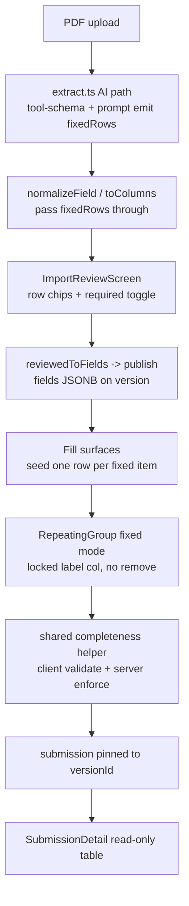
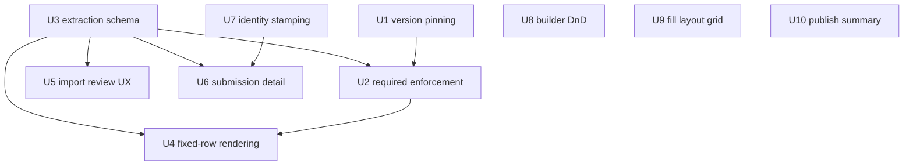

# Import-to-fill integrity: fixed-row checklists, required enforcement, layout, DnD - Plan

## Goal Capsule

- **Objective:** Close the eight gaps found in the 2026-07-20 manual review of the PDF import → builder → fill → submission pipeline, so an imported compliance checklist (e.g. ADMN-FRM-111 Light Vehicle Pre-start) is actually fillable and enforceable end to end.
- **Authority:** This plan's Product Contract; repo conventions (TypeScript strict, Zod, extractable pure modules for web logic, no-fake-success rule from the 2026-07-16 wiring plan); user-confirmed scope from the planning synthesis.
- **Execution profile:** Code changes across `packages/shared`, `packages/db`, `packages/ui`, `apps/api`, `apps/web`. Subagent-per-unit execution is safe; U-ID dependencies below drive ordering.
- **Stop conditions:** Any change that would require reworking auth/session handling (auth churned twice recently — surface instead of guessing); any extraction-prompt change that alters live re-import results for existing non-checklist PDFs (the mocked API tests only guard parse/normalize); any need to alter the public fill-link token model.
- **Tail ownership:** Standard ce-work shipping tail (quality gates, code review, PR).

---

## Product Contract

### Summary

Fix the import-to-fill pipeline so fixed checklist items survive extraction and render as locked rows with per-row OK/NA, required fields are enforced server-side against the version the filler actually saw, fill surfaces honor builder column widths, the builder gets real drag-and-drop, submissions stamp verified submitter identity, and the import review/publish screens report honest numbers.

### Problem Frame

A production review (screenshots + screen recordings, 2026-07-20) of importing a real Charles Hull pre-start checklist found the published form can't do its job: the source PDF's fixed checklist items (Engine oil level, Park brake, …) are discarded by the extraction prompt ("never enumerate blank paper rows"), leaving empty "Add row" tables; nothing is required so a blank pre-start submits; the fill view ignores the 12-column layout built in the builder; the builder's drag grip is decorative (no DnD library exists) and dragging shows a blocked cursor; the publish summary hardcodes "incl. 1 repeating table" when four exist; submissions trust client-supplied identity; and the review step's "All confirmed · 89% average" hides the lowest-confidence field. A prior concern — that the import wizard silently used fixture data — was verified false: PR #21 (2026-07-16) wired the real API; these are schema/design gaps, not wiring gaps.

### Requirements

**Fixed-row checklists**
- R1. Extraction captures fixed checklist item labels: the AI path emits an ordered `fixedRows` list for tables whose rows are pre-printed items rather than open entry rows.
- R2. Fill surfaces render a fixed-row table pre-seeded with one locked row per item: the label cell is read-only, fixed rows cannot be removed, and fillers may append (and remove) ad-hoc extra rows below the fixed set.
- R3. Tables without `fixedRows` behave exactly as today (backward compatible: existing published versions never change behavior).

**Required enforcement**
- R4. The import review step lets the reviewer toggle `required` per field; extracted fixed-row checklist tables default to required (the reviewer can untoggle); the builder's existing toggle continues to work.
- R5. The server rejects non-draft submissions missing required answers — on both the authed and public fill-link routes — validating against the pinned version's fields, never the template's current version. A draft may save incomplete, but cannot transition to `approved`/`rejected` without passing the same check.
- R6. A required fixed-row table counts as answered only when every fixed row has at least one non-label cell answered; ad-hoc rows are exempt. One shared helper implements this rule for client and server.
- R7. Required-failure responses identify the offending fields, and all three fill surfaces map them to per-field errors (no generic "check your connection" toast for validation failures).

**Version integrity**
- R8. Authed submissions pin the version rendered to the filler (client sends `versionId`; server rejects cross-template mismatches, accepts stale same-template versions, mirroring the public fill-link route).
- R9. Republishing a form carries `sourcePdfAssetId` forward so round-trip export survives post-publish edits.

**Layout and builder**
- R10. Fill surfaces (public fill, mobile, builder preview) honor `colSpan` in a 12-column grid; repeating tables and signatures always span full width; narrow containers collapse to full width.
- R11. The builder supports pointer drag-and-drop field reordering with a real, focusable grip handle; Alt+Arrow remains the keyboard reorder path.

**Honest reporting**
- R12. The publish summary and success toast state the actual repeating-table count.
- R13. The import review header surfaces the lowest-confidence still-unconfirmed field, linked so selecting it scrolls the list/overlay to that field.

**Identity**
- R14. Authed submissions stamp the session user's id and identity server-side, overriding any client-supplied name/email; public fill-link submissions keep claimed free-text identity with a null user reference.
- R15. Submission detail shows the stamped identity (preferring the verified user over free-text) and renders checklist tables read-only per row, so reviewers can see per-item results instead of "N rows captured".

### Scope Boundaries

**Deferred to Follow-Up Work**
- Builder-side editing of `fixedRows` (add/rename/remove items post-import — re-import to change; the builder today has no repeating-table editing UI at all).
- Creating repeating tables from scratch in the builder (palette/type options exclude `repeating_group`).
- jsdom/component tests for web (repo convention is node-env pure-module tests; browser smoke covers components).
- Multipart PDF upload, rate limiting on public fill routes, competency gating for external fill-link submitters, mobile Pass/Fail card renderer (all carried from the 2026-07-16 plan's deferred list).
- Round-trip PDF export for AI-extracted forms (no field positions; acknowledged limitation surfaced in the UI).
- Staleness bound / required-set diff for stale-version submissions: stale same-template versions are accepted by design so open fill tabs survive republish, which also means a deliberately stale client can submit under an older, weaker `required` set — accepted for v1, revisit if abused.

**Outside this product's identity**
- Drawn e-signature capture (identity stamping replaces it for authed users; the source form has no signature field).

### Acceptance Examples

- AE1. **Fixed checklist fill.** Given an imported form whose Category A table has 7 `fixedRows` and OK/NA checkbox columns, when a filler opens the fill link, then 7 locked rows render with their item labels, and when the table's field is required, submit is rejected (client and server) until every fixed row has OK or NA answered.
- AE2. **Stale version, same template.** Given a mobile fill opened before a republish, when the filler submits with the old `versionId`, then the server accepts, pins the old version, and validates required-ness against the old version's fields.
- AE3. **Spoofed identity.** Given an authed mobile submission whose body claims `submitterName: "Someone Else"`, when it is accepted, then the stored submission carries the session user's id and display identity, not the claimed name.
- AE4. **Legacy table untouched.** Given a form version published before this change (no `fixedRows`), when it is filled, then the table shows "No rows yet." and "Add row" exactly as today.
- AE5. **Required by default.** Given a fixed-row checklist import confirmed without touching any required toggle, when it is published and a filler submits without answering the checklist, then the submission is rejected — the checklist published as required.

---

## Planning Contract

### Key Technical Decisions

- KTD1. **`fixedRows: string[]` on the field, labels in the first column.** The first column becomes the read-only label column for fixed rows; no new `labelColumnKey` marker in v1. Rationale: matches the source-form shape (item name + result columns), keeps the extraction tool schema simple, and stays optional/backward-compatible in the unvalidated `fields` JSONB. The pinned version's `fixedRows` is authoritative over stored cells: the server canonicalizes fixed-row label cells from `fixedRows` on accept, and read surfaces derive labels from the version's fields — stored label cells are denormalized display data only, so tampered or short row arrays cannot misrepresent the checklist.
- KTD2. **Completeness rule lives in `packages/shared`.** One pure helper (required-ness + fixed-row completeness) imported by web validation, the mobile progress counter, and both API submit routes, so client and server cannot drift. Per-cell answeredness is typed: text = non-whitespace; number = any number (0 counts); checkbox = `true` only; `boolean_yes_no` in fixed-row tables = explicit `true` or `false` after input (seeded `null` = unanswered, so an honest "No" is recordable). A fixed-row table value with fewer rows than `fixedRows` counts the missing rows as unanswered. The helper also exposes incomplete fixed-row indices so surfaces can highlight the exact rows. Tested from the API package (shared has no test runner).
- KTD3. **Authed submit adopts `versionId` echo.** `POST /submissions` requires `versionId`; cross-template mismatch → 409; stale same-template accepted — mirroring `fill-links.ts`'s existing pin logic. Without this, required enforcement validates against fields the filler never saw. Accepted residual risk: a client holding (or deliberately choosing) a stale version submits under that version's weaker `required` set; bounding staleness is deferred (see Scope Boundaries).
- KTD4. **Required-failure contract: `400 {error:'required_fields_missing', fields:[ids]}`.** Distinct from Zod's `invalid_request` shape errors; clients map ids into their existing per-field `errors` state. Fixes MobileScreen's misleading "check your connection" toast for validation failures (no-fake-success rule).
- KTD5. **Identity: stamp `submittedByUserId` from `req.tenant`, never trust the body.** Nullable column (public fill-links have no user); display prefers the users-join identity, falls back to free-text `submitterName`. Email is never an authorization input or join key (Replit-Auth-era emails are synthetic; auth has churned twice — verify current session shape in `apps/api/src/auth/` before wiring).
- KTD6. **DnD via dnd-kit, pointer-only; Alt+Arrow stays the keyboard path.** New `reorder {from,to}` reducer action with arrayMove semantics (the existing `move` is an adjacent swap and can't express drops). Suppress dnd-kit's keyboard sensor to avoid two competing keyboard models; the grip becomes a real focusable handle whose `aria-label` names the Alt+Arrow alternative.
- KTD7. **Layout: shared span resolution, container-aware collapse.** A pure `resolveFillSpan(field, narrow)` maps `colSpan` → grid span: repeating tables and signatures always 12; `narrow` containers (the 390px mobile frame — a container, so viewport breakpoints don't apply) always 12; public fill uses viewport-responsive classes (all-12 below `sm`); builder PreviewMode computes `narrow` from its container-width slider (`state.container.maxWidth < 640`) — its preview frame is a container too, so viewport classes would show a layout real narrow fills wouldn't.
- KTD8. **Min-confidence stat computed over unresolved fields only (`resolved !== true`).** `confirmTable` marks `resolved` without touching confidence, and `setType` bumps confidence only from `low` status (`import-session.ts:208-221`) — so filter on the existing resolved/reviewStatus state; a confidence-based filter would keep confirmed tables in the stat forever.
- KTD9. **Extraction prompt distinguishes checklist tables from open-entry tables.** The current instruction ("extract repeating tables ONCE… never enumerate blank paper rows") stays for genuinely blank row-entry tables; a new instruction captures pre-printed item labels in order as `fixedRows`. Golden tests guard against regression on existing fixtures.

### High-Level Technical Design

Fixed-row data flow (R1–R3, R6):

Unit dependencies:

---

## Implementation Units

Unit Index:

| U-ID | Title | Key files | Depends on |
|---|---|---|---|
| U1 | Authed version pinning + sourcePdfAssetId carry-forward | `apps/api/src/routes/submissions.ts`, `apps/api/src/routes/forms.ts`, `apps/web/src/screens/mobile/MobileScreen.tsx` | — |
| U2 | Shared completeness helper + server required enforcement | `packages/shared/src/`, `apps/api/src/routes/submissions.ts`, `apps/api/src/routes/fill-links.ts`, `apps/web/src/lib/validation.ts`, `FillScreen.tsx`, `MobileScreen.tsx` | U1, U3 |
| U3 | fixedRows extraction schema + prompt | `packages/shared/src/form-field.ts`, `packages/shared/src/extraction.ts`, `apps/api/src/pdf/tool-schema.ts`, `apps/api/src/pdf/extract.ts` | — |
| U4 | Fixed-row fill rendering + seeding | `packages/ui/src/components/RepeatingGroup.tsx`, `apps/web/src/screens/fields/FieldRenderer.tsx` | U2, U3 |
| U5 | Import review UX: required toggle, row chips, min-confidence | `apps/web/src/screens/import/ImportReviewScreen.tsx`, `apps/web/src/lib/data/import-session.ts` | U3 |
| U6 | Submission detail: read-only tables + identity display | `apps/web/src/screens/SubmissionDetailScreen.tsx` | U3, U7 |
| U7 | Submitter identity stamping | `packages/db/src/schema/submissions.ts`, migration, `apps/api/src/routes/submissions.ts`, `apps/api/src/routes/fill-links.ts` | — |
| U8 | Builder drag-and-drop | `apps/web/src/screens/builder/reducer.ts`, `BuilderScreen.tsx`, `apps/web/package.json` | — |
| U9 | Fill layout grid (colSpan) | shared span helper, `FillScreen.tsx`, `MobileScreen.tsx`, `BuilderScreen.tsx` preview | — |
| U10 | Publish summary table count | `apps/web/src/screens/import/ImportPublishScreen.tsx` | — |

### U1. Authed version pinning + sourcePdfAssetId carry-forward

- **Goal:** Submissions record the version the filler saw; republish stops destroying round-trip export.
- **Requirements:** R8, R9.
- **Dependencies:** none.
- **Files:** `apps/api/src/routes/submissions.ts`, `apps/api/src/routes/forms.ts` (version-create insert ~line 259), `apps/web/src/screens/mobile/MobileScreen.tsx` (submit body ~121), `apps/web/src/lib/data/types.ts`, `apps/web/src/lib/data/store.ts`, `apps/web/src/lib/data/hooks.ts`, tests `apps/api/src/routes/submissions.test.ts`, `apps/api/src/routes/forms.test.ts`.
- **Approach:** Add required `versionId` to the authed submit body schema; resolve/pin it with the same mismatch rules as `fill-links.ts:283-295` (409 `version_mismatch` on cross-template, accept stale same-template). Carry `sourcePdfAssetId` from the previous current version in `POST /forms/:id/versions`. MobileScreen sends the version id it rendered — this needs web data-layer plumbing the DTO currently drops: map `currentVersionId` through `FormSummary`/`FormDetail` (`types.ts`), add `versionId` to `useSubmitInspection`'s input (`hooks.ts`) and `store.submitInspection`'s POST body (`store.ts`).
- **Patterns to follow:** `apps/api/src/routes/fill-links.ts` version-echo handling; existing route test style in `submissions.test.ts`.
- **Test scenarios:**
  - Submit with the current version id → 201, submission pinned to it.
  - Submit with a stale version id of the same template → 201, pinned to the stale version (AE2).
  - Submit with a version id belonging to another template → 409 `version_mismatch`.
  - Submit with no `versionId` → 400 `invalid_request`.
  - Republish a form whose previous version had `sourcePdfAssetId` → new version carries it; previous version untouched.
- **Verification:** `pnpm --filter @formai/api test`; typecheck.

### U2. Shared completeness helper + server required enforcement

- **Goal:** A blank pre-start can no longer be submitted, on any surface, and failures name the fields.
- **Requirements:** R5, R6, R7 (R4's toggle ships in U5; the builder toggle already exists).
- **Dependencies:** U1 (pinned version to validate against), U3 (`fixedRows` type for the completeness rule).
- **Files:** new `packages/shared/src/submission-validation.ts` (+ export), `apps/api/src/routes/submissions.ts`, `apps/api/src/routes/fill-links.ts`, `apps/web/src/lib/validation.ts` (delegate to shared helper), `apps/web/src/screens/mobile/mobile-fill.ts` (`answeredCount` consumes the shared predicate), `apps/web/src/screens/fill/FillScreen.tsx` (~78 error mapping), `apps/web/src/screens/mobile/MobileScreen.tsx` (~134 error mapping), tests in `apps/api/src/routes/submissions.test.ts`, `fill-links.test.ts`.
- **Approach:** Pure helper `missingRequiredFields(fields, values)` implementing KTD2's rule (skip `section_header`; fixed-row tables per R6), plus an answered-ness predicate consumed by `isAnswered`/`answeredCount` (`validation.ts`, `mobile-fill.ts`) so the progress bar doesn't count seeded-untouched checklists, and an incomplete-row-indices accessor for U4's per-row highlighting. Both submit routes call it for non-draft submissions against the pinned version's fields and return KTD4's contract; `PATCH /submissions/:id` refuses to move a `draft` to `approved`/`rejected` unless the same check passes against the pinned version (closes the draft-then-approve bypass — no other finalize path exists). Clients map `required_fields_missing` ids into their existing `errors` state; MobileScreen's catch distinguishes 400 validation from network errors.
- **Patterns to follow:** `apps/web/src/lib/validation.ts` (React-free by design); `submissionValueSchema` runtime-mirror precedent in `submissions.ts:88-107`.
- **Test scenarios:**
  - Required text field absent/empty → 400 `required_fields_missing` listing that id (authed and public routes).
  - `section_header` marked required → never reported missing.
  - `status:'draft'` body → enforcement skipped.
  - Required fixed-row table with one row lacking any non-label answer → reported missing; same table with every fixed row answered but ad-hoc row empty → passes (R6).
  - Enforcement uses the pinned (stale) version's fields, not the current version's (companion to AE2).
  - Blank draft `PATCH`ed to `approved` → 400 `required_fields_missing`; complete draft → transition allowed.
  - Fixed-row table value with fewer rows than `fixedRows` → missing rows reported unanswered.
  - Seeded-untouched checklist → `answeredCount` counts the field unanswered (progress bar honest).
  - Helper unit tests (from api package): empty values; unchecked checkbox = unanswered; zero numeric = answered; whitespace-only text = unanswered; `boolean_yes_no` seeded `null` = unanswered, explicit `false` = answered.
- **Verification:** `pnpm --filter @formai/api test`, `pnpm --filter @formai/web test`; browser smoke: blank required submit shows per-field errors, no connection toast.

### U3. fixedRows extraction schema + prompt

- **Goal:** Fixed checklist item labels survive extraction.
- **Requirements:** R1, R3.
- **Dependencies:** none.
- **Files:** `packages/shared/src/form-field.ts` (~86), `packages/shared/src/extraction.ts` (~28), `apps/api/src/pdf/tool-schema.ts` (~14, 53), `apps/api/src/pdf/extract.ts` (prompt ~58-62, `normalizeField`/`toColumns` ~172-200), tests `apps/api/src/pdf/extract.test.ts`.
- **Approach:** Optional `fixedRows?: string[]` on `FormField` and `ExtractedField`; extend the tool `input_schema` and `EXTRACTION_PROMPT` per KTD9; pass through normalization. Treat empty array as absent. The tool-schema description and prompt must state that checklist tables still emit their item/label column as the FIRST `columns` entry (type text) in addition to `fixedRows`; `normalizeField` guards the invariant by prepending a synthetic text label column when `fixedRows` is present but `columns[0]` is not text. No API-route changes (fields are unvalidated JSONB, `forms.ts:105`).
- **Execution note:** The API's extraction tests mock the model (`vi.fn().mockResolvedValue`) — they guard the parse/normalize pipeline only and cannot detect prompt regressions. Extend them first for `fixedRows` mapping; prompt behavior is verified live (see Verification).
- **Patterns to follow:** existing tool-schema field definitions and normalization mapping in `extract.ts`.
- **Test scenarios:**
  - `normalizeField` maps `fixedRows` through; absent → undefined; `[]` → undefined.
  - Mocked AI response containing a checklist table with `fixedRows` → extraction session fields carry them in order.
  - Existing golden fixtures unchanged (regression).
- **Verification:** `pnpm --filter @formai/api test`; live-model check (requires `ANTHROPIC_API_KEY`): re-import a checklist PDF from `TestPDFS/` and confirm items captured, AND re-import at least one existing non-checklist PDF confirming no blank-row enumeration or field changes — the mocked tests cannot catch prompt regressions.

### U4. Fixed-row fill rendering + seeding

- **Goal:** Fixed-row tables render locked, pre-seeded rows on every fill surface.
- **Requirements:** R2, R3.
- **Dependencies:** U2 (completeness helper), U3 (types).
- **Files:** `packages/ui/src/components/RepeatingGroup.tsx`, `apps/web/src/screens/fields/FieldRenderer.tsx` (~178-186 value seeding), possibly a small pure seeding helper alongside `apps/web/src/lib/validation.ts`, tests in `apps/web/src/lib/` (pure modules).
- **Approach:** `RepeatingGroup` gains a fixed-rows mode: first column read-only with the item label, no remove control on fixed rows, "Add row" appends ad-hoc rows below (removable). Fixed rows carry a visual token (subtle sunken label-cell background + small lock icon) so locked vs ad-hoc rows read at a glance; in a required-error state the incomplete rows (indices from KTD2's helper) highlight individually instead of one generic message under the table. `boolean_yes_no` cells in fixed-row mode seed `null` and render an explicit Yes/No control so an honest "No" is recordable and counts as answered. Seed initial value with one row per fixed item at value-init (pure helper so it's testable). Fixed-row identity is positional (row i ↔ fixedRows[i]); ad-hoc rows follow.
- **Patterns to follow:** existing `minRows`/`readOnly` props in `RepeatingGroup.tsx`; per-column type rendering at 166-196.
- **Test scenarios:**
  - Seeding helper: field with 7 fixedRows and empty value → 7 rows with label cells filled; existing non-empty value → not re-seeded; field without fixedRows → untouched (AE4).
  - Completeness integration: seeded-untouched table fails `missingRequiredFields`; fully answered passes (shares U2's helper tests).
- **Verification:** `pnpm --filter @formai/web test`; browser smoke on fill link + mobile + builder preview: locked labels, no remove on fixed rows, add/remove works for ad-hoc rows.

### U5. Import review UX: required toggle, row chips, min-confidence

- **Goal:** The reviewer can mark fields required, see captured checklist items, and see the weakest extraction before confirming.
- **Requirements:** R4, R13 (+ R1 visibility).
- **Dependencies:** U3.
- **Files:** `apps/web/src/screens/import/ImportReviewScreen.tsx` (header card ~177-200, table panel ~346-370), `apps/web/src/lib/data/import-session.ts` (derived state ~192-195, `reviewedToFields` ~226-240), tests `apps/web/src/lib/data/import-session.test.ts`.
- **Approach:** Required toggle per field card (mirror the builder's Switch at `BuilderScreen.tsx:636-645`) writing into reviewed state; `reviewedToFields` carries `required` (defaulting fixed-row checklist tables to `required: true` per R4) and `fixedRows`. Table panel shows an item-count chip and the item labels, with inline editing of the item list (rename/add/remove labels) before publish — extraction recall isn't perfect, and re-importing the whole PDF to fix one label is the only alternative since builder-side editing stays deferred. Header adds "Lowest: <field> · N%" computed per KTD8, clicking it calls the existing `handleSelectField` scroll-sync.
- **Test scenarios:**
  - Derived min-confidence ignores resolved fields (`resolved: true` — confirm actions set `resolved`, never confidence); all resolved → stat hidden.
  - `reviewedToFields` output carries `required: true` when toggled and passes `fixedRows` through; a fixed-row checklist defaults to `required: true` untouched, and a reviewer untoggle carries through (AE5 companion).
  - Inline item edit: rename/add/remove updates `fixedRows` order-stably in reviewed state.
- **Verification:** `pnpm --filter @formai/web test`; browser smoke through an import.

### U6. Submission detail: read-only tables + identity display

- **Goal:** Reviewers see per-item checklist results and who really submitted.
- **Requirements:** R15.
- **Dependencies:** U3 (`fixedRows` on version fields for label derivation), U7 (stamped identity in DTO). `RepeatingGroup`'s existing `readOnly` prop already covers read-only rendering — U6 does not wait on U4 and can run in parallel with it.
- **Files:** `apps/web/src/screens/SubmissionDetailScreen.tsx` (`formatValue` ~194-205 — extract row-array rendering into a component/pure module), test for the extracted formatter in `apps/web/src/lib/`.
- **Approach:** Render row-array values as a read-only table via `RepeatingGroup`'s existing `readOnly` mode. For fixed-row tables, derive row labels from the pinned version's `fixedRows` (authoritative per KTD1), not the stored label cells. Show "Submitted by" with an explicit badge: a "Verified" pill for stamped session identities, a neutral "Unverified" pill for free-text public fill-link submissions.
- **Test scenarios:** formatter: row array → table model with column labels; scalar values unchanged; identity precedence (stamped user vs free-text vs neither).
- **Verification:** `pnpm --filter @formai/web test`; browser smoke on a submission with a checklist.

### U7. Submitter identity stamping

- **Goal:** Authed submissions carry server-verified identity.
- **Requirements:** R14.
- **Dependencies:** none.
- **Files:** `packages/db/src/schema/submissions.ts` (+ generated migration in `packages/db/drizzle/`), `apps/api/src/routes/submissions.ts` (insert ~149-159, `rowDto` ~20-31), `apps/api/src/routes/fill-links.ts` (public insert ~301-332), tests `apps/api/src/routes/submissions.test.ts`, `fill-links.test.ts`.
- **Approach:** Nullable `submittedByUserId` referencing users; authed route stamps it from `req.tenant.userId` and overwrites `submitterName`/`submitterEmail` from the session user's record (body values ignored); public route leaves it null and keeps claimed free-text. DTO exposes the stamped identity for U6. Run `pnpm db:generate` (CI fails on migration drift). Verify the current session/user shape in `apps/api/src/auth/` first — auth was rewritten twice recently.
- **Test scenarios:**
  - Authed submit stores session `userId`; body-supplied spoofed name is overridden (AE3).
  - Public fill-link submit stores null user id and the claimed name.
  - DTO includes the stamped identity; migration applies cleanly (drift check).
- **Verification:** `pnpm --filter @formai/api test`; CI migration-drift step green.

### U8. Builder drag-and-drop

- **Goal:** The grip handle actually drags; reordering is no longer arrow-buttons-only.
- **Requirements:** R11.
- **Dependencies:** none.
- **Files:** `apps/web/package.json` (add `@dnd-kit/core`, `@dnd-kit/sortable`), `apps/web/src/screens/builder/reducer.ts` (new `reorder` action near `move` ~196-203), `apps/web/src/screens/builder/BuilderScreen.tsx` (canvas ~293, FieldCard grip ~379), tests `apps/web/src/screens/builder/reducer.test.ts`.
- **Approach:** Per KTD6: `DndContext` + `SortableContext` over the linear field order (order is the source of truth; the 12-col grid is just presentation), pointer sensor only, drop dispatches `reorder {from,to}` (arrayMove). Drop target renders as a thin accent line at the insertion boundary in linear field order (not per-visual-row — the wrapping grid makes visual-row targets ambiguous), with a `DragOverlay` rendering the dragged FieldCard at reduced opacity. Grip becomes the sortable activator — focusable, `aria-label` naming Alt+Arrow. Disable DnD in preview mode. Keep `move`/Alt+Arrow untouched.
- **Test scenarios (reducer):** reorder forward/backward preserves all fields and selection; `from === to` no-op; out-of-bounds indices ignored; undo/redo integration if the reducer has history (verify — follow existing `move` test coverage).
- **Verification:** `pnpm --filter @formai/web test`; browser smoke: drag between rows, around full-width section headers, cursor shows grab not 🚫.

### U9. Fill layout grid (colSpan)

- **Goal:** The layout built in the builder is the layout fillers see.
- **Requirements:** R10.
- **Dependencies:** none.
- **Files:** new pure helper (e.g. `apps/web/src/lib/fill-layout.ts`) + test, `apps/web/src/screens/fill/FillScreen.tsx` (~179-188), `apps/web/src/screens/mobile/MobileScreen.tsx` (fields loop ~450), `apps/web/src/screens/builder/BuilderScreen.tsx` (PreviewMode ~745-749).
- **Approach:** Per KTD7: `resolveFillSpan(field, narrow)`; wrap fields in `grid grid-cols-12` with per-field span. MobileScreen passes `narrow` (390px container frame — viewport breakpoints don't apply); BuilderScreen PreviewMode passes `narrow` computed from `state.container.maxWidth < 640` for the same reason; FillScreen collapses below `sm` via responsive classes; repeating tables/signature always 12 (RepeatingGroup cells have `min-w-[120px]` and overflow partial columns).
- **Patterns to follow:** builder canvas grid at `BuilderScreen.tsx:293`; `sm:grid-cols-2` identity block precedent at `FillScreen.tsx:155`.
- **Test scenarios (helper):** colSpan 12/6/4/3 map to spans; repeating_group/signature → 12 regardless; `narrow` → 12 regardless; missing colSpan → 12.
- **Verification:** `pnpm --filter @formai/web test`; browser smoke at desktop and narrow widths — three-across row renders side-by-side on desktop fill, stacked on mobile.

### U10. Publish summary table count

- **Goal:** The publish step reports honest numbers.
- **Requirements:** R12.
- **Dependencies:** none.
- **Files:** `apps/web/src/screens/import/ImportPublishScreen.tsx` (~27, 45, 92).
- **Approach:** Count `repeating_group` fields; pluralize the summary line and the success toast; zero tables → no suffix.
- **Test scenarios:** Test expectation: extract a tiny pure formatter only if convenient; otherwise none — two display strings driven by a `filter().length`, covered by browser smoke and typecheck.
- **Verification:** typecheck; browser smoke of the publish step.

---

## Verification Contract

| Gate | Command | Applies to |
|---|---|---|
| Typecheck | `pnpm -r typecheck` | all units |
| Build | `pnpm -r build` | all units |
| API tests | `pnpm --filter @formai/api test` | U1, U2, U3, U7 |
| Web tests | `pnpm --filter @formai/web test` | U2, U4, U5, U6, U8, U9 |
| Migration drift | `pnpm db:generate` produces no uncommitted diff | U7 |
| Browser smoke | `pnpm dev` → import a checklist PDF from `TestPDFS/` (needs `ANTHROPIC_API_KEY`), publish, fill via link + mobile, submit blank (expect per-field errors), submit complete, review submission detail; drag-reorder in builder | U2, U4, U5, U6, U8, U9, U10 |

CI (`.github/workflows/ci.yml`) runs typecheck, build, API tests, compiled-API boot smoke, and the Drizzle drift check — web tests run locally only.

## Definition of Done

- All ten units land with their unit tests green and the Verification Contract gates passing.
- AE1–AE5 demonstrably hold in the browser smoke.
- No silent-failure regressions: validation failures surface per-field, never as connection errors or fake success.
- Extraction golden tests unchanged for non-checklist fixtures.
- Abandoned experiments and dead code from the run are removed from the diff.
- `docs/plans` untouched by execution (progress lives in commits).
