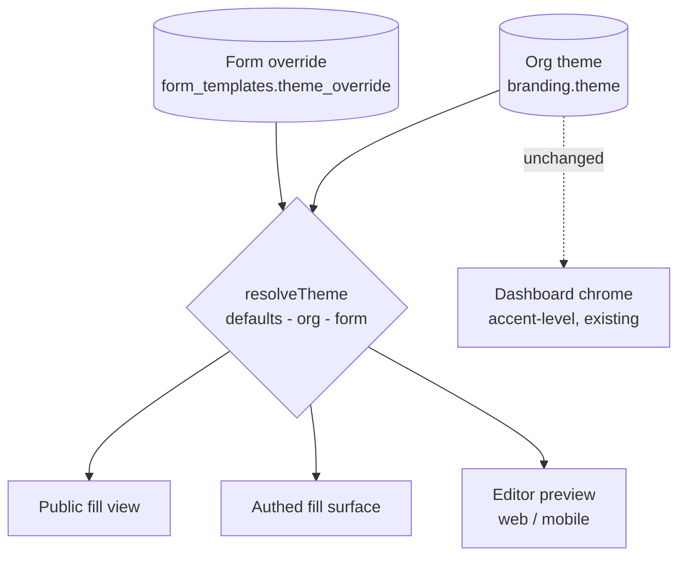
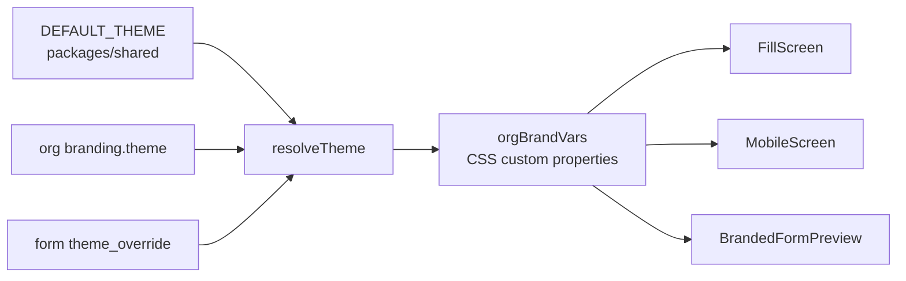

# Advanced Branding & Form Theming - Plan

## Goal Capsule

- **Objective:** Grow the shipped branding kit (3 colours + font + logo) into a bounded form-theme system — colour roles, typography roles, button/border/shading controls, density, logo size and placement, style presets, four layout types, an AI website scan — edited in a presets-first editor with clear "what applies where" guidance, and fix the four dead-or-divergent settings found in owner testing and research.
- **Product authority:** Product Contract below (confirmed in brainstorm dialogue 2026-07-21). Planning Contract and Implementation Units govern the how; on conflict, the Product Contract wins.
- **Open blockers:** None.
- **Stop conditions:** Surface a blocker instead of guessing if implementation contradicts a Product Contract requirement, or if a schema change beyond `form_templates.theme_override` proves necessary.
- **Delivery shape:** Four tranches (see Sequencing). Each tranche is independently shippable and mergeable; do not hold tranche 1 behind tranche 4.

---

## Product Contract

**Product Contract preservation:** two changes from the brainstorm, both user-confirmed on 2026-07-21. R18 (branded confirmation emails) is **removed** — research found no confirmation email exists anywhere in the codebase, so the requirement had nothing to attach to; it becomes follow-on FP2 and the false UI copy claiming it is corrected under R20. R2 is **widened** from one dead setting to four, after research confirmed three more of the same class.

### Summary

Extend the org branding kit into a full theme token set applied to all form surfaces, editable through a presets-first editor with per-control "applies to" guidance and a web/mobile live preview. Themes are set org-wide with per-form layout choice and overrides, style presets inherit the org's brand colours, an AI website scan pre-fills a draft theme, and everything ships free at every tier.

### Problem Frame

Owner testing of the shipped branding kit hit three walls in one session: setting the primary colour to white made the heading text invisible, the secondary colour control changed nothing anywhere, and the uploaded logo rendered small at a fixed size with no guidance or control. Research then found the same failure class in three more places — the fill page ignores the container styling the builder saves and sends it, the builder preview collapses to one column where the live page does not, and the white-label "remove badge" toggle is never honoured. The through-line is that the branding screen makes promises the rendering layer does not keep.

Beyond the defects, the control set is thin: three colours and a font family, with no text colours, no font sizes or weights, no button or border styling, and no indication of which surfaces a given selection affects. Competing form builders resolve this with bounded theme controls plus presets. Without an equivalent, "forms carry your brand" holds only for brands that happen to fit the current defaults.

### Actors

- A1. **Org owner/admin** — sets the org theme, runs the AI scan, owns branding.
- A2. **Form builder** — picks a form's layout type and any per-form overrides.
- A3. **External respondent** — fills branded forms; sees the theme, never the app.

### Requirements

**Defect fixes**

- R1. Text rendered over a brand colour resolves to a readable ink automatically on every surface, including the live fill masthead and the editor previews. No branded surface hardcodes a text colour over a brand-coloured background.
- R2. Every editable control visibly affects at least one rendered surface. This covers three confirmed cases: the secondary colour (stored, never emitted as a token), the per-form container style object (saved and sent to the fill page, ignored there), and the white-label remove-badge toggle (never honoured).
- R21. The builder preview and the live fill page collapse to a single column under equivalent conditions, or the difference is documented as intended. **Resolved as intended, not a defect:** the public page collapses via real viewport breakpoints (`sm:`) while the builder preview collapses on container width, because a fixed-width preview inside a wide window cannot use viewport breakpoints. Aligning them would flip every existing default-width form from two columns to one. No change; revisit only if customers report the preview misleading them.

**Theme model**

- R3. The org theme covers colour roles (page and form background, heading/body/label text, buttons), typography roles (heading, body/label, button) with size and weight per role, button shape and style, input and border styling, shading, spacing density, and logo size and placement.
- R4. The theme is a superset of today's branding kit; existing saved branding stays valid and renders unchanged until edited.
- R5. Logo upload shows size and format guidance, and the logo's rendered size and placement are settable.
- R6. Every colour role is editable via swatches, a visual colour picker, and text entry switchable between HEX and RGB.

**Presets, layouts, density**

- R7. Named style presets apply shape, typography, spacing, and shading while inheriting the org's brand colours.
- R8. Four layout types — Centered card, Full-width hero, Split brand panel, Conversational — each with defined web and mobile renderings.
- R9. Density (compact / comfortable / spacious) is a theme setting.
- R10. The Conversational layout renders one question per screen with progress indication, next/back navigation, per-question validation, and a review step before submit.

**Editor and guidance**

- R11. The theme editor leads with the preset gallery and layout defaults; a single "Customize" expander holds sectioned controls (colours, typography, buttons and inputs, borders and shading, logo, layout and density).
- R12. Every control shows which surfaces it affects, and focusing a control highlights the affected region in the preview.
- R13. The editor preview has a web/mobile toggle and may not diverge from the live fill rendering.
- R14. A form builder can set a form's layout type and override theme settings per form; unset values inherit the org theme.

**AI website scan**

- R15. An owner can enter a website URL; the system extracts logo, colours, and fonts and proposes a draft theme the owner reviews and edits before applying. It never auto-applies.
- R16. Scan failure or partial extraction degrades to manual setup with whatever was confidently extracted pre-filled.

**Application and tiering**

- R17. Themes render with identical fidelity on the public fill view, the authed fill surface, and the editor preview.
- R19. All theming capabilities are available at every plan tier; white-label gating is unchanged.
- R20. No UI copy claims a capability the product does not have; the settings screen stops promising branded confirmation emails.



### Key Flows

- F1. **Theme the org**
  - **Trigger:** Owner opens the Branding screen.
  - **Actors:** A1
  - **Steps:** Picks a preset rendered in their brand colours; opens Customize to adjust colour roles, typography, buttons, borders, logo size and placement; watches the preview in web and mobile; saves.
  - **Covers:** R3, R5, R6, R7, R9, R11, R12, R13
- F2. **Scan a website**
  - **Trigger:** Owner enters their website URL.
  - **Actors:** A1
  - **Steps:** Server fetches through the guarded fetcher and extracts candidates; a draft theme is presented in the preview; owner edits and applies, or dismisses and sets up manually.
  - **Covers:** R15, R16
- F3. **Style one form differently**
  - **Trigger:** Builder wants a specific form to use a different layout.
  - **Actors:** A2
  - **Steps:** In the form's settings, picks a layout type and optional overrides; unset values keep inheriting the org theme; live forms reflect the change without republishing.
  - **Covers:** R8, R14
- F4. **Fill a conversational form**
  - **Trigger:** Respondent opens a form set to the Conversational layout.
  - **Actors:** A3
  - **Steps:** Answers one question per screen with progress shown; invalid answers block advance with inline feedback; reviews all answers; submits.
  - **Covers:** R10

### Acceptance Examples

- AE1. **Covers R1.** Given a theme whose primary colour is white, when the fill masthead or editor preview renders, then heading text uses a dark readable ink on every surface.
- AE2. **Covers R7.** Given an org with a custom palette, when the owner applies any style preset, then buttons, typography, and spacing change and the saved palette is untouched.
- AE3. **Covers R4.** Given an org that saved branding before this feature, when its forms render with no further edits, then they look exactly as they did before.
- AE4. **Covers R14.** Given a form with a per-form layout and one overridden colour, when the owner later edits the org theme, then the form keeps its overrides and inherits every other change.
- AE5. **Covers R15.** Given a completed website scan, when extraction finishes, then the draft theme is shown for review and nothing is saved until the owner applies it.
- AE6. **Covers R10.** Given a required question in a conversational form, when the respondent tries to advance without answering, then they see inline validation and stay on that question.
- AE7. **Covers R2.** Given a builder sets a container width, radius, padding or shadow, when a respondent opens the live form, then the form card renders with those values rather than hardcoded ones.
- AE8. **Covers R2.** Given an org sets a secondary colour, when any branded surface renders, then that colour is visibly used.

### Scope Boundaries

**Deferred for later**

- Per-component style editing (styling individual field types independently).
- Brand-guidelines document (PDF) scan — follow-on to the website scan.
- Headless-browser rendering for the scan; v1 is static fetch only.

**Out of scope**

- Dashboard/workspace retheming. The prior effort's FP3 specced this as a white-label-tier feature and it stays that way — this effort themes forms only, so there is no tier conflict with R19.
- Pantone colour libraries (licensed, print-oriented). Colour tools do HEX/RGB.
- Custom CSS injection.
- White-label persistence. `customDomain` / `senderEmail` remain React-context-only; the moment they persist they need a server-side gate to match the client one.

### Follow-on Phases

- FP1. **Brand-guidelines document scan.** Upload a PDF/brand book and extract the same signals the website scan does. Builds on the U13–U14 extraction and review pipeline.
- FP2. **Branded confirmation emails.** No confirmation email exists today; only a plain-text team invite (`apps/api/src/email/resend.ts`). Requires an HTML email template system, a send-on-submit trigger, and deliverability work before branding is meaningful. R20 removes the copy that currently promises this.
- FP3. **Workspace theming (full retheme).** Unchanged from the prior plan; white-label tier.

### Dependencies / Assumptions

- The shared brand-token pipeline (`apps/web/src/lib/branding.ts`) is the extension point; it was built for widening without re-architecture.
- Two new API dependencies are required for the scan: an IP-range classifier and an HTML parser. Both land in `apps/api` only.
- Google Fonts weight intersection is a hard constraint: requesting a weight a family does not publish fails the entire stylesheet request, so per-role weights must intersect against the catalog.
- `apps/web` vitest runs in a node environment with no jsdom and no CI job, so all decision logic must live in pure modules.

---

## Planning Contract

### Key Technical Decisions

- KTD1. **The theme extends `BrandingKit` in place as optional keys — no organizations migration.** `branding` is already a jsonb column, so adding an optional `theme` object to the interface is additive and backward compatible by construction. Absent keys resolve to defaults, which is exactly R4/AE3: pre-existing orgs render unchanged until edited. A parallel `theme` column would split the source of truth and force a migration for no benefit.
- KTD2. **Per-form overrides live on `form_templates`, not on the version.** `form_template_versions.container` already holds per-form styling, but versions are immutable-on-publish, so putting theme there mints a new form version on every colour tweak and leaves live forms stale until republished. A nullable `theme_override` jsonb on the mutable `form_templates` row restyles live forms instantly. `container` keeps its existing meaning and is finally honoured (R2); layout type rides inside `theme_override`.
- KTD3. **One pure resolver owns precedence.** `resolveTheme(orgTheme, formOverride)` in `packages/shared` merges `DEFAULT_THEME <- org <- form` key-by-key, with absent meaning inherit. Every surface calls it; no surface reads raw theme objects. This is the single testable seam for AE3 and AE4.
- KTD4. **Token emission widens `orgBrandVars`, keeping existing variable names.** The five current `--org-*` variables keep their names and semantics so the ~40 existing consumer sites keep working untouched; new roles add new variables. `apps/web/src/lib/branding.test.ts` asserts the exact emitted set and must be updated deliberately, not loosened.
- KTD5. **Contrast ink is derived per text-bearing role, not per colour.** `contrastText` currently returns a Sprout-green-specific dark value, which is wrong once page and text colours are arbitrary. Widen it to take the ink pair as an argument, defaulting to today's values so existing callers and their tests are unchanged. Every role that can carry text emits a paired `*-text` variable.
- KTD6. **Presets are data, not code.** A `THEME_PRESETS` array in `packages/shared` of partial themes with all colour-role keys omitted. Omission is what makes R7 true by construction: a preset cannot overwrite a palette it does not contain. Adding a preset is a data edit with no code change.
- KTD7. **The scan's network boundary is its own reviewed module.** `apps/api/src/brand-scan/safe-fetch.ts` owns SSRF defence and nothing else: scheme allowlist, DNS resolution with rejection of private/loopback/link-local/CGNAT/ULA/IPv4-mapped ranges (169.254.169.254 included), connection pinned to the validated IP to close the DNS-rebinding TOCTOU, manual redirect handling that re-validates every hop, a response byte cap, and a hard timeout. No maintained npm package covers this for native fetch/undici — the best-known one does not support undici and has had bypasses — so this is hand-rolled against a classifier library and needs its own adversarial test suite.
- KTD8. **Deterministic parsing extracts; the LLM only ranks.** Favicon/apple-touch-icon/manifest icons, `manifest.theme_color`, `meta[name=theme-color]`, Google Fonts links, `@font-face`, and CSS custom properties are parsed in code — exact, cheap, testable, injection-immune. The Anthropic client is given only a compact candidate list to rank into primary/secondary/accent and heading/body roles. Untrusted page content is passed as a `tool_result` block with JSON encoding, scripts and hidden text stripped, and hard truncation. Every returned value is re-validated in code: colours against a strict hex regex, fonts against the Google Fonts catalog, and any asset URL must be same-registrable-domain as the submitted site and is re-fetched through `safe-fetch` before storage. The scan never auto-applies (R15), which is the load-bearing mitigation.
- KTD9. **One preview component, shared.** `BrandingScreen` and `WhiteLabelScreen` currently duplicate the preview markup, and both diverge from the real fill rendering — the exact class of bug R13 forbids. Extract one `BrandedFormPreview` that consumes resolved tokens the same way `FillScreen` does. This is a prerequisite for any preview work, not a cleanup afterthought.
- KTD10. **Conversational is a fill-engine change, sequenced last.** Layouts A/B/C are wrappers over the existing single-page renderer. Conversational needs step state, per-question validation, progress, and a review step. Its sequencing logic goes in a pure `fill-steps.ts` module so it is testable without a DOM.
- KTD11. **Migration numbering.** The only migration is `theme_override` on `form_templates`. Take the next unused index (`0010` at time of writing) and let `drizzle-kit` stamp `Date.now()`; never copy a neighbour's timestamp. `scripts/check-migration-order.mjs` now fails CI on violations.

### High-Level Technical Design

Resolution and emission, one path for every surface:



Scan pipeline, with the trust boundary made explicit:

```mermaid
sequenceDiagram
  participant O as Owner
  participant API as POST /org/brand-scan
  participant SF as safe-fetch (SSRF guard)
  participant EX as extract (deterministic)
  participant AI as Anthropic (rank only)
  O->>API: { url }
  API->>SF: validate scheme, DNS, IP, redirects
  SF-->>EX: HTML + linked CSS (size-capped)
  EX->>EX: parse icons, manifest, theme-color, fonts, CSS vars
  EX->>AI: compact candidate list (tool_result, JSON-encoded)
  AI-->>API: proposed roles
  API->>API: re-validate every value; same-domain check on assets
  API-->>O: draft theme (never applied)
```

### Assumptions

- Static-fetch extraction is accepted for v1. It is strong on typical corporate sites and weak on JS-rendered builders (Wix, Framer, CSS-in-JS); the mandatory review step absorbs the gap, and a headless browser would widen the SSRF surface considerably.
- Adding two `apps/api` dependencies is acceptable. If dependency addition is contested, the HTML parse can be done with regex at some accuracy cost, but the IP classifier should not be hand-rolled.
- No live database is reachable from the dev environment, so migration correctness is proven by the drift check and the journal guard rather than by applying it.

### Sequencing

| Tranche | Units | Ships |
|---|---|---|
| 1 — Foundation and defects | U1–U5 | Token model, contrast fixes, all four dead settings, shared preview |
| 2 — Editor and presets | U6–U9 | Presets-first editor, guidance, logo controls, per-form overrides |
| 3 — Layouts and scan | U10–U13 | Layout types A/B/C, website scan |
| 4 — Conversational | U14 | One-question-at-a-time fill engine |

---

## Implementation Units

| U-ID | Title | Key files | Depends on |
|---|---|---|---|
| U1 | Theme model, defaults, resolver | `packages/shared/src/theme.ts` | — |
| U2 | Contrast widening | `packages/shared/src/branding.ts` | U1 |
| U3 | Token emission | `apps/web/src/lib/branding.ts` | U1, U2 |
| U4 | Contrast fixes on live surfaces | `FillScreen`, previews, `LogoUploadControl` | U3 |
| U5 | Shared preview + container honoured | `BrandedFormPreview`, `FillScreen` | U3 |
| U6 | Org theme persistence | `apps/api/src/routes/org.ts` | U1 |
| U7 | Presets data + application | `packages/shared/src/theme-presets.ts` | U1 |
| U8 | Theme editor shell | `apps/web/src/screens/enterprise/WhiteLabelScreen.tsx` | U5, U6, U7 |
| U9 | Per-form override + layout | migration, `form_templates`, builder | U1, U6 |
| U10 | Logo size and placement | `LogoUploadControl`, token emission | U3, U8 |
| U11 | Layout types A/B/C | fill surfaces | U5, U9 |
| U12 | SSRF-safe fetch | `apps/api/src/brand-scan/safe-fetch.ts` | — |
| U13 | Scan extraction, ranking, review | `apps/api/src/brand-scan/*`, editor | U12, U8 |
| U14 | Conversational layout | `fill-steps.ts`, `FillScreen` | U11 |

### U1. Theme model, defaults, and resolver

- **Goal:** One typed theme object with defaults and a pure precedence resolver.
- **Requirements:** R3, R4, R14
- **Dependencies:** None.
- **Files:** `packages/shared/src/theme.ts` (new), `packages/shared/src/index.ts`, `packages/shared/src/theme.test.ts` (new — note `packages/shared` has no test script today; add one mirroring `packages/ui`).
- **Approach:** Define `ThemeTokens` with every field optional: colour roles, typography roles (size + weight per role), button shape/style, border and shading, density, logo size/placement, layout type. Define `DEFAULT_THEME` with concrete values matching today's rendering exactly. Implement `resolveTheme(org?, form?)` merging key-by-key with absent meaning inherit. `packages/shared` has zero dependencies — keep it that way.
- **Execution note:** Pure module with no DOM or React. Write the resolver's tests first; AE3 and AE4 are both resolver assertions.
- **Patterns to follow:** `packages/shared/src/branding.ts` for interface + default-const shape.
- **Test scenarios:** Empty org and form resolve to `DEFAULT_THEME`. Org value overrides default. Form value overrides org. Absent form key inherits org, not default (AE4). A pre-feature `BrandingKit` with no `theme` key resolves to defaults (AE3). Unknown/extra keys are ignored rather than throwing.
- **Verification:** Shared unit tests green; `pnpm -r typecheck` clean.

### U2. Contrast widening

- **Goal:** Readable ink for arbitrary colour roles, without changing existing behaviour.
- **Requirements:** R1
- **Dependencies:** U1
- **Files:** `packages/shared/src/branding.ts`, `apps/web/src/lib/branding.test.ts`
- **Approach:** Widen `contrastText(hex)` to accept an optional ink pair, defaulting to the current Sprout-green dark and white so every existing caller and its assertions are unchanged. Export a helper that picks ink for any role colour.
- **Test scenarios:** Existing two-value behaviour unchanged with no second argument. A light role colour yields the dark ink; a dark one yields white. A custom ink pair is honoured. Malformed hex falls back rather than throwing.
- **Verification:** Existing `branding.test.ts` passes without modification to its current cases.

### U3. Token emission

- **Goal:** Every theme role reaches CSS as a custom property, with paired inks.
- **Requirements:** R1, R2, R3
- **Dependencies:** U1, U2
- **Files:** `apps/web/src/lib/branding.ts`, `apps/web/src/lib/branding.test.ts`
- **Approach:** Extend `orgBrandVars` to accept a resolved theme and emit the full variable set. The five existing `--org-*` names keep their exact meaning so current consumers are untouched. Emit `--org-secondary` (closing the first R2 case) plus a `*-text` ink for every text-bearing role. Build font stacks per typography role, intersecting requested weights against the family's catalog weights.
- **Patterns to follow:** current `orgBrandVars` and `fontStack`; `apps/web/src/lib/font-loader.ts` for the weight intersection rule.
- **Test scenarios:** The emitted variable set matches an explicit expected list (update the existing assertion deliberately). `--org-secondary` is emitted and non-empty when set (AE8). Null/absent theme emits today's five values unchanged. A role with a light colour emits a dark paired ink (AE1). A requested weight absent from a family is dropped rather than requested.
- **Verification:** `pnpm --filter @formai/web test` green.

### U4. Contrast fixes on live surfaces

- **Goal:** No surface hardcodes text colour over a brand colour.
- **Requirements:** R1
- **Dependencies:** U3
- **Files:** `apps/web/src/screens/fill/FillScreen.tsx`, `apps/web/src/screens/enterprise/WhiteLabelScreen.tsx`, `apps/web/src/screens/onboarding/BrandingScreen.tsx`, `apps/web/src/components/branding/LogoUploadControl.tsx`
- **Approach:** Replace every hardcoded `text-white` / `text-white/60` / `text-white/70` sitting over `var(--org-primary)` with the paired ink variable. The correct pattern already exists in `ExternalShell.tsx` and `MobileScreen.tsx` (the latter uses `color-mix` for translucent overlays — reuse that for the eyebrow and helper text rather than an opacity-suffixed white).
- **Execution note:** Confirmed sites are `FillScreen.tsx:150,154,159`, `WhiteLabelScreen.tsx:195,200,203`, and `LogoUploadControl.tsx:115`. Grep for `text-white` under `apps/web/src` before declaring done.
- **Test scenarios:** No behavioural unit test is possible (component rendering is untestable in this workspace). `Test expectation: none — verified by grep for remaining hardcoded whites plus manual smoke with a white primary.`
- **Verification:** Manual smoke: set primary to `#ffffff`, confirm the heading is readable on the public fill page and both previews (AE1).

### U5. Shared preview and container honoured

- **Goal:** One preview component, and the fill page stops ignoring saved container styling.
- **Requirements:** R2, R13, R17
- **Dependencies:** U3
- **Files:** `apps/web/src/components/branding/BrandedFormPreview.tsx` (new), `apps/web/src/screens/onboarding/BrandingScreen.tsx`, `apps/web/src/screens/enterprise/WhiteLabelScreen.tsx`, `apps/web/src/screens/fill/FillScreen.tsx`, `apps/web/src/lib/fill-layout.ts`, `apps/web/src/lib/fill-layout.test.ts`
- **Approach:** Extract the duplicated preview markup into one component driven by resolved tokens. Then make `FillScreen` consume `fill.container` for max width, padding, radius, border, background, and shadow instead of its hardcoded `max-w-[600px]`, `rounded-lg`, and `p-[26px_28px]`. Pass the real narrow flag to `resolveFillSpan` instead of the hardcoded `false`, deriving it from container width exactly as the builder preview does.
- **Test scenarios:** `resolveFillSpan` collapses to 12 when the container is narrow and honours `colSpan` when it is not (extend existing tests). A container width below the threshold produces the same span classes in builder preview and fill path (AE7). Absent/default container reproduces today's rendering.
- **Verification:** Web unit tests green; manual smoke comparing builder preview and live form at a narrow width.

### U6. Org theme persistence

- **Goal:** The theme round-trips through the API with validation.
- **Requirements:** R3, R4, R19
- **Dependencies:** U1
- **Files:** `apps/api/src/routes/org.ts`, `apps/api/src/routes/org.test.ts`, `packages/db/src/schema/organizations.ts`
- **Approach:** Extend the zod `brandingBody` with an optional `theme` object, validating colours against the existing hex regex and fonts against `isValidFormFont`. Keep the owner/admin role gate and audit recording. Note the triple-defaulting constraint: the default lives in `packages/shared`, is mirrored inline in the Drizzle schema for drizzle-kit's bundler, and is validated in the route — keep all three consistent.
- **Patterns to follow:** existing `brandingBody` and `patchOrgBody` in the same file; `org.test.ts` for `fakeDb`/`sealSession`.
- **Test scenarios:** A full theme round-trips through PATCH and GET. An invalid colour is rejected 400 with a detail body. A non-catalog font is rejected. A viewer/builder role gets 403. A PATCH with no theme leaves existing branding intact. Theme saves succeed on the lowest plan tier (R19).
- **Verification:** `pnpm --filter @formai/api test` green — this is the CI-covered suite, so weight coverage here.

### U7. Presets data and application

- **Goal:** Named presets that cannot overwrite the palette.
- **Requirements:** R7
- **Dependencies:** U1
- **Files:** `packages/shared/src/theme-presets.ts` (new), `apps/web/src/lib/theme-preset.ts` (new), plus co-located tests
- **Approach:** Define four to six presets as partial themes with every colour-role key omitted. `applyPreset(current, preset)` returns a theme with preset keys replacing shape/typography/spacing and colour keys untouched.
- **Test scenarios:** Applying any preset leaves all colour roles byte-identical (AE2). Applying a preset changes button shape, typography, and density. Applying two presets in sequence is not cumulative. Every shipped preset type-checks against `ThemeTokens`.
- **Verification:** Unit tests green.

### U8. Theme editor shell

- **Goal:** Presets-first editor with the Customize expander, guidance, and web/mobile preview.
- **Requirements:** R6, R11, R12, R13, R20
- **Dependencies:** U5, U6, U7
- **Files:** `apps/web/src/screens/enterprise/WhiteLabelScreen.tsx`, `apps/web/src/components/branding/*` (new sections), `apps/web/src/lib/onboarding.tsx`
- **Approach:** Landing view is the preset gallery rendered in the org's own colours plus a layout picker; one "Customize" expander holds the sectioned controls (colours, typography, buttons and inputs, borders and shading, logo, layout and density). Each control carries an "applies to" chip and highlights its preview region on focus. Add the web/mobile toggle to the shared preview. Extend the colour control with RGB/HEX entry switching (`parseColor` in `BrandColorFields.tsx` already parses both). Correct the copy that claims branding applies to confirmation emails (R20). Thread the theme through `OnboardingProvider` using the same hydrate-once latch pattern that guards against a slow session response clobbering typing.
- **Test scenarios:** `Test expectation: none for rendering — component tests are not possible in this workspace.` Pure helpers (colour parse/format round-trip, applies-to mapping) get unit tests.
- **Verification:** Manual smoke of F1 end to end; grep confirms no remaining confirmation-email copy.

### U9. Per-form override and layout

- **Goal:** A form can pick its layout and override theme values without minting a version.
- **Requirements:** R8, R14
- **Dependencies:** U1, U6
- **Files:** new migration under `packages/db/drizzle/`, `packages/db/src/schema/forms.ts`, `apps/api/src/routes/forms.ts`, `apps/api/src/routes/fill-links.ts`, `apps/web/src/screens/builder/BuilderScreen.tsx`, `apps/api/src/routes/forms.test.ts`
- **Approach:** Add nullable `theme_override` jsonb to `form_templates` (KTD2). Generate the migration with `pnpm db:generate` so the journal gets a real timestamp; the CI guard now enforces ordering. Return the resolved theme from `GET /fill/:token` by merging org theme with the form override server-side, so the public payload carries one already-resolved object.
- **Test scenarios:** A form with no override returns the org theme unchanged. An override wins over the org value for that key only (AE4). Editing an override does not create a new form version. Migration drift check passes. Journal guard passes.
- **Verification:** API tests green; `pnpm --filter @formai/db generate` produces no diff; `node scripts/check-migration-order.mjs` passes.

### U10. Logo size and placement

- **Goal:** Logo size and position are settable, with upload guidance.
- **Requirements:** R5
- **Dependencies:** U3, U8
- **Files:** `apps/web/src/components/branding/LogoUploadControl.tsx`, token emission, fill surfaces
- **Approach:** Add size (small/medium/large or a bounded numeric) and placement (left/centre) to the theme, emit them as variables, and consume them wherever the logo renders instead of today's fixed `h-7 w-7` / `h-10 w-10` / `h-[38px]`. Show recommended dimensions and format guidance at the upload control.
- **Test scenarios:** Token emission includes logo size/placement variables; defaults reproduce current sizes. Pure guidance-text helper unit-tested if extracted.
- **Verification:** Manual smoke across public fill, mobile, and preview.

### U11. Layout types A, B, C

- **Goal:** Card, hero, and split layouts render on every fill surface.
- **Requirements:** R8, R17
- **Dependencies:** U5, U9
- **Files:** `apps/web/src/screens/fill/` (new layout components), `apps/web/src/screens/mobile/MobileScreen.tsx`, `BrandedFormPreview`
- **Approach:** Three wrappers over the existing single-page renderer, selected by resolved `theme.layout`. Each defines its own web and mobile arrangement; the field list and submit logic are shared and untouched. Mobile currently reads branding from session rather than the fill payload — switch it to the resolved theme so R17 fidelity holds.
- **Test scenarios:** Layout selection is a pure function of the resolved theme with a safe fallback for unknown values. Each layout renders the same field set (verified by shared renderer reuse, not duplicated markup).
- **Verification:** Manual smoke of all three at desktop and mobile widths.

### U12. SSRF-safe fetch

- **Goal:** A reviewed network boundary for fetching user-supplied URLs.
- **Requirements:** R15
- **Dependencies:** None (can run in parallel with tranche 1–2).
- **Files:** `apps/api/src/brand-scan/safe-fetch.ts` (new), `apps/api/src/brand-scan/safe-fetch.test.ts` (new), `apps/api/package.json`
- **Approach:** Per KTD7. Scheme allowlist; parse with the WHATWG URL API so userinfo and encodings normalise; resolve DNS and reject any non-public address (RFC1918, loopback, link-local including 169.254.169.254, CGNAT, ULA, IPv6 link-local, IPv4-mapped IPv6, NAT64); connect to the validated IP with the original hostname in `Host`/SNI to close the rebinding race; handle redirects manually with a hop cap and full re-validation per hop; cap response bytes while streaming; hard timeout with no retries.
- **Execution note:** This is the security-critical unit. Write the adversarial tests first and make them fail before implementing.
- **Test scenarios:** Rejects `file:`, `gopher:`, `data:`. Rejects loopback, RFC1918, 169.254.169.254, `::1`, `::ffff:127.0.0.1`, decimal/octal-encoded IPs. Rejects a public host that redirects to a private one. Rejects a hostname whose DNS resolves to a private address (public-DNS-to-loopback style). Aborts past the byte cap. Aborts past the timeout. Allows an ordinary public HTTPS URL.
- **Verification:** API tests green — CI-covered.

### U13. Scan extraction, ranking, and review

- **Goal:** A URL produces a reviewable draft theme.
- **Requirements:** R15, R16
- **Dependencies:** U12, U8
- **Files:** `apps/api/src/brand-scan/extract.ts`, `apps/api/src/brand-scan/rank.ts`, `apps/api/src/routes/org.ts` (new endpoint), tests, editor review UI
- **Approach:** Per KTD8. Deterministic extraction of icons, manifest (`theme_color`, icons), `meta[name=theme-color]`, Open Graph, Google Fonts links, `@font-face`, and CSS custom properties. Strip scripts, comments, and hidden text before anything reaches the model. Pass a compact JSON candidate list as a `tool_result`, forced-tool-use, with the existing Anthropic client. Re-validate every returned value in code; asset URLs must be same-registrable-domain and are re-fetched through `safe-fetch` and uploaded through the existing logo path so the minted-URL validation still applies. Return a draft; never persist.
- **Test scenarios:** Extraction finds icons/colours/fonts in a fixture page. A page with none returns empty and the endpoint degrades to manual (R16). A fixture page containing an injection payload in a comment does not change the output (the ranked values still validate or are rejected). A model-returned colour that fails the hex regex is rejected. An asset URL on a different domain is rejected. Anthropic unkeyed degrades to deterministic-only rather than erroring.
- **Verification:** API tests green; manual smoke against two or three real sites, plus a hosted injection-payload page.

### U14. Conversational layout

- **Goal:** One question per screen, with progress, validation, and review.
- **Requirements:** R10
- **Dependencies:** U11
- **Files:** `apps/web/src/lib/fill-steps.ts` (new) + test, `apps/web/src/screens/fill/FillScreen.tsx`, mobile surface
- **Approach:** Pure `fill-steps.ts` owns sequencing: which fields form a step, next/back, progress fraction, and which step a validation error belongs to. Section headers become step boundaries rather than rendered rows. The component consumes the module; submit and payload shape are unchanged.
- **Execution note:** Interacts with required-field and checklist validation. Read `docs/plans/2026-07-20-002-fix-import-fill-builder-integrity-plan.md` before starting.
- **Test scenarios:** Step sequencing groups fields correctly and skips empty groups. Advancing past a required-but-empty field is blocked (AE6). Back preserves entered values. Progress reaches 100% only on the last step. The review step lists every answer. Submitted payload is identical to the single-page layout for the same input.
- **Verification:** Web unit tests green; manual smoke of F4 including validation and review.

---

## Verification Contract

| Gate | Command | Applies to |
|---|---|---|
| Typecheck | `pnpm -r typecheck` | all units |
| Build | `pnpm -r build` (run from Git Bash on Windows — `packages/shared` uses POSIX `rm -rf`) | all units |
| API tests | `pnpm --filter @formai/api test` | U6, U9, U12, U13 |
| Web unit tests | `pnpm --filter @formai/web test` | U3, U5, U7, U10, U11, U14 |
| Shared tests | `pnpm --filter @formai/shared test` (add the script in U1) | U1, U2, U7 |
| Migration drift | `pnpm --filter @formai/db generate` produces no diff | U9 |
| Journal ordering | `node scripts/check-migration-order.mjs` | U9 |

CI runs typecheck, build, API tests, boot smoke, journal ordering, and migration drift. **Web and shared tests do not run in CI** — run them locally per unit and treat them as required despite being unenforced.

---

## Definition of Done

- Every unit in the tranche implemented, with its Verification Contract gates green.
- AE1–AE8 demonstrably satisfied — by test where the scenario maps to a pure module, by manual smoke otherwise.
- A grep for `text-white` over brand-coloured backgrounds under `apps/web/src` returns nothing.
- No UI copy claims branded confirmation emails.
- Any migration is committed with its regenerated snapshot, and both drift and journal-ordering checks pass.
- No abandoned experimental code from dead-end approaches remains in the diff.
- Follow-on phases FP1–FP3 remain unimplemented.

---

## Risks & Dependencies

- **The scan is the risk concentration.** It is the only unit that makes the server fetch attacker-influenced URLs and feeds third-party content to an LLM whose output shapes application state. Both mitigations (the guarded fetcher, and human review before apply) are load-bearing; do not weaken either. No maintained npm package solves the undici SSRF case, so this code needs real review.
- **No web test job in CI.** Most of this effort is client logic. Keeping decision logic in pure modules is the only guard, and even those tests run locally only. Widening CI is out of scope here but worth a follow-up.
- **Triple-defaulting drift.** The theme default exists in `packages/shared`, mirrored inline in the Drizzle schema, and validated in the route. Drift between them is silent — change all three together.
- **Google Fonts weight intersection.** Requesting a weight a family does not publish fails the entire stylesheet request, not just that weight. Per-role weights must intersect against the catalog.
- **Migration coordination.** Another branch may claim the next index. Regenerate rather than hand-editing if the index collides, and never copy a neighbour's timestamp.
- **Pre-existing open items inherited from the branding work** remain live and untouched here: white-label fields are gated in UI but never persisted, role is trusted from a 7-day sealed cookie without re-checking membership, public logo assets are served immutable for a year so removal is not a reliable takedown, and there is no rate limiting on logo upload. The scan endpoint should carry rate limiting from the start rather than inheriting that gap.

---

## Sources / Research

- Branding model and defaults: `packages/shared/src/branding.ts:39-56` (`BrandingKit`, `DEFAULT_BRANDING`), `contrastText` at `:74-84`.
- Token emission and the missing secondary: `apps/web/src/lib/branding.ts:44-56` emits exactly five variables; `apps/web/src/lib/branding.test.ts:86-93` asserts that set.
- Live contrast bug: `apps/web/src/screens/fill/FillScreen.tsx:149-159`; previews at `WhiteLabelScreen.tsx:195-203` and `BrandingScreen.tsx:172-178`; `LogoUploadControl.tsx:115`. Correct pattern already at `ExternalShell.tsx:52-56` and `MobileScreen.tsx:78`.
- Container ignored: `FillScreen.tsx:147-148,165` hardcodes width, radius, and padding; `fill-layout.ts` documents the narrow rule the fill path bypasses at `FillScreen.tsx:200`.
- Per-form styling column: `packages/db/src/schema/forms.ts` (`form_template_versions.container`), `packages/shared/src/form-field.ts:107-125` (`FormContainer`, `DEFAULT_CONTAINER`).
- Public fill payload: `apps/api/src/routes/fill-links.ts:243-250` returns `orgBranding` and `container` with no merge.
- Org route validation and audit: `apps/api/src/routes/org.ts:25-66` (zod bodies), `:68-186` (role gate, logo ownership check, audit).
- Font weight intersection: `apps/web/src/lib/font-loader.ts:22,37`.
- No confirmation email exists: `apps/api/src/email/resend.ts` (invite only, plain text); the false claim is at `WhiteLabelScreen.tsx:51-52`.
- Test environment limits: `apps/web/vitest.config.ts` (`environment: 'node'`, `include: ['src/**/*.test.ts']`); `.github/workflows/ci.yml` runs only the API suite.
- Migration rules: `.agents/memory/drizzle-migration-journal-order.md`, `docs/SIGNUP_ORG_BRANDING_HANDOFF.md` §5, and `scripts/check-migration-order.mjs`.
- Prior effort and its follow-ons: `docs/plans/2026-07-20-001-feat-signup-org-branding-plan.md`, `docs/SIGNUP_ORG_BRANDING_HANDOFF.md`.
