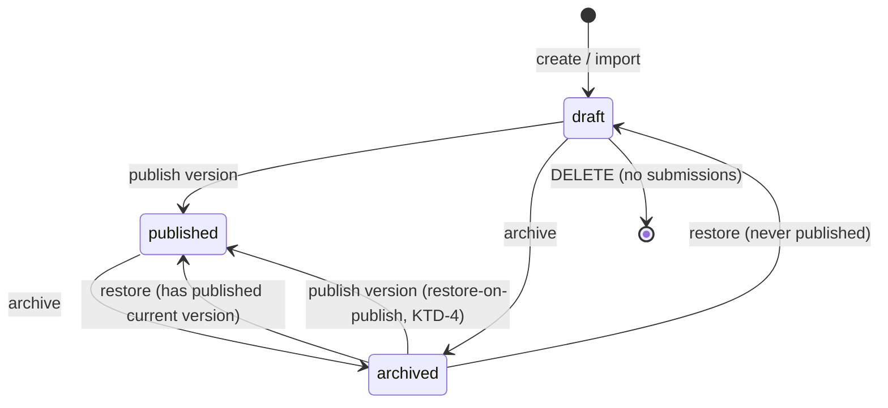
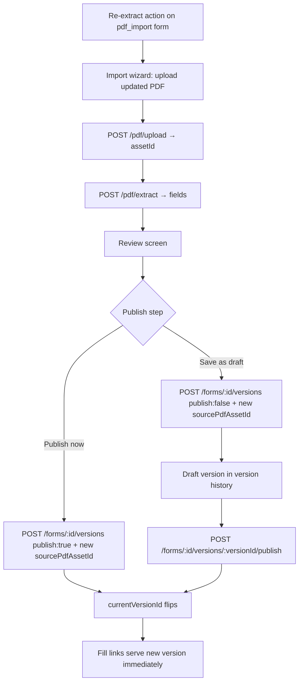

# Draft Form Deletion, Archive/Restore, and PDF Re-Extract - Plan

## Goal Capsule

- **Objective:** Give form owners a full lifecycle for form templates: permanently delete drafts, archive/restore published forms without breaking live fill links, and re-import an updated source PDF as a new version of an existing form with a draft-then-publish path.
- **Authority:** This plan's Product Contract defines behavior; the Planning Contract's KTDs constrain implementation. Repo conventions (strict TS, zod validation, tenant scoping, TanStack Query invalidation) override incidental phrasing here.
- **Execution profile:** Standard feature work in the pnpm monorepo — API routes in `apps/api`, data layer and screens in `apps/web`. No DB migration expected (see KTD-9).
- **Stop conditions:** Stop and surface if a schema migration turns out to be required after all, if the submissions FK behavior differs from what KTD-1 assumes, or if fill-link resolution is found to read template status anywhere.
- **Tail ownership:** Implementer owns test additions, typecheck cleanliness for touched packages, and audit-log coverage for every new mutation.

---

## Product Contract

### Summary

Add three lifecycle capabilities to form templates: hard deletion of draft forms (with confirmation and guards), archive/restore of forms (metadata-only, so existing fill links keep accepting submissions), and re-extract (re-import an updated PDF as a new draft version of the same form, publishable later from version history — publishing flips live fill links to the new version immediately).

### Problem Frame

There is currently no way to remove a draft form: the forms router exposes list, create, get, and version-create only. Abandoned drafts accumulate in the templates list forever. Published forms have the inverse problem — they can never be retired without destroying submission history, and there is no way to take a form out of circulation while keeping its data. Finally, when a source PDF changes (a revised safety form, an updated checklist), the only option is importing it as a brand-new form, which orphans the original's fill links, submissions, and version history. Versioning machinery exists on the API (`POST /forms/:id/versions` forks and publishes versions) but nothing exposes an update path for imported PDFs, and a draft version created today is a dead end — no endpoint can publish an existing version later.

### Requirements

**Draft deletion**

- R1. A member with the `forms.delete` permission can permanently delete a draft form; its versions, fill links, and competency rules are removed with it.
- R2. Deletion requires an explicit confirmation dialog in the UI before the request is sent.
- R3. A form that is not a draft cannot be deleted, and a draft that already has submissions cannot be deleted; the two failures are distinct errors with distinct dialog copy.

**Archive and restore**

- R4. A member with the `forms.edit` permission can archive a form; archived forms leave the active templates list and are reachable through an archived filter.
- R5. Archiving preserves submissions and version history, and existing fill links keep accepting submissions while the form is archived.
- R6. New fill links cannot be minted for an archived form.
- R7. An archived form can be restored, returning it to its prior effective status (published if it has a published current version, draft otherwise).
- R8. Dashboard "active forms" excludes archived forms (already true today — verify, don't rebuild).

**Re-extract and version publishing**

- R9. On a PDF-imported form, a member can re-run the import wizard with an updated PDF; the result is saved as a new draft version of the same form, carrying the new source PDF asset.
- R10. A draft version can be published later from the form's version history; publishing makes it the current version and live fill links serve it immediately, tolerating in-flight fills against the previous version.
- R11. The re-extract flow can alternatively publish immediately, with the confirmation step stating that live fill links will switch at once.

**Cross-cutting**

- R12. Delete, archive, restore, and version-publish each write an audit log entry under the `forms` category.

### Acceptance Examples

- AE1. **Given** a draft form with 3 authed submissions, **when** the owner confirms deletion, **then** the API returns the has-submissions conflict and the dialog explains the draft has fills and suggests archiving instead — nothing is deleted.
- AE2. **Given** an archived form with an active fill link, **when** an external user opens the link and submits, **then** the submission succeeds exactly as before archiving.
- AE3. **Given** an archived form, **when** a member tries to create a new fill link, **then** the API returns an archived-form conflict and no link is created.
- AE4. **Given** a published form with a re-extracted draft version, **when** a member publishes that draft from version history, **then** the form's current version flips, and the next fill-link load serves the new fields while an in-flight fill against the old version still submits under the version it was opened with.

### Scope Boundaries

**Deferred to Follow-Up Work**

- Cleaning up orphaned uploaded PDF assets when the import/re-extract wizard is abandoned mid-way (existing behavior for the normal import wizard too).
- Discarding/deleting individual draft versions (would also require switching version labels from count-based to max+1).
- Renaming a form during re-extract (the versions endpoint takes no name; keep the existing name).
- A server-side status filter parameter on the forms list (client-side filtering is sufficient at current scale, and mirrors the mobile screen's approach).
- Builder support for loading and editing a specific (non-current) version.

**Outside this product's identity**

- Deleting published forms or forms with submissions — archive is the answer; destructive removal of submission data stays limited to whole-account deletion.

---

## Planning Contract

### Key Technical Decisions

- KTD-1. **Delete guards are explicit pre-checks, not FK-error handling.** `submissions.templateId` and `submissions.templateVersionId` are `ON DELETE RESTRICT`, and drafts *can* have submissions (the authed submit path deliberately allows filling a pre-publish current version). The route checks status first (409 `form_not_draft`), then submission count (409 `form_has_submissions`), before deleting. Versions, fill links, and competency rules all cascade — no manual cleanup needed.
- KTD-2. **Archive is a metadata-only status flip.** It touches `formTemplates.status` (and `updatedAt`) only — never `currentVersionId` or version rows. Public fill-link resolution and submission (`apps/api/src/routes/fill-links.ts`) check only the version's `state === 'published'`, never template status, so archived forms keep serving with zero changes there. This invariant is what makes R5 free — protect it.
- KTD-3. **Minting new fill links on an archived form is blocked** with a 409 (`form_archived`) beside the existing published-version check in the fill-link create handler. Existing links are untouched.
- KTD-4. **Publishing on an archived form restores it, with explicit UI copy.** `POST /:id/versions` with publish already sets status to published unconditionally; keep that behavior (blocking would strand builder sessions) and surface "Publishing will restore this archived form" in the builder/re-extract confirm step when the target is archived.
- KTD-5. **Permissions:** `hasPermission(tenant, 'forms', 'delete')` gates hard delete (seeded true for owner/admin only); `forms.edit` gates archive/restore and version publish (reversible actions, mirroring the fill-links precedent of riding `forms.edit` with an explanatory const). Denial → 403 `forbidden`.
- KTD-6. **Re-extract reuses the entire import pipeline unchanged** (`POST /pdf/upload`, `POST /pdf/extract`, the three-screen wizard). Only the publish step branches: with a target form, it calls `POST /forms/:id/versions` instead of `POST /forms`. The action is offered only on `pdf_import` forms.
- KTD-7. **A per-version publish endpoint is new machinery this plan adds** (`POST /forms/:id/versions/:versionId/publish`). Today versions can only be created, never published later — which would make a re-extracted draft a dead end. The endpoint flips the version's state to published, sets it as `currentVersionId`, marks the template published, and stamps publishedAt/publishedBy. This is what makes the confirmed draft-then-publish flow (R9→R10) real.
- KTD-8. **`sourcePdfAssetId` becomes an optional field on the version-create body**, overriding the inherit-from-previous-current behavior so a re-extracted version carries the *new* PDF (round-trip export fidelity). Absent, behavior is unchanged.
- KTD-9. **No DB migration expected.** `templateStatusEnum` already contains `'archived'` (`packages/db/src/schema/enums.ts`), and the web type plus the templates screen status badge already render it. If drizzle-kit generates a migration anyway it will be numbered 0010 (0009 already exists on main) — regenerate against latest main before merging (a 0007 numbering collision has bitten this repo before).
- KTD-10. **Audit entries via `recordAudit` outside any transaction.** `recordAudit` requires the root `Db`, not a transaction handle (documented in the account-deletion route). The forms router currently writes no audit entries at all; delete/archive/restore/publish each add one (category `forms`).
- KTD-11. **Archived filtering is client-side in the templates screen** with an Archived toggle/tab, mirroring the mobile screen's client-side published filter. Drafts may also be archived (otherwise a draft with fills — undeletable per KTD-1 — would be immortal); restore infers the prior status per R7.

### High-Level Technical Design

Template status lifecycle after this plan:

Re-extract flow — where it branches from the existing import wizard:

The wizard session (`apps/web/src/lib/data/import-session.ts`, a module-level singleton) gains a `targetFormId` so the three sibling routes know they are re-extracting rather than importing; entering the wizard fresh from "Import PDF" clears it.

### Sources & Research

- Delete-route pattern to mirror: team member removal in `apps/api/src/routes/team.ts` (permission matrix check → tenant-scoped lookup → guard → delete → audit → 204). The competencies delete is the weaker precedent (no permission check, no audit) — do not mirror it.
- Soft-delete precedent: fill-link revoke flips `active: false` and keeps the row.
- FK/cascade map: `packages/db/src/schema/{forms,fill-links,submissions,governance}.ts` — versions/fill-links/competency-rules cascade on template delete; submissions RESTRICT.
- Confirmation dialog precedent: `apps/web/src/components/AccountMenu.tsx` (destructive `Dialog` from `@formai/ui`; type-to-confirm is overkill for drafts — a plain confirm Dialog suffices).
- Mutation convention: `useMutation` + `invalidateQueries` in `apps/web/src/lib/data/hooks.ts`; the repo has no optimistic updates — don't introduce them.

---

## Implementation Units

### U1. Draft delete endpoint

- **Goal:** `DELETE /forms/:id` removing a draft template and its cascading children, with guards and audit.
- **Requirements:** R1, R3, R12
- **Dependencies:** none
- **Files:** `apps/api/src/routes/forms.ts`, `apps/api/src/routes/forms.test.ts`
- **Approach:** Follow the team-member delete shape: `requireTenant` → `hasPermission(tenant, 'forms', 'delete')` → tenant-scoped `findFirst` → 409 `form_not_draft` unless status is draft → submission count pre-check → 409 `form_has_submissions` if any → `db.delete` on the template (children cascade) → `recordAudit` (category `forms`, action like "Deleted form", icon `trash-2`) → 204.
- **Test scenarios:**
  - Happy path: owner deletes a draft with no submissions → 204; template and versions gone from the fake db.
  - Covers AE1. Draft with a submission → 409 `form_has_submissions`, nothing deleted.
  - Published form → 409 `form_not_draft`. Archived form → 409 `form_not_draft`.
  - Viewer/builder role → 403 `forbidden`.
  - Other tenant's form id → 404 `not_found`. Unknown id → 404.
  - db unavailable → 503 `db_unavailable`.
- **Verification:** `pnpm --filter @formai/api test` green for the new cases; audit entry asserted in the happy-path test.

### U2. Archive and restore endpoints

- **Goal:** Status-only archive/restore mutations plus the archived-form guard on fill-link minting.
- **Requirements:** R4, R5, R6, R7, R12
- **Dependencies:** none
- **Files:** `apps/api/src/routes/forms.ts`, `apps/api/src/routes/fill-links.ts`, `apps/api/src/routes/forms.test.ts`, `apps/api/src/routes/fill-links.test.ts`
- **Approach:** `POST /forms/:id/archive` and `POST /forms/:id/restore`, gated by `forms.edit`. Archive sets status archived (from draft or published); restore infers target status from the current version's state per R7/KTD-11. Neither touches `currentVersionId` or version rows (KTD-2). In the fill-link create handler, add a template-status check beside the existing published-version check → 409 `form_archived`. `recordAudit` for both mutations.
- **Test scenarios:**
  - Archive published form → 200, status archived, `currentVersionId` unchanged.
  - Archive draft form → 200, status archived.
  - Covers AE2. Public fill GET and submit on an archived form's link still succeed (no template-status check on the public path).
  - Covers AE3. Fill-link create on archived form → 409 `form_archived`.
  - Restore with published current version → status published; restore never-published → status draft.
  - Archive already-archived → 409 (or idempotent 200 — pick one and test it).
  - `forms.edit`-denied role → 403.
- **Verification:** API tests green; manually confirm dashboard active count excludes archived (R8 — existing behavior, one assertion if cheap).

### U3. Per-version publish endpoint and sourcePdfAssetId override

- **Goal:** Make an existing draft version publishable, and let version-create carry a new source PDF.
- **Requirements:** R9, R10, R12
- **Dependencies:** none
- **Files:** `apps/api/src/routes/forms.ts`, `apps/api/src/routes/forms.test.ts`
- **Approach:** `POST /forms/:id/versions/:versionId/publish` gated by `forms.edit`: version must belong to the tenant-scoped template and be in draft state (409 otherwise); flips version state to published, stamps publishedAt/publishedBy, sets `currentVersionId`, marks template published (restore-on-publish per KTD-4). Add optional `sourcePdfAssetId` to the version-create body, used instead of inheriting from the previous current version when present (KTD-8). `recordAudit` on publish.
- **Test scenarios:**
  - Covers AE4. Publish a draft version → template current flips, status published, publishedAt/By stamped.
  - Publish a version already published → 409. Version id from another template → 404.
  - Publish on an archived template → succeeds and status becomes published (KTD-4).
  - Version-create with `sourcePdfAssetId` → stored on the new version; without → inherits previous current's asset (existing behavior regression check).
  - `forms.edit`-denied role → 403.
- **Verification:** API tests green; existing version-create tests still pass unchanged.

### U4. Web data layer: store methods and mutation hooks

- **Goal:** Expose the four new mutations (and the extended version-create) to the UI.
- **Requirements:** R1, R4, R7, R9, R10
- **Dependencies:** U1, U2, U3
- **Files:** `apps/web/src/lib/data/store.ts`, `apps/web/src/lib/data/hooks.ts`, `apps/web/src/lib/data/store.test.ts`
- **Approach:** `deleteForm(id): Promise<void>`, `archiveForm(id)`, `restoreForm(id)`, `publishFormVersion(formId, versionId)` following the existing `removeMember`/`publishVersion` shapes; extend the version-create call to pass `sourcePdfAssetId` when supplied. Hooks are `useMutation` + `invalidateQueries` on forms/form/dashboard/audit keys per the `usePublishVersion` pattern — no optimistic updates.
- **Test scenarios:**
  - Store-level: each method hits the right path/verb with the right body (mocked api-client, per `store.test.ts` convention).
  - `ApiError` propagation: 409 from delete surfaces with `.status` intact for dialog branching.
- **Verification:** `pnpm --filter @formai/web test` green for new cases; `pnpm typecheck` clean for `@formai/web`.

### U5. Templates screen: delete, archive/restore, archived filter, publish-draft action

- **Goal:** Surface the whole lifecycle in the templates screen.
- **Requirements:** R2, R3, R4, R7, R10, R11 (UI half)
- **Dependencies:** U4
- **Files:** `apps/web/src/screens/TemplatesScreen.tsx`
- **Approach:** Actions live in the right-hand detail panel's existing button stack (no kebab menu exists — don't invent one): Delete (drafts only) opens a confirm `Dialog` per the AccountMenu precedent with copy branching on 409 (`form_not_draft` vs `form_has_submissions` → "This draft has fills — archive instead"); Archive/Restore for the respective statuses. Add an Archived filter toggle in the list header, default hiding archived; the auto-select fallback must run against the *filtered* array so selection degrades when the selected form is filtered out. In version history, draft versions get a "Publish this version" action (with copy noting live fill links switch immediately). Toasts branch on `ApiError.status` per the existing copy-fill-link handler.
- **Test scenarios:** Test expectation: store/hook level covered in U4; screen has no DOM test harness convention — verify behaviors via the manual smoke in Verification Contract (list filtering, dialog copy per 409 variant, selection fallback after delete/archive).
- **Verification:** Manual smoke: delete draft (confirm dialog → gone), attempt delete of draft-with-fills (correct copy), archive → leaves default list, appears under Archived, restore returns it, publish draft version from history.

### U6. Re-extract wizard entry and publish branch

- **Goal:** Run the import wizard against an existing form, producing a draft or immediately-published new version.
- **Requirements:** R9, R11
- **Dependencies:** U3, U4
- **Files:** `apps/web/src/lib/data/import-session.ts`, `apps/web/src/screens/import/ImportPublishScreen.tsx`, `apps/web/src/screens/import/` siblings as needed, `apps/web/src/screens/TemplatesScreen.tsx` (entry action)
- **Approach:** Add `targetFormId` to the import session; a "Re-extract from PDF" action on `pdf_import` forms enters the wizard with it set (fresh "Import PDF" entry clears it). Upload/extract screens are unchanged (KTD-6). The publish screen branches: with a target, it offers "Save as draft version" and "Publish now" (the latter with the fill-links-switch copy, plus the restore warning when the target is archived per KTD-4), calling version-create with the new `sourcePdfAssetId`; the rename field is hidden in re-extract mode (versions carry no name). Without a target, behavior is unchanged.
- **Test scenarios:**
  - Session: setting/clearing `targetFormId` across wizard entry paths (unit test alongside existing import-session tests if present; otherwise store-level).
  - Publish-screen branch logic: with target → versions endpoint with `sourcePdfAssetId`; without → existing new-form path (regression).
  - Edge: starting a fresh import mid-re-extract resets the session and drops the target (no silent retarget).
- **Verification:** Manual smoke: re-extract an imported form with a modified PDF → new draft version appears in history with updated fields; publish it → fill link serves new fields.

### U7. Builder handles deleted-form publish

- **Goal:** A builder session on a deleted form fails clearly instead of offering a futile retry.
- **Requirements:** R1 (failure-mode polish)
- **Dependencies:** U1
- **Files:** `apps/web/src/screens/builder/BuilderScreen.tsx`
- **Approach:** Extend the existing bounce-on-404 pattern (already used for load) to the publish mutation: on 404, toast "This form was deleted" and navigate back to the forms list, instead of the generic retryable "Could not publish" toast.
- **Test scenarios:** Test expectation: none — single error-branch UI change with no test harness for screens; covered by the manual smoke (delete a draft in one tab while its builder is open in another, publish → clear message + navigation).
- **Verification:** Manual smoke as above.

---

## Verification Contract

| Gate | Command | Applies to |
|---|---|---|
| API tests | `pnpm --filter @formai/api test` | U1, U2, U3 |
| Web tests | `pnpm --filter @formai/web test` | U4, U6 |
| Typecheck | `pnpm typecheck` | all units |
| Manual smoke | dev via `pnpm dev`, walk AE1–AE4 plus the U5/U6/U7 smoke lists | U5, U6, U7 |

CI baseline note: the suite has ~15 pre-existing failures and has never been green — compare failures against the baseline on main, not against zero.

## Definition of Done

- All four acceptance examples demonstrably pass (AE1–AE3 via API tests, AE4 via API test plus manual fill-link check).
- Every new mutation (delete, archive, restore, version publish) writes an audit entry and is permission-gated per KTD-5.
- Archived forms are hidden from the default templates list, visible under the Archived filter, and their fill links accept submissions unchanged.
- Re-extract produces a version on the *same* form carrying the new PDF asset; the previous version's round-trip export still works (regression: version-create without the override still inherits).
- No DB migration introduced; if one proved necessary, it is numbered against latest main and noted in the PR.
- Touched packages pass typecheck; new test failures compared against the known CI baseline are zero.
- No dead-end or experimental code from abandoned approaches remains in the diff.
