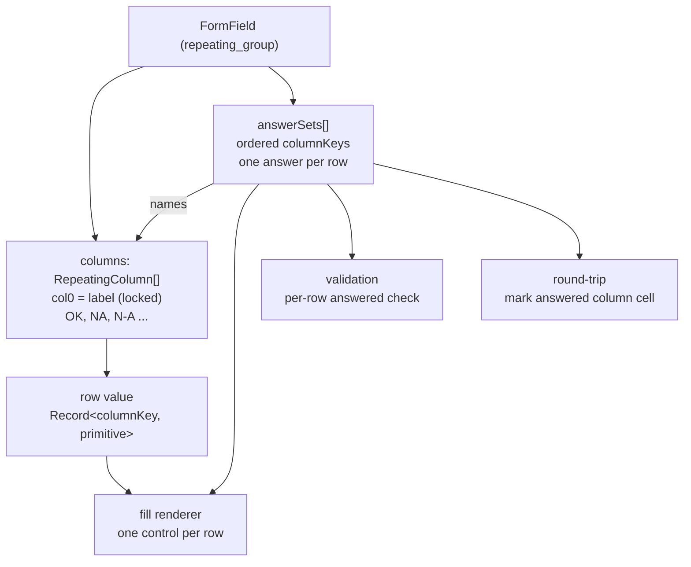
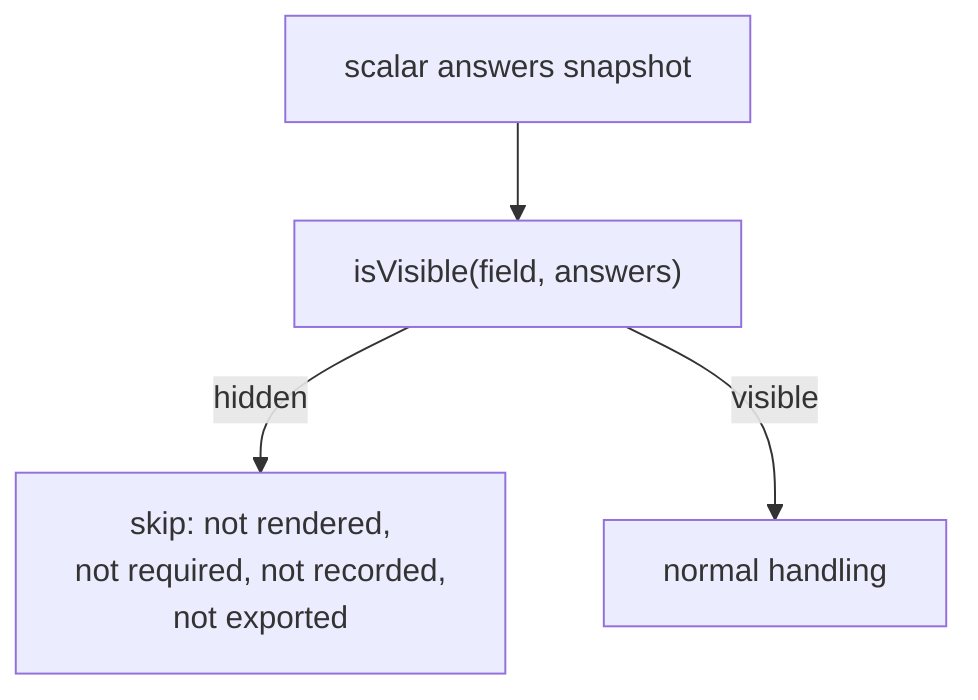
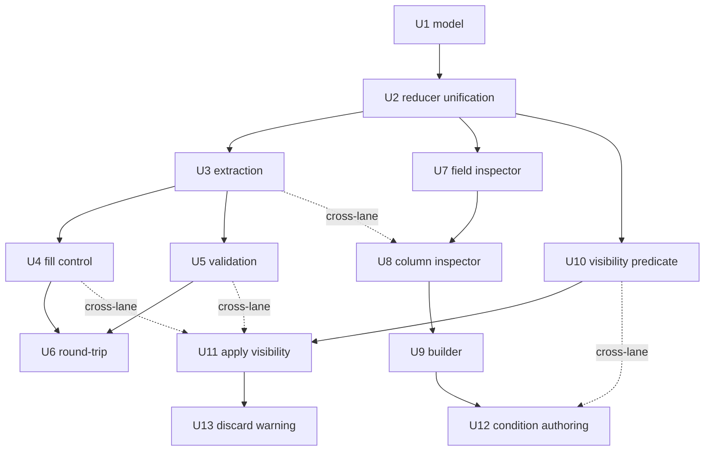

# Imported Form Field Control - Plan

## Goal Capsule

- **Objective:** Make an imported PDF form genuinely usable before it is published, by adding the one answer-shape the model cannot express today (one answer per row across a set of table columns) and the editing surfaces to correct everything else.
- **Product authority:** The Product Contract below. Implementation design lives in the Planning Contract.
- **Open blockers:** One, before Lane 1 starts — whether AI-path table geometry capture is in scope, which decides whether U6's export marking has a reachable user. Two further forks are deferred to implementation. See Open Questions.
- **Delivery shape:** Lane 0 (U1–U2) lands first as a shared foundation. Lanes 1–3 then start together, with ordered file ownership rather than full independence — Lane 2 waits on U3 before U8, and Lane 3 waits on U4 and U5 before U11. See Sequencing.
- **Product Contract preservation:** Changed R2 and AE7 — extraction never records per-cell PDF geometry for repeating tables, so "which source control an option came from" was not implementable. Restated as column identity. See KTD3.

---

## Product Contract

### Summary

Imported forms gain an answer-set primitive — an ordered group of table columns sharing a single answer per row — proposed automatically by extraction and correctable in review. Alongside it, the review screen becomes a real pre-publish field editor, the builder learns to edit imported structural fields, and sections can be shown or hidden based on a top-level answer so one form serves multiple locations.

### Problem Frame

The organisation's compliance library is built on one table shape: a row of pre-printed items, and a set of columns from which exactly one is chosen. `ADMN-FRM-111 Light Vehicle Pre-start Checklist` uses `OK` / `NA`. The machine competency assessments (`Authorised to Operate Track Dozer` and its Grader, Scraper and Small Loader siblings) use `✓` / `×` / `N-A` across dozens of rows and eighteen pages. It is the house pattern, not an outlier.

Extraction reads those columns as independent checkboxes. A filler can tick both `OK` and `NA`, or neither, on a row the form declares required. There is no way to correct it: the review screen edits only checklist row labels and the required flag, and the builder excludes structural field types from its palette, so an imported table renders as an empty placeholder even after publish. The consequence is not degraded output — these forms cannot be shipped at all, and the paperwork stays on paper.

The assessments add a second unmet need. The Dozer tool is three documents sharing a General core: `General — All Locations`, `BBM Mining Only`, and `Raw Materials Only`. On paper the assessor prints everything and skips what does not apply. Digitally that requires hiding sections based on an answer given in the form. The existing competency gating keys off what the filler *holds* (a ticket), not what they *answered*, so it does not serve this.

### Requirements

**Shared foundation (Lane 0)**

- R1. A repeating table's columns can be declared as an *answer set*: an ordered group of columns sharing exactly one answer per row. Multi-select sets are out of scope — see Roadmap item 9.
- R2. An answer set records which column each option corresponds to, so a row's single answer resolves to exactly one column when the submission is rendered back onto the source PDF.
- R3. A form field can carry a visibility condition referencing another field's answer. Lane 0 establishes the shape only; evaluation is Lane 3.
- R4. The review screen exposes a per-field inspector region that later lanes extend without modifying its host.

**Answer sets end to end (Lane 1)**

- R5. Extraction proposes an answer set when it detects a mutually exclusive column set, with a confidence value attached to the proposal. Known shapes include `OK`/`NA`, `✓`/`×`/`N-A` and `Pass`/`Fail`/`NA`.
- R6. A proposed grouping is never silently applied. Review shows which columns were grouped and lets the reviewer accept, ungroup, or regroup them.
- R7. Answering a row of an answer set takes one interaction. On desktop the row renders one radio per option column; on narrow viewports it renders a single control per row that cycles through the options.
- R8. Selecting an option deselects the others in the set. Selecting the currently-chosen option clears the row.
- R9. A required table backed by an answer set is satisfied only when every row has an answer. An explicit `N/A` counts as an answer.
- R10. On failed submit, unanswered rows are identified individually rather than the table being flagged as a whole.
- R11. Exporting a submission marks the cell belonging to the answered column, on any form whose field position was recorded at import. No import path produces that geometry for repeating tables today, so in this plan every real form exports as recorded data and the marking path is proved by fixture only. See KTD3 and the Open Question on geometry capture.
- R12. No bulk-answer affordance is offered for answer sets.

**Editing surfaces (Lane 2)**

- R13. Before publish, a reviewer can rename any field, change its type, edit its options, toggle required, and delete it.
- R14. Before publish, a reviewer can add a field, reorder fields, and insert a section header.
- R15. Before publish, a reviewer can rename a table column, change its type, mark it required, and group or ungroup columns into an answer set.
- R16. Existing fixed-row checklist editing (rename, add, remove items) is preserved unchanged.
- R17. After publish, the builder can edit imported fields including repeating tables, using the same inspector as review. An imported table is never rendered as a non-editable placeholder.
- R18. Pre-publish edits never mutate an already-published version; they apply to the draft being reviewed.

**Conditional sections (Lane 3)**

- R19. A field or section can be shown or hidden based on the answer to another field. A section is authored as one condition on its section header, applied to every field from that header up to the next one — not by repeating the condition on each field.
- R20. Only non-repeating fields can be condition sources. Table cells and derived table rollups cannot.
- R21. A hidden field is not required, is excluded from validation, is absent from the submission record, and is not written to an exported PDF.
- R22. When changing an answer would hide fields that already hold answers, the filler is told before those answers are discarded.
- R23. Conditions are authored in the same field inspector as the rest of a field's settings.

### Key Flows

- F1. Import a checklist form with a mutually exclusive column set
  - **Trigger:** A reviewer uploads a PDF whose tables use `OK`/`NA` or `✓`/`×`/`N-A`.
  - **Steps:** Extraction detects the column set and proposes an answer set. Review displays the table with its grouping shown and the reviewer accepts it, or ungroups and regroups the columns. The reviewer corrects labels, types and required flags on any field in the same pass. Publish produces a form whose rows accept exactly one answer.
  - **Outcome:** A published form that cannot record a contradictory row.
  - **Covers:** R5, R6, R13, R15

- F2. Fill a multi-location assessment
  - **Trigger:** An assessor opens a form containing General plus location-specific sections.
  - **Steps:** The assessor answers Location. Sections scoped to other locations are hidden and drop out of validation. The assessor completes the visible sections. If they change Location after answering, they are warned before the hidden answers are discarded.
  - **Outcome:** One submission covering only the applicable sections, with no unanswered-required errors for sections that never applied.
  - **Covers:** R19, R21, R22

- F3. Correct a published imported form
  - **Trigger:** A wrong column type is discovered after publish.
  - **Steps:** The form is opened in the builder. The imported table is editable through the same inspector as review. The correction produces a new version.
  - **Outcome:** No re-import needed to fix a field-level mistake.
  - **Covers:** R17, R18

### Acceptance Examples

- AE1. **Covers R8.** Given a row with `✓` selected, when the assessor selects `N-A`, then `✓` clears and `N-A` is the row's only answer.
- AE2. **Covers R8.** Given a row with `✓` selected, when the assessor selects `✓` again, then the row returns to unanswered.
- AE3. **Covers R9.** Given a required table where every row is answered and four rows are `N/A`, when the filler submits, then the table passes validation.
- AE4. **Covers R10.** Given a required 20-row table with rows 7 and 14 unanswered, when the filler submits, then rows 7 and 14 are each identified.
- AE5. **Covers R21.** Given Location is `BBM Mining` and the Raw Materials section is hidden, when the filler submits with that section untouched, then submission succeeds and the submission record contains no Raw Materials answers.
- AE6. **Covers R22.** Given the filler has answered eight rows inside the BBM Mining section, when they change Location to `Raw Materials`, then they are told those answers will be discarded before the change takes effect.
- AE7. **Covers R11.** Given a row answered `×` on a repeating field carrying a source position, when the submission is exported, then the `×` column's cell carries the mark and the `✓` and `N-A` cells are blank. No current import path produces such a field, so this example is exercised by a fixture with an injected position rather than by an imported document.
- AE8. **Covers R6.** Given extraction proposed grouping three columns that are not actually exclusive, when the reviewer ungroups them, then each column returns to an independent cell and the form publishes that way.

### Scope Boundaries

**Which fixture actually leaves paper.** `ADMN-FRM-111` replaces its paper original when this plan ships — it needs a table that records one answer per row, and nothing else. The Dozer assessment does not. It gains grouped tables, correct validation and location scoping, but a machine competency record without an assessor signature, a Competent / Not Yet Competent verdict, or logbook hours is not a substitute for the paper assessment; those are Roadmap items 3 to 5. Treat the assessment work here as substrate that de-risks those items, not as delivery of the assessment itself.

Deferred items are sequenced in the Roadmap below. Two items are not planned at all:

- Editing the source PDF itself. The PDF is the import source and the export target, never an editing surface.
- Replacing competency gating. Gating on a held ticket and gating on a given answer are different mechanisms and both remain.

---

## Planning Contract

### Key Technical Decisions

- KTD1. **An answer set is a property on the field, not a new field type.** `FormField` gains an `answerSets` array; each entry names the column keys it spans and its selection type. Columns keep their existing definitions, so a table can mix grouped and ungrouped columns, and fixed-row checklists, ad-hoc row tables and mixed tables stay on one code path. The alternative — a new `answer_set` column type — would have forced the grouping relationship into a single column and broken the existing `columns[0]` label-column contract that `submission-validation.ts:44` and `RepeatingGroup.tsx:136` both depend on.

- KTD2. **The review screen adopts the builder's reducer instead of growing a second editor.** `builderReducer` (`apps/web/src/screens/builder/reducer.ts:131`) already implements `add`, `update`, `changeType`, `duplicate`, `delete`, `move`, `reorder`, option editing and undo/redo over `FormField[]` — the exact action set R13 and R14 describe. The import session instead carries five ad-hoc mutators (`setFieldRequired`, `renameFixedRowItem`, `addFixedRowItem`, `removeFixedRowItem`, plus `setType`/`confirmTable` on the hook). U2 lifts the reducer to a shared module both screens consume, which is what makes Lane 2 an inspector-panel job rather than an editor build.

- KTD3. **Round-trip marks the answered column's cell within the existing arithmetic layout.** There is no per-cell geometry to target: `sourcePosition` (`packages/shared/src/form-field.ts:46`) is per-field, is only ever populated on the AcroForm path (`extract.ts:68`), and AcroForm extraction never produces `columns` at all — so every repeating table in the product comes from the AI path with no geometry whatsoever. `drawRepeatingGroup` (`apps/api/src/pdf/round-trip.ts:80`) already divides the field's single box into equal rows and columns. An answer therefore resolves to a column index, and the existing `'X'` glyph is drawn in that column's cell. This is why R2 was restated.

- KTD4. **Row values keep their current shape; the answer set is a read/write convention over existing cells.** A repeating row is `Record<columnKey, primitive>` (`packages/shared/src/submission.ts:21`). Answering an option writes `true` to that column's key and `null` to its siblings, rather than introducing a new per-row answer field. Existing submissions, the `z.custom` wire schemas in `apps/api/src/routes/submissions.ts:112`, and the read-only submission-detail render all keep working untouched.

- KTD5. **Visibility is evaluated in shared code, not per surface.** A single predicate module in `packages/shared` is consumed by the fill renderer, `missingRequiredFields`, the submission writer and the round-trip exporter. R21 requires all four to agree on what is hidden; four independent implementations would drift.

- KTD6. **Conditions resolve against a snapshot of scalar answers only.** R20 restricts sources to non-repeating fields, so evaluation needs no row state and cannot loop. A condition referencing a deleted or repeating field evaluates to visible, so a malformed template never hides content silently.

### High-Level Technical Design

How an answer set sits over existing structures. The columns and row values are unchanged; the answer set is the grouping layer, and it is what the renderer, validator and exporter each consult.

Visibility evaluation, shared by all four consumers:

### Assumptions

- Imported tables can reach publish today — they render as an unusable placeholder in the builder, which is why the two-independent-checkbox shape is believed to be unused rather than impossible. No data migration is planned on that basis. The belief is checkable, so U1 carries a pre-work step: query published versions for `repeating_group` fields with two or more boolean columns and record the count here. A non-zero count makes migration real work that must be scoped before U9 ships, because U9 turns those placeholders into live editable tables.
- Version history and the draft-versus-published lifecycle already exist and are relied on by R18 and F3.
- The baseline is green as of this plan: `pnpm -r test` passes 511 tests across 44 files, and `pnpm typecheck` passes in all five projects. Any failure after a unit lands is caused by that unit.
- Arithmetic cell division is only faithful on a uniform grid. `drawRepeatingGroup` splits the field box into equal columns and rows, which assumes the box spans exactly the printed table and that every column is the same width. The assessment tables have a wide label column and narrow option columns, so if geometry is ever populated (Roadmap item 8) marks would land in the wrong printed cells while the export still reported success. Nothing exercises this today because no repeating table carries geometry; it is recorded so item 8 does not inherit the assumption silently.
- Extraction quality for R5 depends on the Anthropic model behind `extractWithAI`. The prompt change is testable through normalization; the detection rate itself is not unit-testable and is proved by the fixture forms named in the Verification Contract.

### Sequencing

Lane 0 is a hard barrier. U1 and U2 must both merge before any lane branches, because every lane touches the model or the review screen.

The lanes start together but are not independent for their whole length. Three cross-lane edges exist, and each is a point where one owner waits on another:

- **Lane 1** — U3, then U4 and U5 in either order, then U6.
- **Lane 2** — U7, U8, U9, U12. U8 cannot start until Lane 1's U3 lands.
- **Lane 3** — U10, U11, U13. U11 cannot start until Lane 1's U4 and U5 land.

Two owners therefore have a waiting window. Lane 2 can do U7 while waiting on U3. Lane 3 can do U10 while waiting on U4 and U5, and U10 is pure logic with no consumers, so it is genuinely unblocked work. If the waits still bite, the honest fallback is two engineers rather than three until U3 lands.

### File Ownership Guardrails

Every file any unit touches appears below with its owning lane. A change to a file outside your lane's rows is a signal to stop and coordinate, not to edit. Rows naming two lanes are ordered handoffs, not concurrent edits — the earlier unit lands first.

**Frozen after Lane 0** — no lane edits these again:

| File | Owner |
|---|---|
| `packages/shared/src/form-field.ts` | Lane 0, U1 |
| `packages/shared/src/extraction.ts` | Lane 0, U1 |
| `packages/shared/src/answer-set.ts` | Lane 0, U1 |
| `apps/web/src/lib/field-editor/reducer.ts` | Lane 0, U2 |

**Single-lane after Lane 0:**

| File | Owner |
|---|---|
| `apps/api/src/pdf/tool-schema.ts`, `apps/api/src/pdf/extract.ts` | Lane 1, U3 |
| `packages/ui/src/components/RepeatingGroup.tsx` | Lane 1, U4 |
| `apps/web/src/screens/import/inspector/FieldInspector.tsx` | Lane 2, U7 then U12 |
| `apps/web/src/screens/import/inspector/ColumnInspector.tsx` | Lane 2, U8 |
| `apps/web/src/screens/import/inspector/ConditionEditor.tsx` | Lane 2, U12 |
| `apps/web/src/screens/import/ImportReviewScreen.tsx` | Lane 0 U2, then Lane 2 U7 and U8 |
| `apps/web/src/screens/builder/BuilderScreen.tsx` | Lane 0 U2, then Lane 2 U9 and U12 |
| `packages/shared/src/visibility.ts` | Lane 3, U10 |
| `apps/web/src/lib/fill-layout.ts` | Lane 3, U11 |
| `apps/api/src/routes/pdf.ts` | Lane 3, U11 |

**Shared between lanes — resolved by landing order, not by locking:**

| File | Order |
|---|---|
| `packages/shared/src/index.ts` | Lane 0 U1, then Lane 3 U10 |
| `apps/web/src/lib/data/import-session.ts` | Lane 0 U2, then Lane 1 U3 |
| `packages/shared/src/submission-validation.ts` | Lane 1 U5, then Lane 3 U11 |
| `apps/web/src/screens/fields/FieldRenderer.tsx` | Lane 1 U4, then Lane 3 U11 and U13 |
| `apps/api/src/routes/submissions.ts` | Lane 1 U5, then Lane 3 U11 |
| `apps/api/src/pdf/round-trip.ts` | Lane 1 U6, then Lane 3 U11 |

Every shared row puts Lane 1 first. That is not a coincidence — Lane 1 establishes the answer-set behavior the other lanes filter and extend, so Lane 1 landing first is what makes the ordering safe rather than merely conventional.

**Keeping this table honest.** It is derived from the units' own Files lists. If a unit's file list changes, this table is stale until it is regenerated from those lists — treat the unit lists as authoritative and this table as the view.

---

## Implementation Units

### U1. Answer-set and visibility model

- **Goal:** Add the two shapes every other unit depends on, with no behavior change.
- **Requirements:** R1, R2, R3
- **Dependencies:** none
- **Files:** `packages/shared/src/form-field.ts`, `packages/shared/src/extraction.ts`, `packages/shared/src/index.ts`, `packages/shared/src/answer-set.ts` (new), `apps/api/src/routes/answer-set.test.ts` (new)
- **Pre-work, before any model change:** query published template versions for `repeating_group` fields carrying two or more boolean columns, and record the count in Assumptions. The no-migration decision rests on that count being zero, and U9 later turns those fields from inert placeholders into editable tables — so a non-zero count has to surface now, not after Lane 2 ships.
- **Where the tests live:** `packages/shared` has no test runner — its `package.json` declares only `typecheck` and `build`, and `pnpm -r test` covers five of six projects. The established pattern is to test shared logic from `apps/api`, as `submission-validation.ts` already is from `apps/api/src/routes/submission-validation.test.ts`. Follow it rather than adding vitest to `packages/shared`.
- **Approach:** `FormField` gains `answerSets?: AnswerSet[]` and `visibleWhen?: VisibilityCondition`, and `ExtractedField` gains `answerSets` alongside its existing `columns` and `fixedRows`. An `AnswerSet` names a stable key, the ordered `columnKeys` it spans, and an optional `required`. A `VisibilityCondition` names a source `fieldId`, an operator, and a comparison value. Both are optional, so every existing template stays valid. Add resolver helpers here rather than in consumers: given a field and a column key, which answer set owns it; given a field and a row, which option is currently chosen. KTD1 and KTD4 govern the shape.
- **No `selectionType` field.** An earlier draft carried `single | multiple`. Nothing renders, validates or exports `multiple` — U5 defines a complete row as one with exactly one chosen option, so a multi-select set would be constructible and permanently unsubmittable. Model single-answer only; multi-select is Roadmap item 9 and needs its own render, validate and export semantics before the model should admit it.
- **Patterns to follow:** the existing optional-member style of `FormField` (`columns`, `fixedRows`, `sourcePosition`) — additive optional members with a comment naming which field type they apply to.
- **Test scenarios:**
  - A field with no `answerSets` resolves every column as ungrouped.
  - A column named by two answer sets is rejected by the resolver as malformed rather than silently resolving to the first.
  - An answer set naming a column key that does not exist in `columns` resolves to no columns rather than throwing.
  - An answer set naming the label column (`columns[0]`) is rejected — the label column is never answerable.
  - Selected-option lookup returns the single column whose row value is truthy; returns null when none are; returns the first plus a malformed signal when more than one is truthy.
- **Verification:** `pnpm typecheck` passes and `pnpm --filter @formai/api test` passes with the new answer-set suite. No existing test changes.

### U2. Lift the builder reducer into a shared field editor

- **Goal:** One field-editing reducer consumed by both the builder and the import review screen, so Lane 2 extends one surface rather than two.
- **Requirements:** R4, R13, R14, R18
- **Dependencies:** U1
- **Files:** `apps/web/src/lib/field-editor/reducer.ts` (moved from `apps/web/src/screens/builder/reducer.ts`), `apps/web/src/lib/field-editor/reducer.test.ts` (moved), `apps/web/src/screens/builder/BuilderScreen.tsx`, `apps/web/src/lib/data/import-session.ts`, `apps/web/src/lib/data/import-session.test.ts`, `apps/web/src/screens/import/ImportReviewScreen.tsx`
- **Approach:** Move the reducer, its action union, `FIELD_META`, `PALETTE` and the state initializers to a shared module; the builder imports from the new location with no behavior change. The import session then holds `FormField[]` as its working copy plus a parallel per-field overlay carrying extraction metadata (confidence, note, resolved). Keep the overlay separate rather than widening `FormField` — confidence is a property of the extraction, not of the published field, and `reviewedToFields` already exists to drop it at publish. Replace the ad-hoc mutators with reducer dispatch, keeping the existing exported function names as thin wrappers so `ImportReviewScreen` does not change shape in this unit.
- **Execution note:** This is a refactor with no intended behavior change. Run the existing `reducer.test.ts` and `import-session.test.ts` before touching anything and treat them as the characterization baseline; they should pass unchanged at the end.
- **Patterns to follow:** the existing `mutate` helper in the reducer, which handles undo-stack bookkeeping — new actions must go through it or undo silently breaks.
- **Test scenarios:**
  - Every existing `reducer.test.ts` case passes unchanged from the new module path.
  - Every existing `import-session.test.ts` case passes — the wrappers preserve `setFieldRequired`, `renameFixedRowItem`, `addFixedRowItem` and `removeFixedRowItem` semantics exactly.
  - The extraction overlay survives a reducer edit: changing a field's label leaves its confidence and note intact.
  - Deleting a field removes both the field and its overlay entry.
  - `reviewedToFields` output for an untouched extraction is byte-identical to the pre-refactor output for the same input.
- **Verification:** `pnpm --filter @formai/web test` passes with no test file rewritten beyond its import path.

### U3. Extraction proposes answer sets

- **Goal:** The AI extraction path recognises mutually exclusive column sets and emits them as grouped, with confidence.
- **Requirements:** R5
- **Dependencies:** U1, U2
- **Files:** `apps/api/src/pdf/tool-schema.ts`, `apps/api/src/pdf/extract.ts`, `apps/api/src/pdf/extract.test.ts`, `apps/web/src/lib/data/import-session.ts`, `apps/web/src/lib/data/import-session.test.ts`
- **Approach:** Add an `answerSets` property to the per-field schema alongside `columns` and `fixedRows`, and teach `EXTRACTION_PROMPT` the distinction between columns that are independent checkboxes and columns that are alternatives sharing one answer, naming the house shapes from R5. Normalize in `normalizeField` next to the existing `fixedRows` invariant: drop sets naming unknown or label columns, drop sets of fewer than two columns, and drop duplicate column membership. A dropped proposal is not an error — the table simply publishes ungrouped, which R6 lets the reviewer fix.
- **The publish path drops unknown properties.** `reviewedToFields` (`import-session.ts:304`) builds each published `FormField` from an explicit whitelist (`...(f.columns ? { columns: f.columns } : {})`), so a newly-extracted `answerSets` reaches review and is then silently discarded at publish unless that function is extended too. Without this, extraction, review and every Lane 1 consumer all appear to work while published forms come out ungrouped.
- **Patterns to follow:** `toColumns` and `toFixedRows` (`extract.ts:175`, `extract.ts:189`) — tolerant coercion that collapses malformed model output to `undefined` rather than throwing. `normalizeField` (`extract.ts:194`) is where cross-property invariants already live. `reviewedToFields`' existing conditional-spread style is the pattern for carrying the new property through.
- **Test scenarios:**
  - A model response grouping `OK` and `NA` produces one answer set spanning those two column keys.
  - A model response grouping `✓`, `×` and `N-A` produces one three-column set.
  - A set naming a column absent from `columns` is dropped and the field still parses.
  - A set naming `columns[0]` (the label column) is dropped.
  - A set with one column key is dropped.
  - Two sets naming the same column produce at most one surviving set.
  - A response with no `answerSets` property parses exactly as it does today — the existing extraction tests still pass.
  - The AcroForm path is untouched: an AcroForm PDF still yields scalar fields with no `answerSets`.
  - `reviewedToFields` carries `answerSets` onto the published field; a grouped table survives publish still grouped.
  - `reviewedToFields` output for a field with no `answerSets` is unchanged from today.
- **Verification:** `pnpm --filter @formai/api test` passes. Manually extract `ADMN-FRM-111` and the Dozer assessment and confirm the OK/NA and ✓/×/N-A tables come back grouped.

### U4. Answer-set row control in the fill renderer

- **Goal:** A grouped row is answered with one interaction, presented as radios on desktop and a cycling control on narrow viewports, and an unanswered row is identifiable after a failed submit.
- **Requirements:** R7, R8, R10, R12
- **Dependencies:** U1, U2, U3
- **Files:** `packages/ui/src/components/RepeatingGroup.tsx`, `packages/ui/src/components/RepeatingGroup.test.tsx` (new), `apps/web/src/screens/fields/FieldRenderer.tsx`
- **Approach:** `RepeatingGroup` takes the field's answer sets as a prop. When a column belongs to a set, its cell renders the set's control rather than an independent checkbox; the first member column renders the control and the remaining member columns render nothing, so the table keeps its printed column headers. Writing an answer sets the chosen column's key truthy and its siblings null per KTD4. Presentation splits on viewport, not on device type — the desktop form is one radio per member column, the narrow form is a single control in the first member cell that cycles through the options and back to unanswered. No bulk-answer control is added anywhere (R12).
- **Keep `@formai/ui` dependency-free.** The package depends only on `clsx` and `tailwind-merge`, and deliberately redeclares `RepeatingColumn` locally rather than importing from `@formai/shared` — the file says so at `RepeatingGroup.tsx:4`. Follow that precedent: declare a structurally-compatible answer-set interface locally in the component, and keep every U1 resolver call in `FieldRenderer.tsx`, passing the resolved selection down as props. Importing `@formai/shared` into `packages/ui` to reach the helpers would reverse an existing architectural decision, which is not this unit's call to make.
- **Narrow viewport collapses the member columns.** Keeping empty cells for the non-first member columns would spend most of a phone's width on blank space and push the label column off-screen behind a horizontal scroll — unrecoverable for a gloved operator. Below the breakpoint, render an answer set as a single column headed by the set's name and drop the individual option headers; the printed per-option headers are a desktop affordance.
- **Touch targets have a floor.** Every answer-set control is at least 44 by 44 CSS pixels at every viewport, with the whole cell acting as the target. A mis-tap on a dense compliance table records a wrong answer that validation cannot catch, because a wrong answer is still an answer — so the sizing floor is a correctness control here, not a polish item.
- **Accessible semantics are part of this unit, not a follow-up.** Fillers include screen-reader users, and a control whose meaning changes on each tap is unusable without explicit state. Desktop: wrap each row's radios in a `radiogroup` labelled by that row's label cell, one tab stop per row with arrow-key movement between options. Narrow: the cycling control is a button whose accessible name carries both the row's label-column text and the current answer, with the change announced politely so the new value is spoken without moving focus. Both presentations name the row, not just the column — on a forty-row table, "N/A" alone tells the user nothing about which item they just answered.
- **Row-level errors are this unit's job, not U5's.** U5 puts unanswered row indices on the wire; without a renderer they never reach the person R10 exists for, who is otherwise left re-scanning a forty-row table by eye on a phone. `RepeatingGroup` already accepts an `errorRowIndexes` prop and highlights those rows (`RepeatingGroup.tsx:42`, `:126`) — wire the U5 response detail into it, set `aria-invalid` on the flagged rows' controls, and scroll the first flagged row into view on a failed submit.
- **Patterns to follow:** the existing `explicitYesNo` branch in `RepeatingCell` (`RepeatingGroup.tsx:232`), which already renders a multi-state control with a null unanswered state and toggles back to null on reselect — the answer-set control is a generalization of it. For error rows, the existing `errorRowIndexes` highlight path is already built; this unit supplies it real data rather than inventing a second mechanism.
- **Test scenarios:**
  - Covers AE1. Selecting a second option in a set clears the first.
  - Covers AE2. Selecting the currently-chosen option returns the row to unanswered.
  - A column not in any answer set still renders its own independent control and is unaffected by set writes.
  - A row with two truthy member columns (malformed legacy data) renders as the first truthy option rather than crashing.
  - The fixed-row label column stays locked and unanswerable when the remaining columns form a set.
  - `readOnly` mode renders the chosen option's label and an em dash when unanswered.
  - A table with a set plus a trailing free-text comments column renders both.
  - Covers AE4. A failed submit on a 20-row table with rows 7 and 14 unanswered renders both rows as errored and neither of the answered rows.
  - The first errored row is scrolled into view on a failed submit.
  - Answering an errored row clears its error state without a resubmit.
  - A row's controls carry both the row's label text and the option in their accessible name.
  - Changing the cycling control's value updates its accessible name to the new answer.
  - Each desktop row exposes a single tab stop, with arrow keys moving between that row's options.
  - `packages/ui` gains no new dependency; `@formai/ui` still imports only `clsx` and `tailwind-merge`.
  - Below the breakpoint an answer set renders one column, with no empty member cells.
  - Every answer-set control meets the 44px minimum target at both presentations.
- **Verification:** `pnpm --filter @formai/ui test` and `pnpm --filter @formai/web test` pass. Load a published Dozer-shaped form, answer a full table, then submit one deliberately incomplete and confirm the missed rows are identifiable without scrolling the whole table.

### U5. Per-row validation for answer sets

- **Goal:** A required grouped table is satisfied only when every row is answered, and the API reports which rows are unanswered. Rendering those rows is U4's job.
- **Requirements:** R9, R10
- **Dependencies:** U1, U3
- **Files:** `packages/shared/src/submission-validation.ts`, `apps/api/src/routes/submissions.ts`, `apps/api/src/routes/submission-validation.test.ts`
- **Approach:** Extend the row-completeness rule so a row backed by an answer set is complete when the set has exactly one chosen option, rather than the current "at least one non-label cell answered" rule (`submission-validation.ts:79`), which an all-blank grouped row would fail correctly but a double-ticked row would wrongly pass. Then widen the wire error: `missingRequiredFields` returns field ids only today, so add a parallel per-field row-index detail and carry it in the 400 body alongside the existing `fields` array. Keep `fields` unchanged so existing clients and the two call sites in `submissions.ts:212` and `submissions.ts:289` keep working.
- **Patterns to follow:** `incompleteFixedRowIndices` (`submission-validation.ts:64`) already returns row indices for fixed-row tables — extend it rather than adding a second row-scanning function.
- **Test scenarios:**
  - Covers AE3. A grouped required table with every row answered, four of them `N/A`, passes validation.
  - Covers AE4. A 20-row grouped table with rows 7 and 14 blank reports exactly those two indices.
  - A row with two truthy member columns fails validation rather than passing as answered.
  - An ungrouped fixed-row table validates exactly as it does today — the existing fixed-row tests pass unchanged.
  - Ad-hoc rows appended past `fixedRows.length` remain exempt from the required check.
  - A short value array (fewer rows than `fixedRows`) reports the missing tail indices.
  - The 400 response still carries the existing `fields` array with the same shape.
- **Verification:** `pnpm --filter @formai/api test` passes with the existing validation suite unchanged.

### U6. Round-trip marks the answered column

- **Goal:** An exported PDF shows the mark in the answered column's cell and nowhere else in the set.
- **Requirements:** R11
- **Dependencies:** U1, U3
- **Files:** `apps/api/src/pdf/round-trip.ts`, `apps/api/src/pdf/round-trip.test.ts`
- **Approach:** `drawRepeatingGroup` resolves each row's chosen option through the U1 helper and draws the existing `'X'` glyph at that column's computed cell, leaving sibling cells blank. The arithmetic column and row geometry is unchanged per KTD3. Fields with no `sourcePosition` continue to be skipped entirely (`round-trip.ts:50`).
- **Reachability — read before starting.** No import path currently gives a repeating table a `sourcePosition`, so this unit changes behavior only for fields carrying injected geometry. It is proved by fixture tests, not by exporting an imported document, and it exists so that adding geometry capture later does not also require rewriting the export path. If that trade reads as not worth the unit, the alternative is to cut U6 and drop R11's marking clause — settle it before Lane 1 starts rather than mid-unit.
- **Patterns to follow:** the current boolean cell branch (`round-trip.ts:98`), which already renders `'X'` or empty — the change is which cell receives it, not how it is drawn.
- **Test scenarios:**
  - Covers AE7. On a fixture field with an injected `sourcePosition`, a row answered on the third of three member columns marks the third cell and leaves the first two blank.
  - An unanswered grouped row marks no cell in the set.
  - A malformed row with two truthy members marks one cell, not two.
  - An ungrouped table exports exactly as it does today — the existing round-trip tests pass unchanged.
  - A field with no `sourcePosition` is skipped and export still succeeds for the remaining fields.
  - A table mixing a grouped set with a free-text column renders both.
- **Verification:** `pnpm --filter @formai/api test` passes, including the injected-position fixture. Export a filled `ADMN-FRM-111` submission and confirm it produces a data export with no repeating-table marks and no error — the current, expected behavior for an AI-extracted form.

### U7. Field inspector on the review screen

- **Goal:** Every extracted field is fully editable before publish.
- **Requirements:** R13, R14, R16
- **Dependencies:** U2
- **Files:** `apps/web/src/screens/import/inspector/FieldInspector.tsx` (new), `apps/web/src/screens/import/inspector/FieldInspector.test.tsx` (new), `apps/web/src/screens/import/ImportReviewScreen.tsx`
- **Approach:** Add an inspector panel bound to the selected review row, dispatching the U2 reducer actions for label, type, options, required and delete, plus add and reorder at the list level. The existing confidence badge, low-confidence remap affordance and fixed-row item editor stay where they are and keep their current behavior (R16) — this unit adds an editing surface rather than replacing the triage surface. Field selection already exists (`ImportReviewScreen.tsx:77`) and syncs the PDF pane; the inspector binds to the same selection.
- **States beyond a selected field.** The panel has three non-happy-path states and each needs a defined answer or three implementers invent three: nothing selected renders a persistent prompt to pick a field rather than a collapsed panel that shifts the layout; deleting the selected field falls back to that same prompt; a selected `section_header` renders label and delete only, since it has no type, options or required flag.
- **Patterns to follow:** the builder's existing inspector layout and the `Required` switch block already mirrored at `ImportReviewScreen.tsx:461`.
- **Test scenarios:**
  - Renaming a field updates the review row and survives navigation to publish.
  - Changing a field's type to `dropdown` seeds default options, matching builder behavior.
  - Deleting a field removes it from the publish payload.
  - Reordering fields changes their published order.
  - Adding a section header inserts it after the selected field.
  - Fixed-row item rename, add and remove still work unchanged.
  - Undo reverses a label edit and a delete.
  - With nothing selected the inspector shows its prompt state and the layout does not shift.
  - Deleting the selected field returns the inspector to the prompt state rather than showing a stale field.
  - Selecting a section header shows label and delete only.
- **Verification:** `pnpm --filter @formai/web test` passes. Import `ADMN-FRM-111`, rename and delete a field, publish, and confirm the published form matches.

### U8. Column and answer-set inspector

- **Goal:** A reviewer can retype columns and group or ungroup them before publish.
- **Requirements:** R6, R15
- **Dependencies:** U3, U7
- **Files:** `apps/web/src/screens/import/inspector/ColumnInspector.tsx` (new), `apps/web/src/screens/import/inspector/ColumnInspector.test.tsx` (new), `apps/web/src/screens/import/ImportReviewScreen.tsx`
- **Approach:** When the selected field is a repeating table, the inspector adds a column list — rename, retype, required per column — and a grouping control showing which columns extraction proposed as one answer, with accept, ungroup and regroup. Proposals render as visibly proposed rather than settled (R6). The label column is displayed but not groupable or retypeable, matching the U1 resolver rules.
- **Patterns to follow:** the existing repeating-table review affordance at `ImportReviewScreen.tsx:378`, which already lists columns as chips and offers a confirm action.
- **Test scenarios:**
  - Covers AE8. Ungrouping a proposed three-column set returns all three to independent cells and publishes that way.
  - Grouping two previously independent columns produces a valid set that the fill renderer honors.
  - The label column cannot be added to a set.
  - Grouping a column already in another set moves it rather than duplicating membership.
  - Renaming a column preserves its key, so existing row values and any answer set naming it stay valid.
  - Retyping a grouped column to `text` removes it from its set rather than leaving a malformed set.
  - A table with no proposed set shows the grouping control in its empty state.
- **Verification:** `pnpm --filter @formai/web test` passes. Import the Dozer assessment, ungroup and regroup a table, publish, and fill it.

### U9. Builder edits imported structural fields

- **Goal:** An imported table stops being a read-only placeholder after publish.
- **Requirements:** R17
- **Dependencies:** U7, U8
- **Files:** `apps/web/src/screens/builder/BuilderScreen.tsx`
- **Approach:** Lift the palette restriction that excludes `repeating_group`, `checkbox_group` and `boolean_yes_no` (`BuilderScreen.tsx:65`) so imported structural fields render and select normally, and mount the U7 and U8 inspector panels in the builder's field tab. Whether the palette also offers *creating* a repeating table from scratch is a separate question — R17 only requires editing imported ones, and the empty-table creation flow has no requirement behind it. Default to editing only; see Open Questions.
- **Patterns to follow:** the builder's existing per-type inspector switch, which the new panels slot into rather than replace.
- **Test scenarios:**
  - An imported repeating table renders its rows in the builder canvas instead of an empty box.
  - Selecting it opens the column inspector.
  - Renaming a column in the builder produces a new version whose fill view reflects the change.
  - Deleting an imported table removes it from the version.
  - Undo and redo cover structural-field edits.
  - A form containing only built fields behaves exactly as before.
- **Verification:** `pnpm --filter @formai/web test` passes. Open a published imported form in the builder and correct a column.

### U10. Visibility predicate module

- **Goal:** One shared answer to "is this field visible", consumed by all four surfaces.
- **Requirements:** R19, R20
- **Dependencies:** U1
- **Files:** `packages/shared/src/visibility.ts` (new), `apps/api/src/routes/visibility.test.ts` (new), `packages/shared/src/index.ts`
- **Approach:** Export a predicate taking a field and a snapshot of scalar answers, plus a helper returning the visible subset of a field list. Per KTD6, a condition whose source field is missing, is a repeating group, or is itself hidden evaluates to visible — failing open, so a malformed template never silently swallows content. This unit is pure logic with no consumers yet.
- **Section scope is resolved here, not at each consumer.** A condition on a `section_header` governs every field from that header up to the next header or the end of the form. The visible-subset helper performs that expansion, so the four U11 consumers ask about individual fields and never reimplement section membership. This is what makes an 18-page multi-location assessment one authored condition rather than dozens.
- **Test scenarios:**
  - A field with no condition is always visible.
  - An equals condition matches and the field is visible; a non-match hides it.
  - A condition naming a missing field id evaluates visible.
  - A condition naming a repeating-group field evaluates visible (R20).
  - A condition whose source field is itself hidden evaluates visible rather than cascading.
  - An unanswered source field hides a field conditioned on a specific value.
  - The visible-subset helper preserves field order.
  - A condition on a section header hides every field up to the next header and none after it.
  - A section header condition at the end of the form hides every remaining field.
  - A field carrying its own condition inside a hidden section stays hidden regardless of its own condition's result.
  - Two consecutive section headers produce an empty section rather than swallowing the following section.
- **Verification:** `pnpm typecheck` passes and `pnpm --filter @formai/api test` passes with the new visibility suite. No other project changes.

### U11. Apply visibility at fill, validation, submission and export

- **Goal:** A hidden field is invisible, unrequired, unrecorded and unexported, consistently.
- **Requirements:** R21
- **Dependencies:** U4, U5, U10
- **Files:** `apps/web/src/screens/fields/FieldRenderer.tsx`, `apps/web/src/lib/fill-layout.ts`, `packages/shared/src/submission-validation.ts`, `apps/api/src/routes/submissions.ts`, `apps/api/src/routes/fill-links.ts`, `apps/api/src/routes/fill-links.test.ts`, `apps/api/src/pdf/round-trip.ts`
- **Approach:** Each consumer filters through the U10 helper before doing its existing work. `missingRequiredFields` skips hidden fields; both submit handlers strip hidden values before persisting; `roundTripExport` skips hidden fields alongside its existing no-position skip. Server-side filtering is what makes R21 true — a client that posts values for a hidden field must not have them recorded, so the API filters rather than trusting the payload.
- **Export must stop trusting the request body.** `POST /pdf/round-trip` (`apps/api/src/routes/pdf.ts:142`) declares `fields` and `values` as `z.custom` passthroughs, which perform no runtime check — so filtering hidden fields inside `roundTripExport` guarantees nothing: a caller can post the same field list with `visibleWhen` removed and get the hidden content back in the PDF, or post values matching no stored submission at all. Change the endpoint to take a submission id and load both the pinned version's fields and the stored values server-side, then apply the U10 filter to those. This is also what makes an exported PDF evidence of what was recorded rather than a render of whatever the caller sent — which matters when the record is read in an incident investigation. If an ad-hoc preview export is still wanted, it belongs on a separate route that is clearly not evidentiary.
- **There are two submit paths, not one.** `apps/api/src/routes/submissions.ts` is the authed route; `apps/api/src/routes/fill-links.ts` serves public token-authenticated fill links and runs its own `missingRequiredFields` call and its own insert. The public route is the one where the client is least trusted, so it must be filtered too. Filtering only the authed route leaves R21 false on exactly the path that matters most.
- **Stripping leaves a trace.** When the writer discards values for hidden fields, it records the discarded field ids on the audit entry already written alongside the submission insert. Without it, a stripping bug and a filler who never answered are indistinguishable in the record, and an investigator comparing a compliance record against what the filler believed they submitted has no way to see that the server changed it. `fill-links.ts` already writes `auditLogEntries` next to its insert, so this is an added field on an existing write, not a new mechanism.
- **Execution note:** Land the server-side filtering with its tests before the client-side hiding, so the guarantee does not depend on the UI.
- **Test scenarios:**
  - Covers AE5. A submission with an untouched hidden section succeeds and records none of its answers.
  - A hidden required field does not appear in the 400 response's missing-fields list.
  - A payload that posts values for a hidden field has those values stripped server-side on the authed route.
  - A public fill-link submission that posts values for a hidden field has those values stripped server-side.
  - A hidden required field does not block a public fill-link submission.
  - A hidden field is absent from the exported PDF.
  - An export request whose body omits `visibleWhen` still excludes the hidden field, because fields come from the pinned version rather than the body.
  - An export request cannot substitute values that differ from the stored submission.
  - Stripping hidden values records the discarded field ids on the submission's audit entry.
  - A submission with no hidden fields writes an audit entry unchanged from today.
  - Hidden fields do not consume layout space in the fill view.
  - A form with no conditions behaves identically to today across all four surfaces.
  - A field hidden at submit time but visible when the draft was saved has its stale values dropped, not resurrected.
- **Verification:** `pnpm -r test` passes. Fill a two-location form end to end and export it.

### U12. Condition authoring in the inspector

- **Goal:** Conditions are configured where every other field setting is configured, and a whole section can be scoped in one action.
- **Requirements:** R19, R23
- **Lane:** Lane 2, after U9. This unit only touches inspector panels, which Lane 2 already owns; keeping it in Lane 3 would have made `FieldInspector.tsx` and `BuilderScreen.tsx` shared files for no gain.
- **Dependencies:** U7, U10
- **Files:** `apps/web/src/screens/import/inspector/ConditionEditor.tsx` (new), `apps/web/src/screens/import/inspector/ConditionEditor.test.tsx` (new), `apps/web/src/screens/import/inspector/FieldInspector.tsx`, `apps/web/src/screens/builder/BuilderScreen.tsx`
- **Approach:** A panel in the field inspector offering a source field, an operator and a value. The source list contains only non-repeating fields that appear earlier in the form, which enforces R20 and prevents a field depending on something answered after it. Value options come from the source field's own options when it has them, so a `Location` dropdown offers its choices rather than free text. On a `section_header` the panel states that the condition governs the whole section, and the canvas marks the governed range so the author can see what they scoped.
- **Test scenarios:**
  - The source list excludes repeating groups and section headers.
  - The source list excludes the field being edited and any field after it.
  - Selecting an options-bearing source offers its options as values.
  - Clearing the condition returns the field to always-visible.
  - The condition round-trips through publish and appears in the fill view.
  - A condition on a field that is later deleted leaves the dependent field visible.
  - Authoring one condition on a section header governs every field in that section without editing them individually.
  - Deleting a section header releases its condition rather than leaving the section permanently hidden.
  - Moving a field out of a conditioned section stops it inheriting that condition.
- **Verification:** `pnpm --filter @formai/web test` passes. Author a Location condition on an imported Dozer form and fill it.

### U13. Warn before discarding hidden answers

- **Goal:** Changing an answer never silently destroys work.
- **Requirements:** R22
- **Dependencies:** U11
- **Files:** `apps/web/src/screens/fields/FieldRenderer.tsx`, `apps/web/src/screens/fields/FieldRenderer.test.tsx`
- **Approach:** Before applying a change to a field that other fields are conditioned on, compute which currently-visible fields would become hidden and whether any hold answers. Warn only when answers would actually be lost — a change that hides only empty fields applies silently. Whether the warning blocks or offers undo is an Open Question; both satisfy R22, so pick one and keep it consistent.
- **Test scenarios:**
  - Covers AE6. Changing Location when eight rows are answered in the section about to hide surfaces the warning with the count.
  - Changing Location when the section about to hide is empty applies with no warning.
  - Declining the warning leaves both the source answer and the dependent answers untouched.
  - Accepting discards the dependent answers and applies the change.
  - Changing a field nothing is conditioned on never warns.
  - A change that hides a section containing a partially-answered table counts it as holding answers.
- **Verification:** `pnpm --filter @formai/web test` passes. Answer a location-specific section, switch location, and confirm the warning.

---

## Verification Contract

The baseline at plan time is green — 511 tests across 44 files, and typecheck clean in all five projects. Any failure is attributable to the unit that introduced it.

| Gate | Command | Applies to |
|---|---|---|
| Types | `pnpm typecheck` | every unit |
| UI tests | `pnpm --filter @formai/ui test` | U4 |
| Web tests | `pnpm --filter @formai/web test` | U2, U4, U7, U8, U9, U11, U12, U13 |
| API tests | `pnpm --filter @formai/api test` | U1, U3, U5, U6, U10, U11 |
| Full suite | `pnpm -r test` | before merging any lane |

There is no `packages/shared` row because that project has no test runner. Shared logic is tested from `apps/api`, which is where U1's and U10's suites live.

Manual smokes run against the local stack (web on 5000, API on 8000 — the API's code default of 8787 does not match the Vite proxy). Two fixture documents carry the plan's real shapes and every manual smoke uses one of them:

- `ADMN-FRM-111 Light Vehicle Pre-start Checklist` — two-column `OK`/`NA` set, fixed-row checklist.
- `Authorised to Operate Track Dozer` — three-column `✓`/`×`/`N-A` sets, multiple tables, plus the General / BBM Mining / Raw Materials variant split that Lane 3 targets.

## Definition of Done

- Every requirement R1–R23 is satisfied by a merged unit or explicitly deferred in writing.
- `pnpm typecheck` and `pnpm -r test` pass, with no pre-existing test rewritten to accommodate a change.
- `ADMN-FRM-111` imports with its `OK`/`NA` columns grouped, publishes, and fills without a contradictory row being recordable.
- Answered-column marking is proved by a fixture with an injected source position. No imported form exercises it, because no import path records geometry for repeating tables.
- The Dozer assessment imports with its `✓`/`×`/`N-A` tables grouped, and a Location answer hides the non-applicable sections at fill, in validation, in the stored submission, and in the export.
- A failed submit on a required grouped table identifies the unanswered rows in the fill view itself, not only in the API response.
- Both submit paths — the authed route and the public fill-link route — strip hidden-field values server-side.
- An imported table is editable in the builder after publish.
- No bulk-answer control exists anywhere in the fill view.
- Each lane's merged changes stay within its rows in the File Ownership Guardrails table.

## Open Questions

**Resolve before Lane 1 starts**

- Whether capturing per-table geometry on the AI extraction path belongs in this plan. Without it, R11's marking behavior has no reachable user and U6 is substrate for later work. With it, Lane 1 gains a unit that must infer table and column bounds from a flat PDF, which is materially harder than anything else here. Recorded as Roadmap item 8 on the assumption it stays out; pulling it in changes Lane 1's shape, so decide before U3 begins.

**Deferred to implementation**

- Whether R22's warning blocks until acknowledged or applies with an undo affordance. Both satisfy the requirement; decide in U13.
- Whether the builder palette should offer creating a repeating table from scratch, beyond editing imported ones. U9 defaults to editing only, since no requirement asks for creation and an empty-table creation flow has its own design questions.

---

## Roadmap

Work deliberately excluded from this plan, in the order the paperwork backlog needs it. Items 1–5 constitute an assessment engine rather than a form feature; they need their own brainstorm before planning, because they introduce multi-session state, scoring semantics and a second signing party that this plan's model does not carry.

1. **Assessment pathways.** A form declares alternative routes through itself (`Parts 1–2` for experienced candidates, `Parts 1–6` for new candidates), chosen once and governing which parts are presented. Closest to shipped work — the Lane 3 visibility predicate is the natural substrate, but pathways gate whole parts rather than fields and need a part concept the model lacks.
2. **Scored question banks.** Multiple-choice questions carrying correct answers, in both single-answer and select-all forms, with automatic marking and a pass threshold. Introduces the first answer that is right or wrong rather than merely recorded.
3. **Logbooks with thresholds.** Repeating log tables accumulating a quantity across sessions (20 hours direct observation, 50 hours minimal supervision) where reaching the threshold gates progression. Requires submissions that stay open across days.
4. **Multi-session assignment and progress tracking.** A form instance assigned to a named candidate, held open for weeks, showing progress through the parts. The dependency the previous two items rest on.
5. **Two-party sign-off with a verdict.** Candidate declaration plus assessor signature on one instance, a recorded Competent / Not Yet Competent outcome, and re-assessment when Not Yet Competent.
6. **Conditions on table state.** Visibility depending on a table cell or a derived rollup such as "any row marked ×, show the Corrective Action section". Deliberately excluded from R20; revisit once the fill view's row-level state is proven in production.
7. **Recognition of Prior Learning.** An assessor-exercised path awarding the qualification without the recorded hours.
8. **Per-table geometry capture on the AI extraction path.** Infer each repeating table's bounds and column positions from a flat PDF so exports can mark real cells on the printed grid. Until this lands, every AI-imported form exports as data and U6's marking path is fixture-only. Also the point at which the arithmetic layout in `drawRepeatingGroup` should be revisited, since equal-width column division is only faithful for uniform grids and the assessment tables have a wide label column.
9. **Multi-select answer sets.** A column group where a row may carry more than one answer. Deliberately excluded from R1: it needs its own render affordance, its own definition of a complete row, and its own export semantics, none of which the single-answer path implies. Add only when a real form needs it.
