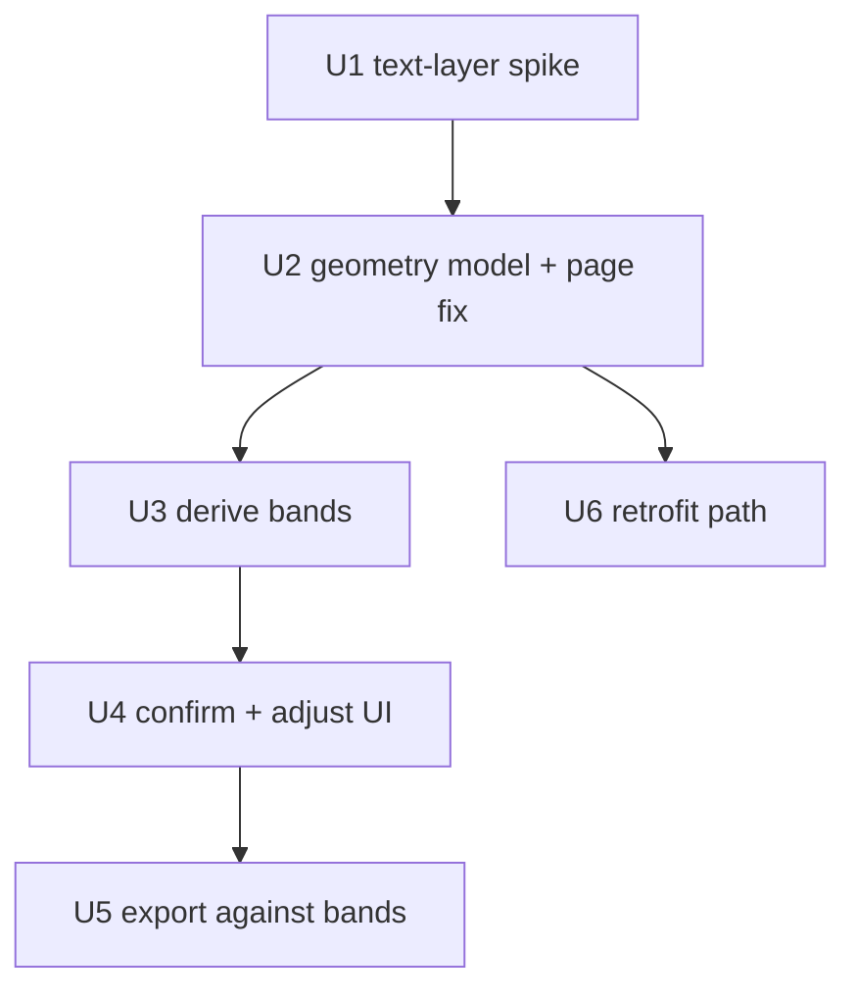

# Faithful PDF Round-Trip - Plan

## Goal Capsule

- **Objective:** A submission filled through the webform exports as the *original* PDF with the answers drawn in their real places — the fidelity claim `LoginScreen.tsx:443` already makes to every visitor, and the one the product cannot currently honour for any AI-imported form.
- **Scope decisions taken:** geometry is auto-derived from the PDF's text layer and confirmed by a human in review; *every* field on the AI path carries geometry, not only repeating tables; already-published forms are retrofitted by re-import into a new version, never by mutating a pinned one.
- **What this is not:** a scoring engine, a logbook, or a signature flow. Those are Roadmap items 1–5 of the previous plan and remain there. See Scope Boundaries — it matters more than usual here, because the fixture document contains all three.
- **Delivery shape:** U1 is a de-risking spike whose result can still change U3. U2 (the geometry model) is a hard barrier. U3–U5 then run in order; U6 is independent and can land any time after U2.

---

## Product Contract

### Problem Frame

`roundTripExport` (`apps/api/src/pdf/round-trip.ts`) already loads the original bytes and draws on top of them — the letterhead, fonts and layout are never regenerated. It works. It is simply never reached, because it skips any field without a `sourcePosition` and **only the AcroForm path ever sets one**. Every real compliance form in the library is flat, so every one of them takes the AI path and arrives with no coordinates at all.

The product knows this and says so: `ImportPublishScreen.tsx:113` tells the user an AI-extracted PDF "won't round-trip to a filled PDF", and `:174` badges it. That honest disclosure is the gap this plan closes.

Two further defects sit behind it, both currently unreachable and both fatal the moment geometry exists:

- **`page: 0` is hardcoded.** `widgetPosition` (`apps/api/src/pdf/extract.ts:76`) stamps page zero onto every position it records. The fixture assessment is 18 pages.
- **Cells are divided arithmetically.** `drawRepeatingGroup` (`round-trip.ts:105-107`) splits a field's box into equal rows and equal columns. The assessment tables have a wide label column and narrow option columns, so marks would land in visibly wrong cells while the export reported success.

### What the fixture document actually is

The previous plan described `Authorised to Operate Track Dozer` as "`✓`/`×`/`N-A` across dozens of rows and eighteen pages". Direct inspection of the PDF shows that is true of **nine** pages, not eighteen, and that the document is a six-part assessment:

| Pages | Part | Shape |
|---|---|---|
| 1–2 | Cover, candidate details, training notes | Scalar fields, Yes/No, dates |
| 3–6 | **Part 1 — Theory** | ~30 numbered multiple-choice questions (`a)`–`f)`, True/False) |
| 7–9 | **Part 2 — Practical demonstration** | `√` / `×` / `N/A` observation tables, incl. the Raw Materials / BBM location split |
| 10 | **Part 3 — Direct observation log** | Date/Task log, essentially empty on the blank form |
| 11–13 | **Part 4 — Minimal supervision practical** | Same shape as Part 2 |
| 14 | **Part 5 — Minimal supervision log** | Log again |
| 15–17 | **Part 6 — Minimal supervision practical** | Same shape as Part 2 |
| 18 | Definitions and abbreviations | Reference text, no fields |

The document is born-digital (A4, 595×842pt, 18 embedded fonts, one image, 47–75 positioned text items per page). Every label and column header is real extractable text with exact coordinates. **This is the fact the whole plan rests on**, and it is why geometry can be derived rather than inferred.

Two consequences to state plainly rather than discover later:

- **A round-tripped dozer PDF will have Parts 3 and 5 blank and Part 1 unscored.** The fields will be present and fillable; what is missing is logbook accumulation and answer marking, which are Roadmap items 2 and 3. Fidelity does not make the assessment complete.
- **The tick glyph is inconsistently encoded.** Pages 15–17 expose it as `√` (U+221A); pages 7–9 do not surface a tick token at all, though `×` and `N/A` are present on both. Column detection must not depend on finding the tick.

### Requirements

**Geometry model**

- R1. A field's position is a list of page-scoped boxes, not a single box, so a construct that continues across a page break is describable.
- R2. A repeating table records explicit column bands and row bands per page segment, rather than implying them by equal division.
- R3. A recorded position always names its real page index. No default, no zero.
- R4. Existing single-box positions on AcroForm-imported fields remain valid and keep exporting exactly as they do today.

**Capture**

- R5. Geometry is derived from the source PDF's text layer: column bands from the horizontal extents of the column-header glyphs, row bands from the vertical positions of the pre-printed row labels.
- R6. Derivation never depends on locating the tick glyph. `×` and `N/A` are sufficient to establish a set's bands.
- R7. A derived grid is shown overlaid on the PDF in review, marked as derived rather than settled, and the reviewer can adjust any band or reject the grid entirely.
- R8. A field whose geometry the reviewer has not confirmed is exported as data, never with a guessed mark.
- R9. Scalar fields carry geometry too, so a round-tripped form shows names, dates and free text in place — not only table marks.

**Export**

- R10. An answered cell is marked inside its own recorded band, on its own recorded page.
- R11. A field whose geometry is absent or unconfirmed is skipped silently, as today. Export succeeds for the remaining fields.
- R12. A submission exports identically no matter which surface filled it.

**Retrofit**

- R13. An already-published form gains geometry only by re-import into a new version. A pinned version is never mutated.
- R14. Submissions against an old version keep exporting against that version's geometry, or as data if it had none.

### Acceptance Examples

- AE1. **Covers R1, R3.** Given a table whose rows continue from page 8 onto page 9, when the submission is exported, then rows land on both pages in their real positions.
- AE2. **Covers R2, R10.** Given a row answered `×` in a table with a 260pt label column and three 34pt option columns, when exported, then the mark falls inside the `×` column's printed cell and the `√` and `N/A` cells are blank.
- AE3. **Covers R6.** Given a table whose tick header does not surface in the text layer, when geometry is derived, then the bands are still established from `×` and `N/A` and the tick column is inferred from the remaining span.
- AE4. **Covers R8.** Given a reviewer who skipped grid confirmation, when a submission is exported, then that table contributes no marks and the export still succeeds.
- AE5. **Covers R9.** Given a candidate name and assessment date on page 1, when exported, then both appear in their printed boxes.
- AE6. **Covers R13, R14.** Given a form published before this ships and a submission against it, when the form is re-imported with geometry, then the old submission still exports against the old version, unchanged.

### Scope Boundaries

Not in this plan, and each already sequenced on the previous plan's Roadmap: assessment pathways (item 1), scored question banks (item 2), logbooks with thresholds (item 3), multi-session assignment (item 4), two-party sign-off with a verdict (item 5).

This matters more than a usual deferral list, because the fixture document contains all five. A perfectly round-tripped dozer PDF is still not a substitute for the paper assessment. It is the last piece of *fidelity*; it is not the last piece of *the assessment*.

---

## Planning Contract

### Key Technical Decisions

- KTD1. **`SourcePosition` gains a successor rather than being widened in place.** A new `FieldGeometry` carries `segments: PageBox[]`, and for tables `columnBands` and `rowBands` per segment. `sourcePosition` stays exactly as it is and keeps working (R4) — the AcroForm path, the review overlay in `PdfViewer.tsx`, and the scalar draw path all read it today, and breaking them to serve a feature they do not use would be a needless migration. Export prefers `geometry` when present and falls back to `sourcePosition`.

- KTD2. **Geometry is derived in the browser, not on the API.** `PdfViewer.tsx` already runs pdfjs (`RENDER_SCALE = 2`), already tracks each page's natural size in PDF units — the same space geometry is stored in — and already maps point space onto rendered pixels to draw field highlights. `page.getTextContent()` gives positioned glyphs from the document it has already loaded. Deriving server-side would mean adding pdfjs plus its worker to `apps/api` to re-parse a file the browser is holding open, and would still need a round trip to show the reviewer the result. Derivation belongs where the human confirms it.

- KTD3. **Geometry is review output, not extraction output.** It is written when a reviewer confirms a grid and travels to the published field through `reviewedToFields`, alongside `answerSets`. Extraction stays a pure AI-and-text-parsing step with no notion of confirmation. This is also what makes R8 enforceable — unconfirmed simply means absent.

- KTD4. **Detection keys on the negative options, never on the tick.** Direct inspection shows `×` and `N/A` present on every observation page while the tick surfaces as `√` on some pages and not at all on others. Two anchors are enough to establish band pitch and edges; the third column is the remaining span. Keying on the tick would fail on a third of the fixture's own tables.

- KTD5. **A mark that cannot be placed is never drawn.** Where the current code would divide arithmetically and produce a confident wrong answer, the new path skips. On a competency record a mark in the wrong column is worse than no mark — it is a false statement about whether an operator was assessed as competent.

### Assumptions

- The text layer is reliable for the forms in the library. Verified on the fixture: 47–75 positioned items per page, real fonts, no OCR. **Not verified for `ADMN-FRM-111`** — U1 checks it, and a scanned form falls back to manual band drawing on the same UI.
- Column headers are printed once per table, not once per page. If a table repeats its header on continuation pages, per-segment derivation handles it; if it does not, the continuation inherits the first segment's bands. U1 records which pattern the fixture uses.
- `pnpm -r test` at 880 across 60 files is the baseline. Any failure after a unit lands is caused by that unit.

### Sequencing

U1 is a spike and can change U3's approach, so it runs first and its findings are written back here. U2 is a hard barrier — every later unit reads the model.

---

## Implementation Units

### U1. Text-layer spike

- **Goal:** Establish that band derivation is viable on the real library, not just the one fixture.
- **Requirements:** de-risks R5, R6
- **Dependencies:** none
- **Approach:** A throwaway script over `Authorised to Operate Track Dozer` and `ADMN-FRM-111`: dump positioned text per page, cluster x-positions on the observation pages, and report whether column bands fall out cleanly from the `×` / `N/A` anchors. Record whether table headers repeat on continuation pages, and whether `ADMN-FRM-111` has a text layer at all.
- **Output:** findings written into Assumptions above. If either form is OCR-only or the anchors do not cluster, U3 becomes manual-first and U4 becomes the primary surface rather than the confirmation surface — decide that here, not mid-U3.
- **Verification:** findings recorded; no production code changes.

### U2. Geometry model and the page-index fix

- **Goal:** A shape that can describe a multi-page table, and an end to positions that claim page zero.
- **Requirements:** R1, R2, R3, R4
- **Dependencies:** U1
- **Files:** `packages/shared/src/form-field.ts`, `packages/shared/src/geometry.ts` (new), `packages/shared/src/index.ts`, `apps/api/src/pdf/extract.ts`, `apps/api/src/routes/geometry.test.ts` (new)
- **Approach:** Add `FieldGeometry` with `segments: PageBox[]`, each segment carrying `page`, the box, and optionally `columnBands` and `rowBands` as arrays of `{ key, start, end }` in point space. Add total resolver helpers alongside the `answer-set.ts` precedent — every one degrades to "no geometry" rather than throwing. Fix `widgetPosition` to take the real page index from the field's widget rather than stamping `0`.
- **Where the tests live:** `packages/shared` has no test runner; shared logic is tested from `apps/api`, as `answer-set.ts` and `visibility.ts` already are. Follow it.
- **Test scenarios:** a band list not covering the full box width resolves without error; overlapping bands are rejected as malformed; a segment naming a page beyond the document resolves to skipped; a field with only legacy `sourcePosition` resolves to a single segment on its real page; an AcroForm field on page 3 records page 3.
- **Verification:** `pnpm typecheck` and `pnpm --filter @formai/api test` pass; existing round-trip tests unchanged.

### U3. Derive bands from the text layer

- **Goal:** Given a rendered page and an extracted table, propose column and row bands.
- **Requirements:** R5, R6
- **Dependencies:** U2
- **Files:** `apps/web/src/lib/pdf-geometry.ts` (new), `apps/web/src/lib/pdf-geometry.test.ts` (new)
- **Approach:** A pure module taking positioned text items plus the field's columns, returning candidate bands with a confidence. Column bands come from clustering the header glyphs' x-extents, anchored on `×` and `N/A` per KTD4 and never on the tick. Row bands come from the y-positions of the label-column text. Pure functions over an item list — pdfjs stays in the viewer, so this is unit-testable from fixtures with no PDF in the loop.
- **Test scenarios:** two anchors yield three evenly-pitched bands with the tick inferred; a missing tick glyph does not reduce the band count; a wide label column is not mistaken for an option column; rows whose labels wrap to two lines produce one band, not two; a table with no locatable anchors returns no proposal rather than a guess.
- **Verification:** `pnpm --filter @formai/web test` passes.

### U4. Confirm and adjust the grid in review

- **Goal:** The reviewer sees the proposed grid on the page and can correct it before it is trusted.
- **Requirements:** R7, R8, R9
- **Dependencies:** U3
- **Files:** `apps/web/src/screens/import/PdfViewer.tsx`, `apps/web/src/screens/import/inspector/GeometryPanel.tsx` (new) and its test, `apps/web/src/lib/data/import-session.ts`
- **Approach:** Extend the viewer's existing highlight overlay to draw band lines for the selected field, reusing the point→pixel mapping and zoom already there. The inspector gains a panel to accept, nudge an edge, or reject. Confirmation is explicit and per field; nothing is trusted by default (R8). Scalar fields get the same treatment with a single box (R9). Confirmed geometry is carried to the published field through `reviewedToFields` — the whitelist there drops unknown properties, so it must be extended or geometry dies silently at publish, exactly as `answerSets` would have.
- **Test scenarios:** an unconfirmed field publishes with no geometry; confirming writes bands onto the field; adjusting an edge moves only that band; rejecting returns the field to no geometry; geometry survives publish; a form where nothing was confirmed publishes exactly as it does today.
- **Verification:** `pnpm --filter @formai/web test` passes.

### U5. Export against real bands

- **Goal:** Marks land in printed cells, on the right pages.
- **Requirements:** R10, R11, R12
- **Dependencies:** U4
- **Files:** `apps/api/src/pdf/round-trip.ts`, `apps/api/src/pdf/round-trip.test.ts`
- **Approach:** `drawRepeatingGroup` takes bands instead of computing `colWidth`/`rowHeight`. Rows iterate their segments, so a table crossing a page boundary draws on both. The equal-division arithmetic is deleted, not left as a fallback — per KTD5, absent geometry means skip, not guess. The answered-column resolution through `selectedOption` is unchanged; only the coordinates differ.
- **Test scenarios:** covers AE2, a mark lands inside its band and siblings stay blank; covers AE1, a two-segment table draws on both pages; covers AE4, an unconfirmed table contributes nothing and export succeeds; a legacy `sourcePosition`-only field exports exactly as today; a band list shorter than the column list skips the unbanded columns.
- **Verification:** `pnpm --filter @formai/api test` passes. Export a filled dozer submission and compare against the paper form.

### U6. Retrofit already-published forms

- **Goal:** Existing forms gain geometry without disturbing existing records.
- **Requirements:** R13, R14
- **Dependencies:** U2
- **Files:** `apps/web/src/screens/import/ImportPublishScreen.tsx`, plus the copy at `:113` and `:174`
- **Approach:** Re-import produces a new version carrying geometry; the old version is untouched and its submissions keep exporting against it (R14). Update the "won't round-trip" messaging so it reflects confirmed geometry rather than extraction path — that copy is currently the product's honest admission of this gap and becomes wrong the moment U5 lands.
- **Test scenarios:** an old submission exports unchanged after its template is re-imported; a new submission against the new version exports with marks; the publish-screen copy reflects geometry state, not path.
- **Verification:** `pnpm --filter @formai/web test` passes.

---

## Verification Contract

| Gate | Command | Applies to |
|---|---|---|
| Types | `pnpm typecheck` | every unit |
| Web tests | `pnpm --filter @formai/web test` | U3, U4, U6 |
| API tests | `pnpm --filter @formai/api test` | U2, U5 |
| Full suite | `pnpm -r test` | before merge |

Manual smoke against the local stack (web 5000, API 8000):

- `ADMN-FRM-111` — confirm the `OK`/`NA` grid, fill, export, and hold the export against the paper original.
- `Authorised to Operate Track Dozer` — confirm grids on pages 7–9, fill Part 2, export, and check the marks land in the printed cells on the right pages.

## Definition of Done

- R1–R14 each satisfied by a merged unit or deferred in writing.
- `pnpm typecheck` and `pnpm -r test` pass with no pre-existing test rewritten.
- A filled `ADMN-FRM-111` exports as the original document with its marks in the printed cells.
- A filled dozer Part 2 exports with marks in the right cells on pages 7–9, and Parts 3 and 5 blank — the known, documented limit.
- No export ever draws a mark it could not place from confirmed geometry.
- No pinned version is mutated by the retrofit.
- `page: 0` appears nowhere as a default.

## Open Questions

**Resolve in U1**

- Whether `ADMN-FRM-111` has a usable text layer. If not, manual band drawing becomes the primary path and U3 shrinks to a fallback.
- Whether the fixture's tables repeat their column headers on continuation pages.

**Deferred to implementation**

- Whether band adjustment is drag-on-canvas or numeric entry. Drag reads better; numeric is far cheaper to test. Decide in U4 and keep it consistent.
