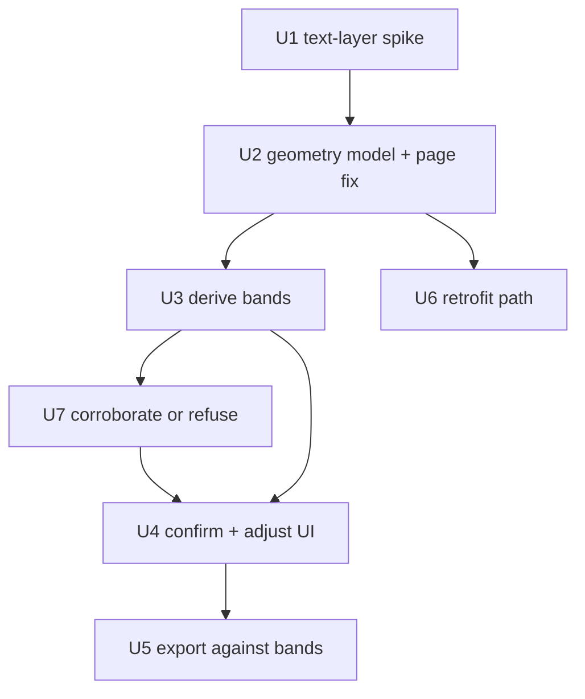

# Faithful PDF Round-Trip - Plan

## Goal Capsule

- **Objective:** A submission filled through the webform exports as the *original* PDF with the answers drawn in their real places — the fidelity claim `LoginScreen.tsx:443` already makes to every visitor, and the one the product cannot currently honour for any AI-imported form.
- **Scope decisions taken:** geometry is auto-derived from the PDF's text layer and confirmed by a human in review; *every* field on the AI path carries geometry, not only repeating tables; already-published forms are retrofitted by re-import into a new version, never by mutating a pinned one.
- **What this is not:** a scoring engine, a logbook, or a signature flow. Those are Roadmap items 1–5 of the previous plan and remain there. See Scope Boundaries — it matters more than usual here, because the fixture document contains all three.
- **Delivery shape:** U1 is a de-risking spike whose result can still change U3. U2 (the geometry model) is a hard barrier. U3–U5 then run in order; U6 is independent and can land any time after U2.

---

## Product Contract

### Problem Frame

`roundTripExport` (`apps/api/src/pdf/round-trip.ts`) already loads the original bytes and draws on top of them — the letterhead, fonts and layout are never regenerated. It works. It is simply never reached, because it skips any field without a `sourcePosition` and **only the AcroForm path ever sets one**. Every real compliance form in the library is flat, so every one of them takes the AI path and arrives with no coordinates at all.

The product knows this and says so: `ImportPublishScreen.tsx:113` tells the user an AI-extracted PDF "won't round-trip to a filled PDF", and `:174` badges it. That honest disclosure is the gap this plan closes.

Two further defects sit behind it, both currently unreachable and both fatal the moment geometry exists:

- **`page: 0` is hardcoded.** `widgetPosition` (`apps/api/src/pdf/extract.ts:76`) stamps page zero onto every position it records. The fixture assessment is 18 pages.
- **Cells are divided arithmetically.** `drawRepeatingGroup` (`round-trip.ts:105-107`) splits a field's box into equal rows and equal columns. The assessment tables have a wide label column and narrow option columns, so marks would land in visibly wrong cells while the export reported success.

### What the fixture document actually is

The previous plan described `Authorised to Operate Track Dozer` as "`✓`/`×`/`N-A` across dozens of rows and eighteen pages". Direct inspection of the PDF shows that is true of **nine** pages, not eighteen, and that the document is a six-part assessment:

| Pages | Part | Shape |
|---|---|---|
| 1–2 | Cover, candidate details, training notes | Scalar fields, Yes/No, dates |
| 3–6 | **Part 1 — Theory** | ~30 numbered multiple-choice questions (`a)`–`f)`, True/False) |
| 7–9 | **Part 2 — Practical demonstration** | `√` / `×` / `N/A` observation tables, incl. the Raw Materials / BBM location split |
| 10 | **Part 3 — Direct observation log** | Date/Task log, essentially empty on the blank form |
| 11–13 | **Part 4 — Minimal supervision practical** | Same shape as Part 2 |
| 14 | **Part 5 — Minimal supervision log** | Log again |
| 15–17 | **Part 6 — Minimal supervision practical** | Same shape as Part 2 |
| 18 | Definitions and abbreviations | Reference text, no fields |

The document is born-digital (A4, 595×842pt, 18 embedded fonts, one image, 47–75 positioned text items per page). Every label and column header is real extractable text with exact coordinates. **This is the fact the whole plan rests on**, and it is why geometry can be derived rather than inferred.

Two consequences to state plainly rather than discover later:

- **A round-tripped dozer PDF will have Parts 3 and 5 blank and Part 1 unscored.** The fields will be present and fillable; what is missing is logbook accumulation and answer marking, which are Roadmap items 2 and 3. Fidelity does not make the assessment complete.
- **The tick glyph is inconsistently encoded.** Pages 15–17 expose it as `√` (U+221A); pages 7–9 do not surface a tick token at all, though `×` and `N/A` are present on both. Column detection must not depend on finding the tick.

### Requirements

**Geometry model**

- R1. A field's position is a list of page-scoped boxes, not a single box, so a construct that continues across a page break is describable.
- R2. A repeating table records explicit column bands and row bands per page segment, rather than implying them by equal division.
- R3. A recorded position always names its real page index. No default, no zero.
- R4. Existing single-box positions on AcroForm-imported fields remain valid and keep exporting exactly as they do today.

**Capture**

- R5. Geometry is derived from the source PDF's text layer: column bands from the horizontal extents of the column-header glyphs, row bands from the vertical positions of the pre-printed row labels.
- R6. Derivation treats the header as a *cluster of positioned items*, never assuming any particular character is independently addressable, and tolerates locating fewer anchors than the table has columns. Verified across the library: the tick is an unmappable Private-Use glyph on some documents and absent from the text layer entirely on others, and `/ ×` arrives as a single combined item where it appears at all.
- R16. A proposal is emitted only when corroborated by evidence the derivation did not itself consume. Uncorroborated means no proposal, with the reason recorded — the module's doctrine is that refusing is safe and a confident wrong grid is not, and review proved that doctrine was not being honoured.
- R15. A proposal that the shipped geometry validator would reject is never emitted. Duplicate band keys, non-finite bounds, bands outside the segment box and overlapping bands are all dropped silently downstream, leaving the reviewer an empty grid with no stated reason — so the proposer must satisfy the validator rather than rely on it.
- R7. A derived grid is shown overlaid on the PDF in review, marked as derived rather than settled, and the reviewer can adjust any band or reject the grid entirely.
- R8. A field whose geometry the reviewer has not confirmed is exported as data, never with a guessed mark.
- R9. Scalar fields carry geometry too, so a round-tripped form shows names, dates and free text in place — not only table marks.

**Export**

- R10. An answered cell is marked inside its own recorded band, on its own recorded page.
- R11. A field whose geometry is absent or unconfirmed is skipped silently, as today. Export succeeds for the remaining fields.
- R12. A submission exports identically no matter which surface filled it.

**Retrofit**

- R13. An already-published form gains geometry only by re-import into a new version. A pinned version is never mutated.
- R14. Submissions against an old version keep exporting against that version's geometry, or as data if it had none.

### Acceptance Examples

- AE1. **Covers R1, R3.** Given a table whose rows continue from page 8 onto page 9, when the submission is exported, then rows land on both pages in their real positions.
- AE2. **Covers R2, R10.** Given a row answered `×` in a table with a 260pt label column and three 34pt option columns, when exported, then the mark falls inside the `×` column's printed cell and the `√` and `N/A` cells are blank.
- AE3. **Covers R6.** Given the fixture's page-7 header — a Private-Use tick at x=502.6, a combined `"/ ×"` item at x=512.1, and `N/A` at x=539.9 — when geometry is derived, then three option bands are produced with the `×` band resolved from the combined item's extent rather than from a standalone `×`.
- AE4. **Covers R8.** Given a reviewer who skipped grid confirmation, when a submission is exported, then that table contributes no marks and the export still succeeds.
- AE5. **Covers R9.** Given a candidate name and assessment date on page 1, when exported, then both appear in their printed boxes.
- AE6. **Covers R13, R14.** Given a form published before this ships and a submission against it, when the form is re-imported with geometry, then the old submission still exports against the old version, unchanged.

### Scope Boundaries

Not in this plan, and each already sequenced on the previous plan's Roadmap: assessment pathways (item 1), scored question banks (item 2), logbooks with thresholds (item 3), multi-session assignment (item 4), two-party sign-off with a verdict (item 5).

### Deferred to Follow-Up Work

**AcroForm cell reconstruction.** Synthesise a grouped checklist — `columns`, `fixedRows` and `answerSets` — from an AcroForm document's per-cell field naming (`OKEngine oil level` / `NAEngine oil level`), taking each widget's rectangle as exact geometry instead of deriving bands from text. Its own unit, sequenced after U5. Rationale for deferring is in Open Questions; the short version is that it is an extraction-output change rather than a geometry change, and the naming convention has exactly one confirmed specimen in the library. Two prerequisites already recorded as U2 review residuals belong to this work: emit one segment per widget rather than positioning only the first, and decide the page-rotation handling that per-widget geometry will inherit.

This matters more than a usual deferral list, because the fixture document contains all five. A perfectly round-tripped dozer PDF is still not a substitute for the paper assessment. It is the last piece of *fidelity*; it is not the last piece of *the assessment*.

---

## Planning Contract

### Key Technical Decisions

- KTD1. **`SourcePosition` gains a successor rather than being widened in place.** A new `FieldGeometry` carries `segments: PageBox[]`, and for tables `columnBands` and `rowBands` per segment. `sourcePosition` stays exactly as it is and keeps working (R4) — the AcroForm path, the review overlay in `PdfViewer.tsx`, and the scalar draw path all read it today, and breaking them to serve a feature they do not use would be a needless migration. Export prefers `geometry` when present and falls back to `sourcePosition`.

- KTD2. **Geometry is derived in the browser, not on the API.** `PdfViewer.tsx` already runs pdfjs (`RENDER_SCALE = 2`), already tracks each page's natural size in PDF units — the same space geometry is stored in — and already maps point space onto rendered pixels to draw field highlights. `page.getTextContent()` gives positioned glyphs from the document it has already loaded. Deriving server-side would mean adding pdfjs plus its worker to `apps/api` to re-parse a file the browser is holding open, and would still need a round trip to show the reviewer the result. Derivation belongs where the human confirms it.

- KTD3. **Geometry is review output, not extraction output.** It is written when a reviewer confirms a grid and travels to the published field through `reviewedToFields`, alongside `answerSets`. Extraction stays a pure AI-and-text-parsing step with no notion of confirmation. This is also what makes R8 enforceable — unconfirmed simply means absent.

- KTD4. **Detection keys on the header cluster's geometry, not on any character.** Direct inspection of the fixture's page-7 header row (y=649) shows why no character-matching rule survives contact:

  | x | item | codepoints | font |
  |---|---|---|---|
  | 37.5 | `During the demonstration, did the candidate:` | ASCII | `g_d0_f2` |
  | 502.6 | *(tick)* | `U+F0FC` — Private Use Area, unmappable | `g_d0_f3` |
  | 512.1 | `/ ×` | `U+2F, U+20, U+D7` — **one combined item**, width 10.3 | `g_d0_f1` |
  | 539.9 | `N/A` | ASCII | `g_d0_f1` |

  So the tick is not missing — it is a Wingdings-style glyph pdfjs cannot map to Unicode, which is why a `√`/`✓` search finds nothing. And `×` can never be located on its own, because the slash and the cross are a single text run. An earlier draft of this plan keyed on "`×` and `N/A`, never the tick" and was wrong on both counts.

  The rule that does hold: **the option columns are the cluster of short, narrow text items lying to the right of the label-column header, on the header row's baseline.** Bands come from those items' x-extents in order. Characters are used only to *label* a band after the fact, never to find one. A band whose item spans two printed columns — like `/ ×` — is split on its own advance width.

- KTD4a. **Headers repeat per table, which is what makes per-segment derivation work.** The anchor row occurs twice on page 7 and three times on pages 8 and 9 — once per table, not once per page. Each segment therefore carries its own header to derive from, and a continuation table is not left inheriting bands from a different page.

- KTD5. **A mark that cannot be placed is never drawn.** Where the current code would divide arithmetically and produce a confident wrong answer, the new path skips. On a competency record a mark in the wrong column is worse than no mark — it is a false statement about whether an operator was assessed as competent.

### Assumptions

- **Every form in the library has a usable text layer — verified by U1, none are scanned.** Survey of eight documents:

  | Document | Pages | Text items | Header signature |
  |---|---|---|---|
  | Track Dozer | 18 | 1210 | matches (19 PUA ticks, 23 `/ ×`, 23 `N/A`) |
  | Scraper | 15 | 949 | matches |
  | Small Excavator | 13 | 916 | matches |
  | Small Loader | 13 | 816 | **partial — 0 PUA ticks**, 18 `/ ×`, 18 `N/A` |
  | Grader | 10 | 585 | **partial — 0 `/ ×`**, 6 `N/A` |
  | Tip Head Controller | 3 | 194 | partial |
  | Escort Vehicle Permit | 3 | 185 | partial |
  | Mine Site SME Theory | 7 | 439 | partial |

- **Header encoding varies per document, which is why KTD4 keys on geometry rather than characters.** Small Loader carries 18 `/ ×` and 18 `N/A` runs but *no* Private-Use tick at all; Grader carries `N/A` with no combined run. Band derivation must therefore tolerate locating fewer anchors than there are columns, and infer the remainder from pitch — it cannot require a full set.
- `ADMN-FRM-111` is A5 landscape (595×420), single page, 67 text items, and uses ASCII `OK`/`NA` headers plus `☐` (U+2610) ballot boxes — a third encoding again.
- Column headers repeat per table occurrence — **verified**: twice on page 7, three times on pages 8 and 9. Every segment has its own anchor row, so no continuation inherits another page's bands. See KTD4a.
- `pnpm -r test` at 880 across 60 files is the baseline. Any failure after a unit lands is caused by that unit.

### Sequencing

U1 is a spike and can change U3's approach, so it runs first and its findings are written back here. U2 is a hard barrier — every later unit reads the model.

---

## Implementation Units

### U1. Text-layer spike

- **Goal:** Establish that band derivation is viable on the real library, not just the one fixture.
- **Requirements:** de-risks R5, R6
- **Dependencies:** none
- **Approach:** A throwaway script over `Authorised to Operate Track Dozer` and `ADMN-FRM-111`: dump positioned text per page, cluster x-positions on the observation pages, and report whether column bands fall out cleanly from the `×` / `N/A` anchors. Record whether table headers repeat on continuation pages, and whether `ADMN-FRM-111` has a text layer at all.
- **Output:** findings written into Assumptions above. If either form is OCR-only or the anchors do not cluster, U3 becomes manual-first and U4 becomes the primary surface rather than the confirmation surface — decide that here, not mid-U3.
- **Verification:** findings recorded; no production code changes.

### U2. Geometry model and the page-index fix

- **Goal:** A shape that can describe a multi-page table, and an end to positions that claim page zero.
- **Requirements:** R1, R2, R3, R4
- **Dependencies:** U1
- **Files:** `packages/shared/src/form-field.ts`, `packages/shared/src/geometry.ts` (new), `packages/shared/src/index.ts`, `apps/api/src/pdf/extract.ts`, `apps/api/src/routes/geometry.test.ts` (new)
- **Approach:** Add `FieldGeometry` with `segments: PageBox[]`, each segment carrying `page`, the box, and optionally `columnBands` and `rowBands` as arrays of `{ key, start, end }` in point space. Add total resolver helpers alongside the `answer-set.ts` precedent — every one degrades to "no geometry" rather than throwing. Fix `widgetPosition` to take the real page index from the field's widget rather than stamping `0`.
- **Where the tests live:** `packages/shared` has no test runner; shared logic is tested from `apps/api`, as `answer-set.ts` and `visibility.ts` already are. Follow it.
- **Test scenarios:** a band list not covering the full box width resolves without error; overlapping bands are rejected as malformed; a segment naming a page beyond the document resolves to skipped; a field with only legacy `sourcePosition` resolves to a single segment on its real page; an AcroForm field on page 3 records page 3.
- **Verification:** `pnpm typecheck` and `pnpm --filter @formai/api test` pass; existing round-trip tests unchanged.

### U3. Derive bands from the text layer

- **Goal:** Given a rendered page and an extracted table, propose column and row bands.
- **Requirements:** R5, R6, R15
- **Dependencies:** U2
- **Files:** `apps/web/src/lib/pdf-geometry.ts` (new), `apps/web/src/lib/pdf-geometry.test.ts` (new)
- **Input shape — the module defines its own, and pdfjs never crosses the boundary.** It takes a `PositionedText[]` (`{ text, x, y, width, height }`, PDF point space, origin bottom-left), the field's `columns`, and the page size. U4 adapts pdfjs `getTextContent()` items into that shape in the viewer. Defining our own input is what keeps this unit testable from measured fixtures with no PDF, no worker, and no DOM.

- **Approach — reconcile located anchors against the column count.** Four stages:

  1. **Find the header row.** Group items by baseline (y within ~2pt). A header-row candidate is a row containing one wide item — the label-column header — plus two or more short, narrow items entirely to its right. Score candidates and take the best; a table repeats its header per occurrence (KTD4a), so each segment finds its own.
  2. **Take each short item as one anchor.** No character matching, no splitting.
  3. **Reconcile anchor count against `columns.length - 1`** (the option columns; `columns[0]` is always the label column and is never an option). This reconciliation is the heart of the unit, because U1 proved the anchor count varies per document:

     | Case | Library example | Behaviour |
     |---|---|---|
     | anchors == expected | Dozer (3 for 3), `ADMN-FRM-111` (2 for 2) | Map 1:1 in x order. High confidence. |
     | anchors < expected | Small Loader (tick absent from the text layer) | Infer the missing anchors from the median pitch of those found, extending in the direction with room. Reduced confidence. |
     | anchors > expected | — | Merge the closest pair, or return no proposal when the excess cannot be resolved. Low confidence. |
     | anchors < 2 | Grader (only `N/A`) | No pitch is derivable from one point. Return a low-confidence proposal or none — never a confident guess. |

  4. **Convert anchors to bands by midpoint.** A boundary sits midway between adjacent anchors' facing edges; the outermost edges extend to the table box. Bands are therefore contiguous and gapless by construction, which is also what makes them survive the shipped validator.

- **Row bands** come from the y-positions of items in the label column's x-range, within the table's vertical extent, with boundaries at the midpoints between adjacent baselines. A label wrapping to two lines is one row, not two: merge baselines closer together than the median row pitch.

- **A `/`-style separator is a character inside an anchor, not a column.** An earlier draft of this plan said the combined `/ ×` item "splits into two bands on its advance width". That is wrong and would produce a band for the separator glyph. On the measured page-7 header the printed row reads `✓ / × N/A` — three option columns, and the `/` is punctuation that happens to share a text run with `×`. So the run is **one** anchor. Never split a run; reconciliation against the column count is what handles a run that genuinely spans two columns, and it does so without needing per-glyph advances, which `getTextContent` does not provide.

- **Emit only what the shipped validator accepts (R15).** `resolveGeometry` rejects duplicate band keys, non-finite bounds, bands outside the segment box, and overlapping bands. A proposal that trips any of those is silently dropped downstream and the reviewer sees an empty grid with no reason. Assign band keys from `columns[n].key` (unique by construction), clamp the outer edges to the box, and self-check the proposal through `resolveGeometry` before returning it — a proposal that does not survive its own validator is a bug in this unit, not a bad document.

- **Confidence is a number the reviewer will act on**, so it must be derived, not vibed. Start at 1 and reduce for: anchors inferred rather than located (the dominant term), irregular pitch between located anchors, a label-column header narrower than expected, and fewer than two anchors. U4 surfaces it; low confidence is a normal outcome for Grader-shaped documents and must not be dressed up as high.

- **Fixture data:** the primary fixture is the real page-7 header row — label header `During the demonstration, did the candidate:` at x=37.5 (w=192), `U+F0FC` at 502.6 (w=7.1), `/ ×` at 512.1 (w=10.3), `N/A` at 539.9 (w=13.3), page 595×842. Synthetic evenly-spaced fixtures hide exactly the irregularity this unit exists to handle: the option columns are ~10–13pt wide against a 192pt label header, and the gaps between them are uneven (2.4pt tick→cross, 17.5pt cross→N/A).

- **Test scenarios:**
  - The measured page-7 header yields exactly three option bands, keyed to `columns[1..3]`, in x order.
  - The `/ ×` run produces **one** band, not two — the separator does not become a column.
  - An unmappable `U+F0FC` glyph is an anchor like any other, not discarded for being unprintable.
  - A Small-Loader-shaped header (tick absent from the text layer, two anchors, three columns) yields three bands with the missing one inferred from pitch, at reduced confidence.
  - A Grader-shaped header (one anchor, three columns) returns no proposal or a low-confidence one — never three confident bands.
  - `ADMN-FRM-111`'s ASCII `OK`/`NA` header yields two bands at high confidence.
  - The 192pt label header is never taken for an option column.
  - Bands are contiguous: each band's `end` equals the next band's `start`, and the outer edges reach the table box.
  - Every emitted proposal survives `resolveGeometry` unchanged — asserted directly, not assumed.
  - Row labels wrapping to two lines produce one row band, not two.
  - A header row with no short items to the right of the label returns no proposal rather than a guess.
  - Two header rows on one page (page 7 has two tables) each produce their own proposal.
  - Confidence is strictly lower for an inferred anchor than for the same table with all anchors located.
- **Verification:** `pnpm --filter @formai/web test` passes. Then run the module over the real dozer text layer for pages 7, 8 and 9 and confirm the proposed bands land on the printed column rules.

### U4. Confirm and adjust the grid in review

- **Goal:** The reviewer sees the proposed grid on the page and can correct it before it is trusted.
- **Requirements:** R7, R8, R9
- **Dependencies:** U3, **U7** — U4 is the human-confirmation step, and its entire value rests on the reviewer checking a proposal that is *plausible*. A proposal that is confidently wrong in the ways U7 fixes trains the reviewer to rubber-stamp, which converts the safety step into a liability.
- **Files:** `apps/web/src/screens/import/PdfViewer.tsx`, `apps/web/src/screens/import/inspector/GeometryPanel.tsx` (new) and its test, `apps/web/src/lib/data/import-session.ts`
- **Approach:** Extend the viewer's existing highlight overlay to draw band lines for the selected field, reusing the point→pixel mapping and zoom already there. The inspector gains a panel to accept, nudge an edge, or reject. Confirmation is explicit and per field; nothing is trusted by default (R8). Scalar fields get the same treatment with a single box (R9). Confirmed geometry is carried to the published field through `reviewedToFields` — the whitelist there drops unknown properties, so it must be extended or geometry dies silently at publish, exactly as `answerSets` would have.
- **Test scenarios:** an unconfirmed field publishes with no geometry; confirming writes bands onto the field; adjusting an edge moves only that band; rejecting returns the field to no geometry; geometry survives publish; a form where nothing was confirmed publishes exactly as it does today.
- **Verification:** `pnpm --filter @formai/web test` passes.

### U5. Export against real bands

- **Goal:** Marks land in printed cells, on the right pages.
- **Requirements:** R10, R11, R12
- **Dependencies:** U4
- **Files:** `apps/api/src/pdf/round-trip.ts`, `apps/api/src/pdf/round-trip.test.ts`
- **Approach:** `drawRepeatingGroup` takes bands instead of computing `colWidth`/`rowHeight`. Rows iterate their segments, so a table crossing a page boundary draws on both. The equal-division arithmetic is deleted, not left as a fallback — per KTD5, absent geometry means skip, not guess. The answered-column resolution through `selectedOption` is unchanged; only the coordinates differ.
- **Test scenarios:** covers AE2, a mark lands inside its band and siblings stay blank; covers AE1, a two-segment table draws on both pages; covers AE4, an unconfirmed table contributes nothing and export succeeds; a legacy `sourcePosition`-only field exports exactly as today; a band list shorter than the column list skips the unbanded columns.
- **Verification:** `pnpm --filter @formai/api test` passes. Export a filled dozer submission and compare against the paper form.

### U6. Retrofit already-published forms

- **Goal:** Existing forms gain geometry without disturbing existing records.
- **Requirements:** R13, R14
- **Dependencies:** U2
- **Files:** `apps/web/src/screens/import/ImportPublishScreen.tsx`, plus the copy at `:113` and `:174`
- **Approach:** Re-import produces a new version carrying geometry; the old version is untouched and its submissions keep exporting against it (R14). Update the "won't round-trip" messaging so it reflects confirmed geometry rather than extraction path — that copy is currently the product's honest admission of this gap and becomes wrong the moment U5 lands.
- **Test scenarios:** an old submission exports unchanged after its template is re-imported; a new submission against the new version exports with marks; the publish-screen copy reflects geometry state, not path.
- **Verification:** `pnpm --filter @formai/web test` passes.

### U7. Corroborate a proposal, or refuse it

- **Goal:** Make the module's stated doctrine true. It claims to always fail toward refusing; review proved three paths where it emits a confident, validator-clean, *wrong* grid instead.
- **Requirements:** R6, R15, plus R16 below
- **Dependencies:** U3
- **Files:** `apps/web/src/lib/pdf-geometry.ts`, `apps/web/src/lib/pdf-geometry.test.ts`

**Why this is a unit and not a bug-fix list.** All six findings share one root: every "typical value" is a statistic over two-to-four samples, and **no proposal is ever checked against evidence it did not use to build itself**. `resolveGeometry` is the only downstream gate and by design it rejects geometry that is *malformed*, never geometry that is merely *in the wrong place*. Patching each finding separately would leave that hole open for the next one.

- **KTD7. A proposal must be corroborated by independent evidence before it is emitted.** "Independent" is the load-bearing word: a check computed from the same anchors that built the bands is vacuous — the anchors necessarily fall inside bands derived from them. Each check below uses a signal the derivation did *not* consume.

- **R16 (new).** A proposal is emitted only when corroborated. When corroboration fails, the module returns nothing and records why, so U4 can tell a reviewer "this table needs drawing by hand" rather than showing an empty panel.

**The four checks, each closing a specific proven failure:**

| Check | Independent signal | Closes |
|---|---|---|
| **Cluster tightness** — reject a header whose anchor cluster spans more than *k* × the sum of its own anchors' widths | Glyph *widths*, which the centre-based derivation never reads | Page furniture accepted as a header. Measured: the real dozer cluster spans 50.6pt against 30.7pt of member width (ratio 1.65); a running head's `Rev 4` / `07/2026` pair is far looser |
| **Header repetition** — when a page carries two or more header rows, their anchor x-positions must agree within a tolerance | The *other* tables on the page | Furniture again, and a stray anchor: a stray shifts one header's cluster but not its siblings'. U1 measured headers repeating 2× on p7 and 3× on p8/p9 |
| **Right-boundedness** — only extend leftward when the rightmost located anchor is within half a pitch of the header row's rightmost text | The printed right edge of the table | Inference assuming the *leftmost* columns are the missing ones. Removing `N/A` from the dozer header currently shifts every band one column left, stamping a recorded `×` in the ✓ column |
| **Gap separability** — split the row-gap list into wrap and row clusters; use the row cluster's median as pitch, and refuse when the two are not separable | The *distribution* of gaps rather than a single median over them | Row pitch estimated from the gaps it is meant to classify. Three rows with irregular leading currently give 2 bands for 3 printed rows |

- **Also in scope, smaller:**
  - Floor a table at the first row-gap that breaks the derived pitch, not only at the next *detected* header — today a detection failure on the lower table silently corrupts the upper one.
  - Compute the left bound from the label *column's* widest cell, not the label *header* (192pt vs 442pt on the fixture), so a four-option layout cannot place a band over the printed question text.
  - Refuse below a stated confidence floor rather than shipping a proposal at 0.

- **Execution note:** proof-first, and the proofs are the review's own executed counter-examples. Each one is a failing test before it is a fix — they were reproduced against a working port, so they transcribe directly.

- **Calibrate against the library, not the fixture.** Every threshold here (*k*, the repetition tolerance, the separability ratio, the confidence floor) must be measured across all eight surveyed documents, not tuned until the dozer passes. U3's own smoke covered one document, which is exactly how the Grader and Small Loader shapes went unexercised. **A threshold that cannot be justified from at least three documents does not ship** — refuse in that case instead.

- **Test scenarios:**
  - A document-control running head yields no proposal (currently yields one at confidence 0.7).
  - A signature strip (`I declare that…` + `Date:` + `Time:`) yields no proposal.
  - Three rows with irregular leading yield three row bands, not two.
  - A table whose labels mostly wrap yields one band per printed row, not per line.
  - A three-line wrapped label is one row.
  - The dozer header with `N/A` removed refuses, rather than shifting every band one column left.
  - The dozer header with the tick removed either lands the inferred band over the real glyph at x=502.6, or refuses — asserted against the fixture's recorded position, not against a count.
  - Two headers on a page whose anchor positions disagree yields no proposal for the outlier.
  - A stray `:` surviving into a 3-candidate header no longer produces bands over blank paper.
  - A lower table whose header is undetected does not extend the upper table's rows into it.
  - Every existing U3 test still passes unchanged, or its change is justified in the diff.

- **Verification:** `pnpm --filter @formai/web test` passes. Then run the module across **all eight** surveyed documents and record, per document, how many tables were proposed against how many were printed — including the refusals, which are the point.

---

## Verification Contract

| Gate | Command | Applies to |
|---|---|---|
| Types | `pnpm typecheck` | every unit |
| Web tests | `pnpm --filter @formai/web test` | U3, U4, U6 |
| API tests | `pnpm --filter @formai/api test` | U2, U5 |
| Full suite | `pnpm -r test` | before merge |

Manual smoke against the local stack (web 5000, API 8000):

- `ADMN-FRM-111` — confirm the `OK`/`NA` grid, fill, export, and hold the export against the paper original.
- `Authorised to Operate Track Dozer` — confirm grids on pages 7–9, fill Part 2, export, and check the marks land in the printed cells on the right pages.

## Definition of Done

- R1–R14 each satisfied by a merged unit or deferred in writing.
- `pnpm typecheck` and `pnpm -r test` pass with no pre-existing test rewritten.
- A filled `ADMN-FRM-111` exports as the original document with its marks in the printed cells.
- A filled dozer Part 2 exports with marks in the right cells on pages 7–9, and Parts 3 and 5 blank — the known, documented limit.
- No export ever draws a mark it could not place from confirmed geometry.
- No pinned version is mutated by the retrofit.
- `page: 0` appears nowhere as a default.

## Open Questions

**Raised by U2's review, for later units — real, deliberately not fixed in U2**

- **Page rotation and CropBox are ignored.** `pages[n].getSize()` returns the MediaBox and knows nothing about `/Rotate` or `/CropBox`; pdf.js — which draws the review overlay — applies both. On a `/Rotate 90` page the two extents are transposed, so every highlight box lands somewhere unrelated to the field it names. This matters most at U4, because the human confirmation step is the only thing between a proposed band and a mark on a legal record, and here the reviewer would be confirming against a misdrawn picture. Either record the rotation on `PageBox` and normalise, or refuse geometry on rotated pages until it is handled.
- **Only the first widget of an AcroForm field is positioned.** Pre-existing, but `FieldGeometry.segments[]` is now the right shape to fix it. A radio group's options are separate widgets, and a field repeated across pages (assessor initials on all eighteen) is one field with many. Today the export draws the selected option's text at the *first* option's rectangle — a wrong-and-confident mark, not an absent one. Whichever unit populates geometry from the AcroForm path should emit one segment per widget.
- **Row-band keys are unique within a segment but not across segments.** A continuation page authored by duplicating a segment reproduces its row keys verbatim. If a row key is meant to be a stable identity across the whole table, that is a collision; if continuation rows are legitimately distinct, the rule needs writing down. Undefined either way — settle it when the renderer defines how rows map to segments.

**Resolved by U3's planning — AcroForm reconstruction is its own unit, not part of U3**

The question was whether an AcroForm document should bypass text-derivation entirely, since `ADMN-FRM-111`'s fillable variant carries 73 widget rectangles named per cell (`OKEngine oil level` at x=157.2, `NAEngine oil level` at x=185.5) — exact geometry, already in the file.

It is deferred to its own unit — recorded under Scope Boundaries as *AcroForm cell reconstruction* — for three reasons:

1. **U3 has to handle `ADMN-FRM-111` regardless.** The document ships in two variants and the *flat* one carries no AcroForm fields at all, so it takes the AI path and needs text-derived bands like everything else. Folding AcroForm reconstruction into U3 would not remove a single case from U3's scope.
2. **It is not a geometry change, it is an extraction-output change.** The AcroForm path emits no `columns`, so reconstruction means synthesising `columns`, `fixedRows` and `answerSets` from a field-naming convention — which lands in validation, fill rendering and export, not just in where a mark is drawn. That is a materially wider blast radius than U3's pure module.
3. **The convention is evidenced on exactly one file.** U1 surveyed eight documents; seven are flat with no AcroForm at all. A parser keyed on `<ANSWER><item>` naming has one confirmed specimen, and building a second extraction mechanism on a sample of one is how you get a mechanism that fits one form and nothing else.

Deferring costs nothing: the fillable variant still imports today as 73 working scalar fields, and gains exact geometry whenever item 10 is picked up.

**Resolved — do not re-open**

- `ADMN-FRM-111` text layer: **yes**, 67 items on one A5-landscape page. Also has a fillable AcroForm variant (see above).
- Sibling encoding consistency: **no, it varies** — see Assumptions. This is now a requirement on U3, not an assumption.
- Header repetition: per table occurrence, not per page. See KTD4a.
- Header glyph encoding: Private-Use tick, combined `/ ×` run. See KTD4.

**Deferred to implementation**

- Whether band adjustment is drag-on-canvas or numeric entry. Drag reads better; numeric is far cheaper to test. Decide in U4 and keep it consistent.
