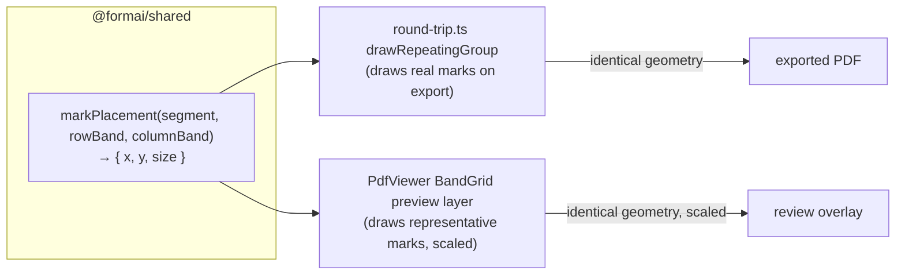

# Live Glyph Preview and Keyboard Nudge for Grid Placement - Plan

## Goal Capsule

- **Objective:** Make grid placement show the reviewer the *actual output*. Instead of only abstract column bands, render a representative mark inside each target cell at the exact size and position the exporter will draw it, so what the reviewer sees is what the filled PDF will print. Add keyboard-arrow nudging so fine correction does not require the mouse.
- **Two tiers:** (1) a quick ergonomics win — arrow-key nudge on the focused band edge; (2) the higher-value feature — a live, WYSIWYG glyph preview driven by the *same* placement math the exporter uses, so preview and export cannot drift.
- **Decision taken (with the user):** the glyph preview **augments** the existing band edges and snapping; it does not replace them. Everything already working stays.
- **Why it matters:** snapping lands a band edge near a printed column, but the reviewer still cannot see where a *tick* will actually fall until export. Showing the real mark, at real size and position, closes that gap and is the strongest confirmation signal the review step can offer.

---

## Product Contract

### Problem Frame

Placement today is band edges plus 1pt stepper buttons and drag-to-snap (`apps/web/src/screens/import/PdfViewer.tsx` `BandGrid`, `apps/web/src/screens/import/inspector/geometry-actions.ts`). Two gaps surfaced on the `ADMN-FRM-111` smoke:

- **Fine correction is mouse-only.** The steppers are on-screen buttons; there is no keyboard nudge on a focused handle, so exact alignment is slower than it should be.
- **The reviewer never sees the real output position.** Snapping aligns a band edge to a printed text-glyph edge, but the exported *mark* is drawn by `drawRepeatingGroup` (`apps/api/src/pdf/round-trip.ts`) at its own computed position and size — `size = max(4, min(9, rowHeight − 3))`, origin `(columnBand.start + 3, rowBand.start + 3)`. The band overlay does not show that mark, so the reviewer confirms an abstraction and only discovers the true tick position on export.

The exporter's placement formula is the source of truth for where marks land. A faithful preview must use *that* formula, not a re-derivation — otherwise the preview reassures the reviewer about a position the export will not honour.

### Requirements

- R1. The focused band edge responds to keyboard Left/Right arrows, nudging by the same 1pt step as the stepper buttons. (A larger Shift+arrow step is optional.)
- R2. A live preview renders a representative mark inside each target cell — every column band × row band — of the selected field's grid.
- R3. The preview mark's size and position are computed by the **same** placement function the exporter uses, so preview and export agree cell-for-cell. Changing the export math changes the preview automatically.
- R4. The preview mark is clearly a **placement guide**, not a filled answer: no filler has answered at review time, so it shows a representative mark (and reads as such), never implying a recorded value.
- R5. The preview **augments** the band edges and snapping; both remain fully functional.
- R6. The preview is display-only. It changes nothing about confirmation: geometry is still confirmed explicitly and per field (parent R8), and nothing about the preview causes a proposal to be trusted (parent R16).

### Acceptance Examples

- AE1. **Covers R1.** Given a focused band edge, when the reviewer presses the Right arrow, then the edge moves 1pt right, identically to the on-screen stepper, and re-snapping/validation behave as for a button nudge.
- AE2. **Covers R2, R3.** Given a confirmed-shape grid over a 6-row two-option table, when the preview renders, then each of the 12 cells shows a mark whose on-screen size and position match where the exporter would draw it (same formula), scaled to the preview.
- AE3. **Covers R3.** Given the exporter's mark-placement function, when it is exercised by both `round-trip.ts` and the web preview, then both consume one shared implementation (a change to it is reflected in both without edits in two places).
- AE4. **Covers R4.** Given the preview, when a reviewer looks at a cell, then the mark is visibly a guide (styled distinctly from a real overlay rule) and no cell implies a recorded yes/no.
- AE5. **Covers R5.** Given the preview shown, when the reviewer drags a band edge or uses a stepper, then placement still works and the preview follows the moved bands.

### Scope Boundaries

Not in this plan:

- **Replacing band placement with direct glyph manipulation** — the user chose *augment*. The bands stay primary.
- **Snapping to the printed ruled cell lines** (vector graphics) rather than text-glyph edges — a larger effort requiring page graphic-operator parsing; recorded in Open Questions.
- The split-order fix (`2026-07-23-001`) and the row-band overlay tighten (`2026-07-23-002`).

---

## Planning Contract

### Key Technical Decisions

- KTD1. **One placement function, shared by export and preview.** Extract the exporter's mark geometry — currently inline in `drawRepeatingGroup` — into a pure helper in `@formai/shared` returning, for a `(segment, rowBand, columnBand)`, the mark's origin `(x, y)` and `size`. `round-trip.ts` consumes it (behaviour-preserving) and the web preview consumes the same. This is what makes R3 true and keeps WYSIWYG honest: there is no second formula to drift.
- KTD2. **The preview draws in PDF-point space, scaled like the bands.** `BandGrid` already maps point space to the rendered preview via `scaleX/scaleY`. The preview marks reuse that mapping, so they track zoom and band moves for free (R5).
- KTD3. **A representative mark, not a real answer.** At review time there is no submission, so the preview shows a standing mark (e.g. the same shape the exporter draws for a chosen cell) styled as a guide — distinct colour/opacity from a live overlay rule — so it communicates *where a tick would land* without implying one was recorded (R4).
- KTD4. **Keyboard nudge reuses the existing adjustment path.** Arrow-key handling on a focused handle calls the same validated `adjustGeometryBand` / boundary adjustment the buttons call, so inversion/overlap refusal and un-confirm-on-edit behave identically (R1). No new movement path, no new validation.
- KTD5. **Augment, never gate.** The preview is an added layer over the existing `BandGrid`; if geometry is absent or a field carries no grid, the preview simply renders nothing. It never blocks or changes the confirm/adjust controls (R5, R6).

### High-Level Technical Design

Shared placement as the single source of truth, consumed by both surfaces:

The claim the design must hold: a cell's mark on `SCREEN` and the same cell's mark in `PDF` come from one function, so they cannot disagree.

---

## Implementation Units

### U1. Keyboard-arrow nudge on the focused band edge

- **Goal:** Let the reviewer nudge a focused handle 1pt with the arrow keys.
- **Requirements:** R1
- **Dependencies:** none
- **Files:** `apps/web/src/screens/import/PdfViewer.tsx`, `apps/web/src/screens/import/inspector/geometry-actions.ts`, `apps/web/src/screens/import/inspector/geometry-actions.test.ts`
- **Approach:** The drag handles in `BandGrid` are focusable (`role="slider"`, `tabIndex`). Add `onKeyDown`: Left/Right call the same validated adjustment the steppers use (single-band edge, or the boundary pair for an interior edge), moving by `NUDGE_POINTS`. Optionally Shift+arrow for a coarser step. Focus styling makes the active handle visible.
- **Patterns to follow:** the existing stepper `nudge` in `GeometryInspector` and the boundary/edge routing already wired through `adjustGeometryBand` / `adjustGeometryBoundary`; the handle-to-band mapping in `columnHandles`.
- **Test scenarios:**
  - `Covers AE1.` a handle's key routing maps Right→ +1pt on the correct edge/boundary, Left→ −1pt (assert the resolved adjustment call, mirroring the button path).
  - an interior handle nudges both adjacent bands (no gap), matching the boundary-drag behaviour.
  - a nudge that would invert/overlap is refused, as for a button nudge.
  - Shift+arrow (if built) applies the coarser step.
- **Verification:** `pnpm --filter @formai/web test` passes; on the app, a focused edge nudges with the keyboard.

### U2. Extract the exporter's mark placement into a shared helper

- **Goal:** One pure placement function used by both export and preview.
- **Requirements:** R3
- **Dependencies:** none
- **Files:** `packages/shared/src/geometry.ts` (or a sibling in `packages/shared/src`), `packages/shared/src/*.test.ts`, `apps/api/src/pdf/round-trip.ts`, `apps/api/src/pdf/round-trip.test.ts`
- **Approach:** Add `markPlacement(rowBand, columnBand)` (and any segment context it needs) returning `{ x, y, size }` with today's exporter math: `size = max(4, min(9, (rowBand.end − rowBand.start) − 3))`, `x = columnBand.start + 3`, `y = rowBand.start + 3`. Refactor `drawRepeatingGroup` to call it instead of computing inline. Behaviour-preserving — the exported bytes must be identical.
- **Execution note:** Characterize first. The `round-trip` tests already assert mark positions; confirm they pass unchanged after the refactor before adding new coverage. This is a pure-extraction refactor guarded by existing export tests.
- **Patterns to follow:** the existing `columnBandFor` / `resolveAnswerSets` helpers in `@formai/shared` that `round-trip.ts` already imports; keep the helper free of pdf-lib types (pure geometry in, plain object out).
- **Test scenarios:**
  - `Covers AE3.` `markPlacement` returns the documented `x/y/size` for representative band dimensions, including the size clamp floor (4) and ceiling (9).
  - existing `round-trip` mark-position assertions pass unchanged after the refactor (characterization).
  - a degenerate/zero-height band clamps to the minimum size rather than producing a non-finite value.
- **Verification:** `pnpm --filter @formai/api test` and `pnpm --filter @formai/shared test` pass; exported output is byte-identical to before the refactor.

### U3. Live glyph preview layer in the grid overlay

- **Goal:** Render a representative mark in every target cell at the shared placement, scaled to the preview.
- **Requirements:** R2, R4, R5, R6
- **Dependencies:** U2
- **Files:** `apps/web/src/screens/import/PdfViewer.tsx`, `apps/web/src/screens/import/inspector/geometry-actions.ts` (if a small view-model helper helps), `apps/web/src/screens/import/inspector/geometry-actions.test.ts`
- **Approach:** In `BandGrid`, for the selected field's grid, iterate `rowBands × columnBands`, call `markPlacement` (U2) per cell, and draw a representative mark at `(x·scaleX, y·scaleY-adjusted)` sized `size·scale`, styled as a guide (distinct colour/opacity from the overlay rules) so it reads as WYSIWYG-placement, not a recorded answer. Add a small caption/legend noting it is a representative preview (R4). The layer is additive and renders nothing when there is no grid (KTD5).
- **Technical design (directional):** the preview is purely a function of the current `segment` (bands) and the shared placement; it holds no state and re-renders when bands move, so drag/stepper/keyboard edits update it for free.
- **Patterns to follow:** the existing band-rectangle rendering in `BandGrid` and its `scaleX/scaleY` mapping and vertical flip (`pageHeight − …`); keep the marks `pointer-events: none` so they never intercept a drag.
- **Test scenarios:**
  - `Covers AE2.` for a known grid, the per-cell preview positions/sizes (in point space, before scaling) equal `markPlacement` for every cell.
  - `Covers AE5.` moving a band edge moves the affected cells' marks; the preview tracks the bands.
  - `Covers AE4.` the preview is styled distinctly from overlay rules and carries the representative-guide affordance.
  - a field with no grid renders no preview marks and no error.
- **Verification:** `pnpm --filter @formai/web test` passes; on the app, the preview marks sit where the exported ticks land (visually confirmed against an export).

---

## Verification Contract

| Gate | Command | Applies to |
|---|---|---|
| Types | `pnpm typecheck` | every unit |
| Web tests | `pnpm --filter @formai/web test` | U1, U3 |
| Shared tests | `pnpm --filter @formai/shared test` | U2 |
| API tests | `pnpm --filter @formai/api test` | U2 |
| Export-fidelity smoke | place a grid, preview, export `ADMN-FRM-111`, compare tick positions | U3 (AE2) |

## Definition of Done

- A focused band edge nudges with the keyboard, identically to the steppers (AE1).
- The overlay shows a representative mark in each target cell at the exporter's exact size/position, from one shared placement function (AE2, AE3).
- The preview reads as a placement guide, augments (never replaces) the bands, and changes nothing about confirmation (AE4, AE5, R6).
- `pnpm typecheck` clean across all five projects; web/shared/api suites green; export output unchanged by the U2 refactor.

## Open Questions

- **Snap to printed ruled lines, not text-glyph edges.** The exact cell boundaries are vector graphics the text layer does not expose; snapping to them (rather than to `OK`/`NA` glyph edges) would remove the residual nudge. Deferred — it needs page graphic-operator parsing and is a larger effort than the WYSIWYG preview, which already lets the reviewer *see* the true position.
- Should the representative mark reflect the column's real glyph (tick vs cross vs "X") per answer set, or a single neutral placeholder? Default to mirroring the exporter's drawn shape for that column; revisit if it reads as a recorded answer despite the guide styling.
- Larger Shift+arrow nudge step: include in U1 or defer? Left optional; decide during U1 from how the 1pt step feels with the keyboard.
