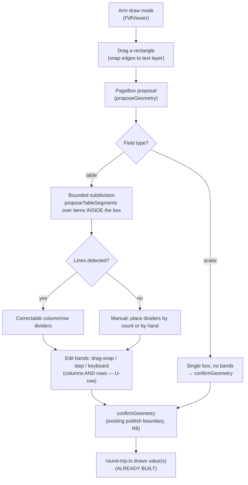

# Draw-by-Hand Geometry - Plan

## Goal Capsule

- **Objective:** A reviewer can **draw a field's position on the original PDF by hand** — a single box for a scalar field, a subdividable grid for a table — so *any* field can round-trip to a filled PDF, not only tables the automatic derivation happened to place. This closes the largest remaining gap: scalar fields (Date, Asset No, Site, Operator, Shift, HRS/KMS) currently have **no path to a position at all** on an AI-extracted document, so their answers never render on export.
- **Scope decided with the user:** one unified drawing tool, delivered as scalar-box first (the foundational primitive) then table-grid subdivision. The tool *augments* the existing derive/confirm flow — it is the manual escape hatch for when derivation refuses, mis-places, or was never possible.
- **The de-risking fact:** the export side for hand-drawn geometry is **already built**. `geometrySegments` + the scalar/table draw paths in `apps/api/src/pdf/round-trip.ts` honour any *confirmed* geometry today. What is missing is only the review-side gesture to *create* that geometry for fields the derivation never served. This plan is almost entirely front-end.
- **What this is not:** it is not the fix for the derivation *collision bug* (a split table's grid landing on the wrong printed section) — that is a correctness fix to automatic derivation, planned separately. Draw-by-hand is the manual fallback, not a substitute for making derivation table-aware.

---

## Product Contract

### Problem Frame

The geometry system built across the faithful-round-trip plan (U1–U10) derives a grid from the text layer and lets a human confirm it. It works — but it is gated to **repeating tables only**, and it *only* offers what derivation produces. Three gaps surfaced on the live `ADMN-FRM-111` smoke:

- **Scalar fields have no geometry path whatsoever.** `unsupportedReason` (`apps/web/src/screens/import/inspector/geometry-actions.ts`) returns *"Only a table can carry a column grid. Other fields export at their own position"* for every non-`repeating_group` field. That copy implies scalars have some other route — they do not. On an AI-extracted form (every flat compliance form in the library) a scalar carries no `sourcePosition`, so `geometrySegments` returns `[]` and the field is silently skipped on export. A filled submission with Date, Asset No, Site, Operator, Shift, HRS/KMS all answered exports a PDF with **none of them drawn**. This is the parent plan's **R9** ("scalar fields carry geometry too") — specified, given an acceptance example, and never built.
- **The "draw the grid by hand" copy promises a tool that does not exist.** When derivation produces nothing, the panel says *"Draw the grid by hand, or leave it"* — but there is no draw affordance anywhere. The reviewer is told to do something the app cannot do.
- **Row bands cannot be edited.** Column edges have steppers and drag-snap (U10); row edges have neither. A grid whose rows sit wrong — or any hand-drawn table grid — cannot be corrected vertically.

The export side is not the problem. `roundTripExport` (`apps/api/src/pdf/round-trip.ts:101-134`) already resolves confirmed geometry for every field and draws scalar text into `segments[0]`; a scalar with a confirmed box would render correctly today. The gap is entirely that **no UI lets a human author that box**.

### Requirements

- R1. A reviewer can draw a rectangle on the PDF overlay for a selected field by dragging, with its edges snapping to printed text-layer positions. Drawing is an explicitly armed mode, so it never fights the existing pan/select gesture.
- R2. A scalar (non-table) field can be given a confirmed **single-box** geometry through that gesture; its value then renders in that box on export. *(Fulfils parent-plan R9.)*
- R3. Row bands are editable with the same affordances as column bands — drag-snap, 1pt steppers, and keyboard-arrow nudge — on both derived and hand-drawn grids.
- R4. After a table's outer box is drawn, the grid **within that box** is detected and presented as correctable dividers (add / drag / delete). When detection finds nothing usable inside the box, the reviewer can place dividers manually by count or by hand — the escape hatch always has a fallback.
- R5. The geometry panel's copy accurately describes the tools actually present in each state. It never tells a reviewer to "draw by hand" unless the draw tool is available.
- R6. All hand-authored geometry is a **proposal**, confirmed through the existing per-field confirm path (parent R8) and validated by `resolveGeometry` (parent R15). Nothing hand-drawn is trusted until confirmed.
- R7. Bounded subdivision satisfies the corroboration doctrine (parent R16): the reviewer's drawn box is the corroboration that scopes detection to one table, and every detected divider remains correctable.

### Acceptance Examples

- AE1. **Covers R2 / parent R9.** Given a `Date` scalar with a hand-drawn, confirmed box on page 1, when a submission is exported, then the Date value renders inside that box.
- AE2. **Covers R1.** Given draw mode armed, when the reviewer drags a rough rectangle near the printed `Asset No` cell, then the box's edges snap to the printed cell's text-layer extents rather than the raw pointer path.
- AE3. **Covers R1, R7.** Given a drag started while draw mode is *off*, when the pointer moves, then the viewer pans/selects as today and no box is drawn.
- AE4. **Covers R3.** Given a focused row edge, when the reviewer presses the arrow keys (or drags, or steps), then the row band moves exactly as a column band does, and an inverting/overlapping move is refused identically.
- AE5. **Covers R4, R7.** Given a box drawn around one printed OK/NA group, when subdivision runs, then it detects that group's option columns and item rows from the glyphs **inside the box only**, ignoring the other tables on the page.
- AE6. **Covers R4.** Given a box drawn over a region where detection finds no usable lines, when subdivision runs, then the reviewer is offered manual divider placement (by count or by hand) rather than an empty or guessed grid.
- AE7. **Covers R5.** Given any panel state, when the reviewer reads its guidance, then it names only actions that are actually available in that state.

### Scope Boundaries

Not in this plan:

- **The derivation collision bug** — automatic derivation picking the wrong printed table for a split field, or the best-confidence proposal anywhere on the page for a field with no row count. That is a correctness fix to `deriveForField`/`proposeTableSegments` (make derivation table-aware), planned separately (`2026-07-23-007`). Draw-by-hand is the manual workaround, not that fix.
- **The glyph-per-type rendering rule** (✓ / Y / N) and the **review-card confirm button** — their own plans (`2026-07-23-005`, `2026-07-23-006`).
- **Snapping to printed vector rule-lines** rather than text-glyph edges — the same deferral U10 recorded; text-edge snapping plus manual correction is sufficient here.

### Deferred to Follow-Up Work

- **Multi-box scalars** (a value that prints in two places). The model supports a segment list; the UI here draws one box per scalar. Revisit only if a real document needs it.

---

## Planning Contract

### Key Technical Decisions

- KTD1. **Closing R9 is a review-UI change, because export already honours scalar geometry.** `geometrySegments` (`packages/shared/src/geometry.ts`) returns confirmed geometry for any field, and `roundTripExport` draws scalar text into `segments[0]` (`round-trip.ts:117-133`). A scalar with a confirmed single box renders today. So the only work for scalars is to (a) stop gating them out of the geometry panel and (b) let the draw gesture create a no-bands `PageBox` they confirm. No export change, no new resolver.
- KTD2. **Hand-drawn geometry reuses the whole existing proposal→confirm pipeline.** `proposeGeometry`, `adjustGeometryBand`, `growToFit`, `confirmGeometry`, `rejectGeometry`, and `resolveGeometry` validation (all shipped in U4) already accept and manage an arbitrary `PageBox`. The drawing gesture only has to produce the initial box; everything downstream — confirm, adjust, publish-boundary, validation — exists. This keeps the feature inside the R8/R15/R16 doctrine by construction.
- KTD3. **Precision comes from snapping, not the pointer.** The U10 lesson holds: a free drag over a scaled preview cannot resolve a 7–13pt column. So a drawn edge snaps to the text-layer targets (`snapTargets`/`snapEdge` from U10) — the pointer places the box *roughly*, snapping and the steppers/keyboard-nudge land it *exactly*. Free-drag alone is never the precision mechanism.
- KTD4. **Bounded subdivision reuses `proposeTableSegments`, constrained to the drawn box.** The collision bug was a *region-selection* failure — unbounded derivation scanned the whole page and chose the wrong table. Here the human draws the box first, so detection runs only over glyphs *inside* it. The drawn box supplies the scoping derivation lacked, which is why detection-within-box is safe where page-wide derivation was not — and it is the corroboration that satisfies R16. Detected dividers stay correctable; nothing auto-confirms.
- KTD5. **Draw mode is explicitly armed.** A drag only draws a box when draw mode is on; otherwise the viewer pans/selects as today. This avoids fighting the existing `didDragRef`/`DRAG_THRESHOLD` pan logic in `PdfViewer.tsx`. Arming is a visible toggle so the reviewer always knows which gesture a drag will perform.
- KTD6. **Row bands become first-class, mirroring columns.** The row axis gets the same editing surface columns already have — `adjustGeometryBand`/`adjustGeometryBoundary` already take an `axis` parameter, and `snapTargets` generalise to horizontal (y) edges. This folds the standalone row-nudge finding in as a prerequisite the draw tool needs anyway, rather than shipping it as an orphan.

### High-Level Technical Design

The unified tool is one drawing primitive plus two completions, all feeding the existing confirm pipeline:

The load-bearing claim: everything from `proposeGeometry` rightward already exists. The new surface is `ARM → DRAG → BOX`, the scalar gate change, the subdivision-within-box step, and the row-axis editing.

---

## Implementation Units

### U1. Draw-a-box gesture on the PDF overlay

- **Goal:** A reviewer can arm draw mode and rubber-band a rectangle on the page, its edges snapping to the text layer, producing a `PageBox` proposal for the selected field.
- **Requirements:** R1, R6, R7
- **Dependencies:** none
- **Files:** `apps/web/src/screens/import/PdfViewer.tsx`, `apps/web/src/screens/import/inspector/geometry-actions.ts`, `apps/web/src/screens/import/inspector/geometry-actions.test.ts`, `apps/web/src/screens/import/inspector/GeometryInspector.tsx`
- **Approach:** Add an armed "draw" mode surfaced by a control in `GeometryInspector`. While armed, a pointer-down + drag on the overlay `BandGrid` surface rubber-bands a rectangle instead of panning (guard against the existing `didDragRef`/`DRAG_THRESHOLD` pan path — KTD5). On release, snap each edge to the nearest `snapTargets` (extend the existing horizontal snap to the vertical axis for top/bottom), build a `PageBox` for the field's page, and call `proposeGeometry`. Keep the rubber-band math in a pure helper so it is unit-testable without a DOM.
- **Patterns to follow:** the existing pointer-capture drag in `BandGrid` (`startDrag`), the `snapTargets`/`snapEdge` helpers and `SNAP_RANGE`, and `proposeGeometry`/`growToFit` in `import-session.ts`.
- **Test scenarios:**
  - `Covers AE2.` a rough rectangle near printed text snaps each edge to the nearest text-layer target (pure helper: pointer rect + targets → snapped `PageBox`).
  - `Covers AE3.` with draw mode off, a drag produces no box (the pan path runs instead).
  - a drawn box is emitted as a `proposeGeometry` proposal, unconfirmed.
  - a box drawn with an inverted drag (release left/above start) normalises to a valid rectangle rather than a negative-size box.
  - a proposed box survives `resolveGeometry` (no zero-area, in-range page).
- **Verification:** `pnpm --filter @formai/web test` passes; on the app, arming draw mode and dragging places a snapped box that can then be confirmed.

### U2. Scalar fields carry a hand-drawn box (closes R9)

- **Goal:** Any non-table field can be given a confirmed single-box geometry, and its value renders there on export.
- **Requirements:** R2, R5, R6
- **Dependencies:** U1
- **Files:** `apps/web/src/screens/import/inspector/geometry-actions.ts` (+ test), `apps/web/src/screens/import/inspector/GeometryInspector.tsx`, `apps/web/src/screens/import/inspector/FieldInspector.tsx`
- **Approach:** Change the panel gating so a scalar field is no longer "unsupported" but "draw-only": it shows the draw affordance (U1) and the confirm/adjust controls, but no derivation (there is nothing to derive for a scalar). Rework `unsupportedReason`/`panelState` so a non-table field returns a *draw-only* state rather than a hard block, and mount the geometry panel for scalars in `FieldInspector` (today it is gated behind `isTable`). A scalar's proposal is a `PageBox` with no `columnBands`/`rowBands`. Export is unchanged — `geometrySegments` + the scalar draw path already honour it (KTD1). Fix the "Only a table can carry a column grid" copy to describe drawing a placement box.
- **Execution note:** Verify the closed loop end-to-end — a confirmed scalar box must reach `reviewedToFields` → publish → `roundTripExport` and draw. Add an export-level assertion (api side) that a scalar field with confirmed single-box geometry draws its value, so R9 is protected by a test, not just wired.
- **Patterns to follow:** the existing `panelState`/`unsupportedReason` shape; the `isTable` mount condition in `FieldInspector`; the round-trip scalar draw path for the export assertion.
- **Test scenarios:**
  - `Covers AE1.` (api) a scalar field with confirmed single-box geometry renders its value at the box on export; with no geometry it is skipped (unchanged).
  - a scalar field surfaces a draw-only geometry panel (no derivation offered), where a table still offers derivation.
  - a confirmed scalar box crosses the publish boundary via `reviewedToFields`; an unconfirmed one does not (parent R8).
  - the panel copy for a scalar names drawing a box, not a column grid.
- **Verification:** `pnpm --filter @formai/web test` and `pnpm --filter @formai/api test` pass; on the app, drawing+confirming a box for `Date` makes the Date value appear on the exported PDF.

### U3. Row bands become first-class editable

- **Goal:** Row edges are adjustable with the same drag-snap / stepper / keyboard-nudge affordances as column edges, on derived and hand-drawn grids.
- **Requirements:** R3
- **Dependencies:** none (independent of U1/U2; shared by U4)
- **Files:** `apps/web/src/screens/import/inspector/GeometryInspector.tsx`, `apps/web/src/screens/import/PdfViewer.tsx`, `apps/web/src/screens/import/inspector/geometry-actions.ts` (+ test)
- **Approach:** The row-nudge gap the smoke found: `BandNudger` and `columnHandles` only handle the column axis, though `adjustGeometryBand`/`adjustGeometryBoundary` already take an `axis` argument. Add row-edge steppers to the inspector, row drag-handles to the overlay, and keyboard-arrow nudging (up/down) on a focused row handle — each routing through the existing axis-aware adjustment. Generalise `snapTargets` to the vertical axis so a dragged row edge snaps to printed baselines.
- **Patterns to follow:** the column `BandNudger`/`columnHandles`/`BandRow` and the U10 keyboard-nudge; the axis parameter already threaded through `adjustGeometryBand`.
- **Test scenarios:**
  - `Covers AE4.` a row handle's key/step/drag routes to `adjustGeometryBand(..., 'row', ...)` with the same values a column edge would.
  - an interior row boundary moves both adjacent row bands together (no gap), matching the column-boundary rule.
  - a row move that inverts or overlaps a neighbour is refused, identically to columns.
  - vertical snap pulls a dragged row edge onto a printed baseline within range.
- **Verification:** `pnpm --filter @formai/web test` passes; on the app, a derived grid's rows can be nudged and dragged exactly like its columns.

### U4. Bounded subdivision — detect the grid inside a drawn box

- **Goal:** After a table's outer box is drawn, carve it into cells by detecting the printed column/row lines *within the box*, presented as correctable dividers, with a manual fallback.
- **Requirements:** R4, R5, R6, R7
- **Dependencies:** U1, U3
- **Files:** `apps/web/src/screens/import/inspector/geometry-actions.ts` (+ test), `apps/web/src/screens/import/inspector/GeometryInspector.tsx`, `apps/web/src/lib/pdf-geometry.ts`
- **Approach:** When the selected field is a table and an outer box has been drawn, run the existing `proposeTableSegments` (or a thin wrapper) over only the text items whose coordinates fall inside the box, seeding column/row bands from what it finds (KTD4). Present those bands as the editable dividers from U3 — add, drag-snap, delete. When detection yields nothing usable inside the box, fall back to letting the reviewer set counts (seed evenly, then snap each — scaffolding the human immediately corrects) or place dividers by hand. Nothing auto-confirms; the reviewer confirms the finished grid. Update the panel copy so "draw the grid by hand" only appears when this tool is actually present (R5).
- **Execution note:** The detection must be genuinely box-scoped — prove with a fixture where two structurally identical tables sit on one page and the box around one must not pull the other's columns in.
- **Patterns to follow:** `proposeTableSegments` and its item-filtering; the band-editing surface from U3; the `centresToBands` contiguity rule the dividers must preserve.
- **Test scenarios:**
  - `Covers AE5.` a box around one OK/NA group detects that group's columns/rows from inside-box glyphs only; a second identical table on the page contributes nothing.
  - `Covers AE6.` a box over a region with no detectable lines returns no auto-grid and offers manual placement instead.
  - detected dividers are correctable — add/drag/delete — and none is confirmed until the reviewer confirms.
  - a manually count-seeded grid divides evenly as a starting point, then each divider snaps/nudges to the printed line.
  - the subdivided grid survives `resolveGeometry` (contiguous bands, in range).
- **Verification:** `pnpm --filter @formai/web test` passes; on the app, drawing a box around one printed group on `ADMN-FRM-111` yields a correctable grid scoped to that group.

---

## Verification Contract

| Gate | Command | Applies to |
|---|---|---|
| Types | `pnpm typecheck` | every unit |
| Web tests | `pnpm --filter @formai/web test` | U1, U2, U3, U4 |
| API tests | `pnpm --filter @formai/api test` | U2 (scalar export assertion) |
| Real smoke | draw+confirm a scalar box and a table box on `ADMN-FRM-111`, export | U2, U4 |

## Definition of Done

- A scalar field (e.g. Date) can be given a hand-drawn, confirmed box and its value renders on the exported PDF — parent R9 closed, protected by an export-level test.
- Row bands are editable exactly like column bands, on derived and hand-drawn grids.
- A table's grid can be carved by drawing a box and correcting the box-scoped detected dividers, with a manual fallback.
- Every hand-authored geometry stays a proposal confirmed through the existing per-field path; `resolveGeometry` still guards the publish boundary.
- No panel state promises a tool it does not provide.
- `pnpm typecheck` clean across all five projects; web and api suites green.

## Open Questions

- **Draw-mode arming affordance** — a panel toggle vs a modifier key vs a persistent "add box" button. Resolve during U1 from how it feels against the existing pan gesture; the requirement (R1/R7) only fixes that it must be explicit.
- **Count-seed vs hand-place emphasis in the U4 fallback** — which is the default when detection fails. Decide during U4 from the fixture behaviour; both must exist.
- **Snapping to printed vector rule-lines** (not just text-glyph edges) would remove residual nudging but needs page graphic-operator parsing — deferred, as in U10.
- **One derived proposal per side-by-side group (`proposeTableSegments`/`rightmostCluster`).** Found while shipping the collision fix (`2026-07-23-007`, PR #32): on the real `ADMN-FRM-111`, a category's three side-by-side groups share one `OK NA OK NA OK NA` header, and `rightmostCluster` collapses that to a **single** derived proposal (the rightmost pair). So after a split into 3 groups the page surfaces only 1 proposal, and the collision fix's ordinal path correctly **refuses** all three (count mismatch) rather than colliding them — safe, but automatic per-group derivation does not happen on the 3-up layout. U4's bounded subdivision is one answer (the reviewer draws a box per group); a complementary derivation-side change would make `proposeTableSegments` emit one proposal per side-by-side column-group so the ordinal path in `2026-07-23-007` places them automatically. Decide during U4 whether that derivation-side change is worth adding as a unit here or is made unnecessary by draw-by-hand — do not pre-commit. It is a `pdf-geometry.ts` change, cleanly separable, and interacts with U4, which is why it is captured here rather than planned standalone.
