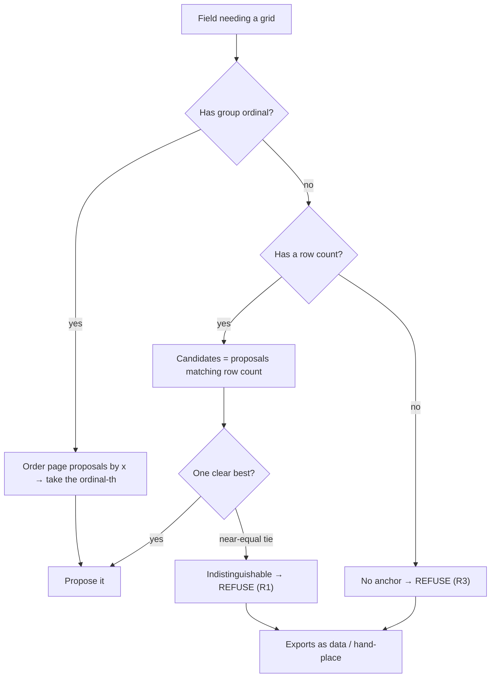

# Table-Aware Grid Derivation - Plan

## Goal Capsule

- **Objective:** When a page carries several structurally-identical tables, grid derivation must place a field's grid on the *right* one — or, when it cannot tell which, **refuse** rather than confidently place it on the wrong one. On the `ADMN-FRM-111` smoke, a split Category A/C group's derived grid landed on a different printed section, and a no-row-count field (`FAULTS`) was offered a 12pt sliver from an unrelated OK/NA table. Both are the same root cause: derivation has no notion of *which* printed table a field belongs to.
- **Two-part fix:** (1) give a split-group field its printed-group ordinal so derivation can pick the correspondingly-positioned table (removes the common-case ambiguity); (2) when the field still cannot be disambiguated among near-equal candidates, **refuse** — emit no proposal — honouring the corroborate-or-refuse doctrine (parent R16). A refused field exports as data and can be hand-placed (draw-by-hand, `2026-07-23-004`).
- **Why separate from draw-by-hand:** draw-by-hand is the manual escape hatch; this plan makes *automatic* derivation stop mis-placing. A confidently-wrong grid on a competency record is worse than no grid, so refusing is the safe failure.

---

## Product Contract

### Problem Frame

`deriveForField` (`apps/web/src/screens/import/inspector/geometry-actions.ts`) scans **every** header row on a page's text and picks the proposal whose row count is closest to the field's item count, breaking ties by confidence. It has no idea which physical table section a given field belongs to. Two failure modes, both seen on the smoke:

- **Split-group collision.** After U9 splits Category A into three 6-row groups, all three are structurally identical (6 rows, OK/NA). Derivation matches all three equally on row count, and the tie-break (equal confidence on a symmetric page) silently keeps whichever it hit first — so group 3's grid can land on group 2's printed area, with no in-app way to correct the *vertical* target. Earlier smokes never split more than one category at once, so the competition never arose.
- **No-row-count grab.** `FAULTS` is an open blank-entry table (no `fixedRows`), so `deriveForField` falls back to the single highest-confidence proposal *anywhere on the page*. It offered a 12pt-wide band (`description` at L527/R539) sitting on an unrelated table's NA column — nonsensical for a free-text field. This violates parent R16 (refuse rather than guess) in a spot never exercised before, because earlier documents had one table shape per page.

The data model already separates proposal from confirmation and refuses uncorroborated proposals for *header shape*. What is missing is the same discipline for *table identity*: pick the right table, or refuse.

### Requirements

- R1. When several candidate proposals match a field near-equally and derivation cannot distinguish which printed table the field belongs to, it emits **no proposal** and records the reason — never a confident pick among indistinguishable tables (parent R16).
- R2. A field produced by a side-by-side split carries its **printed-group ordinal** (which of the N groups, left-to-right). Derivation uses that ordinal to select the correspondingly-positioned proposal, resolving the common split-group case without a refusal.
- R3. A field with no row count (an open table) does not grab the best-confidence proposal from an unrelated table; absent a positional anchor it refuses (R1) rather than guessing.
- R4. A refusal is visible and recoverable: the field shows the existing "nothing proposed — leave as data or place it" state and still publishes, exporting its answers as data (parent R11). It is a correctable outcome, not an error.
- R5. The change must not reduce correct derivations on single-table-per-region documents — the library sweep and the existing per-field derivations stay intact.

### Acceptance Examples

- AE1. **Covers R2.** Given Category A split into 3 groups on a page with three side-by-side OK/NA blocks, when each group's grid is derived, then group 1 gets the leftmost block, group 2 the middle, group 3 the rightmost — none lands on another's area.
- AE2. **Covers R1, R3.** Given `FAULTS` (no fixed rows) on a page of OK/NA tables, when derivation runs, then it proposes nothing rather than a sliver from an unrelated table.
- AE3. **Covers R1.** Given two structurally-identical tables and a field with no ordinal to disambiguate them, when derivation runs, then it refuses rather than picking one at random.
- AE4. **Covers R5.** Given the eight surveyed library documents, when derivation runs, then correct single-region proposals are unchanged from the current baseline.

### Scope Boundaries

Not in this plan: the draw-by-hand tool (`2026-07-23-004`, the manual placement a refusal falls back to), the glyph rule (`2026-07-23-005`), and the confirm-card (`2026-07-23-006`). This plan changes only *which table* automatic derivation selects, and when it refuses.

---

## Planning Contract

### Key Technical Decisions

- KTD1. **The drawn split already encodes position — carry it as an ordinal.** U9's `splitTableGroups` creates groups in printed left-to-right order (`(1 of 3)`, `(2 of 3)`, `(3 of 3)`). Stamp each group with `{ index, count }` (review-only metadata, carried like `columnGroups` in `reviewMeta`, never published). Derivation orders the page's candidate proposals by x and selects the `index`-th — turning "which of three identical tables" from a coin-flip into a lookup.
- KTD2. **Refuse when candidates are indistinguishable.** When two or more proposals match the field near-equally (same row-count delta, confidence within a small band) and no ordinal disambiguates them, emit nothing and record the reason. This extends the existing corroborate-or-refuse doctrine (parent R16) from header shape to table identity. A refusal is safe; a confident wrong placement on a competency record is not.
- KTD3. **A no-row-count field with no anchor refuses.** The current "best confidence anywhere" fallback is the `FAULTS` bug. Without a row count *and* without a positional anchor there is nothing to tie the field to a table, so the honest output is no proposal — the reviewer hand-places it or leaves it as data (parent R11).
- KTD4. **Prove no regression via the library sweep.** The same U7/U8 sweep is the guard: single-table-per-region documents must keep their current proposals. Any drop in correct proposals means the refusal is too aggressive.

### High-Level Technical Design

---

## Implementation Units

### U1. Carry a printed-group ordinal through the split

- **Goal:** A split-group field knows which of the N printed groups it is.
- **Requirements:** R2
- **Dependencies:** none
- **Files:** `apps/web/src/lib/data/import-session.ts`, `apps/web/src/lib/data/import-session.test.ts`, `packages/shared/src/extraction.ts` (if the ordinal rides on the review field type)
- **Approach:** In `splitTableGroups`, stamp each created part with a group placement `{ index, count }` (0-based index in printed left-to-right order for `down-columns`, matching the split's own ordering). Carry it in `reviewMeta` like `columnGroups` — review-only, surfaced on the review field, never crossing `reviewedToFields`. Clear on reset/re-extraction.
- **Patterns to follow:** the `columnGroups` metadata plumbing shipped in `2026-07-23-001` (reviewMeta entry, `derivedReviewFields` surfacing, publish-boundary exclusion).
- **Test scenarios:**
  - splitting into 3 stamps ordinals 0,1,2 on the three groups in printed order.
  - the ordinal surfaces on the review field and is absent from the published field.
  - reset/re-extraction clears it.
- **Verification:** `pnpm --filter @formai/web test` passes.

### U2. Select by ordinal, else refuse on ambiguity

- **Goal:** Derivation picks the ordinal-matching table when it can, and refuses when it cannot distinguish candidates.
- **Requirements:** R1, R3, R4, R5
- **Dependencies:** U1
- **Files:** `apps/web/src/screens/import/inspector/geometry-actions.ts`, `apps/web/src/screens/import/inspector/geometry-actions.test.ts`
- **Approach:** In `deriveForField`/`deriveAcrossPages`: (1) if the field carries a group ordinal, order the page's proposals by their columns' x-position and select the ordinal-th (guard bounds); (2) otherwise keep row-count matching, but when the best candidate is not clearly better than the next (row-count delta tie AND confidence within a small measured band), return null with a recorded reason instead of picking; (3) for a field with no row count and no ordinal, return null rather than the global best-confidence proposal. Surface the refusal through the existing `no-proposal` panel state (parent R11 / the draw-by-hand fallback).
- **Execution note:** Proof-first with the measured multi-table fixtures — a three-up page for the ordinal path (AE1) and a no-row-count field over OK/NA tables for the refusal path (AE2). Calibrate the "near-equal" band across ≥3 documents; if it cannot be set without harming real single-region derivations, prefer refusing and record it.
- **Patterns to follow:** the existing candidate-selection reduce in `deriveForField`; the `no-proposal` state in `panelState`; the calibration/sweep discipline from U7/U8.
- **Test scenarios:**
  - `Covers AE1.` three ordinal-stamped groups over three side-by-side blocks each derive their own block, ordered by x.
  - `Covers AE2.` a no-row-count field over OK/NA tables derives nothing (no sliver grab).
  - `Covers AE3.` two identical tables and an un-ordinal'd field → null (refuse), reason recorded.
  - `Covers AE4.` a single-region table with one clear candidate still derives as today (no false refusal).
  - an ordinal out of range (fewer proposals than groups) refuses rather than indexing past the end.
- **Verification:** `pnpm --filter @formai/web test` passes; the library sweep matches the U7/U8 baseline (no correct proposal lost); on `ADMN-FRM-111`, split groups derive onto their own printed blocks and `FAULTS` proposes nothing.

---

## Verification Contract

| Gate | Command | Applies to |
|---|---|---|
| Types | `pnpm typecheck` | every unit |
| Web tests | `pnpm --filter @formai/web test` | U1, U2 |
| Library sweep | bundle + `library-smoke.mjs` across all eight documents | U2 (R5) |
| Real smoke | derive each split group + `FAULTS` on `ADMN-FRM-111` | U2 (AE1, AE2) |

## Definition of Done

- Split groups derive onto their own printed blocks via the group ordinal.
- A field derivation cannot confidently tie to a table refuses rather than mis-placing; a no-row-count/no-anchor field proposes nothing.
- Refusals export as data and are hand-placeable; nothing is a hard error.
- The library sweep is unchanged from the U7/U8 baseline — no correct proposal lost.
- `pnpm typecheck` clean; web suite green.

## Open Questions

- **Ordinal vs spatial disambiguation for non-split fields.** The ordinal handles split groups; a non-split field on a multi-table page still relies on refuse-on-ambiguity. A future enhancement could anchor any field spatially (reading-order position, nearest header), but that is more inference and is deferred — refusing is the safe default now.
- **The "near-equal" confidence band** must be calibrated across ≥3 documents (KTD2). If no band cleanly separates a genuine winner from a tie without harming real derivations, ship refuse-biased and record the finding.
