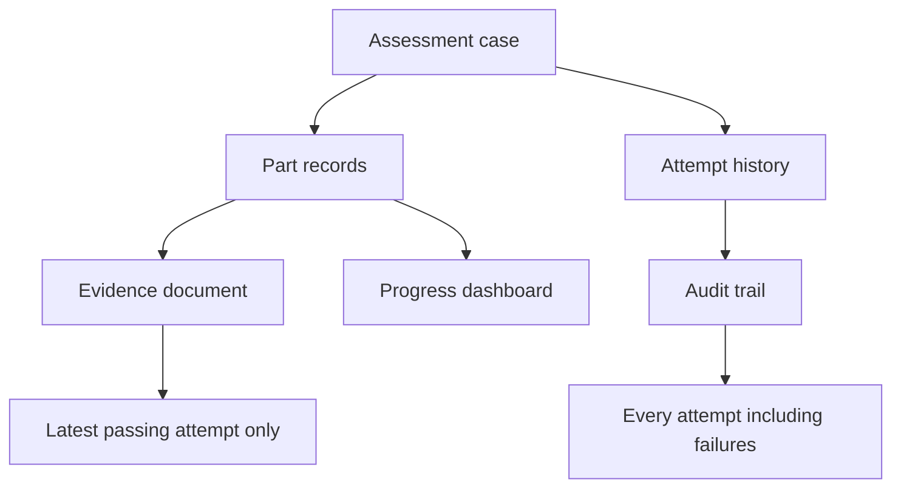
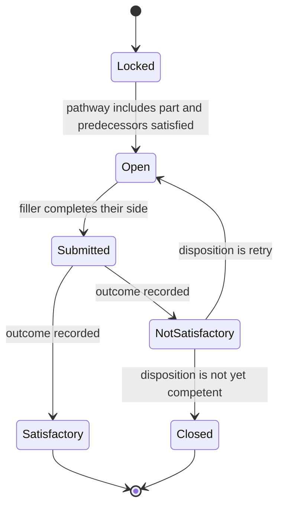
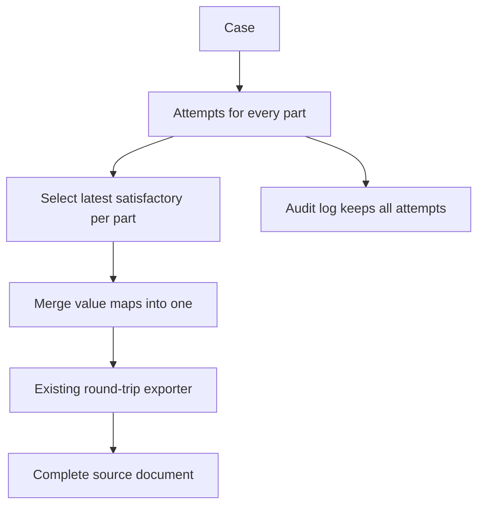
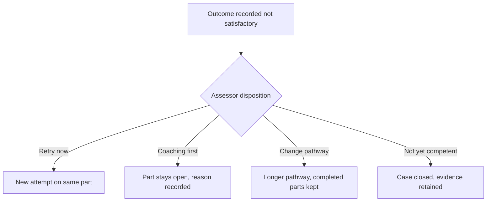

# Multi-Part Assessment Workflow - Plan

## Goal Capsule

- **Objective:** Replace the printed multi-part assessment tool with a digital assessment case that survives months of asynchronous work between a candidate and an assessor, shows at any moment which part every candidate has reached, and regenerates the complete source document as validation evidence.
- **Product authority:** Training department (brainstorm requester).
- **Open blockers:** None blocking planning. Two items are recorded as deferred follow-ups rather than gaps: syncing competency records from BIS, and the panel-review arm of appeals below Enterprise.

---

## Product Contract

### Summary

An assessment case carries one candidate through a multi-part competency tool as a set of per-part records, over the months the logged-hours parts take. Candidate and assessor each work their own parts asynchronously, every attempt is retained, and the latest passing attempt is what the regenerated evidence document shows. The capability ships from the Business plan, metered by candidate seats held separately from staff seats.

### Problem Frame

The assessment tool is printed and handled as a single physical document. The assessor issues it, the candidate completes the theory alongside them, and then the candidate keeps the paper for the weeks or months needed to log 20 hours of directly-supervised work and 50 hours under minimal supervision. Through that whole window nobody can tell which part any candidate has reached. The theory stage is the last point at which the organisation has reliable visibility, and documents get lost after it.

The cost lands twice. Operationally, a lost document means re-running assessment steps a candidate already satisfied. For validation, the artifact that is supposed to prove competence is one piece of paper with no backup and no trail, so an auditor asking how a given operator came to be authorised depends on that paper still existing.

The document's own structure compounds the problem. Parts 2, 4 and 6 are the same practical demonstration under three labels, and Parts 3 and 5 are logbooks. Theory and several practical subsections are location-specific, so a large share of the printed pages never applies to the candidate holding them.

### Key Decisions

- **A case with per-part records, not one long draft.** Retries and the audit trail both require attempts to be real records. A single record with one slot per field cannot hold a failed attempt and a later pass at the same time, which is the behaviour the assessment process depends on.

- **The system records decisions; it does not make them.** Assessors hold discretion over what follows a Not Satisfactory outcome, over starting a demonstration before an hours threshold, and over proceeding when a prerequisite is unmet. Each such decision demands a recorded reason. This mirrors the source document, which asks the assessor to state further action rather than prescribing it.

- **Theory is auto-marked against a stored answer key.** This makes the "100% on the General set" rule computable rather than eyeballed, and produces the per-question tick or cross that the printed outcome column expects. The cost is a new authoring surface: someone must record the correct answers per assessment tool.

- **Candidates get their own role, scoped to their own records, metered separately.** No existing role can be narrowed to a candidate, because all five see every submission across the organisation. Operators outnumber training staff by an order of magnitude, so counting them against staff seats would exhaust the top plan at a single site.

- **Governance depth is sold by tier.** Re-assessment appeals and competency features start at Business; panel review and a distinct training supervisor role are Enterprise. Candidate seats are the only volume meter, so a site's case load is bounded by how many operators it enrols rather than by a second limit to explain.

- **Gating responsibilities separate by layer.** Location stream gates content inside a part, the pathway decides which parts a case has at all, and part-unlock is case state. Only the first is field visibility, and it needs one condition — so the existing single-condition mechanism stays untouched rather than growing an AND/OR form that four surfaces would have to agree about.

- **A revised tool migrates the case, not the history.** In-flight cases move to the current tool version for parts not yet completed, while completed parts keep the version they were actually assessed against. The simple migration rule holds without the evidence document misrepresenting what happened.

### Actors

- A1. **Candidate** — completes the declaration, the theory set, and their own logbook entries. Sees only their own cases.
- A2. **Assessor** — opens cases, runs practical demonstrations, marks criteria, records outcomes and dispositions, signs off. Eligible for a given tool only where they hold that tool's assessor competencies.
- A3. **Training supervisor** — initiates appeals and appoints the independent assessor. An administrator at Business; a distinct role at Enterprise.
- A4. **The platform** — marks theory answers, computes the theory outcome, tracks logged hours, and notifies the assessor when a threshold is reached.

### Key Flows

- F1. Case start
  - **Trigger:** An assessor opens a case for a named candidate against an assessment tool.
  - **Actors:** A2, A4
  - **Steps:** Assessor selects pathway and location stream; the platform surfaces any unmet prerequisite competencies on either side; the assessor proceeds or abandons; the candidate declaration is captured.
  - **Covered by:** R1, R2, R4, R28

- F2. Theory
  - **Trigger:** The case reaches Part 1.
  - **Actors:** A1, A4, A2
  - **Steps:** Candidate answers the General set plus their location set; the platform marks each question and writes its tick or cross; the platform computes the part outcome; the assessor reviews it; the page-one checklist updates.
  - **Covered by:** R6, R7, R8, R9, R10, R17

- F3. Practical demonstration
  - **Trigger:** A demonstration part becomes current.
  - **Actors:** A2
  - **Steps:** Assessor marks each criterion satisfactory, not satisfactory or not applicable; records the part outcome; signs and dates; the page-one checklist updates.
  - **Covered by:** R11, R12, R13, R17

- F4. Logbook accumulation
  - **Trigger:** A logbook part becomes current.
  - **Actors:** A1, A4, A2
  - **Steps:** Candidate adds dated entries over weeks and signs each; the platform totals duration; on reaching the minimum it notifies the assessor to schedule the next demonstration.
  - **Covered by:** R14, R15, R16

- F5. Not Satisfactory disposition
  - **Trigger:** A part records a Not Satisfactory outcome.
  - **Actors:** A2
  - **Steps:** Assessor chooses retry, further coaching then retry, move to the longer pathway, or close as not yet competent; records a mandatory reason; the failed attempt is retained and a retry opens a new attempt at that part.
  - **Covered by:** R3, R18, R19

- F6. Completion and evidence
  - **Trigger:** Every part the pathway requires holds a current Satisfactory outcome.
  - **Actors:** A2
  - **Steps:** Assessor records the overall result and signs; the case regenerates the complete source document with all outcomes, signatures and checklist marks in place.
  - **Covered by:** R20, R22, R23, R24

- F7. Appeal
  - **Trigger:** A candidate disputes an outcome.
  - **Actors:** A3, A2
  - **Steps:** Supervisor opens a linked case with a different assessor and a recorded reason; the new case runs normally; its outcome supersedes while both cases are retained.
  - **Covered by:** R29, R30, R32

### Requirements

**Case and pathway**

- R1. A case pins one candidate, one assessment tool version, one pathway and one location stream, and holds state independently of any single fill session.
- R2. Pathway is selected at case start: Experienced (Parts 1 and 2), New and Inexperienced (Parts 1 through 6), or Recognition of Prior Learning (Parts 1 and 2, with the logged-hours parts waived under a recorded justification).
- R3. An assessor may change a case's pathway mid-flight with a recorded reason; parts already completed keep their outcomes.
- R4. The location stream selected at case start determines which theory question set and which location-specific practical subsections apply.
- R5. When the assessment tool is revised, an in-flight case moves to the current version for parts not yet completed; completed parts keep the version they were assessed against.

**Theory and auto-marking**

- R6. Part 1 presents the General question set plus exactly one location-specific set.
- R7. Each theory question carries a stored answer key. A question may designate several options correct, and the candidate must select all of them and no others to be marked correct.
- R8. The platform marks each answered question and writes a tick or a cross into that question's outcome cell.
- R9. Part 1 cannot reach a Satisfactory outcome unless every General question is marked correct.
- R10. Part 1's outcome is computed from the marking rather than entered by the assessor; the assessor reviews it before the case advances.

**Practical demonstrations**

- R11. Parts 2, 4 and 6 present the same demonstration criteria under their own part label, and each holds an independent outcome.
- R12. An assessor marks each practical criterion satisfactory, not satisfactory, or not applicable.
- R13. Each practical part records the assessing assessor's printed name, signature and date on completion.

**Logbooks**

- R14. Parts 3 and 5 accumulate dated entries carrying location, task, duration and comments, each signed by the candidate.
- R15. Part 3 carries a 20-hour minimum and Part 5 a 50-hour minimum; reaching a minimum notifies the assessor to schedule the next demonstration.
- R16. An assessor may schedule the next demonstration before a minimum is reached by recording a reason. A threshold notifies; it never blocks.

**Outcomes and tracking**

- R17. Recording a part outcome updates the page-one assessment-method checklist entry for that method.
- R18. A Not Satisfactory outcome requires the assessor to record a disposition — retry, further coaching then retry, move to the longer pathway, or close as not yet competent — with a mandatory reason.
- R19. Every attempt at a part is retained, failures included. The most recent passing attempt is the one the evidence document renders.
- R20. A case reaches Competent only when every part its pathway requires holds a current Satisfactory outcome.
- R21. Progress across all open cases is visible without opening any individual case: current part, latest outcome per part, and accumulated hours against each threshold.

**Evidence export**

- R22. A case regenerates the complete source document, with every answer, checkbox, signature and outcome placed at its printed position.
- R23. Parts and subsections a case's pathway or location stream excludes still appear in the exported document, unmarked, mirroring the printed tool.
- R24. Logbook entries render as rows within the Part 3 and Part 5 tables, continuing across page breaks.

**Identity, roles and access**

- R25. A candidate role exists whose holders can see and act on only their own cases.
- R26. Assessors create cases and record outcomes. Eligibility to assess a given tool derives from holding that tool's assessor competencies.
- R27. Candidate memberships are counted and capped separately from staff seats.

**Prerequisites and appeals**

- R28. Unmet prerequisite competencies, candidate-side or assessor-side, are surfaced at case start and recorded on the case. They never block.
- R29. An appeal creates a new case linked to the original with a different assessor; the later outcome supersedes and both cases are retained.
- R30. Whoever initiates an appeal must not be the assessor on the disputed case.

**Plan tiering and metering**

- R31. The capability is available from the Business plan. Case volume is bounded by the plan's candidate seat allowance rather than by a separate case meter, so a candidate assessed on several machines holds several cases against one seat.
- R32. Panel review is Enterprise-only. A distinct training supervisor role is Enterprise-only; at Business that authority sits with administrators under R30.

### Acceptance Examples

- AE1. Theory marking with several correct options
  - **Covers R7, R8.**
  - **Given** a question designating options b and c correct, **when** the candidate selects b only, **then** the question is marked incorrect and its outcome cell shows a cross.
  - **Given** the same question, **when** the candidate selects b, c and d, **then** the question is marked incorrect — selecting a wrong option costs the mark even when every correct option is present.

- AE2. The General 100% rule
  - **Covers R9, R10.**
  - **Given** a candidate who answers every location-set question correctly but misses one General question, **when** theory marking completes, **then** Part 1's outcome is Not Satisfactory and the assessor reviews it rather than entering it.

- AE3. Retry overwrites on the page, not in the trail
  - **Covers R19, R22.**
  - **Given** a candidate whose Part 4 attempt was Not Satisfactory and whose second attempt was Satisfactory, **when** the evidence document is generated, **then** Part 4 renders the passing attempt only, **and** the audit trail still holds the failed attempt with its recorded disposition.

- AE4. Threshold notifies without blocking
  - **Covers R15, R16.**
  - **Given** a candidate with 38 logged hours against the Part 5 minimum of 50, **when** the assessor schedules the final demonstration, **then** it proceeds once the assessor records a reason, **and** the case shows the demonstration ran below threshold.

- AE5. Excluded content still prints
  - **Covers R4, R23.**
  - **Given** a case on the Raw Materials stream, **when** the evidence document is generated, **then** the Mining-only theory and practical subsections appear unmarked rather than being omitted.

- AE6. Pathway change preserves completed work
  - **Covers R3.**
  - **Given** an Experienced-pathway candidate whose Part 2 attempt was Not Satisfactory, **when** the assessor moves them to the New and Inexperienced pathway, **then** their Part 1 outcome is retained and Parts 3 through 6 become applicable.

- AE7. Candidates cannot see each other
  - **Covers R25.**
  - **Given** two candidates in one organisation, **when** either opens their case list, **then** only their own cases are listed and the other's case is unreachable by direct reference.

- AE8. Appeal conflict constraint
  - **Covers R29, R30.**
  - **Given** an administrator who was also the assessor on a disputed case, **when** they attempt to initiate the appeal, **then** the action is refused and another administrator must initiate it.

- AE9. Mid-flight tool revision
  - **Covers R5.**
  - **Given** a candidate who completed Parts 1 and 2 against version 4.0 and is mid-way through Part 5 when version 5.0 deploys, **when** the case continues, **then** the remaining parts run against 5.0 **and** the completed Parts 1 and 2 still show as assessed against 4.0.

### Scope Boundaries

**Deferred for later**

- Syncing competency records from BIS. Prerequisite and eligibility checks read competencies held in the platform, not the learning management system, so a competency earned in BIS is not visible here until it is recorded in the platform. This is the highest-value follow-up: it is what turns prerequisite warnings from a manual data-entry exercise into a real check.
- The panel-review arm of appeals below Enterprise. The independent-assessor arm covers the common case; a panel judgement on a Business-tier case is recorded as a note rather than modelled.
- An append-only event ledger as the durable record, with the evidence document and dashboard as projections of it. Worth revisiting if reassessment cycles make superseding outcomes common.
- Offline capture for logbook entries and in-cab demonstrations.

**Outside this scope**

- Scheduling and rostering of assessments.
- Issuing or renewing the qualification itself; the case produces the evidence, not the authorisation record.

### Dependencies / Assumptions

- The competency model already carries a nationally-recognised code per competency, which is the shape the source document's prerequisites take. Prerequisite and assessor-eligibility checks assume competencies are recorded against people in the platform.
- Plan entitlement is an existing enforced mechanism with per-tier feature flags and seat limits, so adding case and candidate meters extends it rather than introducing a new concept.
- Field-level round-trip placement already exists, including multi-page footprints with explicit column and row bands. Evidence export assumes each part maps to a page range of the source document.
- Conditional visibility already resolves at section scope and fails open, and location-stream gating assumes that behaviour.
- The capability is assumed reusable across every assessment tool of this shape, not built against one machine.

### Outstanding Questions

**Deferred to planning**

- How own-records scoping enters the permission model, given it is a new axis rather than a new role value, and how existing role checks absorb it.
- Whether an assessor's own attempt history needs to be visible to the candidate, or only the current outcome.
- How the answer key is authored and versioned alongside the assessment tool.

### Sources / Research

- Source document: *Authorised to Operate Track Dozer*, version 4.0, deployed 26 August 2025, revalidating 26 August 2028. 18 pages, six parts, two stated pathways plus Recognition of Prior Learning, and an appeals process naming both an independent assessor and a panel.
- `packages/shared/src/form-field.ts` — field type taxonomy including the tick/cross type whose audit intent is preserved as distinct from a plain yes/no, shared-answer column groups, fixed-row checklists, and multi-page geometry with column and row bands.
- `packages/shared/src/visibility.ts` — section-scoped conditional visibility with fail-open semantics; currently one condition per field, sourced only from non-repeating fields.
- `packages/db/src/schema/submissions.ts` — the current single-sitting record: one row, one flat value map, pinned to one tool version.
- `packages/db/src/permissions.ts` — the five-role capability matrix; every role including the weakest can view submissions organisation-wide, and the matrix has no row-level scope.
- `packages/db/src/plans.ts` — per-tier feature entitlements and seat limits; competency gating currently sits at Enterprise only and moves to Business under R31.
- `packages/shared/src/competency.ts` — competency and gating-rule shapes; the code field is the same identifier space as the source document's prerequisites.
- `docs/IMPLEMENTATION_PLAN.md` — competency gating is Phase 4 and the responsive field flow is Phase 5; this work makes both load-bearing.

---

## Planning Contract

**Product Contract preservation:** unchanged. All R, A, F and AE IDs carry forward verbatim from the brainstorm; planning added no product behavior and narrowed no scope.

### Key Technical Decisions

- KTD1. **One template, values partitioned by part.** The source document stays a single template version holding all six parts as sections. A part attempt stores only the value subset for its part; nothing splits the template. This keeps `sourcePosition` and `geometry` anchors valid without remapping and means R22's export is an assembly step rather than an exporter rewrite.

- KTD2. **Part boundaries are declared, not inferred.** A per-template part manifest names each part's starting `section_header` field id, its kind (theory, practical, logbook), its minimum hours where applicable, and the page-one checklist field it ticks. This reuses the header-to-next-header section convention `visibility.ts` already implements rather than adding a `partKey` to every field, so an imported document needs one authoring pass instead of a field-level migration.

- KTD3. **Attempts are rows; the projection picks the winner.** Each attempt at a part is its own row carrying its own values, outcome, disposition, assessor and pinned template version. Export selects the latest attempt whose outcome is satisfactory (R19); the audit log keeps every attempt including failures. No row is ever mutated to overwrite a prior result.

- KTD4. **Derived marks are stored as ordinary values.** Auto-marking computes a tick or cross and writes it into the outcome field's value like any other answer (R8). The existing exporter then draws it with no special case, and a reviewer reading stored submission data sees the same mark the PDF shows.

- KTD5. **Own-records scope extends the matrix value, not its shape.** Permission matrix actions become `true | false | 'own'`. Every existing call site tests `=== true`, so an `'own'` value reads as denied under old checks — the migration fails closed rather than silently widening access. A new scope resolver returns `all | own | none` for call sites that must filter by owner (R25).

- KTD6. **Competency holding needs a join table.** `competencies.holders` is an integer count with no link to people, so no prerequisite or eligibility question is answerable today. A holders table is a prerequisite for R26 and R28, not an optional extra. The existing count column stays as a denormalised display value maintained alongside the join.

- KTD7. **Part unlock is case state, never field visibility.** Per the Product Contract's layered-gating decision, `visibleWhen` handles only the location stream. Which parts exist comes from the pathway, and which part is open comes from case state — neither touches the visibility mechanism.

- KTD8. **Version migration moves the case pointer, not the attempts.** The case carries a current template version; each attempt pins the version it was assessed under. Revision advances the case pointer only, satisfying R5 without rewriting completed evidence.

### High-Level Technical Design

Part attempt lifecycle — the state a single part moves through, and where a retry re-enters:

Evidence assembly — how many attempt rows become one document:

Not-Satisfactory disposition — the branch points an assessor chooses between, each demanding a reason:

### Assumptions

- The part manifest is authored once per assessment tool by a builder, alongside the answer key. No automatic derivation of part boundaries from an imported PDF is attempted in this work.
- A candidate holds at most one open case per assessment tool. A second case against the same tool is either an appeal (R29) or a reassessment after closure.
- Threshold notification reuses the existing Resend email path. No in-app notification centre is built.
- Logbook duration is captured as a numeric hours value so totals are computable; free-text durations are not accepted.
- Practical criteria marked not applicable do not count against a part's outcome.

### Risks & Dependencies

- **Permission-scope migration is the highest-risk change.** It touches every route that gates on the matrix. Mitigated by KTD5's fail-closed value semantics and by U2 landing before any route consumes `'own'`.
- **Answer-key authoring is unbuilt surface with no precedent in the builder.** If U8's marking engine lands before the authoring UI, keys must be seeded through the API for testing. Sequencing puts the engine first deliberately, since it is pure and testable without UI.
- **Multi-part export depends on the part manifest being complete.** A part with no declared boundary contributes no values and would silently export blank. U12 must fail loudly on an incomplete manifest rather than exporting a partial document.
- **`competencies.holders` is currently writable directly through the competencies API.** U3 must keep that column consistent with the new join or the displayed count drifts.

### Open Questions (deferred to implementation)

- Whether the candidate portal needs its own route tree or can reuse the existing fill shell with a case-scoped entry point.
- How answer keys version alongside the template — carried on the field within the version, or in a sibling record keyed by version.
- Whether assessor eligibility should be evaluated at case creation only, or re-checked at each part sign-off.

### Scope Boundaries — Deferred to Follow-Up Work

- Competency sync from BIS (carried from the Product Contract; the holders table introduced in U3 is the seam it would populate).
- Panel-review appeals below Enterprise.
- Automatic part-boundary derivation from an imported PDF.

---

## Implementation Units

Work is sequenced in four phases. Phases A and B are prerequisites for everything else; C and D can proceed in parallel once B lands. This is multi-PR work — the phase boundaries are natural landing points.

### Phase A — Foundations

### U1. Shared assessment domain types

- **Goal:** Establish the vocabulary every other unit depends on.
- **Requirements:** R1, R2, R4, R11, R14, R18
- **Dependencies:** none
- **Files:** `packages/shared/src/assessment.ts`, `packages/shared/src/form-field.ts`, `packages/shared/src/index.ts`, `packages/shared/src/assessment.test.ts`
- **Approach:** Define pathway, part kind, part outcome, disposition, case state, and the part manifest shape. Extend `FormField` with an optional answer key (the set of correct option values) and an optional outcome target naming where the derived mark lands. Both stay optional so existing templates are unaffected.
- **Patterns to follow:** the existing shared modules — a focused file per concern with the reasoning in the module docstring, mirroring `packages/shared/src/visibility.ts`.
- **Test scenarios:** a part manifest with parts declared out of order normalises to document order; a manifest naming a field id absent from the version is rejected; a field carrying an answer key but no outcome target is rejected; a field with neither is valid and unchanged.
- **Verification:** `pnpm typecheck` passes and the shared package exports the new types.

### U2. Own-records permission scope

- **Goal:** Give the matrix a third answer between allowed and denied, and add the two new roles.
- **Requirements:** R25, R26
- **Dependencies:** U1
- **Files:** `packages/shared/src/roles.ts`, `packages/db/src/permissions.ts`, `packages/db/src/schema/enums.ts`, `apps/api/src/lib/permissions.ts`, `apps/api/src/lib/permissions.test.ts`
- **Approach:** Widen matrix action values to `true | false | 'own'` and add an `assessments` permission category. Add `assessor` and `candidate` to the role enum with default matrices — assessor gets create and edit on assessments, candidate gets `'own'` on view and edit. Add a scope resolver returning `all | own | none` beside the existing boolean helper, which keeps returning true only for `true`.
- **Execution note:** Add characterization coverage for the existing `hasPermission` behaviour before widening the type, so the fail-closed guarantee for `'own'` is proven rather than assumed.
- **Patterns to follow:** `apps/api/src/lib/permissions.ts` fails closed on a missing db or matrix row; preserve that.
- **Test scenarios:** `hasPermission` returns false when the matrix holds `'own'`; the scope resolver returns `own` for the same input; an unset action resolves to `none`; a candidate's default matrix denies team and billing entirely; every pre-existing role's resolved permissions are unchanged.
- **Verification:** existing permission and role tests pass unmodified; new scope tests pass.

### U3. Competency holders

- **Goal:** Make "does this person hold this competency" answerable.
- **Requirements:** R26, R28
- **Dependencies:** U1
- **Files:** `packages/db/src/schema/governance.ts`, `apps/api/src/routes/competencies.ts`, `apps/api/src/routes/competencies.test.ts`, `packages/db/drizzle/`
- **Approach:** Add a holders join carrying org, competency, user, an optional external evidence reference, and when it was recorded. Expose grant and revoke endpoints, and a lookup of the competencies a user holds. Keep the existing `holders` count in step with the join so current displays stay correct.
- **Patterns to follow:** `apps/api/src/routes/competencies.ts` for route shape and tenant scoping; `packages/db/src/schema/governance.ts` for table and relation conventions.
- **Test scenarios:** granting a competency twice to one user is idempotent; revoking decrements the displayed count; a lookup crossing org boundaries returns nothing; the count matches the join row count after a grant and a revoke.
- **Verification:** `pnpm --filter @formai/api test` passes; a generated migration applies cleanly.

### U4. Assessment schema and migration

- **Goal:** Persist tools, cases and attempts.
- **Requirements:** R1, R3, R5, R14, R18, R19, R29
- **Dependencies:** U1
- **Files:** `packages/db/src/schema/assessments.ts`, `packages/db/src/schema/index.ts`, `packages/db/src/schema/enums.ts`, `packages/db/drizzle/`
- **Approach:** Three tables. An assessment tool row holds the part manifest against a template. A case row holds candidate, assessor, tool, pathway, location stream, state, current template version, and an optional link to the case it appeals. An attempt row holds case, part key, attempt number, values, outcome, disposition, reason, assessor, signature and pinned template version. Index cases by org and by candidate; index attempts by case and part.
- **Patterns to follow:** `packages/db/src/schema/submissions.ts` for the values-as-JSONB and version-pinning conventions; `restrict` on delete for anything an audit trail depends on.
- **Test scenarios:** none — schema definition only. Test expectation: none — covered by the route units that exercise these tables.
- **Verification:** `pnpm db:generate` produces a migration that applies against a clean database.

### U5. Plan tiering and candidate metering

- **Goal:** Gate the capability by plan and count candidates apart from staff.
- **Requirements:** R27, R31, R32
- **Dependencies:** U2
- **Files:** `packages/db/src/plans.ts`, `packages/db/src/schema/organizations.ts`, `apps/api/src/middleware/plan.ts`, `apps/api/src/routes/team.ts`, `apps/api/src/routes/team.test.ts`, `packages/db/drizzle/`
- **Approach:** Add an assessments feature flag (Business and Enterprise), a panel-appeals flag (Enterprise only), and a candidate seat limit per tier. Move competency gating down to Business per R31. Seat counting for the existing staff limit excludes candidate memberships, and candidate memberships check the new limit instead.
- **Patterns to follow:** `apps/api/src/middleware/plan.ts` returns 403 `feature_not_available` with the tier named; reuse it rather than inventing a second gate shape.
- **Test scenarios:** a Team-tier org is refused case creation; a Business org at its staff limit can still add a candidate; a Business org at its candidate limit is refused another candidate with a distinct error; an Enterprise org has no candidate ceiling; competency endpoints now succeed on Business.
- **Verification:** `pnpm --filter @formai/api test` passes including the existing plan and team suites.

### Phase B — Case lifecycle

### U6. Case creation and pathway

- **Goal:** Open a case, choose its pathway and stream, surface prerequisite warnings, and own the template version pointer.
- **Requirements:** R1, R2, R3, R4, R5, R28, R31
- **Dependencies:** U3, U4, U5
- **Files:** `apps/api/src/routes/assessments.ts`, `apps/api/src/routes/assessments.test.ts`, `apps/api/src/app.ts`
- **Approach:** Creation resolves the tool's manifest, derives which parts the chosen pathway requires, and records the location stream. Prerequisite competencies are checked for both candidate and assessor and returned as warnings recorded on the case — never as a refusal. Pathway change re-derives required parts while leaving existing attempts untouched. Per KTD8, the case carries the current template version and advances that pointer when the tool is republished; completed attempts keep the version they pinned.
- **Patterns to follow:** `apps/api/src/routes/submissions.ts` for tenant scoping, zod body parsing and audit-log writes.
- **Test scenarios:** Covers AE6, AE9. An Experienced case requires only Parts 1 and 2; a New case requires all six; an RPL case waives the logbook parts and demands a justification; changing pathway from Experienced to New preserves the Part 1 outcome and adds the remaining parts; a case created with unmet prerequisites succeeds and records the warning; a case whose assessor lacks the assessor competency succeeds and records that warning too; republishing the tool advances an in-flight case's version pointer while completed attempts still report the version they were assessed under; a new attempt opened after republication pins the new version.
- **Verification:** case state after each transition matches the pathway's required part set, and attempt version pins survive a republication.

### U7. Part attempts and outcomes

- **Goal:** Open, fill, and resolve an attempt at a part, including retries.
- **Requirements:** R12, R13, R17, R18, R19, R20
- **Dependencies:** U6
- **Files:** `apps/api/src/routes/assessments.ts`, `apps/api/src/routes/assessments.test.ts`
- **Approach:** Opening an attempt allocates the next attempt number for that part and pins the case's current template version. Recording an outcome closes the attempt, writes the assessor's name, signature and date for practical parts, updates the page-one checklist value, and on a not-satisfactory outcome requires a disposition and reason. A retry opens a fresh attempt rather than reopening the closed one.
- **Execution note:** Start with a failing test for the retry-then-pass sequence — it is the behaviour the whole record shape exists to support.
- **Test scenarios:** Covers AE3. A not-satisfactory outcome without a reason is rejected; a retry creates attempt 2 and leaves attempt 1 intact; the case reaches competent only once every required part has a current satisfactory attempt; a part outside the case's pathway cannot be opened; recording an outcome writes an audit entry naming the attempt.
- **Verification:** after a failed then passing sequence, the part reports satisfactory while both attempts remain queryable.

### U8. Auto-marking engine

- **Goal:** Turn theory answers into per-question marks and a part outcome.
- **Requirements:** R7, R8, R9, R10
- **Dependencies:** U1
- **Files:** `packages/shared/src/marking.ts`, `packages/shared/src/marking.test.ts`, `packages/shared/src/index.ts`
- **Approach:** A pure function over fields, values and the part manifest returning derived outcome values plus the computed part outcome. A question is correct only when its selected set exactly equals its answer key. The General set must be entirely correct for a satisfactory outcome; location-set questions contribute their marks without that constraint. Unanswered questions are incorrect, never skipped.
- **Execution note:** Implement test-first — this is new domain behaviour with sharp, enumerable rules.
- **Patterns to follow:** `packages/shared/src/visibility.ts` — a pure module with the reasoning in the docstring, consumed by several surfaces so none reimplements it.
- **Test scenarios:** Covers AE1, AE2. Selecting a strict subset of a multi-answer key marks incorrect; selecting the key plus one extra marks incorrect; exact match marks correct; a single-answer question behaves as a one-element key; one wrong General answer forces not satisfactory even with a perfect location set; a wrong location-set answer alone does not force not satisfactory; an unanswered question marks incorrect; a question with no answer key is skipped without affecting the outcome.
- **Verification:** `pnpm --filter @formai/shared test` passes.

### U9. Logbook accumulation and threshold notification

- **Goal:** Total logged hours and tell the assessor when a minimum is met.
- **Requirements:** R14, R15, R16
- **Dependencies:** U7
- **Files:** `apps/api/src/routes/assessments.ts`, `apps/api/src/email/resend.ts`, `apps/api/src/routes/assessments.test.ts`
- **Approach:** Logbook entries append to the part's attempt values as repeating rows. Crossing the manifest's minimum sends one notification to the case assessor and marks the threshold reached so it does not resend. Scheduling the next demonstration below the minimum is permitted and records a reason on the case.
- **Patterns to follow:** `apps/api/src/email/resend.ts` returns a boolean and never throws on a missing key; keep notification failures non-fatal.
- **Test scenarios:** Covers AE4. Totals sum across entries; crossing the minimum notifies exactly once; further entries after the threshold do not renotify; opening the next demonstration below the minimum succeeds with a reason and is refused without one; a missing email key leaves the threshold marked and the request successful.
- **Verification:** hours total and threshold flag are correct after a sequence of appends spanning the minimum.

### Phase C — Fill surfaces

### U10. Candidate portal

- **Goal:** Give candidates a view scoped to their own cases, and present each part's applicable content.
- **Requirements:** R6, R25
- **Dependencies:** U2, U7
- **Files:** `apps/web/src/screens/assessments/CandidateCasesScreen.tsx`, `apps/web/src/screens/assessments/CasePartFill.tsx`, `apps/web/src/router.tsx`, `apps/api/src/routes/assessments.ts`
- **Approach:** A case list filtered server-side by the resolved `own` scope — never client-side. Each open part the candidate owns links into the existing field renderer scoped to that part's section range. The location stream recorded on the case seeds the visibility answers, so Part 1 shows the General set plus exactly one location set through the existing section-scoped mechanism rather than any new filtering.
- **Patterns to follow:** `apps/web/src/screens/fill/FillScreen.tsx` and `apps/web/src/screens/fields/FieldRenderer.tsx` for rendering; do not fork the renderer. `packages/shared/src/visibility.ts` resolves which fields render.
- **Test scenarios:** Covers AE5, AE7. A candidate's list excludes another candidate's cases; requesting another candidate's case by id returns not found rather than forbidden; a part not assigned to the candidate is not fillable; an assessor listing cases sees all cases in the org; a Mining case renders the General and Mining theory sets and not the Raw Materials set; a case whose stream is unset renders every set rather than none, per the fail-open rule.
- **Verification:** scope filtering is enforced in the route, proven by a direct-id request test; rendered field sets match the case's stream.

### U11. Assessor case workspace

- **Goal:** Let an assessor run a case end to end.
- **Requirements:** R12, R13, R17, R18, R20
- **Dependencies:** U7, U8
- **Files:** `apps/web/src/screens/assessments/CaseDetailScreen.tsx`, `apps/web/src/screens/assessments/PartMarkingPanel.tsx`, `apps/web/src/router.tsx`
- **Approach:** Case detail shows every part with its current outcome and attempt count. Practical parts mark criteria three-way and capture signature, name and date. Theory shows the computed marks read-only with the derived outcome. A not-satisfactory outcome opens the disposition choice with a required reason.
- **Patterns to follow:** existing screens under `apps/web/src/screens/` for shell and card structure; `apps/web/src/screens/statusBadges.tsx` for outcome presentation.
- **Test scenarios:** the disposition control cannot be submitted without a reason; a theory outcome is not directly editable; a part outside the pathway renders as not applicable rather than as an error.
- **Verification:** an assessor can drive a case from creation to competent without leaving the workspace.

### Phase D — Evidence and governance

### U12. Multi-part evidence export

- **Goal:** Regenerate the complete source document from a case.
- **Requirements:** R22, R23, R24
- **Dependencies:** U7
- **Files:** `apps/api/src/pdf/case-export.ts`, `apps/api/src/pdf/case-export.test.ts`, `apps/api/src/pdf/index.ts`, `apps/api/src/routes/assessments.ts`
- **Approach:** Select the latest satisfactory attempt per part, merge their value maps into one, and pass the result to the existing exporter with the template version's full field set. Parts the pathway excludes contribute no values and therefore render blank, which is the desired mirror of the printed tool. An incomplete part manifest raises rather than exporting silently.
- **Patterns to follow:** `apps/api/src/pdf/round-trip.ts` — do not modify it; it already applies the visibility filter and handles repeating groups across page breaks.
- **Test scenarios:** Covers AE3, AE5. A part with a failed then passing attempt exports the passing values; a part with only failed attempts exports blank; an Experienced case exports with Parts 3 to 6 blank; a Raw Materials case exports the Mining subsections blank rather than omitted; logbook rows render across a page boundary; a manifest missing a declared part raises a named error.
- **Verification:** `pnpm --filter @formai/api test` passes, including a byte-level assertion that the exported page count matches the source document.

### U13. Progress tracking

- **Goal:** Show where every candidate is without opening a case.
- **Requirements:** R21
- **Dependencies:** U7, U9
- **Files:** `apps/web/src/screens/assessments/AssessmentDashboard.tsx`, `apps/api/src/routes/assessments.ts`, `apps/api/src/routes/assessments.test.ts`
- **Approach:** One aggregate endpoint returning per-case current part, latest outcome per part, and hours against each threshold. Scope resolution applies here too, so a candidate hitting it sees only themselves.
- **Test scenarios:** hours and current part match the underlying attempts; a candidate's aggregate contains only their own cases; a closed case is distinguishable from a competent one.
- **Verification:** the aggregate matches per-case detail for a seeded set of cases.

### U14. Appeals

- **Goal:** Record a disputed outcome as a linked re-assessment.
- **Requirements:** R29, R30, R32
- **Dependencies:** U6, U12
- **Files:** `apps/api/src/routes/assessments.ts`, `apps/api/src/routes/assessments.test.ts`, `apps/web/src/screens/assessments/CaseDetailScreen.tsx`
- **Approach:** An appeal creates a case linked to the original with a different assessor and a recorded reason. The initiator must hold admin and must not be the disputed case's assessor. The later case's outcome supersedes for display while both remain queryable. Panel review is gated behind the Enterprise flag and is not implemented in this work.
- **Test scenarios:** Covers AE8. An admin who assessed the disputed case is refused; another admin succeeds; assigning the same assessor is refused; both cases remain retrievable after the appeal resolves; a Business org cannot reach any panel endpoint.
- **Verification:** the conflict constraint is enforced server-side, proven by a direct request from the disputed assessor.

---

## Verification Contract

| Gate | Command | Applies to |
|---|---|---|
| Types | `pnpm typecheck` | every unit |
| Shared tests | `pnpm --filter @formai/shared test` | U1, U2, U8 |
| API tests | `pnpm --filter @formai/api test` | U3, U5, U6, U7, U9, U12, U13, U14 |
| Migration | `pnpm db:generate` then `pnpm db:migrate` | U3, U4, U5 |
| Build | `pnpm build` | phase boundaries |

Existing suites must pass unmodified. `apps/api/src/routes/submissions.test.ts`, `apps/api/src/routes/team.test.ts`, and `apps/api/src/routes/competencies.test.ts` are the regression surfaces most exposed by U2, U3 and U5 — a change that requires editing their assertions is a signal the permission or seat migration widened behaviour rather than extending it.

---

## Definition of Done

- Every requirement R1 through R32 is either implemented by a named unit or explicitly deferred in Scope Boundaries.
- A New and Inexperienced candidate can be driven from case creation through all six parts to competent, including a failed and retried part, and the exported document shows only passing attempts while the audit log retains the failure.
- An Experienced candidate completes Parts 1 and 2 and exports a document whose remaining parts are blank rather than absent.
- A candidate cannot retrieve another candidate's case by any route, proven by a direct-id test rather than a UI assertion.
- Theory marking satisfies every scenario in U8, including the exact-set-match rule and the General 100% constraint.
- Plan gating refuses the capability below Business, meters candidates apart from staff seats, and reserves panel appeals to Enterprise.
- All verification gates above pass, and no pre-existing test was modified to accommodate the change.
