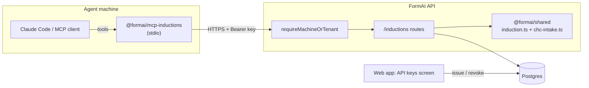
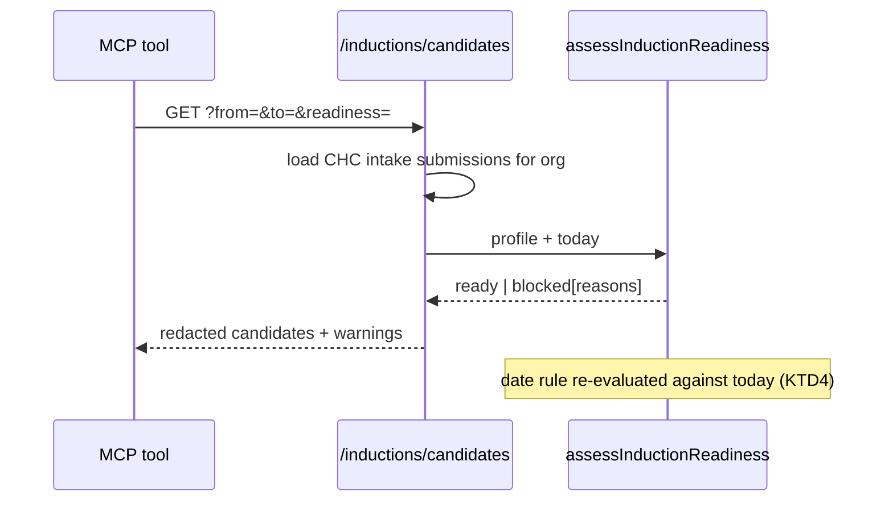

# Induction MCP Server - Plan

## Goal Capsule

- **Objective:** Expose the CHC induction intake data held in FormAI as an MCP server, so Claude Code — or any MCP-speaking agent — can ask which starters are ready to be inducted, on which Monday, how many seats to book, and can record the booking outcome back against the intake records.
- **Product authority:** Ash Wyborn (owner of the CHC @ BBM new-starter mobilisation workflow).
- **Open blockers:** None blocking implementation. Two decisions are recorded as assumptions below (machine credential scope, PII redaction default) rather than deferred questions.

---

## Product Contract

### Summary

An agent running the CHC mobilisation workflow currently has no programmatic view of the intake data. The intake form (`CHC BBM Induction Intake Request Form`) already collects everything a booking needs — name, mobile, email, preferred induction date, Beakon status, licence and photo — but it lives behind a browser session, so the agent re-reads it out of screenshots and email.

This work adds a machine door: an org-scoped API key, a small set of induction-shaped HTTP endpoints, and an MCP server that wraps them as tools. The agent asks `list_induction_candidates`, gets back per-starter readiness with the reason anything is blocked, asks `plan_induction_cohort` for a given Monday and gets the seat count plus the exact roster BISTrainer's registration form needs, then calls `record_induction_booking` once the browser work is done so the same starter is never booked twice.

The MCP does **not** drive BISTrainer. Browser automation stays where it is (the `04-induction-booking` skill under Claude in Chrome). This is the data and assessment half of that skill: it answers *who, when, how many*, and remembers *what was booked*.

### Problem Frame

The mobilisation workflow is five skills long, and skill 04 (induction booking) opens with a pre-flight check it cannot actually perform: "confirm all profiles are created, confirm the induction date, confirm seats required, confirm each starter's first name, last name, mobile, email." Every one of those facts is already a submitted answer in FormAI. Today the agent reconstructs them by hand, which produces three recurring failures:

1. **Bookings made against data that was never checked.** The induction-date rule (Mondays only, not a public holiday, at least four clear business days' notice) is enforced by the intake screen at fill time, but nothing re-checks it at booking time — and a request raised on Friday for the following Monday passes the form and fails the site.
2. **Incomplete starters reaching the booking step.** A starter who answered "not in Beakon" but never uploaded a licence image cannot be registered in BISTrainer, and that is only discovered at the typeahead in step 6, after the seats are already in the cart.
3. **No record of what was booked.** The booking exists in BISTrainer and in a chat transcript. Re-running the skill, or running it from a second session, cannot tell that a cohort is already booked.

The intake data is authoritative and structured. The gap is purely that nothing but a browser can read it.

### Requirements

- **R1** — An agent can list induction candidates for an org, filtered by induction date range and by readiness, without a browser session.
- **R2** — Each candidate carries a machine-readable readiness verdict: `ready`, or `blocked` with an enumerated list of reasons (missing contact detail, missing identity document, induction date invalid, date now inside the notice window).
- **R3** — The induction-date rule applied at assessment time is the same rule the intake form applies — one implementation, evaluated against *today*, not against the date the form was filled.
- **R4** — An agent can request the next N bookable induction dates, and is told when the public-holiday list no longer covers the dates being returned.
- **R5** — An agent can request a cohort for a given induction date and receive the seat count plus the per-starter roster fields BISTrainer registration needs (first name, last name, mobile, email).
- **R6** — An agent can record a completed booking (date, seat count, starters, external reference) and later read it back, so a booked cohort is identifiable as booked.
- **R7** — Machine access is authenticated by an org-scoped API key that can be issued and revoked from the app, is stored hashed, is shown once, and is auditable.
- **R8** — Machine access reaches induction endpoints only. An API key cannot be replayed against team management, billing, form editing, or submission mutation.
- **R9** — Candidate payloads returned to an agent exclude the sensitive personal fields a booking does not need (date of birth, home address, licence number, emergency contact) unless the caller explicitly asks for them and the key's role permits it.
- **R10** — The MCP server installs as a Claude Code MCP server with documented configuration, and runs against a deployed FormAI instance using only an API base URL and an API key.

### Actors

- **A1 — Mobilisation agent.** Claude Code (or another MCP client) running the CHC new-starter workflow. Consumes tools, never touches the database.
- **A2 — Org administrator.** Issues and revokes API keys in the app; the human accountable for what the agent can see.
- **A3 — FormAI API.** Owns tenancy, permissions, and audit. The MCP server is a client of it, never a second source of truth.

### Scope Boundaries

**In scope**
- A pure induction-assessment module in `@formai/shared`, reusing the existing CHC date rules.
- Org-scoped API keys (schema, issue/revoke endpoints, a settings surface to create one).
- Induction read endpoints and a booking-record endpoint on the existing API.
- A new workspace package containing the MCP server and its tools.
- Installation documentation and CI coverage for the new package.

**Deferred to follow-up work**
- Driving BISTrainer from the MCP (registration remains browser-automated in skill 04).
- Syncing booking outcomes into Beakon or BISTrainer.
- A per-key permission matrix finer than the role attached at issue time.
- Notifying starters directly from FormAI when their induction is booked.

**Outside this work**
- Generalising the induction concept beyond the CHC intake template. The assessment reads a CHC-shaped submission; other templates are not induction sources.
- Replacing the intake form's own client-side validation.

---

## Key Technical Decisions

- **KTD1 — The MCP server is an HTTP client of the API, not a second database client.** Importing `@formai/db` into the MCP would put a `DATABASE_URL` on the agent's machine and bypass every permission and audit path the API enforces. Going through HTTP means tenancy, role checks, redaction, and audit have exactly one implementation. It also means the agent can run anywhere the deployed API is reachable, which is how a Replit-hosted instance is actually used.

- **KTD2 — API keys authenticate the induction routers only, not the whole app.** The obvious move — teach `requireTenant` to accept a bearer token — would silently make every existing endpoint machine-callable, including team management and submission deletion. Instead a separate `requireMachineOrTenant` middleware is mounted on `/inductions` alone. Existing routes are untouched, so R8 holds by construction rather than by a permission check somebody has to remember to write. Widening later is a deliberate act.

- **KTD3 — The induction rules live in `@formai/shared`, beside the intake rules they extend.** `packages/shared/src/chc-intake.ts` already owns `validateInductionDate`, `nextBookableInductionDate`, `businessDaysUntil`, and the holiday list, and its module docstring is explicit that two surfaces must agree exactly. A third consumer joins the same module family rather than re-deriving the rule in an API route — the failure mode of a divergent copy is a booking made with too little notice, which is precisely the bug the file was written to prevent.

- **KTD4 — Readiness is evaluated against today, not against the submission.** The stored answer passed validation when it was filled. Four business days later it may not. Assessment therefore re-runs `validateInductionDate(iso, new Date())` at request time and reports `date_notice_lapsed` distinctly from `date_invalid`, because the two need different human responses (rebook vs. correct the form).

- **KTD5 — Redaction is opt-out, not opt-in.** The default candidate payload carries the booking-necessary fields only. Date of birth, street address, licence number, and emergency contact are omitted unless the caller passes an explicit flag and the key's role grants `submissions.export`. The payload is going into an LLM context window that may be logged; the booking workflow demonstrably does not need those fields (skill 04 uses name, mobile, email), so the safe default costs nothing operationally.

- **KTD6 — Identity documents are referenced, never returned.** A candidate's photo and licence answers are `SubmissionFileRef` values. The assessment reports presence, filename, and content type. It never returns bytes or a URL an unauthenticated party could fetch, preserving the authenticated-serving rule the `upload-` key namespace already enforces.

- **KTD7 — Bookings are their own records, not a submission status.** Reusing `submissions.status` or `flag` would conflate "this intake was approved" with "this cohort was booked", and neither can express seats, an external reference, or a many-starters-to-one-booking shape. A small `induction_bookings` + `induction_booking_starters` pair carries it, and makes "is this starter already booked?" a join rather than a string convention.

- **KTD8 — The MCP package pins its own dependency set.** `@modelcontextprotocol/server@2` requires Zod v4; the API and shared packages are on Zod v3. pnpm isolates per-package dependencies, so the new package takes Zod v4 without forcing a monorepo-wide upgrade. It must not import `@formai/shared`'s Zod-typed values for schema construction — types only, so the two Zod majors never meet.

- **KTD9 — Tool surface is domain-shaped, not CRUD-shaped.** `plan_induction_cohort` returns seats plus roster in one call because that is the question skill 04 asks at steps 3–6. A generic `list_submissions` tool would push the grouping, the seat arithmetic, and the date rule back into the agent's reasoning, which is exactly where it is unreliable today.

---

## High-Level Technical Design



Assessment path for one candidate, which is where the rules actually land:



Readiness verdict shape (directional guidance, not implementation specification):

```
ready            → nothing blocks registration
blocked[
  contact_missing        (mobile or email absent)
  identity_missing       (not in Beakon, photo or licence absent)
  date_invalid           (not a Monday / public holiday / unparseable)
  date_notice_lapsed     (was valid when filled, now inside notice window)
  already_booked         (a booking record already covers this starter)
]
warnings[
  holiday_list_expired   (date is beyond holidaysCoverThrough())
]
```

---

## Output Structure

```
packages/mcp-inductions/
  package.json            # @formai/mcp-inductions, bin entry, zod v4
  tsconfig.json
  tsconfig.build.json
  README.md               # install + configure for Claude Code
  src/
    index.ts              # stdio server bootstrap
    client.ts             # typed fetch wrapper over the FormAI API
    config.ts             # FORMAI_API_URL / FORMAI_API_KEY resolution
    tools/
      candidates.ts
      cohorts.ts
      dates.ts
      bookings.ts
    tools.test.ts
    client.test.ts
```

The per-unit **Files** lists remain authoritative; this tree is the shape a reviewer should expect.

---

## Implementation Units

### U1. Induction assessment domain module

**Goal:** One pure module that turns a CHC intake submission into a normalised starter profile and a readiness verdict, and groups profiles into cohorts.

**Requirements:** R2, R3, R4, R5 (data shape), R9 (redaction split defined here).

**Dependencies:** None.

**Files:**
- `packages/shared/src/induction.ts` (new)
- `packages/shared/src/induction.test.ts` (new)
- `packages/shared/src/index.ts` (export)

**Approach:** Read answers by the stable ids in `CHC_FIELD_IDS` rather than by label. Expose `readStarterProfile(fields, values)` returning a profile with the booking fields promoted (first/last name, mobile, email, induction date, department, roles, starter type, `inBeakon`, and presence booleans plus filename/contentType for photo and licence), and a separate `sensitive` sub-object for DOB, address, licence number, and emergency contact so callers choose one or the other (KTD5). Expose `assessInductionReadiness(profile, { today, alreadyBooked })` returning `{ readiness, blockers, warnings }` using the codes in the design sketch, delegating every date question to `chc-intake.ts` (KTD3, KTD4). Expose `buildInductionCohorts(assessed)` grouping by ISO date, returning date, seat count of ready starters, and the roster.

A submission that is not a CHC intake form must be rejected by shape, not assumed: if the required field ids are absent, `readStarterProfile` returns null and the caller skips the row.

**Patterns to follow:** `packages/shared/src/chc-intake.ts` for module docstring style and local-midnight date handling; `packages/shared/src/visibility.ts` for reading answers out of `Record<string, SubmissionValue>`; `packages/shared/src/submission-validation.ts` for verdict-shaped return types.

**Execution note:** Implement test-first. The date-boundary cases are the whole point of the module and are cheap to state before they are cheap to satisfy.

**Test scenarios:**
- A complete "in Beakon" starter with a valid future Monday returns `ready` with no blockers.
- A starter with `in_beakon = false` and both uploads present returns `ready`; the same starter missing the licence file returns `blocked` with `identity_missing`.
- A starter with `in_beakon = true` is **not** blocked for missing photo/licence (those fields are hidden by the form's own visibility rule).
- Missing mobile returns `contact_missing`; missing email returns `contact_missing`; both missing yields one blocker, not two duplicates.
- A Wednesday induction date returns `date_invalid`; a public-holiday Monday returns `date_invalid`.
- A valid Monday now only two business days away returns `date_notice_lapsed`, not `date_invalid` (fixed `today` via the injected clock).
- A date past `holidaysCoverThrough()` returns the `holiday_list_expired` warning while remaining `ready`.
- `alreadyBooked = true` returns `already_booked` and suppresses `ready`.
- A submission whose values do not carry the CHC field ids yields `null` from `readStarterProfile`.
- `buildInductionCohorts` groups three starters across two dates into two cohorts, counting only ready starters as seats while still listing blocked starters in the cohort's roster with their blockers.
- Cohorts are returned in ascending date order.
- `readStarterProfile` never places DOB, address, licence number, or emergency contact on the top-level profile.

**Verification:** `pnpm --filter @formai/shared test` passes with the new suite; no other package changes behaviour.

---

### U2. Org-scoped API keys — schema, issue, revoke, authenticate

**Goal:** A machine credential an administrator can create and revoke, and a middleware that resolves it to a tenant context for machine-facing routers only.

**Requirements:** R7, R8.

**Dependencies:** None (parallel with U1).

**Files:**
- `packages/db/src/schema/governance.ts` (add `apiKeys` table + relations)
- `packages/db/drizzle/<next>_*.sql`, `packages/db/drizzle/meta/*` (generated)
- `apps/api/src/auth/api-key.ts` (new — mint, hash, verify)
- `apps/api/src/auth/api-key.test.ts` (new)
- `apps/api/src/middleware/machine.ts` (new — `requireMachineOrTenant`)
- `apps/api/src/routes/api-keys.ts` (new — list, create, revoke)
- `apps/api/src/routes/api-keys.test.ts` (new)
- `apps/api/src/app.ts` (mount `/api-keys`)

**Approach:** Table carries `id`, `orgId`, `name`, `role` (reusing `roleEnum`), `prefix` (the displayable leading segment, uniquely indexed so verification is one indexed read), `hash`, `createdByUserId`, `createdAt`, `lastUsedAt`, `revokedAt`. The plaintext key is `fai_<prefix>_<secret>`; only the SHA-256 of the whole key is stored, and the plaintext is returned exactly once in the create response. Lookup is by `prefix` then constant-time hash comparison.

`requireMachineOrTenant` accepts either the existing sealed session cookie (so the web app can call the same endpoints) or `Authorization: Bearer fai_…`. On a key it builds the same `TenantContext` shape the session path produces, with the key's role, and updates `lastUsedAt` on a best-effort basis that never blocks the response. A revoked or unknown key is `401 unauthenticated` — never a distinguishing error, so an attacker cannot enumerate prefixes.

**Machine calls act as the issuing user.** `TenantContext.userId` is required and non-nullable, and `recordAudit` resolves it against `users` to stamp `actorId`/`actorName` — so a machine context cannot simply omit it. The key's `createdByUserId` fills that slot, which makes an agent's action attributable to the administrator who authorised it rather than to an anonymous "System" actor. The middleware additionally attaches the key id to the request (`req.apiKeyId`) so routes that record a booking or an audit row can name the key alongside the user; audit actions taken through a key are worded to say so (e.g. "Recorded induction booking via API key <prefix>").

Issue and revoke require `team.manage`; the requested role may not exceed the issuer's own (an admin cannot mint an owner key). Both actions record audit rows under the `security` category.

**Patterns to follow:** `apps/api/src/middleware/tenant.ts` for the middleware contract and the 401 shape; `apps/api/src/auth/replit-auth.ts` for crypto helpers; `apps/api/src/routes/invites.ts` for a token-bearing resource with create/revoke plus audit; `apps/api/src/lib/permissions.ts` for the permission gate.

**Execution note:** Write the middleware's rejection tests before the happy path — every one of them is a security boundary.

**Test scenarios:**
- Creating a key returns the plaintext once and a row whose stored value is not the plaintext.
- Listing keys never returns the plaintext or the hash; it returns prefix, name, role, created/lastUsed/revoked timestamps.
- A valid key resolves `req.tenant` with the key's org and role.
- A revoked key is rejected `401`.
- An unknown prefix and a valid prefix with a wrong secret both return the same `401` body.
- A key from org A cannot read org B's induction data (mounted-route integration check).
- A viewer-role session cannot create a key (`403`), and creating one writes nothing.
- An admin requesting an `owner` key is rejected `403`.
- Revoking someone else's key in the same org succeeds for `team.manage`; revoking a key in another org returns `404`.
- Create and revoke each write an audit row in the `security` category.
- Session-cookie callers still pass `requireMachineOrTenant` unchanged.
- `lastUsedAt` advances after a successful machine call.
- A machine call resolves `tenant.userId` to the key's `createdByUserId`, so an audit row written on that request names the issuing administrator rather than falling back to `System`.
- A key whose issuing user has since been deleted is rejected `401` rather than producing an unattributable context.

**Verification:** `pnpm --filter @formai/api test` passes; `pnpm --filter @formai/db generate` produces no further diff; migration journal ordering check passes.

---

### U3. API keys settings surface

**Goal:** An administrator can create, copy once, and revoke a key without a shell.

**Requirements:** R7 (usability half).

**Dependencies:** U2.

**Files:**
- `apps/web/src/screens/enterprise/ApiKeysScreen.tsx` (new)
- `apps/web/src/screens/enterprise/ApiKeysScreen.test.tsx` (new)
- `apps/web/src/lib/data/types.ts`, `apps/web/src/lib/data/store.ts`, `apps/web/src/lib/data/hooks.ts` (DTO, fetchers, query hooks)
- `apps/web/src/lib/screens.ts` (register the screen)

**Approach:** A list of existing keys with name, role, prefix, created and last-used, plus a create form (name + role) and a revoke action with confirmation. The plaintext is shown in a one-time panel that states plainly it will not be shown again, with a copy control. Revoked keys stay listed, visibly struck, because an audit conversation needs to see a key that existed.

**Patterns to follow:** `apps/web/src/screens/enterprise/TeamScreen.tsx` for list + invite + revoke shape and permission-aware controls; `apps/web/src/lib/data/hooks.ts` for query-key invalidation on mutation.

**Test scenarios:**
- Renders existing keys with prefix and role; never renders a full key for an existing row.
- Creating a key shows the one-time plaintext panel; dismissing it removes the plaintext from the DOM.
- Revoke asks for confirmation and only calls the mutation on confirm.
- A `403` from create surfaces an error message and leaves the list unchanged.
- A user without `team.manage` sees the list read-only with no create control.

**Verification:** `pnpm --filter @formai/web test` passes; the screen is reachable from the enterprise navigation.

---

### U4. Induction read endpoints

**Goal:** HTTP surface for candidates, cohorts, and bookable dates, with redaction applied server-side.

**Requirements:** R1, R2, R3, R4, R5, R9.

**Dependencies:** U1, U2.

**Files:**
- `apps/api/src/routes/inductions.ts` (new)
- `apps/api/src/routes/inductions.test.ts` (new)
- `apps/api/src/app.ts` (mount `/inductions`)

**Approach:** Three GETs under `requireMachineOrTenant`:
- `GET /inductions/candidates?from=&to=&readiness=` — loads the org's submissions for CHC intake templates, pins each row's own version fields, runs `readStarterProfile` + `assessInductionReadiness`, filters, and returns redacted candidates plus any cohort-level warnings. Rows that are not CHC-shaped are skipped, not errored.
- `GET /inductions/candidates/:submissionId?includeSensitive=true` — one candidate; the sensitive block is attached only when the flag is set **and** the caller holds `submissions.export` (KTD5). Denied requests return the redacted body with an explicit `sensitiveOmitted` reason rather than a 403, so an agent gets a usable answer and a clear explanation.
- `GET /inductions/dates?count=` — next bookable Mondays via `nextBookableInductionDate`, each flagged when it falls past `holidaysCoverThrough()`.

Cohorts ride on the same router: `GET /inductions/cohorts?date=` returns the seat count and roster for one date, or all upcoming cohorts when `date` is omitted. Every query filters by `tenant.orgId` first, in line with the rest of the API.

**Patterns to follow:** `apps/api/src/routes/submissions.ts` for the org-filtered list-then-hydrate shape and DTO functions; `apps/api/src/routes/assessments.ts` for a multi-resource router; `apps/api/src/lib/with-error-handling.ts` and the `zod` query parsing used across routes.

**Test scenarios:**
- Returns only the calling org's candidates when two orgs hold intake submissions.
- `from`/`to` filter by induction date, inclusive at both ends.
- `readiness=blocked` returns only blocked candidates, each with its blocker codes.
- A candidate response contains no DOB, address, licence number, or emergency contact by default.
- `includeSensitive=true` with `submissions.export` returns the sensitive block; without it returns the redacted body plus `sensitiveOmitted`.
- File answers are reported as presence + filename + contentType, never as a URL or bytes.
- `GET /inductions/dates?count=3` returns three ascending Mondays, none a public holiday, each at least four clear business days out.
- A requested date past the holiday list carries the `holiday_list_expired` warning.
- `GET /inductions/cohorts?date=` returns seats equal to the ready-starter count, with blocked starters listed but not counted.
- An unknown submission id returns `404`; a submission in another org also returns `404` (not `403`).
- No credential at all returns `401`.
- A malformed `from` date returns `400 invalid_request`.

**Verification:** `pnpm --filter @formai/api test` passes; endpoints answer identically for a session cookie and an API key.

---

### U5. Booking records

**Goal:** Record a completed booking, read bookings back, and let readiness know a starter is already booked.

**Requirements:** R6, R2 (`already_booked` blocker).

**Dependencies:** U1, U2, U4.

**Files:**
- `packages/db/src/schema/governance.ts` (add `inductionBookings`, `inductionBookingStarters`)
- `packages/db/drizzle/<next>_*.sql`, `packages/db/drizzle/meta/*` (generated)
- `apps/api/src/routes/inductions.ts` (add POST + GET bookings; wire `alreadyBooked`)
- `apps/api/src/routes/inductions.test.ts` (extend)

**Approach:** `induction_bookings` carries org, induction date, seat count, an optional external reference (the BISTrainer transaction), `bookedByUserId` (the acting user — for machine calls, the key's issuer per U2), a nullable `bookedByApiKeyId` so a booking made by an agent is distinguishable from one made in the app, a free-text note, and `createdAt`. `induction_booking_starters` links a booking to the submissions it covers, with the starter's name captured at booking time so a later edit to the form cannot rewrite history.

`POST /inductions/bookings` validates that every referenced submission belongs to the org, is CHC-shaped, and shares the booking's induction date; it rejects a starter already covered by a live booking (`409 already_booked`) so a retried tool call cannot double-book. Booking creation writes an audit row. Once bookings exist, the candidate assessment passes `alreadyBooked` into U1, which is what makes a booked cohort visibly distinct on the next `list_induction_candidates`.

**Patterns to follow:** `packages/db/src/schema/assessments.ts` for a parent record with per-member child rows; `apps/api/src/routes/submissions.ts` for the audit call shape.

**Test scenarios:**
- Creating a booking for two starters returns the booking with both starters and a seat count of two.
- A referenced submission from another org returns `404` and writes nothing.
- A starter whose induction date differs from the booking's date returns `400`.
- Booking a starter already covered by a live booking returns `409 already_booked`.
- After booking, the same candidate appears with the `already_booked` blocker and is excluded from the cohort's seat count.
- `GET /inductions/bookings?date=` returns bookings for that date; omitting `date` returns recent bookings, newest first.
- Booking creation writes an audit row.
- A booking made with an API key records `bookedByApiKeyId`; one made with a session cookie leaves it null, and both record the acting user.
- Starter names are stored on the booking row and survive a later change to the submission values.

**Verification:** `pnpm --filter @formai/api test` passes; `pnpm --filter @formai/db generate` shows no drift; journal ordering check passes.

---

### U6. MCP server package

**Goal:** A stdio MCP server exposing the induction workflow as tools, driven entirely by an API base URL and an API key.

**Requirements:** R1–R6 (as tools), R10.

**Dependencies:** U4, U5.

**Files:**
- `packages/mcp-inductions/package.json`, `tsconfig.json`, `tsconfig.build.json` (new)
- `packages/mcp-inductions/src/index.ts`, `src/config.ts`, `src/client.ts` (new)
- `packages/mcp-inductions/src/tools/candidates.ts`, `cohorts.ts`, `dates.ts`, `bookings.ts` (new)
- `packages/mcp-inductions/src/client.test.ts`, `src/tools.test.ts` (new)
- `pnpm-workspace.yaml` (already globs `packages/*` — no edit expected; confirm)

**Approach:** `@modelcontextprotocol/server@^2` with `StdioServerTransport`, Zod v4 input schemas (KTD8 — types may be imported from `@formai/shared`, runtime Zod values may not). Six tools, each a thin call into `client.ts`:

| Tool | Maps to |
| --- | --- |
| `list_induction_candidates` | `GET /inductions/candidates` |
| `get_induction_candidate` | `GET /inductions/candidates/:id` |
| `next_induction_dates` | `GET /inductions/dates` |
| `plan_induction_cohort` | `GET /inductions/cohorts` |
| `record_induction_booking` | `POST /inductions/bookings` |
| `list_induction_bookings` | `GET /inductions/bookings` |

Tool descriptions carry the operational contract the agent needs: that seats equal ready starters, that blocked starters must be resolved in the form rather than worked around, and that `record_induction_booking` runs *after* BISTrainer registration succeeds. `config.ts` fails fast with a readable message when `FORMAI_API_URL` or `FORMAI_API_KEY` is absent — a silent 401 loop inside an agent is the worst failure mode here. API errors are returned as tool errors carrying the API's `error` code, never as empty results, so the agent does not read a failure as "no starters".

**Execution note:** This unit is mostly wiring; prove it with a stubbed `fetch` plus one manual stdio smoke run against a locally running API. Do not stand up a live-network test in CI.

**Test scenarios:**
- `config` throws a named error when `FORMAI_API_URL` is missing, and another when `FORMAI_API_KEY` is missing.
- The client sends `Authorization: Bearer <key>` and the JSON accept header on every request.
- A `401` from the API surfaces as a tool error mentioning the credential, not as an empty candidate list.
- A `409 already_booked` from `record_induction_booking` surfaces the code verbatim so the agent can distinguish it from a transport failure.
- `list_induction_candidates` passes `from`, `to`, and `readiness` through as query parameters and omits unset ones.
- `plan_induction_cohort` returns seats and roster unchanged from the API response (no client-side arithmetic — KTD9 keeps the count server-side).
- Input schema rejects a non-ISO `date` before any request is made.
- A base URL with a trailing slash and one without produce the same request URL.

**Verification:** `pnpm --filter @formai/mcp-inductions test` passes; `pnpm -r build` and `pnpm -r typecheck` stay green; the built server starts under plain `node` and responds to an MCP `tools/list`.

---

### U7. Distribution, documentation, and CI

**Goal:** The server is installable as a Claude Code MCP server, documented, and defended by CI.

**Requirements:** R10.

**Dependencies:** U6.

**Files:**
- `packages/mcp-inductions/README.md` (new)
- `docs/induction-mcp.md` (new — operator-facing setup, key issue → configure → verify)
- `.env.example` (add `FORMAI_API_URL`, `FORMAI_API_KEY` documentation entries)
- `.github/workflows/ci.yml` (add the new package's test step)
- `replit.md` (note the new package and that the MCP runs on the operator's machine, not the deployment)

**Approach:** Document the two supported configurations — a project-scoped `.mcp.json` entry and a `claude mcp add` invocation — with the command form and the two environment variables. Include the end-to-end path an operator actually walks: issue a key in the app, configure the server, run a `next_induction_dates` call, confirm dates come back. Add a CI step mirroring the existing api/web test steps; without it the new suite never runs on a PR. Note the Windows caveat that the existing `rm -rf` build script convention does not run on Windows shells, and give the new package a portable build script.

**Test scenarios:** `Test expectation: none -- documentation, environment samples, and CI configuration carry no runtime behaviour. Verified by the CI run itself.`

**Verification:** CI runs the new package's tests on the PR; a fresh clone can follow `docs/induction-mcp.md` and reach a working `tools/list`.

---

## Verification Contract

Gates that must pass before this work is considered landed:

1. `pnpm -r typecheck` clean across all packages including the new one.
2. `pnpm -r build` clean; the compiled API still boots under plain `node` and answers `/health` (the existing CI smoke step).
3. `pnpm --filter @formai/shared test`, `--filter @formai/api test`, `--filter @formai/web test`, `--filter @formai/mcp-inductions test` all pass.
4. `pnpm --filter @formai/db generate` produces no diff, and `node scripts/check-migration-order.mjs` passes.
5. A key issued in the app authenticates `GET /inductions/dates` and is rejected by `GET /team` and `POST /submissions` (R8, verified by hand once and by test in U2).
6. Default candidate payloads contain no DOB, address, licence number, or emergency contact (R9).

## Definition of Done

- An operator can issue an API key from the app, configure the MCP server with a base URL and that key, and have Claude Code list induction candidates.
- Every candidate returned carries a readiness verdict whose date component was evaluated against today.
- A cohort request returns the seat count and the roster fields BISTrainer registration needs.
- A recorded booking makes its starters visibly booked on the next candidate listing, and a repeat booking attempt is refused.
- API keys reach induction endpoints only, are stored hashed, are revocable, and their issue and revocation appear in the audit log.
- CI runs the new package's tests and all existing gates stay green.

## Risks & Dependencies

- **The public-holiday list expires after 2026-12-28.** Past that date the notice rule silently relaxes. This work does not fix that, but it does surface it: `holiday_list_expired` reaches the agent as a warning instead of staying invisible. Extending the list remains a separate, recurring chore.
- **A leaked API key is org-wide read access to intake data.** Mitigated by hashing at rest, one-time display, revocation, `lastUsedAt` for detection, the narrow router mount (KTD2), and default redaction (KTD5). Not mitigated: rate limiting, which is a follow-up.
- **Zod v3/v4 coexistence.** Contained by keeping runtime Zod out of the shared boundary (KTD8). If a future change makes `@formai/shared` export Zod schemas rather than types, this constraint has to be revisited.
- **Two Postgres migrations land in this work** (U2, U5). The repo has hit journal-ordering bugs three times; both must be generated in sequence and the ordering check must pass before merge.
- **This repository checkout is shared with a concurrent session.** Implementation should happen in a dedicated worktree with explicit-path staging, per the standing workflow.
- **MCP SDK v2 is recent** (`@modelcontextprotocol/server@2.0.0`, tracking the 2026-07-28 spec). Pin the exact minor and re-read the README at implementation time rather than assuming the v1 `@modelcontextprotocol/sdk` API shape.

## Open Questions

- **Deferred to implementation:** whether `/inductions/candidates` should page. The current volume (a handful of starters per Monday) does not need it; if the org's intake history grows past a few hundred rows, add a cursor rather than a page number so the tool contract stays stable.
- **Deferred to implementation:** the exact CHC-template detection rule. Matching on the seeded template name is brittle; matching on the presence of the `CHC_FIELD_IDS` set is more robust and is the current intent, but the final predicate should be settled against real data in the database.

## Assumptions

- The org running this has the CHC intake template seeded and receives intake submissions through it; other templates are not induction sources (stated in Scope Boundaries, restated here because the whole assessment path depends on it).
- The agent consuming these tools runs on an operator's machine with network access to the deployed API. The MCP server is not deployed alongside the API.
- One booking covers one induction date, matching how skill 04 books BISTrainer (one transaction, N seats).

## Sources & Research

- `packages/shared/src/chc-intake.ts` — induction date rule, holiday list, field ids, department/role map.
- `apps/api/src/routes/submissions.ts`, `apps/api/src/middleware/tenant.ts` — org-filtered query shape and the auth contract the machine door must mirror.
- `packages/shared/src/roles.ts` — role and permission matrix an API key's role is drawn from.
- `.github/workflows/ci.yml` — the gates this work must keep green, and the reason U7 adds a test step.
- CHC mobilisation skill `04-induction-booking` (v1.3.4) — the operational steps the tool surface is shaped around: seat check, cart quantity, per-starter typeahead registration, confirmation report.
- `@modelcontextprotocol/server@2.0.0` (npm) — package name, version, and its `zod@^4.2.0` dependency, which drives KTD8.
