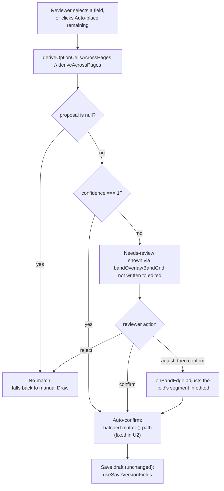

# Placement Screen Auto-Detect and Glyph Alignment - Plan

## Goal Capsule

- **Objective:** Bring the import review screen's confidence-tiered auto-detection and WYSIWYG glyph-alignment tools into the Placement screen, so most of a form's fields place themselves and every mark shows its true glyph, easy to fine-align, instead of requiring a hand-drawn box per field.
- **Product authority:** Ash Wyborn (Owner, Charles Hull Contracting) — scope and behavior confirmed via dialogue.
- **Open blockers:** None. The confidence-threshold calibration question raised during brainstorming is resolved by KTD1 below.

---

## Product Contract

### Summary

The Placement screen (`GeometryEditorScreen`) gains the same detection and glyph-alignment engine already proven on the import review screen. Selecting a field proposes its placement automatically instead of requiring a hand-drawn box; confident proposals auto-confirm, uncertain ones wait for review, and a bulk action runs this across a whole form at once. Every mark — auto-detected or hand-drawn — renders as its real glyph at its exact export position and can be dragged, snapped, and keyboard-nudged.

### Problem Frame

The Placement screen exists to fix or finish field geometry on an already-imported form's version without re-triggering an import (which would reassign field IDs and break anything keyed to them). Today it is entirely manual: a reviewer picks a field from a sidebar list, clicks "Draw," and drags a box by hand — repeated once per field. A 151-field form needs up to 151 manual draws, and this is common: it happens on most or all new forms, not just a handful of legacy backlog forms.

Separately, the import review screen already solved both halves of this problem: a detection engine that proposes checkbox and table placements from the PDF's text layer, and a live glyph preview (`markPlacement`) that shows the reviewer the exact mark the exporter will draw, with drag/snap/keyboard-nudge alignment. The Placement screen reuses the same `PdfViewer` component and already calls the same detection functions per selected field, but never wires the glyph-preview/band-grid layer, and only proposes one field at a time rather than across a whole form.

### Key Decisions

- **Confidence-tiered, not all-or-nothing.** Auto-detection is not "trust everything" or "review everything" — confident matches auto-confirm immediately, uncertain matches still get a human check, and detection never touches fields already placed. This keeps the speed win without asking the reviewer to blindly trust every proposal.
- **Reviewer controls when detection runs.** Detection fires either per field (selecting a field proposes it, extending the screen's existing select-to-propose behavior) or in bulk (a new "Auto-place remaining fields" action across the whole form). It never runs silently on page load — a multi-page form's detection pass is visible and reviewer-initiated.
- **Reuse the existing engine, not a new one.** Both the detection logic (`deriveOptionCellsAcrossPages`, `deriveAcrossPages`) and the glyph-alignment machinery (`markPlacement`, band-grid dragging/snapping/keyboard-nudge) already exist and are proven on the import review screen. This is wiring an existing capability into a second screen, not building new detection or new rendering.

### Requirements

**Detection & confidence tiers**

- R1. Selecting a not-yet-placed field in the Placement screen runs the existing detection engine for that field automatically (`deriveOptionCellsAcrossPages` for checkbox/option fields, `deriveAcrossPages` for table/repeating-group fields), replacing manual "Draw" as the first step.
- R2. A field's detected proposal classifies into one of three tiers by the engine's existing confidence signal: auto-confirmed (saved immediately, same as a hand-drawn placement the reviewer confirmed), needs review (shown but unsaved until the reviewer acts), or no match (falls back to today's manual "Draw," nothing shown).
- R3. A bulk "Auto-place remaining fields" action runs R1/R2 detection across every not-yet-placed field in the form in one pass.
- R4. Detection only ever evaluates fields with no placement yet — a field already placed, manually or previously auto-confirmed, is never re-evaluated or re-flagged.

**Review & confirmation**

- R5. The needs-review tier supports both a single "Confirm all proposed" bulk action and a per-field step-through (open a field, inspect, adjust, confirm, or reject) — the reviewer picks whichever fits.
- R6. Rejecting a needs-review proposal falls back to the existing manual placement tools for that field; adjusting it uses the alignment tools (R8) to refine the proposal in place before confirming.

**Visual alignment**

- R7. Every mark on the Placement screen — auto-confirmed, needs-review, or hand-drawn — renders as the real glyph shape at its exact export position and size (the shared `markPlacement` placement already used by the import review screen and the PDF exporter), not an abstract highlighted box.
- R8. The Placement screen's grid editor supports the same band-edge dragging, snapping, and keyboard-arrow nudging already available on the import review screen, so a reviewer can fine-align any mark without leaving the screen.

### Actors

- A1. Reviewer — the form admin who opens a draft in the Placement screen to finish or fix field placement.
- A2. Detection engine — the existing derivation logic that proposes placements and reports a raw confidence score per field (the tiering itself is new logic this plan adds, see KTD1).

### Key Flows

- F1. Auto-place remaining fields (bulk)
  - **Trigger:** Reviewer clicks "Auto-place remaining fields."
  - **Actors:** A1, A2
  - **Steps:** Detection runs across every not-yet-placed field → confident matches save immediately → uncertain matches populate the review queue → no-match fields remain for manual draw.
  - **Outcome:** Sidebar counts update to reflect auto-confirmed / needs-review / still-manual fields.
  - **Covers:** R1, R2, R3, R4

- F2. Select-to-propose (per field)
  - **Trigger:** Reviewer selects a single not-yet-placed field in the sidebar.
  - **Actors:** A1, A2
  - **Steps:** Detection proposes that field's placement → the same tiering as F1 decides whether it auto-confirms or waits for review.
  - **Outcome:** Same three-tier outcome as F1, scoped to one field.
  - **Covers:** R1, R2

- F3. Clearing the review queue
  - **Trigger:** Reviewer works through needs-review fields, via bulk confirm or step-through.
  - **Actors:** A1
  - **Steps:** Confirm accepts the proposal as-is; adjust nudges/snaps the marks via the alignment tools before confirming; reject falls back to manual draw.
  - **Outcome:** Field ends up confirmed (as proposed or adjusted) or manually placed.
  - **Covers:** R5, R6, R7, R8

### Acceptance Examples

- AE1. **Covers R1, R2.** Given a not-yet-placed checkbox field with a clear, unambiguous label-to-glyph match, when the reviewer selects it, then it auto-confirms with no extra click and the sidebar shows it placed.
- AE2. **Covers R2.** Given a not-yet-placed field where detection finds a plausible but ambiguous match, when the reviewer selects it, then it appears in the needs-review tier, unsaved, with its proposed marks visible.
- AE3. **Covers R2.** Given a field detection cannot resolve at all, when the reviewer selects it, then it falls back to today's empty "Draw" state with no proposal shown.
- AE4. **Covers R3, R4.** Given a form with 112 of 151 fields already placed, when the reviewer clicks "Auto-place remaining fields," then only the 39 unplaced fields are evaluated and the 112 already-placed fields are left untouched.
- AE5. **Covers R7, R8.** Given any mark on screen — auto-confirmed, needs-review, or hand-drawn — when the reviewer inspects or nudges it, then it renders and behaves identically to a mark on the import review screen (real glyph, drag/snap/keyboard nudge).
- AE6. **Covers R5, R6.** Given 3 fields in the needs-review tier, when the reviewer clicks "Confirm all proposed," then all 3 apply and the review queue empties; when the reviewer instead opens one, adjusts it, and confirms individually, only that field is affected; when the reviewer rejects one instead, its proposal clears and the field returns to the manual Draw state.

### Scope Boundaries

- Fixing the Placement screen's discoverability/navigation ("hard to find") — a separate problem, not scoped here.
- Snapping to printed ruled grid lines instead of text-glyph edges — already a known deferred item from the original glyph-preview work; still deferred.
- Re-evaluating or flagging fields that are already placed.

### Dependencies / Assumptions

- Assumes the existing detection engine (`deriveOptionCellsAcrossPages`, `deriveAcrossPages`) and the confidence signal it already reports are adequate to build the three-tier split on — no new detection algorithm is proposed here.
- Assumes the shared `markPlacement` and band-grid/keyboard-nudge machinery already built for the import review screen generalizes to the Placement screen's data model without changes to the shared logic itself.

### Sources / Research

- `apps/web/src/screens/import/GeometryEditorScreen.tsx` — the Placement screen. Already calls `deriveOptionCellsAcrossPages`/`deriveAcrossPages` per selected field and shows a "Place all N" button, but never passes `bandOverlay`/`onBandEdge` to `PdfViewer`, so the band-grid, glyph preview, snapping, and keyboard nudge are unreachable from this screen today.
- `apps/web/src/screens/import/ImportReviewScreen.tsx` — the import review screen, which wires `bandOverlay` and passes it to `PdfViewer` — the pattern to mirror.
- `docs/plans/2026-07-23-003-feat-glyph-preview-placement-plan.md` — the already-implemented (commit `457bd47`) plan that built the shared `markPlacement` WYSIWYG glyph preview and keyboard nudge this brainstorm extends to a second screen.
- `packages/shared/src/geometry.ts` — `markPlacement`, the single source of truth for where a mark lands, shared by the exporter and the preview.
- Commit `a2c134d` — bounded subdivision (`subdivideBox`), detects a table's grid inside a drawn box.
- Commit `a45ad7f` — draw-jump, snaps a drawn box to the printed grid.
- Commit `95ce322` (#71) — introduced the Placement screen, forking a draft version specifically to preserve field IDs across re-placement, which is why Placement exists as a screen separate from import.

---

## Planning Contract

**Product Contract preservation:** changed — the "Outstanding Questions" item on confidence-threshold calibration is resolved by KTD1 below; R6 and A2 were reworded for internal consistency with F3/KTD1 (no behavior change from what the brainstorm dialogue actually established); AE6 was added to give R5/R6 an acceptance example. No other R/A/F/AE changed.

### Key Technical Decisions

- KTD1. **Tier on the confidence field the engine already returns, at the boundary the codebase already privileges.** `FieldProposal`/`TableProposal` (`apps/web/src/lib/pdf-geometry.ts`) already carry `confidence: number` (0–1), and `GeometryEditorScreen` already treats `confidence === 1` as clean versus `confidence < 1` as needing a caution note (today just text, not a gate). Reuse that exact boundary instead of inventing a new numeric cutoff: `confidence === 1` → auto-confirm, `0 < confidence < 1` → needs-review, a `null` proposal (the engine's existing refusal case, e.g. cross-page ambiguity) → no-match. This resolves the Product Contract's deferred calibration question with the only distinction the codebase already treats as meaningful; revisit the boundary after use on real forms rather than tuning it up front.
- KTD2. **Persist through the Placement screen's existing local-edit-then-save-draft model, not the import flow's proposal/confirmed maps.** `ImportReviewScreen` persists via module-level `geometryProposals`/`confirmedGeometry` maps (`apps/web/src/lib/data/import-session.ts`), folded into fields only at the final import POST. `GeometryEditorScreen` works differently: a local `edited: FormField[] | null` array mutated in place, explicitly persisted later by "Save draft" (`useSaveVersionFields`). Auto-confirm and any "confirm" action go through the same `mutate()`-based path "Place all N" already uses — nothing new talks to the API. Needs-review proposals are new, screen-local state, never written to `edited` until confirmed or rejected.
- KTD3. **Fix `mutate()`'s batching gap before building on it.** `GeometryEditorScreen.tsx:57-60` implements `mutate()` as `setEdited(fields.map(...))`, where `fields` is a plain value captured once per render (`GeometryEditorScreen.tsx:52`), not a functional `setState` updater. Calling it more than once synchronously in one handler — the multi-option case R2/R7 requires, and the multi-field bulk case R3 requires — has every call recompute from the same pre-click snapshot, so only the last call's result survives; this plan's own headline scenario (a 151-field bulk run) would silently keep only the last field touched. This likely already affects today's "Place all N" for any multi-option field, but this plan is what makes hitting it common, so fixing it is in scope (see U2).
- KTD4. **Extend `panelState()`, don't build a parallel classifier.** `geometry-actions.ts`'s `panelState()` already classifies a field into `unsupported` / `draw-only` / `no-proposal` / `needs-subdivision` / `proposed` for the import screen's inspector. The new auto-confirm/needs-review/no-match tier is a refinement of that same classification job — derive it alongside (or from) `panelState()`'s output rather than introducing a second, disconnected state machine.
- KTD5. **Band-edge adjustment needs a `FormField`-targeting counterpart, not a copy — and the source it's copied from isn't pure.** `adjustGeometryBand`/`adjustGeometryBoundary` actually live in `apps/web/src/lib/data/import-session.ts:704-781` (not `geometry-actions.ts`, which only references them by name in a comment) and drive `ImportReviewScreen`'s `onBandEdge`. Each is a single fused function: read `geometryProposals.get(fieldId)`, compute the moved band, grow the box to fit (`growToFit`), validate via `resolveGeometry(...).segments.length !== 1`, then write `geometryProposals.set(...)` and `emit()` — there is no separated pure calculation to import as-is. The Placement screen needs the same band-move math and the same `resolveGeometry` validation, but re-targeted to write into a field's segment inside `edited` instead of the import-session maps — this means extracting a pure band-move+validate function both call, not a drop-in reuse (see U6).

### High-Level Technical Design

KTD1 (the tiering branch) and KTD2 (the persistence path) are the load-bearing decisions; KTD3 is a prerequisite fix the persistence path depends on; the sidebar, "Save draft," and the manual Draw fallback are unchanged.

### Assumptions

- Detection quality from `deriveOptionCellsAcrossPages`/`deriveAcrossPages` is adequate to build the tier split on; no change to the detection algorithm itself is in scope.
- `panelState()`'s existing four-way classification composes with a confidence tier layered on top (KTD4) rather than requiring a rewrite.

---

## Implementation Units

### U1. Confidence-tier classifier

- **Goal:** A pure function that turns a detection result into one of the three tiers, reusing the existing `confidence` field.
- **Requirements:** R1, R2
- **Dependencies:** none
- **Files:** `apps/web/src/screens/import/inspector/geometry-actions.ts`, `apps/web/src/screens/import/inspector/geometry-actions.test.ts`
- **Approach:** Add `classifyProposalTier(proposal: FieldProposal | TableProposal | null): 'auto-confirm' | 'needs-review' | 'no-match'` (KTD1): `null` → `'no-match'`; `confidence === 1` → `'auto-confirm'`; otherwise → `'needs-review'`. Export it alongside `panelState()` (KTD4) so both `GeometryEditorScreen`'s per-field and bulk paths (U3, U4) share one classification.
- **Patterns to follow:** `panelState()`'s existing classification shape and the `FieldProposal`/`TableProposal` types in `apps/web/src/lib/pdf-geometry.ts`.
- **Test scenarios:**
  - `null` proposal classifies as `'no-match'`.
  - `confidence: 1` classifies as `'auto-confirm'`.
  - `confidence: 0.6` (and a value just below 1, e.g. `0.99`) classifies as `'needs-review'`.
  - Works identically for both `FieldProposal` and `TableProposal` inputs.
- **Verification:** `pnpm --filter @formai/web test` passes for the new cases.

### U2. Fix batched writes in `GeometryEditorScreen`'s `mutate()` path

- **Goal:** Make it safe to apply multiple field/option changes in one synchronous pass, so U3/U4's multi-option and multi-field auto-confirm don't silently drop all but the last change (KTD3).
- **Requirements:** R1–R4 (infrastructure prerequisite — every tiered auto-confirm and the bulk action depend on this being correct; no independent Acceptance Example of its own)
- **Dependencies:** none
- **Files:** `apps/web/src/screens/import/inspector/geometry-actions.ts`, `apps/web/src/screens/import/inspector/geometry-actions.test.ts`, `apps/web/src/screens/import/GeometryEditorScreen.tsx`
- **Approach:** Add a pure `applyFieldChanges(fields: readonly FormField[], changes: readonly { fieldId: string; change: (f: FormField) => FormField }[]): FormField[]` to `geometry-actions.ts` that folds every change over one snapshot in a single pass. Change `GeometryEditorScreen`'s `mutate()` to `setEdited((prev) => applyFieldChanges(prev ?? fields, [{ fieldId, change }]))` — a functional updater, so it no longer closes over the render's `fields` value. Add a `mutateMany(changes)` entry point that calls `applyFieldChanges` once with every change, for U3/U4 to use instead of looping calls to `mutate()`.
- **Execution note:** Add characterization coverage for today's "Place all N" behavior (`GeometryEditorScreen.tsx:57-73`, `~line 382`) before changing `mutate()` — it has no existing test file, and this unit changes a path production already depends on.
- **Patterns to follow:** The existing pure-function style in `geometry-actions.ts` (e.g. `panelState()`, `subdivideBox()`).
- **Test scenarios:**
  - Two changes targeting the same field's different options both land in the final result (regression test for the batching bug).
  - Changes targeting two different fields both apply, independent of call order.
  - An empty changes array returns the input unchanged.
  - Characterization: today's "Place all N" multi-segment behavior is unchanged after the refactor.
- **Verification:** `pnpm --filter @formai/web test` passes, including the new batching regression tests.

### U3. Select-to-propose with auto-tiering

- **Goal:** Selecting a not-yet-placed field proposes and tiers it automatically, replacing "Draw" as the first step.
- **Requirements:** R1, R2
- **Dependencies:** U1, U2
- **Files:** `apps/web/src/screens/import/GeometryEditorScreen.tsx`
- **Approach:** `GeometryEditorScreen` has no proposal-tracking state today (`placements` is always `confirmed: true`, built straight from `fields`). Add local state for the current field's proposal and its tier (e.g. alongside `selectedId`/`drawTarget`). On selecting an unplaced field, compute the proposal via the existing `useMemo` derivation, classify it with `classifyProposalTier` (U1), and: `'auto-confirm'` → immediately call `mutateMany` (U2) with every option's change in one pass; `'needs-review'` → store the proposal for preview, do not touch `edited`; `'no-match'` → no state change, today's Draw UI is unaffected. The newly placed mark rendering immediately (R7, via U6) is the acknowledgment signal — no separate toast is needed.
- **Patterns to follow:** The existing `PlacementPanel` proposal `useMemo`s (lines ~341–350) and the "Place all N" button's call site (~line 382), now routed through `mutateMany`.
- **Test scenarios:**
  - `Covers AE1.` Selecting a field whose proposal tiers `'auto-confirm'` updates `edited`/the placed count with no additional action, identical to clicking "Place all N" today, including for a field with 2+ options in one selection.
  - `Covers AE2.` Selecting a field whose proposal tiers `'needs-review'` leaves `edited` unchanged and stores the proposal for preview.
  - `Covers AE3.` Selecting a field with a `null` proposal leaves state unchanged; the manual Draw path still works exactly as before.
  - Selecting an already-placed field does not re-derive or re-tier it (R4).
- **Verification:** `pnpm --filter @formai/web test` passes; on the app, selecting fields at each tier behaves as above.

### U4. Bulk "Auto-place remaining fields"

- **Goal:** Run U1/U3's tiering across every not-yet-placed field in one pass.
- **Requirements:** R3, R4
- **Dependencies:** U1, U2, U3
- **Files:** `apps/web/src/screens/import/GeometryEditorScreen.tsx`
- **Approach:** Add an "Auto-place remaining fields" action next to the existing sidebar controls, disabled/showing a busy state while the pass runs. It iterates fields where `geometrySegments(f).length < expectedBoxes(f)` — not just `=== 0` — so a field with some but not all options already placed is still eligible for its missing options; a fully-placed field (`length >= expectedBoxes(f)`) is excluded, satisfying R4. Running derive + `classifyProposalTier` per field, collect every `'auto-confirm'` change into one array and apply it with a single `mutateMany` call (U2) — this is what makes the batch safe. `'needs-review'` results populate the same pending-proposal state U3/U5 read; `'no-match'` fields are left untouched.
- **Patterns to follow:** U3's per-field tiering logic, reused rather than duplicated; `FieldRow`'s existing `placed`/`expectedBoxes(field)` distinction (~lines 283–284, 310–314), reused here instead of the cruder zero-segments check.
- **Test scenarios:**
  - `Covers AE4.` A form with a mix of unplaced fields at all three tiers: after running, auto-confirm fields land in `edited`/the placed count via one batched update, needs-review fields populate the review set, no-match fields are untouched.
  - `Covers AE4.` Fields already fully placed before the run are excluded from the loop's input and are bit-for-bit unchanged after.
  - A field with some but not all options already placed is still evaluated for its missing options only.
  - Running on a form with zero eligible fields is a no-op.
- **Verification:** `pnpm --filter @formai/web test` passes; on the app, running the bulk action on the screenshot's 151-field form places the high-confidence subset in one batched update (not just the last field touched) and populates a review queue for the rest, without a visibly frozen tab.

### U5. Needs-review queue: bulk confirm and step-through

- **Goal:** Reviewer-facing handling of the needs-review tier — a queue, a bulk confirm action, and a per-field open/adjust/confirm/reject flow.
- **Requirements:** R5, R6
- **Dependencies:** U2, U3, U4
- **Files:** `apps/web/src/screens/import/GeometryEditorScreen.tsx`
- **Approach:** Add a needs-review counter/section to the sidebar (mirroring the existing placed-count badge; hidden or zero-styled when the queue is empty). "Confirm all proposed" applies every pending proposal via one `mutateMany` call (U2). Selecting a needs-review field from the queue opens it in the panel with its proposal shown through the band overlay (U6) so the reviewer can inspect or adjust before confirming; "reject" clears the pending proposal for that field and returns it to today's draw-only state (R6) — no new fallback path, the existing Draw UI already handles it.
- **Patterns to follow:** The existing sidebar badge/counter pattern (`FieldRow`, ~lines 274–307); U3's proposal state and confirm path.
- **Test scenarios:**
  - `Covers AE6.` "Confirm all proposed" with 3 pending fields applies all 3 to `edited` in one batched update and empties the review set.
  - `Covers AE6.` Opening one needs-review field and rejecting it clears only that field's proposal; the other 2 pending fields are unaffected.
  - `Covers AE6.` Confirming one field individually through step-through produces the same `edited` mutation as the bulk action, scoped to that field.
  - The review queue count in the sidebar tracks additions (from U3/U4) and removals (confirm or reject) correctly.
- **Verification:** `pnpm --filter @formai/web test` passes; on the app, both the bulk and step-through paths clear the review queue and leave `edited` in the expected state.

### U6. Wire glyph preview, band-edge drag/snap, and keyboard nudge

- **Goal:** Bring `PdfViewer`'s `bandOverlay`/`BandGrid` machinery (real glyph preview, drag, snap, keyboard nudge) into the Placement screen, and make `placements` reflect true confirmed/unconfirmed status.
- **Requirements:** R7, R8
- **Dependencies:** U3 (needs-review proposal state feeds the overlay); independent for the manual-draw case
- **Files:** `apps/web/src/screens/import/GeometryEditorScreen.tsx`, `apps/web/src/screens/import/inspector/geometry-actions.ts`, `apps/web/src/screens/import/inspector/geometry-actions.test.ts`, `apps/web/src/lib/data/import-session.ts`
- **Approach:** Extract a pure band-move-and-validate function out of `adjustGeometryBand`/`adjustGeometryBoundary` (`apps/web/src/lib/data/import-session.ts:704-781`) — the move arithmetic, `growToFit`, and the `resolveGeometry(...).segments.length !== 1` validation, minus the `geometryProposals`/`confirmedGeometry`/`emit()` side effects (KTD5). `import-session.ts` calls it and writes to its maps as before (behavior-preserving); `GeometryEditorScreen` calls it and writes into the relevant field's segment inside `edited` instead. Mirror `ImportReviewScreen`'s `bandOverlay`/`bandSnapTargets`/`bandSnapTargetsY` construction (`ImportReviewScreen.tsx:91-121, 294-333`) for the segment currently being drawn, the needs-review proposal being inspected, or a placed field's own segment when the reviewer opens it to fine-tune. Update the `placements` builder (~lines 129–136) to set `confirmed: false` for pending needs-review proposals and `confirmed: true` for anything actually in `edited`, so `BandGrid`'s glyph rendering reflects real status instead of always `true`.
- **Patterns to follow:** `ImportReviewScreen.tsx` lines ~91–121 and ~294–333 (the `bandOverlay`/`bandSnapTargets`/`onBandEdge` construction to mirror); `PdfViewer.tsx`'s `BandGrid` and `PlacementMark` types (~lines 181–256).
- **Test scenarios:**
  - `Covers AE5.` A band-edge drag on a needs-review proposal calls the extracted band-move function with the correct handle/value and mutates only that field's segment in `edited`.
  - `Covers AE5.` Keyboard nudge on a focused handle moves 1pt, matching the existing stepper/import-screen behavior.
  - `Covers AE5.` A mark for an auto-confirmed, needs-review, or hand-drawn field all render through the same `markPlacement`-driven preview.
  - Snap targets are computed from the same page's text items as the band currently being edited.
  - A field with no segment/proposal renders no band overlay and no error (unchanged manual-draw case).
  - Characterization: `import-session.ts`'s existing `adjustGeometryBand`/`adjustGeometryBoundary` tests pass unchanged after the extraction.
- **Verification:** `pnpm --filter @formai/web test` passes; on the app, marks on the Placement screen visually match the import review screen's glyph rendering and support drag/snap/keyboard nudge.

---

## Verification Contract

| Gate | Command | Applies to |
|---|---|---|
| Types | `pnpm typecheck` | all units |
| Web tests | `pnpm --filter @formai/web test` | U1–U6 |
| Manual smoke | Open a draft form's Placement screen; confirm auto-confirm/needs-review/no-match tiers appear correctly, "Auto-place remaining fields" and the review queue behave as specified, marks/nudge match the import review screen, and the bulk action on a ~150-field form does not visibly freeze the tab | U3–U6 |

## Definition of Done

- `mutate()`/`mutateMany` apply every change in a batch correctly — a multi-option field or a multi-field bulk run never silently drops all but the last change (KTD3).
- Selecting an unplaced field with a `confidence === 1` proposal auto-places it with no extra click (AE1).
- Selecting an unplaced field with a partial-confidence proposal shows it as needs-review, unsaved (AE2).
- Selecting a field detection can't resolve falls back to today's empty Draw state (AE3).
- "Auto-place remaining fields" evaluates only fields with missing boxes; fully-placed fields are structurally untouched (AE4).
- Every mark — auto-confirmed, needs-review, or hand-drawn — renders via `markPlacement` and supports drag/snap/keyboard-nudge identically to the import review screen (AE5).
- Bulk confirm and step-through both clear the needs-review queue correctly, and reject falls back to manual Draw (AE6).
- `pnpm typecheck` is clean and `pnpm --filter @formai/web test` is green.
- No dead-end or exploratory code from ruled-out approaches remains in the diff.
