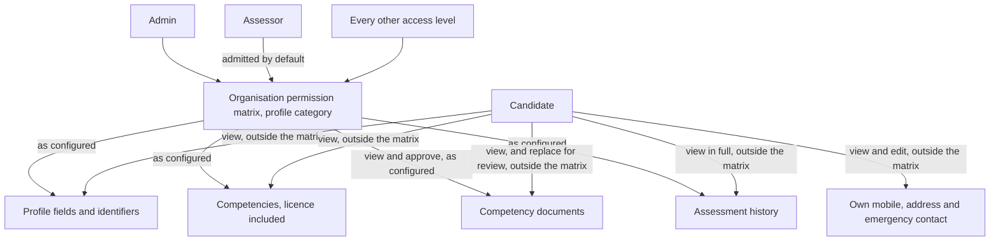
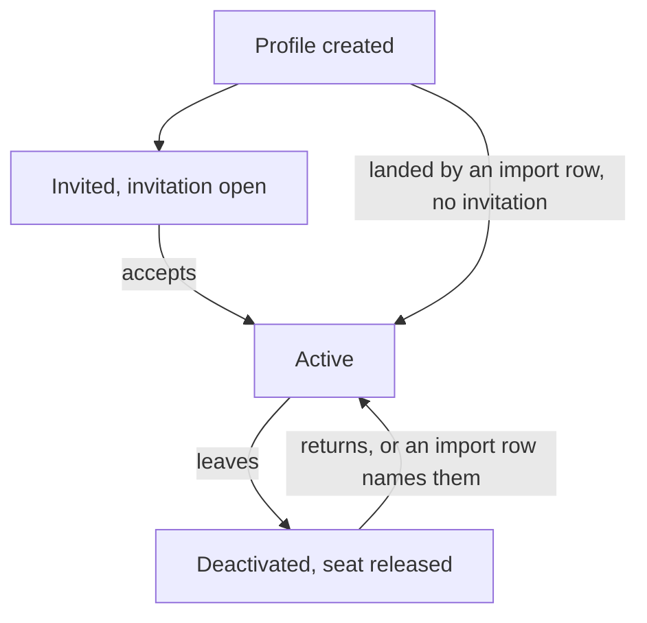
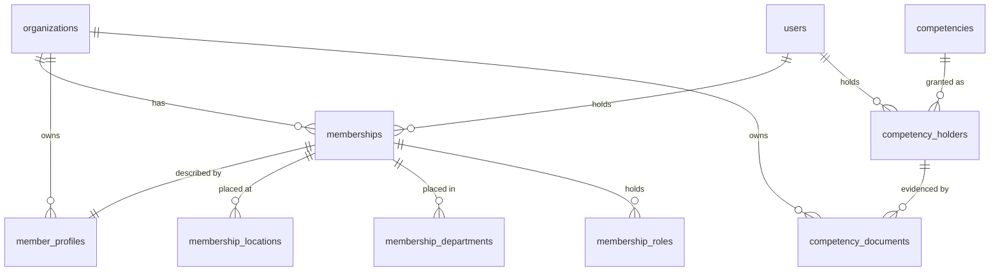
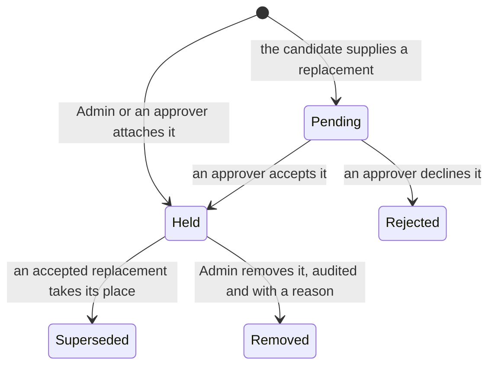
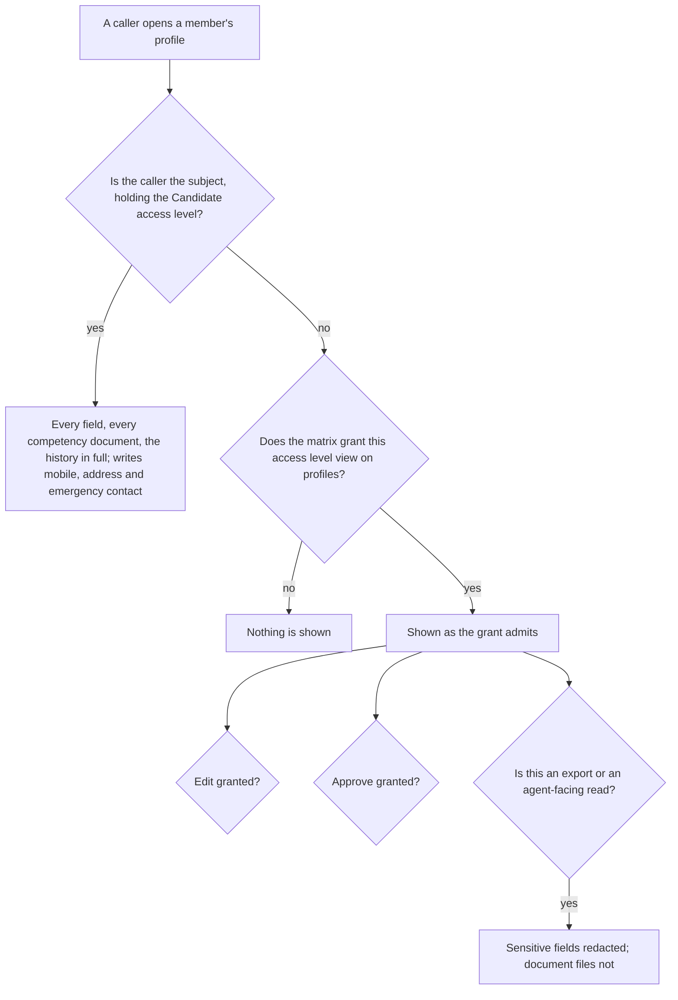
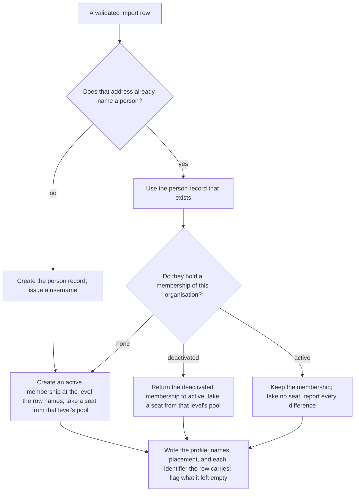
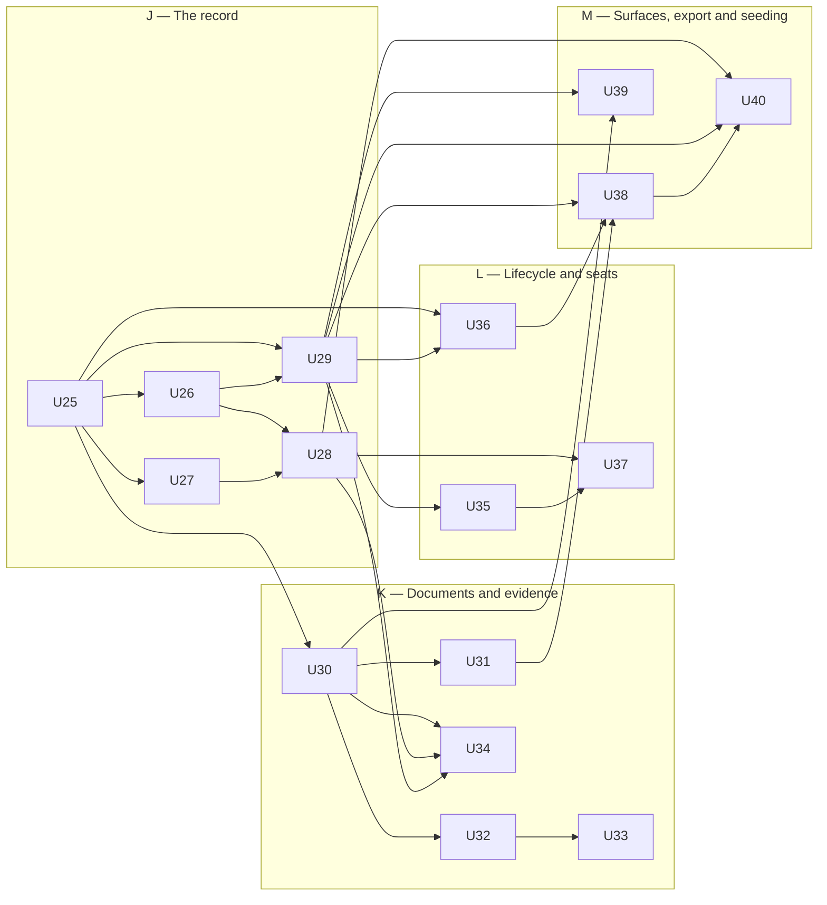

# Candidate Profile - Plan

## Goal Capsule

- **Objective.** Give every member of an organisation a full workforce record — personal details, organisation-assigned identifiers, where they are placed, documents, competencies and assessment history — held on the person rather than scattered across form submissions.
- **Authority.** The Product Contract below is the target and outranks the code wherever the two disagree. `packages/db/src/plans.ts` is the standing example of that and is not edited by this plan under KTD27. The Organisation Settings artifact `docs/plans/2026-08-04-002-feat-organisation-settings-plan.md` owns eight rules this one references rather than restates — voluntary training, expiry notification, what compliance reporting counts of a competency, the standing and currency split, assignment filling gaps with expiry reopening them, the pooled case that names no assessor, the union of parts across a person's Locations, and automatic marking with the attribution it records — and its statement of each wins.
- **Prerequisite, now met.** That artifact's Phase A shipped the Location and Department lists and the Roles each Department offers, so a membership can carry them. Phases B through G shipped alongside it; `Repo state at planning time` records what that changes for this plan, and several of the Product Contract's own grounding notes are superseded there rather than in place.
- **Execution profile.** Sixteen units, U25 to U40, across four phases. Phase J alone unblocks the second half of the workforce import in the sibling artifact; nothing later here is a prerequisite for it.
- **Stop conditions.** A unit that appears to need `packages/db/src/plans.ts` edited, a second permission category beside the `profiles` one that already ships, or a rule the Organisation Settings artifact owns re-derived here has hit a stop condition.
- **Tail.** Each unit is one commit naming its U-ID. Progress is derived from git; this document records decisions and is not updated as work lands.
- **Not in this artifact.** The Assessor access level expansion, the mechanism that runs automatic assignment, the import surface itself, and the interface that issues an invitation.

---

## Product Contract

### Summary

Give each member of an organisation a single profile that is the organisation's workforce record for that person: identity and contact details, organisation-assigned identifiers, where they are placed by Location, Department and Role, real retrievable documents, and the competencies and assessment history already held elsewhere in the system. The record serves every member rather than candidates alone — an assessor's and an administrator's Location, Department and Role are set on the same record, by the same rules — and it is named for its principal subject rather than for the only member it holds.
Let the organisation decide who sees what on it: which profile fields and documents each access level may view, edit and approve is configured in the organisation's own permission matrix rather than fixed as a band in the product, with an assessor admitted out of the box to candidate profiles, the competencies and assessment history on them and the documents held against them, including approving those documents, so they can judge eligibility and approve training evidence. A candidate reads their own record in full, opens the competency documents held on it, edits only their own mobile, address and emergency contact — not their email address, which Admin holds — and may supply a replacement for a document held on them that stands aside until someone approves it; all of that is fixed rather than configured, and all of it is the candidate's alone, every other member reaching their own record through the matrix like any other. Exporting a member's record is the one act no configuration opens up: it is Admin-only and every export is audited.
Retire a leaver by deactivating them whatever access level they held, which shuts the door behind them at once and keeps every record intact so a returning worker keeps competencies that are still in date — and so an import row naming somebody already deactivated brings them back rather than duplicating them. Meter the candidate seat on the active membership that carries the Candidate access level and the staff seat on every other active membership, so a bulk import — which creates one active membership per row, at the access level that row names — states what it will cost in both pools and waits for the Admin to confirm before it runs. And let an Admin mark an email address unreachable, so a member nothing can be sent to is chased by a person on the one list an Admin works and is counted among the workforce no notification reaches.

### Problem Frame

The system knows a member as a login — a name, an email and a way to sign in, and nothing else. Nothing in the system holds a workforce record for a person. Everything that makes someone a workforce member lives somewhere that is not attached to them, and that is as true of the assessor and the administrator as it is of the candidate: no membership carries a Location, a Department or a Role for anybody, so there is nowhere to say where any member works.

That login is not incidental. Candidates sit assessments themselves: an assessment is split by part, the candidate completing the theory, knowledge and declaration parts while the assessor observes and records the rest, with per-part responsibility already modelled by the workflow builder. So a candidate is both the subject of a record and a user of the system, and the system holds nothing about them beyond the sign-in. That is why the record is named for the candidate. It is not why they would be the only member it serves.

The rich personal data an operation collects — date of birth, address, ethnicity, Indigenous status, emergency contact, starter type, department, roles, induction date — exists only as answers on an induction form submission. It describes a submission event, not a person. Two submissions from the same worker are two unrelated records. A worker who never had an induction form completed for them has none of it. Nothing on the person's record can be queried, checked or kept current.

Documents fare worse. The induction model records only that a document was supplied: a present flag, a file name and a content type. The bytes are not held, so nobody can open a licence and see whether it is genuine or a plausible-looking fake. On competency records the same gap appears differently — evidence is a free-text reference pointing at some external register, display and audit only, with nothing that resolves it. An assessor is required to approve certificates and produce them as evidence of training competency, and today there is nothing to open.

Licences compound the problem. Treated as three flat fields on a form answer, a licence class, number and expiry sit outside every mechanism the system already has for things that go stale. Competency records carry granted dates, expiry, grace periods, revocation and a reason. A licence recorded as a form answer inherits none of that, so it expires silently and appears in no compliance check.

Meanwhile the assessment machinery already asks questions the person record cannot answer. An assessment tool declares the competencies a candidate must hold before a case is created and the competencies an assessor must hold to run it, including rules that vary by location. Location, department and role are exactly what will drive stream and pathway selection. None of it is on the person.

And there is no way to retire someone. A worker who leaves either stays as an active login consuming a seat, or is deleted along with the competency evidence that certified them.

### Key Decisions

**The profile is a full workforce record, not a thin identity record.**
A thin record would leave the induction data where it is, which is the problem. The organisation's obligation is to know who is on site, how to reach their next of kin, what they are certified to do and when that certification lapses. That is one record about a person, not a scatter of submissions.

**The record serves every member of an organisation, and is named for its principal subject.**
Where somebody is placed, what identifies them on site and what they are certified to do are questions an organisation asks of its assessors and its administrators exactly as it asks them of its candidates, and there is no second record anywhere to hold the answers. So the record itself, its field inventory, its identifiers, its documents and its placement rules are the member's rather than the candidate's. What remains the candidate's is what only a candidate can be: the candidate seat pool, their fixed read of their own record, the replacement document they may supply, and everything about being assessed. The artifact keeps its name because the candidate is the member it exists for and the subject every other rule here is built around, not because they are the only member it covers.

**The field set is the existing induction intake, minus In Beakon and the three licence fields, plus two entered identifiers and a generated username.**
The intake set is already in production use, so it is the field set to adopt rather than redesign. The "In Beakon" field goes, because it names one customer's external learning system. Licence class, number and expiry go because a licence becomes a competency record. Employee Number and Swipe Card Number come in, because they are how the operation identifies a person on site and no form asks for them, and the generated username comes in because sign-in cannot hang off an address Admin corrects.

**A demographic question a person declines to answer is recorded, not left blank.**
Gender offers Undisclosed and Ethnicity offers Unknown, and choosing either records a decline rather than leaving a field empty, so a question that is required can still be answered honestly by someone who would rather not say. The alternative — a required field with no way to decline — would force a worker to disclose their ethnicity in order to be employed, which is not what requiring a field means. Indigenous status is not asked at all: it follows from the ethnicity answer, so the two can never contradict each other, and a declined or absent ethnicity leaves it not stated rather than reporting a fact about the person that nobody supplied.

**Field presence follows the intake already in use, and the identifiers a person arrives without are optional.**
The intake is in production and its own split between required and optional is the one to adopt rather than a stricter rule invented here — a middle name is optional there because plenty of people have none. Employee number, swipe card number and induction date are optional for a different reason: they genuinely arrive after the person does, and refusing to create a profile until they exist would stop an organisation recording someone it has already hired. A bulk import goes further and asks only for a name, an email address, where the person is placed and the access level they land with, flagging what a row left empty rather than forcing whoever runs the import to invent demographic answers for workers they may never speak to. The access level is on that short list because a file migrating a workforce is migrating its assessors alongside its operators, and because the seat a row spends and the pool it spends it from cannot be priced before the run without it. It asks for no identifier at all, because employee number and swipe card number stay optional on a typed profile indefinitely and a person holding neither is displayed by name alone, so demanding one on import would make migrating a workforce stricter than entering it by hand. The email address is on that short list because no profile exists without one at all, which is a precondition of creating a person rather than a field the import happens to want.

**One record per person per organisation, with Location, Department, Role and access level on the membership.**
A profile resolves to a single person record and to that person's single membership of the organisation, and it is the membership that carries where they are placed — Location or Locations, Department or Departments, Role or Roles — and the access level they hold. A person who works for two customers is one identity with a membership in each, so keying the profile on the membership is what keeps one organisation's view of them out of the other's, and what lets the same person hold a different access level and a different job in each. That is the answer for every member rather than for candidates alone: an assessor's Location, an administrator's Department and a candidate's Roles all sit on the same record and are set the same way, which is what makes the placement rules here the whole product's rather than one access level's.

**An email address is required to create a profile, and is not the same thing as an invitation.**
The address is captured onto the record so an email invite path can be built later, and it is what the person signs in with alongside their username. Delivering the invitation is a separate matter, so a printed QR code remains a legitimate way to hand someone their invitation even though their profile carries an address.

**An address that no longer reaches anybody is marked, not deleted.**
Requiring an address of every profile and then letting nothing invalidate one leaves the fallback for an unreachable person catching nobody — a safety net stretched under an empty room, because every profile carries an address by construction and no address can ever go bad. So an Admin may mark an address unreachable when mail to it bounces or the worker has left it behind. The record keeps the address and stays valid, since what is required is that a profile carries an address rather than that it carries a working one, and the member reaches both surfaces an Admin reads instead: the working list, because an expiry that would have been notified now has to be chased by a person, and compliance reporting, because a member no notification can reach is a fact about how the workforce stands rather than a task. That is what gives the compliance fallback an actual population, and it is the one thing that belongs on both.

**A licence is a competency, not a profile field.**
Licence class, number, expiry and document have the exact shape competency records already handle. Recording a licence as a competency gives it expiry, grace periods, revocation and a place in prerequisite checks for free. Recording it as a flat field would rebuild all of that badly, or more likely not at all.

**A competency someone earned is theirs whether or not their current work still calls for it.**
So a competency required by a Role that still counts among the ones they hold is required, and one required by none of them demotes to optional and is kept. A Role stops counting by being withdrawn, and withdrawal never erases it from the record — it stays visible, marked, assigning nothing further and requiring nothing further, which is what makes the demotion possible at all. Retiring a value is not one of those ways: a retired Role goes on counting until remediation moves the person off it, because retirement is a statement about what may be chosen next rather than a judgement about the person. Withdrawing an assessment from what a Role requires works the same way and stops short of the cases already running against it: they finish, and what they produce stands as optional, because discarding part-assessed work to tidy a requirement list is the one thing demote-never-delete exists to prevent. How standing is derived and what a change of Roles does to it belong to the Organisation Settings artifact; what this one relies on is that a demotion destroys nothing.

**Currency is a set of dated states, and revocation is not one of them.**
Currency follows the competency's own dates and takes the four dated states the competency model computes — held, approaching expiry, inside grace and expired — with revocation lifted out of that set and carried as a mark of its own. Lifting it out is what makes the rule about it statable rather than implied: a revoked competency counts as not held wherever currency is read, so it satisfies no prerequisite however good its dates are, closes no requirement that automatic assignment would otherwise skip as already met, and leaves what a Role requires standing as a gap. That is exactly the person who must be reassessed, and reading dates alone would hide them. How standing and currency divide the work between them — obligation reads standing, eligibility reads currency — is the Organisation Settings artifact's rule, relied on here rather than restated.

**Documents are real files, and they are viewable.**
A present/absent marker proves a box was ticked, not that a licence is genuine. The point of holding a licence document is that a human can open it and look at it. That requires the file, not a note that a file once existed. Holding the bytes also means the address of a document is never the thing protecting it: a licence image carries a date of birth and a photograph, so a caller is admitted to it or is not.

**Who sees which profile field is the organisation's setting, not a band the product draws.**
Practice varies too much for a fixed band to be right. An assessor verifying identity against a driver's licence is standard in training and assessing, and some organisations run their assessors with full administrative access, so a product that hard-codes an assessor out of personal information is wrong for both of them. What each access level may view, edit and approve on a member's profile is therefore configured by the organisation. Out of the box an assessor can view candidate profiles, the competencies and assessment history on them and the documents held against them, and can approve those documents, which is what lets them tell whether they may assess the person in front of them and which satisfies the regulatory obligation to view and approve certificates and produce them as evidence of training competency. Approving is a verb of its own rather than a shade of editing, because a document is approved without being changed. An organisation that wants it tighter tightens it. The one thing this is not is free: the permission matrix carries no category covering a member's profile or their personal information today, so making it configurable means adding one. There is precedent for banded reads — induction sensitive detail is already redacted by default and released only to a caller holding the export grant — but precedent is not a switch that already exists.

**A candidate reads their own assessment history in full.**
The candidate can already reach every case they are the subject of, with every attempt, its outcome and the reason recorded against it, so a profile that showed only the current outcome would show them less than they already have. The profile repeats that history rather than restricting it. Exporting it is not theirs, and not because the Candidate access level happens to carry no export: an export of a member's record is Admin-only.

**Exporting a member's record is Admin-only, and every export is audited.**
It is the most sensitive act in the product, because the document files ride along unredacted and a licence image carries a date of birth, an address and a photograph. That is as true of an assessor's record as of a candidate's, so the rule is the member's rather than the candidate's. It is not a matrix setting an organisation can hand to an assessor or a reviewer, and every export is written to the audit, so a leak is traceable to a person and a moment.

**Approving a document records that it was sighted; rejecting one is not revoking a competency.**
An approval says a human opened the certificate and accepted it, which is what the obligation to sight training evidence actually asks for. Two things follow. A document nobody has approved yet blocks nothing — not checked yet is not the same as in doubt — and rejecting one flags it to an Admin to resolve with the person rather than withdrawing the qualification, because revocation means the qualification was taken away and a poor photograph is not that. Nothing is destroyed on the way either: a document a replacement supersedes is kept as evidence of what was held and sighted at the time, and removing one outright is Admin-only, audited and reasoned, for the case it exists for — a document uploaded to the wrong person's record.

**Role means the job someone does; access level means what they may do in the product.**
One word carried both ideas, which made the profile's Roles field indistinguishable from a permission grant. A person's Role places them in the work and drives which competencies they must hold. Their access level — Owner, Admin, Builder, Reviewer, Viewer, Assessor or Candidate — is what the permission matrix grants them, and it is administered separately from the job they do.

**A candidate's own access to their own record sits outside the matrix, and is the candidate's alone.**
Everything else on the profile is the organisation's to configure, but a candidate reading the record their employer holds about them is not a permission an organisation grants itself out of. The candidate is the member with no other reach into the product's records and the one every judgement here is made about, so their read of their own profile and their own assessment history, and their write of their own mobile, address and emergency contact, are fixed rather than being a setting anyone can turn off. Every other member reads and writes their own record through the matrix like any other, because whatever an organisation admits an access level to includes that access level's own record; scoping the fixed rule to candidates is what keeps it a protection rather than a hole in the configuration.

**A generated username, not the email address, is the sign-in identity, and everyone gets one.**
An email address is a field Admin corrects, and if sign-in hung off it a correction would move the person's identity with it. That reasoning is about signing in rather than about candidates, so every person the organisation holds a record for is issued a unique username built from their first initial, their last name and a random number, whatever access level they carry, and may sign in with either that username or their email address.

**A member is displayed by first and last name paired with an organisation identifier the organisation picks.**
Two workers share a name often enough that a name alone is not an identification. The middle name does not help on a screen, so it stays off the display name and the employee or swipe card number carries the identification instead. Both of those are unique within the organisation, so either can tell two people apart, and which of the two is shown is the organisation's own setting rather than a rule the product fixes — some operations know their people by a payroll number and some by the card they badge in with. Because both are optional, the display falls back rather than failing: a person holding only the number the organisation did not choose is shown by that one, and a person holding neither is shown by name alone.

**The candidate edits their own mobile, address and emergency contact, and supplies replacement documents that wait for approval.**
Those details go stale and the person is the best source for them. Employee number and swipe card number are the organisation's to issue and to correct, so they are not the person's to write. A competency document is unlike both, because the person holds the certificate: they can open what is filed against them and supply a better copy of a licence photographed badly or a card since renewed. What they supply is a submission rather than an edit — it becomes the record's evidence only when someone admitted to approve documents accepts it — which is exactly what keeps the rule that a candidate edits only their contact details true rather than quietly widened. It is new capability all the same: nothing in the product lets the subject of a record put a file into it today.

**Leaving is deactivation, not deletion, and not revocation.**
Deactivation keeps every record indefinitely, so a returning worker keeps competencies that are still in date. Nothing expires and nothing is purged. Revocation means the qualification was withdrawn — a judgement about competence, which leaving is not. What deactivation does end is reach into the product: a session the person is already signed into ends at once rather than running on, and an invitation they never accepted is closed rather than left standing for someone who has gone, because a record kept forever is not the same as a door left open.

**A candidate seat is consumed by an active candidate, not by a profile and not by an invitation.**
A profile exists before an invitation is accepted and an invitation never expires of its own accord, so if either consumed a seat an organisation would pay for people who have not arrived and may never arrive. The seat follows the active membership carrying the Candidate access level, which is also what deactivation releases and what granting that access level to an existing member takes up.

**A bulk import creates active memberships, so it costs a seat per row, from the pool the row's own access level names.**
The people on an import file are not people who might arrive: they are the workforce already on site, and the run exists to put them in the product as members who hold competencies and can be assessed. So an import creates an active membership for every row it lands, and the row names the access level that membership carries, because a customer migrating its workforce migrates its trainers and assessors alongside its operators and a file that could only make candidates would land an assessor as one. Each such membership consumes a seat exactly as any other active membership does, drawn from the candidate pool where the row names Candidate and from the staff pool where it names anything else, the two pools being complementary. It still sends no invitation and creates no login — those are how a person reaches the product, not what makes them a member of it. And a row naming somebody the organisation has already deactivated is not a new person at all: a row asserting they are part of the workforce being imported is what reactivation means, so the membership they held returns to active, takes up a seat again for the level the row names, and brings back the competencies deactivation retained, still valid where they are in date. The consequence is worth stating plainly rather than discovering: a four-hundred-row file is four hundred seats, but four hundred candidate seats only where every row names Candidate — three hundred and sixty Candidate rows into an included candidate allocation of a hundred overflow that pool by two hundred and sixty and buy blocks automatically under the overflow rule, while the forty rows naming other levels draw on the staff pool instead.

**The one action carrying a direct financial consequence states its cost before it runs.**
Automatic expansion is right at the boundary of a single reactivation, where refusing the action would stop work on a site to settle a billing question. It is wrong as a surprise on a file of four hundred rows, where the entire cost lands in one act nobody has priced. So an import states what it will consume before it consumes it — how many seats the file needs in each of the two pools, how much of each the included allocation covers and how many blocks would be purchased for the candidate rows that overflow — and proceeds on the Admin's confirmation. That is the blast-radius preview a retrospective requirement change and a bulk transfer already use, applied to the one action whose radius is money.

**The included candidate allocations are 100 on Business and 500 on Enterprise.**
Those are the numbers the product owner has decided on, and a requirements contract states the target. The plan configuration in the code carries different ones — Business 200 and Enterprise unlimited — and is being brought into line separately, so the code is the starting point rather than the statement. Both included allocations are therefore finite, which means the overflow rule reaches an organisation on either tier rather than a Business organisation alone, and the two tiers below still enrol no candidates at all.

**Additional candidate seats are sold in blocks, and a larger block costs less per seat.**
A block of 50 is charged at the per-seat list price, a block of 100 carries a 15 percent discount and a block of 500 carries a 25 percent discount, so an organisation that knows it is growing is rewarded for committing up front. The per-seat list price is not yet set.

**Exceeding a finite candidate seat allocation adds seats rather than blocking the action.**
Refusing a reactivation or a new candidate at the allocation boundary stops work on a site in order to settle a billing question. So any action that would take an organisation past a finite allocation goes through, and a block of candidate seats is added automatically and charged. A tier that enrols no candidates never expands into an allocation at all.

**Retiring a taxonomy value never blocks the people who hold it, and never changes what they must maintain on its own.**
A Location, Department or Role the organisation stops using is kept on the records that already carry it, marked as retired, and withdrawn from the choices offered on a new one. A retired Role goes on counting among the Roles the person holds until remediation moves them off it: demoting their competencies at the moment the value is retired would change what they must maintain before anybody had decided where they now work, and it would do it to a person who has not moved. What the move off it does — withdrawing the Role, demoting the competencies it alone required, destroying nothing — is the same demotion any other change of Roles runs through, so nobody is stopped while the affected people are reassigned.

**A person may hold several Locations and several Departments, and the Roles their Department offers.**
Real workforces place people across more than two sites, so the settings that allow more than one Location or Department carry no cap of two and never hard-block. Roles are the Department's to govern in both directions, and each Department governs its own. A Department carries its own list of the Roles it offers, and a person placed in it may hold only those; it declares besides whether they hold one of those Roles or several, and a Department set to several puts no ceiling on the number, so an operator running three machines holds three Roles and receives what all three require. A person placed in several Departments therefore holds each Department's Roles under that Department's own setting — several of the first's where it allows several, one of the second's where it allows one — and two settings that differ never have to be reconciled, because the sets they bound are separate rather than competing for one answer. The two halves have one reason behind them: an offered set that was every Role in the organisation would let an administrator record a combination the site does not induct, which is exactly what the one-or-several setting beside it exists to stop. The product already behaves this way, the intake the field set is adopted from carrying a separate role field per department that is shown only when that department is chosen, so one department offers machine roles and another offers trades. It follows that a Role a candidate holds that their Department stops offering is withdrawn from them. A person holding several Roles loses nothing to holding several — that they sit one assessment covering the union of what their Locations require, once, rather than the same assessment twice, is the Organisation Settings artifact's rule and is relied on here.

**What the profile owes automatic assignment is the person's Roles and their Locations.**
The Organisation Settings artifact owns what assignment then does: that it fills gaps rather than reissuing what someone already holds, that an expiry reopens the gap so renewal is continuous rather than a one-off when someone is placed, that the case it opens names no assessor and waits for anyone eligible at its Location, and how the Location such a case records is chosen where the parts came from several. This artifact states what the profile must hold for those rules to run — Roles that still count, Locations that are real list values, and competencies whose currency and revocation mark can be read — and takes the rules themselves as given.

### Actors

A1. **Admin** — a person holding the Admin access level. Creates members of any access level and places them, and enters and edits every profile field their organisation's matrix admits them to, which out of the box is all of them. Attaches documents, records competencies, marks an email address unreachable, and deactivates and reactivates people. Resolves a document an approver rejected, approves the voluntary training a member asks for, works the one list carrying everything an Admin has to act on, reads the compliance report beside it, confirms what a bulk import will cost in both seat pools before it runs, and is the only access level that can export a member's record or remove a document from one.

A2. **Assessor** — a person holding the Assessor access level, who runs assessments. Records the assessor-required parts of any case they are eligible for. Holds a profile of their own, their Location, Department and Role set on it by the same rules as anybody's. What they see on another member's profile — fields, competencies, assessment history and documents alike — is whatever their organisation's matrix admits them to, which out of the box is the profile in full, so on the defaults they read a candidate's competencies and history to judge eligibility, and view and approve the competency documents held on them — or reject one, which sends it to an Admin to resolve with the person and withdraws no qualification.

A3. **Candidate** — the workforce member being assessed, holding the Candidate access level, and the member this record is named for. Signs in and completes the assessment parts assigned to them, reads their own profile and their own assessment history, opens the competency documents held on their record, and edits their own mobile, address and emergency contact, which are the only fields they write — their email address is Admin's to correct. May supply a replacement for a document held on them, which waits for approval rather than taking effect, and may ask for training no Role of theirs requires, which reaches an Admin on the list they already work and which that Admin approves and assigns.

A4. **Human Resources** — the team who completes the induction intake form on the starter's behalf, recording only what that person has supplied to them. The person does not fill the form in. The answers Human Resources records are what a new profile can be seeded from.

Member means anyone holding a membership of the organisation, whatever access level they carry; where a rule below says candidate it means the Candidate access level and nobody else. Owner is not listed as an actor of its own because it carries no behaviour of its own here: the Owner access level holds everything Admin holds, so every rule in this artifact that reads Admin-only admits an Owner alongside the Admin and nobody else.

### Requirements

**Profile content**

R1. Each member of an organisation has exactly one profile, whatever access level they hold, and that profile is the organisation's workforce record for that person. A profile resolves to one person record and to that person's single membership of the organisation, and it is the membership that carries where they are placed — the Location or Locations, the Department or Departments and the Role or Roles they hold — together with their access level. An assessor's and an administrator's placement is therefore set on this record and by these rules exactly as a candidate's is. A person working for two organisations holds one profile and one membership in each, and neither organisation reaches the other's.

R2. The profile carries the field inventory below.

R3. The display name is derived from first and last name; the middle name does not take part in it.

R4. Location, Department and Roles are chosen from the organisation's own named lists, and a value the organisation has retired is not among the choices offered. The Roles among those choices are the ones the Department the member is placed in offers, because the Role list is carried per Department rather than being flat. A record points at the taxonomy value rather than carrying a copy of its name under R136, so renaming a Location, Department or Role reaches every membership that holds it, while a settled assessment record keeps the words it was written with under R137 and R138. Both rules are the Organisation Settings artifact's and are relied on here.

R5. A member holds one Location and one Department, unless the organisation has enabled multiple locations or multiple departments. Neither setting caps a person at two, and neither hard-blocks: a member holding several Locations or several Departments is placed in all of them.

R6. A Department constrains both which Roles a member placed in it may hold and how many, and it constrains its own Roles alone. Every Role a member holds is one that a Department they are placed in offers, and within each such Department they hold one of that Department's Roles, or several where that Department is set to allow several. A Department set to several puts no ceiling on the number, so an operator running three machines holds three Roles. Where R5 places a member in several Departments, each Department governs its own Roles and its own count: a member in one Department that allows several and another that allows one holds several of the first Department's Roles and one of the second's, and the two settings never have to be reconciled because the sets they bound are separate. Both the set of Roles a Department offers and its one-or-several setting are held with the Department list in Organisation Settings; this artifact relies on them rather than defining them.

R7. Employee number and swipe card number are organisation-assigned identifiers entered by Admin. Each is unique within the organisation, so neither can be issued to two people at once and either can tell two people of the same name apart. Which of the two the organisation displays beside a member's name is an organisation setting held with the Organisation Settings work; what that choice resolves to on screen, including where a member holds only one of them or neither, is stated here under R24.

R8. Fields classed as sensitive are marked as such on the profile so downstream reads can redact them.

R9. A person's access level is granted by the permission matrix and is carried on their membership of the organisation under R1 rather than on the profile, so the same person may hold a different access level in each organisation they work for. The membership carries it however it was set — chosen when the member is created, changed later under R81, or named by the import row that lands them under R19.

R10. A profile exists from the moment the member's record is created, before they accept an invitation.

R11. Location, Department and Role place the member, and are the fields later work will read to select an assessment stream and pathway. The Location a member holds names the same axis an assessment case already records, so the two carry one vocabulary rather than two that have to be reconciled.

R12. Field presence on the profile follows the induction intake the field set is adopted from: a field the intake requires is required on the profile, and the middle name is optional because the intake treats it as optional. Employee number, swipe card number and induction date are optional whatever the intake does with them, because they arrive after the person does and refusing the profile until they exist would stop an organisation recording someone it has already hired. Location is required alongside the Department and Roles beside it. The inventory table states the presence of every field.

R13. Gender and Ethnicity are required, and each offers an explicit value for a member who declines to state them — Undisclosed on Gender and Unknown on Ethnicity. Choosing one records a decline rather than leaving the field blank, so a required demographic question can still be answered by someone who would rather not say. Indigenous status is not among them, because nobody enters it: its third value, not stated, is what R15 derives from a declined or absent ethnicity.

R14. Gender is chosen from Male, Female and Undisclosed. Ethnicity is chosen from Aboriginal, African, Asian, Caucasian, Chinese, Eurasian, Indian, Malay, Others, Torres Strait Islander and Unknown. Starter type is chosen from New starter and Transfer.

R15. Indigenous status is derived from the Ethnicity answer and is entered by nobody. An ethnicity of Aboriginal or Torres Strait Islander reads as Indigenous, any other stated ethnicity reads as not Indigenous, and an ethnicity of Unknown or no ethnicity at all leaves it not stated. It is read-only and carries three values so that it can never contradict the answer it comes from, and so that not stated is never reported as not Indigenous.

R16. An email address is required, so no profile can be created without one, and it stays on the record for as long as the record does. An Admin may mark an address unreachable, for the worker whose mail bounces or who has left the address behind. The mark takes nothing off the record and invalidates no profile — what is required is that a profile carries an address, not that it carries a working one — and the member it is put on reaches both of the surfaces an Admin reads. They reach the working list under R20, because an expiry that would have been notified now needs a person to chase it, and they are counted in compliance reporting under R98 and R99, because a member no notification can reach is a fact about how the workforce stands. That mark is the only thing in the product that makes an address stop reaching somebody, so it is what gives the compliance fallback a population rather than a rule with nobody under it, and the member carrying it is the one item that belongs on both surfaces.

R17. The email address is held on the record independently of how the invitation reaches the person, and an invitation may still be handed over as a printed QR code rather than sent to that address.

R18. Files may follow the record: the profile picture and any competency document can be supplied after the profile exists, and stay owed until they are. An owed file marks the record it belongs to and lists it for follow-up. It blocks nothing — no case, no assessment and no competency waits on a file that has not arrived — which is the same warn-rather-than-block disposition an unsatisfied prerequisite already takes.

R19. A bulk import row must carry the person's name, an email address, their taxonomy values — Location, Department and Roles — and the access level the person lands with. The access level is the row's rather than the run's, so one file lands a customer's trainers and assessors as assessors and its operators as candidates, and it is required rather than assumed because R80 draws each row's seat from the pool its access level names and R86 has to state that cost before the run starts, neither of which is readable from a row that does not say. A row naming an access level the organisation's tier cannot support creates no profile and is reported as a failed row like any other value that cannot be resolved, a tier that R83 leaves enrolling no candidates supporting no row that names Candidate. No identifier is required of a row: R12 leaves the employee number and the swipe card number optional on a typed profile indefinitely and R24 states what is displayed for a member holding neither, so requiring one on import alone would make migrating a workforce stricter than entering it by hand. Every other field is optional on import, and no competency document is owed against a competency that import run loads. That waiver is scoped to the run that needed it: a competency recorded on the same person after the import owes its document exactly as any other does, so a one-off migration concession never becomes the standard for recording competencies day to day. A row missing any of that required set creates no profile and is reported as a failed row, because R16 admits no profile without an email address and the person record is keyed on one. A row that creates a profile but leaves optional fields empty is flagged for follow-up naming exactly what it left empty, so an organisation can see the gap rather than have whoever runs the import invent demographic answers for a worker they may never speak to. Two further rules are the Organisation Settings artifact's and are relied on here rather than restated: a row is rejected on the same footing where it would create a record that breaks a rule, such as a competency no assessment tool in the organisation awards, a Role the named Department does not offer, more Roles than that Department allows or an unparseable grant date; and a row whose email address already belongs to someone creates no second profile, that person instead gaining a membership of this organisation with the row's competencies merged onto their record and any differing Location, Department or Role reported rather than silently overwritten. Where that person already holds a membership of this organisation that has been deactivated, the row reactivates it rather than leaving them inactive, which is this artifact's rule rather than that one's: a row asserting somebody is part of the workforce being imported is an assertion that they are back, so R68 and R69 return them with the competencies R63 retained, still valid where they are in date. What the membership a landed row creates or reactivates costs in seats, and what the run states about that cost before it starts, are R80's and R86's.

R20. Everything an Admin has to act on surfaces on one working list — a file still owed under R18, a field an import row left empty under R19, a member's request for training no Role of theirs requires under R96, and a member whose email address an Admin has marked unreachable under R16 — so an Admin sees them in one place rather than finding them one profile at a time. The Organisation Settings artifact puts its own items in front of the same Admin on that list: the review a retired taxonomy value raises, and a pooled case nobody has picked up, which reaches the list once it is overdue under R116. The list gates nothing; it is a working list rather than a hold on the records it names. Compliance reporting under R99 is a separate surface answering a different question — how the workforce stands rather than what an Admin must do next — and the two overlap in exactly one place: the member marked unreachable is on the working list because somebody has to chase them, and in the report because a member no notification reaches is a compliance fact. Nothing else on the working list is a compliance fact, and nothing compliance reporting counts about a competency is an item on the working list.

| Field | Required at creation | Sensitive | Unknown option | Who may edit |
| --- | --- | --- | --- | --- |
| First name | Yes | No | No | Admin |
| Middle name | Optional | No | No | Admin |
| Last name | Yes | No | No | Admin |
| Display name | Derived | No | No | Derived, not edited |
| Username | Generated | No | No | Generated, not edited |
| Gender | Yes | No | Yes | Admin |
| Ethnicity | Yes | Yes | Yes | Admin |
| Indigenous status | Derived | Yes | Derived — not stated | Derived, not edited |
| Date of birth | Yes | Yes | No | Admin |
| Address street | Yes | Yes | No | Admin, candidate |
| Suburb | Yes | Yes | No | Admin, candidate |
| Postcode | Yes | Yes | No | Admin, candidate |
| Mobile | Yes | No | No | Admin, candidate |
| Email | Yes | No | No | Admin |
| Emergency contact name | Yes | No | No | Admin, candidate |
| Emergency contact phone | Yes | No | No | Admin, candidate |
| Profile picture | May follow | No | No | Admin |
| Employee number | Optional | No | No | Admin |
| Swipe card number | Optional | No | No | Admin |
| Starter type | Yes | No | No | Admin |
| Department | Yes | No | No | Admin |
| Roles | Yes | No | No | Admin |
| Location | Yes | No | No | Admin |
| Induction date | Optional | No | No | Admin |

Licence class, number, expiry and document are not in this table — they are a competency record, covered by R33 to R36.
The required column states presence under R12: a field marked required must carry a value before the profile is created, an optional one may stay empty indefinitely, a field that may follow is owed under R18, and a derived or generated one is never entered. A bulk import row is held to the set R19 requires rather than to this column, and the access level that row names is not a field in this table at all, because R9 carries it on the membership rather than on the profile. The email row carries a value on every profile, and the unreachable mark R16 allows is a state on that field rather than a value in it: it empties nothing and leaves no field outstanding, while still putting the member on the working list under R20 and into compliance reporting under R99.
The sensitive mark drives redaction in exports and agent-facing reads, and document files are exempt from that redaction. It does not decide who may see a field on the profile itself — that is the organisation's own setting under R39, R40 and R55.
The Unknown column marks the two fields a person may decline to state under R13, and the derived not-stated value Indigenous status carries under R15. A required field answered with a decline counts as answered.
The "who may edit" column states who may write each field where the organisation's matrix admits the writer at all: the candidate writes only their own mobile, address and emergency contact, and Admin writes the rest. The replacement document a candidate may supply under R52 is not a write to any field here, because it waits for approval rather than landing on the record. Reading is a separate matter — the candidate reads their own fields in full under R49, and what any other access level reads is configured under R39 and R55. Both candidate entries are the candidate's alone rather than every member's: any other member's read and write of their own record is a matrix setting under R39 like anybody else's, which is why the inventory itself belongs to every member while these two columns do not.

**Identity and sign-in**

R21. Every person the organisation holds a record for is issued an automatically generated unique username formed from their first initial, their last name and a random number, whatever access level they carry. The rule reaches everyone who signs in rather than candidates alone, because correcting an email address must not move who the person is to the system for anyone.

R22. A person signs in with either their username or their email address.

R23. Changing the profile email does not change the username, and retires the old address as a sign-in identifier.

R24. A member is identified on display by the display name paired with an organisation-assigned identifier. Which of the two identifiers that is — the employee number or the swipe card number — is the organisation's own setting under R7. Because R12 leaves both optional, the display falls back rather than failing: a member holding only the identifier the organisation did not choose is shown by that one, and a member holding neither is shown by their display name alone until one is issued. Neither fallback is an incomplete record on the working list under R20, because R12 leaves both identifiers optional indefinitely rather than owed.

**Documents and evidence**

R25. Profile picture and licence document are stored as real retrievable files that can be opened and viewed.

R26. Recording that a document was supplied is not sufficient; the file itself is held.

R27. A licence document is viewable so a human can judge whether the licence is genuine.

R28. A competency record can carry one or several attached documents rather than only a free-text pointer at an external register.

R29. Document files are not redacted from exports.

R30. A stored file is retrievable only by a caller the organisation admits. Knowing a document's address is never on its own enough to open it.

R31. A competency document that a replacement supersedes is retained as evidence of what was held and sighted at the time, and stays retrievable alongside the document that replaced it.

R32. Removing a document from a record altogether is Admin-only, is audited and carries a reason. It exists for the document uploaded to the wrong person's record rather than as a way to tidy a record, so a superseded document is retained under R31 rather than removed.

**Licence as competency**

R33. A licence is recorded as a competency, not as a flat profile field.

R34. The licence competency carries licence class, licence number, expiry and the licence document.

R35. The licence inherits expiry dates, grace periods and revocation from the competency model.

R36. The licence appears in prerequisite and compliance checks alongside every other competency.

**Profile surface**

R37. A member's competencies render on their profile, each showing its standing and its currency.

R38. A candidate's assessment history renders on their profile. The candidate reads it in full: every case they are the subject of, with every attempt, its outcome and the reason recorded against it, whatever state the case is in. Exporting that history is not part of what they read, because an export of a member's record is Admin-only under R54. Who else reads it is a matrix setting under R39, and an assessor reads it out of the box under R55.

**Visibility and editing**

R39. Which profile fields and which documents a given access level may view, edit and approve is configured by the organisation in its own permission matrix, on any member's profile rather than on a candidate's alone. Approving is a verb of its own rather than a shade of editing, because a document is approved without being changed and an access level admitted to view a document is not thereby admitted to approve it. The product draws no fixed visibility band of its own.

R40. The permission matrix carries no category covering member profiles or personal information today — its categories are forms, submissions, team, billing, audit and assessments — so making profile visibility configurable means adding one. That is new work rather than a switch that already exists.

R41. Out of the box an assessor may view a candidate's competencies and their assessment history; the organisation may tighten or loosen that in its matrix under R39.

R42. Out of the box an assessor may view and approve any competency document held on a candidate; the organisation may tighten or loosen that in its matrix under R39.

R43. Approval is recorded against the document as evidence that the certificate was sighted and accepted, and changes neither the competency's currency nor its standing nor whether it satisfies a prerequisite.

R44. Fields and documents are configured separately, so an organisation that restricts an access level's reach into profile fields does not thereby restrict its reach into documents. A competency document stays open to an assessor even where it prints personal detail such as a date of birth, an address or a photograph, unless the organisation restricts documents in their own right.

R45. A competency document can be produced as evidence of training competency by a reader the organisation's matrix admits to it, which out of the box includes an assessor.

R46. A document that has not been approved blocks nothing. It has not been checked yet rather than being in doubt, so the competency it belongs to keeps its currency, its standing and its place in prerequisite checks until someone looks at it.

R47. A reader the organisation admits to approving a document may reject it instead. Rejection flags the document to an Admin to resolve with the person, and revokes no competency: revocation means the qualification was withdrawn, which an illegible photograph is not. The competency keeps its currency and its standing exactly as R43 and R46 leave them.

R48. An assessor's reach is every candidate in the organisation rather than only candidates on a case assigned to them, wherever the organisation admits assessors to profiles at all.

R49. A candidate reads every field on their own profile, including the fields marked sensitive. This is fixed rather than configured, and no matter how an organisation sets its matrix it cannot take that read away. It is the candidate's read rather than every member's: what any other access level reads on its own record is a matrix setting under R39 like any other, because the profile serves every member while this protection is the candidate's.

R50. A candidate opens every competency document held on their own record. Like their read of their own fields under R49, this is fixed rather than configured, is the candidate's rather than every member's, and no setting of the matrix takes it away.

R51. A candidate edits only their own mobile, address and emergency contact.

R52. A candidate may supply a replacement for a competency document held on their own record. The replacement takes effect only when it is approved: until then the document already held stands as the record's evidence, so what the candidate supplies is a submission for review rather than a write to the record, and R51 stands unwidened. A replacement waiting for review sits in an approval queue worked by a reader the organisation admits to approving documents, which out of the box is an assessor under R42, and once accepted it becomes the document held while the one it replaces is retained under R31. A replacement that is rejected never becomes the record's evidence and is not discarded either: it is kept as a record of what the candidate submitted and when, alongside the document that stayed in force. The candidate is told the outcome whether the replacement was accepted or rejected, and nothing stops them supplying another. This is not the rejection R47 covers, which acts on a document already held on the record and flags it to an Admin; a rejected replacement leaves the record exactly as it was.

R53. Employee number and swipe card number are the organisation's to issue and to correct, so they are never the candidate's to write. Which other access levels may write them is a matrix setting under R39.

R54. Exporting a member's record is Admin-only, which admits an Owner with the Admin as the level holding everything Admin holds and admits nobody else. No other access level holds it however the organisation sets its matrix — not the assessor admitted to the profile by default, and not the candidate reading their own record in full under R49. Every export is recorded in the audit naming who ran it and when, because the document files ride along unredacted under R29 and a leak must be traceable to a person and a moment.

R55. What R41 to R45 grant an assessor is the setting the matrix ships with rather than a band the product fixes: on the defaults an assessor can view candidate profiles, the competencies and assessment history on them, and the documents held against them, and can approve those documents, which is the verb R39 keeps distinct from viewing and editing. That default is stated over candidate profiles because it exists so an assessor can judge who they may assess. An organisation may tighten or loosen every part of it, and every access level's reach into any member's profile is a matrix setting on the same footing.

R56. The candidate's name remains visible on the assessment surfaces that show it today, including cases and sign-off.

R57. Every profile edit is audited, recording who changed which field and when, and keeping both the old and the new value.

R58. Audit entries covering sensitive fields are readable by Admin only.



Every access level reaches a member's profile through the matrix rather than through a band the product draws, which is why no edge runs straight from an access level to a field, and why an assessor reading their own record is on the same edges as an assessor reading a candidate's. Assessor is drawn separately only because it is admitted by default; every other level is one node because none carries a rule of its own. The edge to documents carries approving as well as viewing, because R39 keeps the two apart. The candidate's edges bypass the matrix entirely, because their read of their own record, their read of the documents held on it and their write of their own mobile, address and emergency contact are fixed by R49, R50 and R51 — and they are the only member drawn that way, every other member's own record being reached through the matrix node above. Their edge to documents carries a replacement that waits for approval under R52 rather than a write. Their edge to assessment history is a read in full rather than a summary; what they hold no edge for is exporting it, which R54 keeps to Admin.

**Assessment record immutability**

R59. A profile edit never alters an assessment record that has already been signed.

R60. An unsigned attempt keeps the name captured when the attempt was created.

R61. The organisation-assigned identifier shown beside a member's name is read live from the profile and is never captured onto a case or an attempt. Unlike the name, which R60 keeps as it was captured, a corrected identifier corrects itself everywhere it appears.

**Lifecycle**

R62. A member who leaves is deactivated, never deleted, whatever access level they hold.

R63. Deactivation retains every record for that person indefinitely and with no expiry, including competencies, documents and assessment history.

R64. A deactivated member cannot sign in or be assigned new assessments.

R65. Deactivation takes effect on the person's reach into the product immediately: a session they are already signed into ends at once rather than running until it would have lapsed, and an invitation they never accepted is closed rather than left open. Retaining every record under R63 and closing the way in are different acts, and deactivation does both.

R66. Deactivation revokes no competency.

R67. Revocation remains a separate act carrying its own reason, and acts on a competency rather than on the person.

R68. A deactivated member can be reactivated if they return.

R69. On reactivation, competencies still inside their expiry remain valid without reassessment.

R70. The grace clock keeps running while a member is deactivated.

R71. An assessment case in flight when its candidate is deactivated becomes invalid.

R72. An invalidated case and every attempt already signed on it are retained as history, whether or not the person ever returns. That retention is also what a Location transfer's third outcome would have been, which is why R113 offers two and not three.

R73. When a case is invalidated by a deactivation, every assessor eligible for that assessment tool at the case's Location is notified, and the assessor named on the case as well where it names one. A case created by automatic assignment names none under R116, which is why the notification reaches the eligible pool rather than an individual.

R74. A reactivated candidate begins that assessment as a new case rather than resuming the invalidated one.

R75. An invitation does not lapse with time; it stays open until it is accepted or until R65 closes it on deactivation.

R76. A reactivated member who had already accepted their invitation needs no fresh one. A member deactivated before they ever accepted is invited again, because R65 closed the invitation they were holding.

R77. Deactivating a member releases the seat their membership was consuming, which is the candidate seat where it carried the Candidate access level and the staff seat where it carried any other.

R78. Reactivating a member consumes a seat from the pool their access level draws on — the candidate pool where the membership carries the Candidate access level and the staff pool where it carries any other — and proceeds even when no seat is free. An import row matching a membership the organisation had deactivated is one of the paths that reactivates, under R19 and R80.



The states are the whole of what the diagram carries, and they are any member's rather than a candidate's alone. Two paths reach Active and both are drawn: an invitation accepted, and a bulk import row landing the person active without one, at the access level that row names under R19. Where such a row names somebody the organisation had deactivated it takes the returns edge rather than the created one, reactivating them under R19 and R80 and bringing back the competencies R63 retained, still valid where R69 leaves them in date. What each transition does to records, competencies, cases, sessions, invitations and seats is stated in R62 to R78, with R80 for what an imported row's seat costs, and that includes the one path the diagram still does not draw — a member deactivated while their invitation is still open, whose invitation R65 closes and R76 reissues on their return. The seat each transition moves is the one the membership's access level draws on, the candidate pool where it carries the Candidate access level and the staff pool where it carries any other, which is why the diagram names a seat without naming a pool.

**Candidate seats**

R79. A candidate seat is consumed by an active membership of the organisation carrying the Candidate access level, and by nothing else.

R80. Creating a profile consumes no seat of either pool and issuing an invitation consumes none, so both may happen while an allocation is full and neither triggers a charge. A seat is consumed when the person becomes an active member, and which pool it comes from follows the access level that membership carries: the Candidate access level draws on the candidate pool and every other access level draws on the staff pool, the two being complementary under R81. A bulk import is the path that makes a person an active member immediately: every row it lands creates an active membership carrying the access level that row names under R19, so a run consumes one seat per row it lands — from the candidate pool for a row naming Candidate and from the staff pool for a row naming any other level — while still sending no invitation and creating no login. A row whose email address already belongs to someone consumes a seat on the same rule where that person gains a membership of this organisation under R19. A row matching a membership of this organisation that has been deactivated reactivates it and consumes a seat for the level it names, exactly as any other reactivation does under R78. Only a row matching a membership that is already active consumes none, because R1 admits no second membership to hold a second seat. A file therefore carries a cost against both pools rather than one: four hundred rows naming Candidate on three hundred and sixty of them and Assessor on the other forty need three hundred and sixty candidate seats and forty staff seats, so an included candidate allocation of a hundred is overflowed by two hundred and sixty rather than by three hundred, and R86 buys the blocks for those two hundred and sixty automatically.

R81. Granting the Candidate access level to a person who is already an active member of the organisation consumes a candidate seat and releases the staff seat they were holding, because the two pools are complementary — everyone who is not a candidate is staff. The grant passes the same allocation rule as any other action that consumes a candidate seat.

R82. A tier's included candidate allocation is 100 candidate seats on Business and 500 on Enterprise. Both are finite, so both can be reached and R86 governs what happens when one is.

R83. A tier configured to enrol no candidates enrols none, and no seat block reaches it. Individual and Team each carry an allocation of zero, which the plan configuration states means the tier cannot enrol candidates at all.

R84. Additional candidate seats are sold in blocks of 50, 100 and 500. The block of 50 is charged at the per-seat list price, the block of 100 at a 15 percent discount and the block of 500 at a 25 percent discount.

R85. The per-seat list price for additional candidate seats is unset.

R86. An action that would take an organisation past a finite candidate seat allocation is not refused. A block of candidate seats is added automatically and charged instead. Both included allocations under R82 are finite, so the rule reaches a Business organisation and an Enterprise one alike, and a tier under R83 never expands into an allocation at all. One action states its cost before it takes it: a bulk import previews what the file will consume against both seat pools under R80 — how many candidate seats the rows naming Candidate need and how many staff seats the rest need, how much of each the included allocation covers, and how many blocks would be purchased for the candidate rows that overflow — and proceeds only once the Admin confirms, which is the blast-radius preview a retrospective requirement change and a bulk transfer already carry, applied to the one action whose blast radius is a charge. Every other action expands silently as this rule says, a reactivation under R78 and a grant of the Candidate access level under R81 alike.

**Seeding**

R87. A new member's profile can be seeded from an induction form submission instead of being typed from scratch.

R88. Seeding maps the submission's intake answers onto the profile fields they correspond to.

R89. Employee number and swipe card number cannot come from any submission, and are entered by Admin.

R90. Seeding carries across no document, because an induction submission holds only a marker that a document was supplied.

R91. Seeding does not create a second profile for a person who already has one.

R92. An induction submission for a person who already has a profile is routed to an Admin for review rather than creating a record.

R93. That review reports that the record already exists and asks whether the person should be reactivated.

R94. A submission raised after the organisation's lists exist can carry only Location, Department and Role values those lists hold, which is the Organisation Settings artifact's rule and is relied on here. Seeding therefore meets a value no list holds only on a historical submission — one raised before those lists existed, while the intake offered hardcoded options — and on such a submission the answer is read as a suggestion for where to place the person, with the Admin choosing from the organisation's current lists.

**Competency standing**

R95. A competency a member holds carries a standing of required or optional, derived from the Roles they hold rather than set by hand. The Organisation Settings artifact states that derivation and the split it rests on — standing governs obligation and follows the person's Roles, currency governs eligibility and follows the competency's own dates — and states what a change of Roles does: a competency required by a Role that still counts is required, one required by none of them demotes to optional, a demoted competency is neither deleted nor revoked, and the same demotion covers a job move, a Department tightened from several Roles to one, a Department that stops offering a Role somebody holds, and remediation moving someone off a retired Role. This artifact relies on all of that rather than restating it. What it fixes on its own account is the currency vocabulary standing is read beside, under R100 and R101, and how the two render together on the profile under R37 and R104.

R96. A member may acquire a competency no Role of theirs requires by asking for the training. The Organisation Settings artifact states that path — the request is the member's to make on their own record, an Admin approves it and assigns the package, there is no self-service enrolment and no catalogue anyone browses, and what the training produces stands as optional — and states too that a member whose optional competency expires may refresh it by that same route and is not obliged to. This artifact relies on it, and adds two things: that the request is an act on the member's own record rather than something the matrix under R39 grants or withholds, and that it reaches the Admin on the one working list under R20 rather than on a queue of its own.

R97. An assessment withdrawn from what a Role requires does not disturb a case already in flight against it. The case runs to completion, and the competency it produces is held and stands as optional where no Role its holder still carries requires it, rather than being discarded, so a change to a requirement list never throws away part-assessed work. What the Admin is shown before such a removal commits is the Organisation Settings artifact's rule and is relied on here: a preview stating what the removal changes rather than what it creates — how many people it affects, how many cases already in flight will run to completion, and how many competencies demote to optional.

R98. The Organisation Settings artifact states that competency expiry is notified to the person directly for a competency of either standing, wherever they are reachable, and that anyone no notification reaches is counted among the workforce compliance reporting covers. This artifact relies on that rule and supplies both halves of what it depends on: R16 requires an email address of every profile, which is what lets a person brought in by bulk import — who may never have signed in — be reached at all, and R16's unreachable mark is what puts somebody beyond both routes, because it is the only thing in the product that stops an address reaching its holder. That member is counted in compliance reporting under R99 and carried on the working list under R20 as well, and is the one item that reaches both surfaces.

R99. Compliance reporting is a surface of its own, separate from the working list under R20: it states how the workforce stands rather than what an Admin must do next, which is what an organisation would show an auditor. It carries three things — a required competency that has expired, a required competency its holder has never held, and a member no notification can reach under R98. The Organisation Settings artifact states what the first two count and what they distinguish: only a required competency counts toward compliance, a required lapse is distinguished from an optional one, and a competency a Role the member holds requires and they have never held is reported as a gap separately from one they held and let expire. This artifact relies on that rule and adds two things of its own: that a revoked competency leaves what a Role requires standing as exactly such a gap under R101, and that the third of the three is populated by R16's unreachable mark and by nothing else.

R100. Currency follows the competency's own dates and carries four states — held, approaching expiry, inside grace and expired — of which held, approaching expiry and inside grace all still count as held. The competency model reports revoked among its currency states today; taking it out of that set and carrying it under R101 instead is a change to that model rather than a reading of it, and the four dated states are unchanged.

R101. Revocation is a mark carried on a competency separately from its currency and its standing, and a revoked competency counts as not held wherever currency is read. It satisfies no candidate prerequisite under R102 however good its dates are and whatever its standing, it closes no requirement that automatic assignment under R115 would otherwise skip as already met, and what a Role requires of its holder stands as the gap R99 reports. Revoking a competency and demoting one to optional are different acts with different meanings.

R102. A competency that is in date or inside its grace period and is not revoked satisfies a candidate prerequisite whatever its standing.

R103. A competency that has expired satisfies no candidate prerequisite, whatever its standing. It is reported as a gap rather than refusing the case, which is the disposition the prerequisite check already takes: an out-of-date record is far more common than an unqualified person, and a wrong date must not stop a real assessment being written down.

R104. A required competency is distinguishable on the profile from an optional one.

R105. A competency brought in by bulk import keeps the grant date it already carried and is never dated from the day it was loaded, so importing a record does not reset its clock. A row supplying no grant date is incomplete and is flagged rather than silently dated to the day of the run, which is the Organisation Settings artifact's rule and is relied on here.

R106. A competency's expiry follows from its grant date and the validity period of the qualification it is held against. An expiry recorded on the competency itself is an override for a record whose real expiry does not follow that rule, such as one imported carrying an expiry of its own, and it is not carried forward onto a fresh grant. A qualification with no validity period never expires, and a competency held against it counts as held on its dates alone, subject to R101 where it is revoked: revocation is decisive over dates, so a revoked competency held against a qualification that never expires counts as not held like any other.

**Retired taxonomy values**

R107. A member holding a Location, Department or Role value that the organisation retires keeps that value on their record. A retired value returned to active clears the review it raised against the people still holding it, because the reason for the review has gone, and anyone an Admin had already reassigned stays where they were put — the Organisation Settings artifact's rule, relied on here.

R108. A Role stops counting among the Roles a member holds when it is withdrawn from them — under R111 where a Department stops offering it, under R112 where a Department tightened to one Role leaves it unchosen, or by an ordinary reassignment moving the member off it. Withdrawal is the only way a Role stops being held. Retirement is not one of those ways: a retired Role stays on the record, is marked under R109, and goes on counting until remediation moves the member off it, which is the Organisation Settings artifact's rule and the one this artifact follows. Nothing erases a Role a member was placed in, and a withdrawn Role assigns nothing further and requires nothing further while it stays visible. Reinstating one is a deliberate act and never automatic: a Department that resumes offering a Role, or that is loosened back to several Roles, makes that Role available to be given again but returns it to nobody it was withdrawn from, and an Admin reinstates whoever should hold it — again the Organisation Settings artifact's rule. Every rule reading the Roles a member holds reads only the ones that still count — the standing rule R95 relies on, and assignment under R114.

R109. A retired value is marked as retired wherever it appears on the profile, and a Role withdrawn under R111 or R112 is marked as withdrawn in the same way, so a reader can tell a Role that still counts from one that does not and can tell a value that may no longer be chosen from one that was taken away.

R110. Reassigning a member off a retired value is an ordinary Admin profile edit, and it is that edit rather than the retirement that withdraws the Role and moves what the member must maintain.

R111. A Role a member holds that their Department stops offering is withdrawn from them: it stops counting under R108, it is marked under R109, and standing recomputes under R95. No choice is offered, because the Role is no longer available to that member at all and there is nothing to choose between, which is what separates this from the tightening R112 covers, where every Role the person holds remains available and only the number allowed has changed.

R112. A Department tightened from several Roles to one applies to the people already placed in it, blocks nothing and destroys nothing. Every Role such a person holds remains available to them, so which one survives cannot be inferred from the tightening: the affected people surface for an Admin who picks per person, because which Role someone actually does is a human judgement. Each Role not chosen is withdrawn under R108 and marked under R109, and a competency it alone required demotes under R95. Where that review is presented is parked with the Organisation Settings work under Scope Boundaries.

R113. A bulk transfer moving members off a retired Role or Department recalculates competency standing under R95 and leaves every case in flight untouched, because a case records a Location and neither a Role nor a Department, so there is nothing on it to rewrite. Only a Location transfer reaches an in-flight case at all, and the Organisation Settings artifact offers the Admin two outcomes for those cases and no others: carry them unchanged so they keep the Location they were assessed at, or rewrite them to the replacement Location. There is no third outcome that voids a case so it restarts, and none is needed, because that capability already exists under another name — deactivation invalidates a case in flight under R71 and retains it as history under R72.

**Assignment and cases**

R114. Required assessments are assigned from the Roles a person holds that still count under R108, taken together across every one of them, so a person holding several Roles receives what every one of them requires and a Role marked withdrawn contributes nothing. Which parts of each assessment are required is selected by the Locations they hold, taken as the union under R117. A Department carries no assessments of its own: it classifies assessments by type, offers the Roles a person placed in it may hold, and declares whether they hold one of those Roles or several, the last two under R6.

R115. Automatic assignment creates no case for a requirement the person already meets, and an expiry reopens it. The Organisation Settings artifact states that rule — a requirement met by competencies that are all in date or inside their grace period raises no case, the requirement becomes unmet and is assigned again when one of them expires, and this holds identically wherever assignment happens, when a person is placed, on a retrospective change to what a Role requires or to which parts a Location requires, and during a bulk import. This artifact relies on it, and adds only what R101 fixes: a revoked competency closes nothing, so a requirement it would otherwise have appeared to meet is assigned.

R116. A case created by automatic assignment names no assessor and belongs to a pool. The Organisation Settings artifact states that rule, that the case appears in a shared queue for every assessor eligible at its Location, that it stays unowned throughout so recording a part never names that assessor on the case and different assessors may record different parts, that eligible means holding the assessment tool's assessor competencies for the case's Location, and that eligibility is what the check reads when the attempt is marked and warns rather than refusing — it names what is checked rather than gating who may record a part. It states too that a pooled case nobody picks up surfaces once it is overdue, which is how it reaches the working list under R20, that being the surface for what an Admin has to pick up; the unmet requirement it stands for is separately what compliance reporting counts under R99. It also states which Location such a case records: the one the person's own record carries, and where R117 draws the case's parts from more than one of the Locations they hold, the Location whose rule contributed the most parts — with a tie between Locations contributing the same number resolved to the one whose assessor requirement for that tool is the most demanding, and a tie on that too resolved to the first Location on the person's membership, which is the ordinary case on day one rather than an edge because a Location with no parts rule contributes every part. This artifact relies on all of that; what it fixes on its own account is that the Location and its order are read from the member's own record, and that R73's notification therefore reaches an eligible pool rather than an individual.

R117. Where a person holds several Locations and an assessment's required parts differ between them, they sit one case covering the union of every part any of their Locations requires, are assessed once, and the result is valid across those Locations. That rule, and the default that a Location for which the assessment tool declares no parts rule contributes every part to the union so the union is never narrowed by an unconfigured site, belong to the Organisation Settings artifact. This artifact relies on them and states only that the Locations read are the ones the member's record carries, in the order it carries them.

R118. Marking turns on whether every question in a part carries an answer key rather than on whether it is a theory part. The Organisation Settings artifact states that a part every question of which carries a key is marked automatically and needs no assessor, and that a part where any question carries none — wholly unkeyed or only partly keyed — goes to an assessor to mark by hand, because a part marked against only the keys it happens to hold would leave its remaining questions unchecked. A practical demonstration carries no key and so always needs an assessor. That artifact also states the attribution a part marked automatically carries: it records that it was marked automatically and names no person, which is the exception carried by the rule that every part records who marked it and the printed name they marked it under, a rule that holds for every part a person marks. This artifact relies on all of that, and adds only why no name would serve: recording one would assert that a person exercised judgement on the part when nobody did, whatever the case around it names, and on a case created by automatic assignment R116 leaves not even a named assessor to borrow.

### Key Flows

F1. **Create a member profile from scratch**
**Trigger:** Admin is adding a worker the system holds nothing about — a candidate, an assessor or an administrator alike.
**Actors:** A1 Admin.
**Steps:** Admin starts a new profile; Admin enters the identity, contact and demographic fields, picks Location and Department from the organisation's own lists and then Roles from the ones that Department offers, a Role no Department they are placed in offers not being available to them at all, and where the person is placed in more than one Department each Department's Roles are chosen under that Department's own one-or-several setting; a worker who declines to state their gender or ethnicity is recorded as Undisclosed or Unknown rather than left blank, and their Indigenous status follows from the ethnicity answer rather than being asked; an email address is among the fields the profile cannot be created without, whether or not the invitation will be sent to it; Admin enters the employee number and the swipe card number where the organisation has issued them, and leaves them empty where it has not; a middle name and an induction date may be left empty too; the person's access level is not part of the profile and is granted separately by the permission matrix, and it is their membership that carries it alongside where they are placed, so an assessor being added here is placed by exactly these steps; the profile is saved and the person is issued their generated username; no seat of either pool is consumed by the creation; the profile picture and any competency document can follow and stay owed until they do.
**Outcome:** the person holds one profile carrying the full field inventory whatever access level they will hold, which exists before any invitation is accepted and before any seat is taken up.
**Covers:** R1, R2, R4, R5, R6, R7, R9, R10, R11, R12, R13, R14, R15, R16, R17, R18, R21, R80.

F2. **Seed a member from an induction submission**
**Trigger:** an induction form submission arrives for a person with no profile.
**Actors:** A4 Human Resources, A1 Admin.
**Steps:** Human Resources completes the induction intake form from what the starter has supplied to them, recording Unknown where that person has declined to state a demographic answer; Admin opens the submission and chooses to create a profile from it; the intake answers populate the matching profile fields and Indigenous status is derived from the ethnicity among them; where the submission is a historical one raised before the organisation's lists existed and carries a Location, Department or Role value no current list holds, Admin picks Location and Department from the organisation's own current lists and Roles from those the chosen Department offers instead, a branch that reaches no submission raised since those lists exist because such a submission can carry only values they hold; Admin supplies an email address where the submission carries none, and adds the employee number and swipe card number if the organisation has issued them; no document comes across, because the submission holds no file; Admin saves the profile.
**Outcome:** a profile exists for the person, holding everything the submission knew, with the organisation-assigned identifiers added whenever they are issued and documents still owed.
**Covers:** R2, R4, R7, R10, R12, R13, R15, R16, R18, R87, R88, R89, R90, R94.

F3. **Record a licence as a competency**
**Trigger:** Admin holds a member's licence document.
**Actors:** A1 Admin.
**Steps:** Admin opens the member's profile and records a licence competency with its class, number and expiry; Admin attaches the licence document to that competency; the competency appears on the profile with its expiry, its currency and its standing.
**Outcome:** the licence is subject to expiry, grace periods, revocation and prerequisite checks, and the document can be opened as evidence.
**Covers:** R25, R27, R28, R33, R34, R35, R36, R37, R100.

F4. **An assessor checks whether they may assess someone**
**Trigger:** an assessment case is about to be created for a candidate.
**Actors:** A2 Assessor.
**Steps:** the assessor opens the candidate's profile, which out of the box they may do for any candidate in the organisation; what they see there is whatever the organisation's matrix admits their access level to, which on the defaults is the profile in full; the profile shows the candidate's competencies with their standing and currency, and their assessment history; the assessor compares them against the tool's declared candidate prerequisites and their own assessor competencies; a competency the candidate holds optionally counts toward those prerequisites exactly as a required one does, because currency and not standing decides eligibility; a competency carrying a revocation mark counts for nothing however good its dates are, and what its Role required stands as a gap; an expired competency is reported as a gap rather than refusing the case; the assessor opens a certificate to check and approve it, which changes neither its currency nor its standing; a certificate they cannot read they reject instead, which flags it to an Admin and withdraws no qualification; a replacement the candidate supplied for one of those documents is waiting in the same queue and becomes the record's evidence only once it is accepted; a document nobody has approved yet has held nothing up.
**Outcome:** the assessor can tell whether the candidate is eligible to be assessed and whether they themselves are eligible to assess, and the training evidence has been approved, rejected or left to wait without any of it blocking the case.
**Covers:** R36, R37, R38, R39, R41, R42, R43, R44, R45, R46, R47, R48, R52, R55, R101, R102, R103, R104.

F5. **A candidate corrects their own contact details**
**Trigger:** the candidate has moved or changed phone number.
**Actors:** A3 Candidate.
**Steps:** the candidate signs in with their username or their email address and opens their own profile, reading every field on it; they edit mobile, address and emergency contact; every other field, including employee number and swipe card number, is read-only to them; the change is saved and audited with its old and new values; they open the competency documents held on their record, and where the copy on file is a poor photograph they supply a better one, which waits for approval rather than replacing what is held.
**Outcome:** the organisation's contact details for the person are current, nothing else on the record moved, and a replacement document is queued for someone to accept rather than written into the record by the person it is about.
**Covers:** R22, R49, R50, R51, R52, R53, R57.

F6. **Deactivate a leaver**
**Trigger:** a member leaves the organisation, whatever access level they hold.
**Actors:** A1 Admin.
**Steps:** Admin deactivates the member; the profile, documents, competencies and assessment history are retained indefinitely; no competency is revoked; the session they are signed into ends immediately, and an invitation they had never accepted is closed rather than left standing; any assessment case they are the candidate on that is still in flight becomes invalid and is kept as history along with anything already signed on it; every assessor eligible for that tool at the case's Location is told it was invalidated, and the named assessor too where the case names one; they can no longer sign in or be assigned assessments; their membership stops being active, so the candidate seat returns to the pool where the membership carried the Candidate access level and the staff seat where it carried any other.
**Outcome:** the person is off the active roster and out of the product at once, the evidence they were assessed survives, the assessors who might have picked the case up know it is gone, and the seat is available for someone else.
**Covers:** R62, R63, R64, R65, R66, R71, R72, R73, R77.

F7. **Reactivate a returner**
**Trigger:** a previously deactivated member returns to the organisation.
**Actors:** A1 Admin.
**Steps:** Admin reactivates the member; the profile and its history reappear as they were; a member who had accepted their original invitation needs none reissued, while one deactivated before they ever accepted is invited again because that invitation was closed; competencies still inside their expiry are valid immediately; competencies that lapsed while the person was away show as expired rather than revoked; an assessment invalidated by the deactivation begins again as a new case; where the membership carries the Candidate access level a candidate seat is consumed, and where none is free the reactivation still goes through and a block of candidate seats is added automatically and charged, that being one of the actions that expands without stating a cost first.
**Outcome:** the returner resumes with the certifications they legitimately still hold, and only the lapsed ones need reassessment.
**Covers:** R37, R66, R68, R69, R74, R75, R76, R78, R86.

F8. **Change a member's Roles**
**Trigger:** the member moves to different work within the organisation.
**Actors:** A1 Admin.
**Steps:** Admin edits the Roles on the member's profile, choosing within each Department they are placed in among the Roles that Department offers and under that Department's own one-or-several setting, so a member in a Department allowing several and another allowing one is held to each separately rather than to one reconciled answer; Admin reassigns them off any Role shown as retired in the same edit, which is the act that withdraws it rather than the retirement having done so; a Role a Department has stopped offering is already withdrawn and is not offered back by this edit, and reinstating one is a deliberate choice Admin makes rather than something the edit does; every competency still required by a Role the member holds stays required; a competency they held optionally that a newly added Role requires becomes required; every competency now required by none of their Roles demotes to optional and is kept in full; nothing is deleted and no competency is revoked; the profile shows each competency's new standing beside its currency.
**Outcome:** what the member must maintain follows their new work, and the competencies they earned survive the move.
**Covers:** R6, R37, R95, R104, R108, R109, R110.

### Acceptance Examples

AE1. **Covers:** R41, R42, R44, R55.
**Given** a candidate whose profile holds a date of birth, an address and two current competencies, one of them carrying a licence image, in an organisation that has left its matrix on the defaults,
**When** an assessor opens that candidate's profile,
**Then** the date of birth, the address, the competencies, the assessment history and the licence image are all shown and the assessor can approve that image, because an assessor is admitted to candidate profiles and to viewing and approving their documents out of the box.

AE2. **Covers:** R51, R53.
**Given** a candidate viewing their own profile,
**When** they change their mobile number and attempt to change their employee number,
**Then** the mobile number saves and the employee number is not editable.

AE3. **Covers:** R15, R49, R51.
**Given** a candidate viewing their own profile,
**When** they look at their date of birth and their Indigenous status,
**Then** both are shown to them and neither is editable by them, Indigenous status because it is derived from their ethnicity rather than entered.

AE4. **Covers:** R13, R15.
**Given** a worker who tells Human Resources they would rather not state their gender or their ethnicity,
**When** their profile is created,
**Then** Gender is recorded as Undisclosed and Ethnicity as Unknown, both count as answered so neither required field is outstanding, and Indigenous status reads as not stated rather than as not Indigenous.

AE5. **Covers:** R1, R9.
**Given** a person who works for two organisations that both use the product,
**When** each organisation opens the record it holds for them,
**Then** each sees only its own profile for that person, and the membership each holds carries its own Location, Department, Role and access level for them.

AE6. **Covers:** R62, R63, R77.
**Given** an organisation using its last free candidate seat, and a candidate who has just left,
**When** Admin deactivates that candidate,
**Then** a candidate seat becomes free, and the candidate's competencies, documents and assessment history are all still retrievable.

AE7. **Covers:** R65, R75, R76.
**Given** a candidate signed in on a site tablet, and a second candidate holding an invitation they were handed as a printed QR code and have never accepted,
**When** Admin deactivates both,
**Then** the first candidate's session ends at once rather than running until it would have lapsed, the second candidate's open invitation is closed rather than left standing, and where both return the first needs no fresh invitation while the second is invited again.

AE8. **Covers:** R68, R69.
**Given** a candidate deactivated six months ago who holds a competency that expires in a year,
**When** Admin reactivates them,
**Then** that competency is valid immediately and no reassessment is required.

AE9. **Covers:** R37, R66, R67, R101.
**Given** a candidate deactivated two years ago who holds a competency that expired while they were away,
**When** Admin reactivates them,
**Then** the competency shows as expired, is not marked as revoked, and carries no revocation reason.

AE10. **Covers:** R57, R59.
**Given** a candidate whose surname was recorded incorrectly and who has already signed an assessment attempt under the incorrect name,
**When** Admin corrects the surname on the profile,
**Then** the signed attempt still shows the name as it was signed, and the audit record carries both the old and the new surname.

AE11. **Covers:** R49, R58.
**Given** a candidate whose date of birth Admin has just corrected,
**When** the candidate opens their own profile,
**Then** the corrected date of birth is shown to them and the audit entry recording that change is not.

AE12. **Covers:** R33, R35, R36.
**Given** an assessment tool that requires a current licence as a candidate prerequisite, and a candidate whose licence expiry has passed,
**When** a case is created for that candidate against that tool,
**Then** the prerequisite check reports the licence as not current.

AE13. **Covers:** R25, R26, R27.
**Given** a candidate with a licence document attached to their licence competency,
**When** Admin opens that document,
**Then** the document itself is displayed rather than a note that a document was supplied.

AE14. **Covers:** R30.
**Given** a licence document held on a candidate's record,
**When** someone outside the organisation that holds it asks for it by its address,
**Then** the document is not served, because its address is not on its own permission to open it.

AE15. **Covers:** R31, R50, R52.
**Given** a candidate whose licence document on file is a photograph too dark to read,
**When** they open it on their own record and supply a clear photograph of the same licence,
**Then** the dark photograph stays the record's evidence until an approver accepts the replacement, and once accepted the clear one is what is held while the dark one is retained as evidence of what was sighted at the time.

AE16. **Covers:** R31, R32.
**Given** a licence document that was attached to the wrong person's record,
**When** an assessor asks for it to be taken off and an Admin removes it with the reason recorded,
**Then** the assessor cannot remove it themselves, the removal is audited with its reason, and a document merely superseded by a replacement is retained rather than removed this way.

AE17. **Covers:** R46, R47.
**Given** a candidate holding a current competency whose attached certificate an assessor cannot read, and a second competency whose certificate nobody has looked at yet,
**When** the assessor rejects the first certificate,
**Then** it is flagged to an Admin to resolve with the candidate, both competencies keep their currency and their standing and still satisfy the prerequisites they satisfied before, and neither is marked as revoked.

AE18. **Covers:** R12, R87, R88, R89.
**Given** an induction form submission carrying a person's names, date of birth, address and emergency contact, for a worker the organisation has not yet issued an employee number or a swipe card,
**When** Admin seeds a candidate from that submission,
**Then** the profile carries those answers and is created with both identifiers empty, and Admin enters them later because no submission can supply them.

AE19. **Covers:** R16, R17.
**Given** a worker who has no work email address,
**When** Admin creates their profile,
**Then** a personal email address must be captured before the profile can be created, and the invitation may still be handed to that worker as a printed QR code.

AE20. **Covers:** R21, R22.
**Given** a new candidate named Jane Smith and a new Admin named John Smith created in the same organisation,
**When** their records are created,
**Then** each is issued a unique username of first initial, last name and a random number, and each signs in with either that username or their email address, because the rule reaches every person who signs in rather than candidates alone.

AE21. **Covers:** R23.
**Given** a candidate who signs in with her generated username,
**When** Admin corrects her profile email to a new address,
**Then** the username is unchanged and signs her in exactly as before, and the old address no longer signs her in.

AE22. **Covers:** R3, R24.
**Given** three members of one organisation who share the name Chris Taylor — a candidate, an assessor and an administrator — in an organisation whose display identifier setting names the employee number, where one holds an employee number, one holds only a swipe card number, and the third holds neither,
**When** any of them appears on a list or on a case,
**Then** the first is shown by name and employee number, the second by name and the swipe card number they do hold rather than by nothing, the third by name alone until a number is issued, and no middle name appears on any of them.

AE23. **Covers:** R7, R24.
**Given** an organisation whose display identifier setting names the swipe card number, and a member holding both an employee number and a swipe card number,
**When** Admin tries to issue that same swipe card number to a second worker, and then opens a list of members,
**Then** the second issue is refused because the number is already held in that organisation, and the first member is shown by name and swipe card number rather than by employee number.

AE24. **Covers:** R5, R6.
**Given** an organisation that has enabled multiple locations and has not enabled multiple departments, and a Department set to allow several Roles,
**When** Admin places a member who works across three sites into that Department,
**Then** the member holds all three Locations and one Department, holds as many of the Roles that Department offers as their work calls for because a Department set to several puts no ceiling on the number, is not stopped at two, and cannot be given a Role that Department does not offer.

AE25. **Covers:** R54.
**Given** an assessor and a candidate looking at the same candidate record in an organisation that has left its matrix on the defaults,
**When** each of them asks to export it, and an Admin then exports it instead,
**Then** neither the assessor nor the candidate can export it however the matrix is set, and the Admin's export is written to the audit naming them and the moment it ran.

AE26. **Covers:** R8, R29.
**Given** a candidate record holding a date of birth and an attached licence document,
**When** it is read by a caller the organisation has not released sensitive detail to,
**Then** the date of birth is redacted and the document file is not.

AE27. **Covers:** R18, R19, R20.
**Given** a bulk import row carrying a person's name, an email address, their Location, Department and Roles and the Candidate access level, and nothing else — no employee number and no swipe card number,
**When** the import runs, and a competency is recorded on that same person a month later,
**Then** the row creates its profile rather than being rejected for carrying no identifier, the profile owes no document against the competencies the run loaded, the later competency owes its document like any other, the row appears on the one working list naming the fields it left empty beside every other item an Admin has to act on, and nothing on that list stops the person being assigned or assessed.

AE28. **Covers:** R105, R106.
**Given** a candidate brought in by bulk import holding two competencies granted three years ago, one against a qualification with a two-year validity and one against a qualification with no validity period,
**When** the import loads them,
**Then** both are dated from the original grant rather than from the day they were loaded, the first reads as expired and the second reads as held and never expires.

AE29. **Covers:** R39, R55.
**Given** an organisation that has tightened its matrix so the Assessor access level cannot view candidate profiles,
**When** an assessor there opens a candidate,
**Then** the profile is not shown to them, where the same assessor in an organisation on the defaults would see it.

AE30. **Covers:** R56.
**Given** an assessor working an assessment case for a candidate,
**When** they open the case and its sign-off,
**Then** the candidate's name is shown on both, as it is today.

AE31. **Covers:** R60.
**Given** an attempt created under a misspelled name and not yet signed,
**When** Admin corrects the name on the profile and the candidate returns to the attempt,
**Then** the attempt still carries the name captured when it was created.

AE32. **Covers:** R61.
**Given** a candidate whose employee number was typed wrongly and who already appears on an open case and on a signed attempt,
**When** Admin corrects the employee number on the profile,
**Then** the corrected number is what both show, because the identifier is read live from the profile rather than captured, while the name on the signed attempt still reads as it was signed.

AE33. **Covers:** R38.
**Given** a candidate who has sat three assessments, one of which they failed and re-sat, and one of which is still in flight,
**When** they open their own record,
**Then** all three are shown with every attempt, its outcome and the reason recorded against it, including the failed attempt.

AE34. **Covers:** R79, R80, R86.
**Given** an organisation holding every candidate seat its allocation includes,
**When** Admin creates a profile for a new worker and hands them an invitation they do not accept,
**Then** no candidate seat is consumed, no block is added and nothing is charged, and the seat is taken up only when that worker becomes an active member.

AE35. **Covers:** R79, R81, R86.
**Given** an active member holding the Assessor access level in an organisation holding every candidate seat it has,
**When** their access level is changed to Candidate,
**Then** a candidate seat is consumed, the staff seat they held is released, and the change goes through with a block of candidate seats added automatically and charged.

AE36. **Covers:** R78, R86.
**Given** an organisation with no free candidate seat and a candidate returning from deactivation,
**When** Admin reactivates that candidate,
**Then** the reactivation goes through, and a block of candidate seats is added automatically and charged.

AE37. **Covers:** R82, R86.
**Given** an organisation on the Business tier holding all 100 of the candidate seats that tier includes, and an organisation on the Enterprise tier holding all 500 of the seats that tier includes,
**When** each takes an action that consumes one more candidate seat,
**Then** both actions go through rather than being refused, and each organisation has a block of candidate seats added automatically and charged, because both included allocations are finite and neither tier is unlimited.

AE38. **Covers:** R83.
**Given** an organisation on the Individual or the Team tier, each of which the plan configuration allocates no candidate seats at all,
**When** an attempt is made to enrol a candidate there,
**Then** it does not proceed, and no block of candidate seats is added, because a tier that enrols no candidates never expands into an allocation.

AE39. **Covers:** R84.
**Given** an organisation that has filled its included candidate seats and wants 500 more,
**When** it buys them as a single block of 500 rather than as ten blocks of 50,
**Then** the 500 seats carry a 25 percent discount against the per-seat list price, where the ten blocks of 50 would have carried none.

AE40. **Covers:** R70, R102.
**Given** a candidate reactivated after six months whose competency entered its grace period before deactivation,
**When** a case is created for them against a tool that requires that competency,
**Then** the grace period is measured as having run through the deactivation, and the competency satisfies the prerequisite only while that grace period has not elapsed.

AE41. **Covers:** R71, R72, R73, R74.
**Given** a candidate with an assessment case in flight that already carries one signed attempt, who is then deactivated,
**When** they are reactivated and assessed against the same tool,
**Then** every assessor eligible for that tool at the case's Location was told at deactivation that the case was invalidated, the invalidated case and its signed attempt are still retrievable as history whether or not the candidate ever returned, and the new assessment starts as a fresh case rather than resuming the old one.

AE42. **Covers:** R91, R92, R93.
**Given** an induction submission for a person who already has a deactivated profile,
**When** the submission arrives,
**Then** no second profile is created, and an Admin is asked to review the existing record and decide whether to reactivate the person.

AE43. **Covers:** R37, R104.
**Given** a candidate holding a required competency that is in date and an optional competency that has expired,
**When** a reader opens that candidate's profile,
**Then** each competency shows both its standing and its currency, and the expired one reads as optional rather than as a compliance failure.

AE44. **Covers:** R101, R102, R103.
**Given** a candidate whose forklift competency is optional and still in date, whose confined-space competency is required and expired last month, and whose working-at-heights competency is required, well inside its expiry date and marked as revoked,
**When** a case is created against a tool requiring all three competencies,
**Then** the forklift prerequisite is satisfied because currency and not standing decides it, the confined-space prerequisite is not, the working-at-heights prerequisite is not satisfied either — a revoked competency counts as not held however good its dates are — and the case is still created with both unsatisfied prerequisites reported as gaps.

AE45. **Covers:** R95, R97.
**Given** a Role whose required-assessment list is changed to drop an assessment, and a candidate part-way through a case against it,
**When** that change takes effect,
**Then** every candidate holding that Role has the competency that assessment awards demoted to optional unless another Role they hold still requires it, and the case in flight runs to completion with the competency it produces standing as optional rather than being discarded.

AE46. **Covers:** R95, R107, R108, R109, R113.
**Given** a member holding a Role that the organisation then retires, with an assessment case of theirs in flight,
**When** the retirement takes effect and the organisation later bulk-transfers the affected people off that Role,
**Then** the member keeps that Role on their record where it is marked as retired, the Role goes on counting among the Roles they hold so nothing they must maintain moves at the moment of retirement, and it is the transfer moving them off it that withdraws the Role, demotes any competency left required by none of the Roles that still count, and leaves the case in flight untouched.

AE47. **Covers:** R95, R108, R109, R112.
**Given** a Department set to several Roles that is then tightened to one, and a member placed there holding two Roles that both remain available to them,
**When** that change takes effect, and the Department is later loosened back to several,
**Then** the member keeps both Roles on their record and surfaces for an Admin who picks which of the two survives, the Role not chosen is marked as withdrawn and stops counting rather than being erased, a competency required only by that Role becomes optional rather than being deleted or revoked, and loosening the Department afterwards makes that Role available to be given again without returning it to the member, who holds it again only if an Admin reinstates it.

AE48. **Covers:** R6, R108, R109, R111.
**Given** a member placed in a Department and holding two of the Roles that Department offers, one of which the Department stops offering,
**When** that change takes effect, and the Department later resumes offering the withdrawn Role,
**Then** the Role the Department no longer offers is marked as withdrawn and stops counting among the Roles the member holds, no Admin is asked to choose because that Role is no longer available to the member at all, a competency required only by it becomes optional, the Role the Department still offers is untouched, and resuming the offer makes the Role choosable again without restoring it to anybody it was withdrawn from.

AE49. **Covers:** R12.
**Given** a worker hired today who has no middle name and has not yet been issued an employee number, a swipe card number or an induction date,
**When** Admin creates their profile,
**Then** the profile is created with all four left empty, and none of them stops the record being made.

AE50. **Covers:** R39, R40.
**Given** an organisation that wants its assessors kept out of candidates' personal details but still able to approve their certificates,
**When** it goes to configure that,
**Then** it does so on the candidate-profile category of its own permission matrix, which is a category the matrix does not carry today and which this work adds, and viewing a field, editing it and approving a document are separate settings there rather than one.

AE51. **Covers:** R49, R55.
**Given** an organisation that has tightened every access level's reach into candidate profiles as far as its matrix allows,
**When** a candidate there opens their own record,
**Then** they still read every field on it, because their own access is fixed rather than configured.

AE52. **Covers:** R118.
**Given** an assessment carrying a theory part with an answer key on every one of its questions, a second theory part carrying a key on some questions and none on the rest, and a practical demonstration,
**When** the candidate completes all three,
**Then** only the fully keyed theory part is marked automatically, and both the partly keyed part and the practical demonstration wait on an eligible assessor — the partly keyed one because marking it against the keys it does hold would leave its unkeyed questions unchecked — and the part that marked itself records that it was marked automatically and names nobody, where each part an assessor marks records that assessor by name.

AE53. **Covers:** R19, R79, R80, R86.
**Given** a Business-tier organisation holding an included allocation of 100 candidate seats, none of them yet taken, and an import file of four hundred rows, three hundred and sixty of which name the Candidate access level and forty of which name Assessor,
**When** the Admin runs the import,
**Then** the run states before it proceeds that the file needs three hundred and sixty candidate seats and forty staff seats, that the included candidate allocation covers a hundred of the first and that blocks would be purchased for the other two hundred and sixty; it runs only once the Admin confirms; every row that lands creates an active membership carrying the access level its own row named, so the three hundred and sixty land as candidates drawing on the candidate pool and the forty land as assessors drawing on the staff pool, no invitation is sent and no login is created; and the two hundred and sixty over the candidate allocation are not refused but bought as blocks automatically and charged, rather than a block being bought for all four hundred rows.

AE54. **Covers:** R16, R20, R98, R99.
**Given** a member whose competency expires next month and whose email address has been bouncing,
**When** the Admin marks that address unreachable,
**Then** the address stays on the record and the profile stays valid with nothing outstanding on it, and the member reaches both surfaces — the working list, so a person chases the expiry rather than sending it to an address nobody reads, and compliance reporting, so what the organisation would show an auditor states that nothing can be sent to them — which is the one item that belongs on both.

AE55. **Covers:** R5, R6.
**Given** an organisation that has enabled multiple departments, an Operations Department set to allow several Roles and a Maintenance Department set to allow one, and a member placed in both,
**When** the Admin gives them three Operations Roles and one Maintenance Role,
**Then** all four are held, because each Department governs its own Roles and its own count — Operations allowing all three of its own and Maintenance allowing the one of its own — and neither setting has to give way to the other, since the two sets never overlap.

AE56. **Covers:** R16, R20, R96, R99.
**Given** an Admin whose organisation has one profile still owing a licence document, one imported profile missing its date of birth, one member asking for a first-aid ticket no Role of theirs requires, one member whose email address has been marked unreachable, and one retirement review the Organisation Settings work has raised,
**When** the Admin opens the list they work and then opens compliance reporting,
**Then** all five are on the working list together rather than on five surfaces, the training request among them because asking is an act on the member's own record rather than a capability the matrix grants; compliance reporting carries the unreachable member alongside the expired and never-held required competencies it counts, and carries neither the owed file, nor the incomplete import row, nor the request, nor the review; and none of the five holds up an assignment, an assessment or a competency while it sits there.

AE57. **Covers:** R1, R9, R11.
**Given** an assessor and an administrator newly hired at a site,
**When** the Admin records where each of them works,
**Then** their Location, Department and Role are set on their own profile and carried on their membership exactly as a candidate's are, using the same lists and the same rules, and their access level is granted separately by the permission matrix rather than by that placement.

AE58. **Covers:** R19, R69, R78, R80.
**Given** a member deactivated a year ago who still holds a competency that is a year from expiry, and an import file one of whose rows carries that person's email address and names the Candidate access level,
**When** the import runs,
**Then** no second profile and no second membership are created, the membership they already held is reactivated because a row asserting they are part of the workforce being imported is an assertion that they are back, a candidate seat is consumed for it exactly as any other reactivation consumes one and is counted in the cost the run stated first, and the competency deactivation retained is valid again immediately without reassessment.

### Scope Boundaries

**The split with Organisation Settings**

- Eight rules this artifact depends on are the Organisation Settings artifact's to state, and are referenced here rather than restated: voluntary training requested by the member and approved by an Admin under R96; competency expiry notification under R98; what compliance reporting counts of a competency — only required competencies counting, required and optional lapses distinguished, never-trained reported separately from lapsed — under R99, the third thing that surface carries being the member no notification reaches, whom R16's unreachable mark supplies; the standing and currency split and how standing is derived from Roles under R95; assignment filling gaps rather than reissuing, with expiry reopening them, under R115; the pooled case that names no assessor — its shared queue, its staying unowned, any assessor marking any part, eligibility read by a check that warns rather than gating who may record, its Location and the tie-breaks that choose it, and its surfacing once overdue — under R116; the union of parts across a person's Locations, assessed once, under R117; and automatic marking, what an unkeyed or partly keyed part does, and what a part marked automatically records as its attribution, under R118. Four further rules of that artifact's are referenced at the point they bear on a profile rather than being carried as a ninth and tenth heading: how a taxonomy value is pointed at and what a rename reaches under R4; what reinstates a withdrawn Role and what returning a retired value to active does to its review under R107 and R108; what an import does with a row whose email address is already known, with a row that would break a rule, and with a competency line carrying no grant date under R19 and R105; and what a preview reports before a requirement is removed under R97. Each of those requirements states what this artifact relies on and nothing more; the full statement, its rationale and its acceptance examples sit in that artifact.
- Six rules run the other way and are stated here in full, with the Organisation Settings artifact referencing them rather than restating them: the profile field inventory and field presence, including the address every profile carries and the unreachable mark an Admin may put on it; the two identifiers, their uniqueness within the organisation and what is displayed, including where a member holds only one of them or neither; documents and their storage, viewing, approval, replacement and removal; candidate seats — what consumes one, what releases one, what a bulk import's rows cost in each of the two pools and what an import states about both before it runs, the included allocations and how they expand; the member lifecycle, covering deactivation, reactivation including the reactivation an import row performs, invitations and sessions; and what the permission matrix's profile category contains and what it defaults to out of the box.

**Positioning decisions**

- The Location, Department and Role list builders belong to the Organisation Settings work, which is a prerequisite of this one: a profile cannot carry a Department until a customer can create one. Because a Department carries the Roles it offers under R4 and R6, creating a Role is an act within a Department rather than an addition to a flat list, and the surface that adds a Role to a Department's offered set or takes one out of it — the change R111 withdraws a Role from a member on, and the resumed offer R108 declines to reinstate anybody on — belongs to that work too.
- The organisation-level settings that enable multiple locations and multiple departments belong to the Organisation Settings work for the same reason.
- Bulk upload for migrating an existing workforce belongs to the Organisation Settings work. R19 is the profile-side rule stating what a row must carry, including the access level the person lands with, what it may leave empty, that a row missing the required set or naming an access level the tier cannot support creates no profile and is reported as a failed row, that a row landing incomplete is flagged, and that a row matching a deactivated membership reactivates it; R105 and R106 are the dates its competencies must carry; and R80 and R86 are what its rows cost in each seat pool and what it must state before it spends them. The upload surface, the file it reads and the confirmation step that carries the preview are not designed here.
- The screen that presents the working list R20 requires is not designed here either, and it is not an appendage of the import. R20 fixes what that one list carries — a file still owed under R18, which reaches an Admin-created profile with no import anywhere in sight, a field an import row left empty under R19, a request for voluntary training under R96, a member whose address is marked unreachable under R16, and alongside them the retirement review and the overdue pooled case the Organisation Settings work raises — and that the list gates nothing. That these are one list rather than several is settled; where it lives and how it is presented is planning work.
- Compliance reporting is the other surface and is not designed here either. R99 fixes that it is separate from the working list and what it carries — required competencies expired, required competencies never held, and the members no notification reaches — and R16 and R20 fix that the unreachable member is the single item on both. Which surface each item belongs to is settled; how either is presented is planning work.
- Retiring a Location, Department or Role value, the review it raises, the clearing of that review when the value is returned to active, the review a Department tightened from several Roles to one raises under R112, and the bulk transfer that clears either belong to the Organisation Settings work. R107 to R113 are the profile-side consequences — what stays on the record, what stops counting and when, what demotes, what a transfer leaves alone and what a reinstatement does not give back — not the flows that raise them or the surfaces they are worked on.
- The organisation setting that names which of the two identifiers is displayed belongs to the Organisation Settings work. R7 and R24 state what a member's profile carries and what is shown once that choice is made — both identifiers unique, the chosen one displayed, the other shown where it is the only one held, and the name alone where neither is — rather than defining the setting itself.
- Replacing the induction intake form's hardcoded department and role options with the organisation's own lists belongs to the Organisation Settings work. This artifact states only what seeding does with a historical submission whose answer no current list holds, under R94.
- Renaming the permission concept to access levels, and the permission matrix screen that administers it, belong to the Organisation Settings work. This artifact adopts the vocabulary, states under R40 that the matrix needs a profile category it does not have, and fixes what that category governs across every member's profile, which verbs it separates and what it defaults to. Building and administering the category itself is Organisation Settings work.
- The mechanism that runs automatic assignment — what watches someone being placed, an expiry, a requirement change or an import and opens the cases — belongs to the Organisation Settings work. R114 to R118 are the profile-side rules it reads and the rules this artifact relies on: what is assigned from the Roles that still count, what is skipped because it is already held, where the case's Location comes from, that it names no assessor, who may record its parts, and what happens when a person's Locations disagree about the required parts.
- The Assessor access level expansion — giving assessors broader powers to create, configure, assign and review assessments — is parked. This artifact fixes what an assessor holds on a candidate profile out of the box and makes it the organisation's to configure, nothing more.
- Records are retained indefinitely after deactivation, so no deletion or purge pathway is designed here.
- Building the interface that issues an invitation belongs elsewhere. This artifact states what an invitation does across a member's lifecycle — that it stays open until it is accepted, that deactivation closes an unaccepted one, and what a returner needs — and stops there.
- Metering, invoicing and collecting payment for an automatically applied seat block belong to the billing surface. This artifact states when a block is added, and what an import states about the blocks it would buy before it runs, and stops there.
- The surface a member asks for voluntary training on, and the one an Admin approves and assigns the package from, belong elsewhere. R96 names the path this artifact relies on and states both that the request is an act on the member's own record rather than a matrix capability and that it lands on the working list under R20; what is parked is the screen.
- The queue that holds a replacement document until it is approved is stated here as a requirement under R52 and drawn nowhere: how it is presented, and to whom it is surfaced beyond the readers R42 admits, is planning work.

**Deferred for later**

- Any rule that derives an assessment stream or pathway from Location, Department or Role. R11 fixes only that the Location on a profile and the location on a case are one vocabulary.
- The email invitation path the profile's mandatory email address makes possible. The address is captured now so that path can be built on it.

### Dependencies and Assumptions

- Organisation Settings must ship the Location, Department and Role list builders before a profile can carry those values, with each Department carrying the Roles it offers, and must also carry the settings that enable multiple locations and multiple departments, neither of which caps a person at two.
- The permission matrix's categories today are forms, submissions, team, billing, audit and assessments, so nothing in it governs a member's profile or a personal-information field. R39, R40 and R55 add a category rather than setting an existing switch, and the defaults they state — including an assessor's approval of documents as a setting distinct from viewing and editing them — have to be built rather than configured. The category governs any member's profile, while the default it ships with is written over candidate profiles because that is the reach an assessor needs to judge who they may assess.
- The plan configuration carries a per-tier candidate allocation that differs from the one R82 states: Business at 200 candidate seats and Enterprise at unlimited, against the 100 and 500 this contract sets. It is being brought into line separately, so the configuration is the starting point for that pair rather than the statement of it. Individual and Team are at zero in both, so R83 reads the configuration unchanged. No customer holds the Business or the Enterprise tier yet, so moving either number moves no customer's entitlement, and capping Enterprise at a finite 500 is what brings it inside R86 rather than leaving it outside every boundary.
- A case that names no assessor is new capability. The record tolerates one, but the path that creates a case names the person creating it whenever no assessor is supplied, so no case reaches that state today and no screen has an empty-assessor state to show. The shared queue R116 relies on is new for the same reason: nothing lists a case to a set of eligible people, because every case has an owner. R116 relies on all of that changing, and on a case staying unowned as its parts are recorded, which no path preserves today. What the prerequisite warning and the appeal conflict rule do on such a case is settled by the Organisation Settings artifact rather than left open: both read the case's assessor field, that field is simply empty on a case naming nobody, and neither breaks on an empty value — so what the change actually costs is the create path no longer defaulting to whoever created the case, and every surface that shows a case's assessor gaining an empty state.
- That any assessor may record any assessor-required part, with eligibility read by a check that warns rather than gating who may record, is close to how the system already behaves. Recording an attempt's outcome is gated on an organisation-wide assessment permission, stamps whoever records it onto the attempt, and treats anyone who is not the candidate as the assessor, so the permissive half of what R116 relies on is largely there. The eligible half is not. No eligibility check runs at marking time today at all: the route that records an outcome is governed by an organisation-wide assessment edit permission alone, and the eligibility checks that do run elsewhere — at case creation against the case's assessor, and at sign-off against the signer — warn rather than block. The check R116 relies on goes where none exists and takes that same warning disposition, so it is new work built to match an established pattern rather than a behaviour to preserve.
- Automatic marking exists and is keyed on a part being a theory part, not on an answer key being present, so a theory part with no answer key is marked automatically today, and the key is carried per question rather than per part. The rule R118 relies on moves that gate onto the answer key and requires every question in a part to carry one before the part marks itself, which makes the partly keyed part the shape the change exists for rather than an edge. The correct answers are already withheld from every fill surface, so making marking depend on them exposes nothing that is not already withheld.
- An attempt records who marked it and the printed name they marked it under, but carries no signature of its own — the signature exists only on the case. Nothing in R114 to R118 needs a per-part signature, and anything later that does is a new record to be built rather than a read of what is there. A part marked automatically under R118 records that it was marked automatically and names no person, which the Organisation Settings artifact fixes and this artifact reads: an attempt names somebody today, so an attribution naming nobody is a state that record has to gain. That is the same refusal to manufacture evidence that makes an approval under R43 the record of a human having sighted a certificate rather than something the product can supply on a person's behalf.
- The induction intake form offers a department list and, per department, the role list that department offers, both hardcoded per customer today, so a submission raised before Organisation Settings replaces those options can carry a Location, Department or Role value no organisation list holds. R94 scopes that case to those historical submissions, because a submission raised once the lists exist can carry only values they hold; seeding a historical one therefore reads its answer as a suggestion for where to place the person rather than as a guaranteed list value.
- A Role carries the list of competencies it requires, held in Organisation Settings with the Department that offers the Role, so this artifact reads that list rather than defining it, and the derivation of standing from it is that artifact's rule under R95.
- A Department carries the Roles it offers and declares whether a person placed in it holds one of them or several, both held with the Department list in Organisation Settings, and a Department set to several sets no ceiling. R4, R6, R111, R112 and R114 rely on that rather than defining it. The setting sits on the Department and governs that Department's Roles alone, so a person placed in two Departments whose settings differ raises no contradiction to resolve: R6 holds them to each Department separately, and nothing in this artifact needs a rule for reconciling the two. No membership carries a Department today and no person sits in two, so the several-Departments case is new ground rather than a behaviour to preserve.
- A Department carries the set of Roles available within it, so a Role belongs to a Department rather than to a flat organisation-wide list. The hardcoded per-customer map that work replaces already has that shape — a department to the roles it offers — and it reaches the intake as a separate role field per department, shown only when that department is chosen, so one department offers machine roles and another offers trades. Keeping the offered set the Department's own is what stops an administrator recording a combination the site does not induct, which is the reason behind the one-or-several setting beside it, and R111 is the consequence for a member whose Department stops offering a Role they hold.
- A profile resolves to one person record and to that person's single membership of the organisation, and that membership carries the Location, Department, Role and access level whatever that access level is. A person record is identified by an email address unique across the whole product, so one person working for two customers is a single identity with a membership in each, and a profile keyed on the person rather than on the membership would leak one organisation's view of them into the other's. Because the membership is what carries placement, extending the record to every member adds no second shape: an assessor's placement lands where a candidate's does, and R1 is the same rule read for a different access level.
- The Assessor and Candidate access levels already carry capability sets rather than being names with nothing behind them. An assessor may view forms, view and export submissions, view the team, and view, create, edit and export assessments; a candidate may view and edit only the assessments they are the subject of and holds no export at all. The profile reads this artifact grants are an addition to a matrix that exists, and the candidate's lack of export is a deliberate position rather than an omission.
- The Reviewer access level already holds the audit read, without holding Admin rights. R58 confines audit entries over sensitive fields to Admin, so the two meet on the same surface.
- Renaming the permission concept to access levels lands on working code, not on labels alone. The web UI hardcodes five role names and the invite dialog offers four of them, so neither an assessor nor a candidate can be invited through the interface today, and the permission matrix screen is built around that same list.
- The competency model already carries granted dates, expiry, grace periods, revocation and a reason, derives expiry from the grant date and the qualification's validity rather than freezing it, and clears an explicit expiry on a re-grant unless a new one is supplied. The licence-as-competency decision and the migrated-date rules reuse that model rather than extending it.
- The competency model reports currency as held, approaching expiry, inside grace, expired or revoked, and the window that separates held from approaching expiry differs by audience — ninety days on an assessor-facing surface, thirty on a candidate's own. A profile read by both audiences meets both windows. Revoked being one of those currency states is what R100 and R101 change: they leave currency with the four dated states and carry revocation as a mark of its own beside currency and standing, which is a change to the existing model rather than a reading of it. Nothing in the model today makes a revoked competency fail a prerequisite or reopen a requirement, so R101's consequences are new behaviour built on that change rather than something already running.
- No bulk import exists yet, so R105 and R106 fix the dates a migrated competency must carry without fixing what any particular import file supplies. Choosing that belongs to the Organisation Settings bulk upload work.
- Candidate seats are already metered as a pool independent of staff seats and counted from active memberships carrying the Candidate access level, with everyone who is not a candidate counted as staff, so releasing a seat on deactivation is a change of state rather than a change of model, and R80's import consumption is those same two meters reading the memberships the import creates rather than a second way of counting — each row landing in the pool its own access level names rather than in a pool the run picks. Neither a profile nor an outstanding invitation is counted against either pool. Counted and permitted are different questions, though: a candidate invitation is refused at creation today when the candidate pool is full, and a change of access level on an existing membership passes no seat check at all.
- Nothing in the product states what an action will cost in seats before taking it, and no import exists to state it for. The preview R86 requires of a bulk import is therefore new work rather than a reading of the blast-radius previews it is modelled on, both of which count people and cases rather than seats and charges. It counts two pools rather than one, because R19's per-row access level is what decides which pool each row draws on, and it is computable from the file precisely because each row names that level before the run starts.
- Nothing in the product ends a signed-in session on a change to the person's membership, and nothing closes an outstanding invitation other than accepting it. R65 needs both, so the immediate half of deactivation is new work rather than a state the product already reaches.
- An email address is required to create a profile, while the invite system deliberately allows a candidate with no email. The two hold together because the address is captured onto the record rather than used to deliver the invitation, so the printed QR code handover stays available. The person record cannot exist without an address either, so someone must capture a personal one for a worker who has no work email, and a person with no email address at all cannot have a profile.
- Nothing in the product marks an address as bad. An address is unique across the whole product and is the lookup key for a person record, so it cannot simply be cleared, and no bounce or delivery failure is recorded anywhere. R16's unreachable mark is therefore a new state on the field rather than a value written into it or a deletion, which is what lets it stand beside the uniqueness the person record depends on while still telling the expiry notification not to bother.
- Assessment tools already declare candidate prerequisite competencies and assessor competencies, including rules that vary by the case's location, so competency visibility for assessors serves a check that already exists.
- An assessment case already carries one location value, and that single value does two jobs: it selects the location-specific content of the assessment document, and it keys the rule deciding which assessor may run the case. The organisation's Location list is that same axis rather than a second one beside it, so a Location label that the assessor rule does not recognise drops the location-specific half of that check. R117 puts weight on that single value, because a case whose parts were drawn from several Locations still records one; the Organisation Settings artifact settles it as the Location whose rule contributed the most parts, with a tie going to the most demanding assessor requirement and a tie on that going to the first Location on the person's membership, and R116 is where this artifact reads that. Because no tool declares a parts rule yet, that last fallback is what decides the value for every multi-Location membership on day one, which is why the order a membership carries its Locations in is load-bearing rather than incidental.
- Nothing in the product lets the subject of a record put a file into it. The Candidate access level writes only the assessments they are the subject of, and no approval queue exists anywhere. R50 and R52 add both — a read of their own documents and a write path that lands in a queue rather than on the record — so this is new capability rather than a permission widened, and R31 and R32 add the retention and the audited, reasoned removal that go with keeping every version of a document.
- The exports the product runs today are gated by an export grant that several access levels hold rather than by an Admin-only rule, and nothing records that an export ran. R54 narrows who may export a candidate's record and adds the audit line that records each one, so both halves are new.
- Uploaded files already have one storage and serving mechanism — a validated store, an authenticated organisation-scoped read for ordinary attachments, and a short-lived link for the most sensitive documents — so profile and competency documents reuse it. Neither a profile record nor a competency attachment exists yet, so this artifact adds to that mechanism rather than migrating anything onto it.
- The intake being adopted carries one photograph, labelled Profile photo, alongside the driver's licence image that R33 moves onto a competency. The inventory's profile picture is that photograph and there is no second identity image.
- The Gender, Ethnicity and Starter type value sets stated in R14 are the only such lists the product defines, and they take their wording and order from one customer's external learning system so that an intake answer lands there without translation. Whether they are right as a product-wide vocabulary is an open question.
- The system holds a name, an email and a sign-in credential for a person today, so the generated username is a new identity attribute rather than a rename of an existing one.
- Transactional email exists for the team invite and for induction intake notice, and nothing in the API runs on a schedule, so the expiry notification R98 relies on has a sender to reuse but no timed trigger. Both surfaces it falls back to — compliance reporting under R99 and the working list under R20 — are reads of records rather than messages, so that half needs no sender at all.
- The Owner access level is assumed to hold everything Admin holds, consistent with the existing permission matrix.
- Redaction of sensitive detail behind a grant is an established pattern in the induction routes and is assumed to be the model for sensitive profile fields in exports and agent-facing reads. The profile's sensitive set is not that set exactly: the induction pattern withholds the emergency contact's name and phone, and the inventory deliberately departs from it there, marking neither as sensitive because a next-of-kin contact is what an organisation needs to reach in the moment it matters.

### Outstanding Questions

**Resolve before planning**

- Whether a Business organisation may buy candidate seat blocks, or whether filling its included allocation is the point at which it must move to Enterprise. The two answers sell growth differently: one sells a Business customer more seats, the other sells them a tier. The mechanism as written already leans one way, because R86 adds a block to any organisation that passes a finite allocation and R82 makes both included allocations finite. If the answer is that a Business organisation must move tier instead, R86 needs an exception naming Business, and it does not have one.
- What a purchased block is over time: whether it raises the organisation's allocation permanently or recurs as a charge, whether a second overflow adds a second block, and whether a seat released by a deactivation returns to the included allocation or to a purchased block.
- Whether an Admin is told at the moment an automatic block is added on an action other than an import, and whether an organisation can cap or switch off automatic expansion. R86 settles that a bulk import states its seat cost and waits to be confirmed, and R19's reactivation of a deactivated membership is inside a run that stated it, so what is left open is every expanding action outside a run — a reactivation under R78 and a grant of the Candidate access level under R81 — each of which goes through and charges without asking.
- Which block size an automatic overflow adds — whether it is fixed at the smallest, or a size the organisation pre-selects.
- What the per-seat list price for candidate seats is, how an automatically applied block is billed against it, and who is charged.
- Whether the seat check that runs when an invitation is created is removed. A candidate invitation is refused today when the candidate pool is full, even though the pending invitation is counted against nothing, so R80 as written requires that refusal to go. R86 does not cover it, because no seat is consumed and so nothing overflows.
- What the staff seat R81 releases is worth: whether it simply returns to the staff pool or is credited, and whether the reverse change — an existing candidate granted a staff access level — consumes a staff seat and is checked for one, given a change of access level passes no seat check today. The same question now reaches an action that would take an organisation past a full staff allocation, because R19 has every import row naming anything but Candidate draw on the staff pool while R86's automatic expansion adds a block of candidate seats and R84 prices blocks per candidate seat, so the staff side of the preview R86 states has no stated overflow behind it.
- Which profile fields and documents the new matrix category is divided into, given a category with one switch for the whole profile and a category with a switch per field are very different products, and R39 fixes only that the division is the organisation's to set and that viewing, editing and approving are separate verbs within it.
- Whether R58 narrows the Reviewer access level's existing audit read, given a Reviewer holds that read today without holding Admin rights.
- Which currency states a profile renders and on whose warning window, given the competency model separates held from approaching expiry on a lead time of ninety days for an assessor and thirty for the candidate themselves, and the same profile is read by both.
- On what lead time and through which channel the expiry notification R98 relies on reaches the member, which the Organisation Settings artifact has to answer because it owns the rule; R98 fixes only that the email address every profile carries is what makes an imported person reachable, and that R16's unreachable mark is what moves somebody onto the working list under R20 and into compliance reporting under R99 instead.
- Whether the Gender, Ethnicity and Starter type value sets in R14 are fixed for every organisation or configurable per organisation, given they are the only lists the product defines and they carry one customer's wording and order.

**Deferred to planning**

- Which serving route a competency document uses, given the product already has both an authenticated organisation-scoped read and a short-lived link for its most sensitive documents.
- What the generated username does when it collides with one already issued, and how a surname carrying spaces, hyphens or apostrophes is formed into one.
- By what mechanism an inbound record — a repeat induction submission or a bulk import row — is matched to the person who already has a profile. What then happens is settled: R91 and R92 route a repeat submission to an Admin, and R19 gives the person on a matching import row a membership of this organisation with their competencies merged, or reactivates the membership they already hold where it had been deactivated. Only the matching itself is planning work.
- How existing free-text and hardcoded Location, Department and Role values, on induction submissions raised before those lists existed, become managed list values without disturbing the records that already carry them.

### Sources

- `packages/shared/src/roles.ts` — the seven access levels and the permission matrix, whose every setting is either a plain yes or no, or a yes limited to the caller's own records. The Assessor level reads forms, submissions and the team and runs and exports assessments; the Candidate level is scoped to the assessments they are the subject of, holds no export and consumes no staff seat; the Reviewer level holds the audit read without Admin rights. Its categories are forms, submissions, team, billing, audit and assessments, so it carries nothing about any member's profile. This is the matrix R40 adds a category to, and its yes-or-no settings are what R39's separate approve verb has to be expressed in.
- `packages/db/src/schema/organizations.ts:58-65` — the person record holds only a name, an email address and a sign-in credential, with the address unique across the whole product rather than per organisation. Nothing anywhere holds a workforce record for a person, and no username exists, so this artifact is additive rather than a reshaping of something already there.
- `packages/db/src/schema/organizations.ts:151-169` — a membership binds one person to one organisation and carries their access level and status, with at most one membership per person per organisation. This is what a profile resolves to under R1, and what has to carry the Location, Department and Role beside the access level it already holds, for every access level rather than for Candidate alone. It is also the row a bulk import creates under R80, carrying the access level that import row names, which is why an import spends seats and why it spends them from both pools.
- `packages/db/src/schema/organizations.ts:112-124` — an admin can help a locked-out candidate without seeing or choosing their password, because the same admins mark the assessments those candidates sit.
- `packages/db/src/schema/organizations.ts:73-101` — an invitation may carry no email address at all, because many candidates have no work email and invitations are handed over as a printed QR code. An invite is not a membership, so an outstanding invite holds no seat, and nothing closes one but accepting it — which is what R65 changes. That handover stays, and the address the profile requires is captured onto the record alongside it.
- `packages/db/src/schema/governance.ts:70-144` — a competency someone holds already records when it was granted, when it expires, how long its grace period runs, who granted it, the case it came from, and whether it has been revoked and why. This is the model a licence becomes, and the revocation flag R101 reads.
- `packages/db/src/schema/governance.ts:65-68` — the evidence reference is free text pointing at an external record, display and audit only, with nothing resolving it. This is the gap real document attachment closes.
- `packages/shared/src/competency-expiry.ts` — expiry is derived from the grant date and the qualification's validity rather than frozen, an explicit expiry is an override, a qualification with no validity period never expires and counts as held, and currency is reported as one of held, expiring, grace, expired or revoked on a warning window that differs by audience. This is the rule migrated competency dates follow and the vocabulary R100's four dated states come from, with revoked lifted out of the set.
- `apps/api/src/lib/competency-grant.ts` — granting a competency someone already holds re-dates it from the day of the fresh grant and drops an expiry that was imported with it unless a new one is supplied, so a stale imported date cannot cap a fresh grant. This is what R106 restates.
- `packages/db/src/schema/assessments.ts:118-184` — an assessment case already records who the candidate is, who the assessor is, the pathway it runs, the location it is assessed at, and the name and signature it was signed off under. The profile's Location and Role feed the same axes the case already carries.
- `packages/db/src/schema/assessments.ts:240` — an attempt keeps the printed name as signed, retained even if the user record later changes. This property is what makes profile edits safe.
- `packages/db/src/schema/assessments.ts:31-108` — assessment tools declare candidate prerequisite competencies and assessor competencies, the latter keyed by the case's location value. This is the check that makes competency visible to assessors necessary.
- `packages/shared/src/assessor-eligibility.ts` — the per-location assessor rule is matched against the case's location value by name, and a label the rule does not recognise drops the location-specific half of the check. This is why the organisation's Location list and the case's location must be one vocabulary, and why the Location a union case records under R116 decides who may assess it.
- `packages/db/src/plans.ts` — the plan tiers and their entitlements. The configuration carries Business at 200 candidate seats, Enterprise at unlimited, and Individual and Team at zero, which the file states means the tier cannot enrol candidates at all. R82 sets 100 and 500 in place of the first two, so this file is the starting point for that pair rather than the statement of it; R83 reads the zero tiers unchanged.
- `apps/api/src/lib/seats.ts` — staff and candidate seats are two independent pools, counted from active memberships by access level, with everyone who is not a candidate counted as staff. An outstanding invitation is not counted, which is why creating a profile can never itself trigger a charge and why a bulk import, which creates active memberships rather than invitations, always can. Because both pools are counted by access level, a run's cost is countable in each of them from the levels its rows name before any row is written.
- `apps/api/src/routes/team.ts` and `apps/api/src/routes/invites.ts` — the seat check runs at invite creation and again at acceptance, so a candidate invitation is refused today when the candidate pool is full; the route that changes a member's access level runs no seat check at all. These are the call sites R80 and R81 land on.
- `packages/shared/src/chc-intake.ts` — the Gender, Ethnicity and Starter type value sets, the single Profile photo and driver's licence image the intake collects, the hardcoded per-customer map from each department to the roles that department offers, carried into the form as a separate role field per department shown only when that department is chosen, and the derivation of Indigenous status from the ethnicity answer that replaced a standalone yes/no question so the two could not contradict each other. This is the only definition of any of them in the product, the per-department shape is the behaviour R4 and R6 keep, and the hardcoded options are why R94 has a historical submission to answer for.
- `packages/shared/src/induction.ts:45-103` — the starter profile and its sensitive detail carry the rich personal data, the sensitive set includes the emergency contact's name and phone, Indigenous status is a tri-state so an unanswered or Unknown ethnicity is never reported as not Indigenous, and a supplied document is recorded only as a marker that one was supplied, with no file behind it. This is both the field set being adopted and the document gap being closed.
- `apps/api/src/routes/inductions.ts:94-97` — sensitive detail is redacted by default and released only to a caller holding the export grant. Existing precedent for a read that is gated rather than open, though it is a fixed rule rather than a setting an organisation configures.
- `apps/api/src/routes/uploads.ts` — one validated store for uploaded bytes and one authenticated organisation-scoped read for them, deliberately unlike the public logo route because an attachment may be a licence or a passport page. This is the mechanism profile and competency documents reuse.
- `apps/api/src/routes/assessments.ts` — a candidate's own cases are filtered to them and returned with every attempt, outcome and recorded reason, the marking key is withheld and the evidence export is denied, and an unsatisfied prerequisite is recorded as a warning rather than refusing the case. This is the history a profile repeats rather than unlocks, and the disposition R103 follows.
- `apps/api/src/email/resend.ts` — the only transactional email in the API is the team invite, sent best-effort and skipped when no key is configured. This is the sender the expiry notification R98 relies on would reuse.
- `apps/web/src/lib/data/types.ts:150-154` — the frontend hardcodes five role names and offers four in the invite dialog, so neither an assessor nor a candidate can currently be invited through the UI, and this is where the rename to access levels bites.
- `docs/plans/2026-08-04-002-feat-organisation-settings-plan.md` — the Organisation Settings artifact this work depends on. It builds the Location, Department and Role lists a profile carries — the Roles among them held per Department and each Department governing its own count, which R4, R6, R111 and R114 read — and it owns the eight rules R95, R96, R98, R99, R115, R116, R117 and R118 reference: voluntary training, expiry notification, compliance reporting, the derivation of standing from Roles and its split from currency, assignment filling gaps with expiry reopening them, the pooled case with its shared queue, its staying unowned, its Location and both tie-breaks, and its surfacing once overdue, the union of parts across Locations, and automatic marking together with the attribution a part marked automatically carries. It also owns four rules referenced where they bear on the profile rather than as headings of their own: what a record points at and therefore what a rename reaches, under R4; reinstatement of a withdrawn Role and the clearing of a review when a retired value returns to active, under R107 and R108; what an import does with a matching email address, a rule-breaking row and a competency line carrying no grant date, under R19 and R105; and what a removal's blast-radius preview reports, under R97. It also settles what the prerequisite warning and the appeal conflict rule do on a case naming no assessor — the field is empty, both read it and neither breaks — which is why this artifact carries no question about it. In the other direction it relies on this artifact for the field inventory including the unreachable address mark and the two surfaces that mark reaches, the identifiers, the documents, seats including what an import's rows cost in each pool and what it states about both before it runs, the member lifecycle including the reactivation an import row performs, and the matrix profile category's contents and defaults.
- `docs/plans/2026-07-28-001-feat-multi-part-assessment-workflow-plan.md` — the prior plan establishing the Candidate access level, assessor competency eligibility and separate candidate seat metering.

---

## Planning Contract

**Product Contract preservation.** Product Contract unchanged. No requirement, actor, flow, acceptance example or scope boundary above was edited. Several of its `Dependencies and Assumptions` and `Sources` observations have been overtaken by work that shipped after it was written; those are corrected below rather than in place, so the product decisions and the repo grounding stay separable on review.

### Repo state at planning time

The contract was written against a branch state that Phases B to G of the sibling artifact have since moved. Each item below supersedes a `Dependencies and Assumptions` or `Sources` bullet above.

- **The permission matrix already carries the profile category.** `packages/shared/src/roles.ts` ships a seventh category, `profiles`, with `view`, `edit` and `approve` as distinct actions, and an Assessor default of view and approve without edit. R40's "the matrix carries no such category" is superseded: the category exists and R55's default is already the shipped one. What does not exist is anything for it to govern, which is why R39 lands as enforcement work rather than as configuration work.
- **Currency already carries the four dated states and nothing else.** `packages/shared/src/competency-expiry.ts` exports `CompetencyStatus` as held, expiring, grace and expired, with revocation carried separately. R100's change to the competency model has landed.
- **Revocation is already decisive wherever currency is read.** The assignment engine resolves each held competency to a dated state plus a revoked flag and treats a revoked grant as not held (`packages/shared/src/assignment.ts`, `apps/api/src/lib/assignment.ts`), and the candidate prerequisite check filters `revokedAt IS NULL` (`apps/api/src/routes/assessments.ts`). R101's consequences are in force; this plan asserts them rather than building them.
- **An access-level change already runs a binding seat check.** `apps/api/src/routes/team.ts` locks the organisation row and counts the target pool when a change crosses pools. The contract's note that this route runs no seat check is superseded; what R86 still needs is expansion in place of refusal.
- **The pooled case, the marking-time eligibility warning and answer-key marking have all landed.** A case may name no assessor, the shared queue exists, eligibility is checked and warned at marking, and an automatically marked attempt records a marker kind rather than a name (`attemptMarkerKindEnum` in `packages/db/src/schema/enums.ts`). R114 to R118 read behaviour that now exists.
- **The organisation's choice of display identifier has landed; the identifiers have not.** `organizations.displayIdentifier` is an enum column defaulting to the employee number. R7's setting is built and R24's fallback has nothing to fall back through yet.
- **Expiry notification lead time is per-organisation configuration.** `organizations.notificationLeadDays` defaults to thirty, and the sweep and the sent-notice record exist. The contract's open question on lead time and channel is answered by that work.
- **The working list and compliance reporting are built and are waiting on this plan.** `apps/api/src/routes/working-list.ts` ships three of the sources R20 names and its own comment names the two it expects from here; `apps/api/src/routes/compliance.ts` returns an empty unreachable list for the same reason. Both gain their remaining source rather than being rebuilt.
- **The person record still holds no workforce data and no username.** `packages/db/src/schema/organizations.ts` carries id, Clerk id, a single `name`, a product-wide unique email, a password hash and a created-at. The first and last name R3 derives a display name from do not exist as separate fields anywhere.
- **The import parser and validator have landed and have nowhere to write.** `packages/shared/src/workforce-import.ts` produces a validated row carrying an employee number and a swipe card number that no table can store, which is the blockage U28 clears.

### Key Technical Decisions

KTD numbering continues the sibling artifact's rather than restarting, so a citation of "KTD17" means one decision across both documents. Implementation Units do the same, starting at U25.

KTD18. **The profile is its own table keyed one-to-one on the membership.** R1 resolves a profile to a person and to that person's single membership, and makes one organisation's view of a person unreachable from another's. Personal detail therefore cannot sit on `users`, which is product-wide and uniquely keyed on an email address shared across every organisation the person works for. It is also too wide to bolt onto `memberships`, which every seat count and permission resolution reads. `member_profiles` carries a unique `membershipId` and an `orgId` for the org-scoped indexes.

KTD19. **Display name and Indigenous status are derived on read and never stored.** R3 and R15 both make a value a function of fields already on the record, so a stored copy is a second source that can disagree with the first. This is the posture KTD6 already took for standing. `isIndigenousEthnicity` in `packages/shared/src/chc-intake.ts` already returns `boolean | null`, which is exactly R15's three values with `null` reading as not stated.

KTD20. **Both workforce identifiers are nullable and unique per organisation by partial index.** R7 requires uniqueness and R12 leaves both optional indefinitely, so a plain unique index would make two people holding neither identifier a collision. A partial unique index over non-null values per organisation gives R7's uniqueness and R24's fallback at once, mirroring the partial-on-active indexes the taxonomy tables already use.

KTD21. **The generated username is a column on `users`, and issuing one happens wherever a `users` row is inserted.** R21 and R23 make it a sign-in identity, and sign-in is product-wide rather than per organisation, so it cannot live on the profile beside the fields it is derived from. R21 says every person the organisation holds a record for, which means the rule binds at the four places a person is actually born: the three inserts into `users` that exist today — first sign-in provisioning, self-signup, and invite acceptance — plus U28's creation service. The team screen is not among them; it inserts an invite row, and the person arrives later. Issuance runs in the same transaction as the insert, so no row can exist without one. Collision under the first-initial-plus-surname-plus-number shape is resolved by re-rolling the suffix inside the issuing function against the unique index, so every caller and the backfill share one rule. The backfill for existing rows runs through that same function rather than through SQL.

KTD22. **The unreachable mark is a nullable timestamp on the profile, not a change to the address.** R16 keeps the address on the record and invalidates no profile, and `users.email` is both unique product-wide and the person-record lookup key, so nothing may be written into or cleared from it. Putting the mark on the profile also scopes it correctly: one organisation's mail bouncing is not a fact about another's.

KTD23. **A competency document is a row pointing at a key the existing uploader minted.** `apps/api/src/routes/uploads.ts` already validates type, size and magic bytes over a provider interface and mints server-side keys. R25 to R32 need retention, supersession and an audited removal, which are a table and its states — not a second store. Nothing about the validator or the key namespace changes.

KTD24. **Document history is expressed as state, never as a delete.** R31 retains a superseded document, R52 retains a rejected replacement and R32 makes outright removal Admin-only, audited and reasoned. One `state` column over held, pending, superseded, rejected and removed carries all four, and every "the document on this competency" read filters to held — the same discipline `revokedAt IS NULL` and `withdrawnAt IS NULL` already state elsewhere.

KTD25. **Competency documents are served by a new grant-checked route, not by the sealed short-lived link and not by the existing attachment route.** This settles the contract's deferred question. The sealed link in `apps/api/src/routes/inductions.ts` exists because its reader is unauthenticated and the token is the credential; every reader of a competency document is an authenticated member whose grant must be checked, so the token would be answering a question the matrix should answer. The existing `GET /uploads/file/*` cannot be reused as-is either, because it checks tenancy and the key namespace but knows nothing about R39's grant or R50's fixed candidate read. The new route reuses the same storage client and the same nosniff, sandbox and private-cache headers.

KTD26. **The category divides by object rather than by field — the profile on one axis, its documents on another.** This settles the contract's open question on how the category divides. The field half is answered by what already shipped: `profiles` carries `view`, `edit` and `approve` and no field dimension, so there is one grant over the profile's fields, and a per-field matrix would be a different product rather than an extension of this one. The object half is not answered, and two requirements need it. R44 makes fields and documents separately configurable, so restricting an access level's reach into fields must not restrict its reach into documents. R41 does the same for competencies and assessment history, which is the read an assessor needs to judge who they may assess and which R55 lets an organisation tighten on its own. One `view` cannot express either split, so an organisation configuring exactly the case the contract describes — assessors out of personal details, still approving certificates — would silently lose the eligibility read as well. U29 therefore adds `view_documents` and `view_competencies` beside the three, exactly as the sibling artifact added `approve` and for the same reason, leaving both absent from every other category's defaults so no existing grant widens. U30's serving route resolves `view_documents` specifically; gating it on `view` would make the new action decorative. R8's sensitive mark is none of these axes: it drives redaction in exports and agent-facing reads, as the inventory note states, and does not decide who sees a field on the profile itself.

KTD27. **Automatic expansion raises the organisation's own candidate seat column by the smallest block; the staff pool keeps refusing.** R86 is written entirely in candidate-seat terms and R84 prices blocks per candidate seat, so the parked billing cluster leaves no staff-side overflow rule to implement — a full staff pool therefore refuses exactly as it does today, and the two-pool preview under R86 reports the staff side as a hard limit rather than as a purchasable one. An overflow adds a block of fifty, the smallest R84 sells: it is the least the action needs and the least an organisation is committed to by a charge it did not ask for, and the contract's open question about a pre-selected size moves a value rather than the mechanism. Expansion writes `organizations.candidateSeatLimit`, which already overrides the tier, so `packages/db/src/plans.ts` is untouched and KTD17 holds across both artifacts. One consequence is worth stating: on the shipped configuration Enterprise resolves to unlimited, so R82's Enterprise arm and the Enterprise half of the contract's two-tier acceptance example cannot fire until the parked reconciliation lands. The mechanism is proved instead against an explicit per-organisation limit, which the column already supports.

KTD28. **Every seat check on a pending invitation goes, for both pools; every check on the acceptance path stays and only the locked ones expand.** R80 makes creating a profile and issuing an invitation consume nothing from either pool and permits both while an allocation is full, so a check that refuses a pending invitation is refusing something that reserves nothing. Two do: the one in `apps/api/src/routes/team.ts` that runs immediately before the invite row is inserted, and the pool-crossing check in that file's pending-invite branch, whose own comment says it exists to stop someone walking around the first. Removing the first without the second leaves the workaround refused while the direct path succeeds. Neither is in `apps/api/src/routes/invites.ts`, whose three checks are all on the acceptance path, where a membership genuinely is created.

Acceptance keeps all three and none is removed, but they divide: each stops refusing on the candidate pool, and only the two inside a transaction holding `lockOrgForSeats` perform the expansion write. The third is deliberately outside that transaction — its comment explains that hashing inside would hold the organisation row lock for the length of a KDF — so it can serialise nothing, and expanding there would let two concurrent signups each add and charge a block. It stops refusing so a signup reaches the transaction that will expand; the transaction does the expanding.

The staff pool is where this decision has a cost worth stating. Removing the creation check there is right under R80, but KTD27 keeps the staff pool refusing at acceptance, so the refusal moves from the Admin at invite time to the invitee at acceptance time. That is a worse place for it, so staff invite creation returns a non-blocking warning naming the full pool — the invitation is still issued, and the Admin still learns.

KTD29. **Profile edits audit through the existing recorder under a new category, and the entries covering sensitive fields are filtered out of a non-Admin audit read.** R57 needs old and new values, which the current `audit_log_entries` shape carries in its free-text target. R58 confines the sensitive ones to Admin, and a Reviewer holds `audit: { view: true }` today, so the read is narrowed by category rather than by role rewrite — which answers the contract's open question about whether R58 narrows a Reviewer. A new `profiles` value on the audit category enum is what makes that filter expressible, and nothing backfills rows to it.

### High-Level Technical Design

What this plan adds, and what points at it:



`member_profiles` and `competency_documents` are new. The three placement tables and `competency_holders` already exist and are read rather than changed, except for the two licence columns U31 adds. `users` gains one column, the username. A stored file is a key on a row rather than a row of its own: `member_profiles` carries the profile picture's key and `competency_documents` carries each document's, both minted by the uploader that already exists.

A document moves between five states and never leaves by deletion:



Rejected and Superseded are terminal and retained — a rejected replacement records what the candidate submitted and when, and a superseded document records what was held and sighted at the time. Removed is the only state reached by a deliberate Admin act and exists for the document filed against the wrong person. Nothing here changes the competency the document hangs off: an approval, a rejection and an unapproved document all leave its currency, its standing and its prerequisite value exactly as they were.

Who may read what on a profile, and by what route:



The subject branch is the candidate's alone and bypasses the matrix entirely; every other member reaching their own record goes down the matrix branch like any other caller. Redaction hangs off the export and agent-facing branch rather than off the profile read, which is what keeps the sensitive mark a separate axis from the grant under KTD26. Export itself is not on this diagram because no branch reaches it — it is Admin-only whatever the matrix says.

What a validated import row creates, which is the shape U28 hands the sibling artifact:



The deactivated branch is this artifact's contribution rather than the sibling's: a row asserting somebody is part of the workforce being imported is an assertion that they are back, so it costs a seat like any other reactivation and returns the competencies deactivation retained. The active branch is the one that costs nothing and reports rather than overwrites — an import must not be able to demote an administrator on the strength of a column.

Phases and the dependencies that cross them:



U28 is the only unit the sibling artifact waits on, which is why the cost preview and the competency's import mark sit there rather than in the later units their subject matter would otherwise suggest. Phase K and Phase L are independent of each other and of everything but Phase J, so the two can run in either order once the record exists. Phase M follows both, because U38 reads U31's licence and U36's unreachable mark and U39 exports the documents U30 stores.

### Sequencing and delivery

**Phase J — The record (U25–U29).** The profile table and its inventory, the two identifiers, the username, the creation service an import row calls, and the API that finally gives the shipped permission category something to govern. U28 is the unblock: once it lands, the sibling artifact's U23 part 2 and U24 have somewhere to put a validated row.

**Phase K — Documents and evidence (U30–U34).** Real files on competencies, the licence as one of them, approval and rejection, the candidate's replacement submission, and the owed-file tracking that gives the working list its fourth source.

**Phase L — Lifecycle and seats (U35–U37).** Deactivation and reactivation with their immediate half, the unreachable mark and the two surfaces it populates, and the seat rules — expansion, the invitation check's removal, and the two-pool preview the import consumes.

**Phase M — Surfaces, export and seeding (U38–U40).** The profile screen, the Admin-only audited export, and seeding a profile from an induction submission.

The order across phases is J first, then whichever of K and L the customer needs soonest, then M — which follows both, because the profile screen renders what K and L produce and the export carries K's documents. An organisation migrating a workforce wants J then L; one chasing an audit wants J then K.

### System-wide impact

- **Migrations.** Ten units carry schema changes — U25, U26, U27, U28, U29, U30, U32, U34, U35 and U36 — plus the two licence columns in U31. None is destructive: every column added is nullable or carries a default, and no column is dropped or rewritten. The riskiest is U27's username backfill, which is a data migration over every existing `users` row and is run through the issuing function rather than in SQL.
- **Two enums widen, and two permission actions are added.** U29 adds `profiles` to `auditCategoryEnum` and U35 adds `invalidated` to `assessmentCaseStateEnum`. Nothing backfills rows to either new value, which keeps both clear of the 55P04 restriction the codebase already documents for an enum value added alongside other DDL. U29 also adds `view_documents` and `view_competencies` to `PermissionAction`, both set on the `profiles` category alone.
- **The permission matrix gains its first enforcement, behind a data migration.** The `profiles` category has shipped and governs nothing. U29 is the first call site — and because a stored matrix is returned verbatim, with the product defaults reached only when no row exists, every organisation that has customised any access level would be denied on the day it lands. U29's backfill writes the category into each stored matrix that lacks it, guarded on absence so no customisation is overwritten. Until U29 lands, tightening the category changes no behaviour anywhere.
- **Every authenticated request gains one indexed read.** U35 revalidates the membership named in the sealed cookie on each request, because the session carries no server-side state that deactivation could revoke. This is the cost of R65's immediacy and it falls on every route, not only the profile ones.
- **Sign-in accepts a second identifier.** U27 relaxes the login body from an email address to an identifier and adds a username lookup beside the email one. The constant-time comparison that defeats enumeration must cover both lookups, or the new path becomes the oracle the old one was built to avoid. The web login form's label and validation move with it.
- **Seat metering gains a writer and loses two gates.** U37 makes candidate overflow write `organizations.candidateSeatLimit`, and removes both checks that refuse a pending invitation — the one before the invite insert and the pool-crossing one on a pending invite's role change. The three checks on the acceptance path stay; each stops refusing on the candidate pool and only the two inside a locked transaction perform the expansion write. The staff pool's refusal behaviour does not change, and staff invite creation gains a non-blocking warning instead.
- **Deactivation becomes immediate, and closes the front door too.** U35 revalidates the session per request, closes an outstanding invitation, and refuses a login whose membership is deactivated — none of which the product does today. All three are new reach into the auth surface rather than a change to a state the product already reaches.
- **The working list and compliance reporting complete.** U34 and U36 add the two sources those routes were built expecting. Both are additive queries in routes that already compose whichever sources exist.
- **A third serving route for stored bytes.** U30 adds a grant-checked read beside the public asset route and the authenticated attachment route. It reuses the storage client and the response headers; what is new is the authorisation in front of it.

### Risks and dependencies

- **The username backfill touches every existing person.** U27 issues a username to every `users` row, deriving it from the single `name` column those rows carry rather than from first and last names that do not exist yet. A name that does not split cleanly, or a collision at volume, has to be handled by the issuing function rather than by the migration. Running the backfill idempotently, so a partial run can simply be repeated, is what makes that safe.
- **R82's numbers cannot both be exercised.** The contract sets 100 and 500; the configuration carries 200 and unlimited and is not edited. The Business arm is testable against the shipped configuration and the Enterprise arm is not, because unlimited never overflows. U37 proves the mechanism against an explicit per-organisation limit instead, and the divergence is recorded rather than resolved.
- **The rejected-document destination reads a contract enumeration as exhaustive.** R47 sends a rejected document to an Admin to resolve and R20's working list does not enumerate one, so U32 and U33 put it in the approval queue rather than widening a list the contract states exhaustively. If R20's enumeration turns out to be illustrative, adding a seventh source is a one-query change in U34's file.
- **The agent-facing read R8's redaction serves is built by no unit.** The contract gives the sensitive mark two consumers, exports and agent-facing reads; U39 builds the first and nothing here builds the second, nor does any scope boundary park it. The redaction helper is written and tested against the inventory regardless, so the surface can be added later without reopening R8.
- **Two organisations may hold different spellings of one person's name.** Putting first, middle and last names on the profile is what R1's isolation requires and what lets an Admin correct a surname without reaching another customer's record. The consequence is that `users.name` and a profile's derived display name can differ, and every surface has to be clear about which it shows. U26 fixes that the profile's display name wins wherever a profile exists.
- **Seven billing questions stay parked and one of them shapes a default.** The plan implements expansion for the candidate pool and refusal for the staff pool because the contract prices only the first. If the answer to the staff-side question is that it expands too, U37 gains an arm rather than being rewritten.
- **The sibling artifact is being built in parallel on the same branch.** U28's contract with its U23 and U24 is the coupling point. A change to the validated-row shape on either side breaks the other, which is why U28 extends the existing validator's context rather than introducing a second one.

### Open questions

**Deferred — none blocks implementation.**

- Whether the demographic value lists are fixed product-wide or configurable per organisation. U25 ships them product-wide, moved out of the intake module into one the profile owns, so a per-organisation override is an additive change to that module rather than a rework of the field inventory.
- Which warning window a profile renders a competency's currency on, given the model separates held from approaching expiry at ninety days for an assessor and thirty for the candidate themselves. U38 renders the reader's own audience window, so a candidate sees their own and everyone else sees the assessor's; a single window for the surface is the alternative.
- The whole parked billing cluster: block pricing and who is charged, whether a Business organisation may buy blocks or must move tier, what a purchased block is over time, whether an Admin is told when one is added outside an import, and what a full staff allocation does. U37 implements what the contract fixes and nothing beyond it. The one member of the cluster U37 could not defer — which block size an overflow adds — is fixed at the smallest under KTD27, so a later answer moves a constant.

---

## Implementation Units

### Unit Index

| U-ID | Title | Key files | Depends on |
| --- | --- | --- | --- |
| U25 | The profile record and its field inventory | `packages/db/src/schema/profiles.ts`, `packages/shared/src/profile.ts` | — |
| U26 | The two identifiers and the display name | `packages/db/src/schema/profiles.ts`, `apps/api/src/routes/team.ts` | U25 |
| U27 | The generated username and sign-in | `packages/db/src/schema/organizations.ts`, `apps/api/src/lib/username.ts`, `apps/api/src/routes/auth.ts` | U25 |
| U28 | What an import row creates, and what a file will cost | `apps/api/src/lib/member-create.ts`, `packages/shared/src/seat-blocks.ts`, `packages/shared/src/workforce-import.ts` | U26, U27 |
| U29 | The profile API and the matrix category enforced | `apps/api/src/routes/profiles.ts`, `apps/api/src/lib/profile-access.ts` | U25, U26 |
| U30 | Competency documents: storage, retention and removal | `packages/db/src/schema/documents.ts`, `apps/api/src/routes/competency-documents.ts` | U25 |
| U31 | A licence is a competency | `packages/db/src/schema/governance.ts`, `apps/api/src/routes/competencies.ts` | U30 |
| U32 | Approval, rejection, and what neither changes | `apps/api/src/routes/competency-documents.ts` | U30 |
| U33 | The candidate's replacement document and its queue | `apps/api/src/routes/competency-documents.ts` | U32 |
| U34 | Owed files, the profile picture, and the working list's fourth source | `apps/api/src/routes/working-list.ts`, `apps/api/src/routes/profiles.ts` | U28, U29, U30 |
| U35 | Deactivation and reactivation | `apps/api/src/lib/deactivation.ts`, `apps/api/src/routes/team.ts` | U29 |
| U36 | The unreachable mark and its two surfaces | `packages/db/src/schema/profiles.ts`, `apps/api/src/routes/compliance.ts` | U25, U29 |
| U37 | Seat expansion at the allocation boundary | `apps/api/src/lib/seats.ts`, `apps/api/src/lib/seat-blocks.ts` | U28, U35 |
| U38 | The profile screen | `apps/web/src/screens/enterprise/ProfileScreen.tsx` | U29, U31, U36 |
| U39 | Export, Admin-only and audited | `apps/api/src/routes/profiles.ts`, `packages/shared/src/profile-export.ts` | U29, U30 |
| U40 | Seeding a profile from an induction submission | `apps/api/src/routes/inductions.ts`, `packages/shared/src/profile-seed.ts` | U28, U29, U38 |

---

### Phase J — The record

#### U25. The profile record and its field inventory

**Goal** — Give every membership a profile row carrying the field inventory, with the derived values derived, the declined answers recordable, and the sensitive ones marked.

**Requirements** — R1, R2, R8, R10, R12, R13, R14, R15. Covers F1 steps 2–4.

**Dependencies** — None.

**Files**
- `packages/db/src/schema/profiles.ts` — create. `member_profiles`, one row per membership.
- `packages/db/src/schema/index.ts` — modify. Export the new table and its relations.
- `packages/db/drizzle/` — generated migration.
- `packages/shared/src/profile.ts` — create. The field inventory as data: each field's presence, sensitivity, and whether it is entered, derived or generated. The demographic value lists move here.
- `packages/shared/src/profile.test.ts` — create.
- `packages/shared/src/index.ts` — modify.
- `packages/shared/src/chc-intake.ts` — modify. Re-export the three value lists from their new home so the intake form keeps its options and there is one list rather than two.

**Approach** — KTD18 puts the table on the membership: `membershipId` unique, `orgId` for the org-scoped indexes, and the inventory's entered fields as columns. Names are three columns — first, middle, last — because R3 derives a display name from two of them and the existing `users.name` is one undivided string that cannot answer R3 at all.

The inventory itself lives in shared as data rather than being implied by the column list, because four separate consumers read it: creation validates required presence against it, the export redacts against its sensitive marks, the import flags what a row left empty against it, and the screen renders it. A column list cannot express "required at creation but editable to empty later", "derived", or "may follow and stays owed", which are three different things R12 and R18 draw apart.

Gender, Ethnicity and Starter type are stored as text validated against the shared lists rather than as enums, so the deferred question about per-organisation lists stays a change to one module rather than a migration. Indigenous status is not a column at all under KTD19 — it is `isIndigenousEthnicity` read over the stored ethnicity, which already returns the three values R15 needs with `null` meaning not stated.

**Execution note** — Write the inventory and its derivations test-first in shared. It is pure, four consumers depend on agreeing with it, and the required-versus-optional split is the rule an import and a screen are most likely to drift on.

**Patterns to follow** — `packages/db/src/schema/taxonomy.ts` for a per-organisation table with partial indexes and a docstring carrying the reasoning. `packages/shared/src/standing.ts` for a pure derivation module with no database import. `packages/shared/src/chc-intake.ts` for the value lists and `isIndigenousEthnicity` as they stand today.

**Test scenarios**
- A profile is created with every required field and no optional one, and is valid. *(Covers R12.)*
- A profile missing a required field is refused, naming the field.
- A profile created with no middle name, no employee number, no swipe card number and no induction date is valid, and none of the four is reported as outstanding. *(Covers AE49 / R12.)*
- Gender recorded as Undisclosed and Ethnicity as Unknown both count as answered, so neither required field is outstanding. *(Covers AE4 / R13.)*
- An ethnicity of Aboriginal derives Indigenous; Torres Strait Islander derives Indigenous; Caucasian derives not Indigenous; Unknown derives not stated; an absent ethnicity derives not stated. *(Covers R15.)*
- Indigenous status has no column and cannot be written. *(Covers R15.)*
- The inventory marks ethnicity, Indigenous status, date of birth, address, suburb and postcode sensitive, and marks the emergency contact's name and phone not sensitive. *(Covers R8.)*
- The display name is first and last name, and a member with a middle name is displayed without it. *(Covers R3.)*
- A profile exists for a membership whose invitation has not been accepted. *(Covers R10.)*
- Two organisations hold profiles for one person and neither reads the other's. *(Covers AE5 / R1.)*
- A membership cannot carry two profiles.
- The intake form's Gender, Ethnicity and Starter type options are the same values the profile validates against, read from one list.

**Verification** — `pnpm --filter @formai/shared test` and `pnpm --filter @formai/api test` pass; `pnpm --filter @formai/db generate` produces exactly one migration and its SQL is read before it is committed; `packages/shared/src/profile.ts` has no database import.

---

#### U26. The two identifiers and the display name

**Goal** — Let an organisation issue an employee number and a swipe card number, keep each unique within the organisation, and identify a member by name plus whichever of the two the organisation displays — falling back rather than failing when a member holds one or neither.

**Requirements** — R3, R7, R24, R61. Covers F1 step 5.

**Dependencies** — U25.

**Files**
- `packages/db/src/schema/profiles.ts` — modify. `employeeNumber`, `swipeCardNumber`, both nullable, each with a partial unique index per organisation.
- `packages/db/drizzle/` — generated migration.
- `packages/shared/src/profile.ts` — modify. The display resolution: name plus the chosen identifier, the other where only it is held, the name alone where neither is.
- `packages/shared/src/profile.test.ts` — modify.
- `apps/api/src/routes/team.ts` — modify. The member list returns the resolved display identity.
- `apps/api/src/routes/team.test.ts` — modify.
- `apps/api/src/routes/assessments.ts` — modify. A case and an attempt read the identifier live rather than carrying a copy.
- `apps/api/src/routes/assessments.test.ts` — modify.

**Approach** — KTD20's partial unique index is what makes uniqueness and optionality hold together: indexing only non-null values means two members holding no employee number are not a collision, while a second issue of a number already held is refused. The index is per organisation because R7 scopes uniqueness there, and because the same person may carry different numbers for two customers.

Resolution is a pure function taking the profile and the organisation's `displayIdentifier` choice, so the team screen, a case and an attempt all render one answer. R61 makes that a live read rather than a capture, which is the deliberate difference from the name: an attempt keeps the printed name it was signed under, and a corrected identifier corrects itself everywhere. That means nothing writes an identifier onto a case or an attempt — a scenario below asserts it.

**Patterns to follow** — the partial-unique-on-active indexes in `packages/db/src/schema/taxonomy.ts`. `assessment_part_attempts` in `packages/db/src/schema/assessments.ts` for the captured printed name this rule is explicitly unlike.

**Test scenarios**
- A member holding both identifiers, in an organisation displaying the employee number, is shown by name and employee number. *(Covers AE22 / R24.)*
- A member holding only the swipe card number, in that same organisation, is shown by name and swipe card number. *(Covers AE22 / R24.)*
- A member holding neither is shown by name alone, and is not on the working list for it. *(Covers AE22 / R24, R12.)*
- Issuing a swipe card number already held by another member of the same organisation is refused. *(Covers AE23 / R7.)*
- Issuing the same number in a different organisation succeeds. *(Covers R7.)*
- Two members of one organisation both holding no employee number is not a collision. *(Covers R7, R12.)*
- Changing the organisation's display choice to the swipe card number changes what an existing member is shown by, with no write to any profile. *(Covers AE23 / R7.)*
- Correcting an employee number changes what an open case and a signed attempt both show. *(Covers AE32 / R61.)*
- Correcting a surname leaves a signed attempt showing the name it was signed under while the profile's display name changes. *(Covers AE32 / R3, R60.)*
- No code path writes an identifier onto a case or an attempt. *(Covers R61.)*

**Verification** — `pnpm --filter @formai/shared test` and `pnpm --filter @formai/api test` pass; one migration generated and its SQL read; no column named for an identifier exists on `assessment_cases` or `assessment_part_attempts`.

---

#### U27. The generated username and sign-in

**Goal** — Issue every person a unique username, let them sign in with it or with their email address, and keep a corrected address from moving who they are.

**Requirements** — R21, R22, R23. Covers F1 step 7 and F5 step 1.

**Dependencies** — U25.

**Files**
- `packages/db/src/schema/organizations.ts` — modify. `users.username`, nullable and unique.
- `packages/db/drizzle/` — generated migration.
- `apps/api/src/lib/username.ts` — create. Issuance, collision handling, and the surname normalisation.
- `apps/api/src/lib/username.test.ts` — create.
- `apps/api/src/routes/auth.ts` — modify. Login accepts an identifier; the email change retires the old address as a credential; self-signup issues a username with the row it inserts.
- `apps/api/src/routes/auth.test.ts` — modify.
- `apps/api/src/auth/tenant-provisioning.ts` — modify. First sign-in issues a username with the row it inserts.
- `apps/api/src/routes/invites.ts` — modify. Invite acceptance issues a username with the row it inserts.
- `apps/api/src/routes/invites.test.ts` — modify.
- `apps/api/src/routes/internal.ts` — modify. The one-shot idempotent backfill for existing rows.
- `apps/api/src/routes/internal.test.ts` — modify.
- `apps/web/src/screens/onboarding/LoginScreen.tsx` — modify. The field is an identifier rather than an email address.
- `apps/web/src/screens/onboarding/LoginScreen.test.tsx` — create.

**Approach** — KTD21 puts the column on `users` because sign-in is product-wide, and puts issuance in one function called from every path that inserts a `users` row. Getting that list right is the whole of R21: there are three such paths today — first sign-in provisioning, self-signup and invite acceptance — plus U28's creation service, and wiring only the backfill would leave every person arriving after this ships unable to sign in by username. Issuance runs inside the same transaction as the insert, so no row lands without one. The shape is first initial, surname and a random number; the surname is normalised for spaces, hyphens and apostrophes, which settles the contract's deferred question about how one is formed. A collision re-rolls the number inside the function and retries against the unique index rather than pre-checking, so two concurrent issues cannot both pass a check and then collide.

Login is the delicate half. The body's email validation relaxes to an identifier, and the lookup becomes email-or-username. The constant-time path that defeats enumeration has to cover both branches — a username miss returning faster than an email miss would rebuild the oracle the current code was written to close, so the dummy-hash comparison runs on either miss.

R23 retires the old address as a credential simply by the address moving: the lookup is on the current value, so the previous one stops matching. The username is untouched by that change, which is the whole point of the decision.

The backfill derives first initial and surname from the single `name` column existing rows carry, because those rows have no profile. It runs through the issuing function, so a name that does not split and a collision are handled once. It is idempotent — a row that already holds a username is skipped — so a partial run is repeated rather than reconciled.

**Execution note** — Write the login tests first, including the two miss paths. This unit widens an authentication surface, and the failure it must not introduce is a timing difference that is invisible to a functional test written afterwards.

**Patterns to follow** — the `DUMMY_HASH` constant-time comparison already in `apps/api/src/routes/auth.ts`. `apps/api/src/routes/internal.ts` for a shared-secret internal route. The token-uniqueness indexes in `packages/db/src/schema/organizations.ts` for a unique credential column.

**Test scenarios**
- Two members named Jane Smith and John Smith are each issued a unique username of first initial, surname and a number. *(Covers AE20 / R21.)*
- A username is issued whatever access level the person holds, including Admin and Assessor. *(Covers R21.)*
- A self-signup, an invite acceptance and a first sign-in each land holding a username. *(Covers R21, R22.)*
- No path inserts a `users` row without one.
- A surname carrying a space, a hyphen or an apostrophe produces a usable username.
- An issuance colliding with a username already held re-rolls and succeeds. *(Covers R21.)*
- A person signs in with their username and with their email address, and both reach the same account. *(Covers AE20 / R22.)*
- Correcting the profile email leaves the username signing the person in exactly as before, and the old address no longer does. *(Covers AE21 / R23.)*
- A login for an unknown email and a login for an unknown username both run the dummy-hash comparison and return the same refusal. *(Covers R22.)*
- The backfill issues a username to every existing user row, run twice changes nothing on the second pass, and skips a row that already holds one.
- A person whose stored name is a single word is still issued a username by the backfill.
- The login field accepts a username as well as an email address, and rejects neither on client-side validation. *(Covers R22.)*

**Verification** — `pnpm --filter @formai/api test` and `pnpm --filter @formai/web test` pass; one migration generated and read; the backfill run twice against fixed data produces identical state.

---

#### U28. What an import row creates, and what a file will cost

**Goal** — Give a validated import row somewhere to land: one function that creates or finds the person, creates or reactivates the membership at the level the row names, writes the profile, reports what the row left empty, and states what a whole file will cost in both seat pools before any of it is written — so the sibling artifact's import route and run can be written.

**Requirements** — R1, R7, R10, R12, R16, R19, R21, R79, R80, R86 (the preview a run states before it spends; the expansion half is U37's), R91. Covers F1's outcome reached without an invitation.

**Dependencies** — U26, U27.

**Files**
- `apps/api/src/lib/member-create.ts` — create. The creation service, the address match, the three membership branches, and the two-pool cost preview.
- `apps/api/src/lib/member-create.test.ts` — create.
- `packages/shared/src/seat-blocks.ts` — create. The block sizes, their discounts and how many blocks an overflow of N buys. Pure; U37's expansion reads the same module.
- `packages/shared/src/seat-blocks.test.ts` — create.
- `packages/shared/src/index.ts` — modify.
- `packages/db/src/schema/governance.ts` — modify. A nullable provenance mark on `competency_holders` recording that a grant arrived in an import run.
- `packages/db/drizzle/` — generated migration.
- `packages/shared/src/workforce-import.ts` — modify. Two identifier-uniqueness rejection reasons and the context they resolve against.
- `packages/shared/src/workforce-import.test.ts` — modify.

**Approach** — This unit is the contract with the sibling artifact's U23 part 2 and U24, and it is deliberately a library function rather than a route: the upload surface, the file it reads and the confirmation step belong to that artifact under Scope Boundaries, and this one supplies what they call. It carries everything those two need from this plan, which is what makes the Phase J gate a real unblock rather than a partial one.

The three branches are the diagram in the Planning Contract. A row whose address names nobody creates the person and issues a username through U27's function. A row whose address names somebody who holds no membership here adds one. A row matching a deactivated membership returns it to active, which is this artifact's rule rather than the sibling's — a row asserting somebody is part of the workforce being imported is an assertion that they are back, so it costs a seat like any other reactivation and the competencies deactivation retained come back with it. A row matching an active membership takes no seat and reports every difference rather than writing it, because an import must not be able to demote an administrator on the strength of a column.

Seats go through `lockOrgForSeats` and `checkSeatAvailability` unchanged. Expansion is U37's; until it lands, a row whose pool is full is refused with the reason the sibling's run report already carries. That ordering is deliberate — it lets the import ship and expand later, rather than blocking the unblock on the billing-adjacent unit — but it puts a window between the two units where the preview must not promise what the run cannot do. R86 makes the run proceed only once the Admin confirms, so the preview is the thing that confirmation is given against, and a preview quoting blocks while the run refuses every overflowing row would have the Admin authorise a purchase and receive a pile of rejections. Until U37 has landed the preview reports candidate overflow as rows that will be refused rather than as blocks that will be bought; once it has, the same preview reports blocks.

The cost preview is here rather than in U37 because it is the same address match read a second way: pricing a file means resolving every row against existing people and memberships, which is exactly what landing one does, and a preview written separately from the run is a preview that can be wrong about the run. Counting rows would be wrong on precisely the file R86 exists for — a row merging onto an already-active membership costs nothing, a row matching a deactivated membership costs one, and the same address twice in one file costs one in total — so a customer whose assessors already hold logins would be over-billed by a count of rows, getting runs abandoned or overflow authorised that the run never spends. The preview reports the two pools separately, what the included allocation covers in each, and how many blocks the candidate overflow would buy at the size KTD27 fixes. It is computable before the run starts because every row names its own access level.

The validator gains what it could not check before: an employee or swipe card number already held in the organisation, and the same number twice within one file. Both are rejections rather than merges, because R7's uniqueness is what makes an identifier able to tell two people apart. Every other field on the row stays optional, and what a landed row left empty is returned so the run can flag it.

One column goes on the competency grant: a nullable mark recording that it arrived in an import run. R19 waives the certificate against the competencies a run loads while holding one recorded on the same person afterwards to the ordinary rule, and nothing on the record tells those apart today. It is a plain nullable mark rather than a reference to the run, because the run table belongs to the sibling artifact and this plan must not take a dependency on it; U34 reads the mark to decide what is owed, and the sibling's run writes it.

**Execution note** — Write the three membership branches test-first. They differ in what they cost, what they report and what they bring back, and they are the paths a real migration file hits most often, because the assessors being migrated are the population most likely to already hold logins.

**Patterns to follow** — `apps/api/src/lib/membership-placement.ts` for the read-and-write helper shape and for reusing `validatePlacement` rather than restating it. `apps/api/src/lib/seats.ts` for the lock-then-count discipline. `apps/api/src/routes/invites.ts` for the only path that creates an active membership today.

**Test scenarios**
- A row whose address names nobody creates the person, the active membership at the level the row names, and the profile, and issues a username. *(Covers R1, R10, R21.)*
- A landed row creates no invitation and no login. *(Covers R19, R80.)*
- A row naming Candidate takes a candidate seat; a row naming Assessor takes a staff seat. *(Covers R80.)*
- A row whose address belongs to somebody holding no membership here adds one and creates their profile. *(Covers R19, R91.)*
- A row matching a deactivated membership returns it to active, takes a seat for the level it names, and leaves the competencies deactivation retained valid where they are in date. *(Covers AE58 / R19, R78, R80.)*
- A row matching an already-active membership takes no seat and creates no second profile. *(Covers R1, R80, R91.)*
- A placement or access-level difference against an active membership is reported and not written. *(Covers R19.)*
- A row carrying only the required set lands, and what it left empty is returned naming each field. *(Covers AE27 / R12, R19.)*
- A row carrying no employee number and no swipe card number lands rather than being rejected. *(Covers AE27 / R19.)*
- A row naming an employee number already held in the organisation is rejected with that reason. *(Covers R7.)*
- The same swipe card number on two rows of one file rejects the second. *(Covers R7.)*
- The same number in a different organisation's file is not a rejection. *(Covers R7.)*
- A row with no email address is rejected, because no profile exists without one. *(Covers R16, R19.)*
- A row whose pool is full is refused with the seat reason and leaves no person, membership or profile behind. *(Covers R80.)*
- Each membership insert goes through the lock and the count, so two concurrent runs cannot take the same last seat.
- A competency a run loads carries the import mark; one recorded on the same person afterwards does not. *(Covers R19.)*
- The preview reports candidate seats and staff seats separately for a mixed file. *(Covers R80, R86.)*
- A four-hundred-row file naming Candidate on 360 rows and Assessor on 40, against an included candidate allocation of 100, previews 360 candidate seats and 40 staff seats, states that the allocation covers 100 of the first, and states that blocks would be bought for the other 260 rather than for all 400. *(Covers AE53 / R19, R80, R86.)*
- A file whose rows all match already-active memberships previews zero seats on both pools. *(Covers R79, R80.)*
- A row matching a deactivated membership previews one seat on its level's pool. *(Covers AE58 / R78, R80.)*
- The same address twice in one file previews one seat, not two. *(Covers R80.)*
- The preview and a subsequent run agree on the seat count for the same file.
- Before U37 lands, an overflowing file previews its overflow as refusals and the run refuses exactly those rows. *(Covers R86.)*

**Verification** — `pnpm --filter @formai/api test` and `pnpm --filter @formai/shared test` pass; a refused row leaves nothing half-made; one migration generated and read; the sibling artifact's U23 part 2 and U24 can both be started against this function's signature without a further change here.

---

#### U29. The profile API and the matrix category enforced

**Goal** — Read and write a profile through the permission category that already ships, give the candidate their fixed access to their own record outside it, and audit every edit.

**Requirements** — R2, R8, R37, R38, R39, R41, R42, R44, R48, R49, R51, R53, R55, R56, R57, R58, R59. Covers F4 steps 1–3 and F5 steps 2–4.

**Dependencies** — U25, U26.

**Files**
- `apps/api/src/routes/profiles.ts` — create. Read, create and update.
- `apps/api/src/routes/profiles.test.ts` — create.
- `apps/api/src/lib/profile-access.ts` — create. The subject-versus-matrix resolution the diagram draws.
- `apps/api/src/lib/profile-access.test.ts` — create.
- `apps/api/src/app.ts` — modify. Mount the router.
- `packages/db/src/schema/enums.ts` — modify. Add `profiles` to `auditCategoryEnum`.
- `packages/db/src/schema/governance.ts` — modify. Add a nullable `field` column to `audit_log_entries`.
- `packages/db/drizzle/` — generated migration, plus a data migration backfilling the `profiles` category into every stored `role_permissions.matrix` that lacks it.
- `packages/shared/src/roles.ts` — modify. Add `view_documents` and `view_competencies` to `PermissionAction` and set both in the `profiles` defaults only.
- `packages/shared/src/roles.test.ts` — modify.
- `apps/api/src/auth/tenant-provisioning.ts` — modify. The seeded defaults carry the two new actions.
- `apps/api/src/audit/record.ts` — modify. Carry the changed field's key.
- `apps/api/src/routes/audit.ts` — modify. Filter sensitive-field profile entries from a non-Admin read.
- `apps/api/src/routes/audit.test.ts` — modify.

**Approach** — This is the first enforcement of the `profiles` category, which has shipped and governs nothing. Every read and write resolves through one function so the rule is stated once: if the caller is the subject and holds the Candidate access level, R49, R50 and R51 apply and the matrix is not consulted at all; otherwise the matrix decides, including when the caller is the subject at any other access level. Scoping the fixed rule to the Candidate access level is what keeps it a protection rather than a hole — an assessor reading their own record goes through the matrix like anybody else.

The category gains two actions here, under KTD26. R44 makes fields and documents separately configurable, so an organisation restricting an access level's reach into fields does not thereby restrict its reach into documents — and the shipped `view` cannot say that, because it is one grant over one object. R41 does the same for the other pair: an assessor may view a candidate's competencies and assessment history, and R55 lets an organisation tighten or loosen every part of that default independently, which is the whole reason the default exists. Collapsing both onto `view` would mean an organisation that keeps its assessors out of personal details also loses the eligibility read F4 is built around. So `view_documents` and `view_competencies` are added beside `view`, `edit` and `approve`, set on the `profiles` category alone and left absent from every other category's defaults so no existing grant widens. Both ship true for the access levels that already default to those reads, which keeps the shipped assessor behaviour unchanged. This mirrors exactly how the sibling artifact added `approve` and is the same size of change.

Turning enforcement on is where the danger is, and it is a migration rather than a code change. `apps/api/src/lib/permissions.ts` returns a stored matrix verbatim and falls back to the product defaults only when no row exists at all, so a key absent from a stored matrix resolves to denied. Every organisation that has customised any access level therefore loses profile access on the day this unit lands, and every organisation loses the two new reads. The backfill writes the full `profiles` category into each stored matrix that lacks it, guarded on the key being absent so a customised value is never overwritten — the pattern `packages/db/drizzle/0012_seed_assessment_roles.sql` already established when the assessment roles shipped.

Approving stays its own action rather than a shade of editing, which is what the shipped category already expresses and what U32 consumes. Editing is resolved against the inventory's editable set, so the candidate's three writable fields are enforced by the same data the screen renders from rather than by a second list.

One gate sits in front of all of it: a profile surface is unreachable for an organisation below the tier that carries assessments, matching the taxonomy a profile's placement depends on. It lives in the access resolution rather than on each route, so every surface this plan adds inherits it from one place rather than six units each remembering.

The audit needs a field of its own before R57 and R58 are expressible. `audit_log_entries` carries `action`, a free-text `target` and a category, so "which field changed" is not recorded anywhere and R58's filter would have to pattern-match the same prose that holds the values it is meant to hide. A nullable `field` column, written with the inventory's field key, makes R57's record and R58's filter both a comparison on data. A profile edit writes one entry per changed field.

An assessor's reach is every candidate in the organisation rather than only those on a case assigned to them, because the category carries no case dimension and R48 says so explicitly.

Audit carries old and new values in the existing target field and lands under the new category. R58's narrowing is expressed as a filter on the audit read keyed on that category plus the inventory's sensitive marks, which settles the contract's question about a Reviewer: the Reviewer keeps the audit read it holds today and stops seeing the sensitive-field profile entries within it.

**Execution note** — Write the access resolution test-first, one test per branch of the diagram, including the branch that most easily goes wrong: a non-candidate member reading their own record, who must go through the matrix rather than through the fixed rule.

**Patterns to follow** — `apps/api/src/lib/permissions.ts` for `hasPermission` and its fail-closed posture, and for why a scoped grant answers false to the org-wide question. `apps/api/src/audit/record.ts` for the recorder. `apps/api/src/routes/working-list.ts` for the Admin gate shape.

**Test scenarios**
- On the shipped defaults an assessor opening a candidate's profile sees the date of birth, the address, the competencies and the assessment history. *(Covers AE1 / R41, R44, R55.)*
- An organisation that tightens the category so Assessor cannot view profiles hides it from an assessor there, where the same assessor on the defaults sees it. *(Covers AE29 / R39, R55.)*
- A candidate reads every field on their own record, including the sensitive ones, in an organisation that has tightened every access level as far as the matrix allows. *(Covers AE51 / R49.)*
- A candidate saves a change to their mobile number and cannot change their employee number. *(Covers AE2 / R51, R53.)*
- A candidate sees their date of birth and their Indigenous status and can edit neither. *(Covers AE3 / R15, R49, R51.)*
- An assessor reading their own record goes through the matrix, not through the candidate's fixed rule.
- An assessor with view but not edit cannot write any field. *(Covers R39.)*
- An access level granted view is not thereby granted approve. *(Covers R39.)*
- An organisation that restricts an access level's reach into profile fields leaves its reach into documents untouched, and the two are set independently. *(Covers R44.)*
- An organisation that restricts an access level's reach into profile fields leaves its reach into competencies and assessment history untouched. *(Covers R41, R55.)*
- Adding the two actions widens no grant in any category other than `profiles`, and leaves the shipped assessor behaviour unchanged. *(Covers R40, R55.)*
- An organisation provisioned before the `profiles` category existed reads the shipped assessor default rather than being denied. *(Covers R40, R55.)*
- An organisation that had customised one access level keeps that customisation after the backfill, and gains the category on the levels it had not customised. *(Covers R39.)*
- An organisation below the tier that carries assessments reaches no profile at all, by any route.
- A profile edit touching three fields writes three audit entries, each naming its field.
- A Reviewer's audit read excludes the entry for a sensitive field and keeps the entry for a non-sensitive field changed in the same request. *(Covers R58.)*
- An assessor reaches a candidate who is on no case of theirs. *(Covers R48.)*
- A candidate reads their assessment history in full — every case, every attempt, its outcome and its reason, including a failed attempt and a case still in flight. *(Covers AE33 / R38.)*
- Every field edit writes an audit entry carrying the old and the new value and the actor. *(Covers AE10 / R57.)*
- A Reviewer's audit read excludes the sensitive-field profile entries and keeps everything else it returns today. *(Covers R58.)*
- A candidate opening their own record sees a corrected date of birth and not the audit entry recording the correction. *(Covers AE11 / R49, R58.)*
- Correcting a name on the profile alters no signed assessment record. *(Covers AE10 / R59.)*
- The candidate's name still shows on a case and on sign-off. *(Covers AE30 / R56.)*
- A caller from another organisation reaches no profile.

**Verification** — `pnpm --filter @formai/api test` passes; the generated migration and the hand-written backfill are both read before they are committed; no route reads a profile without going through the access resolution; tightening the category in a stored matrix demonstrably changes what a read returns; no profile surface is reachable below the tier that carries assessments; an organisation whose matrix predates the category is not denied after the backfill runs.

---

### Phase K — Documents and evidence

#### U30. Competency documents: storage, retention and removal

**Goal** — Hold the bytes of a competency's evidence so a human can open it, keep every version that was ever held, serve it only to a caller the organisation admits, and make removing one an Admin act with a reason.

**Requirements** — R25, R26, R27, R28, R29, R30, R31, R32, R44. Covers F3 step 2.

**Dependencies** — U25, U29.

**Files**
- `packages/db/src/schema/documents.ts` — create. `competency_documents`, with the state column and the storage key.
- `packages/db/src/schema/index.ts` — modify.
- `packages/db/drizzle/` — generated migration.
- `apps/api/src/routes/competency-documents.ts` — create. Attach, list, serve, remove.
- `apps/api/src/routes/competency-documents.test.ts` — create.
- `apps/api/src/app.ts` — modify.
- `apps/api/src/routes/uploads.ts` — modify. Two changes: export the storage-key namespace check so the serving route tests the same shape rather than writing a second regex, and refuse any key this unit's table claims.
- `apps/api/src/routes/uploads.test.ts` — modify.

**Approach** — KTD23 keeps the uploader exactly as it is: a document is attached by uploading through the door that already validates PNG, JPEG, WebP and PDF at ten megabytes with a magic-byte check and a server-minted key, and the row this unit adds records the key, the competency it evidences, who attached it and when. Nothing about the validator, the key namespace or the storage adapters changes.

KTD24 makes the row's `state` the whole of its history: held, pending, superseded, rejected and removed. A competency's current evidence is the held row or rows — R28 admits several — and everything else stays retrievable beside it. Removal writes the removed state with a reason and an audit entry rather than deleting the row or the object, so R31's retention and R32's narrow escape hatch do not fight each other.

KTD25's serving route is where this unit differs most from what exists. `GET /uploads/file/*` checks tenancy and the key namespace and nothing else, which is right for a submission attachment and wrong for a licence image whose reader must hold a grant. The new route checks the namespace, then the tenancy, then the access resolution U29 built — resolving `view_documents` specifically rather than `view`, because R44 makes the document reach separately configurable and gating on `view` would collapse the distinction the action exists for — and admits the subject candidate under R50 without any grant. Only then does it stream, reusing the storage client and the nosniff, sandbox and private-cache headers verbatim. R30 is exactly the property that route enforces: a key is not a permission.

Adding a grant-checked door achieves nothing while the ungated one is still open, and it is: KTD23 deliberately keeps the key namespace unchanged, so a competency document's key is indistinguishable from a submission attachment's and the existing attachment route would serve the same bytes to any member of the organisation on tenancy alone. That would falsify this plan's own stated property that no document reaches storage before the resolution has run, and would hand an organisation restricting documents nothing at all. So the attachment route refuses any key this unit's table claims, returning the same not-found response it already gives an unrecognised key, before any storage call.

**Execution note** — Write the serving route's refusal paths test-first. This is the one route in the plan where a mistake exposes a photograph and a date of birth, and the refusals are the behaviour that is easiest to leave untested.

**Patterns to follow** — `apps/api/src/routes/uploads.ts` for `storeAttachment`, `ATTACHMENT_KEY_RE`, and the response headers on the serving route. `apps/api/src/routes/inductions.ts` for the identity-document reasoning this route deliberately does not reuse. `competency_holders` in `packages/db/src/schema/governance.ts` for the revoked-without-erasure posture the state column mirrors.

**Test scenarios**
- A document attached to a competency is stored and opens as the file itself rather than as a note that a file exists. *(Covers AE13 / R25, R26, R27.)*
- A competency carries several attached documents. *(Covers R28.)*
- A file that is not a PNG, JPEG, WebP or PDF is refused, and one whose bytes contradict its declared type is refused. *(Covers R25.)*
- A caller holding no grant is refused the document, and the refusal is indistinguishable from the document not existing. *(Covers AE14 / R30.)*
- A caller from another organisation is refused a key belonging to this one. *(Covers R30.)*
- A submission attachment key replayed through this route is refused. *(Covers R30.)*
- A competency document key replayed through the attachment route is refused, with the same response an unrecognised key gets and before any storage call. *(Covers R30.)*
- An access level holding view on profile fields but not on documents is refused a document. *(Covers R44.)*
- An access level holding view on documents but not on profile fields opens one. *(Covers R44.)*
- The subject candidate opens a document held on their own record without any grant. *(Covers R30, R50.)*
- An assessor removing a document is refused; an Admin removing it succeeds, records a reason and writes an audit entry. *(Covers AE16 / R32.)*
- A removed document's row and object are both retained. *(Covers R31, R32.)*
- The response carries the nosniff and sandbox headers and is not shared-cacheable.

**Verification** — `pnpm --filter @formai/api test` passes; one migration generated and read; no document read reaches storage before the access resolution has run.

---

#### U31. A licence is a competency

**Goal** — Record a licence as a competency carrying its class, its number, its expiry and its document, so it inherits expiry, grace, revocation and every prerequisite check for free.

**Requirements** — R33, R34, R35, R36, R100, R101, R102, R103. Covers F3 steps 1 and 3.

**Dependencies** — U30.

**Files**
- `packages/db/src/schema/governance.ts` — modify. `licenceClass` and `licenceNumber` on `competency_holders`, both nullable.
- `packages/db/drizzle/` — generated migration.
- `apps/api/src/routes/competencies.ts` — modify. Accept and return the two fields; attach the document through U30.
- `apps/api/src/routes/competencies.test.ts` — modify.

**Approach** — The competency model already carries a grant date, a derived expiry, a grace period, a revocation flag and a reason, and already derives expiry from the qualification's validity rather than freezing it. A licence is that record with two more facts on it, so this unit adds two nullable columns and nothing else — the expiry R34 names is the existing override column, used exactly as an imported record uses it.

R35 and R36 are then satisfied by not doing anything: the licence is in the prerequisite check and the compliance count because it is a competency, not because a second path was built for it. The four currency states and the decisiveness of revocation are already in force, as `Repo state at planning time` records, so R100 to R103 are asserted here rather than implemented — this is the unit where a licence makes them concrete, which is why it carries the scenarios.

**Patterns to follow** — `apps/api/src/lib/competency-grant.ts` for the upsert-on-regrant behaviour and the imported-expiry rule a licence inherits. `packages/shared/src/competency-expiry.ts` for the derivation and the four states.

**Test scenarios**
- A licence recorded with a class, a number and an expiry appears as a competency on the profile with its currency and its standing. *(Covers R33, R34, R37.)*
- The licence's document opens as evidence. *(Covers F3 / R27.)*
- A licence whose expiry has passed fails a prerequisite that requires it, and the check reports it as not current. *(Covers AE12 / R35, R36, R103.)*
- A licence inside its grace period satisfies a prerequisite; one past grace does not. *(Covers R102, R103.)*
- A revoked licence satisfies no prerequisite however good its dates are, and what a Role required of its holder stands as a gap. *(Covers AE44 / R101.)*
- A licence held optionally satisfies a prerequisite exactly as a required one does. *(Covers AE44 / R102.)*
- Revoked is not one of the four currency states a licence reports. *(Covers R100.)*
- No licence class, number or expiry field exists anywhere on the profile record. *(Covers R33.)*

**Verification** — `pnpm --filter @formai/api test` passes; one migration generated and read; no query reads a competency for currency without filtering `revokedAt IS NULL`.

---

#### U32. Approval, rejection, and what neither changes

**Goal** — Let a reader the organisation admits record that a certificate was sighted and accepted, or reject one they cannot read, while neither act touches the competency's currency, its standing or its prerequisite value.

**Requirements** — R39, R42, R43, R45, R46, R47, R55. Covers F4 steps 8–10.

**Dependencies** — U30.

**Files**
- `packages/db/src/schema/documents.ts` — modify. The approval record: who, when, and the rejection reason.
- `packages/db/drizzle/` — generated migration.
- `apps/api/src/routes/competency-documents.ts` — modify. Approve and reject.
- `apps/api/src/routes/competency-documents.test.ts` — modify.

**Approach** — Approval is resolved against the category's own `approve` action, which U29 already separates from view and edit and which the shipped defaults already grant an assessor. That separation is the whole reason this unit is small: the verb exists, the default exists, and what is missing is a record of the act.

The approval is evidence that a human opened the certificate and accepted it, and it is deliberately inert everywhere else — a scenario below asserts that a competency's currency, its standing and the prerequisites it satisfies are the same before and after. R46 is the mirror of that: an unapproved document is not checked yet rather than in doubt, so it holds nothing up either.

Rejection flags the document to an Admin to resolve with the person and revokes nothing, because revocation means the qualification was taken away and an illegible photograph is not that. Where it reaches the Admin is settled here rather than left open: the queue U33 builds lists rejected held documents beside pending replacements, and the profile shows the document in its rejected state. It is not added to the working list, whose contents R20 enumerates exhaustively. Two different things are called rejection across these units and the queue must not confuse them — a rejected *replacement* under R52 never became the record's evidence and leaves the held document in force, while a rejected *held* document under R47 is the record's evidence and is what an Admin has to resolve. The queue filters on both and labels them apart.

**Patterns to follow** — the `approve` action already in `packages/shared/src/roles.ts` and its assessor default. `revokedAt` and `revokedReason` on `competency_holders` for the timestamp-plus-reason shape, which this record mirrors and must not be confused with.

**Test scenarios**
- An assessor on the shipped defaults views and approves a competency document. *(Covers AE1 / R42, R45, R55.)*
- An access level granted view but not approve cannot approve. *(Covers R39.)*
- An approval changes neither the competency's currency nor its standing nor whether it satisfies a prerequisite. *(Covers R43.)*
- A competency whose document nobody has approved keeps its currency, its standing and its prerequisite value. *(Covers AE17 / R46.)*
- A rejected certificate is flagged to an Admin, the competency keeps its currency and its standing, and nothing is marked revoked. *(Covers AE17 / R47.)*
- A rejection carries the rejecting reader and the reason.
- A rejected document is still retrievable.
- The approval record names who approved and when.

**Verification** — `pnpm --filter @formai/api test` passes; one migration generated and read; a test asserts a competency's prerequisite outcome is identical before and after an approval and after a rejection.

---

#### U33. The candidate's replacement document and its queue

**Goal** — Let a candidate supply a better copy of a document held on their own record, hold it for review rather than writing it into the record, and keep both the one it replaces and the one that is refused.

**Requirements** — R31, R47, R50, R52. Covers F5 step 5.

**Dependencies** — U32.

**Files**
- `apps/api/src/routes/competency-documents.ts` — modify. The candidate's submission and the queue.
- `apps/api/src/routes/competency-documents.test.ts` — modify.
- `apps/api/src/routes/notices.ts` — modify. The candidate's own-scope outcome notice.
- `apps/api/src/routes/notices.test.ts` — modify.
- `apps/web/src/screens/enterprise/ApprovalQueue.tsx` — create. The queue an approver works.
- `apps/web/src/screens/enterprise/ApprovalQueue.test.tsx` — create.
- `apps/web/src/lib/screens.ts` — modify. Register it for the access levels the category admits to approving.

**Approach** — Nothing in the product lets the subject of a record put a file into it, so this is new capability rather than a widened permission. It is expressed as a state rather than as a new door: the candidate uploads through the same validator every other file goes through, and the row lands pending instead of held. That is what keeps R51 true and unwidened — a pending row is not the record's evidence, so the candidate has still written only their mobile, their address and their emergency contact.

Acceptance moves the pending row to held and the row it replaces to superseded, in one step, so there is never a moment with two held documents or none. Rejection moves it to rejected and leaves the held row untouched, which is the deliberate difference from U32's rejection: that one acts on a document already on the record and flags it to an Admin, this one leaves the record exactly as it was.

Telling the candidate is a fixed part of R52 rather than a courtesy, and the delivery route already exists — `apps/api/src/routes/notices.ts` serves a person their own notices on their own record, which is the same own-scope read the matrix does not gate. Accepting or rejecting a replacement writes one, so the outcome reaches them whether or not any address does. Nothing stops them supplying another afterwards.

The queue this unit builds is the approver's whole surface, so it carries U32's rejected held documents beside these pending replacements, labelled apart — a rejected held document is the record's evidence and needs an Admin to resolve it with the person, a rejected replacement never became evidence and needs nothing.

An unbounded write from the least-privileged actor needs a bound. A candidate can otherwise push ten-megabyte files indefinitely, every rejected one is retained by design, and the only removal verb is Admin-only and scoped to wrong-person uploads — so nothing reclaims anything. A competency therefore carries at most one pending replacement per candidate, a fresh submission superseding the previous pending row rather than stacking beside it, and the submission is rate-limited per membership on the in-process window `smartFillRateLimited` in `apps/api/src/routes/fill-links.ts` already establishes.

**Patterns to follow** — `packages/shared/src/roles.ts` for the candidate's own-scope grant and why a scoped value reads as denied to the org-wide question. `apps/api/src/routes/notices.ts` for an own-scope read the matrix does not gate — which this unit writes to rather than only imitating. `smartFillRateLimited` in `apps/api/src/routes/fill-links.ts` for the in-process rate-limit window.

**Test scenarios**
- A candidate opens a document on their own record and supplies a replacement; the document already held stays the record's evidence. *(Covers AE15 / R50, R52.)*
- Once an approver accepts it, the replacement is what is held and the one it replaced is retained as evidence of what was sighted at the time. *(Covers AE15 / R31, R52.)*
- A rejected replacement never becomes the record's evidence, is retained as a record of what was submitted and when, and leaves the held document in force. *(Covers R52.)*
- The candidate is told the outcome in both cases through a notice on their own record, and may supply another after a rejection. *(Covers R52.)*
- A second replacement supersedes the first pending row rather than creating a second pending row on the same competency. *(Covers R52.)*
- A candidate submitting repeatedly is rate-limited per membership, and the limit does not reach an Admin attaching a document. *(Covers R52.)*
- A rejected held document appears in the queue for an Admin, labelled apart from a rejected replacement. *(Covers R47.)*
- A candidate cannot supply a replacement on another member's record. *(Covers R52.)*
- Supplying a replacement writes no profile field, so the candidate's writable set is still mobile, address and emergency contact. *(Covers R51, R52.)*
- The queue lists pending replacements to a reader the category admits to approving, and to nobody else. *(Covers R42, R52.)*
- Acceptance never leaves two held documents or none on one competency.

**Verification** — `pnpm --filter @formai/api test` and `pnpm --filter @formai/web test` pass; no path lets a candidate write a held document row.

---

#### U34. Owed files, the profile picture, and the working list's fourth source

**Goal** — Let the profile picture and a competency document arrive after the record does, mark what is still owed, list it for an Admin, and let it block nothing.

**Requirements** — R18, R20. Covers F1's closing step.

**Dependencies** — U28, U29, U30.

**Files**
- `packages/db/src/schema/profiles.ts` — modify. The profile picture's storage key, nullable.
- `packages/db/drizzle/` — generated migration.
- `apps/api/src/routes/profiles.ts` — modify. Upload and serve the picture behind U29's access resolution; report what is owed.
- `apps/api/src/routes/profiles.test.ts` — modify.
- `apps/api/src/routes/working-list.ts` — modify. The owed-file source.
- `apps/api/src/routes/working-list.test.ts` — modify.

**Approach** — The picture is a key on the profile rather than a row of its own, because there is one of it and no version history to keep — the intake this inventory is adopted from carries one photograph, and the licence image it also carries is a competency document under U31 rather than a second identity picture.

It is served like a competency document and not like a logo. The organisation logo's read is deliberately public and immutably cached, because logged-out respondents render it on a fill page; a photograph of a member is the opposite kind of object. So the upload borrows the logo route's shape and the read does not: it runs U29's access resolution and returns the same private, non-shared-cache, nosniff headers U30's document route uses.

Owed is derived rather than stored: a profile with no picture key owes one, and a competency with no held document owes one. Deriving it means nothing has to be reconciled when a file arrives, which is the same posture the working list already takes towards every source it composes — it is a union over facts, and an item leaves because the fact changed.

The exception R19 carves out is scoped to the run that needed it: a competency an import loaded owes no document, while one recorded on the same person afterwards owes its document like any other. This unit reads the provenance mark U28 put on the grant rather than inferring it, because inferring it from a null granting user would also catch grants the product itself made, and a one-off migration concession must not become the standard.

R18's disposition is the one thing to get right: an owed file marks and lists, and blocks nothing. No case, no assessment and no competency waits on it.

**Patterns to follow** — `apps/api/src/routes/working-list.ts` for adding a source to a route built to compose whichever exist. `orgLogoRouter` in `apps/api/src/routes/assets.ts` for the upload shape only — its sibling `publicAssetsRouter` is the unauthenticated read and is deliberately not the pattern here. U30's serving route for the read.

**Test scenarios**
- A profile is created with no picture, the picture is supplied later, and the record is valid throughout. *(Covers R18.)*
- A profile owing a picture appears on the working list, and stops appearing once one is supplied. *(Covers R18, R20.)*
- A caller holding no grant is refused the picture, and a caller from another organisation is refused it. *(Covers R30.)*
- The picture response is private and not shared-cacheable, unlike the organisation logo.
- A competency with no held document appears as owed; attaching one clears it. *(Covers R18.)*
- A competency an import run loaded owes no document, while one recorded on the same person afterwards owes its own. *(Covers AE27 / R19.)*
- An owed file stops no case being created, no assessment being assigned and no competency counting. *(Covers AE27 / R18.)*
- The working list carries the owed file beside the training request, the retirement review and the overdue pooled case, on one list. *(Covers AE56 / R20.)*
- The working list is refused to a non-Admin.
- Nothing an owed file contributes reaches compliance reporting. *(Covers AE56 / R20.)*

**Verification** — `pnpm --filter @formai/api test` passes; one migration generated and read; the working list carries no owed-file item before this unit and carries one after, with every kind it already returned still present.

---

### Phase L — Lifecycle and seats

#### U35. Deactivation and reactivation

**Goal** — Retire a leaver by shutting the door behind them at once while keeping every record, and bring a returner back with the certifications they legitimately still hold.

**Requirements** — R62, R63, R64, R65, R66, R67, R68, R69, R70, R71, R72, R73, R74, R75, R76, R77, R78. Covers F6 and F7 end to end.

**Dependencies** — U29.

**Files**
- `packages/db/src/schema/enums.ts` — modify. Add `invalidated` to `assessmentCaseStateEnum`.
- `packages/db/drizzle/` — generated migration.
- `apps/api/src/lib/deactivation.ts` — create. The whole transition, both directions.
- `apps/api/src/lib/deactivation.test.ts` — create.
- `apps/api/src/routes/team.ts` — modify. Deactivate and reactivate.
- `apps/api/src/routes/team.test.ts` — modify.
- `apps/api/src/middleware/tenant.ts` — modify. Revalidate the membership named in the sealed cookie on every authenticated request.
- `apps/api/src/middleware/tenant.test.ts` — modify.
- `apps/api/src/auth/tenant-provisioning.ts` — modify. Resolve an active membership rather than the first one found.
- `apps/api/src/routes/auth.ts` — modify. Refuse a login whose membership of the organisation is deactivated.
- `apps/api/src/routes/auth.test.ts` — modify.
- `apps/api/src/routes/invites.ts` — modify. Close an outstanding invitation on deactivation.
- `apps/api/src/routes/assessments.ts` — modify. Invalidate a case in flight and notify.

**Approach** — Deactivation does two separable things and both are load-bearing: it retains every record indefinitely, and it ends reach into the product immediately. The second half is entirely new — nothing in the product ends a signed-in session on a membership change and nothing closes an outstanding invitation other than accepting it — so this unit is where a state the product does not reach today gets built.

Ending a session is not a delete, because there is no session to delete. `apps/api/src/auth/replit-auth.ts` is a sealed-cookie pair — an AES-256-GCM envelope carrying the tenant with a seven-day expiry — and `apps/api/src/middleware/tenant.ts` resolves the whole tenant context from that cookie without touching the database, so nothing server-side records that a session exists and nothing could revoke one. The mechanism is therefore a revalidation rather than a revocation: `requireTenant` re-reads the status of the membership the cookie names on every authenticated request and refuses once it is no longer active. That is what makes R65 immediate and what makes this unit's gate — unusable on the next request — a real assertion. It costs one indexed read per authenticated request, which is recorded in System-wide impact.

Closing the door at the front is the other half, and it is a different file. Login resolves a tenant through `provisionTenant`, which returns the first membership it finds with no status filter at all — so a deactivated person signs in and is handed a fresh seven-day session at their old access level, which would defeat both R64 and the revalidation above. Login refuses where the membership is deactivated, and `provisionTenant` resolves an active membership rather than the first.

Deactivation writes `suspended`, the value `membershipStatusEnum` already carries for a membership that is neither active nor invited. No enum value is added for it; the only enum this unit widens is the case state below.

Invalidity is a state the case record cannot currently express: `assessmentCaseStateEnum` carries open, awaiting sign-off, competent and closed, and none of them means "abandoned because the candidate left, retained as history". Closing it would be wrong, because a closed case reads as one that finished. The enum gains `invalidated`, and nothing backfills a row to it — the value is written only at runtime after the migration, which keeps it clear of the restriction the codebase already documents for an enum value added alongside other DDL.

Retention is the easy half and is expressed by not doing anything: no competency is revoked, no document is removed, no history is touched, and the grace clock goes on running because it is derived from dates rather than ticked. A returner's competency that is still in date is valid immediately for exactly that reason.

A case in flight becomes invalid and is retained with everything already signed on it, and every assessor eligible for that tool at the case's Location is told — through the notifier U18 of the sibling artifact already built, which is why the notification reaches a pool rather than an individual. A reactivated candidate starts a fresh case rather than resuming the invalidated one.

Seats move with the membership's status through the meters that already exist: deactivation releases one from the pool the access level draws on, reactivation takes one. Reactivation proceeds even when no seat is free — expansion is U37's, and until it lands this path takes the seat and the refusal it would otherwise hit is the one U37 replaces.

**Execution note** — Write the session and login halves test-first. Both are new reach into the auth surface, and a deactivation that retains every record while leaving a live session running — or while leaving the front door open — is the failure this unit exists to prevent.

**Patterns to follow** — `apps/api/src/middleware/tenant.ts` for where a sealed cookie becomes a tenant context, which is the only point a stateless session can be refused. `apps/api/src/lib/pool-notify.ts` for the eligible-assessor fan-out R73 needs. `apps/api/src/lib/seats.ts` for which pool a level draws on. The pending-invite partial unique index in `packages/db/src/schema/organizations.ts` for what closing one means.

**Test scenarios**
- Deactivating a candidate retains the profile, the documents, the competencies and the assessment history, all still retrievable. *(Covers AE6 / R62, R63.)*
- A member of any access level is deactivated by the same path. *(Covers R62.)*
- The deactivated member cannot sign in and can be assigned no new assessment. *(Covers R64.)*
- A session the person is signed into ends at once rather than running until it would have lapsed: a request carrying their still-valid sealed cookie is refused on the next call. *(Covers AE7 / R65.)*
- A deactivated member's login is refused rather than issuing a fresh session at their old access level. *(Covers R64.)*
- A person holding memberships of two organisations, deactivated in one, still signs in and reaches the other. *(Covers R1, R64.)*
- An active member's request is unaffected by the revalidation.
- An invitation they never accepted is closed rather than left open. *(Covers AE7 / R65, R75.)*
- No competency is revoked by deactivation, and none carries a revocation reason afterwards. *(Covers AE9 / R66, R67.)*
- Deactivation releases a candidate seat where the membership carried the Candidate access level and a staff seat where it carried any other. *(Covers AE6 / R77.)*
- A case in flight becomes invalid and is retained with its signed attempt, whether or not the person returns. *(Covers AE41 / R71, R72.)*
- Every assessor eligible for that tool at the case's Location is notified, and the named assessor too where the case names one. *(Covers AE41 / R73.)*
- Reactivating a member restores the profile and its history as they were. *(Covers R68.)*
- A competency still inside its expiry is valid immediately with no reassessment. *(Covers AE8 / R69.)*
- A competency that lapsed during the absence reads as expired and not as revoked. *(Covers AE9 / R66, R69.)*
- A grace period is measured as having run through the deactivation. *(Covers AE40 / R70.)*
- A member who had accepted their invitation needs no fresh one; one deactivated before accepting is invited again. *(Covers AE7 / R76.)*
- A reactivated candidate begins a fresh case rather than resuming the invalidated one. *(Covers AE41 / R74.)*
- Reactivation takes a seat from the pool the membership's access level draws on. *(Covers R78.)*
- An invalidated case reads as invalidated rather than as closed or competent, and is distinguishable from a case that finished. *(Covers R71, R72.)*

**Verification** — `pnpm --filter @formai/api test` passes; one migration generated and read; a deactivated member's live session is unusable on the next request; no record of any kind is deleted by either transition.

---

#### U36. The unreachable mark and its two surfaces

**Goal** — Let an Admin mark an address that no longer reaches anybody, without taking anything off the record, and put that member on the two surfaces an Admin reads.

**Requirements** — R16, R20, R98, R99. Covers F1's email capture and the fallback it makes real.

**Dependencies** — U25, U29.

**Files**
- `packages/db/src/schema/profiles.ts` — modify. `emailUnreachableAt`, nullable, and who marked it.
- `packages/db/drizzle/` — generated migration.
- `apps/api/src/routes/profiles.ts` — modify. Mark and clear.
- `apps/api/src/routes/profiles.test.ts` — modify.
- `apps/api/src/routes/working-list.ts` — modify. The unreachable-address source.
- `apps/api/src/routes/working-list.test.ts` — modify.
- `apps/api/src/routes/compliance.ts` — modify. Populate the unreachable list.
- `apps/api/src/routes/compliance.test.ts` — modify.
- `apps/api/src/lib/sweep.ts` — modify. Do not send to a marked address.

**Approach** — KTD22 puts the mark on the profile as a timestamp because `users.email` is unique product-wide and is the person-record lookup key, so nothing may be written into it or cleared from it, and because one organisation's mail bouncing is not a fact about another's. The address stays, the profile stays valid and nothing is left outstanding on it — what is required is that a profile carries an address, not a working one.

This is the unit that finishes two routes built expecting it. Compliance reporting already returns an empty unreachable list and says why; the working list already names this as one of the two sources it is waiting on. Both gain a query rather than a redesign.

The overlap is the point and is worth asserting: the marked member is the single item on both surfaces, because somebody has to chase them and because a member no notification reaches is a compliance fact. Nothing else on the working list is a compliance fact, and nothing compliance reporting counts about a competency is a working-list item.

The two surfaces read the mark differently, and saying so is what keeps R16's overlap property true rather than approximately true. The working list is populated by the mark alone — an Admin marked the address because mail bounces, so an expiry that would have been emailed now needs a person to chase it, whether or not the member also holds a login. Compliance reporting counts the narrower population: the mark plus no login, because the sibling's sweep also serves its notice on a person's own record, so somebody with a login is still reached and is not a compliance fact. That narrowing of R98 is a reading the sibling artifact already wrote into its notice route, and it means the single item on both surfaces is a marked member holding no login rather than every marked member. A marked member who still signs in is on the working list and not in the report — which is correct, and is exactly the case that would otherwise make the overlap claim unsatisfiable.

**Patterns to follow** — `apps/api/src/routes/compliance.ts` for the empty-list stub and its comment naming this work. `apps/api/src/routes/notices.ts` for why a login is the second delivery route.

**Test scenarios**
- Marking an address unreachable leaves the address on the record and the profile valid with nothing outstanding. *(Covers AE54 / R16.)*
- The marked member appears on the working list. *(Covers AE54 / R16, R20.)*
- The marked member appears in compliance reporting's unreachable list. *(Covers AE54 / R16, R99.)*
- A marked member holding no login is the only item on both surfaces — no owed file, import gap, training request or retirement review reaches compliance reporting, and no expired or never-held competency reaches the working list. *(Covers AE56 / R20, R99.)*
- A marked member who still holds a login is on the working list and not in compliance reporting. *(Covers R20, R98, R99.)*
- The expiry sweep sends nothing to a marked address. *(Covers R98.)*
- A member holding a login is still reached on their own record and is not counted unreachable. *(Covers R98, R99.)*
- Clearing the mark removes the member from both surfaces.
- A non-Admin cannot mark or clear an address.
- Marking writes an audit entry.

**Verification** — `pnpm --filter @formai/api test` passes; one migration generated and read; compliance reporting returns a populated unreachable list where it returned an empty one; the working list carries no unreachable item before this unit and carries one after, with every kind it already returned still present.

---

#### U37. Seat expansion at the allocation boundary

**Goal** — Stop refusing the action that would take an organisation past a finite candidate allocation and add a charged block instead, and let a profile be created and an invitation issued while either pool is full.

**Requirements** — R79, R80, R81, R82, R83, R84, R85, R86 (the expansion; the preview a run states first is U28's). Covers F7's expansion step.

**Dependencies** — U28, U35.

**Files**
- `apps/api/src/lib/seat-blocks.ts` — create. The expansion write, reading the sizes and discounts U28 put in shared.
- `apps/api/src/lib/seat-blocks.test.ts` — create.
- `apps/api/src/lib/seats.ts` — modify. Expansion in place of refusal on the candidate pool, resolving the effective limit before it writes.
- `apps/api/src/routes/team.ts` — modify. Three changes: remove the seat check running immediately before the invite row is inserted at `POST /members`, for both pools; remove the pool-crossing check in the pending-invite branch of `PATCH /members/:id`; and make a pool-crossing change on an active membership expand rather than refuse. Staff invite creation returns a non-blocking warning when the staff pool is full.
- `apps/api/src/routes/team.test.ts` — modify.
- `apps/api/src/routes/invites.ts` — modify. All three acceptance-path checks stop refusing on the candidate pool; the two inside a locked transaction perform the expansion write and the unlocked pre-hash one does not. None is removed.
- `apps/api/src/routes/invites.test.ts` — modify.
- `apps/api/src/audit/record.ts` — modify. Record an expansion.

**Approach** — KTD27 writes expansion to `organizations.candidateSeatLimit`, which already overrides the tier, so `packages/db/src/plans.ts` is untouched and the contract's allocations stay the target rather than being reconciled here. The staff pool keeps refusing, because R86 and R84 are written entirely in candidate-seat terms and the parked billing cluster leaves no staff-side rule to implement. An overflow adds a block of fifty under KTD27.

KTD28 decides which checks go, and the files matter more than they look. There are six live seat checks and this unit reaches five of them. Two are on pending invitations in `apps/api/src/routes/team.ts` — the one above the only insert of an invite row in the product, and the pool-crossing check on a pending invite's role change — and both go, for both pools, because a pending invitation reserves nothing either way. Three are on the acceptance path in `apps/api/src/routes/invites.ts` and none is removed: each stops refusing on the candidate pool, and only the two holding the organisation row lock write the expansion. The sixth, the pool-crossing check on an *active* membership, stays and gains expansion — that one guards a real seat.

Expansion resolves the effective limit before it writes. `candidate_seat_limit` is nullable and a null means inherit from the tier rather than unlimited, so writing a bare block size onto a null would drop a Business organisation from two hundred seats to fifty and lock out enrolment. The write resolves the limit through the same column-then-tier order `apps/api/src/lib/seats.ts` already uses and stores that resolved value plus the block.

Nothing else in this plan spends money, and nothing else leaves so little trace: a moved integer on the organisation row is indistinguishable from an Admin editing it by hand. Every expansion writes an audit entry naming the pool, the block size, the resulting limit, the action that triggered it and the actor — which is the same recorder profile edits, document removal, the unreachable mark and the export all already go through.

A tier allocated no candidate seats never expands into an allocation at all, which is the one place the rule does not reach.

The Enterprise arm of R82 cannot fire on the shipped configuration, which resolves Enterprise to unlimited. The mechanism is proved against an explicit per-organisation limit instead, which the column already supports, and the divergence stays recorded rather than resolved.

**Execution note** — Write the expansion against the locked path test-first. Expansion has to happen inside the same transaction that holds the row lock, or two acceptances arriving together each expand by a block and the organisation is charged twice for one seat.

**Patterns to follow** — `apps/api/src/lib/seats.ts` for `limitFor`, the lock-then-count discipline and the refusal body. `apps/api/src/routes/team.ts` for the pool-crossing check an access-level change already runs, which is the one check in that file that stays.

**Test scenarios**
- Creating a profile and handing over an invitation nobody accepts consumes no seat, adds no block and charges nothing, on an organisation holding every seat its allocation includes. *(Covers AE34 / R79, R80, R86.)*
- A candidate invitation is issued while the candidate pool is full. *(Covers R80.)*
- A staff invitation is issued while the staff pool is full, and the response carries a warning naming the full pool. *(Covers R80.)*
- A pending staff invitation is changed to Candidate while the candidate pool is full. *(Covers R80.)*
- Accepting an invitation while the candidate pool is full expands and charges rather than stranding the holder, and is not refused by the pre-hash check before it gets there. *(Covers R80, R86.)*
- An already-signed-in user redeeming an invite on a full candidate pool expands rather than being refused. *(Covers R80, R86.)*
- An organisation whose candidate seat limit is null on the Business tier expands to two hundred and fifty rather than to fifty. *(Covers R86.)*
- Every expansion writes an audit entry naming the pool, the block size, the resulting limit, the triggering action and the actor. *(Covers R86.)*
- Changing an active member's access level to Candidate takes a candidate seat, releases the staff seat, and goes through with a block added and charged when the pool is full. *(Covers AE35 / R81, R86.)*
- Reactivating a candidate with no free seat goes through, adds a block and charges it. *(Covers AE36 / R78, R86.)*
- An organisation holding every candidate seat of an explicit finite allocation expands rather than being refused. *(Covers AE37 / R82, R86.)*
- A tier allocated no candidate seats enrols none and gains no block. *(Covers AE38 / R83.)*
- An overflow of one seat adds a block of fifty, not a hundred or five hundred. *(Covers R84, R86.)*
- A block of 50 is priced at the list rate, a block of 100 at 15 percent off and a block of 500 at 25 percent off; 500 bought as one block costs less than ten blocks of 50. *(Covers AE39 / R84.)*
- The per-seat list price is unset, and nothing invents one. *(Covers R85.)*
- A full staff pool refuses an action that would consume a staff seat, and the refusal names the staff pool. *(Covers R80.)*
- Two acceptances arriving together against one free seat expand by one block in total, not two.
- `packages/db/src/plans.ts` is unchanged by this unit.

**Verification** — `pnpm --filter @formai/api test` passes; `packages/db/src/plans.ts` still reads Business 200 and Enterprise unlimited; no expanding action is refused on the candidate pool, and none on the staff pool expands; no seat check refuses any pending-invitation path in either file; every expansion write happens inside a transaction holding `lockOrgForSeats`.

---

### Phase M — Surfaces, export and seeding

#### U38. The profile screen

**Goal** — Show a member's record — fields as their reader is admitted to them, competencies with standing beside currency, documents, and assessment history — and let an Admin create and edit one.

**Requirements** — R2, R12, R13, R14, R37, R38, R39, R44, R49, R51, R55, R104, R109. Covers F1 steps 2–6, F4 steps 4–7 and F5 step 1.

**Dependencies** — U29, U31, U36.

**Files**
- `apps/web/src/screens/enterprise/ProfileScreen.tsx` — create. The record, and the Admin's create-and-edit form.
- `apps/web/src/screens/enterprise/ProfileScreen.test.tsx` — create.
- `apps/web/src/lib/screens.ts` — modify. Register it for the access levels the category admits.

**Approach** — The screen renders the inventory from shared rather than from a hand-written field list, so a field added there appears here without a second edit and the required, sensitive and derived marks cannot drift between the two.

It carries the Admin's entry form as well as the read, because otherwise nothing in the plan lets an Admin type a date of birth or an emergency contact into the product and F1 — the first flow, and the one eighteen requirements hang off — cannot be walked. U29 builds that write with no caller; this is the caller. The form renders from the same inventory, marks required fields from it, offers the decline values for gender and ethnicity, shows Indigenous status derived and read-only, and drives its Location, Department and Role pickers from the organisation's own lists under each Department's one-or-several setting. U40's seeded-create entry point reuses this form rather than introducing a second one.

Reads resolve per section rather than all at once. After U29 splits the category, `view` governs the fields, `view_competencies` the competencies and the assessment history, and `view_documents` the documents, so an organisation that tightens fields but leaves documents open renders the documents alone — which is the configuration R44 exists to allow and which a screen with only two states, everything or nothing, would render as a blank page.

Each competency shows standing and currency as two facts side by side, because they answer different questions — standing is obligation and follows the person's Roles, currency is eligibility and follows the competency's own dates — and a reader who cannot tell them apart reads an expired optional competency as a compliance failure. Retired and withdrawn values are marked in place for the same reason: a reader has to be able to tell a Role that still counts from one that does not.

Currency renders on the reader's own audience window, so a candidate sees the thirty-day warning and everyone else sees the assessor's ninety. That is the plan's answer to the contract's question and is the least surprising reading of a model that already keys the window by audience; a single window for the surface is the alternative and is recorded in Open questions.

The candidate's own view is the same screen taking the fixed path, which is what keeps their read demonstrably in full rather than a second, thinner surface that could quietly diverge.

**Patterns to follow** — `apps/web/src/screens/enterprise/ComplianceScreen.tsx` and `WorkingListScreen.tsx` for the screen, fetch and empty-state shape. `apps/web/src/screens/enterprise/CompetencyScreen.tsx` for how a competency's dates are already rendered.

**Test scenarios**
- A member's competencies render, each showing its standing and its currency. *(Covers R37, R104.)*
- A required competency in date and an optional one that has expired both render, and the expired optional one does not read as a compliance failure. *(Covers AE43 / R37, R104.)*
- A candidate's assessment history renders in full — three assessments, a failed and re-sat attempt, and one still in flight, each with its outcome and reason. *(Covers AE33 / R38.)*
- A retired Location, Department or Role is marked as retired where it appears. *(Covers R109.)*
- A withdrawn Role is marked as withdrawn and is distinguishable from one that still counts. *(Covers R109.)*
- An assessor on the shipped defaults sees fields, competencies, history and documents; the same assessor in a tightened organisation sees nothing. *(Covers AE1, AE29 / R39, R55.)*
- An assessor in an organisation that has tightened fields but not documents sees the documents section and no fields. *(Covers R44.)*
- An assessor in an organisation that has tightened fields but not competencies still reads the competencies and the assessment history. *(Covers R41, R55.)*
- An Admin creates a profile from scratch: required fields are marked, a missing one blocks the save naming the field, and gender and ethnicity offer their decline values. *(Covers F1 / R2, R12, R13, R14.)*
- The create form shows Indigenous status derived and offers no way to enter it. *(Covers R15.)*
- The create form offers only the organisation's own Locations and Departments, and only the Roles the chosen Department offers, under that Department's one-or-several setting. *(Covers F1 / R4, R6.)*
- An Admin edits an existing profile and the changed fields save. *(Covers R2.)*
- A profile is created with no middle name, no employee number, no swipe card number and no induction date. *(Covers AE49 / R12.)*
- A candidate opening their own record sees every field including the sensitive ones, and an editable mobile, address and emergency contact and nothing else. *(Covers AE2, AE3, AE51 / R49, R51.)*
- A candidate sees currency on the thirty-day window and an assessor on the ninety-day one.
- The screen renders from the shared inventory, so a field added there appears with no change here.

**Verification** — `pnpm --filter @formai/web test` passes; the screen holds no second copy of the field inventory.

---

#### U39. Export, Admin-only and audited

**Goal** — Let an Admin and nobody else export a member's record, redact the sensitive fields from a caller the organisation has not released them to, carry the document files unredacted, and write every export to the audit.

**Requirements** — R8, R29, R54. Covers the export F4 and F5 both stop short of.

**Dependencies** — U29, U30.

**Files**
- `packages/shared/src/profile-export.ts` — create. The export shape and the redaction, driven by the inventory's sensitive marks.
- `packages/shared/src/profile-export.test.ts` — create.
- `apps/api/src/routes/profiles.ts` — modify. The export route.
- `apps/api/src/routes/profiles.test.ts` — modify.

**Approach** — Export is the one act no configuration opens up, and the gate is therefore not a matrix lookup at all: it is the Admin access level, which admits an Owner as the level holding everything Admin holds and admits nobody else. An assessor admitted to the profile in full by the defaults still cannot export it, and neither can the candidate reading their own record in full. A scenario asserts both, because the tempting implementation is an `export` action on the category and that would be wrong.

Redaction is driven by the inventory's sensitive marks rather than by a second list, and document files are exempt from it — the point of an export is that the licence can be produced as evidence, and a redacted image is not evidence.

Where the redaction actually fires needs saying, because on this route it never does. R54 admits only Admin and an Owner, and both hold every field, so every caller who reaches the export is released to sensitive detail by definition and the route emits nothing redacted. R8's mark is not a matrix grant either — KTD26 keeps it off the category deliberately — so there is no predicate on this route for "a caller the organisation has not released sensitive detail to", and inventing one would be specifying an access-control rule nobody asked for on the most sensitive act in the product. The redaction therefore lives in shared as a pure function over the inventory, proved by unit tests rather than through a route caller, and the export's own consumer of it is the identity case. The other consumer the contract names — an agent-facing read — is built by no unit here, which is recorded in Open questions.

The audit line is what the unredacted files make necessary: a licence image carries a date of birth, an address and a photograph, so a leak has to be traceable. Traceable to whom is half the answer — the entry records the exported member as its subject alongside the actor and the moment, because "who ran an export" without "whose record left" cannot answer the question asked after an incident.

**Patterns to follow** — the `redact` helper and the sensitive-detail segregation in `apps/api/src/routes/inductions.ts` and `packages/shared/src/induction.ts`, which is the established pattern this follows and deliberately departs from on the emergency contact. `apps/api/src/audit/record.ts` for the audit line.

**Test scenarios**
- An Admin exports a member's record and the export is written to the audit naming the Admin, the exported member and the moment. *(Covers AE25 / R54.)*
- An assessor and a candidate are both refused the export, in an organisation on the defaults and in one that has loosened its matrix as far as it goes. *(Covers AE25 / R54.)*
- An Owner may export. *(Covers R54.)*
- No matrix setting grants export on profiles to any other access level. *(Covers R54.)*
- The redaction helper, given a profile and the inventory, withholds the date of birth and leaves the document file intact — proved as a pure function, because the route admits no caller it would fire for. *(Covers AE26 / R8, R29.)*
- The emergency contact's name and phone are not redacted by that helper, departing from the induction pattern. *(Covers R8.)*
- The export route emits nothing redacted, because R54 admits only callers who hold every field. *(Covers R54.)*
- The export carries the field inventory's values and the documents held on the record.
- An export of an assessor's record is refused to everyone the same way it is for a candidate's. *(Covers R54.)*

**Verification** — `pnpm --filter @formai/api test` and `pnpm --filter @formai/shared test` pass; no `export` action is added to the `profiles` permission category.

---

#### U40. Seeding a profile from an induction submission

**Goal** — Create a profile from an induction submission instead of typing it again, without ever creating a second record for somebody who already has one.

**Requirements** — R87, R88, R89, R90, R91, R92, R93, R94. Covers F2 end to end.

**Dependencies** — U28, U29, U38.

**Files**
- `packages/shared/src/profile-seed.ts` — create. The intake-answer to profile-field mapping.
- `packages/shared/src/profile-seed.test.ts` — create.
- `apps/api/src/routes/inductions.ts` — modify. Seed from a submission, and route a repeat to review.
- `apps/api/src/routes/inductions.test.ts` — modify.
- `apps/web/src/screens/enterprise/ProfileScreen.tsx` — modify. The seeded-create entry point.

**Approach** — The mapping is pure and lives in shared beside the inventory it targets, because the intake's field ids and the profile's fields are two vocabularies and the translation between them is a fact worth testing on its own. Indigenous status is derived from the ethnicity the submission carries rather than mapped, which is the same derivation everywhere else reads.

Nothing carries across as a document, because an induction submission holds only a marker that a file was supplied — the bytes were never kept. Employee number and swipe card number come from no submission either and are Admin's to enter afterwards.

A submission for somebody who already has a profile creates nothing and goes to an Admin, who is told the record exists and asked whether the person should be reactivated. That is the same three-way address match U28 makes for an import row, read for a different inbound path, and the matching itself is the contract's deferred question — this unit matches on the address alone, as the sibling's import does, so the two agree.

R94's branch reaches only a historical submission. One raised since the organisation's lists exist can carry only values those lists hold, so the fallback — read the answer as a suggestion and let the Admin pick from the current lists — is scoped to submissions raised while the intake still offered hardcoded options.

**Patterns to follow** — `packages/shared/src/induction.ts` for the submission-to-profile shape already extracted for the intake. `packages/shared/src/chc-intake.ts` for the field ids the mapping reads. `apps/api/src/lib/member-create.ts` from U28 for the address match this reuses rather than re-implements.

**Test scenarios**
- A submission carrying names, date of birth, address and emergency contact seeds a profile with those answers. *(Covers AE18 / R87, R88.)*
- The seeded profile is created with both identifiers empty and the Admin enters them afterwards. *(Covers AE18 / R89.)*
- Indigenous status on the seeded profile is derived from the submission's ethnicity. *(Covers R15, R88.)*
- A submission recording Unknown for ethnicity seeds a profile whose Indigenous status reads as not stated. *(Covers AE4 / R13, R15.)*
- No document is carried across, and the competency documents the profile owes are owed. *(Covers R90.)*
- Admin supplies an email address where the submission carries none, and the profile cannot be created without one. *(Covers AE19 / R16.)*
- A submission for a person who already has a profile creates no second profile. *(Covers AE42 / R91, R92.)*
- That submission is routed to an Admin, who is told the record exists and asked whether to reactivate. *(Covers AE42 / R92, R93.)*
- A historical submission carrying a Department no current list holds does not fail: the answer is offered as a suggestion and the Admin picks from the organisation's current lists. *(Covers R94.)*
- A submission raised since the lists exist carries only list values and needs no fallback. *(Covers R94.)*
- The seeded profile is placed by Location, Department and the Roles the chosen Department offers. *(Covers F2 / R4, R6.)*

**Verification** — `pnpm --filter @formai/api test` and `pnpm --filter @formai/shared test` pass; `packages/shared/src/profile-seed.ts` has no database import; no path creates a second profile for a person who already has one.

---

## Verification Contract

### Commands

Run from the repo root unless a filter is given.

```bash
pnpm typecheck
```

```bash
pnpm lint
```

```bash
pnpm --filter @formai/shared test
```

```bash
pnpm --filter @formai/api test
```

```bash
pnpm --filter @formai/web test
```

```bash
pnpm --filter @formai/db generate
```

```bash
pnpm build
```

`packages/db` carries no test script. Its correctness is proved through the API tests that read the schema and through each generated migration being read by hand before it is committed.

### Gates

- **Every unit**: `pnpm typecheck` clean across the workspace, and the test command for every package the unit touched passing.
- **Every unit carrying a schema change**: `pnpm --filter @formai/db generate` produces exactly one migration and its SQL is read before it is committed. Every column this plan adds is nullable or carries a default; a migration that drops or rewrites a column has exceeded the plan and is a stop condition.
- **U27 specifically**: the username backfill run twice against fixed data produces identical state, and a partial run followed by a full one leaves every row with exactly one username. Both login miss paths — unknown email and unknown username — take the constant-time comparison.
- **U28 specifically**: the sibling artifact's U23 part 2 and U24 can both be started against this unit without a further change here — the creation service, the two-pool cost preview, the identifier-uniqueness rejections and the competency's import mark are the whole of what they need from this plan. A refused row leaves no person, no membership and no profile behind, and the preview and a subsequent run agree on the seat count for the same file.
- **U30 specifically**: every refusal path on the serving route returns the same response as a document that does not exist, so no probe distinguishes a forbidden key from an absent one.
- **U35 specifically**: a deactivated member's live session is unusable on the next request, and no record of any kind is deleted by either direction of the transition.
- **U37 specifically**: `packages/db/src/plans.ts` is byte-identical to its state before the unit.
- **Before Phase M**: `pnpm build` passes, because the profile screen is the first surface consuming nearly every earlier unit.

### What proves the plan

Each unit's test scenarios are the floor. Beyond them, seven properties hold across the whole plan and are worth asserting wherever a unit touches them.

- No route reads a profile field, a competency document or an assessment history on a profile without going through the one access resolution — the candidate's fixed path and the matrix path are the only two ways in.
- No competency document reaches storage before that resolution has run. A key is never on its own a permission.
- No column anywhere stores a display name or an Indigenous status; both are derived on read.
- Nothing writes a workforce identifier onto an assessment case or an attempt. The name is captured and the identifier is read live, and the two must not converge.
- No query reads a competency for currency without filtering `revokedAt IS NULL`, which is the sibling artifact's property read here for a licence.
- No `export` action is added to the `profiles` permission category, because export is not the organisation's to configure.
- `packages/db/src/plans.ts` is unchanged. The candidate allocations still read Business 200 and Enterprise unlimited, and the divergence from the contract's 100 and 500 stays recorded rather than reconciled.

## Definition of Done

### Global

- Every requirement R1 to R118 is either implemented by a named unit, cited as the Organisation Settings artifact's, satisfied by code that has already shipped, or recorded in Open Questions as deferred. None is silently dropped. Twenty-four appear in no unit's Requirements line, and every one of them is accounted for below; any twenty-fifth absentee is a dropped requirement.
  - **Nineteen are the sibling artifact's** and are relied on rather than built here: the taxonomy a placement chooses from and what a rename reaches (R4), how many Locations and Departments a person may hold (R5), what a Department offers and how many of it (R6), that a profile's Location and a case's are one axis (R11), how standing is derived from Roles (R95), voluntary training (R96), a withdrawn assessment leaving a case in flight alone (R97), the dates a migrated competency keeps (R105), what retiring a value does and what returning it to active clears (R107, R110), when a Role stops counting and what withdraws it (R108, R111, R112), the bulk transfer (R113), and assignment, the pooled case, the union of parts and automatic marking (R114 to R118).
  - **Five are already satisfied by shipped code** and are asserted by this plan's tests rather than built: the access level carried on the membership (R9), the address held independently of how an invitation is delivered (R17), the permission matrix's profile category (R40), an unsigned attempt keeping its captured name (R60), and expiry derived from the grant date and the qualification's validity (R106).
- All eight Key Flows are walkable end to end in the product against a seeded organisation.
- `pnpm typecheck`, `pnpm lint` and `pnpm build` pass from the repo root.
- Every package's test suite passes.
- Every profile surface is gated to the tier that carries assessments, matching the taxonomy it depends on. An organisation below that tier holds no profiles.
- No user-facing string calls an access level a job Role, or a job Role an access level.
- The seven cross-plan properties in `What proves the plan` hold.
- Abandoned approaches are removed from the diff. A long run accumulates experiments; none ships.
- Any decision a future reader would need — particularly the shape of the U27 username backfill, and whatever the rejected-document destination is finally settled as — is written to `docs/solutions/`.

### Per unit

A unit is done when:

- Its goal is met and every requirement it names is implemented.
- Every test scenario it lists exists as a real test and passes.
- Its files are the files it touched, or the plan is corrected to say what it actually touched.
- Its verification passes.
- The unit is one commit, and that commit's message names the U-ID.

### Phase gates

- **Phase J done** means the sibling artifact is unblocked: a validated import row has somewhere to land, and its U23 part 2 and U24 can be written. Confirm that explicitly before starting Phase K.
- **Phase K done** means a licence can be opened and judged rather than assumed, every version of a document that was ever held is still retrievable, and the person the record is about can supply a better copy without writing it into the record.
- **Phase L done** means a leaver is out of the product at once with every record intact, a returner keeps what is still in date, and no action at a seat boundary stops work on a site to settle a billing question.
- **Phase M done** means a member's record can be read, exported once by an Admin with the export recorded, and created from an induction submission without ever making a second one.

---

## Deferred / Open Questions

### From 2026-08-06 review

- **Expansion writing candidateSeatLimit silently voids a later tier upgrade** — Planning Contract, KTD27 (P1, product-lens, confidence 75)

  A Business organisation that auto-expands once is pinned at that number for good, so moving to Enterprise afterwards delivers none of the larger allocation R82 sells — the customer pays for a tier and receives the seats they were already auto-charged for. `limitFor` resolves the explicit column ahead of the tier, so a written column wins over every later tier change including Enterprise's unlimited. Deferred because the alternative — incrementing a separate purchased-seats counter and resolving the limit as allocation plus counter — changes the seat data model, which belongs with the parked billing work rather than being settled here.

- **The smallest-block rule overcharges every overflow above fifty seats** — Planning Contract, KTD27 (P1, product-lens, confidence 75)

  On the one action R86 asks an Admin to confirm, the product proposes the most expensive composition of the blocks it sells: a 260-seat overflow buys six blocks of 50 at list price where three blocks of 100 cover 300 seats at 15 percent off. KTD27's rationale — the smallest block is what an organisation is least committed to — holds only up to 50 seats. Deferred because which composition to sell is a pricing decision in the parked billing cluster, not a defect in the mechanism; `packages/shared/src/seat-blocks.ts` is where a cheapest-composition rule would land when the answer arrives.

- **An API key issued by a deactivated member keeps authenticating at that member's role** — Implementation Units, U35 (P1, security-lens, confidence 75)

  A leaver who ever created an API key walks out with a working org-scoped credential whose plaintext only they hold, so deactivation shuts the session and the invitation and leaves a third door open. `resolveApiKey` checks only that the key is unrevoked and the issuer's user row still exists — never membership status. Deferred because whether those are the person's credentials or the organisation's is a real fork: revoking them on deactivation breaks an integration the organisation may still depend on, and leaving them breaks the containment R65 is about.

- **Screens are registered by a gate the screen registry cannot express** — Implementation Units, U38 and U33 (P2, feasibility, confidence 75)

  `apps/web/src/lib/screens.ts` gates on a single `minAccessLevel` rank, so a profile screen the candidate must reach can only be registered as visible to everyone — putting it on a Viewer's and a Builder's sidebar where the matrix denies profiles, which is the dead entry the registry's own docstring exists to avoid. The same rank cannot follow a per-organisation `approve` grant for the approval queue. Deferred because extending `ScreenDef` with a matrix-resolved gate and registering with no rank behind an API gate are both defensible, and the choice shapes every screen added after these two.
