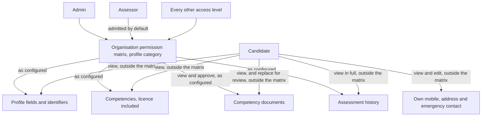
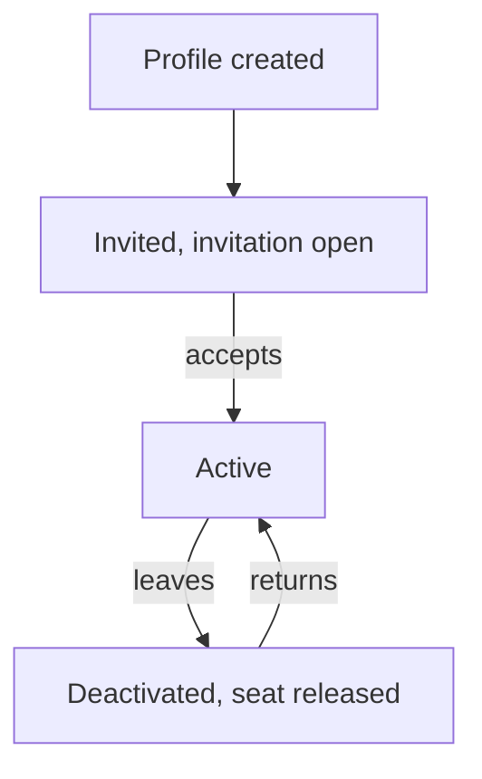

# Candidate Profile - Plan

## Goal Capsule

- **Objective.** Give every candidate a full workforce record — personal details, organisation-assigned identifiers, where they are placed, documents, competencies and assessment history — held on the person rather than scattered across form submissions.
- **Blocking prerequisite.** The Organisation Settings work in `docs/plans/2026-08-04-002-feat-organisation-settings-plan.md`, which builds the Location and Department lists and, within each Department, the Roles that Department offers. A profile cannot carry a Department until a customer can create one. That artifact also owns eight rules this one references rather than restates: voluntary training, competency expiry notification, compliance reporting, how standing is derived from Roles and how it splits from currency, assignment filling gaps and expiry reopening them, the pooled case that names no assessor, the union of parts across a person's Locations, and automatic marking together with the attribution a part it marks records.
- **Still open.** A selection of what Outstanding Questions carries, not the whole of it. How the new permission matrix category is divided — one switch for the whole profile or a switch per field, which are very different products and which decides the shape of the central mechanism here. What the prerequisite warning and the appeal conflict rule do on a case that names no assessor. Which Department's one-or-several-Roles setting governs a candidate placed in several that disagree. Whether a Business organisation may buy expansion blocks or must move tier once it fills its allocation, what a purchased seat block is over time, and which block size an overflow adds.
- **Not in this artifact.** The Assessor access level expansion, the mechanism that runs automatic assignment, and the interface that issues an invitation.

---

## Product Contract

### Summary

Give each candidate a single profile that is the organisation's workforce record for that person: identity and contact details, organisation-assigned identifiers, where they are placed by Location, Department and Role, real retrievable documents, and the competencies and assessment history already held elsewhere in the system.
Let the organisation decide who sees what on it: which profile fields and documents each access level may view, edit and approve is configured in the organisation's own permission matrix rather than fixed as a band in the product, with an assessor admitted out of the box to candidate profiles, the competencies and assessment history on them and the documents held against them, including approving those documents, so they can judge eligibility and approve training evidence. A candidate reads their own record in full, opens the competency documents held on it, edits only their own mobile, address and emergency contact — not their email address, which Admin holds — and may supply a replacement for a document held on them that stands aside until someone approves it; all of that is fixed rather than configured. Exporting that record is the one act no configuration opens up: it is Admin-only and every export is audited.
Retire a leaver by deactivating them, which shuts the door behind them at once and keeps every record intact so a returning worker keeps competencies that are still in date.

### Problem Frame

The system knows a candidate as a login — a name, an email and a way to sign in, and nothing else. Nothing in the system holds a workforce record for a person. Everything that makes someone a workforce member lives somewhere that is not attached to them.

That login is not incidental. Candidates sit assessments themselves: an assessment is split by part, the candidate completing the theory, knowledge and declaration parts while the assessor observes and records the rest, with per-part responsibility already modelled by the workflow builder. So a candidate is both the subject of a record and a user of the system, and the system holds nothing about them beyond the sign-in.

The rich personal data an operation collects — date of birth, address, ethnicity, Indigenous status, emergency contact, starter type, department, roles, induction date — exists only as answers on an induction form submission. It describes a submission event, not a person. Two submissions from the same worker are two unrelated records. A worker who never had an induction form completed for them has none of it. Nothing on the person's record can be queried, checked or kept current.

Documents fare worse. The induction model records only that a document was supplied: a present flag, a file name and a content type. The bytes are not held, so nobody can open a licence and see whether it is genuine or a plausible-looking fake. On competency records the same gap appears differently — evidence is a free-text reference pointing at some external register, display and audit only, with nothing that resolves it. An assessor is required to approve certificates and produce them as evidence of training competency, and today there is nothing to open.

Licences compound the problem. Treated as three flat fields on a form answer, a licence class, number and expiry sit outside every mechanism the system already has for things that go stale. Competency records carry granted dates, expiry, grace periods, revocation and a reason. A licence recorded as a form answer inherits none of that, so it expires silently and appears in no compliance check.

Meanwhile the assessment machinery already asks questions the person record cannot answer. An assessment tool declares the competencies a candidate must hold before a case is created and the competencies an assessor must hold to run it, including rules that vary by location. Location, department and role are exactly what will drive stream and pathway selection. None of it is on the person.

And there is no way to retire someone. A worker who leaves either stays as an active login consuming a seat, or is deleted along with the competency evidence that certified them.

### Key Decisions

**The profile is a full workforce record, not a thin identity record.**
A thin record would leave the induction data where it is, which is the problem. The organisation's obligation is to know who is on site, how to reach their next of kin, what they are certified to do and when that certification lapses. That is one record about a person, not a scatter of submissions.

**The field set is the existing induction intake, minus In Beakon and the three licence fields, plus two entered identifiers and a generated username.**
The intake set is already in production use, so it is the field set to adopt rather than redesign. The "In Beakon" field goes, because it names one customer's external learning system. Licence class, number and expiry go because a licence becomes a competency record. Employee Number and Swipe Card Number come in, because they are how the operation identifies a person on site and no form asks for them, and the generated username comes in because sign-in cannot hang off an address Admin corrects.

**A demographic question a person declines to answer is recorded, not left blank.**
Gender offers Undisclosed and Ethnicity offers Unknown, and choosing either records a decline rather than leaving a field empty, so a question that is required can still be answered honestly by someone who would rather not say. The alternative — a required field with no way to decline — would force a worker to disclose their ethnicity in order to be employed, which is not what requiring a field means. Indigenous status is not asked at all: it follows from the ethnicity answer, so the two can never contradict each other, and a declined or absent ethnicity leaves it not stated rather than reporting a fact about the person that nobody supplied.

**Field presence follows the intake already in use, and the identifiers a person arrives without are optional.**
The intake is in production and its own split between required and optional is the one to adopt rather than a stricter rule invented here — a middle name is optional there because plenty of people have none. Employee number, swipe card number and induction date are optional for a different reason: they genuinely arrive after the person does, and refusing to create a profile until they exist would stop an organisation recording someone it has already hired. A bulk import goes further and asks only for a name, an email address and where the person is placed, flagging what a row left empty rather than forcing whoever runs the import to invent demographic answers for workers they may never speak to. It asks for no identifier at all, because employee number and swipe card number stay optional on a typed profile indefinitely and a person holding neither is displayed by name alone, so demanding one on import would make migrating a workforce stricter than entering it by hand. The email address is on that short list because no profile exists without one at all, which is a precondition of creating a person rather than a field the import happens to want.

**One record per person per organisation, with Location, Department, Role and access level on the membership.**
A profile resolves to a single person record and to that person's single membership of the organisation, and it is the membership that carries where they are placed — Location or Locations, Department or Departments, Role or Roles — and the access level they hold. A person who works for two customers is one identity with a membership in each, so keying the profile on the membership is what keeps one organisation's view of them out of the other's, and what lets the same person hold a different access level and a different job in each.

**An email address is required to create a profile, and is not the same thing as an invitation.**
The address is captured onto the record so an email invite path can be built later, and it is what the person signs in with alongside their username. Delivering the invitation is a separate matter, so a printed QR code remains a legitimate way to hand someone their invitation even though their profile carries an address.

**A licence is a competency, not a profile field.**
Licence class, number, expiry and document have the exact shape competency records already handle. Recording a licence as a competency gives it expiry, grace periods, revocation and a place in prerequisite checks for free. Recording it as a flat field would rebuild all of that badly, or more likely not at all.

**A competency someone earned is theirs whether or not their current work still calls for it.**
So a competency required by a Role that still counts among the ones they hold is required, and one required by none of them demotes to optional and is kept. A Role stops counting by being withdrawn, and withdrawal never erases it from the record — it stays visible, marked, assigning nothing further and requiring nothing further, which is what makes the demotion possible at all. Retiring a value is not one of those ways: a retired Role goes on counting until remediation moves the person off it, because retirement is a statement about what may be chosen next rather than a judgement about the person. Withdrawing an assessment from what a Role requires works the same way and stops short of the cases already running against it: they finish, and what they produce stands as optional, because discarding part-assessed work to tidy a requirement list is the one thing demote-never-delete exists to prevent. How standing is derived and what a change of Roles does to it belong to the Organisation Settings artifact; what this one relies on is that a demotion destroys nothing.

**Currency is a set of dated states, and revocation is not one of them.**
Currency follows the competency's own dates and takes the four dated states the competency model computes — held, approaching expiry, inside grace and expired — with revocation lifted out of that set and carried as a mark of its own. Lifting it out is what makes the rule about it statable rather than implied: a revoked competency counts as not held wherever currency is read, so it satisfies no prerequisite however good its dates are, closes no requirement that automatic assignment would otherwise skip as already met, and leaves what a Role requires standing as a gap. That is exactly the person who must be reassessed, and reading dates alone would hide them. How standing and currency divide the work between them — obligation reads standing, eligibility reads currency — is the Organisation Settings artifact's rule, relied on here rather than restated.

**Documents are real files, and they are viewable.**
A present/absent marker proves a box was ticked, not that a licence is genuine. The point of holding a licence document is that a human can open it and look at it. That requires the file, not a note that a file once existed. Holding the bytes also means the address of a document is never the thing protecting it: a licence image carries a date of birth and a photograph, so a caller is admitted to it or is not.

**Who sees which profile field is the organisation's setting, not a band the product draws.**
Practice varies too much for a fixed band to be right. An assessor verifying identity against a driver's licence is standard in training and assessing, and some organisations run their assessors with full administrative access, so a product that hard-codes an assessor out of personal information is wrong for both of them. What each access level may view, edit and approve on a candidate profile is therefore configured by the organisation. Out of the box an assessor can view candidate profiles, the competencies and assessment history on them and the documents held against them, and can approve those documents, which is what lets them tell whether they may assess the person in front of them and which satisfies the regulatory obligation to view and approve certificates and produce them as evidence of training competency. Approving is a verb of its own rather than a shade of editing, because a document is approved without being changed. An organisation that wants it tighter tightens it. The one thing this is not is free: the permission matrix carries no category covering candidate profiles or personal information today, so making it configurable means adding one. There is precedent for banded reads — induction sensitive detail is already redacted by default and released only to a caller holding the export grant — but precedent is not a switch that already exists.

**A candidate reads their own assessment history in full.**
The candidate can already reach every case they are the subject of, with every attempt, its outcome and the reason recorded against it, so a profile that showed only the current outcome would show them less than they already have. The profile repeats that history rather than restricting it. Exporting it is not theirs, and not because the Candidate access level happens to carry no export: an export of a candidate's record is Admin-only.

**Exporting a candidate's record is Admin-only, and every export is audited.**
It is the most sensitive act in the product, because the document files ride along unredacted and a licence image carries a date of birth, an address and a photograph. So it is not a matrix setting an organisation can hand to an assessor or a reviewer, and every export is written to the audit, so a leak is traceable to a person and a moment.

**Approving a document records that it was sighted; rejecting one is not revoking a competency.**
An approval says a human opened the certificate and accepted it, which is what the obligation to sight training evidence actually asks for. Two things follow. A document nobody has approved yet blocks nothing — not checked yet is not the same as in doubt — and rejecting one flags it to an Admin to resolve with the person rather than withdrawing the qualification, because revocation means the qualification was taken away and a poor photograph is not that. Nothing is destroyed on the way either: a document a replacement supersedes is kept as evidence of what was held and sighted at the time, and removing one outright is Admin-only, audited and reasoned, for the case it exists for — a document uploaded to the wrong person's record.

**Role means the job someone does; access level means what they may do in the product.**
One word carried both ideas, which made the profile's Roles field indistinguishable from a permission grant. A person's Role places them in the work and drives which competencies they must hold. Their access level — Owner, Admin, Builder, Reviewer, Viewer, Assessor or Candidate — is what the permission matrix grants them, and it is administered separately from the job they do.

**A candidate's own access to their own record sits outside the matrix.**
Everything else on the profile is the organisation's to configure, but a person reading the record their employer holds about them is not a permission an organisation grants itself out of. So the candidate's read of their own profile and their own assessment history, and their write of their own mobile, address and emergency contact, are fixed here rather than being a setting anyone can turn off.

**A generated username, not the email address, is the sign-in identity, and everyone gets one.**
An email address is a field Admin corrects, and if sign-in hung off it a correction would move the person's identity with it. That reasoning is about signing in rather than about candidates, so every person the organisation holds a record for is issued a unique username built from their first initial, their last name and a random number, whatever access level they carry, and may sign in with either that username or their email address.

**A candidate is displayed by first and last name paired with an organisation identifier the organisation picks.**
Two workers share a name often enough that a name alone is not an identification. The middle name does not help on a screen, so it stays off the display name and the employee or swipe card number carries the identification instead. Both of those are unique within the organisation, so either can tell two people apart, and which of the two is shown is the organisation's own setting rather than a rule the product fixes — some operations know their people by a payroll number and some by the card they badge in with. Because both are optional, the display falls back rather than failing: a person holding only the number the organisation did not choose is shown by that one, and a person holding neither is shown by name alone.

**The candidate edits their own mobile, address and emergency contact, and supplies replacement documents that wait for approval.**
Those details go stale and the person is the best source for them. Employee number and swipe card number are the organisation's to issue and to correct, so they are not the person's to write. A competency document is unlike both, because the person holds the certificate: they can open what is filed against them and supply a better copy of a licence photographed badly or a card since renewed. What they supply is a submission rather than an edit — it becomes the record's evidence only when someone admitted to approve documents accepts it — which is exactly what keeps the rule that a candidate edits only their contact details true rather than quietly widened. It is new capability all the same: nothing in the product lets the subject of a record put a file into it today.

**Leaving is deactivation, not deletion, and not revocation.**
Deactivation keeps every record indefinitely, so a returning worker keeps competencies that are still in date. Nothing expires and nothing is purged. Revocation means the qualification was withdrawn — a judgement about competence, which leaving is not. What deactivation does end is reach into the product: a session the person is already signed into ends at once rather than running on, and an invitation they never accepted is closed rather than left standing for someone who has gone, because a record kept forever is not the same as a door left open.

**A candidate seat is consumed by an active candidate, not by a profile and not by an invitation.**
A profile exists before an invitation is accepted and an invitation never expires of its own accord, so if either consumed a seat an organisation would pay for people who have not arrived and may never arrive. The seat follows the active membership carrying the Candidate access level, which is also what deactivation releases and what granting that access level to an existing member takes up.

**The included candidate allocations are 100 on Business and 500 on Enterprise.**
Those are the numbers the product owner has decided on, and a requirements contract states the target. The plan configuration in the code carries different ones — Business 200 and Enterprise unlimited — and is being brought into line separately, so the code is the starting point rather than the statement. Both included allocations are therefore finite, which means the overflow rule reaches an organisation on either tier rather than a Business organisation alone, and the two tiers below still enrol no candidates at all.

**Additional candidate seats are sold in blocks, and a larger block costs less per seat.**
A block of 50 is charged at the per-seat list price, a block of 100 carries a 15 percent discount and a block of 500 carries a 25 percent discount, so an organisation that knows it is growing is rewarded for committing up front. The per-seat list price is not yet set.

**Exceeding a finite candidate seat allocation adds seats rather than blocking the action.**
Refusing a reactivation or a new candidate at the allocation boundary stops work on a site in order to settle a billing question. So any action that would take an organisation past a finite allocation goes through, and a block of candidate seats is added automatically and charged. A tier that enrols no candidates never expands into an allocation at all.

**Retiring a taxonomy value never blocks the people who hold it, and never changes what they must maintain on its own.**
A Location, Department or Role the organisation stops using is kept on the records that already carry it, marked as retired, and withdrawn from the choices offered on a new one. A retired Role goes on counting among the Roles the person holds until remediation moves them off it: demoting their competencies at the moment the value is retired would change what they must maintain before anybody had decided where they now work, and it would do it to a person who has not moved. What the move off it does — withdrawing the Role, demoting the competencies it alone required, destroying nothing — is the same demotion any other change of Roles runs through, so nobody is stopped while the affected people are reassigned.

**A person may hold several Locations and several Departments, and the Roles their Department offers.**
Real workforces place people across more than two sites, so the settings that allow more than one Location or Department carry no cap of two and never hard-block. Roles are the Department's to govern in both directions. A Department carries its own list of the Roles it offers, and a person placed in it may hold only those; it declares besides whether they hold one of those Roles or several, and a Department set to several puts no ceiling on the number, so an operator running three machines holds three Roles and receives what all three require. The two halves have one reason behind them: an offered set that was every Role in the organisation would let an administrator record a combination the site does not induct, which is exactly what the one-or-several setting beside it exists to stop. The product already behaves this way, the intake the field set is adopted from carrying a separate role field per department that is shown only when that department is chosen, so one department offers machine roles and another offers trades. It follows that a Role a candidate holds that their Department stops offering is withdrawn from them. A person holding several Roles loses nothing to holding several — that they sit one assessment covering the union of what their Locations require, once, rather than the same assessment twice, is the Organisation Settings artifact's rule and is relied on here.

**What the profile owes automatic assignment is the person's Roles and their Locations.**
The Organisation Settings artifact owns what assignment then does: that it fills gaps rather than reissuing what someone already holds, that an expiry reopens the gap so renewal is continuous rather than a one-off when someone is placed, that the case it opens names no assessor and waits for anyone eligible at its Location, and how the Location such a case records is chosen where the parts came from several. This artifact states what the profile must hold for those rules to run — Roles that still count, Locations that are real list values, and competencies whose currency and revocation mark can be read — and takes the rules themselves as given.

### Actors

A1. **Admin** — a person holding the Admin access level. Creates candidates, and enters and edits every profile field their organisation's matrix admits them to, which out of the box is all of them. Attaches documents, records competencies, and deactivates and reactivates people. Resolves a document an approver rejected, approves the voluntary training a candidate asks for, works the follow-up list of incomplete records, and is the only access level that can export a candidate's record or remove a document from one.

A2. **Assessor** — a person holding the Assessor access level, who runs assessments. Records the assessor-required parts of any case they are eligible for. What they see on a profile — fields, competencies, assessment history and documents alike — is whatever their organisation's matrix admits them to, which out of the box is the profile in full, so on the defaults they read a candidate's competencies and history to judge eligibility, and view and approve the competency documents held on them — or reject one, which sends it to an Admin to resolve with the person and withdraws no qualification.

A3. **Candidate** — the workforce member being assessed, holding the Candidate access level. Signs in and completes the assessment parts assigned to them, reads their own profile and their own assessment history, opens the competency documents held on their record, and edits their own mobile, address and emergency contact, which are the only fields they write — their email address is Admin's to correct. May supply a replacement for a document held on them, which waits for approval rather than taking effect, and may ask for training no Role of theirs requires, which an Admin approves and assigns.

A4. **Human Resources** — the team who completes the induction intake form on the candidate's behalf, recording only what the candidate has supplied to them. The candidate does not fill the form in. The answers Human Resources records are what a new profile can be seeded from.

Owner is not listed as an actor of its own because it carries no behaviour of its own here: the Owner access level holds everything Admin holds, so every rule in this artifact that reads Admin-only admits an Owner alongside the Admin and nobody else.

### Requirements

**Profile content**

R1. Each candidate in an organisation has exactly one profile, and that profile is the organisation's workforce record for that person. A profile resolves to one person record and to that person's single membership of the organisation, and it is the membership that carries where they are placed — the Location or Locations, the Department or Departments and the Role or Roles they hold — together with their access level. A person working for two organisations therefore holds one profile and one membership in each, and neither organisation reaches the other's.

R2. The profile carries the field inventory below.

R3. The display name is derived from first and last name; the middle name does not take part in it.

R4. Location, Department and Roles are chosen from the organisation's own named lists, and a value the organisation has retired is not among the choices offered. The Roles among those choices are the ones the Department the candidate is placed in offers, because the Role list is carried per Department rather than being flat, which is the Organisation Settings artifact's rule and is relied on here.

R5. A candidate holds one Location and one Department, unless the organisation has enabled multiple locations or multiple departments. Neither setting caps a person at two, and neither hard-blocks: a person holding several Locations or several Departments is placed in all of them.

R6. A Department constrains both which Roles a candidate placed in it may hold and how many. Every Role a candidate holds is one that a Department they are placed in offers, and they hold one such Role, or several where that Department is set to allow several. A Department set to several puts no ceiling on the number, so an operator running three machines holds three Roles. Both the set of Roles a Department offers and its one-or-several setting are held with the Department list in Organisation Settings; this artifact relies on them rather than defining them. How many is asserted here only for a candidate placed in one Department: where R5 places a candidate in several Departments whose settings disagree, which of them governs is unresolved, is the Organisation Settings artifact's open blocker, and is carried under Outstanding Questions here rather than answered. Which Roles are on offer raises no such disagreement, because a Role any Department the candidate is placed in offers is a Role they may hold.

R7. Employee number and swipe card number are organisation-assigned identifiers entered by Admin. Each is unique within the organisation, so neither can be issued to two people at once and either can tell two people of the same name apart. Which of the two the organisation displays beside a candidate's name is an organisation setting held with the Organisation Settings work; what that choice resolves to on screen, including where a candidate holds only one of them or neither, is stated here under R24.

R8. Fields classed as sensitive are marked as such on the profile so downstream reads can redact them.

R9. A person's access level is granted by the permission matrix and is carried on their membership of the organisation under R1 rather than on the profile, so the same person may hold a different access level in each organisation they work for.

R10. A profile exists from the moment the candidate record is created, before the candidate accepts an invitation.

R11. Location, Department and Role place the candidate, and are the fields later work will read to select an assessment stream and pathway. The Location a candidate holds names the same axis an assessment case already records, so the two carry one vocabulary rather than two that have to be reconciled.

R12. Field presence on the profile follows the induction intake the field set is adopted from: a field the intake requires is required on the profile, and the middle name is optional because the intake treats it as optional. Employee number, swipe card number and induction date are optional whatever the intake does with them, because they arrive after the person does and refusing the profile until they exist would stop an organisation recording someone it has already hired. Location is required alongside the Department and Roles beside it. The inventory table states the presence of every field.

R13. Gender and Ethnicity are required, and each offers an explicit value for a candidate who declines to state them — Undisclosed on Gender and Unknown on Ethnicity. Choosing one records a decline rather than leaving the field blank, so a required demographic question can still be answered by someone who would rather not say. Indigenous status is not among them, because nobody enters it: its third value, not stated, is what R15 derives from a declined or absent ethnicity.

R14. Gender is chosen from Male, Female and Undisclosed. Ethnicity is chosen from Aboriginal, African, Asian, Caucasian, Chinese, Eurasian, Indian, Malay, Others, Torres Strait Islander and Unknown. Starter type is chosen from New starter and Transfer.

R15. Indigenous status is derived from the Ethnicity answer and is entered by nobody. An ethnicity of Aboriginal or Torres Strait Islander reads as Indigenous, any other stated ethnicity reads as not Indigenous, and an ethnicity of Unknown or no ethnicity at all leaves it not stated. It is read-only and carries three values so that it can never contradict the answer it comes from, and so that not stated is never reported as not Indigenous.

R16. An email address is required, so no profile can be created without one.

R17. The email address is held on the record independently of how the invitation reaches the person, and an invitation may still be handed over as a printed QR code rather than sent to that address.

R18. Files may follow the record: the profile picture and any competency document can be supplied after the profile exists, and stay owed until they are. An owed file marks the record it belongs to and lists it for follow-up. It blocks nothing — no case, no assessment and no competency waits on a file that has not arrived — which is the same warn-rather-than-block disposition an unsatisfied prerequisite already takes.

R19. A bulk import row must carry the person's name, an email address and their taxonomy values — Location, Department and Roles. No identifier is required of a row: R12 leaves the employee number and the swipe card number optional on a typed profile indefinitely and R24 states what is displayed for a candidate holding neither, so requiring one on import alone would make migrating a workforce stricter than entering it by hand. Every other field is optional on import, and no competency document is owed against a competency that import run loads. That waiver is scoped to the run that needed it: a competency recorded on the same person after the import owes its document exactly as any other does, so a one-off migration concession never becomes the standard for recording competencies day to day. A row missing any of that reduced set creates no profile and is reported as a failed row, because R16 admits no profile without an email address and the person record is keyed on one. A row that creates a profile but leaves optional fields empty is flagged for follow-up naming exactly what it left empty, so an organisation can see the gap rather than have whoever runs the import invent demographic answers for a worker they may never speak to.

R20. Everything outstanding on a record surfaces on one follow-up list an Admin works through — a file still owed under R18 and a field an import row left empty under R19 alike — so an Admin sees every incomplete record in one place rather than finding them one profile at a time. The list gates nothing; it is a working list rather than a hold on the records it names.

| Field | Required at creation | Sensitive | Unknown option | Who may edit |
| --- | --- | --- | --- | --- |
| First name | Yes | No | No | Admin |
| Middle name | Optional | No | No | Admin |
| Last name | Yes | No | No | Admin |
| Display name | Derived | No | No | Derived, not edited |
| Username | Generated | No | No | Generated, not edited |
| Gender | Yes | No | Yes | Admin |
| Ethnicity | Yes | Yes | Yes | Admin |
| Indigenous status | Derived | Yes | Derived — not stated | Derived, not edited |
| Date of birth | Yes | Yes | No | Admin |
| Address street | Yes | Yes | No | Admin, candidate |
| Suburb | Yes | Yes | No | Admin, candidate |
| Postcode | Yes | Yes | No | Admin, candidate |
| Mobile | Yes | No | No | Admin, candidate |
| Email | Yes | No | No | Admin |
| Emergency contact name | Yes | No | No | Admin, candidate |
| Emergency contact phone | Yes | No | No | Admin, candidate |
| Profile picture | May follow | No | No | Admin |
| Employee number | Optional | No | No | Admin |
| Swipe card number | Optional | No | No | Admin |
| Starter type | Yes | No | No | Admin |
| Department | Yes | No | No | Admin |
| Roles | Yes | No | No | Admin |
| Location | Yes | No | No | Admin |
| Induction date | Optional | No | No | Admin |

Licence class, number, expiry and document are not in this table — they are a competency record, covered by R33 to R36.
The required column states presence under R12: a field marked required must carry a value before the profile is created, an optional one may stay empty indefinitely, a field that may follow is owed under R18, and a derived or generated one is never entered. A bulk import row is held to the reduced set in R19 rather than to this column.
The sensitive mark drives redaction in exports and agent-facing reads, and document files are exempt from that redaction. It does not decide who may see a field on the profile itself — that is the organisation's own setting under R39, R40 and R55.
The Unknown column marks the two fields a person may decline to state under R13, and the derived not-stated value Indigenous status carries under R15. A required field answered with a decline counts as answered.
The "who may edit" column states who may write each field where the organisation's matrix admits the writer at all: the candidate writes only their own mobile, address and emergency contact, and Admin writes the rest. The replacement document a candidate may supply under R52 is not a write to any field here, because it waits for approval rather than landing on the record. Reading is a separate matter — the candidate reads their own fields in full under R49, and what any other access level reads is configured under R39 and R55.

**Identity and sign-in**

R21. Every person the organisation holds a record for is issued an automatically generated unique username formed from their first initial, their last name and a random number, whatever access level they carry. The rule reaches everyone who signs in rather than candidates alone, because correcting an email address must not move who the person is to the system for anyone.

R22. A person signs in with either their username or their email address.

R23. Changing the profile email does not change the username, and retires the old address as a sign-in identifier.

R24. A candidate is identified on display by the display name paired with an organisation-assigned identifier. Which of the two identifiers that is — the employee number or the swipe card number — is the organisation's own setting under R7. Because R12 leaves both optional, the display falls back rather than failing: a candidate holding only the identifier the organisation did not choose is shown by that one, and a candidate holding neither is shown by their display name alone until one is issued. Neither fallback is an incomplete record on the follow-up list under R20, because R12 leaves both identifiers optional indefinitely rather than owed.

**Documents and evidence**

R25. Profile picture and licence document are stored as real retrievable files that can be opened and viewed.

R26. Recording that a document was supplied is not sufficient; the file itself is held.

R27. A licence document is viewable so a human can judge whether the licence is genuine.

R28. A competency record can carry one or several attached documents rather than only a free-text pointer at an external register.

R29. Document files are not redacted from exports.

R30. A stored file is retrievable only by a caller the organisation admits. Knowing a document's address is never on its own enough to open it.

R31. A competency document that a replacement supersedes is retained as evidence of what was held and sighted at the time, and stays retrievable alongside the document that replaced it.

R32. Removing a document from a record altogether is Admin-only, is audited and carries a reason. It exists for the document uploaded to the wrong person's record rather than as a way to tidy a record, so a superseded document is retained under R31 rather than removed.

**Licence as competency**

R33. A licence is recorded as a competency, not as a flat profile field.

R34. The licence competency carries licence class, licence number, expiry and the licence document.

R35. The licence inherits expiry dates, grace periods and revocation from the competency model.

R36. The licence appears in prerequisite and compliance checks alongside every other competency.

**Profile surface**

R37. A candidate's competencies render on their profile, each showing its standing and its currency.

R38. A candidate's assessment history renders on their profile. The candidate reads it in full: every case they are the subject of, with every attempt, its outcome and the reason recorded against it, whatever state the case is in. Exporting that history is not part of what they read, because an export of a candidate's record is Admin-only under R54. Who else reads it is a matrix setting under R39, and an assessor reads it out of the box under R55.

**Visibility and editing**

R39. Which profile fields and which documents a given access level may view, edit and approve is configured by the organisation in its own permission matrix. Approving is a verb of its own rather than a shade of editing, because a document is approved without being changed and an access level admitted to view a document is not thereby admitted to approve it. The product draws no fixed visibility band of its own.

R40. The permission matrix carries no category covering candidate profiles or personal information today — its categories are forms, submissions, team, billing, audit and assessments — so making profile visibility configurable means adding one. That is new work rather than a switch that already exists.

R41. Out of the box an assessor may view a candidate's competencies and their assessment history; the organisation may tighten or loosen that in its matrix under R39.

R42. Out of the box an assessor may view and approve any competency document held on a candidate; the organisation may tighten or loosen that in its matrix under R39.

R43. Approval is recorded against the document as evidence that the certificate was sighted and accepted, and changes neither the competency's currency nor its standing nor whether it satisfies a prerequisite.

R44. Fields and documents are configured separately, so an organisation that restricts an access level's reach into profile fields does not thereby restrict its reach into documents. A competency document stays open to an assessor even where it prints personal detail such as a date of birth, an address or a photograph, unless the organisation restricts documents in their own right.

R45. A competency document can be produced as evidence of training competency by a reader the organisation's matrix admits to it, which out of the box includes an assessor.

R46. A document that has not been approved blocks nothing. It has not been checked yet rather than being in doubt, so the competency it belongs to keeps its currency, its standing and its place in prerequisite checks until someone looks at it.

R47. A reader the organisation admits to approving a document may reject it instead. Rejection flags the document to an Admin to resolve with the person, and revokes no competency: revocation means the qualification was withdrawn, which an illegible photograph is not. The competency keeps its currency and its standing exactly as R43 and R46 leave them.

R48. An assessor's reach is every candidate in the organisation rather than only candidates on a case assigned to them, wherever the organisation admits assessors to profiles at all.

R49. A candidate reads every field on their own profile, including the fields marked sensitive. This is fixed rather than configured, and no matter how an organisation sets its matrix it cannot take that read away.

R50. A candidate opens every competency document held on their own record. Like their read of their own fields under R49, this is fixed rather than configured, and no setting of the matrix takes it away.

R51. A candidate edits only their own mobile, address and emergency contact.

R52. A candidate may supply a replacement for a competency document held on their own record. The replacement takes effect only when it is approved: until then the document already held stands as the record's evidence, so what the candidate supplies is a submission for review rather than a write to the record, and R51 stands unwidened. A replacement waiting for review sits in an approval queue worked by a reader the organisation admits to approving documents, which out of the box is an assessor under R42, and once accepted it becomes the document held while the one it replaces is retained under R31. A replacement that is rejected never becomes the record's evidence and is not discarded either: it is kept as a record of what the candidate submitted and when, alongside the document that stayed in force. The candidate is told the outcome whether the replacement was accepted or rejected, and nothing stops them supplying another. This is not the rejection R47 covers, which acts on a document already held on the record and flags it to an Admin; a rejected replacement leaves the record exactly as it was.

R53. Employee number and swipe card number are the organisation's to issue and to correct, so they are never the candidate's to write. Which other access levels may write them is a matrix setting under R39.

R54. Exporting a candidate's record is Admin-only, which admits an Owner with the Admin as the level holding everything Admin holds and admits nobody else. No other access level holds it however the organisation sets its matrix — not the assessor admitted to the profile by default, and not the candidate reading their own record in full under R49. Every export is recorded in the audit naming who ran it and when, because the document files ride along unredacted under R29 and a leak must be traceable to a person and a moment.

R55. What R41 to R45 grant an assessor is the setting the matrix ships with rather than a band the product fixes: on the defaults an assessor can view candidate profiles, the competencies and assessment history on them, and the documents held against them, and can approve those documents, which is the verb R39 keeps distinct from viewing and editing. An organisation may tighten or loosen every part of that, and every other access level's reach into a candidate profile is a matrix setting on the same footing.

R56. The candidate's name remains visible on the assessment surfaces that show it today, including cases and sign-off.

R57. Every profile edit is audited, recording who changed which field and when, and keeping both the old and the new value.

R58. Audit entries covering sensitive fields are readable by Admin only.

Every access level reaches a candidate profile through the matrix rather than through a band the product draws, which is why no edge runs straight from an access level to a field. Assessor is drawn separately only because it is admitted by default; every other level is one node because none carries a rule of its own. The edge to documents carries approving as well as viewing, because R39 keeps the two apart. The candidate's edges bypass the matrix entirely, because their read of their own record, their read of the documents held on it and their write of their own mobile, address and emergency contact are fixed by R49, R50 and R51. Their edge to documents carries a replacement that waits for approval under R52 rather than a write. Their edge to assessment history is a read in full rather than a summary; what they hold no edge for is exporting it, which R54 keeps to Admin.

**Assessment record immutability**

R59. A profile edit never alters an assessment record that has already been signed.

R60. An unsigned attempt keeps the name captured when the attempt was created.

R61. The organisation-assigned identifier shown beside a candidate's name is read live from the profile and is never captured onto a case or an attempt. Unlike the name, which R60 keeps as it was captured, a corrected identifier corrects itself everywhere it appears.

**Lifecycle**

R62. A candidate who leaves is deactivated, never deleted.

R63. Deactivation retains every record for that person indefinitely and with no expiry, including competencies, documents and assessment history.

R64. A deactivated candidate cannot sign in or be assigned new assessments.

R65. Deactivation takes effect on the person's reach into the product immediately: a session they are already signed into ends at once rather than running until it would have lapsed, and an invitation they never accepted is closed rather than left open. Retaining every record under R63 and closing the way in are different acts, and deactivation does both.

R66. Deactivation revokes no competency.

R67. Revocation remains a separate act carrying its own reason, and acts on a competency rather than on the person.

R68. A deactivated candidate can be reactivated if they return.

R69. On reactivation, competencies still inside their expiry remain valid without reassessment.

R70. The grace clock keeps running while a candidate is deactivated.

R71. An assessment case in flight when the candidate is deactivated becomes invalid.

R72. An invalidated case and every attempt already signed on it are retained as history, whether or not the candidate ever returns.

R73. When a case is invalidated by a deactivation, every assessor eligible for that assessment tool at the case's Location is notified, and the assessor named on the case as well where it names one. A case created by automatic assignment names none under R116, which is why the notification reaches the eligible pool rather than an individual.

R74. A reactivated candidate begins that assessment as a new case rather than resuming the invalidated one.

R75. An invitation does not lapse with time; it stays open until it is accepted or until R65 closes it on deactivation.

R76. A reactivated candidate who had already accepted their invitation needs no fresh one. A candidate deactivated before they ever accepted is invited again, because R65 closed the invitation they were holding.

R77. Deactivating a candidate releases their candidate seat.

R78. Reactivating a candidate consumes a candidate seat, and proceeds even when no seat is free.

The states are the whole of what the diagram carries. What each transition does to records, competencies, cases, sessions, invitations and seats is stated in R62 to R78, including the path the diagram does not draw — a candidate deactivated while their invitation is still open, whose invitation R65 closes and R76 reissues on their return.

**Candidate seats**

R79. A candidate seat is consumed by an active membership of the organisation carrying the Candidate access level, and by nothing else.

R80. Creating a profile consumes no candidate seat and issuing an invitation consumes none, so both may happen while the allocation is full and neither triggers a charge. The seat is consumed when the person becomes an active member.

R81. Granting the Candidate access level to a person who is already an active member of the organisation consumes a candidate seat and releases the staff seat they were holding, because the two pools are complementary — everyone who is not a candidate is staff. The grant passes the same allocation rule as any other action that consumes a candidate seat.

R82. A tier's included candidate allocation is 100 candidate seats on Business and 500 on Enterprise. Both are finite, so both can be reached and R86 governs what happens when one is.

R83. A tier configured to enrol no candidates enrols none, and no seat block reaches it. Individual and Team each carry an allocation of zero, which the plan configuration states means the tier cannot enrol candidates at all.

R84. Additional candidate seats are sold in blocks of 50, 100 and 500. The block of 50 is charged at the per-seat list price, the block of 100 at a 15 percent discount and the block of 500 at a 25 percent discount.

R85. The per-seat list price for additional candidate seats is unset.

R86. An action that would take an organisation past a finite candidate seat allocation is not refused. A block of candidate seats is added automatically and charged instead. Both included allocations under R82 are finite, so the rule reaches a Business organisation and an Enterprise one alike, and a tier under R83 never expands into an allocation at all.

**Seeding**

R87. A new candidate can be seeded from an induction form submission instead of being typed from scratch.

R88. Seeding maps the submission's intake answers onto the profile fields they correspond to.

R89. Employee number and swipe card number cannot come from any submission, and are entered by Admin.

R90. Seeding carries across no document, because an induction submission holds only a marker that a document was supplied.

R91. Seeding does not create a second profile for a person who already has one.

R92. An induction submission for a person who already has a profile is routed to an Admin for review rather than creating a record.

R93. That review reports that the record already exists and asks whether the person should be reactivated.

R94. A submission raised after the organisation's lists exist can carry only Location, Department and Role values those lists hold, which is the Organisation Settings artifact's rule and is relied on here. Seeding therefore meets a value no list holds only on a historical submission — one raised before those lists existed, while the intake offered hardcoded options — and on such a submission the answer is read as a suggestion for where to place the person, with the Admin choosing from the organisation's current lists.

**Competency standing**

R95. A competency a candidate holds carries a standing of required or optional, derived from the Roles they hold rather than set by hand. The Organisation Settings artifact states that derivation and the split it rests on — standing governs obligation and follows the person's Roles, currency governs eligibility and follows the competency's own dates — and states what a change of Roles does: a competency required by a Role that still counts is required, one required by none of them demotes to optional, a demoted competency is neither deleted nor revoked, and the same demotion covers a job move, a Department tightened from several Roles to one, a Department that stops offering a Role somebody holds, and remediation moving someone off a retired Role. This artifact relies on all of that rather than restating it. What it fixes on its own account is the currency vocabulary standing is read beside, under R100 and R101, and how the two render together on the profile under R37 and R104.

R96. A candidate may acquire a competency no Role of theirs requires by asking for the training. The Organisation Settings artifact states that path — the request is the candidate's to make on their own record, an Admin approves it and assigns the package, there is no self-service enrolment and no catalogue the candidate browses, and what the training produces stands as optional — and states too that a candidate whose optional competency expires may refresh it by that same route and is not obliged to. This artifact relies on it, and adds only that the request is an act on the candidate's own record rather than something the matrix under R39 grants or withholds.

R97. An assessment withdrawn from what a Role requires does not disturb a case already in flight against it. The case runs to completion, and the competency it produces is held and stands as optional where no Role its holder still carries requires it, rather than being discarded, so a change to a requirement list never throws away part-assessed work.

R98. The Organisation Settings artifact states that competency expiry is notified to the person directly for a competency of either standing, wherever they are reachable, and that anyone no notification reaches surfaces on the compliance list an Admin works through. This artifact relies on that rule and supplies what it depends on: R16 requires an email address of every profile, which is what lets a person brought in by bulk import — who may never have signed in — be reached at all.

R99. The Organisation Settings artifact states what compliance reporting counts and what it distinguishes: only a required competency counts toward compliance, a required lapse is distinguished from an optional one, and a competency a Role the candidate holds requires and they have never held is reported as a gap separately from one they held and let expire. This artifact relies on that rule, and adds only what R101 fixes — that a revoked competency leaves what a Role requires standing as exactly such a gap.

R100. Currency follows the competency's own dates and carries four states — held, approaching expiry, inside grace and expired — of which held, approaching expiry and inside grace all still count as held. The competency model reports revoked among its currency states today; taking it out of that set and carrying it under R101 instead is a change to that model rather than a reading of it, and the four dated states are unchanged.

R101. Revocation is a mark carried on a competency separately from its currency and its standing, and a revoked competency counts as not held wherever currency is read. It satisfies no candidate prerequisite under R102 however good its dates are and whatever its standing, it closes no requirement that automatic assignment under R115 would otherwise skip as already met, and what a Role requires of its holder stands as the gap R99 reports. Revoking a competency and demoting one to optional are different acts with different meanings.

R102. A competency that is in date or inside its grace period and is not revoked satisfies a candidate prerequisite whatever its standing.

R103. A competency that has expired satisfies no candidate prerequisite, whatever its standing. It is reported as a gap rather than refusing the case, which is the disposition the prerequisite check already takes: an out-of-date record is far more common than an unqualified person, and a wrong date must not stop a real assessment being written down.

R104. A required competency is distinguishable on the profile from an optional one.

R105. A competency brought in by bulk import keeps the grant date it already carried and is never dated from the day it was loaded, so importing a record does not reset its clock.

R106. A competency's expiry follows from its grant date and the validity period of the qualification it is held against. An expiry recorded on the competency itself is an override for a record whose real expiry does not follow that rule, such as one imported carrying an expiry of its own, and it is not carried forward onto a fresh grant. A qualification with no validity period never expires, and a competency held against it counts as held on its dates alone, subject to R101 where it is revoked: revocation is decisive over dates, so a revoked competency held against a qualification that never expires counts as not held like any other.

**Retired taxonomy values**

R107. A candidate holding a Location, Department or Role value that the organisation retires keeps that value on their record.

R108. A Role stops counting among the Roles a candidate holds when it is withdrawn from them — under R111 where a Department stops offering it, under R112 where a Department tightened to one Role leaves it unchosen, or by an ordinary reassignment moving the candidate off it. Withdrawal is the only way a Role stops being held. Retirement is not one of those ways: a retired Role stays on the record, is marked under R109, and goes on counting until remediation moves the candidate off it, which is the Organisation Settings artifact's rule and the one this artifact follows. Nothing erases a Role a candidate was placed in, and a withdrawn Role assigns nothing further and requires nothing further while it stays visible. Every rule reading the Roles a candidate holds reads only the ones that still count — the standing rule R95 relies on, and assignment under R114.

R109. A retired value is marked as retired wherever it appears on the profile, and a Role withdrawn under R111 or R112 is marked as withdrawn in the same way, so a reader can tell a Role that still counts from one that does not and can tell a value that may no longer be chosen from one that was taken away.

R110. Reassigning a candidate off a retired value is an ordinary Admin profile edit, and it is that edit rather than the retirement that withdraws the Role and moves what the candidate must maintain.

R111. A Role a candidate holds that their Department stops offering is withdrawn from them: it stops counting under R108, it is marked under R109, and standing recomputes under R95. No choice is offered, because the Role is no longer available to that candidate at all and there is nothing to choose between, which is what separates this from the tightening R112 covers, where every Role the person holds remains available and only the number allowed has changed.

R112. A Department tightened from several Roles to one applies to the people already placed in it, blocks nothing and destroys nothing. Every Role such a person holds remains available to them, so which one survives cannot be inferred from the tightening: the affected people surface for an Admin who picks per person, because which Role someone actually does is a human judgement. Each Role not chosen is withdrawn under R108 and marked under R109, and a competency it alone required demotes under R95. Where that review is presented is parked with the Organisation Settings work under Scope Boundaries.

R113. A bulk transfer moving candidates off a retired Role or Department recalculates competency standing under R95 and leaves every case in flight untouched, because a case records a Location and neither a Role nor a Department, so there is nothing on it to rewrite. Only a Location transfer reaches an in-flight case at all, and the Organisation Settings artifact offers the Admin two outcomes for those cases: carry them unchanged so they keep the Location they were assessed at, or rewrite them to the replacement Location. A third outcome that voids a case so it restarts is not among them — that artifact carries it as an open question, because nothing in the product can void a part-assessed case today — so this artifact advertises the two that exist and points at that question for the third.

**Assignment and cases**

R114. Required assessments are assigned from the Roles a person holds that still count under R108, taken together across every one of them, so a person holding several Roles receives what every one of them requires and a Role marked withdrawn contributes nothing. Which parts of each assessment are required is selected by the Locations they hold, taken as the union under R117. A Department carries no assessments of its own: it classifies assessments by type, offers the Roles a person placed in it may hold, and declares whether they hold one of those Roles or several, the last two under R6.

R115. Automatic assignment creates no case for a requirement the person already meets, and an expiry reopens it. The Organisation Settings artifact states that rule — a requirement met by competencies that are all in date or inside their grace period raises no case, the requirement becomes unmet and is assigned again when one of them expires, and this holds identically wherever assignment happens, when a person is placed, on a retrospective change to what a Role requires or to which parts a Location requires, and during a bulk import. This artifact relies on it, and adds only what R101 fixes: a revoked competency closes nothing, so a requirement it would otherwise have appeared to meet is assigned.

R116. A case created by automatic assignment names no assessor and belongs to a pool. The Organisation Settings artifact states that rule, that any assessor may record any assessor-required part, that eligible means holding the assessment tool's assessor competencies for the case's Location, and that eligibility is what the check reads when the attempt is marked and warns rather than refusing — it names what is checked rather than gating who may record a part. It also states which Location such a case records: the one the person's own record carries, and where R117 draws the case's parts from more than one of the Locations they hold, the Location whose rule contributed the most parts — with a tie between Locations contributing the same number resolved to the one whose assessor requirement for that tool is the most demanding, which is the ordinary case rather than an edge because a Location with no parts rule contributes every part. This artifact relies on all of that; what it fixes on its own account is that the Location is read from the candidate's record, and that R73's notification therefore reaches an eligible pool rather than an individual.

R117. Where a person holds several Locations and an assessment's required parts differ between them, they sit one case covering the union of every part any of their Locations requires, are assessed once, and the result is valid across those Locations. That rule, and the default that a Location for which the assessment tool declares no parts rule contributes every part to the union so the union is never narrowed by an unconfigured site, belong to the Organisation Settings artifact. This artifact relies on them and states only that the Locations read are the ones the candidate's record carries.

R118. Marking turns on whether every question in a part carries an answer key rather than on whether it is a theory part. The Organisation Settings artifact states that a part every question of which carries a key is marked automatically and needs no assessor, and that a part where any question carries none — wholly unkeyed or only partly keyed — goes to an assessor to mark by hand, because a part marked against only the keys it happens to hold would leave its remaining questions unchecked. A practical demonstration carries no key and so always needs an assessor. That artifact also states the attribution a part marked automatically carries: it records that it was marked automatically and names no person, which is the exception carried by the rule that every part records who marked it and the printed name they marked it under, a rule that holds for every part a person marks. This artifact relies on all of that, and adds only why no name would serve: recording one would assert that a person exercised judgement on the part when nobody did, whatever the case around it names, and on a case created by automatic assignment R116 leaves not even a named assessor to borrow.

### Key Flows

F1. **Create a candidate profile from scratch**
**Trigger:** Admin is adding a worker the system holds nothing about.
**Actors:** A1 Admin.
**Steps:** Admin starts a new profile; Admin enters the identity, contact and demographic fields, picks Location and Department from the organisation's own lists and then Roles from the ones that Department offers, a Role no Department they are placed in offers not being available to them at all; a worker who declines to state their gender or ethnicity is recorded as Undisclosed or Unknown rather than left blank, and their Indigenous status follows from the ethnicity answer rather than being asked; an email address is among the fields the profile cannot be created without, whether or not the invitation will be sent to it; Admin enters the employee number and the swipe card number where the organisation has issued them, and leaves them empty where it has not; a middle name and an induction date may be left empty too; the person's access level is not part of the profile and is granted separately by the permission matrix, and it is their membership that carries it alongside where they are placed; the profile is saved and the person is issued their generated username; no candidate seat is consumed by the creation; the profile picture and any competency document can follow and stay owed until they do.
**Outcome:** the person holds one profile carrying the full field inventory, which exists before any invitation is accepted and before any seat is taken up.
**Covers:** R1, R2, R4, R5, R6, R7, R9, R10, R11, R12, R13, R14, R15, R16, R17, R18, R21, R80.

F2. **Seed a candidate from an induction submission**
**Trigger:** an induction form submission arrives for a person with no profile.
**Actors:** A4 Human Resources, A1 Admin.
**Steps:** Human Resources completes the induction intake form from what the candidate has supplied to them, recording Unknown where the candidate has declined to state a demographic answer; Admin opens the submission and chooses to create a candidate from it; the intake answers populate the matching profile fields and Indigenous status is derived from the ethnicity among them; where the submission is a historical one raised before the organisation's lists existed and carries a Location, Department or Role value no current list holds, Admin picks Location and Department from the organisation's own current lists and Roles from those the chosen Department offers instead, a branch that reaches no submission raised since those lists exist because such a submission can carry only values they hold; Admin supplies an email address where the submission carries none, and adds the employee number and swipe card number if the organisation has issued them; no document comes across, because the submission holds no file; Admin saves the profile.
**Outcome:** a profile exists for the person, holding everything the submission knew, with the organisation-assigned identifiers added whenever they are issued and documents still owed.
**Covers:** R2, R4, R7, R10, R12, R13, R15, R16, R18, R87, R88, R89, R90, R94.

F3. **Record a licence as a competency**
**Trigger:** Admin holds a candidate's licence document.
**Actors:** A1 Admin.
**Steps:** Admin opens the candidate's profile and records a licence competency with its class, number and expiry; Admin attaches the licence document to that competency; the competency appears on the profile with its expiry, its currency and its standing.
**Outcome:** the licence is subject to expiry, grace periods, revocation and prerequisite checks, and the document can be opened as evidence.
**Covers:** R25, R27, R28, R33, R34, R35, R36, R37, R100.

F4. **An assessor checks whether they may assess someone**
**Trigger:** an assessment case is about to be created for a candidate.
**Actors:** A2 Assessor.
**Steps:** the assessor opens the candidate's profile, which out of the box they may do for any candidate in the organisation; what they see there is whatever the organisation's matrix admits their access level to, which on the defaults is the profile in full; the profile shows the candidate's competencies with their standing and currency, and their assessment history; the assessor compares them against the tool's declared candidate prerequisites and their own assessor competencies; a competency the candidate holds optionally counts toward those prerequisites exactly as a required one does, because currency and not standing decides eligibility; a competency carrying a revocation mark counts for nothing however good its dates are, and what its Role required stands as a gap; an expired competency is reported as a gap rather than refusing the case; the assessor opens a certificate to check and approve it, which changes neither its currency nor its standing; a certificate they cannot read they reject instead, which flags it to an Admin and withdraws no qualification; a replacement the candidate supplied for one of those documents is waiting in the same queue and becomes the record's evidence only once it is accepted; a document nobody has approved yet has held nothing up.
**Outcome:** the assessor can tell whether the candidate is eligible to be assessed and whether they themselves are eligible to assess, and the training evidence has been approved, rejected or left to wait without any of it blocking the case.
**Covers:** R36, R37, R38, R39, R41, R42, R43, R44, R45, R46, R47, R48, R52, R55, R101, R102, R103, R104.

F5. **A candidate corrects their own contact details**
**Trigger:** the candidate has moved or changed phone number.
**Actors:** A3 Candidate.
**Steps:** the candidate signs in with their username or their email address and opens their own profile, reading every field on it; they edit mobile, address and emergency contact; every other field, including employee number and swipe card number, is read-only to them; the change is saved and audited with its old and new values; they open the competency documents held on their record, and where the copy on file is a poor photograph they supply a better one, which waits for approval rather than replacing what is held.
**Outcome:** the organisation's contact details for the person are current, nothing else on the record moved, and a replacement document is queued for someone to accept rather than written into the record by the person it is about.
**Covers:** R22, R49, R50, R51, R52, R53, R57.

F6. **Deactivate a leaver**
**Trigger:** the candidate leaves the organisation.
**Actors:** A1 Admin.
**Steps:** Admin deactivates the candidate; the profile, documents, competencies and assessment history are retained indefinitely; no competency is revoked; the session the candidate is signed into ends immediately, and an invitation they had never accepted is closed rather than left standing; any assessment case still in flight becomes invalid and is kept as history along with anything already signed on it; every assessor eligible for that tool at the case's Location is told it was invalidated, and the named assessor too where the case names one; the candidate can no longer sign in or be assigned assessments; their membership stops being active, so the candidate seat returns to the pool.
**Outcome:** the person is off the active roster and out of the product at once, the evidence they were assessed survives, the assessors who might have picked the case up know it is gone, and the seat is available for someone else.
**Covers:** R62, R63, R64, R65, R66, R71, R72, R73, R77.

F7. **Reactivate a returner**
**Trigger:** a previously deactivated candidate returns to the organisation.
**Actors:** A1 Admin.
**Steps:** Admin reactivates the candidate; the profile and its history reappear as they were; a candidate who had accepted their original invitation needs none reissued, while one deactivated before they ever accepted is invited again because that invitation was closed; competencies still inside their expiry are valid immediately; competencies that lapsed while the person was away show as expired rather than revoked; an assessment invalidated by the deactivation begins again as a new case; a candidate seat is consumed, and where none is free the reactivation still goes through and a block of candidate seats is added automatically and charged.
**Outcome:** the returner resumes with the certifications they legitimately still hold, and only the lapsed ones need reassessment.
**Covers:** R37, R66, R68, R69, R74, R75, R76, R78, R86.

F8. **Change a candidate's Roles**
**Trigger:** the candidate moves to different work within the organisation.
**Actors:** A1 Admin.
**Steps:** Admin edits the Roles on the candidate's profile, choosing among the Roles the Department the candidate is placed in offers, and reassigning them off any Role shown as retired in the same edit, which is the act that withdraws it rather than the retirement having done so; every competency still required by a Role the candidate holds stays required; a competency the candidate held optionally that a newly added Role requires becomes required; every competency now required by none of their Roles demotes to optional and is kept in full; nothing is deleted and no competency is revoked; the profile shows each competency's new standing beside its currency.
**Outcome:** what the candidate must maintain follows their new work, and the competencies they earned survive the move.
**Covers:** R6, R37, R95, R104, R108, R109, R110.

### Acceptance Examples

AE1. **Covers:** R41, R42, R44, R55.
**Given** a candidate whose profile holds a date of birth, an address and two current competencies, one of them carrying a licence image, in an organisation that has left its matrix on the defaults,
**When** an assessor opens that candidate's profile,
**Then** the date of birth, the address, the competencies, the assessment history and the licence image are all shown and the assessor can approve that image, because an assessor is admitted to candidate profiles and to viewing and approving their documents out of the box.

AE2. **Covers:** R51, R53.
**Given** a candidate viewing their own profile,
**When** they change their mobile number and attempt to change their employee number,
**Then** the mobile number saves and the employee number is not editable.

AE3. **Covers:** R15, R49, R51.
**Given** a candidate viewing their own profile,
**When** they look at their date of birth and their Indigenous status,
**Then** both are shown to them and neither is editable by them, Indigenous status because it is derived from their ethnicity rather than entered.

AE4. **Covers:** R13, R15.
**Given** a worker who tells Human Resources they would rather not state their gender or their ethnicity,
**When** their profile is created,
**Then** Gender is recorded as Undisclosed and Ethnicity as Unknown, both count as answered so neither required field is outstanding, and Indigenous status reads as not stated rather than as not Indigenous.

AE5. **Covers:** R1, R9.
**Given** a person who works for two organisations that both use the product,
**When** each organisation opens the record it holds for them,
**Then** each sees only its own profile for that person, and the membership each holds carries its own Location, Department, Role and access level for them.

AE6. **Covers:** R62, R63, R77.
**Given** an organisation using its last free candidate seat, and a candidate who has just left,
**When** Admin deactivates that candidate,
**Then** a candidate seat becomes free, and the candidate's competencies, documents and assessment history are all still retrievable.

AE7. **Covers:** R65, R75, R76.
**Given** a candidate signed in on a site tablet, and a second candidate holding an invitation they were handed as a printed QR code and have never accepted,
**When** Admin deactivates both,
**Then** the first candidate's session ends at once rather than running until it would have lapsed, the second candidate's open invitation is closed rather than left standing, and where both return the first needs no fresh invitation while the second is invited again.

AE8. **Covers:** R68, R69.
**Given** a candidate deactivated six months ago who holds a competency that expires in a year,
**When** Admin reactivates them,
**Then** that competency is valid immediately and no reassessment is required.

AE9. **Covers:** R37, R66, R67, R101.
**Given** a candidate deactivated two years ago who holds a competency that expired while they were away,
**When** Admin reactivates them,
**Then** the competency shows as expired, is not marked as revoked, and carries no revocation reason.

AE10. **Covers:** R57, R59.
**Given** a candidate whose surname was recorded incorrectly and who has already signed an assessment attempt under the incorrect name,
**When** Admin corrects the surname on the profile,
**Then** the signed attempt still shows the name as it was signed, and the audit record carries both the old and the new surname.

AE11. **Covers:** R49, R58.
**Given** a candidate whose date of birth Admin has just corrected,
**When** the candidate opens their own profile,
**Then** the corrected date of birth is shown to them and the audit entry recording that change is not.

AE12. **Covers:** R33, R35, R36.
**Given** an assessment tool that requires a current licence as a candidate prerequisite, and a candidate whose licence expiry has passed,
**When** a case is created for that candidate against that tool,
**Then** the prerequisite check reports the licence as not current.

AE13. **Covers:** R25, R26, R27.
**Given** a candidate with a licence document attached to their licence competency,
**When** Admin opens that document,
**Then** the document itself is displayed rather than a note that a document was supplied.

AE14. **Covers:** R30.
**Given** a licence document held on a candidate's record,
**When** someone outside the organisation that holds it asks for it by its address,
**Then** the document is not served, because its address is not on its own permission to open it.

AE15. **Covers:** R31, R50, R52.
**Given** a candidate whose licence document on file is a photograph too dark to read,
**When** they open it on their own record and supply a clear photograph of the same licence,
**Then** the dark photograph stays the record's evidence until an approver accepts the replacement, and once accepted the clear one is what is held while the dark one is retained as evidence of what was sighted at the time.

AE16. **Covers:** R31, R32.
**Given** a licence document that was attached to the wrong person's record,
**When** an assessor asks for it to be taken off and an Admin removes it with the reason recorded,
**Then** the assessor cannot remove it themselves, the removal is audited with its reason, and a document merely superseded by a replacement is retained rather than removed this way.

AE17. **Covers:** R46, R47.
**Given** a candidate holding a current competency whose attached certificate an assessor cannot read, and a second competency whose certificate nobody has looked at yet,
**When** the assessor rejects the first certificate,
**Then** it is flagged to an Admin to resolve with the candidate, both competencies keep their currency and their standing and still satisfy the prerequisites they satisfied before, and neither is marked as revoked.

AE18. **Covers:** R12, R87, R88, R89.
**Given** an induction form submission carrying a person's names, date of birth, address and emergency contact, for a worker the organisation has not yet issued an employee number or a swipe card,
**When** Admin seeds a candidate from that submission,
**Then** the profile carries those answers and is created with both identifiers empty, and Admin enters them later because no submission can supply them.

AE19. **Covers:** R16, R17.
**Given** a worker who has no work email address,
**When** Admin creates their profile,
**Then** a personal email address must be captured before the profile can be created, and the invitation may still be handed to that worker as a printed QR code.

AE20. **Covers:** R21, R22.
**Given** a new candidate named Jane Smith and a new Admin named John Smith created in the same organisation,
**When** their records are created,
**Then** each is issued a unique username of first initial, last name and a random number, and each signs in with either that username or their email address, because the rule reaches every person who signs in rather than candidates alone.

AE21. **Covers:** R23.
**Given** a candidate who signs in with her generated username,
**When** Admin corrects her profile email to a new address,
**Then** the username is unchanged and signs her in exactly as before, and the old address no longer signs her in.

AE22. **Covers:** R3, R24.
**Given** two candidates in the same organisation who share the name Chris Taylor, in an organisation whose display identifier setting names the employee number, where one holds an employee number, one holds only a swipe card number, and a third Chris Taylor holds neither,
**When** any of them appears on a list or on a case,
**Then** the first is shown by name and employee number, the second by name and the swipe card number they do hold rather than by nothing, the third by name alone until a number is issued, and no middle name appears on any of them.

AE23. **Covers:** R7, R24.
**Given** an organisation whose display identifier setting names the swipe card number, and a candidate holding both an employee number and a swipe card number,
**When** Admin tries to issue that same swipe card number to a second worker, and then opens a list of candidates,
**Then** the second issue is refused because the number is already held in that organisation, and the first candidate is shown by name and swipe card number rather than by employee number.

AE24. **Covers:** R5, R6.
**Given** an organisation that has enabled multiple locations and has not enabled multiple departments, and a Department set to allow several Roles,
**When** Admin places a candidate who works across three sites into that Department,
**Then** the candidate holds all three Locations and one Department, holds as many of the Roles that Department offers as their work calls for because a Department set to several puts no ceiling on the number, is not stopped at two, and cannot be given a Role that Department does not offer.

AE25. **Covers:** R54.
**Given** an assessor and a candidate looking at the same candidate record in an organisation that has left its matrix on the defaults,
**When** each of them asks to export it, and an Admin then exports it instead,
**Then** neither the assessor nor the candidate can export it however the matrix is set, and the Admin's export is written to the audit naming them and the moment it ran.

AE26. **Covers:** R8, R29.
**Given** a candidate record holding a date of birth and an attached licence document,
**When** it is read by a caller the organisation has not released sensitive detail to,
**Then** the date of birth is redacted and the document file is not.

AE27. **Covers:** R18, R19, R20.
**Given** a bulk import row carrying a person's name, an email address and their Location, Department and Roles, and nothing else — no employee number and no swipe card number,
**When** the import runs, and a competency is recorded on that same person a month later,
**Then** the row creates its profile rather than being rejected for carrying no identifier, the profile owes no document against the competencies the run loaded, the later competency owes its document like any other, the row appears on the one follow-up list naming the fields it left empty beside every other incomplete record, and nothing on that list stops the person being assigned or assessed.

AE28. **Covers:** R105, R106.
**Given** a candidate brought in by bulk import holding two competencies granted three years ago, one against a qualification with a two-year validity and one against a qualification with no validity period,
**When** the import loads them,
**Then** both are dated from the original grant rather than from the day they were loaded, the first reads as expired and the second reads as held and never expires.

AE29. **Covers:** R39, R55.
**Given** an organisation that has tightened its matrix so the Assessor access level cannot view candidate profiles,
**When** an assessor there opens a candidate,
**Then** the profile is not shown to them, where the same assessor in an organisation on the defaults would see it.

AE30. **Covers:** R56.
**Given** an assessor working an assessment case for a candidate,
**When** they open the case and its sign-off,
**Then** the candidate's name is shown on both, as it is today.

AE31. **Covers:** R60.
**Given** an attempt created under a misspelled name and not yet signed,
**When** Admin corrects the name on the profile and the candidate returns to the attempt,
**Then** the attempt still carries the name captured when it was created.

AE32. **Covers:** R61.
**Given** a candidate whose employee number was typed wrongly and who already appears on an open case and on a signed attempt,
**When** Admin corrects the employee number on the profile,
**Then** the corrected number is what both show, because the identifier is read live from the profile rather than captured, while the name on the signed attempt still reads as it was signed.

AE33. **Covers:** R38.
**Given** a candidate who has sat three assessments, one of which they failed and re-sat, and one of which is still in flight,
**When** they open their own record,
**Then** all three are shown with every attempt, its outcome and the reason recorded against it, including the failed attempt.

AE34. **Covers:** R79, R80, R86.
**Given** an organisation holding every candidate seat its allocation includes,
**When** Admin creates a profile for a new worker and hands them an invitation they do not accept,
**Then** no candidate seat is consumed, no block is added and nothing is charged, and the seat is taken up only when that worker becomes an active member.

AE35. **Covers:** R79, R81, R86.
**Given** an active member holding the Assessor access level in an organisation holding every candidate seat it has,
**When** their access level is changed to Candidate,
**Then** a candidate seat is consumed, the staff seat they held is released, and the change goes through with a block of candidate seats added automatically and charged.

AE36. **Covers:** R78, R86.
**Given** an organisation with no free candidate seat and a candidate returning from deactivation,
**When** Admin reactivates that candidate,
**Then** the reactivation goes through, and a block of candidate seats is added automatically and charged.

AE37. **Covers:** R82, R86.
**Given** an organisation on the Business tier holding all 100 of the candidate seats that tier includes, and an organisation on the Enterprise tier holding all 500 of the seats that tier includes,
**When** each takes an action that consumes one more candidate seat,
**Then** both actions go through rather than being refused, and each organisation has a block of candidate seats added automatically and charged, because both included allocations are finite and neither tier is unlimited.

AE38. **Covers:** R83.
**Given** an organisation on the Individual or the Team tier, each of which the plan configuration allocates no candidate seats at all,
**When** an attempt is made to enrol a candidate there,
**Then** it does not proceed, and no block of candidate seats is added, because a tier that enrols no candidates never expands into an allocation.

AE39. **Covers:** R84.
**Given** an organisation that has filled its included candidate seats and wants 500 more,
**When** it buys them as a single block of 500 rather than as ten blocks of 50,
**Then** the 500 seats carry a 25 percent discount against the per-seat list price, where the ten blocks of 50 would have carried none.

AE40. **Covers:** R70, R102.
**Given** a candidate reactivated after six months whose competency entered its grace period before deactivation,
**When** a case is created for them against a tool that requires that competency,
**Then** the grace period is measured as having run through the deactivation, and the competency satisfies the prerequisite only while that grace period has not elapsed.

AE41. **Covers:** R71, R72, R73, R74.
**Given** a candidate with an assessment case in flight that already carries one signed attempt, who is then deactivated,
**When** they are reactivated and assessed against the same tool,
**Then** every assessor eligible for that tool at the case's Location was told at deactivation that the case was invalidated, the invalidated case and its signed attempt are still retrievable as history whether or not the candidate ever returned, and the new assessment starts as a fresh case rather than resuming the old one.

AE42. **Covers:** R91, R92, R93.
**Given** an induction submission for a person who already has a deactivated profile,
**When** the submission arrives,
**Then** no second profile is created, and an Admin is asked to review the existing record and decide whether to reactivate the person.

AE43. **Covers:** R37, R104.
**Given** a candidate holding a required competency that is in date and an optional competency that has expired,
**When** a reader opens that candidate's profile,
**Then** each competency shows both its standing and its currency, and the expired one reads as optional rather than as a compliance failure.

AE44. **Covers:** R101, R102, R103.
**Given** a candidate whose forklift competency is optional and still in date, whose confined-space competency is required and expired last month, and whose working-at-heights competency is required, well inside its expiry date and marked as revoked,
**When** a case is created against a tool requiring all three competencies,
**Then** the forklift prerequisite is satisfied because currency and not standing decides it, the confined-space prerequisite is not, the working-at-heights prerequisite is not satisfied either — a revoked competency counts as not held however good its dates are — and the case is still created with both unsatisfied prerequisites reported as gaps.

AE45. **Covers:** R95, R97.
**Given** a Role whose required-assessment list is changed to drop an assessment, and a candidate part-way through a case against it,
**When** that change takes effect,
**Then** every candidate holding that Role has the competency that assessment awards demoted to optional unless another Role they hold still requires it, and the case in flight runs to completion with the competency it produces standing as optional rather than being discarded.

AE46. **Covers:** R95, R107, R108, R109, R113.
**Given** a candidate holding a Role that the organisation then retires, with an assessment case of theirs in flight,
**When** the retirement takes effect and the organisation later bulk-transfers the affected people off that Role,
**Then** the candidate keeps that Role on their record where it is marked as retired, the Role goes on counting among the Roles they hold so nothing they must maintain moves at the moment of retirement, and it is the transfer moving them off it that withdraws the Role, demotes any competency left required by none of the Roles that still count, and leaves the case in flight untouched.

AE47. **Covers:** R95, R108, R109, R112.
**Given** a Department set to several Roles that is then tightened to one, and a candidate placed there holding two Roles that both remain available to them,
**When** that change takes effect,
**Then** the candidate keeps both Roles on their record and surfaces for an Admin who picks which of the two survives, the Role not chosen is marked as withdrawn and stops counting rather than being erased, and a competency required only by that Role becomes optional rather than being deleted or revoked.

AE48. **Covers:** R6, R108, R109, R111.
**Given** a candidate placed in a Department and holding two of the Roles that Department offers, one of which the Department stops offering,
**When** that change takes effect,
**Then** the Role the Department no longer offers is marked as withdrawn and stops counting among the Roles the candidate holds, no Admin is asked to choose because that Role is no longer available to the candidate at all, a competency required only by it becomes optional, and the Role the Department still offers is untouched.

AE49. **Covers:** R12.
**Given** a worker hired today who has no middle name and has not yet been issued an employee number, a swipe card number or an induction date,
**When** Admin creates their profile,
**Then** the profile is created with all four left empty, and none of them stops the record being made.

AE50. **Covers:** R39, R40.
**Given** an organisation that wants its assessors kept out of candidates' personal details but still able to approve their certificates,
**When** it goes to configure that,
**Then** it does so on the candidate-profile category of its own permission matrix, which is a category the matrix does not carry today and which this work adds, and viewing a field, editing it and approving a document are separate settings there rather than one.

AE51. **Covers:** R49, R55.
**Given** an organisation that has tightened every access level's reach into candidate profiles as far as its matrix allows,
**When** a candidate there opens their own record,
**Then** they still read every field on it, because their own access is fixed rather than configured.

AE52. **Covers:** R118.
**Given** an assessment carrying a theory part with an answer key on every one of its questions, a second theory part carrying a key on some questions and none on the rest, and a practical demonstration,
**When** the candidate completes all three,
**Then** only the fully keyed theory part is marked automatically, and both the partly keyed part and the practical demonstration wait on an eligible assessor — the partly keyed one because marking it against the keys it does hold would leave its unkeyed questions unchecked — and the part that marked itself records that it was marked automatically and names nobody, where each part an assessor marks records that assessor by name.

### Scope Boundaries

**The split with Organisation Settings**

- Eight rules this artifact depends on are the Organisation Settings artifact's to state, and are referenced here rather than restated: voluntary training requested by a candidate and approved by an Admin under R96; competency expiry notification under R98; compliance reporting — only required competencies counting, required and optional lapses distinguished, never-trained reported separately from lapsed — under R99; the standing and currency split and how standing is derived from Roles under R95; assignment filling gaps rather than reissuing, with expiry reopening them, under R115; the case that names no assessor, any assessor marking any part, and eligibility read by a check that warns rather than gating who may record, under R116; the union of parts across a person's Locations, assessed once, under R117; and automatic marking, what an unkeyed or partly keyed part does, and what a part marked automatically records as its attribution, under R118. Each of those requirements states what this artifact relies on and nothing more; the full statement, its rationale and its acceptance examples sit in that artifact.
- Six rules run the other way and are stated here in full, with the Organisation Settings artifact referencing them rather than restating them: the profile field inventory and field presence; the two identifiers, their uniqueness within the organisation and what is displayed, including where a candidate holds only one of them or neither; documents and their storage, viewing, approval, replacement and removal; candidate seats — what consumes one, what releases one, the included allocations and how they expand; the candidate lifecycle, covering deactivation, reactivation, invitations and sessions; and what the permission matrix's candidate-profile category contains and what it defaults to out of the box.

**Positioning decisions**

- The Location, Department and Role list builders belong to the Organisation Settings work, which is a prerequisite of this one: a profile cannot carry a Department until a customer can create one. Because a Department carries the Roles it offers under R4 and R6, creating a Role is an act within a Department rather than an addition to a flat list, and the surface that adds a Role to a Department's offered set or takes one out of it — the change R111 withdraws a Role from a candidate on — belongs to that work too.
- The organisation-level settings that enable multiple locations and multiple departments belong to the Organisation Settings work for the same reason.
- Bulk upload for migrating existing candidate records belongs to the Organisation Settings work. R19 is the profile-side rule stating what a row must carry, what it may leave empty, that a row missing the required set creates no profile and is reported as a failed row, and that a row landing incomplete is flagged, and R105 and R106 are the dates its competencies must carry, but the upload surface and the file it reads are not designed here.
- The screen that presents the follow-up list R20 requires is not designed here either, and it is not an appendage of the import. R20 fixes that one list carries everything outstanding on a record from both of its sources — a file still owed under R18, which reaches an Admin-created profile with no import anywhere in sight, and a field an import row left empty under R19 — and that the list gates nothing. Where it lives, and whether it is the same surface as the reviews the Organisation Settings work raises, is not settled here.
- Retiring a Location, Department or Role value, the review it raises, the review a Department tightened from several Roles to one raises under R112, and the bulk transfer that clears either belong to the Organisation Settings work. R107 to R113 are the profile-side consequences — what stays on the record, what stops counting and when, what demotes and what a transfer leaves alone — not the flows that raise them or the surfaces they are worked on.
- The organisation setting that names which of the two identifiers is displayed belongs to the Organisation Settings work. R7 and R24 state what the profile carries and what is shown once that choice is made — both identifiers unique, the chosen one displayed, the other shown where it is the only one held, and the name alone where neither is — rather than defining the setting itself.
- Replacing the induction intake form's hardcoded department and role options with the organisation's own lists belongs to the Organisation Settings work. This artifact states only what seeding does with a historical submission whose answer no current list holds, under R94.
- Renaming the permission concept to access levels, and the permission matrix screen that administers it, belong to the Organisation Settings work. This artifact adopts the vocabulary, states under R40 that the matrix needs a candidate-profile category it does not have, and fixes what that category governs, which verbs it separates and what it defaults to. Building and administering the category itself is Organisation Settings work.
- The mechanism that runs automatic assignment — what watches someone being placed, an expiry, a requirement change or an import and opens the cases — belongs to the Organisation Settings work. R114 to R118 are the profile-side rules it reads and the rules this artifact relies on: what is assigned from the Roles that still count, what is skipped because it is already held, where the case's Location comes from, that it names no assessor, who may record its parts, and what happens when a person's Locations disagree about the required parts.
- The Assessor access level expansion — giving assessors broader powers to create, configure, assign and review assessments — is parked. This artifact fixes what an assessor holds on a candidate profile out of the box and makes it the organisation's to configure, nothing more.
- Records are retained indefinitely after deactivation, so no deletion or purge pathway is designed here.
- Building the interface that issues an invitation belongs elsewhere. This artifact states what an invitation does across the candidate's lifecycle — that it stays open until it is accepted, that deactivation closes an unaccepted one, and what a returner needs — and stops there.
- Metering, invoicing and collecting payment for an automatically applied seat block belong to the billing surface. This artifact states when a block is added and stops there.
- The surface a candidate asks for voluntary training on, and the one an Admin approves and assigns the package from, belong elsewhere. R96 names the path this artifact relies on and states that the request is an act on the candidate's own record rather than a matrix capability; what is parked is the screen.
- The queue that holds a replacement document until it is approved is stated here as a requirement under R52 and drawn nowhere: how it is presented, and to whom it is surfaced beyond the readers R42 admits, is planning work.

**Deferred for later**

- Any rule that derives an assessment stream or pathway from Location, Department or Role. R11 fixes only that the Location on a profile and the location on a case are one vocabulary.
- The email invitation path the profile's mandatory email address makes possible. The address is captured now so that path can be built on it.

### Dependencies and Assumptions

- Organisation Settings must ship the Location, Department and Role list builders before a profile can carry those values, with each Department carrying the Roles it offers, and must also carry the settings that enable multiple locations and multiple departments, neither of which caps a person at two.
- The permission matrix's categories today are forms, submissions, team, billing, audit and assessments, so nothing in it governs a candidate profile or a personal-information field. R39, R40 and R55 add a category rather than setting an existing switch, and the defaults they state — including an assessor's approval of documents as a setting distinct from viewing and editing them — have to be built rather than configured.
- The plan configuration carries a per-tier candidate allocation that differs from the one R82 states: Business at 200 candidate seats and Enterprise at unlimited, against the 100 and 500 this contract sets. It is being brought into line separately, so the configuration is the starting point for that pair rather than the statement of it. Individual and Team are at zero in both, so R83 reads the configuration unchanged. No customer holds the Business or the Enterprise tier yet, so moving either number moves no customer's entitlement, and capping Enterprise at a finite 500 is what brings it inside R86 rather than leaving it outside every boundary.
- A case that names no assessor is new capability. The record tolerates one, but the path that creates a case names the person creating it whenever no assessor is supplied, so no case reaches that state today and no screen has an empty-assessor state to show. R116 relies on both changing. It also leaves the prerequisite warning and the appeal conflict rule reading an assessor that is no longer there, and what those two do on such a case is an open question rather than something this artifact settles.
- That any assessor may record any assessor-required part, with eligibility read by a check that warns rather than gating who may record, is close to how the system already behaves. Recording an attempt's outcome is gated on an organisation-wide assessment permission, stamps whoever records it onto the attempt, and treats anyone who is not the candidate as the assessor, so the permissive half of what R116 relies on is largely there. The eligible half is not. No eligibility check runs at marking time today at all: the route that records an outcome is governed by an organisation-wide assessment edit permission alone, and the eligibility checks that do run elsewhere — at case creation against the case's assessor, and at sign-off against the signer — warn rather than block. The check R116 relies on goes where none exists and takes that same warning disposition, so it is new work built to match an established pattern rather than a behaviour to preserve.
- Automatic marking exists and is keyed on a part being a theory part, not on an answer key being present, so a theory part with no answer key is marked automatically today, and the key is carried per question rather than per part. The rule R118 relies on moves that gate onto the answer key and requires every question in a part to carry one before the part marks itself, which makes the partly keyed part the shape the change exists for rather than an edge. The correct answers are already withheld from every fill surface, so making marking depend on them exposes nothing that is not already withheld.
- An attempt records who marked it and the printed name they marked it under, but carries no signature of its own — the signature exists only on the case. Nothing in R114 to R118 needs a per-part signature, and anything later that does is a new record to be built rather than a read of what is there. A part marked automatically under R118 records that it was marked automatically and names no person, which the Organisation Settings artifact fixes and this artifact reads: an attempt names somebody today, so an attribution naming nobody is a state that record has to gain. That is the same refusal to manufacture evidence that makes an approval under R43 the record of a human having sighted a certificate rather than something the product can supply on a person's behalf.
- The induction intake form offers a department list and, per department, the role list that department offers, both hardcoded per customer today, so a submission raised before Organisation Settings replaces those options can carry a Location, Department or Role value no organisation list holds. R94 scopes that case to those historical submissions, because a submission raised once the lists exist can carry only values they hold; seeding a historical one therefore reads its answer as a suggestion for where to place the person rather than as a guaranteed list value.
- A Role carries the list of competencies it requires, held in Organisation Settings with the Department that offers the Role, so this artifact reads that list rather than defining it, and the derivation of standing from it is that artifact's rule under R95.
- A Department carries the Roles it offers and declares whether a person placed in it holds one of them or several, both held with the Department list in Organisation Settings, and a Department set to several sets no ceiling. R4, R6, R111, R112 and R114 rely on that rather than defining it. Because the one-or-several setting sits on the Department while R5 allows a person several Departments, a person placed in two whose settings disagree has no settled answer; that is the Organisation Settings artifact's open blocker and is carried under Outstanding Questions here, so nothing in this artifact assumes a resolution. Which Roles are on offer carries no such disagreement, because a Role any Department the person is placed in offers is one they may hold.
- A Department carries the set of Roles available within it, so a Role belongs to a Department rather than to a flat organisation-wide list. The hardcoded per-customer map that work replaces already has that shape — a department to the roles it offers — and it reaches the intake as a separate role field per department, shown only when that department is chosen, so one department offers machine roles and another offers trades. Keeping the offered set the Department's own is what stops an administrator recording a combination the site does not induct, which is the reason behind the one-or-several setting beside it, and R111 is the consequence for a candidate whose Department stops offering a Role they hold.
- A profile resolves to one person record and to that person's single membership of the organisation, and that membership carries the Location, Department, Role and access level. A person record is identified by an email address unique across the whole product, so one person working for two customers is a single identity with a membership in each, and a profile keyed on the person rather than on the membership would leak one organisation's view of them into the other's.
- The Assessor and Candidate access levels already carry capability sets rather than being names with nothing behind them. An assessor may view forms, view and export submissions, view the team, and view, create, edit and export assessments; a candidate may view and edit only the assessments they are the subject of and holds no export at all. The profile reads this artifact grants are an addition to a matrix that exists, and the candidate's lack of export is a deliberate position rather than an omission.
- The Reviewer access level already holds the audit read, without holding Admin rights. R58 confines audit entries over sensitive fields to Admin, so the two meet on the same surface.
- Renaming the permission concept to access levels lands on working code, not on labels alone. The web UI hardcodes five role names and the invite dialog offers four of them, so neither an assessor nor a candidate can be invited through the interface today, and the permission matrix screen is built around that same list.
- The competency model already carries granted dates, expiry, grace periods, revocation and a reason, derives expiry from the grant date and the qualification's validity rather than freezing it, and clears an explicit expiry on a re-grant unless a new one is supplied. The licence-as-competency decision and the migrated-date rules reuse that model rather than extending it.
- The competency model reports currency as held, approaching expiry, inside grace, expired or revoked, and the window that separates held from approaching expiry differs by audience — ninety days on an assessor-facing surface, thirty on a candidate's own. A profile read by both audiences meets both windows. Revoked being one of those currency states is what R100 and R101 change: they leave currency with the four dated states and carry revocation as a mark of its own beside currency and standing, which is a change to the existing model rather than a reading of it. Nothing in the model today makes a revoked competency fail a prerequisite or reopen a requirement, so R101's consequences are new behaviour built on that change rather than something already running.
- No bulk import exists yet, so R105 and R106 fix the dates a migrated competency must carry without fixing what any particular import file supplies. Choosing that belongs to the Organisation Settings bulk upload work.
- Candidate seats are already metered as a pool independent of staff seats and counted from active memberships carrying the Candidate access level, so releasing a seat on deactivation is a change of state rather than a change of model. Neither a profile nor an outstanding invitation is counted against the pool. Counted and permitted are different questions, though: a candidate invitation is refused at creation today when the candidate pool is full, and a change of access level on an existing membership passes no seat check at all.
- Nothing in the product ends a signed-in session on a change to the person's membership, and nothing closes an outstanding invitation other than accepting it. R65 needs both, so the immediate half of deactivation is new work rather than a state the product already reaches.
- An email address is required to create a profile, while the invite system deliberately allows a candidate with no email. The two hold together because the address is captured onto the record rather than used to deliver the invitation, so the printed QR code handover stays available. The person record cannot exist without an address either, so someone must capture a personal one for a worker who has no work email, and a person with no email address at all cannot have a profile.
- Assessment tools already declare candidate prerequisite competencies and assessor competencies, including rules that vary by the case's location, so competency visibility for assessors serves a check that already exists.
- An assessment case already carries one location value, and that single value does two jobs: it selects the location-specific content of the assessment document, and it keys the rule deciding which assessor may run the case. The organisation's Location list is that same axis rather than a second one beside it, so a Location label that the assessor rule does not recognise drops the location-specific half of that check. R117 puts weight on that single value, because a case whose parts were drawn from several Locations still records one; the Organisation Settings artifact settles it as the Location whose rule contributed the most parts, with a tie going to the most demanding assessor requirement, and R116 is where this artifact reads that.
- Nothing in the product lets the subject of a record put a file into it. The Candidate access level writes only the assessments they are the subject of, and no approval queue exists anywhere. R50 and R52 add both — a read of their own documents and a write path that lands in a queue rather than on the record — so this is new capability rather than a permission widened, and R31 and R32 add the retention and the audited, reasoned removal that go with keeping every version of a document.
- The exports the product runs today are gated by an export grant that several access levels hold rather than by an Admin-only rule, and nothing records that an export ran. R54 narrows who may export a candidate's record and adds the audit line that records each one, so both halves are new.
- Uploaded files already have one storage and serving mechanism — a validated store, an authenticated organisation-scoped read for ordinary attachments, and a short-lived link for the most sensitive documents — so profile and competency documents reuse it. Neither a profile record nor a competency attachment exists yet, so this artifact adds to that mechanism rather than migrating anything onto it.
- The intake being adopted carries one photograph, labelled Profile photo, alongside the driver's licence image that R33 moves onto a competency. The inventory's profile picture is that photograph and there is no second identity image.
- The Gender, Ethnicity and Starter type value sets stated in R14 are the only such lists the product defines, and they take their wording and order from one customer's external learning system so that an intake answer lands there without translation. Whether they are right as a product-wide vocabulary is an open question.
- The system holds a name, an email and a sign-in credential for a person today, so the generated username is a new identity attribute rather than a rename of an existing one.
- Transactional email exists for the team invite and for induction intake notice, and nothing in the API runs on a schedule, so the expiry notification R98 relies on has a sender to reuse but no timed trigger. The compliance list it falls back to is a read of records rather than a message, so that half needs no sender at all.
- The Owner access level is assumed to hold everything Admin holds, consistent with the existing permission matrix.
- Redaction of sensitive detail behind a grant is an established pattern in the induction routes and is assumed to be the model for sensitive profile fields in exports and agent-facing reads. The profile's sensitive set is not that set exactly: the induction pattern withholds the emergency contact's name and phone, and the inventory deliberately departs from it there, marking neither as sensitive because a next-of-kin contact is what an organisation needs to reach in the moment it matters.

### Outstanding Questions

**Resolve before planning**

- Which Department's one-or-several-Roles setting governs a candidate placed in several Departments whose settings disagree: whether the most permissive wins, the most restrictive wins, or each Department carries its own set of that person's Roles. R5 allows the several Departments and R6 puts the setting on the Department, so a candidate in one Department allowing several and another allowing one has two contradictory answers, and R6 asserts how many only for a candidate placed in one Department. The open question is how many Roles such a candidate may hold and not which, R6 settling that a Role any of their Departments offers is one they may hold. The Organisation Settings artifact carries the same question as an open blocker, and one answer has to serve both.
- What the prerequisite warning and the appeal conflict rule do on a case that names no assessor under R116, given both read the case's assessor today: whether the prerequisite check moves to the person who records each part, and what a conflict means where there is no named assessor to conflict with.
- Whether a Business organisation may buy candidate seat blocks, or whether filling its included allocation is the point at which it must move to Enterprise. The two answers sell growth differently: one sells a Business customer more seats, the other sells them a tier. The mechanism as written already leans one way, because R86 adds a block to any organisation that passes a finite allocation and R82 makes both included allocations finite. If the answer is that a Business organisation must move tier instead, R86 needs an exception naming Business, and it does not have one.
- What a purchased block is over time: whether it raises the organisation's allocation permanently or recurs as a charge, whether a second overflow adds a second block, and whether a seat released by a deactivation returns to the included allocation or to a purchased block.
- Whether an Admin is told at the moment an automatic block is added, whether anything asks before the charge is incurred, and whether an organisation can cap or switch off automatic expansion.
- Which block size an automatic overflow adds — whether it is fixed at the smallest, or a size the organisation pre-selects.
- What the per-seat list price for candidate seats is, how an automatically applied block is billed against it, and who is charged.
- Whether the seat check that runs when an invitation is created is removed. A candidate invitation is refused today when the candidate pool is full, even though the pending invitation is counted against nothing, so R80 as written requires that refusal to go. R86 does not cover it, because no seat is consumed and so nothing overflows.
- What the staff seat R81 releases is worth: whether it simply returns to the staff pool or is credited, and whether the reverse change — an existing candidate granted a staff access level — consumes a staff seat and is checked for one, given a change of access level passes no seat check today.
- Which profile fields and documents the new matrix category is divided into, given a category with one switch for the whole profile and a category with a switch per field are very different products, and R39 fixes only that the division is the organisation's to set and that viewing, editing and approving are separate verbs within it.
- Whether R58 narrows the Reviewer access level's existing audit read, given a Reviewer holds that read today without holding Admin rights.
- Which currency states a profile renders and on whose warning window, given the competency model separates held from approaching expiry on a lead time of ninety days for an assessor and thirty for the candidate themselves, and the same profile is read by both.
- On what lead time and through which channel the expiry notification R98 relies on reaches the candidate, which the Organisation Settings artifact has to answer because it owns the rule; R98 fixes only that the email address every profile carries is what makes an imported person reachable.
- Whether the Gender, Ethnicity and Starter type value sets in R14 are fixed for every organisation or configurable per organisation, given they are the only lists the product defines and they carry one customer's wording and order.

**Deferred to planning**

- Which serving route a competency document uses, given the product already has both an authenticated organisation-scoped read and a short-lived link for its most sensitive documents.
- What the generated username does when it collides with one already issued, and how a surname carrying spaces, hyphens or apostrophes is formed into one.
- How an inbound record — a repeat induction submission or a bulk import row — is matched to a person who already has a profile, so that R91 holds and no duplicate is created.
- How existing free-text and hardcoded Location, Department and Role values, on induction submissions raised before those lists existed, become managed list values without disturbing the records that already carry them.

### Sources

- `packages/shared/src/roles.ts` — the seven access levels and the permission matrix, whose every setting is either a plain yes or no, or a yes limited to the caller's own records. The Assessor level reads forms, submissions and the team and runs and exports assessments; the Candidate level is scoped to the assessments they are the subject of, holds no export and consumes no staff seat; the Reviewer level holds the audit read without Admin rights. Its categories are forms, submissions, team, billing, audit and assessments, so it carries nothing about a candidate profile. This is the matrix R40 adds a category to, and its yes-or-no settings are what R39's separate approve verb has to be expressed in.
- `packages/db/src/schema/organizations.ts:58-65` — the person record holds only a name, an email address and a sign-in credential, with the address unique across the whole product rather than per organisation. Nothing anywhere holds a workforce record for a person, and no username exists, so this artifact is additive rather than a reshaping of something already there.
- `packages/db/src/schema/organizations.ts:151-169` — a membership binds one person to one organisation and carries their access level and status, with at most one membership per person per organisation. This is what a profile resolves to under R1, and what has to carry the Location, Department and Role beside the access level it already holds.
- `packages/db/src/schema/organizations.ts:112-124` — an admin can help a locked-out candidate without seeing or choosing their password, because the same admins mark the assessments those candidates sit.
- `packages/db/src/schema/organizations.ts:73-101` — an invitation may carry no email address at all, because many candidates have no work email and invitations are handed over as a printed QR code. An invite is not a membership, so an outstanding invite holds no seat, and nothing closes one but accepting it — which is what R65 changes. That handover stays, and the address the profile requires is captured onto the record alongside it.
- `packages/db/src/schema/governance.ts:70-144` — a competency someone holds already records when it was granted, when it expires, how long its grace period runs, who granted it, the case it came from, and whether it has been revoked and why. This is the model a licence becomes, and the revocation flag R101 reads.
- `packages/db/src/schema/governance.ts:65-68` — the evidence reference is free text pointing at an external record, display and audit only, with nothing resolving it. This is the gap real document attachment closes.
- `packages/shared/src/competency-expiry.ts` — expiry is derived from the grant date and the qualification's validity rather than frozen, an explicit expiry is an override, a qualification with no validity period never expires and counts as held, and currency is reported as one of held, expiring, grace, expired or revoked on a warning window that differs by audience. This is the rule migrated competency dates follow and the vocabulary R100's four dated states come from, with revoked lifted out of the set.
- `apps/api/src/lib/competency-grant.ts` — granting a competency someone already holds re-dates it from the day of the fresh grant and drops an expiry that was imported with it unless a new one is supplied, so a stale imported date cannot cap a fresh grant. This is what R106 restates.
- `packages/db/src/schema/assessments.ts:118-184` — an assessment case already records who the candidate is, who the assessor is, the pathway it runs, the location it is assessed at, and the name and signature it was signed off under. The profile's Location and Role feed the same axes the case already carries.
- `packages/db/src/schema/assessments.ts:240` — an attempt keeps the printed name as signed, retained even if the user record later changes. This property is what makes profile edits safe.
- `packages/db/src/schema/assessments.ts:31-108` — assessment tools declare candidate prerequisite competencies and assessor competencies, the latter keyed by the case's location value. This is the check that makes competency visible to assessors necessary.
- `packages/shared/src/assessor-eligibility.ts` — the per-location assessor rule is matched against the case's location value by name, and a label the rule does not recognise drops the location-specific half of the check. This is why the organisation's Location list and the case's location must be one vocabulary, and why the Location a union case records under R116 decides who may assess it.
- `packages/db/src/plans.ts` — the plan tiers and their entitlements. The configuration carries Business at 200 candidate seats, Enterprise at unlimited, and Individual and Team at zero, which the file states means the tier cannot enrol candidates at all. R82 sets 100 and 500 in place of the first two, so this file is the starting point for that pair rather than the statement of it; R83 reads the zero tiers unchanged.
- `apps/api/src/lib/seats.ts` — staff and candidate seats are two independent pools, counted from active memberships by access level, with everyone who is not a candidate counted as staff. An outstanding invitation is not counted, which is why creating a profile can never itself trigger a charge.
- `apps/api/src/routes/team.ts` and `apps/api/src/routes/invites.ts` — the seat check runs at invite creation and again at acceptance, so a candidate invitation is refused today when the candidate pool is full; the route that changes a member's access level runs no seat check at all. These are the call sites R80 and R81 land on.
- `packages/shared/src/chc-intake.ts` — the Gender, Ethnicity and Starter type value sets, the single Profile photo and driver's licence image the intake collects, the hardcoded per-customer map from each department to the roles that department offers, carried into the form as a separate role field per department shown only when that department is chosen, and the derivation of Indigenous status from the ethnicity answer that replaced a standalone yes/no question so the two could not contradict each other. This is the only definition of any of them in the product, the per-department shape is the behaviour R4 and R6 keep, and the hardcoded options are why R94 has a historical submission to answer for.
- `packages/shared/src/induction.ts:45-103` — the starter profile and its sensitive detail carry the rich personal data, the sensitive set includes the emergency contact's name and phone, Indigenous status is a tri-state so an unanswered or Unknown ethnicity is never reported as not Indigenous, and a supplied document is recorded only as a marker that one was supplied, with no file behind it. This is both the field set being adopted and the document gap being closed.
- `apps/api/src/routes/inductions.ts:94-97` — sensitive detail is redacted by default and released only to a caller holding the export grant. Existing precedent for a read that is gated rather than open, though it is a fixed rule rather than a setting an organisation configures.
- `apps/api/src/routes/uploads.ts` — one validated store for uploaded bytes and one authenticated organisation-scoped read for them, deliberately unlike the public logo route because an attachment may be a licence or a passport page. This is the mechanism profile and competency documents reuse.
- `apps/api/src/routes/assessments.ts` — a candidate's own cases are filtered to them and returned with every attempt, outcome and recorded reason, the marking key is withheld and the evidence export is denied, and an unsatisfied prerequisite is recorded as a warning rather than refusing the case. This is the history a profile repeats rather than unlocks, and the disposition R103 follows.
- `apps/api/src/email/resend.ts` — the only transactional email in the API is the team invite, sent best-effort and skipped when no key is configured. This is the sender the expiry notification R98 relies on would reuse.
- `apps/web/src/lib/data/types.ts:150-154` — the frontend hardcodes five role names and offers four in the invite dialog, so neither an assessor nor a candidate can currently be invited through the UI, and this is where the rename to access levels bites.
- `docs/plans/2026-08-04-002-feat-organisation-settings-plan.md` — the Organisation Settings artifact this work depends on. It builds the Location, Department and Role lists a profile carries — the Roles among them held per Department, which R4, R6, R111 and R114 read — and it owns the eight rules R95, R96, R98, R99, R115, R116, R117 and R118 reference: voluntary training, expiry notification, compliance reporting, the derivation of standing from Roles and its split from currency, assignment filling gaps with expiry reopening them, the pooled case and its Location including the tie-break, the union of parts across Locations, and automatic marking together with the attribution a part marked automatically carries.
- `docs/plans/2026-07-28-001-feat-multi-part-assessment-workflow-plan.md` — the prior plan establishing the Candidate access level, assessor competency eligibility and separate candidate seat metering.
