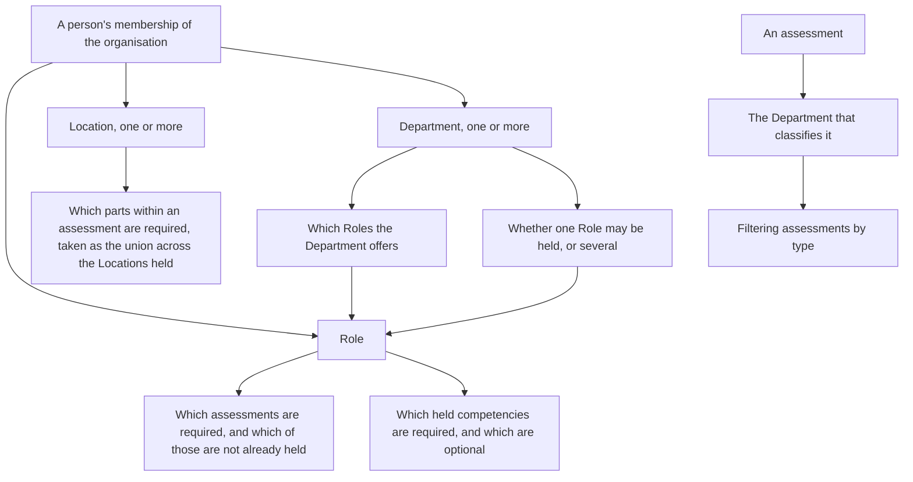
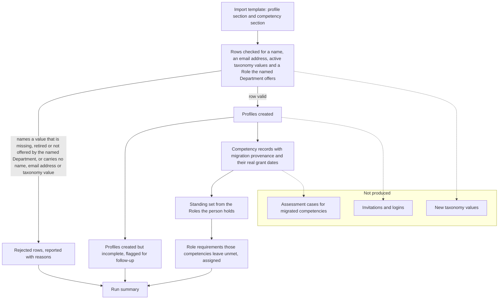

# Organisation Settings - Plan

## Goal Capsule

**Objective** — Let each customer define its own Locations and Departments and the Roles each Department offers, and state which assessments a Role requires so they assign themselves to whoever does not already hold them, and assign themselves again when what someone holds expires. Separate the job a person does from what they may do in the product, let a person be placed across as many Locations and Departments as their work actually spans, let the organisation choose which of its two workforce numbers identifies a person on screen, give every competency a standing that follows the Roles its holder currently carries, keep a retired value on the records that already hold it while its people are remediated, and bring an existing workforce in through a bulk import that seeds the competencies those people already hold.

**Product authority** — The product owner owns the decisions this contract records. What they have not decided stands as an open question rather than being settled here. Where this artifact and the current code disagree, this artifact is the target and the code is the starting point.

**Blocking prerequisite** — `docs/plans/2026-08-04-001-feat-candidate-profile-plan.md` depends on this work. A candidate profile cannot carry a Department until a customer can create one.

**Open blockers** — How the one-or-several-Roles setting resolves for a person in several Departments, what an imported person's membership carries, what happens to a row whose email address already belongs to someone, and the retirement and import edges that remain open.

**Not in this artifact** — The package and qualification framework, the candidate profile itself — its field inventory, its identifiers, its documents, its candidate seats and its lifecycle, each of which that artifact owns and this one relies on — and any redesign of what an Access level may do beyond the profile category the permission matrix does not carry today.

---

## Product Contract

### Summary

Give every organisation its own named Locations and Departments in its own vocabulary, and the Roles each Department offers held within that Department rather than in one list across the organisation, and make them the only values a new record may carry — so a person placed in a Department can be given only the Roles that Department offers.

Hang the minimum assessment requirement off Role so that placing a person assigns what they must be assessed on, and hang the parts-within-an-assessment rule off Location so a site's own theory sections apply without anyone selecting them. Where a person works across several sites, assess them once against the union of what those sites require.

Make assignment continuous rather than one-off. A Role's requirement is assigned only where the person does not already hold current competencies for it, and assigned again once one of those competencies expires, so one mechanism covers a first placement and every renewal after it. A case created that way takes its Location from the person's membership, names no assessor, and waits for anyone eligible at that Location to pick it up.

Give every competency a standing that follows the Roles its holder currently carries, so a change of job changes what a person must maintain without destroying the record of what they are competent at.

Let a customer arrive with a workforce already in place: import their people, record the competencies they already hold with the provenance of where those competencies came from, and assign only what is still outstanding.

### Problem Frame

The taxonomy exists, but it belongs to one customer and lives in code. Four departments — Operations, Maintenance, Admin and Off Site Support — and the roles each one offers, down to Dozer Operator, HD Mechanic / Fitter and Trainer Assessor, are a hardcoded map of department to role list. So are the vocabularies beside it: two starter types, three genders and eleven ethnicities, all written in one customer's training-system wording, with Indigenous status derived from the ethnicity answer rather than asked separately. A second customer cannot be onboarded without a release. The rule that Operations crews may hold several roles while every other department holds one is real and load-bearing, and it too is a literal in that map.

Downstream of it, nothing is a list at all. Department, starter type and roles are read out of submission answers as plain strings. They describe a submission, not a person, and nothing constrains what they say. Nothing on a person's membership of an organisation carries any of it: there is no record that says this person works at this site, in this department, doing this job.

Location is worse than unconstrained. The location stream a case records is optional free text, and it is the only location-bearing value the product holds anywhere: it names where the case is assessed, it is what the per-stream assessor rule is matched against by name, and it is what the assessment document reads back as the answer to its own stream question. A stream matching no rule key resolves to unrecognised, which drops the location-specific half of the assessor requirement and leaves a warning in its place. What that check decides is which assessors may work a case at that site, so a typo is the difference between running the check and warning about it. The case-creation screen still describes an older behaviour where a near-miss skipped the check silently; that behaviour was deliberately removed and the description was not. Worse, the stream choices the screen offers are read out of the eligibility rule's own keys, so the rule defines the site vocabulary rather than consuming one.

There is no concept anywhere of what a job role requires. An assessment tool declares its parts, the competencies a candidate should bring, the competencies an assessor must hold and the competencies it awards, but nothing says a Dozer Operator needs the Authority to Operate Dozer. Every assignment is a human deciding, one person at a time, what someone ought to be assessed on.

Nothing renews anything either. A competency's expiry is derived from its own dates and displayed, with a warning window that differs for an assessor and for a candidate reading their own record, but no assignment follows from it. Either somebody notices, or nobody does.

Every case is also owned by one named assessor from the moment it exists. Omit the assessor when the case is created and the product quietly names whoever created it, so there is no such thing as work sitting in a pool for the next qualified person. Meanwhile the check on who may actually mark an attempt is org-wide rather than per-case: whoever is not the candidate is treated as the assessor, and no competency check runs at that moment at all. Ownership is stated where it does not bind, and eligibility is unstated where it would.

Nor is there any notion of what a person is obliged to keep. A competency is held or it is not, and the only way to record that someone no longer needs one would be to revoke it — which asserts something false about a person who was genuinely assessed.

The word "role" is also doing two jobs. It is the permission concept the settings area administers through a permission matrix, and it is the job a person does on site. Nothing in the product distinguishes them, so a screen that says "role" cannot be read without knowing which one it means. The matrix compounds it by administering only five of the seven permission levels the product actually recognises, so Assessor and Candidate carry capabilities that no screen has ever shown. It also has nothing to say about a person's record: it governs forms, submissions, the team, billing, the audit trail and assessments, and no category anywhere in it covers a candidate's profile or their personal information.

Per-organisation configuration is not a new idea here; a per-organisation, per-access-level permission matrix already exists. What does not exist is any way to get data in. The only spreadsheet handling in the product is an audit export. A customer with three hundred existing workers and a folder of certificates has no path in other than typing.

### Key Decisions

**The three axes decide different things, and none overrides another.**
Role decides which assessments a person needs. Location decides which parts within an assessment apply. Department classifies assessments by type for filtering, carries the Roles it offers, and holds the one-or-several-Roles rule. An assessment carrying no Department reads as unclassified until an Admin gives it one, and appears in every filter while it does, so a tool written before the taxonomy existed cannot be silently missed. Nesting the assessment requirement inside Location would force every combination to be enumerated, and the two do not vary together — the same Role at two sites needs the same assessment with different sections inside it. Department narrowing Role is the one relationship that does run between axes, and it is a narrowing of which values may be combined rather than an override of what any axis decides: what a Role requires is still the Role's, and what a Location selects is still the Location's.

**"Role" means the job someone does, and the permission concept is named Access level.**
Both concepts cannot keep the word, and the job role is the one a customer talks about daily, so it wins. A person therefore carries a Role, which is their job, and an Access level, which is what they may do in the product. Owner, Admin, Builder, Reviewer, Viewer, Assessor and Candidate are Access levels, and the permission matrix administers them. All seven already carry a capability set of their own, so surfacing Assessor and Candidate in the matrix is showing what they may do rather than deciding it.

**An Access level belongs to a person's membership of one organisation, not to the person.**
A person is one record across the product, identified by their email address, and holds at most one membership in each organisation they work for. That membership is what carries their Location, Department, Role and Access level, and membership is the word both artifacts use for it. Attaching the Access level to the person instead would mean one customer's view of a contractor decided what a second customer's product showed them.

**A person may hold as many Locations and Departments as the work actually spans.**
Real workforces place people across more than two sites, so the settings that allow several set no ceiling and are not a per-person exception. They are organisation-level settings, and they belong to this artifact rather than to the candidate profile artifact because they govern the taxonomy this work owns. Neither ever blocks: a person placed at several Locations or in several Departments is subject to the assessments every Role they hold requires, taken together as one set, with the parts inside each of those assessments taken as the union across the Locations they hold.

**Which profile fields and documents an Access level may see is the customer's decision, not the product's.**
A fixed band that hides every personal-information field from an assessor would be wrong for the many organisations where verifying identity against a driver's licence is ordinary assessing practice, and wrong again for those that run their assessors with full administrative access. The organisation configures it in its own permission matrix. That is not a switch that already exists — the matrix has no category for profiles or personal information at all — so the category is new work, stated here plainly rather than implied. What the category is built with is the matrix's business and therefore this artifact's; what it governs, what its grants are — viewing, editing and approving are three of them rather than two — and what it defaults to out of the box belong to the candidate profile artifact, which fixes them, and this artifact seeds the matrix with what that artifact decides rather than deciding a shorter version of its own.

**The location-to-parts rule lives on the assessment tool.**
It mirrors the per-stream assessor rule already keyed by stream on the tool. A location-centric rule would require every Location to know about every tool, so adding a tool would mean editing every Location. Putting the parts rule beside the assessor rule means one place answers both "who may assess this here" and "what applies here".

**A Location is chosen from a list, never typed, and there is only one Location axis.**
The location stream a case already records is the only location-bearing value the product has, and it does three jobs at once: it names where the case is assessed, it is matched by name against the per-stream assessor rule, and it answers the assessment document's own stream question. A managed list is therefore not a second axis beside it — it is that value, chosen instead of typed. Because the eligibility rule matches on the name, the rule's keys move to the same list: leaving it with its own typed keys would mean any Location label differing from a key by a word resolves to unrecognised, drops the location-specific half of the requirement and downgrades to a warning. A value chosen from a list cannot be a near-miss.

**A Location with no parts rule requires every part.**
Nobody configures a rule for a Location added after the tool was written, and the other two readings both fail badly. Requiring none reopens the silent skip this work exists to close. Refusing the case blocks assessment on a configuration gap. Requiring everything fails safe: the worst outcome is a longer assessment than necessary, never a certification with sections unassessed.

**A person placed at several Locations is assessed once, against the union of what those Locations require.**
Splitting into one case per Location would put the same person through the same overlapping sections twice and produce two records of one competence. Taking the union assesses the widest version once, and the result is valid everywhere they work. The single Location such a case records is the one whose rule contributed the most of its parts, so the assessor-eligibility check runs against the most demanding of the Locations that shaped it rather than against whichever happened to be listed first. Where two of them contributed the same number of parts the tie goes to the one whose assessor requirement is the more demanding, which is the same principle one level down; and because no tool declares a parts rule until somebody writes one, every Location a person holds requires every part on day one, so that tie is the ordinary case rather than an edge.

**A Department carries the Roles it offers, and a person may hold only the Roles their Department offers.**
The Role list is not flat. Each Department carries its own, and placing someone in a Department narrows the Roles they may be given to that Department's set. This is what the product already does: the intake carries a separate role field per department, shown only once that department is chosen, so one department offers machine roles and another offers trades and neither ever presents the other's. The reason is the same one behind the one-or-several setting — it stops an administrator recording a combination the site does not induct, which is the failure a single flat list of every Role in the organisation invites on every placement screen. A Department therefore constrains both which Roles a person holds and how many, and the two constraints are separate: one bounds the set, the other bounds the count. Where somebody is placed in several Departments those sets combine rather than intersect — a Role any of their Departments offers is a Role they may hold — because a person's Departments describe the whole of the work they do rather than a hurdle every Role must clear in each of them; the count is the half of it that a person in several Departments leaves open. Creating a Role is consequently an act within a Department rather than against an organisation-wide list, so a Department is created before the Roles inside it. Two Departments that both offer a Role of the same name offer two Roles, each with its own required assessments, because a fitter in Maintenance and a fitter on a contract crew are not obliged to the same standard. The consequence when the offer is withdrawn is a withdrawal, not an erasure: a Role a person holds that their Department stops offering is withdrawn from them, with no choice put to an Admin, because the Role is no longer available to that person and there is nothing to choose between.

**A Department decides whether a person holds one Role or several.**
This preserves behaviour that is load-bearing today. Operations allows several because crews are routinely inducted against more than one machine. Every other department allows one, because offering multi-select there would let an administrator record a combination the site does not induct. Several is unbounded, matching the decision that a person may hold multiple Locations: an operator running three machines holds three Roles, each of them offered by that Department, and receives the requirements of all three. The setting can still be changed once people are placed, because the surplus Role is withdrawn from the person rather than blocking the edit, and the Admin picks per person which Role survives, because which Role someone actually does is a human judgement rather than something the product can infer. That choice is the difference between this case and a Department withdrawing an offer: here every Role the person holds is still available to them, so which one they actually do cannot be inferred. What the setting resolves to for a person placed in several Departments whose settings differ is not settled here.

**Assignment fills gaps, and expiry reopens them.**
A requirement the person already meets is not a requirement to assess: where they hold every competency the assessment awards, each in date or inside its grace period, no case is created. When any of those competencies expires the requirement is unmet again and is assigned again, which makes automatic assignment the engine of ongoing renewal rather than a one-off at placement. This is one rule everywhere assignment happens — at placement, on a retrospective requirement change, and during a bulk import — rather than an import special case the other two paths contradict.

**An automatically created case belongs to a pool, not to a person.**
Nobody chose it, so nobody should own it. It takes its Location from the person it was created for, because that is the only place the answer can come from, and it names no assessor. Any assessor eligible at that Location may record any assessor-required part, on the existing rule that eligible means holding the tool's assessor competencies there, and that eligibility is checked when the attempt is marked rather than only at creation and sign-off. It warns rather than blocks, because both checks that exist already warn and a rail that refused work at the moment of marking would be the one place in the product where a competency check stops an assessment outright. Every part a person marks records who marked it and the name they marked it under, which is what lets a case stay auditable while it names nobody.

**An automatically marked part records that it was marked automatically, and names no person.**
A part every question of which carries an answer key marks itself, so no human exercised judgement on it, and the record says exactly that: marked automatically, no marker named. Naming somebody — whoever created the case, whoever happens to be eligible, the Admin who configured the Role — would manufacture evidence that a person exercised judgement they never exercised. That is the same principle that keeps a migrated competency from carrying an assessor's signature and from creating an assessment case: a spreadsheet cannot produce an assessor, and neither can an answer key. So the rule that every part records who marked it and the printed name they marked it under holds for every part a person marks, and carries this one exception. The exception costs nothing in auditability, because a reader can still tell exactly how each part was decided — by a named person, or by the keys the tool itself declares.

**Marking turns on whether a part carries an answer key, not on what kind of part it is.**
Today the decision is made on part kind alone, so a theory part with no key is marked with nothing checked. A part carrying a key for every one of its questions marks itself and needs nobody; a part where any question carries none is routed to an assessor to mark by hand. The key is carried per question, so a part that marked itself against only the keys it happens to hold would leave the rest unchecked — the same failure in miniature, and the reason a partly keyed theory part goes to a person rather than half to the product. A practical demonstration carries no key and so always needs an assessor, which is the same rule rather than an exception to it — there is no substitute for watching someone do the work.

**A competency carries a standing, and standing is derived rather than set.**
A competency required by a Role the person currently holds is required; one that no Role they hold requires is optional. Deleting or revoking a competency when Roles change would destroy a fact — the person was assessed and is competent — in order to record a change in obligation. Demotion records the true thing instead: they still hold it, they are simply no longer obliged to maintain it. One mechanism then covers a role change, a Department tightened from several Roles to one — where the surplus Role is withdrawn from the person and stops counting, rather than being erased from their record — a Department that stops offering a Role somebody holds, and a person moved off a retired Role.

**A Role can be withdrawn without being erased.**
Tightening a Department is the case that forces the distinction, a Department dropping a Role from what it offers is the case that forces it without a human choice, and a plain job move is the same act again. The person genuinely held that Role and may have been assessed under it, so deleting it from their record would rewrite history the same way revoking a competency would. Withdrawing it keeps the record and stops the obligation: the Role stays visible, marked as withdrawn, and stops counting among the Roles the person holds, so it assigns nothing further and requires nothing further. Withdrawal is therefore the only way a Role stops being held.

**Standing governs obligation; currency governs eligibility.**
Standing is required or optional and follows the person's Roles. Currency follows the competency's own dates and takes the dated states the candidate profile artifact fixes, with revocation lifted out of them and carried as a mark of its own. A prerequisite reads currency alone, so an optional competency that is still current satisfies it — holding a competency is holding it — while a revoked one counts as not held wherever currency is read. Compliance reads standing, so only a required competency counts against a person when it lapses. Conflating the two would either bar someone from an assessment they are demonstrably competent for, or report a voluntary lapse as a compliance failure.

**A requirement change applies retrospectively, behind a preview.**
Adding an assessment to a Role and having it apply only to future hires would mean the standard is met by nobody currently doing the job. Retrospective application is also the change most capable of surprising an Admin, so the blast radius is shown before it commits and applied once confirmed.

**A retired taxonomy value is kept on existing records, blocked for new ones, and never held up by the people still holding it.**
Deleting it would rewrite history and leaving it selectable would let the problem grow, so it stops being offered the moment it is retired. Holding the retirement until every affected person is remediated would keep a closed site selectable for as long as the queue takes to clear. The people still holding it are surfaced as work to do, with a bulk transfer for the common case, a person-by-person path where each person needs a different answer, and deactivation where the answer is that they should no longer be active. Nothing is destroyed while that queue is outstanding: the retired value stays on every record that carries it, and a competency left required by nothing once someone is moved off a retired Role becomes optional rather than being revoked. A retired Role is additionally frozen — its required-assessment list cannot be edited until it is returned to active — because retirement means the organisation is done with it, and a retired value must not accumulate new obligations for the people on their way off it.

**A bulk transfer states its blast radius and decides what happens to cases in flight.**
Settled records are never rewritten, but a case that is open and part-assessed belongs to neither the past nor the future. Because a case records the Location it is assessed at, a Location transfer has something to decide: the Admin is shown how many in-flight cases it touches and chooses the outcome, because which one is right depends on whether the site genuinely changed or the value was wrong to begin with. A transfer off a retired Role or Department has no such choice, because a case carries neither of those axes and there is nothing on it to rewrite: the cases are left untouched and only competency standing recalculates. This is the same preview pattern a retrospective requirement change already uses.

**Work already in flight is never discarded, and neither is the evidence of work that stopped.**
Removing an assessment from a Role's requirements lets the cases already open for it run to completion, and any competency they produce stands as optional — the same demote-never-delete rule that governs a job move, so a change of standard never throws away part-assessed work. Deactivating a person is the one act that does stop a case, and even then the invalidated case is retained as history. Because an automatically created case names nobody, the notice that it has stopped goes to every assessor eligible for that tool at that Location, and to the named assessor as well where the case has one.

**The organisation chooses which of its two workforce numbers identifies a person.**
Employee number and swipe card number are both unique within an organisation, so either can identify one person unambiguously, and which one is meaningful on a screen is a matter of how that customer runs its site rather than something the product can pick. The choice is therefore an organisation setting, alongside the settings that allow several Locations and several Departments, and the choice is the whole of what this artifact contributes. The two numbers themselves, the uniqueness that makes either of them an identification, what is shown for a person holding both, for one holding only the number the organisation did not choose, and for one holding neither — which matters here because the import that creates a whole workforce asks for neither — and the rule that an identifier is read live rather than captured onto a case all belong to the candidate profile artifact, which states them in full.

**Voluntary training is requested by the person and approved by an Admin.**
An optional competency is one nothing obliges the person to hold, so nothing should assign it on their own authority: they request the training and an Admin approves it and assigns it. There is no self-service enrolment and no catalogue to browse, which keeps one mechanism — an Admin assigning — behind everything that lands in a person's queue, whether it came from a Role's requirement or from the person asking.

**Never trained and lapsed are reported as different problems.**
A competency a Role requires and its holder has never held is a compliance gap in its own right, reported separately from one that has expired. An auditor asks different questions about each and the remedy differs: one is a training booking, the other a refresher. Expiry notification is the other half of the same visibility — it reaches the person directly wherever they hold a login or an email address, and anyone reachable by neither surfaces on that compliance list, because bulk import creates people with no login at all and a person-only rule would let a migrated workforce lapse unannounced.

**An organisation below the Business tier carries no taxonomy at all.**
Those tiers already hold zero candidate seats and no assessments feature, so Locations, Departments and Roles would have nothing to drive. Removing the hardcoded lists therefore takes away nothing they could have used, and the gate matches the one assessments and competency gating already sit behind.

**Renaming or retiring never rewrites a settled assessment record.**
A case signed at "Raw Materials" keeps that value after the site is renamed. This is the principle the product already applies to a signed attempt, which keeps the printed name as signed even when the user record later changes.

**Bulk import never creates an assessment case for a migrated competency.**
A spreadsheet cannot produce an assessor's signature. An assessment case carries the certification — signing user, printed name and signature — written once, by the assessor. Creating signed cases from parsed rows would manufacture evidence for events that never happened. The competency record alone is functionally sufficient, because prerequisite checks, expiry, grace periods and the profile view all read competency records rather than cases. Recording the competency with an evidence pointer is recognition of prior learning in substance: it recognises existing competence without reassessment.

**A migrated competency keeps its own dates.**
It records the date the person actually earned it, not the date it was brought in, because expiry is derived from the grant date rather than frozen at grant time — so importing a 2022 ticket as though it were granted today would silently restart its clock. An expiry recorded with the row overrides that derivation for a short-validity or hand-extended ticket, which is what lets a migrated record keep a real expiry without lying about when it was earned.

**The import consumes taxonomy; it never creates it.**
A row naming a Location that does not exist is a mistake, not a request. Letting an import mint taxonomy values would rebuild the free-text problem this work exists to remove, one typo per row.

**The import requires what identifies and places a person, and flags the rest.**
A name, an email address and the taxonomy values are what a profile cannot be built without. Everything else genuinely arrives after the person does, and requiring the full inventory would force an administrator to invent demographic answers for workers they may never speak to. A row that lands incomplete creates its profile and is flagged for follow-up, so the organisation sees exactly what is missing instead of being sent back to the spreadsheet.

**A profile requires an email address, so a row without one fails.**
The address is captured to create the profile, not to send anything, and it belongs to at most one person across the whole product, so a second row naming it collides rather than creating a second record. It is not the person's identity: the candidate profile artifact issues every person a generated username, which is what a later correction to the address leaves untouched. An invitation can still be handed to a person as a printed QR code, and an import sends no invitations at all. Capturing the address is what makes an email invite path possible later, so a row that omits it lands in the failure report rather than creating a profile.

**The import is not all-or-nothing.**
One malformed row in three hundred should not send a customer back to the spreadsheet. Good rows land and bad rows are reported.

**Configuration comes before import.**
An import assigns nothing for a Role whose requirements are not yet configured, so a customer who imports first gets profiles and competencies but no assignments. The product states that ordering rather than leaving it to be discovered after four hundred people have landed.

### Actors

A1. **Admin** — a person holding the Admin access level. Builds the Location and Department lists and the Roles each Department offers, sets each Role's required assessments, sets whether a person may hold several Locations and several Departments, chooses which of the two workforce numbers is the organisation's display identifier, configures the permission matrix, including the profile and personal-information category it gains here, confirms retrospective changes, picks which Role survives when a Department is tightened, approves and assigns voluntary training, works the compliance list, handles retirement remediation, and runs bulk imports.

A2. **Assessment tool author** — declares, on a tool, which of its parts apply at each Location. Which Access level that requires is not settled here.

A3. **Assessor** — picks up a case at a Location they are eligible at and works through the parts that Location requires, including any part carrying no answer key. A case created automatically names nobody, so any eligible assessor may take its assessor-required parts, and one who does not hold what the tool requires there is warned as they mark rather than refused.

A4. **Workforce member** — a person placed at one or more Locations, in one or more Departments, holding one or more of the Roles those Departments offer. Receives the assessments their Roles require that they do not already hold, holds competencies whether earned in the product or migrated into it, is notified as those competencies expire, and may request training they are not obliged to hold.

A5. **Intake form submitter** — whoever completes a request or intake form. Chooses Location and Department from the organisation's lists rather than typing them, and chooses a Role from those the chosen Department offers.

### Requirements

**The taxonomy**

R1. An organisation defines its own Locations and Departments as named lists, in its own vocabulary, and defines the Roles each Department offers within that Department rather than as one list across the organisation.

R2. Each list belongs to one organisation and is invisible to every other organisation.

R3. The lists replace the department and role values currently hardcoded for a single customer, so no organisation inherits another's words.

R4. Location, Department and Role decide different things and none overrides another: what a Role requires does not vary by Location, and which parts a Location selects within an assessment does not vary by Department.

R5. A Department carries the list of Roles it offers and declares whether a person in it may hold one of them or several, so a Department constrains both which Roles a person holds and how many, and the two constraints are separate. A person placed in a Department may hold only Roles that Department offers, and a person placed in several Departments may hold any Role any of those Departments offers, the offers combining rather than intersecting. A Role is therefore created within a Department rather than against an organisation-wide list; two Departments offering a Role of the same name offer two Roles, each carrying its own required assessments.

R6. A Department set to several Roles preserves the existing behaviour where crews are inducted against more than one machine.

R7. A Department set to several Roles puts no ceiling on how many Roles a person in it may hold, so an operator running three machines holds three Roles and receives the requirements of all three.

R8. An assessment tool carries at most one Department, which classifies it so assessments can be filtered by type.

R9. An assessment tool carrying no Department reads as unclassified rather than as belonging to every Department, and stays unclassified until an Admin assigns it one.

R10. An unclassified assessment tool appears in every Department filter while it is unclassified, so it cannot be silently missed.

R11. Managing the taxonomy requires the Admin access level.

R12. The taxonomy is available at the Business plan tier and above, consistent with the existing assessment and competency gating.

R13. An organisation below the Business tier carries no Locations, Departments or Roles at all, because it holds no candidate seats and no assessments feature for a taxonomy to drive.

R14. Every taxonomy value is either active or retired.

R15. Only active values may be chosen for new records.

R16. The organisation's Locations and Departments are the options presented in request and intake forms, and the Role options a form presents are those the chosen Department offers under R5 rather than every Role in the organisation.

R17. A submission raised once the lists exist can carry only taxonomy values that are active and already created. A submission raised before them keeps the free-text value it was written with and is not rewritten by the lists, and how those historical values become managed ones is deferred to planning.

**Role and access level**

R18. The permission concept is named Access level, so "Role" refers only to the job a person does.

R19. A person carries one or more Roles, which are the job they do, and separately an Access level, which is what they may do in the product.

R20. The record a person holds in an organisation is their membership of it, and that membership carries the Location or Locations they are placed at, the Department or Departments they are in, the Role or Roles they hold, and their Access level.

R21. A person's Access level belongs to their membership of one organisation rather than to the person, so someone working for two customers is one record with two memberships and an Access level in each, and neither organisation sees the other's.

R22. An organisation sets whether a person may be placed at several Locations, and separately whether a person may be placed in several Departments.

R23. Neither setting caps how many a person may hold.

R24. A person placed at several Locations or in several Departments receives the assessments required by every Role they hold, taken together as one set, with the parts within each of those assessments taken as the union across the Locations they hold, and holding several never blocks a membership or an assignment.

R25. Owner, Admin, Builder, Reviewer, Viewer, Assessor and Candidate are Access levels, administered by the permission matrix.

R26. Every Access level the product recognises is offered wherever an Access level is chosen or administered, including Assessor and Candidate.

R27. The permission matrix carries Assessor and Candidate alongside the five Access levels it already administers, presenting the capabilities each already holds rather than defining new ones.

R28. An Assessor may view forms, view and export submissions, view the team, and view, create, edit and export assessments, and may delete neither an assessment nor a submission.

R29. A Candidate may view and edit only the assessments they are the candidate on, and holds no capability over forms, submissions, the team, billing or the audit trail.

R30. A Candidate sees the full history of their own cases — every attempt with its outcome and its disposition — and cannot export a case's evidence record.

R31. The permission matrix carries a category covering candidate profiles and personal information, which it does not carry today: its categories are forms, submissions, the team, billing, the audit trail and assessments.

R32. What that category governs is fixed by the candidate profile artifact rather than here: its R39, R44 and R55 make which profile fields, which competencies and assessment history, and which documents an Access level may reach the organisation's own setting, with fields and documents set separately. The category's grants are three rather than two — viewing, editing and approving a document are distinct, its R42 admitting a reader to approve one and its R43 fixing what an approval does — and this artifact builds the category to carry all three. Exporting a candidate's record is not among them: its R54 keeps that Admin-only and audited whatever the organisation sets.

R33. The default the category ships with is the candidate profile artifact's: its R41, R42 and R55 admit an Assessor to candidate profiles, to the competencies and assessment history on them, and to the documents held against them including approving those documents, and let an organisation tighten or loosen every part of it. This artifact seeds a new organisation's matrix with that default and supplies the fallback an organisation predating the category reads, rather than stating a default of its own.

R34. A candidate's access to their own record sits outside the category and is reached by no setting in it: the candidate profile artifact's R49, R50 and R51 fix what a candidate reads and writes on their own record, and the matrix this artifact administers cannot take it away.

R35. A person's request for training they are not obliged to hold is an action on their own record rather than a capability an Access level carries, so the permission matrix neither grants it nor withholds it, on the same footing as R34.

R36. What consumes a candidate seat, what releases one, what each tier's included allocation is, and what happens when an action would take an organisation past it are fixed by the candidate profile artifact's R77 to R86 rather than here. This artifact relies on them: every act it describes that gives a person an Access level draws on the pool those rules meter, and what an import-created membership carries — and therefore which pool it draws on — is carried as an open question here.

**Identifying a person**

R37. This artifact relies on the candidate profile artifact's R7 for the two workforce numbers a person may carry — the employee number and the swipe card number, which are its fields to define — and for the uniqueness within an organisation that lets either of them tell two people of the same name apart.

R38. The organisation chooses which of the two is its display identifier, and that choice is an organisation setting rather than a per-person one. That choice is what this artifact contributes to identifying a person.

R39. What the choice produces on screen is the candidate profile artifact's R24: the chosen identifier is what is shown where a person holds both, the other number is shown where the person holds only that one, and a person holding neither is shown by their name alone until one is issued.

R40. An identifier is read live from the person's profile wherever it is shown and is never captured onto an assessment case, as the candidate profile artifact's R61 fixes, so a correction to one propagates everywhere at once and nothing has to be reissued.

**Roles and required assessments**

R41. A Role carries the assessments it requires, which are the minimum for anyone holding it.

R42. Holding a Role assigns its required assessments to that person automatically.

R43. Automatic assignment creates a case only for a requirement the person does not already meet: where they hold every competency that assessment awards, each in date or inside its grace period, no case is created.

R44. When any of those competencies expires, the requirement is unmet again and is assigned again, so automatic assignment is the engine of ongoing renewal rather than a one-off at placement.

R45. Assigning only what is unmet is the rule wherever assignment happens — at placement, on a retrospective requirement change, and during a bulk import alike.

R46. A person holding several Roles is subject to the requirements of every Role they hold, taken together as one set.

R47. A Role whose requirements have not been configured assigns nothing.

R48. Such a Role reads as unconfigured rather than as configured with nothing in it.

R49. Changing which Roles a person holds applies the same assignment as configuring the Role does.

R50. A Role may be withdrawn from a person: it stays on their record marked as withdrawn, and it stops being one of the Roles they hold, so it assigns nothing further and requires nothing further. Withdrawal is the only way a Role stops being held, and nothing erases a Role from a person's record. A Role a person's Department stops offering under R5 is withdrawn from every person in that Department who holds it, on that ground alone and with no choice put to an Admin, because the Role is no longer available to them and there is nothing to choose between.

R51. Withdrawing a Role from a person does not disturb the cases already in flight for what that Role required: each runs to completion rather than being cancelled, and a competency it produces is held and stands as optional where no Role its holder still carries requires it. Deactivation remains the only act that stops a case.

R52. Removing an assessment from a Role's required list does not disturb the cases already in flight for it: each runs to completion rather than being cancelled, so no part-assessed work is discarded.

R53. A competency produced by such a case is held and stands as optional where no Role its holder carries requires it, on the same demotion rule every other change of obligation follows.

**Automatically created cases**

R54. An assessment case created by automatic assignment takes its Location from the person's membership.

R55. Where that membership carries several Locations and their required parts differ, the case records the Location whose parts rule contributed the most of its parts, so the assessor-eligibility check runs against the most demanding of those Locations.

R56. Where two or more of those Locations contribute the same number of parts, the case records the one whose assessor requirement for that tool is the most demanding, so the check still runs against the strictest of them. Until a parts rule is declared anywhere, R68 has every Location require every part, so this tie is the ordinary case rather than an edge.

R57. Such a case names no assessor and waits in an open pool rather than being owned end to end.

R58. Any assessor may record any of a case's assessor-required parts, and eligible means holding the tool's assessor competencies for that case's Location, which is the existing eligibility rule unchanged. Eligibility names what the check in R59 reads rather than a gate on who may record a part.

R59. Assessor eligibility is checked at the moment an attempt is marked, and an assessor who does not hold what the tool requires at that Location is warned rather than refused, consistent with the checks that already run at case creation and at sign-off.

R60. A part every question of which carries an answer key is marked automatically and needs no assessor.

R61. A part where any question carries no answer key is not marked automatically and is routed to an assessor to mark by hand, because the key is carried per question and a part that marked itself against only the keys it holds would leave the rest unchecked.

R62. Marking turns on whether every question in a part carries an answer key rather than on what kind of part it is, so a theory part that is unkeyed or only partly keyed reaches an assessor instead of being marked against nothing.

R63. A practical demonstration carries no answer key and therefore always needs an assessor, and any eligible assessor may record it.

R64. Each part of a case a person marks records who marked it and the printed name they marked it under, so a case that names no assessor is still attributable part by part. A part R60 marks automatically carries the one exception to that: it records that it was marked automatically and names no person, because no person marked it and naming anyone — whoever created the case, whoever is eligible at its Location, the Admin who configured the Role — would assert that somebody exercised judgement they never exercised, which is the same reason R145 creates no assessment case for a migrated competency. That holds on a case naming an assessor exactly as it does on one R57 has left naming none, where there is not even a name to borrow.

**Location and assessment parts**

R65. An assessment tool declares which of its parts apply at a Location, for the Locations that differ.

R66. That rule lives on the tool, beside the per-stream assessor rule the tool already carries.

R67. A Location selects which of an assessment's parts are required, so an assessment with three theory sections can require two of them at one site and a different two at another.

R68. An assessment tool that declares no parts rule for a Location requires every one of its parts there, whether no rule was ever configured or the Location was added after the tool.

R69. The Locations a tool can distinguish are drawn from the organisation's Location list rather than from whatever keys somebody typed into a rule.

R70. A case records the Location it is assessed at, chosen from that list.

R71. There is one Location axis: the value a case records, the value the per-stream assessor rule is matched against, and the answer the assessment document reads for its own stream question are one value rather than three.

R72. The per-stream assessor rule is keyed to the organisation's Location list, so a rule and a case cannot name the same site differently and no case loses the location-specific half of the assessor check to a near-miss.

R73. A person placed at several Locations whose required parts differ between them receives one case, whose required parts are the union of every part any Location they hold requires.

R74. That person is assessed once, and the result is valid across every Location they hold.

**Change propagation**

R75. Changing a Role's required assessments applies to everyone currently holding that Role, not only to people who take the Role afterwards.

R76. An assessment case is created for each existing holder the change leaves with an unmet requirement.

R77. Before a retrospective change commits, the product states how many people it affects and how many assessments it would create.

R78. An Admin can abandon a retrospective change after seeing its blast radius and before confirming it.

R79. Once confirmed, the change applies with no per-person action.

**Competency standing**

R80. A Role that requires an assessment thereby requires the competencies that assessment awards, and that is what makes a person's held competency required.

R81. A competency a person holds carries a standing of either required or optional.

R82. A competency that a Role the person currently holds requires is required.

R83. A competency that no Role the person currently holds requires is optional.

R84. A competency that was required becomes optional when the Roles requiring it end, rather than being deleted or revoked.

R85. A person may hold an optional competency acquired outside any Role's requirement, whether migrated in or completed voluntarily.

R86. A person acquires an optional competency voluntarily by requesting the training, which an Admin approves and assigns.

R87. There is no self-service enrolment and no catalogue a person browses, so nothing is assigned on a person's own authority.

R88. Expiry notification continues for a competency of either standing.

R89. Expiry notification reaches the person directly wherever they are reachable, meaning wherever they hold a login or an email address.

R90. A person the notification reaches by neither route surfaces on a compliance list an Admin works through. The candidate profile artifact's R16 admits no profile without an email address and this artifact's R134 holds an import row to the same, and nothing in this artifact removes or invalidates one, so the list is the safety net that catches such a person rather than a population the rules as written produce.

R91. A person whose optional competency expires may refresh it and is not obliged to.

R92. Only required competencies count toward compliance.

R93. Compliance reporting distinguishes a required competency that has expired from an optional one that has expired.

R94. A competency a Role requires that its holder has never held is reported as a compliance gap, separately from a required competency that has expired, because never trained and lapsed are different problems with different remedies.

R95. Standing derives from the Roles a person currently holds, while currency derives from the competency's own dates and takes the four dated states the candidate profile artifact's R100 fixes — held, approaching expiry, inside grace and expired — rather than any shorter set stated here, revocation being a mark carried beside currency under its R101 rather than one of those states.

R96. A competency satisfies an assessment tool's candidate prerequisite on currency alone, so an in-date or in-grace competency satisfies it whatever its standing and an expired one does not.

R97. A competency with no validity period and no expiry date of its own never expires, so on its dates alone it counts as held wherever currency is read, unless it is revoked — R98 is decisive over its dates, so a revoked competency that would otherwise never expire counts as not held all the same.

R98. A revoked competency counts as not held wherever currency is read: it satisfies no prerequisite under R96, closes no requirement R43 would otherwise skip, and leaves what a Role requires standing as the gap R94 reports. Revocation is a mark of its own rather than a standing, so revoking a competency and demoting one to optional are different acts.

R99. Wherever a competency is shown to a reader, its standing is shown alongside its currency.

R100. Demotion to optional is the single mechanism applied when a person's Roles change, when a Department is tightened from several Roles to one, when a Department stops offering a Role somebody holds and R50 withdraws it, and when remediation moves a person off a retired Role.

R101. A Department's one-or-several setting may be changed after people are already placed in it.

R102. Tightening a Department from several Roles to one applies to the people already placed there, does not block the edit, and destroys no competency.

R103. Tightening a Department from several Roles to one surfaces the people it affects, and the Admin chooses for each of them which Role survives, because which Role someone actually does is a human judgement.

R104. Every Role not chosen is withdrawn rather than deleted, so it stays on the person's record marked as withdrawn and the competencies it alone required become optional.

**Retiring and renaming taxonomy values**

R105. Retiring a value that is in use keeps it on existing records and blocks it for new ones.

R106. Retirement takes effect immediately and is never held up by the people still holding the value.

R107. People still holding a retired value are flagged for review.

R108. An assessment tool carrying a Department the organisation retires keeps that Department and does not thereby read as unclassified, so R10's appear-in-every-filter behaviour does not reach it.

R109. A parts rule cannot be declared for a retired Location, because R15 admits only active values onto a new record, and a rule already declared for a Location that is later retired stays on the tool with the Location it names.

R110. Retirement on its own changes no competency's standing, because the retired value stays on the records that carry it and standing follows the Roles a person holds.

R111. A competency left required by no Role a person holds once remediation moves them off a retired Role becomes optional, so nothing is destroyed while the review queue is outstanding.

R112. A retired Role is frozen: its required-assessment list cannot be edited while it is retired, so a value the organisation is done with accumulates no new obligations for the people on their way off it.

R113. A retired value can be returned to active, and returning a Role to active is how its required-assessment list is edited again.

R114. The Admin chooses how the flagged people are remediated.

R115. Two reassignment paths are offered: transfer everyone in bulk to a replacement value, or review person by person and reassign individually.

R116. Reassigning one person off a Location individually offers the same carry-or-rewrite choice for that person's in-flight cases that R123 gives a bulk transfer, because which outcome is right turns on whether the site genuinely changed or the value was wrong to begin with, and that is a judgement per person. Reassigning one person off a Role or a Department leaves their cases untouched, for the reason R125 gives.

R117. Deactivating the flagged people is available to the Admin alongside the two reassignment paths.

R118. The review lists the active people who still hold the retired value, so a person leaves it by being moved off that value or by being deactivated, and no separate act clears them from it.

R119. Deactivating a person is one of the remediation paths offered here, and what deactivation does to the person is the candidate profile artifact's rule rather than this artifact's: its R62 to R69 deactivate rather than delete, retain every record indefinitely, revoke no competency and keep a competency still inside its expiry valid on a return. No Role is withdrawn by it either, because R50 makes withdrawal an act of its own, so a deactivated person's competencies keep the standing their Roles give them.

R120. The assessment cases a deactivated person has in flight are invalidated and retained as history rather than deleted, and every assessor eligible for each case's tool at its Location is notified along with the named assessor where the case has one, as the candidate profile artifact's R71 to R73 fix and as an automatically created case naming nobody requires. This artifact relies on that rule, and R51 keeps deactivation the only act that stops a case.

R121. An assessment case is in flight while it is open, meaning created and not yet completed, and settled once it is completed or signed. A case already submitted and awaiting review is open, so it takes the same outcome as one created and not yet started.

R122. A bulk transfer states, before it commits, how many people it moves and how many in-flight assessment cases it affects.

R123. The Admin chooses one outcome for the in-flight cases of a Location transfer: carry them unchanged so they keep their original Location, or rewrite them to the replacement Location.

R124. The chosen outcome applies to every in-flight case in that transfer, with no per-case action.

R125. A bulk transfer off a retired Role or a retired Department leaves cases in flight untouched and recalculates competency standing alone, because a case records a Location and neither of the other two axes, so the carry-or-rewrite choice arises for a Location transfer only.

R126. Renaming or retiring a taxonomy value does not rewrite a settled assessment record.

R127. A settled record keeps the value it was written with, so a case signed at "Raw Materials" still reads "Raw Materials" after the site is renamed.

**Bulk import**

R128. Running a bulk import requires the Admin access level.

R129. Bulk import is available at the Business plan tier and above, on the same gate as the taxonomy it consumes, because an organisation below that tier carries no Locations, Departments or Roles under R13 and R132 admits no row without them.

R130. A downloadable import template is provided, carrying a section for the profile fields and a section for existing competency records.

R131. An import sends no invitations and creates no logins.

R132. Each imported profile carries its Location, Department and Role values from the organisation's lists.

R133. Each imported profile carries a name.

R134. Each imported profile carries an email address, which a profile cannot be created without.

R135. An email address belongs to at most one person across the whole product, so no second profile can exist for an address that already belongs to someone. The address is a unique contact and lookup value rather than the person's identity, which R136 carries instead.

R136. Every person an import creates is issued the generated username the candidate profile artifact's R21 gives every person the product holds a record for, even though the import sends no invitation and creates no login, and its R23 is why correcting the email address afterwards leaves that username unchanged. This artifact relies on that rule and states only that a bulk-created workforce is not an exception to it.

R137. In the template's profile section, a name, an email address and the taxonomy values are the only fields an import row must carry; every other profile field the template offers is optional.

R138. A competency line must name the competency it records, which is the minimum without which R141 has nothing to award.

R139. A row that lands with optional fields missing creates its profile and is flagged for follow-up, stating what is missing.

R140. An imported person's Roles are subject to the Department they are placed in exactly as any other membership is, both to the Roles that Department offers and to its one-or-several-Roles setting.

R141. The import records the competencies a person already holds and awards them.

R142. A migrated competency carries migration provenance: who authorised the migration, when, and an evidence reference to the source certificate where the row supplies one.

R143. A migrated competency records the date the person actually earned it as its grant date, so being brought in neither dates it as today nor restarts its clock.

R144. A migrated competency's expiry is derived from its grant date and the competency's validity period, unless an expiry recorded with the row overrides that, which is how a short-validity or hand-extended ticket keeps its real date.

R145. No assessment case is created for a migrated competency.

R146. The import does not require a certificate to be attached to a migrated competency, and a row supplying none is recorded rather than rejected.

R147. That waiver attaches to the records the run created and reaches nothing else: a migrated competency carrying no certificate owes none once the run ends and appears on no follow-up list for one, while a competency recorded on the same person after the run owes its certificate exactly as any other does, so a concession made for a migration never becomes the standard for recording a competency day to day.

R148. The import seeds a person's existing competencies before assigning anything, so only the requirements their Roles leave unmet are assigned.

R149. The import assigns nothing for a Role whose requirements have not been configured.

R150. The import accepts only taxonomy values that are active and already created.

R151. A row naming a Location, Department or Role that does not exist, or one that has been retired, is rejected, as is a row naming a Role the Department it places the person in does not offer.

R152. A row carrying no name, no email address, or no Location, Department or Role fails validation and lands in the failure report, rather than creating a profile, because R137 makes those the fields a row cannot be built without.

R153. The import never creates taxonomy values as a side effect.

R154. The import processes the rows that succeed and reports the ones that fail, rather than failing as a whole.

R155. A completed run reports what it produced: profiles created, competencies recorded, assessments assigned, profiles flagged as incomplete, and rows rejected with the reason.

R156. The product makes the configure-then-import ordering visible before an import runs.

The three axes answer different questions, and no one of them answers another's. A person's membership carries all three, and carries as many of the first two as their work spans, while the classification axis hangs off the assessment rather than off the person. Only Role reaches assignment: Location decides what is inside an assessment rather than whether one is required, and Department classifies assessments without requiring any. Department does reach Role, twice, and both edges are drawn: it carries the set of Roles it offers, which bounds which Roles a person may hold, and it carries the one-or-several setting, which bounds how many. That is a narrowing of which values may be combined, not an override — what a Role requires is still decided by the Role. Nothing constrains which Location a Role may be held at. Where a person holds several Locations, the parts axis resolves to the union of what those Locations require rather than to several separate answers. Standing hangs off Role alongside assignment, which is why the two move together whenever the set of Roles a person holds changes — including when a Role is withdrawn and stops counting while staying on their record — and why neither moves when a Location, a Department or a Role is retired, until remediation actually moves somebody off it. What assignment produces is filtered by what the person already holds, which is why the same edge carries a first placement and every renewal after it.

### Key Flows

F1. Build the taxonomy

**Trigger** — A new organisation is being set up, or an existing one is moving off the hardcoded values.

**Actors** — A1, A5.

**Steps** —
1. An Admin on a Business-tier organisation opens the settings area, where the taxonomy is not offered below that tier and an organisation below it carries no Locations, Departments or Roles at all.
2. The Admin creates the Locations the organisation assesses at.
3. The Admin creates the Departments, setting for each whether a person placed in it may hold one Role or several, where several puts no ceiling on how many.
4. The Admin creates, inside each Department, the Roles that Department offers — the Department comes first because a Role is created within one rather than against an organisation-wide list, and a person placed in a Department may be given only the Roles it offers. Where two Departments both want a Role of the same name, each gets its own, carrying its own required assessments.
5. The Admin sets whether a person may be placed at several Locations and whether a person may be placed in several Departments, neither setting putting a ceiling on how many.
6. The Admin chooses which of the two workforce numbers — employee number or swipe card number — is the organisation's display identifier, that choice being the whole of what is set here; the numbers themselves, the uniqueness that makes either an identification, what is shown for a person holding both, only the other one, or neither, and the identifier being read live rather than copied onto a case are the candidate profile artifact's to state.
7. The word Role now refers to these job roles throughout, and the permission matrix administers Access levels instead, offering every one the product recognises — Assessor and Candidate included, neither of which it has carried before — each shown with the capabilities it already holds.
8. The matrix also carries a category for candidate profiles and personal information, which it has not carried before, built to carry viewing, editing and approving as distinct grants and seeded with the default the candidate profile artifact fixes; the Admin tightens or loosens it from there, a candidate's access to their own record is not part of it, and neither is exporting a candidate's record, which stays Admin-only and audited however the category is set.
9. The Admin sets a person's membership of this organisation — the Location or Locations they are at, the Department or Departments they are in, the Role or Roles they hold, and their Access level — so the same person placed at a second customer carries a separate membership there, and what that membership costs in seats is metered by the candidate profile artifact's seat rules rather than by anything set here.
10. The lists become the options offered wherever a Location, Department or Role is chosen: an intake form submitter picks from them rather than typing, the Role options narrowing to those the chosen Department offers, and a submission can carry no value outside the active ones.
11. The product shows that Roles have no required assessments yet, and that an import run now would assign nothing.

**Outcome** — The organisation has its Locations, its Departments and the Roles each Department offers in its own words, states how far a person may be spread across them, says which number identifies its people, decides for itself who may see a person's record, nothing new can be recorded with a value outside the lists or with a Role its Department does not offer, and the Admin knows the next step is Role requirements.

**Covers** — R1, R2, R3, R4, R5, R6, R7, R11, R12, R13, R14, R15, R16, R17, R18, R19, R20, R21, R22, R23, R24, R25, R26, R27, R31, R32, R33, R34, R36, R37, R38, R39, R40, R47, R48, R156.

F2. Set a Role's required assessments

**Trigger** — A Role exists and the site knows what it demands.

**Actors** — A1.

**Steps** —
1. The Admin selects a Role.
2. The Admin narrows the assessment list by the Department that classifies each assessment.
3. An assessment carrying no Department reads as unclassified and appears in every one of those filtered lists until an Admin assigns it one, so a tool written before the taxonomy existed cannot be missed while the classification is still being done.
4. The Admin adds the assessments that Role requires.
5. The Admin confirms.
6. Anyone subsequently placed in that Role is assigned those assessments automatically, except an assessment every competency of which they already hold, each in date or inside its grace period.
7. Each case created that way takes its Location from the person's membership and names no assessor, so any assessor eligible at that Location may take its assessor-required parts; where the membership carries several Locations whose parts differ, the case records the one whose rule contributed the most of its parts, and where two contributed the same number it records the one demanding the most of an assessor.

**Outcome** — The Role states its own standard, a person's membership rather than a person's judgement decides what gets assigned, no assessment is invisible to the filter that finds it, and the work lands in a pool rather than in one assessor's diary.

**Covers** — R8, R9, R10, R41, R42, R43, R46, R49, R54, R55, R56, R57, R58.

F3. Edit a Role's requirements and see the blast radius

**Trigger** — A standard changes and an assessment is added to a Role that people already hold.

**Actors** — A1.

**Steps** —
1. The Admin adds an assessment to a Role that many people hold.
2. The product states the number of people affected and the number of assessments that would be created, counting only the holders the change leaves with an unmet requirement.
3. The Admin either abandons the change or confirms it.
4. On confirmation, a case is created for every existing holder who does not already hold every competency the added assessment awards, each of them current, without further action.
5. Removing an assessment from that Role instead disturbs nothing already in flight: those cases run to completion, and a competency any of them produces is held and stands as optional where no Role its holder carries requires it.
6. A retired Role cannot be edited this way at all; it is returned to active first, so nothing new is added to a value the organisation is done with.

**Outcome** — The new standard applies to the people doing the job today, nobody is sent to be reassessed on something they already hold, part-assessed work survives a standard being withdrawn, and the Admin knew the size of the change before agreeing to it.

**Covers** — R45, R52, R53, R75, R76, R77, R78, R79, R112, R113.

F4. Declare which parts a Location requires

**Trigger** — An assessment tool has parts that only apply at some sites.

**Actors** — A2.

**Steps** —
1. The author opens the assessment tool.
2. The author selects a Location from the organisation's list.
3. The author marks which of the tool's parts that Location requires.
4. The author repeats for each Location that differs.
5. A Location the organisation has retired cannot be given a rule at all, and a rule declared for a Location that is later retired stays on the tool.
6. A Location the tool carries no rule for requires every part, so a site added after the tool is over-assessed rather than under-assessed.
7. The tool's per-stream assessor rule is keyed to the same list, so both rules and the case itself read one value for the site.
8. A case assessed at that Location requires those parts and not the others.
9. A person placed at several Locations receives one case requiring every part any of those Locations requires, is assessed once for all of them, and that case records the Location whose rule contributed the most of its parts — or, where two contributed equally, the one whose assessor requirement is the more demanding.

**Outcome** — A case assessed at a Location requires only the parts that Location selects, a Location nobody configured requires everything rather than nothing, the Location could not have been mistyped, the assessor check cannot miss because a site was named two ways, and a person working across sites is assessed once against the most demanding of them.

**Covers** — R55, R56, R65, R66, R67, R68, R69, R70, R71, R72, R73, R74, R109.

F5. Retire a Location that forty people still hold

**Trigger** — A site closes and its Location value should no longer be selectable.

**Actors** — A1.

**Steps** —
1. The Admin retires the Location, and the retirement takes effect at once.
2. The value stops being offered for new records and stays on every record that already carries it.
3. The forty people still holding it are flagged for review.
4. No competency changes standing, because standing follows the Roles a person holds and retiring a Location changes nobody's Roles.
5. The Admin transfers all forty to a replacement Location in one action, works through them individually and reassigns each, or deactivates them.
6. A bulk transfer first states how many people it moves and how many assessment cases still in flight it affects.
7. The Admin chooses whether those in-flight cases carry unchanged or are rewritten to the replacement Location, and reassigning one person individually offers that same choice for that person's cases, because why the value changed is a judgement per person.
8. Deactivating someone instead takes the effect the candidate profile artifact fixes for deactivation: the cases they have in flight are invalidated and retained as history, every assessor eligible for each case's tool at its Location is notified along with the named assessor where the case has one, no Role is withdrawn and no competency revoked, and their records stand for a return.
9. Retiring a Role or a Department rather than a Location works the same way with three differences: a retired Role's required-assessment list is frozen until it is returned to active, an assessment tool classified by a retired Department keeps that Department rather than reading as unclassified, and a bulk transfer off a retired Role or Department leaves cases in flight untouched — a case carries neither axis, so only competency standing recalculates.
10. A person leaves the review by being moved off the retired value or by being deactivated, and nothing else clears them from it.
11. Settled cases keep the retired Location as assessed.

**Outcome** — The closed site cannot be selected again, the people affected are accounted for, the in-flight work has a stated fate whichever axis was retired and whichever path was taken, and the record of what was assessed where is unchanged.

**Covers** — R15, R105, R106, R107, R108, R110, R112, R113, R114, R115, R116, R117, R118, R119, R120, R121, R122, R123, R124, R125, R126, R127.

F6. Run a bulk import end to end

**Trigger** — An existing workforce needs to be in the product, with the tickets it already holds.

**Actors** — A1.

**Steps** —
1. The Admin, in a Business-tier organisation or above, confirms the taxonomy and each Role's required assessments are configured, the import carrying the same plan gate as the taxonomy it consumes.
2. The Admin downloads the import template and fills it — profile fields in one section, existing competencies in the other, each competency line naming the competency it records.
3. The Admin runs the import.
4. Rows naming a Location, Department or Role that does not exist, or one that has been retired, are rejected and reported, as are rows naming a Role the Department they place the person in does not offer; the rest proceed.
5. Rows carrying no name, no email address, or no Location, Department or Role are rejected the same way, because a profile cannot be created without any of them.
6. A row carrying a name, an email address and its taxonomy values lands even where every other field is blank, and is flagged for follow-up stating what is missing.
7. Profiles are created without invitations and without logins, each person issued the generated username the candidate profile artifact gives everyone all the same, so a later correction to their email address moves nothing about who they are; what Access level the membership an import creates carries, and therefore which seat pool it draws on, is not settled here.
8. Each imported person's Roles are read against the Department they are placed in, both against the Roles it offers and against its one-or-several-Roles setting.
9. Each listed competency is recorded and awarded with the date the person actually earned it, with who authorised the migration and when, creating no assessment case, and a row supplying no certificate is recorded rather than rejected.
10. Each competency's expiry follows from that date and the competency's validity period unless an expiry is recorded with the row, and one with neither never expires.
11. Each recorded competency takes its standing from the Roles the person holds, so one required by an assessment those Roles require is required and one nothing requires is recorded as optional.
12. The requirements those competencies leave unmet are assigned, which is the same rule a first placement and a retrospective change follow.
13. As those competencies later expire, notification reaches each imported person at the email address their profile carries even though the import created no login, and the compliance list the Admin works through stands ready for anyone no notification can reach — which is nobody the import created, because every profile it makes carries an address.
14. The concession that let a competency in without a certificate attaches to the records this run created, so none of them owes one afterwards, while a competency recorded on the same person after the run owes its certificate exactly as any other does.
15. The product reports profiles created, competencies recorded, assessments assigned, profiles flagged as incomplete, and rows rejected.

**Outcome** — The workforce exists in the product with its real history intact, only outstanding assessments assigned, what is still missing visible rather than invented, nobody lapsing unannounced because they have no login, and no fabricated assessment evidence.

**Covers** — R45, R80, R81, R82, R83, R85, R88, R89, R90, R95, R97, R128, R129, R130, R131, R132, R133, R134, R135, R136, R137, R138, R139, R140, R141, R142, R143, R144, R145, R146, R147, R148, R149, R150, R151, R152, R153, R154, R155, R156.

F7. Change the Roles a person holds

**Trigger** — A workforce member moves job, a Department is tightened from several Roles to one, a Department stops offering a Role somebody holds, or remediation moves someone off a retired Role.

**Actors** — A1.

**Steps** —
1. The Admin changes which Roles the person holds.
2. A Role that stops being held is withdrawn rather than removed: it stays on the person's record marked as withdrawn and stops counting among the Roles they hold. A plain job move is one case of that, a Department tightened from several Roles to one is another, and a Department dropping a Role from what it offers is a third; there is no path that erases a Role somebody was placed in.
3. A case already in flight for what a withdrawn Role required is not disturbed: it runs to completion, and the competency it produces stands as optional where nothing they still hold requires it, because deactivation is the only act that stops a case.
4. Where the trigger is a Department tightened from several Roles to one, the people it affects are surfaced and the Admin picks for each of them which Role survives, because which Role someone actually does is a human judgement; every Role not chosen is the one withdrawn.
5. Where the trigger is instead a Department dropping a Role from what it offers, the withdrawal needs no choice at all: the Role is withdrawn from everyone in that Department who holds it, because it is no longer available to them and there is nothing to choose between. That is the difference from step 4, where every Role the person holds remains available and only a person can say which they actually do.
6. The requirements of the Roles they now hold are assigned, as configuring a Role does, and nothing is assigned for an assessment every competency of which they already hold, current.
7. Every competency awarded by an assessment a Role they still hold requires stays required.
8. Every competency no longer required by any Role they hold becomes optional, and is neither deleted nor revoked.
9. Compliance stops counting those competencies, expiry notification continues for them, and the person may refresh one that expires without being obliged to — by requesting the training, which is theirs to ask for on their own record rather than a capability the matrix grants, and which an Admin approves and assigns, there being no self-service path.
10. The person may still be assessed against any tool those competencies are a prerequisite for, as long as the competency is current and unrevoked.

**Outcome** — The person's obligations follow their new job, their record of what they are competent at is untouched, part-assessed work outlives the Role it was started under, and nothing they were eligible for becomes unavailable.

**Covers** — R5, R35, R43, R49, R50, R51, R80, R81, R82, R83, R84, R86, R87, R88, R91, R92, R96, R98, R100, R101, R102, R103, R104, R111.

F8. An eligible assessor works a case that names nobody

**Trigger** — A case created by automatic assignment is waiting at a Location.

**Actors** — A3.

**Steps** —
1. The case took its Location from the person's membership and names no assessor.
2. Its parts carrying an answer key on every question are already marked and wait for nobody, each recorded as marked automatically and naming no person, because nobody exercised judgement on them.
3. An assessor holding the tool's assessor competencies for that Location records an assessor-required part — the part carrying no answer key, or the practical demonstration — without having been named on the case first.
4. A second assessor eligible at the same Location records a different part of the same case.
5. Eligibility is checked as each attempt is marked, and an assessor who does not hold what the tool requires at that Location is warned rather than refused, so the mark stands with the warning recorded against it.
6. Each part either of them marks records who marked it and the printed name they marked it under, so the case is attributable part by part although nobody owns it, and a reader can tell those parts from the ones step 2 marked without a person at all.
7. Which surface lists a pooled case to the assessors eligible at its Location, and whether taking a part names that assessor on the case, are carried as open questions rather than stated here.

**Outcome** — Work the product created is picked up by whoever is qualified and available at that site rather than waiting on one named person, an assessor reaching past what they hold is told so as they do it, and the record of who decided what — and of what nobody decided — survives the case having no owner.

**Covers** — R57, R58, R59, R60, R61, R62, R63, R64.

F9. A competency expires and its requirement is assigned again

**Trigger** — A competency a person's Role requires reaches the end of its validity.

**Actors** — A4.

**Steps** —
1. The person holds the competency an assessment their Role requires awards, in date, so no case exists for that assessment.
2. The competency enters its grace period, still counts as held, and still creates no case.
3. It expires, so the requirement the Role carries is unmet again.
4. A case is created for it, taking its Location from the person's membership and naming no assessor, on the same rule a first placement and a retrospective change follow.
5. Because that competency's standing is required, the lapse counts against compliance; an optional competency lapsing the same way is reported as an optional lapse instead, and a competency the Role requires that this person has never held at all is reported as a compliance gap rather than as a lapse.
6. Expiry notification ran whatever the standing, reaching the person directly because they hold a login or an email address; the compliance list the Admin works through is what catches anyone neither route reaches.
7. A person whose optional competency expires may refresh it without being obliged to, by requesting the training — theirs to ask for on their own record — for an Admin to approve and assign.
8. Being assessed again on that tool needs the person's other prerequisite competencies to be current and unrevoked, which is a question of currency and not of standing.

**Outcome** — Renewal happens because the product noticed rather than because somebody did, nobody is silently unreachable, and the difference between an obligation, a lapsed voluntary ticket and training never done survives the renewal.

**Covers** — R35, R43, R44, R45, R54, R57, R86, R88, R89, R90, R91, R92, R93, R94, R95, R96, R98.

The dotted paths are the point of the pipeline, not omissions from it. An import that sent invitations, minted taxonomy or produced signed cases would each undo a decision this work depends on. The flagged branch is the same kind of statement in the other direction: a row that is merely incomplete is not a failure, and the run says so rather than dropping it. What the memberships those profiles carry cost in seats is not drawn here, because what Access level they carry is unresolved.

### Acceptance Examples

AE1. Retrospective assignment reaches current holders

**Covers** — R75, R76, R77, R79.

**Given** — Forty people hold a Role, none of them already holding a current competency for the assessment being added, and that assessment is added to the Role's required list.

**When** — The Admin confirms the change.

**Then** — The preview reported forty affected people beforehand, and the assessment is assigned to all forty existing holders rather than only to people placed in the Role afterwards.

AE2. An import run before requirements exist assigns nothing

**Covers** — R47, R148, R149, R156.

**Given** — The taxonomy exists but no Role has required assessments configured.

**When** — An import of four hundred people runs.

**Then** — Profiles are created and competencies are recorded, no assessments are assigned, and the product had already made the configure-then-import ordering visible.

AE3. An import row naming a value that does not exist is rejected

**Covers** — R150, R151, R153.

**Given** — An import row naming the Location "Raw Materals".

**When** — The import runs.

**Then** — That row is rejected, and no Location by that name is created.

AE4. A partially failing import lands the rows that work

**Covers** — R151, R154, R155.

**Given** — An import file of three hundred rows, seven of which name a Role that does not exist.

**When** — The import runs.

**Then** — Two hundred and ninety-three profiles are created, and the seven failed rows are reported with the reason they failed.

AE5. A migrated competency produces no assessment case and keeps its own dates

**Covers** — R141, R142, R143, R144, R145, R146, R147.

**Given** — An import row for a person who already holds a dozer ticket earned four years ago with a certificate reference, and a second row whose certificate is not attached.

**When** — The import runs.

**Then** — Both competencies are recorded and awarded, each carrying the authorising Admin and the date of the migration, the first also carrying an evidence reference to its certificate and the second carrying none, each carrying the date its holder actually earned it rather than the date of the import, neither ticket's expiry recalculated from the import date, no assessment case exists for either, and the concession that let the second row through belongs to that import run rather than to how a competency is recorded afterwards.

AE6. A renamed Location leaves a settled case alone

**Covers** — R126, R127.

**Given** — A signed case assessed at the Location "Raw Materials".

**When** — The organisation renames that Location.

**Then** — The case still reads "Raw Materials", and the record is not rewritten to the new name.

AE7. A Department that allows several Roles

**Covers** — R5, R6, R7, R46, R140.

**Given** — The Operations Department allows several Roles, and an import row places a person in Operations and no other Department, naming three of the Roles Operations offers, one per machine they run.

**When** — The import runs.

**Then** — The person holds all three Roles, no ceiling refuses the third, and they are subject to the requirements of all three taken together as one set.

AE8. A Department that allows one Role

**Covers** — R5.

**Given** — The Maintenance Department allows one Role per person.

**When** — An Admin places a person in that Department and in no other.

**Then** — The person holds a single Role, chosen from those Maintenance offers, and a second cannot be added while Maintenance is the only Department they are in.

AE9. Retiring a Location that people still hold

**Covers** — R15, R105, R106, R107, R114, R115, R117.

**Given** — A Location retired while forty people still hold it.

**When** — The Admin opens the review of those people.

**Then** — The retirement has already taken effect and the Location cannot be chosen for any new record, the forty are listed, and the Admin is offered a bulk transfer to a replacement Location, person-by-person reassignment, and deactivation, choosing between them.

AE10. A Location selects which parts apply

**Covers** — R67, R69, R70, R71, R72.

**Given** — An assessment with three theory sections, and a Location whose rule requires two of them.

**When** — A case is created at that Location.

**Then** — The case requires those two sections, the Location it carries came from the organisation's list rather than being typed, and that same value is what the tool's per-stream assessor rule is matched against.

AE11. An import sends no invitations and creates no logins

**Covers** — R131.

**Given** — An organisation importing fifty people.

**When** — The import runs.

**Then** — Fifty profiles exist, no invitation is sent to any of them, and none of them can sign in as a result of the import.

AE12. A competency becomes optional when the Role that required it is withdrawn

**Covers** — R50, R81, R82, R83, R84, R92, R93, R99.

**Given** — A person holding two Roles, one of which requires an assessment awarding a dozer competency they hold.

**When** — The Admin withdraws that Role and the remaining Role requires no assessment awarding that competency.

**Then** — The withdrawn Role stays on the person's record marked as withdrawn rather than being erased, the competency is still held and now reads as optional, compliance stops counting it, and a report that shows it expired presents that as an optional lapse rather than a required one.

AE13. An optional competency still satisfies a prerequisite, and a revoked one does not

**Covers** — R95, R96, R98.

**Given** — A person whose dozer competency is optional and in its grace period, a second person whose dozer competency is required and still in date but has been revoked, and an assessment tool that names that competency as a candidate prerequisite.

**When** — A case is created for each of them on that tool.

**Then** — The first person's prerequisite is satisfied, and it would not have been had the competency expired, whichever standing it carried; the second person's is not satisfied at all, because a revoked competency counts as not held wherever currency is read, and their Role's requirement stands as a gap rather than being skipped as already met.

AE14. A bulk transfer with cases in flight

**Covers** — R121, R122, R123, R124.

**Given** — A bulk transfer from a retired Location to a replacement, with nine assessment cases part-assessed at the retired Location.

**When** — The Admin previews the transfer.

**Then** — The preview states the nine affected cases, and the Admin's single choice of carrying them unchanged or rewriting them applies to all nine without any per-case action.

AE15. An import row with no email address is rejected

**Covers** — R134, R152, R154, R155.

**Given** — An import file of three hundred rows, four of which leave the email address blank.

**When** — The import runs.

**Then** — Those four rows create no profile and appear in the failure report with the reason, and the remaining two hundred and ninety-six land.

AE16. A Department tightened to one Role lets the Admin pick which Role survives

**Covers** — R50, R51, R100, R101, R102, R103, R104.

**Given** — A Department set to several Roles, and a person placed there and nowhere else holding two Roles, only one of which requires an assessment awarding a competency they hold, with a case for that assessment open and part-assessed.

**When** — The Admin tightens that Department to one Role.

**Then** — The edit is allowed, that person is surfaced among those the change affects and the Admin picks which of their two Roles survives, both Roles stay visible on the person's record with the one not chosen marked as withdrawn, that withdrawn Role stops assigning and stops requiring, the open case runs to completion rather than being cancelled, and a competency it alone required becomes optional rather than being deleted or revoked.

AE17. Automatic assignment skips what is already held, and expiry brings it back

**Covers** — R43, R44, R45.

**Given** — A Role requiring a dozer assessment that awards one competency, one person who already holds that competency in date, and a second whose dozer competency expired last week.

**When** — Both are placed in that Role.

**Then** — No case is created for the first while their competency stays in date or inside its grace period, a case is created for the second, and a case is created for the first as well once their competency expires — the same rule that would have applied had the requirement been added retrospectively or arrived through an import.

AE18. A Location with no parts rule requires every part

**Covers** — R68.

**Given** — An assessment with three theory sections whose parts rule names two other Locations, and a Location added to the organisation after that tool was written.

**When** — A case is created at that Location.

**Then** — All three sections are required, rather than none being required or the case being refused.

AE19. An automatically created case has no assessor and is picked up by whoever is eligible

**Covers** — R54, R57, R58, R60, R61, R63, R64.

**Given** — A person placed at one Location only, and a Role requiring an assessment with a theory part carrying an answer key, a second theory part carrying none, and a practical demonstration.

**When** — That assessment is assigned automatically.

**Then** — The case carries the Location the person is placed at, names no assessor, the keyed part is marked without anyone assessing it and records that it was marked automatically while naming no person, and the part carrying no key and the practical demonstration wait for any assessor holding the tool's assessor competencies at that Location rather than for one named person, whoever records each of those two parts being recorded on it by name.

AE20. One person at three Locations, one case, the union of their parts

**Covers** — R22, R23, R24, R55, R73, R74.

**Given** — An organisation that allows a person to be placed at several Locations, a person placed at three of them, and an assessment whose parts rule requires a different set of sections at each, one Location contributing more of them than either other.

**When** — That assessment is assigned to them.

**Then** — One case is created requiring every section any of the three Locations requires, counted once, it records the Location that contributed the most of those sections so the assessor check runs against the most demanding of the three, they are assessed on it once, and the result is valid at all three.

AE21. The matrix carries a profile category each organisation sets for itself

**Covers** — R31, R32, R33, R34.

**Given** — Two organisations, one leaving the new profile and personal-information category on the default the candidate profile artifact fixes and one that has tightened it for the Assessor Access level.

**When** — An assessor in each opens a candidate's profile and asks to export it.

**Then** — The category is there to be set in both, the first assessor's reach is whatever that default admits and the second's is whatever their own organisation left them, the candidate's own access to their own record is identical in both and untouched by the setting, and neither assessor can export the record however the category is set, because export is Admin-only and audited rather than one of its switches.

AE22. An import row carrying only the required minimum lands and is flagged

**Covers** — R133, R137, R139, R155.

**Given** — An import row carrying a name, an email address and the organisation's Location, Department and Role values, and nothing else.

**When** — The import runs.

**Then** — The profile is created rather than rejected, it is flagged for follow-up stating which fields are missing, and the run summary counts it both among the profiles created and among those flagged as incomplete.

AE23. The matrix shows what an Assessor and a Candidate already hold

**Covers** — R27, R28, R29, R30.

**Given** — A permission matrix carrying Assessor and Candidate for the first time.

**When** — The Admin opens it, and a candidate opens one of their own cases.

**Then** — Assessor reads as viewing forms, viewing and exporting submissions, viewing the team, and viewing, creating, editing and exporting assessments, deleting neither an assessment nor a submission; Candidate reads as viewing and editing only the assessments they are the candidate on and holding nothing over forms, submissions, the team, billing or the audit trail; and the candidate sees every attempt on their own case with its outcome and disposition while the evidence export is refused.

AE24. An assessor marking outside what they hold is warned, not refused

**Covers** — R59.

**Given** — A pooled case at a Location whose tool requires an assessor competency, and an assessor who may edit assessments in the organisation but does not hold that competency there.

**When** — They mark one of the case's assessor-required parts.

**Then** — The mark is recorded rather than refused, a warning is raised against it naming what they do not hold, and the same check would have warned in the same way at case creation and at sign-off.

AE25. A part with no answer key is marked by an assessor rather than by the product

**Covers** — R60, R61, R62, R64.

**Given** — An assessment with a theory part carrying an answer key on every question, a second theory part carrying none on any question, and a third carrying one on some questions and not on others, on a case that names no assessor.

**When** — A candidate submits all three.

**Then** — The first is marked automatically and records that it was marked automatically, naming no person and naming in particular neither the candidate nor whoever the case was created by; the second and the third are both routed to an assessor to mark by hand rather than being marked against nothing, the third because a part marked against only the keys it holds would leave its unkeyed questions unchecked, and each of them records the assessor who marks it and the printed name they marked it under; and which of the two outcomes each part took turned on its answer keys rather than on all three being theory.

AE26. Removing a requirement leaves part-assessed work standing

**Covers** — R52, R53.

**Given** — A Role requiring an assessment, and a case for it that is open with one part already assessed.

**When** — The Admin removes that assessment from the Role's required list.

**Then** — The case is neither cancelled nor emptied and runs to completion, and the competency it awards is held and stands as optional because no Role its holder carries requires it.

AE27. A retired Role's requirements cannot be edited

**Covers** — R112, R113.

**Given** — A Role that has been retired while people still hold it.

**When** — An Admin tries to add an assessment to its required list.

**Then** — The edit is refused while the Role is retired, and returning the Role to active is what makes the list editable again.

AE28. A transfer off a retired Role leaves cases in flight alone

**Covers** — R125.

**Given** — A bulk transfer off a retired Role, with six assessment cases part-assessed for the people it moves.

**When** — The Admin runs the transfer.

**Then** — No case is rewritten or cancelled and no carry-or-rewrite choice is offered, because a case records a Location and neither a Role nor a Department, and the only thing that changes is the standing of the competencies the moved Roles no longer require.

AE29. An unclassified assessment is in every filter until someone classifies it

**Covers** — R9, R10.

**Given** — An assessment tool that existed before the taxonomy, carrying no Department.

**When** — An Admin filters the assessment list by each Department in turn.

**Then** — The tool appears in every one of those lists and reads as unclassified rather than as belonging to any of them, and it stops appearing in all of them once an Admin assigns it a Department.

AE30. An organisation below the Business tier carries no taxonomy

**Covers** — R13.

**Given** — A Team-tier organisation, after the hardcoded department and role values are removed.

**When** — Its Owner opens the settings area.

**Then** — No Locations, Departments or Roles are offered or held, and nothing that tier can use is lost by their absence, because it holds no candidate seats and no assessments feature for them to drive.

AE31. The organisation picks which number identifies its people

**Covers** — R37, R38, R39, R40.

**Given** — An organisation that has chosen the swipe card number as its display identifier, one person there holding both numbers and a second holding only an employee number.

**When** — Each of them is shown anywhere they are identified by something other than their name.

**Then** — The first is shown by their swipe card number rather than their employee number because that is the choice the organisation made here, and the second is shown by the employee number they do hold rather than by nothing, which is the fallback the candidate profile artifact states and this artifact relies on.

AE32. Never trained and lapsed are counted separately

**Covers** — R94.

**Given** — A Role requiring two assessments, one person whose competency for the first expired last month, and a second person who has never held the competency the second awards.

**When** — Compliance is reported.

**Then** — The first is reported as an expired required competency and the second as a compliance gap, and neither is folded into the other.

AE33. Voluntary training is requested and approved rather than self-served

**Covers** — R35, R85, R86, R87.

**Given** — A person who wants a competency no Role they hold requires.

**When** — They ask for it.

**Then** — The request reaches an Admin, who approves it and assigns the training, no catalogue was browsed and nothing was assigned on the person's own authority, and the competency they earn is held with a standing of optional.

AE34. Expiry notification reaches a person the import created

**Covers** — R88, R89, R90.

**Given** — Two imported people with no login, each carrying the email address the import required of them.

**When** — A required competency of each expires.

**Then** — Both are notified directly at those addresses even though neither can sign in, and the compliance list an Admin works through names neither of them — nor anybody else the import created, because every profile it makes carries an address and nothing in this artifact clears one.

AE35. Two Locations contributing the same parts

**Covers** — R55, R56.

**Given** — A person placed at two Locations, an assessment tool that declares no parts rule for either so each requires every part of it, and a tool whose assessor rule demands one more competency at the first Location than at the second.

**When** — That assessment is assigned to them.

**Then** — One case is created requiring every part, the two Locations tie on what they contributed so the most-parts rule decides nothing, and the case records the first Location because its assessor requirement is the more demanding of the two.

AE36. A Department offers only its own Roles

**Covers** — R1, R5, R16, R151.

**Given** — An Operations Department offering Dozer Operator and Excavator Operator, and a Maintenance Department offering HD Mechanic and Boilermaker.

**When** — An Admin places a person in Maintenance, an intake form submitter chooses Maintenance on a form, and an import row places a third person in Maintenance while naming Dozer Operator.

**Then** — The Admin is offered HD Mechanic and Boilermaker and not the two Operations Roles, the form narrows its Role options to the same two once Maintenance is chosen rather than listing every Role in the organisation, and the import row is rejected and reported because Maintenance does not offer Dozer Operator — so no path records a combination the site does not induct.

AE37. A Role a Department stops offering is withdrawn from the people holding it

**Covers** — R5, R50, R84, R100.

**Given** — A person placed in one Department holding two of its Roles, one of which requires an assessment awarding a competency they hold and no other Role of theirs requires.

**When** — The Admin removes that Role from what the Department offers.

**Then** — The Role is withdrawn from that person with no choice put to the Admin, because it is no longer available to them and there is nothing to choose between; it stays on their record marked as withdrawn rather than being erased, stops counting among the Roles they hold so it assigns and requires nothing further, and the competency it alone required becomes optional rather than being deleted or revoked — the same demotion a job move and a tightened Department run through.

### Scope Boundaries

**Positioning decisions**

- The taxonomy is per-organisation configuration, not a shared industry vocabulary. Two customers naming the same site differently is correct behaviour.
- A Department carries the Roles it offers, so a Role is created within a Department rather than against an organisation-wide list, and a Department bounds both which Roles a person holds and how many. Locations are not scoped that way: nothing constrains which Location a Role may be held at.
- The location-to-parts rule sits on the assessment tool rather than on the Location. A Location is a name; what it implies varies per tool.
- The managed Location list is not a new axis beside the location stream a case already records. It is that value, chosen rather than typed, which is why the per-stream assessor rule is keyed to it.
- The organisation-level settings that allow a person several Locations and several Departments belong to this artifact rather than to the candidate profile one, because they govern the taxonomy this work owns.
- Which profile fields and documents an Access level may see is a customer setting administered in the permission matrix, not a fixed band the product decides. The category that carries it is new work here, and it is built to carry viewing, editing and approving as separate grants. What that category governs and what it defaults to are the candidate profile artifact's to state, and this artifact seeds the matrix with them rather than deciding a version of its own. Exporting a candidate's record is not one of its switches: that is Admin-only and audited, a product rule the customer cannot configure away.
- An automatically created case has no owner. It takes its Location from the person's membership and sits in a pool, and any assessor eligible at that Location may record its assessor-required parts. Where its parts came from several Locations it records the one that contributed most of them.
- Which of the two workforce numbers identifies a person on screen is organisation configuration owned here, alongside the settings that allow several Locations and several Departments. That choice is all this artifact owns of identifying a person: the two number fields, their uniqueness, what is shown for a person holding both, only the other one, or neither, and the identifier being read live rather than captured onto a case belong to the candidate profile artifact.
- The record a person holds in an organisation is called a membership in both artifacts, and it carries their Location, Department, Role and Access level. Placing someone at a Location is still the verb for putting them there.
- Marking is decided by whether a part carries an answer key, not by what kind of part it is. That is a change to how marking routes, and it is owned here rather than by the assessment authoring work.
- The path by which a person acquires an optional competency — they request it, an Admin approves and assigns it — is owned here. There is no self-service enrolment surface and no catalogue to design.
- This work owns bulk import of an existing workforce.
- Retirement is a state, not a deletion. Nothing here removes a taxonomy value that has been used.
- Withdrawal is likewise a state, not a deletion. A Role withdrawn from a person stays on their record and stops counting; nothing here erases a Role somebody was placed in, and withdrawal is the only way a Role stops being held. A Department dropping a Role from what it offers withdraws it from the people holding it, which is a withdrawal like any other rather than a fourth kind of thing.
- An automatically marked part names no person. Attribution is owned here alongside the marking rule it follows from, and the answer is that the record says what actually happened rather than borrowing a name from the case, the candidate or the Admin who configured the Role.
- Standing is derived from the Roles a person holds, never set by hand. There is no path here for an Admin to mark an individual competency optional.

**Not in this artifact**

- The package and qualification framework: reusable named bundles of assessments, packages nested inside packages, conditions that block rather than warn, and package-level completion tracking. Approving and assigning voluntary training is owned here, and what it assigns today is an assessment the organisation already holds, because that framework does not exist yet; nothing here forecloses the same act assigning a package once it does.
- Changing candidate prerequisites from warnings to blockers. Prerequisites are warned on and never block today, and that stands here. The assessor-eligibility check this artifact adds at attempt time warns on the same principle.
- The candidate profile itself, a separate artifact this work unblocks. The inventory of profile fields and which of them the profile form treats as required, the two workforce identifiers and what is displayed, the storage, viewing, approval, replacement and removal of documents, candidate seats and their allocations, and the candidate lifecycle — deactivation, reactivation, invitations and sessions — all belong to it. This artifact offers deactivation as one remediation path for a retired value and relies on that artifact for what deactivating somebody does.
- How an assessment is authored, filled, signed or appealed.
- Importing anything other than profiles and existing competency records.
- The demographic vocabularies hardcoded beside the department and role map — gender, ethnicity, starter type, and the Indigenous status derived from the ethnicity answer. This work lifts Location, Department and Role into configuration and leaves those lists as they stand.
- Redesigning what any Access level may do over forms, submissions, the team, billing, the audit trail or assessments. All seven already carry a capability set across those six categories; the concept is renamed, and Assessor's and Candidate's capabilities are surfaced in the matrix for the first time rather than being designed here. The one genuinely new grant is the profile and personal-information category the matrix does not carry at all, which this artifact adds.
- What an organisation's candidate seat allocation is, which act consumes or releases a seat, how additional seats are sold, and what happens when an action would take an organisation past that allocation. The candidate profile artifact owns all four, and R36 points at them rather than restating any. This artifact carries what an import-created membership carries, and therefore what it costs, as an open question.

### Dependencies and Assumptions

- The candidate profile work depends on this one. A profile cannot carry a Location, Department or Role until a customer can create them.
- The inventory of profile fields, and which of those fields the profile form itself treats as required, come from `docs/plans/2026-08-04-001-feat-candidate-profile-plan.md`. R130's profile section of the import template is that inventory expressed as a file, and R139's statement of what is missing is computed against it, so neither can be built before that artifact settles the field set and says whether a profile missing a field the form requires is a valid saved profile.
- R99 lands on the candidate profile as an obligation that artifact inherits: a competency shown there carries its standing as well as its currency.
- The employee number and the swipe card number are profile fields the candidate profile artifact owns, along with their uniqueness within an organisation, what is displayed for a person holding both, only one or neither, and the identifier being read live rather than captured. What this artifact owns is the organisation's choice between them, which is R38; R37, R39 and R40 point at that artifact's rules for the rest, so a planner reading only this one still knows what a screen has to show.
- A person is one record in the product, carrying an email address that is unique across every organisation, and their membership of an organisation is what carries their Access level. That is what makes R21 a statement of the existing shape rather than a new one, and what forces R134 and R135: someone with no email address can be invited but cannot become a profile until they supply one. The address is a unique contact and lookup value rather than the person's identity — the candidate profile artifact issues every person a generated username for exactly that reason, so that correcting an address moves nothing about who they are — and R136 is that rule reaching the workforce this artifact creates in bulk, none of whom holds a login at all.
- No membership carries a Location, a Department or a Role today, so the settings that allow several Locations and several Departments are new configuration rather than a change to running behaviour. They are stated here because the candidate profile artifact assigns them here and this artifact owns the taxonomy they govern.
- The Access level rename lands on working code, not only on labels. The web app hardcodes five permission names and offers four of them in its invite dialog, while the shared model carries seven, each with a capability set of its own, Assessor and Candidate included. The permission matrix screen is built around that five-name list, so it has to change to carry the other two at all. A new organisation is given a row per Access level when it is created, and one that predates them falls back to the product default, so no organisation is left without a matrix.
- The permission matrix has no category covering candidate profiles or personal information. It carries six — forms, submissions, the team, billing, the audit trail and assessments — and every Access level's default is expressed in those, so R31 adds a category rather than flipping a switch that already exists. That is new work in this artifact, and the default R33 defers to has to be written both into the defaults a new organisation is seeded with and into the fallback an older one reads. Because the category has to carry approving a document as a grant distinct from viewing or editing one, it is also the first category in the matrix whose verbs are not just a read and a write.
- A Candidate with a login already reaches every case they are the candidate on, with every attempt, outcome and disposition on it, and is already refused another person's case, the marking key and the evidence export. R30 states what is already true rather than opening anything up.
- The Assessor's grant to run assessments says nothing about which equipment. Per-tool eligibility stays a competency question answered by the prerequisite and assessor-competency checks, so R28 does not overlap them.
- Nothing in the product acts on an expiry today. Expiry is derived from a competency's own dates and surfaced as a status and a warning window, and no assignment follows from it, so R44 is new capability rather than a description of something already running. R43's skip is new for placement and for a retrospective change too; only the import path was already stated that way, and R45 is what makes the three agree. R89's direct notification and R90's compliance list are new with it, because nothing is sent on an expiry today.
- A case with no named assessor is new capability. The case record tolerates the field being empty, but the only path that creates a case fills it with whoever created the case when none is supplied, so no case without one is reachable today. The prerequisite warning raised at creation is computed against that field and the appeal conflict rule reads it, so nothing breaks when it is empty, but the create path has to stop defaulting and every surface showing a case's assessor needs an empty state.
- Letting any eligible assessor record any assessor-required part is close to what already happens, and it is unguarded rather than restricted. Recording an attempt's outcome checks only that the person may edit assessments in the organisation, stamps them onto the attempt, and never compares them to the case's named assessor; which party a request is treated as is decided by position, so everyone who is not the candidate is the assessor. What is new in R58 and R59 is the eligible half: no check runs at marking time today, because the outcome route is governed by an org-wide edit permission alone, so R59 is new work rather than a tightening of something already there. The checks that do exist run at case creation and at sign-off, against two different people, and both warn rather than block, which is the behaviour R59 joins rather than departs from.
- Automatic marking exists but is decided by the part's kind rather than by whether the part carries an answer key, and the key is carried per question rather than per part. R60, R61 and R62 move that gate onto the answer key: a part every question of which carries a key marks itself against those keys, and a part where any question carries none reaches an assessor instead of coming out satisfactory with nothing checked, which is the failure the change exists to close. Because the key is per question, the partly keyed theory part is the ordinary shape rather than an edge, and it is the case that decides how much the change is worth: a part that marked itself against the keys it happened to hold would reproduce the same failure over its unkeyed questions. R63 is unchanged at the practical end, because a demonstration carries no key under either rule.
- An attempt already records who marked it and the printed name they marked it under, independently of the case's assessor, which is what makes the first half of R64 a statement of existing behaviour for a part a person marks and what lets a pooled case stay auditable without naming an assessor in advance. The second half is new: today every marked attempt carries a person's name, because a theory part is marked automatically while the request that submitted it still stamps whoever made it onto the attempt, so a machine decision already arrives wearing somebody's name. R64 requires the automatic case to be distinguishable and unnamed instead, which means a marked-automatically state the attempt record does not carry today rather than a value written into the existing name field. An attempt carries an assessor name but no signature of its own — the signature exists only on the case — so a per-part signed record would be new, and nothing here asks for one.
- A workflow grants a section to a role kind — candidate, assessor or supervisor — and never to a named person, so a case with no named assessor needs nothing new from the workflow model. Supervisor is modelled and not resolvable, which is a separate gap this artifact does not touch.
- A self-marking theory part does not put its own answers in front of the person filling it: the answer key and the outcome target are removed from every field before a fill surface receives it, on an in-product attempt and on a public fill link alike.
- No assessment tool declares a parts rule today, because that rule is new in this artifact. R68's default is therefore what every existing tool gets at every Location until somebody configures one, which is the safe direction to be wrong in.
- A case records exactly one Location, and the per-stream assessor check matches that single value against the tool's rule. A case built under R73 from the union of several Locations still records exactly one of them, which is why R55 takes the Location that contributed the most parts: the single value a case records is what decides who may assess it, so the case is guarded by the most demanding of the Locations that shaped it rather than by whichever happened to be listed first. R56 carries the weight of that in practice, because no tool declares a parts rule yet and R68 therefore has every Location contribute every part, so the most-parts test ties on day one for every multi-Location membership in the product.
- The competency register already holds everything a migrated competency needs except standing, with one qualification: its evidence pointer is free text that nothing resolves, and there is no certificate attached to a competency record today. Nothing anywhere in the product requires a competency to carry a certificate, which is why R146 states an absence of a requirement rather than an exemption from one, and why R147 bounds that absence to the run it was granted for rather than letting it set the standard for recording a competency afterwards. Stored documents do have exactly one mechanism — an upload validated and scoped to the organisation — so an attached certificate has somewhere to go.
- What a competency recorded outside an import must carry is settled by `docs/plans/2026-08-04-001-feat-candidate-profile-plan.md` rather than here: such a competency owes its certificate, an owed file marks the record and lists it for follow-up while blocking nothing, an assessor's approval is the record that the certificate was sighted and accepted, an unapproved document blocks nothing either, a rejected one goes to an Admin to resolve rather than revoking anything, and a document a replacement supersedes is retained. R146 and R147 state only what this artifact's import run waives and how far that waiver reaches, which is why a migrated competency owes nothing afterwards while the next competency recorded on the same person owes its certificate like any other.
- Currency is already modelled, including a grace period that still counts as held and expiry warning windows that differ for an assessor and for a candidate looking at their own record. Expiry is derived from a competency's grant date and its validity period rather than frozen when it is granted, which is why R143's real grant date is the whole of what a migrated competency needs, and why R97's competency with no validity period never expires. Which states that currency resolves to is the candidate profile artifact's to fix and R95 defers to it, including its lifting of revoked out of the state set and carrying it as a mark; that lift is a change to the existing model rather than a reading of it, and R98 is what this artifact needs from it. Standing sits beside all of that rather than replacing any of it, and R43's in-date-or-in-grace test reads the same currency the prerequisite check already reads.
- Prerequisite checks, expiry, grace periods and the profile view all read competency records rather than assessment cases, which is what makes a migrated competency without a case functionally sufficient.
- Compliance reporting does not exist as a surface. The dashboard's compliance score was removed rather than faked, so R92, R93 and R94 state what such a surface must distinguish when it is built rather than changing something already running, and R90's list of people no notification can reach lands on the same surface.
- Nothing in the product flags an incomplete record for follow-up today, so R139's flag is a new surface rather than a queue the import writes into.
- An assessment tool already declares its parts, its candidate prerequisites, its assessor requirements including the per-stream ones, and what it awards. Role requirements point at tools that exist, and the competencies a Role requires are the ones those tools award — which is why R43 reads every competency an assessment awards rather than any one of them.
- An assessment case has one open state and terminal states beyond it, and nothing in the product voids a part-assessed case or discards the parts already assessed on one. That is why R123 offers carrying a case unchanged and rewriting it, and why a third outcome that restarts a case is carried as an open question rather than stated as available. The deactivation R120 relies on is the one place an open case is invalidated at all, and it is new work whichever artifact states the rule: nothing voids a part-assessed case today, the invalidated case is retained as history rather than deleted, and the notice to an eligible pool has no existing mechanism behind it either.
- Per-organisation configuration is an established pattern, and plan-tier gating by feature is already applied at the route level, so neither is a new shape of thing.
- The per-stream assessor rule on the assessment tool is the pattern the location-to-parts rule follows, and it matches its keys against a case's stream by name. That is what makes R72's re-keying load-bearing rather than a tidy-up: a rule keeping its own typed keys while cases take a managed value would drop the location-specific half of the check whenever the two wordings differ.
- No spreadsheet ingest exists anywhere in the product. Bulk import is the first one, not an extension of something.
- Assessment workflows carry no notion of location or stream today, so nothing in the workflow builder is assumed to consume the Location axis.
- The single-invite path checks seats against separate staff and candidate pools before it writes an invitation, but the invitation reserves nothing — the seat is taken when the invitation is accepted and the person's membership exists. Bulk import sits beside that path rather than routing through it: it sends no invitation and creates no login. What an import-created membership carries is not settled here, and it matters in both directions — a person holds a competency record and can be the candidate on a case only through a membership of the organisation, while what Access level that membership carries decides which of the two pools it draws on under the seat rules R36 defers to. Four hundred rows therefore have a seat cost whichever answer is chosen, which is the substance of the open question rather than an aside to it, and R131 promises only that no invitation and no login are produced.
- The single-invite path deliberately allows a member to be invited with no email address, because a candidate with no work address is given a printed QR code instead. Creating a profile is the stricter act: it requires an address, so someone has to capture a personal one for a worker who has no work one, and a row that leaves it blank fails validation rather than creating a profile.
- The one-or-several-Roles setting and the per-Department Role list both reproduce behaviour already in production for one customer, where a person sits in exactly one department, the intake carries a separate role field per department shown only when that department is chosen, and the hardcoded map runs from department to role list rather than offering one list to everybody. So that customer's existing submissions — which carry department and role as plain strings and nothing on a membership at all — are assumed to remain readable once those values become configuration, and R5 is that map made configurable rather than a constraint being introduced. No membership in the product today carries any of those values, and no person sits in two departments at once, which is why the several-Departments case is new ground rather than a behaviour to keep.
- Nothing in the product initiates a self-requested assessment or records a training completion outside a case, so R86's request and R87's refusal of self-service are a new path rather than a restriction on an existing one, and R35 is what says the request is the person's to make on their own record rather than a capability an Access level would have to carry. What an Admin approves and assigns through it is, for now, an assessment the organisation already holds, because the package framework it would otherwise assign does not exist yet.
- R94's compliance gap is read against a Role's required assessments and the competencies those assessments award, for a person who holds none of them. That is the same pair R43 reads to decide whether to assign, which is why a gap and an assignment describe one situation from two sides and must not be reported as two unrelated facts.
- R112 freezes a retired Role's requirement list, which is a new state on an editing surface that does not exist yet rather than a restriction to retrofit, and R113's return to active is the only path back that this artifact states.
- Nothing today filters assessments by anything the taxonomy owns, so R9 and R10's unclassified reading is defined at the same time as the filter it appears in rather than being a migration of existing behaviour. R108 keeps a retired Department off that reading: unclassified means carrying no Department at all, and a tool carrying one that has since been retired carries one still.
- Deactivation, reactivation, the invitation and the signed-in session are settled on the person's side by `docs/plans/2026-08-04-001-feat-candidate-profile-plan.md`, which retains every record indefinitely and revokes no competency. R119 and R120 are that rule read from this artifact's side rather than a second statement of it, so remediating a retirement by deactivating somebody destroys no more than any other path does, and the cases in flight remain the one thing deactivation genuinely stops.

### Outstanding Questions

**Resolve before planning**

- How the one-or-several-Roles setting resolves for a person placed in several Departments whose settings differ. R5 puts the setting on the Department and R20 lets a membership carry several, so a person in one Department allowing several and another allowing one has two contradictory answers: whether the most permissive wins, the most restrictive wins, or each Department carries its own set of that person's Roles. R140 states only that an imported person is treated as any other membership is; R5 settles which Roles such a person may hold, and AE8 is the only case the artifact asserts a count for.
- Which surface lists a pooled case to the assessors eligible at its Location, and whether an assessor taking one of its parts is thereby named on the case or it stays unowned to the end. R57 puts an automatically created case in a pool and R64 keeps it attributable part by part; neither states where an assessor finds it.
- Which Access level may declare an assessment tool's location-to-parts rule. R11 gates the taxonomy to the Admin access level and R128 gates the import the same way, and A2's assessment tool author is described by what they do rather than by what they hold.
- What an import-created membership carries, and in particular which Access level. A person must hold a membership of the organisation before a competency can be recorded on them or a case opened against them, so the import cannot avoid creating one, and which of the two seat pools it draws on follows from the Access level it carries under the seat rules R36 defers to. Four hundred imported people therefore have a cost either way, and the answer has to say which pool absorbs it or state a third state a membership can be in. R131 promises only that no invitation and no login are produced.
- What an import row does when its email address already belongs to someone in the product: whether the row is rejected and reported, or the existing person gains a membership and the row's competencies are merged onto their record, and what happens when the row's Location, Department or Role conflicts with the one they already carry. R135 fixes that no second profile can exist for that address and does not say which of the two follows. This is the common case, because a customer's assessors and some of its candidates already have logins.
- Whether a withdrawn Role can be reinstated, whether loosening a Department back to several Roles reinstates the Roles that tightening it withdrew, and whether a Department that resumes offering a Role reinstates it to the people R50 withdrew it from. R103 has the Admin choose which Role survives a tightening and R50 withdraws with no choice at all when an offer is dropped; neither says anything about the reverse.
- What returning a retired value to active does to the people flagged for review against it. R113 makes retirement reversible and R107 flags the people still holding the value; nothing states whether returning it clears that queue, leaves it standing, or leaves each person where remediation had already moved them.
- Whether a record carries a taxonomy value's name or a reference to it, and therefore what a rename reaches. R126 and R127 fix that a settled assessment record keeps the words it was written with, and nothing states whether an in-flight case, a person's membership or a submission reads the new name or the old.
- Whether an in-flight case can be voided so it restarts, as a third outcome of a Location transfer beside carrying it unchanged and rewriting it. R123 offers the two the product can express today, and R120 establishes that an invalidated case is retained rather than deleted; what would become of the parts already assessed on a case restarted deliberately is still unstated. The candidate profile artifact points at this question for that third outcome rather than advertising it as available.
- Whether an unowned case that nobody picks up is escalated, and to whom. R57 puts an automatically created case in a pool and states no rule for one that sits there.
- Which surface sets a person's membership when they did not arrive through an import and are not a candidate. R20 fixes what a membership carries, the candidate profile artifact owns the candidate's, and nothing states where an assessor's or an administrator's Location, Department and Role are set.
- What the blast-radius preview states when a requirement is removed rather than added. R52 and R53 settle what happens to the cases and the competencies, and R77 states only creations, so what the Admin is shown before confirming a removal is unstated.
- What a competency line must carry beyond the competency it names under R138, and in particular whether it must supply a grant date and an expiry date, and what a line supplying neither takes instead. R143 and R144 settle that the record keeps the date the person earned it and derives expiry from that date and the competency's validity period, and nothing states where those dates come from in the file.
- Which failures beyond an unknown, retired or blank taxonomy value, a missing name and a missing email address reject an import row, and what a rejected row leaves behind. A row naming a competency no assessment tool in the organisation awards is unstated, as are Roles that break the Department's one-or-several setting.
- Which Location a case records where two or more of the Locations it was built from tie on both the parts they contribute and the assessor competencies they require, so R55 and R56 both decide nothing. R68 makes that the day-one state of every multi-Location membership, because no tool declares a parts rule yet, and R71 makes the recorded value decide who may assess the case and what the assessment document reads back, so it is not a free choice.
- Where a person's request for training reaches the Admin who approves and assigns it. R35 fixes that the request is theirs to make on their own record and R86 that an Admin approves and assigns it, and no surface in the product carries a request of any kind today.
- Whether an email address a profile carries can ever be marked unreachable, and what that would do to R135's uniqueness rule and to the person's standing as a record. The candidate profile artifact's R16 requires an address of every profile and this artifact's R134 holds an import row to the same, and nothing removes or invalidates one, so R90's compliance list has no population as the artifact stands and the fallback it exists to be catches nobody.

**Deferred to planning**

- The import file format, and how a template with a profile section and a competency section is expressed in it.
- Whether the follow-up flag R139 raises on an incomplete imported profile, the compliance list R90 raises for a person no notification can reach, and the retirement review queue are one surface or several.
- By what mechanism an inbound record — a repeat induction submission or an import row — is matched to the person who already has a profile, once the product decision about what happens to that row is made.
- How the blast-radius preview is computed, for a requirement change and for a bulk transfer alike.
- How the existing free-text and hardcoded Location, Department and Role values — on submissions and cases raised before the lists existed, and in the current customer's hardcoded map — become managed list values without disturbing records that already carry them.
- By what trigger an expired competency's requirement is noticed and re-assigned, given nothing in the product acts on an expiry today.

### Sources

- `packages/shared/src/chc-intake.ts:33-97` — the departments and the roles each offers, hardcoded for one customer as a map from department to role list, with the flag and comment explaining why Operations takes several roles and every other department exactly one. This is the map R3 lifts into configuration, the property R6 preserves, the per-department role list R5 makes configurable rather than flattens, and the evidence that one person sits in one department today.
- `packages/shared/src/chc-intake.ts:333-345,413-441` — the intake's role fields: one per department, each carrying only that department's roles as its options and each shown by a condition on the department answer, with the note that a single Role field would have to list every role in the organisation at once. The narrowing R5 makes configuration is already the behaviour, and R16's per-Department narrowing on a form is this rule read from the intake's side.
- `packages/shared/src/chc-intake.ts:104-140` — the gender, ethnicity and starter-type lists hardcoded beside that map, in one training system's own wording, and the note that Indigenous status is derived from the ethnicity answer rather than asked separately. Evidence that the hardcoding is a pattern rather than one list, and the vocabularies this work leaves alone.
- `packages/shared/src/induction.ts:86-91` — department, starter type and roles read out of submission answers as plain strings, with nothing validating them and nothing on a membership behind them.
- `packages/db/src/schema/assessments.ts:31-108` — what an assessment tool declares today: its parts manifest, candidate prerequisites, assessor competencies including the per-stream ones, and awarded competencies. Role requirements attach to these tools, and the awarded list is what R80 reads and what makes an assessment awarding several competencies the case R43 has to answer.
- `packages/db/src/schema/assessments.ts:54-79` — the assessor rule that already varies by stream, why a flat list cannot express it, and the instruction that stream keys must use the vocabulary the document itself uses. The precedent R66 mirrors and the constraint R72 satisfies.
- `packages/db/src/schema/assessments.ts:133-134` — the location a case is assessed at is free text and optional, and it is the only location-bearing value in the schema. The typed value R70 replaces with one chosen from the organisation's list, the evidence for R71's single axis, and the reason R55 has to say which one a case built from several Locations records.
- `packages/shared/src/assessor-eligibility.ts:103-164` — the per-stream check: a case's stream is matched to a rule key by name, and one matching none resolves to unrecognised, drops the location-specific half of the requirement and leaves a warning. Why R72 keys the rule to the managed list, and why R55 has a union case record the Location that contributed the most of its parts: that value decides who may assess it.
- `packages/db/src/schema/assessments.ts:150-154` — unmet prerequisites are recorded as warnings and never block. Confirms the scope boundary on prerequisites.
- `packages/db/src/schema/enums.ts:54-70` — the states an assessment case moves through, one open and the rest terminal. There is no operation that voids a part-assessed case, which is why R123 states two outcomes, why a third that restarts one is an open question, and why the invalidation on deactivation R120 relies on is new work.
- `apps/api/src/routes/assessments.ts:498` — the streams a tool distinguishes are derived from its own rule's keys rather than configured anywhere. What R69 inverts.
- `apps/web/src/screens/assessments/AssessmentCasesScreen.tsx:303-325` — the location stream typed against a datalist whose options are the rule's own keys. The screen's comment describes a silent skip that was removed; the eligibility check is the behaviour.
- `apps/api/src/routes/assessments.ts:650,675` — a case may be created without naming an assessor, and one created that way is silently assigned to whoever created it. Why R57's unowned case is new capability rather than a setting already reachable.
- `apps/api/src/routes/assessments.ts:722-737` — the prerequisite warning raised when a case is created, computed against the case's assessor. What has to tolerate that field being empty.
- `apps/api/src/routes/assessments.ts:1346-1352` — which party a request is treated as, decided by position on the case: the candidate if they are the case's candidate, and the assessor otherwise. Nobody is matched against the case's named assessor, which is why the permissive half of R58 is close to what already happens.
- `apps/api/src/routes/assessments.ts:1976-2089` — recording an attempt's outcome. It checks only that the person may edit assessments in the organisation, stamps them onto the attempt, and runs no competency check at all. The outcome route is governed by that org-wide edit permission alone, which is why R59 is new work, and it warns rather than refuses in keeping with the two checks that do exist.
- `apps/api/src/routes/assessments.ts:2258-2277` — the eligibility check at sign-off, run against the person signing rather than the person the case was opened against, and warning rather than blocking. The only competency check on the assessing side after creation.
- `apps/api/src/routes/assessments.ts:2030-2039` — automatic marking is decided by the part's kind, and every other kind of part requires a human verdict. The gate R60, R61 and R62 move onto the answer key, and the reason R63's practical demonstration is unaffected either way.
- `packages/shared/src/marking.ts:168-206` — how a theory part is marked: the key is carried per question rather than per part, only keyed questions are marked, the outcome turns on the mandatory set alone, and a part with no keyed question at all comes out satisfactory with nothing checked. What R61 changes, the per-question key R60 marks a part against, and why R62 has to answer for the part that carries keys on some of its questions and not others.
- `packages/shared/src/marking.ts:137-144` — the answer key and the outcome target removed from every field before a fill surface receives it, on an in-product attempt and on a public fill link alike. Why a self-marking part does not put its own answers in front of the person filling it.
- `packages/db/src/schema/assessments.ts:237-242` — an attempt records who marked it and the printed name they marked it under, kept even if the user record later changes, and carries no signature of its own. What R64 states, what makes a pooled case auditable, and the assessor name without a signature that a per-part signed record would newly have to add.
- `packages/shared/src/workflow.ts:25,62-99` — a workflow grants a section to a role kind rather than to a named person, and carries no user anywhere. Why a case with no named assessor needs nothing new from the workflow model.
- `apps/api/src/routes/assessments.ts:788-803,1073-1109` — a candidate's own-scope case list and the case record they receive, every attempt, outcome and disposition included, with the marking key stripped and the evidence export refused. What R30 states.
- `apps/api/src/routes/assessments.ts:699-715` — a candidate must hold a membership of the organisation before a case can be opened against them. Why an imported person's membership is load-bearing rather than incidental.
- `packages/db/src/schema/governance.ts:70-144` — the competency register as it stands: a record hanging off the person, carrying its own provenance, the case it came from where there was one, the dates that decide its currency, and whether it has been revoked. Everything a migrated competency needs already exists here except standing, and its evidence pointer is free text that nothing resolves — there is no attached certificate on a competency record and nothing requires one.
- `packages/shared/src/competency-expiry.ts:23-33,109-169` — the competency status set including a grace period that still counts as held, expiry derived from the grant date and the competency's validity period rather than frozen, and a competency with no validity period never expiring. The currency half of R95, the test R43 reads, what R88 keeps running for an optional competency, and what R97, R143 and R144 follow. Nothing here acts on an expiry and nothing sends anything, which is why R44, R89 and R90 are new.
- `apps/api/src/routes/uploads.ts:25-31,134-266` and `apps/api/src/routes/inductions.ts:617-749` — the one mechanism for stored documents: a validated, organisation-scoped upload, served either through an authenticated organisation-scoped route or, for the most sensitive documents, a short-lived link that is itself the credential. Where an attached certificate would go if one were ever required, and what R32's category would govern access to.
- `packages/db/src/schema/governance.ts:146-165` — the existing competency gating rule, mapping an organisation, template and section reference to a competency. The closest precedent for a rule builder, and it has no notion of a person, a Role or a Location.
- `packages/db/src/schema/governance.ts:167-179` — a per-organisation permission matrix. Evidence that per-organisation configuration is already a shape the product supports.
- `packages/shared/src/roles.ts:26-46` — the seven permission levels and their labels, Assessor and Candidate among them. These are the Access levels R25 names.
- `packages/shared/src/roles.ts:129-212` — the capability set each Access level already carries, expressed over six categories: forms, submissions, the team, billing, the audit trail and assessments. Nothing there covers a candidate profile or personal information. What R27, R28 and R29 present rather than define, and what R31 has to add to.
- `packages/shared/src/roles.ts:48-59` — which Access levels consume a staff seat and which do not. Every one but Candidate does, which is what the open question on an import-created membership turns on.
- `apps/api/src/lib/seats.ts:38-83` — the candidate seat count: active memberships carrying the Candidate access level, measured against the organisation's candidate seat limit, with the staff pool counted as every active membership that carries anything else. The metering the seat rules R36 defers to are enforced against, and why an import has a seat cost whichever Access level its memberships carry.
- `packages/db/src/schema/organizations.ts:58-91,151-169` — one person record per email address across the product, at most one membership per organisation, the Access level carried on that membership, and the invite row that deliberately carries neither a membership nor a required email. What R20, R21, R134 and R135 read, and the single-membership shape R22 and R23 make room in.
- `apps/web/src/lib/data/types.ts:150-154` — the web app's own list of five permission names, and the four it offers in the invite dialog. Assessor and Candidate appear in neither.
- `apps/web/src/screens/enterprise/RolesScreen.tsx:14-25` — the permission matrix screen, built around that five-name list and labelling itself with the selected value's permissions. This is the screen R18, R26, R27 and R31 change.
- `apps/web/src/screens/enterprise/TeamScreen.tsx` — where a member's permission level is set and where the invite dialog offers its four.
- `apps/web/src/screens/enterprise/CompetencyScreen.tsx` — the existing rule builder, and the left-rail plus right-panel layout the enterprise settings screens share.
- `apps/web/src/screens/DashboardScreen.tsx:8-14` — the dashboard's stat cards, and the note that the prototype's compliance score was removed rather than faked. There is no compliance reporting surface for R92, R93, R94 or R90 to change.
- `apps/api/src/routes/team.ts:94-144` — the single-invite path, its validation, and the seat check it runs before writing an invitation that reserves nothing. What bulk import must not trigger. The email address is optional here, with the comment explaining that a candidate without a work address is invited by printed QR code; R134 does not extend that allowance to creating a profile.
- `packages/db/src/plans.ts:10-40` — the plan feature list, including that assessments and competency gating are Business and above, which R12 follows and R13 reads the other way for the tiers below it.
- `apps/api/src/middleware/plan.ts` — how a route is gated by plan feature.
- `apps/web/src/screens/enterprise/AuditScreen.tsx:7-19` — the only CSV handling in the product, and it is an export. There is no spreadsheet ingest to extend.
- `apps/web/src/screens/assessments/WorkflowBuilderScreen.tsx` — workflows carry no notion of location or stream today, so the location axis lands on the tool rather than the workflow.
- `docs/plans/2026-08-04-001-feat-candidate-profile-plan.md` — the candidate profile artifact this work unblocks, and the owner of the six things the ownership split assigns it, together with the further rules this artifact points at rather than restates. Its R2 and R12 own the profile field inventory and which of those fields the form requires, against which R130's template section and R139's missing-field list are computed. Its R7, R24 and R61 own the two workforce identifiers, their uniqueness and what is displayed — including the number shown where a person holds only the one the organisation did not choose — which R37, R39 and R40 rely on while R38 keeps the choice between them here. Its R39 to R45 and R55 own what the new matrix category governs and what it defaults to, which R32 and R33 rely on, and its R54 keeps export of a candidate's record Admin-only and audited, which R32 defers to. Its R79 to R86 own candidate seats, and R77 within its lifecycle is what releases one on deactivation, which is why R36 points at R77 to R86 together. Its R62 to R78 own the candidate lifecycle, which R119 and R120 rely on, and its R21 and R23 own the generated username R136 relies on. Its R100 and R101 own the currency states and the revocation mark R95 defers to, and its R16 admits no profile without an email address, which R90 relies on. Its R111 is the profile-side consequence of R5 and R50 — a Role a candidate's Department stops offering is withdrawn from them, marked on the record, and standing recomputed with no choice offered — which this artifact owns and states in full, and its R118 is the profile-side reference to the marking rule R60 to R64 own, including the automatic attribution R64 fixes. The settings that allow several Locations and several Departments, which it assigned here, are carried here.
