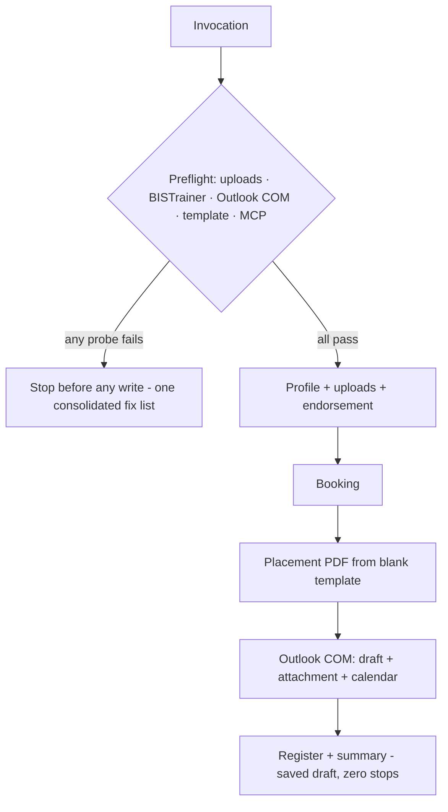
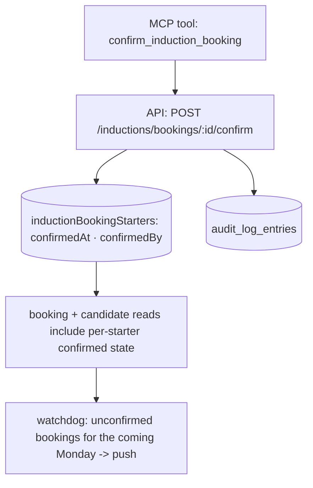

# Zero-Stop Mobilisation Runs - Plan

## Goal Capsule

- **Objective:** a form-path mobilisation run completes with zero mid-run stops in no more than the ~10–15 minutes the task takes Ash by hand, and FormAI records whether each booked induction is confirmed so the watchdog can chase unconfirmed bookings before Monday.
- **Product authority:** Ash Wyborn. The mobilisation is his job function delegated to the agent; CHC/BBM site rules (induction days, Thursday cutoff) are fixed constraints, not design space.
- **Two landing surfaces:** repo units (U1–U3) land as one PR through normal CI; plugin and machine units (U4–U9) land directly on disk and are verified by a supervised smoke run. U8 depends on the repo work being deployed.
- **Stop conditions:** stop and surface rather than guess when a schema change would touch existing booking rows destructively, when a plugin edit would contradict a v2.4.0 behaviour this plan does not name, or when the smoke run hits a blocker outside the preflight's probe set.
- **Open blockers:** none.

---

## Product Contract

### Summary

Rebuild the run infrastructure of the CHC @ BBM mobilisation flow so that every capability the run needs is proven in the first minute, Outlook work leaves the browser entirely, the placement PDF comes from a real template, and the plugin's self-inflicted stalls are removed — plus a booking-confirmation status on FormAI induction bookings, recordable and readable over the MCP.

### Problem Frame

The mobilisation flow takes Ash 10–15 minutes by hand. Automated, it has taken 45 minutes to 4 hours, and the 5 Aug 2026 run (Reece Lincoln) needed repeated human rescue — negative value against doing it manually.

The time does not go to slow execution; it goes to walls discovered mid-run. On 5 Aug, browser upload capability was found broken only *after* the BISTrainer account existed and the invitation email had gone out — an unfinishable run. The confirmation email's attachment turned out to be impossible from the browser at all (native file picker; synthetic paste carries only text), and a clipboard workaround pasted stale text into the email body. The plugin's own hook injects "do not proceed until Ash has given the go-ahead" into every mobilisation prompt, contradicting the autopilot rules the skills declare. The photo crop step prescribes a Python/cv2 script on a machine with no Python. The placement PDF has no blank template, so each starter's copy is cloned from the previous starter's — now an 11.5 MB file for a two-field form. And because plugin skills cache per session, a run can silently follow superseded instructions.

Separately, the induction booking's after-life is invisible to the product. A booking is tentative until Ash's 2pm Thursday check confirms the starter is ready and the seat stands, but FormAI records only that a booking was made — whether it was ever confirmed lives in a hand-kept markdown register and a calendar reminder. The watchdog cannot chase the one recurring deadline that actually costs a seat when missed.

### Key Decisions

- **Fail at minute one or not at all.** Every capability a run will need is probed before the first irreversible action, and a failed probe reports every broken precondition in one message. The 5 Aug failure mode — discovering a wall after creating real accounts and emailing real people — becomes structurally impossible.
- **Outlook via desktop COM, not the browser.** Draft creation (recipients, body, attachment) and the Thursday calendar entry are programmatic COM calls. This deletes the attachment wall — the one step the browser can never do — along with the compose-navigation time. Verified working on the target machine.
- **The watchdog stays read-only.** It surfaces unconfirmed bookings as Thursday approaches; it never records outcomes or books anything. Recording happens in a session Ash drives.
- **Confirmation only, not module tracking.** FormAI records that a booking was confirmed — nothing about the Beakon/BISTrainer module completion behind it. The 2pm Thursday module check is Ash's own task by his explicit choice; the product stores its result, never its substance. Attendance and no-show outcomes stay in the register.
- **Kickoff and send policy are explicitly undecided.** Runs continue to start from Ash's invocation and end at a saved draft. Auto-start (watchdog-initiated, webhook-assisted) and auto-send were explored and deferred — see Scope Boundaries.

### Requirements

**Preflight**

- R1. A run probes every capability it will need before any irreversible action: browser file-upload access to the starter's staged files, a live BISTrainer session, Outlook COM availability, placement-template presence, and FormAI MCP reachability.
- R2. All probes complete within roughly the first minute of the run.
- R3. A failed probe stops the run before anything is created and reports every failed precondition together in one message, each with its specific fix.
- R4. Probes have no side effects; the existing upload probe pattern (throwaway tab, synthetic file input) is the model.

**Outlook off the browser**

- R5. The confirmation email is created as a saved draft in desktop Outlook programmatically — recipients, subject, body, and the placement PDF attached — with no browser compose and no manual attachment step.
- R6. The Thursday gate-check calendar reminder is created programmatically in the same pass.
- R7. Recipient rules from the current flow are preserved: starter plus verified requester, deduplicated, Ash's own address never a recipient, unverified requester addresses flagged in the run summary.

**Placement PDF**

- R8. A blank placement template exists at a fixed, known location; runs fill it and never clone a previous starter's copy.
- R9. The template is compressed so a filled copy is a reasonable email attachment (the current chain produces 11.5 MB; the content is a two-field form).
- R10. Filled copies keep the existing naming convention and are saved to the staging folder and the starter's personnel folder, as today.

**Plugin landmines**

- R11. The plugin hook no longer injects instructions that contradict the skills' autopilot mode; hook guidance and skill text agree on when a run may proceed.
- R12. The photo square-crop requires no runtime absent from the machine; it runs on what stock Windows provides, with a centred-square fallback when face detection is unavailable.
- R13. A run states its plugin skill version at start, so a stale session cache is visible immediately rather than silently followed.
- R14. On the form path, no skill step asks a mid-run question. The only permitted stops are preflight failure (R3) and the genuine hard blockers: login or 2FA failure, a starter missing from the booking typeahead, or a write that fails verification.

**Permissions**

- R15. The mobilisation's tool surface is pre-approved before unattended-length runs, so no run stalls waiting on a permission prompt; a one-time supervised run establishes the stored approvals.

**Booking confirmation**

- R16. An induction booking carries a confirmation status — unconfirmed until Ash confirms it, then confirmed with timestamp and actor.
- R17. The MCP exposes a tool to mark a booking confirmed, gated by the same grant as booking writes, and the existing booking and candidate read surfaces include the status.
- R18. Confirming a booking writes an audit entry, matching the product's existing convention for booking writes.
- R19. The watchdog surfaces bookings for the coming Monday that are still unconfirmed as Thursday approaches, using its existing push-notification discipline; what Ash verifies before confirming is his own checklist, outside the product.

### Key Flows

- F1. Zero-stop run
  - **Trigger:** Ash invokes the mobilisation for a form-path intake.
  - **Steps:** preflight probes (R1–R4) → BISTrainer profile, uploads, endorsement → booking → placement PDF from template (R8–R10) → Outlook draft + calendar entry via COM (R5–R7) → register update → run summary.
  - **Outcome:** saved draft with attachment; no human input consumed between invocation and summary. **Covers R1–R15.**
- F2. Thursday confirmation
  - **Trigger:** watchdog tick in the days before a booked Monday finds unconfirmed bookings (R19).
  - **Steps:** watchdog pushes the due list → Ash performs his own 2pm Thursday check → he (or a session he drives) marks the booking confirmed via the MCP (R16–R18).
  - **Outcome:** FormAI holds the confirmation state; the register no longer carries the deadline alone. **Covers R16–R19.**

### Acceptance Examples

- AE1. **Covers R3.** Given the New Starters folder is not connected to the browser session and Outlook is closed with COM broken, when a run starts, then it stops before any BISTrainer write and reports both failures with their fixes in a single message.
- AE2. **Covers R5.** Given a completed booking, when the run reaches comms, then a draft exists in Ash's Outlook Drafts with the filled placement PDF already attached, and no browser tab touched Outlook.
- AE3. **Covers R13.** Given the session cached an older plugin version than the one on disk, when a run starts, then the version it announces reveals the mismatch before any step executes.
- AE4. **Covers R14.** Given a form-path intake with every mandatory field present, when the run executes end to end, then the transcript contains no question directed at Ash between invocation and the run summary.
- AE5. **Covers R16, R17, R19.** Given a booking Ash confirms after his Thursday check, when the confirmation is recorded, then the booking shows confirmed with timestamp and actor, and a subsequent watchdog tick no longer lists it as due.

### Scope Boundaries

**Deferred for later**

- Kickoff mechanics beyond manual invocation — watchdog auto-start, veto-window pushes, and the FormAI-webhook → Cloudflare Worker → trigger chain were explored and are viable, but Ash is not convinced they are the right model yet. Runs start from his invocation.
- Send policy — whether any run may send the confirmation email itself. Runs end at a saved draft.
- Module-completion tracking — what Ash verifies at 2pm Thursday (Beakon and BISTrainer modules) is his own check and never enters the product; FormAI records only the resulting confirmation.
- Full booking lifecycle in FormAI — attendance, no-show, and roll-forward outcomes stay in the register.
- FormAI web UI for booking and confirmation state — the confirmation surface is MCP-only in this plan.
- Cohort-batching changes — Skill 04's one-booking-per-cohort behaviour is untouched.

**Outside this product's identity**

- Fully unattended cloud mobilisation. BISTrainer is reachable only through Ash's signed-in Chrome on his machine; a cloud session cannot run the flow, and the design treats that as a boundary rather than a gap to engineer around.

### Dependencies / Assumptions

- Desktop Outlook COM automation works on the target machine — **verified 2026-08-05** (Outlook 16.0, correct default account).
- Corporate policy does not block COM automation of Outlook drafts and appointments (drafts were created by hand today through the same profile; no blocking signal observed, unverified as policy).
- Scheduled-task and interactive sessions can use browser control with stored approvals (stated by the harness's own approval-storage behaviour).
- Stock Windows .NET (System.Drawing) suffices for a centred-square image crop without Python.
- FormAI production continues to expose the induction MCP surface this plan extends (verified live 2026-08-05).

### Sources / Research

- 5 Aug 2026 Reece Lincoln run transcript (Ash-supplied excerpt): the attachment wall, the clipboard failure, and the placement-PDF template chain are observed, not hypothesised.
- Live plugin at `Downloads/01 - New Starters/chc-bbm-onboarding` (v2.4.0, all five skills) — already encodes the upload probe and autopilot rules this plan builds on; the hook contradiction is in its `hooks/hooks.json`.
- `packages/mcp-inductions/` and `apps/api/src/routes/inductions.ts` — the MCP and API surface R16–R19 extend; booking writes and their audit convention live here. The tentative-until-confirmed model matches the flow's own emails, which state the booking is pending until the Thursday check.
- The rebuilt `chc-induction-intake-check` scheduled task — the watchdog whose push discipline R19 reuses.
- FormAI intake webhook (`induction_intake.submitted`, org-configurable endpoint) — exists in production; relevant only to the deferred kickoff work.
- `docs/solutions/logic-errors/reading-an-editable-template-by-hardcoded-field-id.md` — governs how new MCP tool descriptions teach agents about data they must not invent.

---

## Planning Contract

Product Contract unchanged from the requirements-only artifact.

### Key Technical Decisions

- **KTD1. Confirmation lives on the booking-starter row, not the booking.** `inductionBookingStarters` already holds one row per starter; confirmation adds nullable confirmed-at plus actor columns there, mirroring the `bookedByUserId`/`bookedByApiKeyId` pair on the booking. A booking reads as confirmed when every starter row is. Rationale: a cohort booking can be partially ready on Thursday, and Ash's check is per person. No new table, no destructive change — existing rows read as unconfirmed, which is true.
- **KTD2. Confirm gates on `submissions.export`, like every booking write.** Confirming asserts an external fact about the booking, the same class of act as recording it — `canBook` in `apps/api/src/routes/inductions.ts` states the reasoning; the confirm route reuses it.
- **KTD3. Outlook work is PowerShell COM.** `New-Object -ComObject Outlook.Application` → `CreateItem` draft with `Attachments.Add`, `Save`; `AppointmentItem` for the Thursday reminder. Chosen over Graph (needs app registration) and the browser (attachment impossible). Scripts are non-interactive and never call `Send`.
- **KTD4. Preflight extends the v2.4.0 probe pattern, consolidated.** Skill 03's Step 0 upload probe generalises into a single preflight block early in Skill 01: run all five probes, collect failures, report once. Probes stay side-effect-free; the BISTrainer probe is a DOM fetch of the cached Manage Users URL checking for a login redirect.
- **KTD5. Two landing surfaces, sequenced.** Repo work is one PR (draft → green CI → merge → deploy). Plugin edits bump every skill to v2.5.0 and land on disk; the version echo (R13) makes the bump visible in-session. The watchdog prompt update (U8) waits for the deployed API since it reads the new confirmation fields.
- **KTD6. Crop is PowerShell System.Drawing centre-crop.** Face detection is dropped rather than replaced — the pre-crop exists to feed BISTrainer's crop widget a square, and a centred square from a portrait photo achieves that. The cv2 snippet is deleted, not conditionally kept.

### Confirmation data flow

### Sequencing

U1 → U2 → U3 (repo PR, strictly ordered) · U4–U7 (plugin, any order, independent of the repo PR) · U6 before the smoke run (template must exist) · U8 after the repo deploy · U9 last.

---

## Implementation Units

### U1. Confirmation columns on booking starters

- **Goal:** `inductionBookingStarters` rows carry confirmation state.
- **Requirements:** R16.
- **Dependencies:** none.
- **Files:** `packages/db/src/schema/` (the file defining `inductionBookings`/`inductionBookingStarters`), generated migration under `packages/db/drizzle/`.
- **Approach:** add nullable `confirmedAt` (timestamptz), `confirmedByUserId`, `confirmedByApiKeyId` to the starter rows, mirroring the booking's `bookedBy*` pair. No backfill — null means unconfirmed, which is accurate for existing rows. Run `pnpm db:generate` and commit the migration; CI's journal-order check guards the sequence.
- **Test scenarios:** covered through U2's route tests — schema-only unit. Test expectation: none — column addition with no behaviour until U2.
- **Verification:** typecheck passes; generated migration is additive only.

### U2. Confirm endpoint and read-surface exposure

- **Goal:** the API records and reports per-starter confirmation.
- **Requirements:** R16, R17 (read surface), R18.
- **Dependencies:** U1.
- **Files:** `apps/api/src/routes/inductions.ts`, `apps/api/src/routes/inductions.test.ts`.
- **Approach:** `POST /inductions/bookings/:id/confirm` accepting optional `submissionIds` (default: every starter on the booking), gated by `canBook`, org-scoped 404 like every other booking route, `recordAudit` entry naming the starters confirmed. `bookingDto` starters gain `confirmedAt`; candidate rows gain a derived `bookingConfirmed` where booked. Re-confirming is idempotent — already-confirmed rows are left untouched and reported as such.
- **Test scenarios:**
  - Covers AE5. Confirming a booking marks all its starter rows with timestamp and actor, and the response reflects it.
  - Partial confirm: `submissionIds` naming one of three starters confirms only that row; the booking reads unconfirmed overall.
  - Idempotency: confirming twice leaves the first timestamp; the response distinguishes newly-confirmed from already-confirmed.
  - Permission: a viewer key gets 403; a cross-tenant booking id gets 404.
  - Audit: the entry names the booking date and starters, mirroring the booking-write entry shape.
  - Unknown `submissionIds` for this booking → 400 naming the strays.
- **Verification:** `pnpm --filter @formai/api test` green; new route follows the router's existing guard order (db → tenant → permission → parse).

### U3. MCP confirm tool and description updates

- **Goal:** agents can confirm bookings and are taught the semantics.
- **Requirements:** R17, R18 (surfacing).
- **Dependencies:** U2.
- **Files:** `packages/mcp-inductions/src/client.ts`, `packages/mcp-inductions/src/tools/bookings.ts`, `packages/mcp-inductions/src/tools.test.ts`, `packages/mcp-inductions/src/client.test.ts`, `docs/induction-mcp.md`.
- **Approach:** `confirm_induction_booking` tool (bookingId, optional submissionIds) calling the U2 endpoint; update `list_induction_bookings`/`get_induction_candidate` descriptions to state that confirmation records Ash's Thursday decision — the tool must never be called to mark a booking confirmed without a human having said so (same teach-the-agent discipline as the `notCollected` description). Operator guide gains the confirm workflow.
- **Test scenarios:**
  - Tool passes bookingId and submissionIds through to the client; client hits the right path with the right body.
  - API error codes (403, 404, 400 strays) surface through the guard as named tool errors, not empty results.
  - Description text asserts the human-decision constraint (string presence test, matching the package's existing description tests if present).
- **Verification:** `pnpm --filter @formai/mcp-inductions test` green; `pnpm --filter @formai/mcp-inductions build` clean, dist rebuilt for the stdio server.

### U4. Consolidated preflight in the plugin

- **Goal:** every wall the 5 Aug run hit is probed before any write.
- **Requirements:** R1–R4, part of R14.
- **Dependencies:** none (plugin surface); U6 for the template probe to pass.
- **Files:** plugin `skills/01-new-starter-intake/SKILL.md`, `skills/03-bistrainer-profile-builder/SKILL.md`.
- **Approach:** a "Preflight — run before anything else" block in Skill 01's autopilot section: upload probe (moved from Skill 03 Step 0, which now references it), BISTrainer liveness (DOM fetch of the cached Manage Users URL, login redirect = fail), Outlook COM one-liner (`New-Object -ComObject Outlook.Application` in a try/catch), template file existence, MCP reachability (one cheap `next_induction_dates` call). Failures accumulate into one report with per-item fixes; any failure stops the run per R3.
- **Test scenarios:** Test expectation: none — prose skill artifact; AE1 is exercised by the U9 smoke run (deliberately break two probes, expect one consolidated report).
- **Verification:** skill text contains all five probes and the consolidated-report instruction; Skill 03's Step 0 no longer duplicates the probe.

### U5. Outlook draft, attachment, and calendar via COM

- **Goal:** Skill 05 produces the draft and reminder without a browser.
- **Requirements:** R5–R7.
- **Dependencies:** U6 (attachment comes from the template-filled PDF).
- **Files:** plugin `skills/05-comms-and-admin/SKILL.md` (steps 2–3 and the calendar step), `skills/05-comms-and-admin/references/email-templates.md` untouched.
- **Approach:** replace browser compose with a PowerShell COM sequence framed as directional guidance: create draft, set To per the existing recipient rules (carried verbatim), body from the template, `Attachments.Add` the filled PDF, `Save` — never `Send`. Calendar reminder as a COM `AppointmentItem` for the Thursday 2pm check. Keep a browser-path note only as the documented fallback if COM errors mid-run (report, don't improvise).
- **Test scenarios:** Test expectation: none — prose skill artifact; AE2 is exercised by the U9 smoke run (draft exists with attachment, no Outlook tab).
- **Verification:** skill text has no browser-compose steps on the happy path; recipient rules survive verbatim; draft-never-send preserved.

### U6. Blank compressed placement template

- **Goal:** the template Skill 05 documents actually exists, small.
- **Requirements:** R8–R10.
- **Dependencies:** none.
- **Files:** `Downloads/01 - New Starters/CHC Site Placement Confirmation - South 32 Template.pdf` (machine artifact, exact filename Skill 05 already names); plugin `skills/05-comms-and-admin/SKILL.md` (drop the clone-a-recent-copy fallback language).
- **Approach:** produce a blank from the current McLaren copy — clear the two AcroForm fields, then rebuild the oversized page background (likely a scanned image) at reasonable resolution so the file lands well under 1 MB. Exact tooling is implementation-time; the PDF form tools already in use can clear and fill fields, and the background rebuild may be a one-time manual export. Verify both fields survive as fillable AcroForm fields.
- **Test scenarios:** fill the blank with test values via the PDF tool and read them back; confirm file size target; confirm Skill 05's fill step works against it unchanged.
- **Verification:** template exists at the documented name; a filled copy attaches at sane size.

### U7. Remove the plugin landmines

- **Goal:** the plugin stops fighting its own autopilot.
- **Requirements:** R11–R13, R14 (audit of remaining question-steps).
- **Dependencies:** none.
- **Files:** plugin `hooks/hooks.json`, `skills/03-bistrainer-profile-builder/SKILL.md` (crop), `skills/01-new-starter-intake/SKILL.md` (version echo), all five `SKILL.md` frontmatter (version bump to 2.5.0).
- **Approach:** hook prompt rewritten to route into Skill 01 without the "do not proceed until go-ahead" clause — mode selection already lives in the skill. Replace the cv2 crop script with a PowerShell System.Drawing centre-square crop (KTD6), same output filename convention. Add a one-line version echo to Skill 01's run start ("running chc-bbm-onboarding v2.5.0"). Sweep all five skills for surviving mid-run questions on the form path; align or delete them (R14), keeping the genuine hard stops.
- **Test scenarios:** Test expectation: none — prose artifacts; AE3 and AE4 are exercised by the U9 smoke run.
- **Verification:** grep the plugin for the contradicting hook text (absent), for `cv2`/`python` in live-path steps (absent), and for version 2.5.0 in all five frontmatters.

### U8. Watchdog chases unconfirmed bookings

- **Goal:** the scheduled task surfaces confirmation deadlines (F2).
- **Requirements:** R19.
- **Dependencies:** U2 deployed to production (the read fields must exist), U3 (rebuilt dist for the stdio server).
- **Files:** `~/.claude/scheduled-tasks/chc-induction-intake-check/SKILL.md` (machine artifact, outside the repo).
- **Approach:** extend the classify step — a booking for the next induction day whose starters are not all confirmed becomes actionable from Wednesday, escalating Thursday ("confirmation due 2pm TODAY"), reusing the existing push discipline and state fingerprint. Stays read-only: the task never calls the confirm tool.
- **Test scenarios:** Test expectation: none — prompt artifact; verified by a "Run now" against production data showing the due list.
- **Verification:** a manual run reports unconfirmed bookings correctly and pushes only per the existing rules.

### U9. Pre-approve the tool surface and run the smoke

- **Goal:** zero permission stalls, and the zero-stop claim proven end to end.
- **Requirements:** R15; exercises AE1–AE4.
- **Dependencies:** U4–U7 complete; U6 template in place.
- **Files:** none (stored approvals + a supervised run).
- **Approach:** one supervised mobilisation run (a test intake or the next real starter) with Ash present to grant each permission once, storing approvals for the browser tools, PowerShell COM pattern, PDF tools, and MCP calls. During the same run, verify AE2–AE4; separately break two probes (disconnect the folder, close Outlook with COM blocked — or simulate) to verify AE1's consolidated report.
- **Execution note:** this unit is verification-heavy by design — the smoke run is the plugin surface's test suite. Time the run; the ≤15-minute target is part of done.
- **Test scenarios:** AE1 (consolidated preflight failure), AE2 (draft with attachment, no browser), AE3 (version echo), AE4 (no mid-run questions), wall-clock ≤15 min.
- **Verification:** the run summary plus a stated wall-clock time.

---

## Verification Contract

| Surface | Gate | Command / method |
|---|---|---|
| Repo (U1–U3) | Types | `pnpm -r typecheck` |
| Repo (U1–U3) | Tests | `pnpm --filter @formai/api test` · `pnpm --filter @formai/mcp-inductions test` |
| Repo (U1) | Migration order | `node scripts/check-migration-order.mjs`; `pnpm db:generate` diff committed (CI enforces both) |
| Repo (U3) | Stdio server | `pnpm --filter @formai/mcp-inductions build`, dist copied for the local stdio config |
| Plugin (U4–U7) | Text audit | greps in U7 verification; skill cross-references resolve |
| End to end (U9) | Smoke run | supervised run: AE1–AE4 observed, wall-clock ≤15 min recorded |
| Watchdog (U8) | Live check | "Run now" reports unconfirmed bookings per the existing push rules |

PR lands as a draft and merges only on green CI, per repo convention.

---

## Definition of Done

- U1–U3 merged to `main` on green CI and deployed to production.
- U4–U7 on disk at v2.5.0; U6 template exists at the documented name and size.
- U8 updated after deploy; a manual watchdog run shows the confirmation chase.
- U9 smoke run completed with AE1–AE4 observed and wall-clock ≤15 minutes recorded.
- No abandoned experimental code in the PR diff; no superseded instructions left standing in the plugin skills.
- `docs/induction-mcp.md` teaches the confirm workflow.
