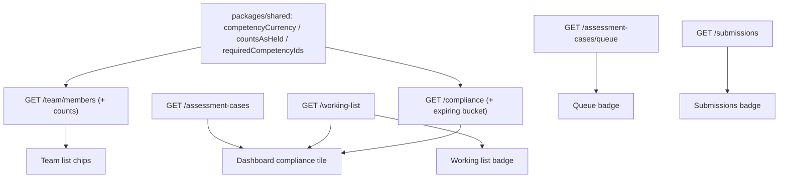

# Admin Oversight Round - Plan

## Goal Capsule

- **Objective:** Give administrators and assessors the compliance state of the workforce at a glance — competency counts on the Team list, count badges on the sidebar's work-queue entries, and a compliance tile on the admin dashboard — without opening records one by one.
- **Product authority:** Ash Wyborn.
- **Open blockers:** None. The document-review-queue badge (R8) waits on the U33 queue screen from `docs/plans/2026-08-04-001-feat-candidate-profile-plan.md`, but the rest of the round does not.

---

## Product Contract

### Summary

Three admin-facing oversight surfaces built on the product's existing expiry and standing logic: per-member competency counts on the Team list, non-zero count badges on the work-queue nav entries, and a four-number compliance tile on the admin dashboard, each number a click-through to the screen that answers it.

### Problem Frame

The admin dashboard reports forms and submissions only, so the workforce-compliance questions an administrator actually starts the day with — who is lapsing, what is waiting on a person — have no landing surface. The Team list names people but says nothing about what they hold, so planning a crew means opening member records one at a time. Work queues (assessor queue, working list, submissions review) only reveal their size after navigating into them.

### Key Decisions

- **Required competencies drive the flags; optional lapses are shown but never flag.** A person is "needing attention" only through competencies their roles require. Optional lapses render as a muted secondary count. This carries the product's existing standing/currency distinction (an expired optional ticket is not a compliance failure) onto the new surfaces.
- **"Expiring soon" reuses the existing 90-day planning window.** The shared expiry logic already defines the assessor-audience window; the tile adopts it rather than introducing a new configurable horizon.
- **Counts are read-time, not pushed.** Badges and tiles refresh when a screen loads or navigation happens. No live updates, no polling contract.
- **Gated surfaces disappear, they don't zero.** Where a plan feature or access level doesn't admit a surface (tile, badge, counts column), it is absent — a zeroed placeholder would advertise capability the org or reader doesn't hold, which the nav already deliberately avoids.

### Requirements

**Team list competency counts**

- R1. Each active member row on the Team list shows how many required competencies are current, how many required competencies need attention (expiring, in grace, or expired), and — muted — how many optional competencies have lapsed.
- R2. The counts arrive with the member list itself in one read; the screen never issues a per-member lookup to build them.
- R3. A member row's counts lead to that member's record, where the underlying competencies are listed.
- R4. Counts appear only for readers whose access admits viewing other members' competencies; the columns are absent otherwise.

**Sidebar count badges**

- R5. The Assessment queue nav entry shows the number of unowned cases the reading assessor is eligible to pull.
- R6. The Working list nav entry shows the number of unresolved working-list items.
- R7. The Submissions nav entry shows the number of submissions sitting in a review state, for every reader the entry is visible to.
- R8. The document review queue receives the same badge treatment when its queue screen (U33 of the candidate-profile plan) ships; it is not part of this round's build.
- R9. A badge renders only when its count is non-zero and only on entries the reader can see; a zero-count entry looks exactly as it does today.

**Admin dashboard compliance tile**

- R10. The admin/owner dashboard carries a compliance tile with four numbers: members with a required competency expiring inside the 90-day window, members with a required competency already expired, assessment cases awaiting sign-off, and unresolved working-list items.
- R11. Each number is a click-through to the screen that answers it (compliance, assessments, working list).
- R12. The tile appears only for admin/owner readers in organisations whose plan carries the assessments tier; it is absent, not empty, everywhere else.

**Shared semantics**

- R13. Every number on these surfaces derives from the same shared expiry and standing logic the member record uses; no surface computes its own second opinion of "expiring" or "required".

### Acceptance Examples

- AE1. **Covers R1.** Given a member holding 5 required competencies (4 current, 1 expired) and 2 optional ones (1 lapsed), their Team row reads 4 current, 1 needing attention, and a muted 1 optional lapse — the lapsed optional never colours the flag.
- AE2. **Covers R9.** An assessor with an empty queue sees the Assessment queue entry with no badge at all, not a "0".
- AE3. **Covers R10.** A member whose required ticket expires in 40 days counts in the tile's expiring-soon number even though the member themself has not yet received their own 30-day warning; the asymmetry of audience windows is accepted, not a defect.
- AE4. **Covers R12.** An owner on a plan without the assessments tier sees today's dashboard unchanged — no tile, no gap where it would sit.

### Scope Boundaries

- Documents on the record, candidate renewal uploads, and profile pictures — already scoped in `docs/plans/2026-08-04-001-feat-candidate-profile-plan.md` (U30, U32, U33, U34); this round does not touch them.
- Expiry notification emails — the surfaces show state; nothing new is sent.
- Live-updating badges (push, sockets, background polling).
- Any redesign of the Compliance, Working list, or Assessment queue screens themselves — this round only adds ways in.

#### Deferred to Follow-Up Work

- Dedicated count endpoints for badge data, if the reused screen queries prove too heavy at real scale.
- Counting never-held required competencies in the Team list's "needs attention" number — today that gap is the compliance screen's `neverHeld` bucket; folding it into the row chip changes R1's stated semantics and needs its own product decision.

### Dependencies / Assumptions

- Verified: the compliance route computes expired and never-held today but has no expiring-within-window query; the 90-day window and "expiring" status already exist in the shared expiry logic (`packages/shared/src/competency-expiry.ts`).
- Verified: the team members read returns identity and role only — no competency data; the app shell has no badge or count machinery.
- The queue and working-list reads return full item arrays; badges reuse them via shared query caching (KTD1) rather than new count reads.
- Document-queue badge (R8) assumes the U33 queue screen lands from the candidate-profile plan.
- Assumed: current org sizes make reusing the working-list read (~20 queries server-side) for an admin's badge acceptable, bounded by the web's 30-second stale window and admin-only fetch gating.

---

## Planning Contract

**Product Contract preservation:** unchanged.

### Key Technical Decisions

- KTD1. **Badges and the tile reuse the screens' existing queries through shared react-query keys; no new count endpoints.** The web already keys these reads (`assessorQueue`, `workingList`, `submissions`, `compliance`, `assessmentCases` in `apps/web/src/lib/data/hooks.ts`), with a 30-second default stale window. A badge and the screen it points at therefore share one cache entry — one source of truth, no double fetch on click-through, and no second API surface to permission-audit. Cost: an admin's shell loads the working list to badge it; accepted per the assumption above, with dedicated count reads deferred.
- KTD2. **The expiring bucket lands in the compliance read, not the dashboard read.** `apps/api/src/routes/compliance.ts` already batch-loads active members, required-ids-by-user, and grants, evaluates `competencyCurrency` per grant on a single `now`, and sits behind admin + `requirePlanFeature('assessments')` gates — exactly the gates R12 needs. The dashboard route is ungated (`apps/api/src/routes/dashboard.ts` requires only a tenant) and forms-focused; putting compliance data there would either leak it or force new gating on an existing open read. The seam: today `if (currencies.some(countsAsHeld)) continue;` swallows expiring holders (expiring still counts as held) — the new bucket is computed just before that continue.
- KTD3. **Team counts are computed server-side inside the existing members read, batched.** `requiredCompetencyIdsByUser` (`apps/api/src/lib/standing.ts`) already resolves required ids for any number of users in ≤4 queries; one `competencyHolders` read over all member userIds and one `competencies` read over the referenced ids complete the inputs. Per-member counts then derive from `competencyCurrency`/`countsAsHeld` on the assessor window. This satisfies R2 without a second endpoint or a web-side fan-out.
- KTD4. **Count visibility rides `permissionScope('profiles', 'view_competencies')`.** The same grant that gates competency reads on the record and licence fields on the holder register decides whether the members read carries counts: scope `all` → counts present; anything else → the field is null and the web renders no column (R4). No new permission category.
- KTD5. **"Current" and "needs attention" overlap by design.** Current measures eligibility (`countsAsHeld`: held, expiring, grace); attention measures urgency (expiring, grace, expired). A required competency in its expiry window counts in both numbers — mirroring how the record shows an expiring ticket as simultaneously valid and flagged. "Optional lapsed" counts fully expired optional grants only; grace still counts as current everywhere.

### High-Level Technical Design

One derivation, three surfaces — every number flows from the shared standing/expiry helpers so no surface can disagree with the record:

Badges, the tile, and their destination screens read the same react-query cache entries (KTD1), so a click-through never refetches what the badge already loaded.

---

## Implementation Units

### U1. API: expiring bucket on the compliance read

- **Goal:** The compliance response gains an `expiring` array — members holding a required competency whose currency status is `expiring` on the assessor window — alongside the existing `expired`, `neverHeld`, `optionalLapses`, `unreachable`.
- **Requirements:** R10, R13. Covers AE3.
- **Dependencies:** none.
- **Files:** `apps/api/src/routes/compliance.ts`, `apps/api/src/routes/compliance.test.ts`, `apps/web/src/lib/data/types.ts` (compliance report type), `apps/web/src/lib/data/store.ts` (passthrough if mapped).
- **Approach:** Inside the existing per-member/per-required-id loop, before the `countsAsHeld` continue, push a gap when some non-revoked grant has status `expiring`. Same single `now`, same gap DTO shape (`userId`, `name`, `competencyId`, `competencyName`), same admin + plan-feature gates. The empty-org early return adds `expiring: []`.
- **Patterns to follow:** the `expired`/`neverHeld` branch in the same handler; `grantsByKey` pre-bucketing already in place.
- **Test scenarios:**
  - Covers AE3. A required grant expiring in 40 days (90-day window) lands in `expiring` and not in `expired`.
  - A grant in its grace period does not land in `expiring` (grace is a different urgency the record already names).
  - A revoked expiring grant is ignored.
  - An expiring optional competency (not in the member's required set) appears in no bucket.
  - Empty org returns `expiring: []` with the other four keys.
  - Rows are org-scoped (assert bound org id, matching the existing test style).
- **Verification:** compliance route tests green; web typecheck green after the type addition.

### U2. API: batched competency counts on the team members read

- **Goal:** `GET /team/members` rows carry `counts: { requiredCurrent, requiredAttention, optionalLapsed }` when the caller's `profiles.view_competencies` scope is `all`; `counts: null` otherwise and on invited rows.
- **Requirements:** R1, R2, R4, R13.
- **Dependencies:** none.
- **Files:** `apps/api/src/routes/team.ts`, `apps/api/src/routes/team.test.ts`, `apps/web/src/lib/data/types.ts` (member row type), `apps/web/src/lib/data/store.ts` (mapping).
- **Approach:** After the existing users lookup: resolve `permissionScope(tenant, 'profiles', 'view_competencies')`; when `all`, batch-load `requiredCompetencyIdsByUser` for all member userIds, one `competencyHolders` read (org-scoped, `revokedAt` null, `inArray` userIds), one `competencies` read for the referenced ids, then fold per member with `competencyCurrency`/`countsAsHeld` on one `now` (assessor audience). Semantics per KTD5. Pending invites keep `counts: null`.
- **Patterns to follow:** the one-query-for-all-holders comment in `apps/api/src/routes/competencies.ts` (`:id/holders`); `requiredCompetencyIdsByUser` usage in `apps/api/src/routes/compliance.ts`.
- **Test scenarios:**
  - Covers AE1. 5 required (4 current, 1 expired) + 2 optional (1 fully expired) → `{ requiredCurrent: 4, requiredAttention: 1, optionalLapsed: 1 }`.
  - An expiring required grant counts in both `requiredCurrent` and `requiredAttention` (KTD5).
  - An optional grant in grace does not count in `optionalLapsed`.
  - Caller whose `view_competencies` scope is not `all` gets `counts: null` on every row.
  - Invited (pending) rows carry `counts: null`.
  - A member with no grants and no requirements gets zeros, not null (counts exist; they are simply zero).
- **Verification:** team route tests green; response shape change reflected in web types with typecheck green.

### U3. Web: Team list count chips

- **Goal:** Member rows render the counts as compact chips — current (success tone), needs attention (warning tone, only when non-zero), optional lapses (muted, only when non-zero) — linking to the member's record; the column is absent when the API sent no counts.
- **Requirements:** R1, R3, R4. Covers AE1.
- **Dependencies:** U2.
- **Files:** `apps/web/src/screens/enterprise/TeamScreen.tsx`, `apps/web/src/screens/enterprise/TeamScreen.test.tsx` (new).
- **Approach:** A fixed-width chip group slots into `MemberRow` between the status badge and the action buttons (the row is a flex layout with fixed-width slots). Chips wrap in a link to `/app/profile/<membershipId>` (R3). Rows with `counts: null` render nothing — no header change needed since the row is not a table.
- **Patterns to follow:** Badge usage and row layout already in `MemberRow`; the summary-chip pattern on the record's competencies card (`apps/web/src/screens/enterprise/ProfileScreen.tsx`).
- **Test scenarios:**
  - Covers AE1. Counts render as "4 current", "1 attention", muted "1 optional lapsed" for the AE1 shape.
  - `counts: null` renders no chip group.
  - Zero attention and zero lapses render only the current chip (no "0" chips).
  - The chip group links to the member's record path.
- **Verification:** new screen test green alongside the existing web suite.

### U4. Web: nav count badges

- **Goal:** Nav entries for Assessment queue, Working list, and Submissions carry a count pill when their count is non-zero; nothing renders at zero; no fetch fires for entries the reader's nav does not contain.
- **Requirements:** R5, R6, R7, R9. Covers AE2.
- **Dependencies:** none (parallel with U1–U3).
- **Files:** `apps/web/src/layouts/AppShell.tsx`, `apps/web/src/layouts/nav-badges.tsx` (new), `apps/web/src/layouts/nav-badges.test.tsx` (new).
- **Approach:** A `NavBadge` component keyed by screen key, mounted inside `NavItem`'s trailing slot only for the three badged keys. Counts come from the existing hooks — `useAssessorQueue().data?.length`, `useWorkingList().data?.length`, and `useSubmissions()` filtered to the review-state statuses the dashboard already treats as pending review — each hook `enabled` only when its entry is present in the rendered nav (KTD1; the visibility gate is what prevents 403 noise for lower roles). Display caps at 99+.
- **Patterns to follow:** query keys and hooks in `apps/web/src/lib/data/hooks.ts`; the count-pill styling of the status tabs (`apps/web/src/screens/TemplatesScreen.tsx`, `SubmissionsScreen.tsx`).
- **Test scenarios:**
  - Covers AE2. Zero count renders no badge element.
  - Non-zero count renders the pill with the number; 120 renders "99+".
  - The submissions count includes exactly the review-state statuses and excludes approved/rejected.
  - The badge hook for an entry not in the reader's nav does not fetch (enabled=false path).
- **Verification:** new badge tests green; existing AppShell-dependent tests unaffected.

### U5. Web: admin dashboard compliance tile

- **Goal:** `WorkspaceDashboard` gains a compliance tile for admin/owner readers on assessments-tier plans: expiring members, expired members, cases awaiting sign-off, working-list size — each navigating to its screen; absent entirely otherwise or while data is missing.
- **Requirements:** R10, R11, R12, R13. Covers AE3, AE4.
- **Dependencies:** U1.
- **Files:** `apps/web/src/screens/DashboardScreen.tsx`, `apps/web/src/screens/dashboard-compliance.ts` (new pure helper), `apps/web/src/screens/dashboard-compliance.test.ts` (new).
- **Approach:** A pure helper folds the three reads into the four numbers — unique members across `expiring` gaps, unique members across `expired` gaps, `assessmentCases` filtered to `awaiting_sign_off`, working-list length — so the counting logic tests without rendering. The tile renders as a second stat row in `WorkspaceDashboard`, gated on `session.role` admin/owner and `session.features.assessments`; each stat is a button navigating to `/app/compliance`, `/app/assessments`, or `/app/working-list`. Fetches are `enabled` by the same gate (the compliance and working-list APIs are admin-gated), and the tile renders only once data arrives — errors and loading show nothing rather than zeros (Key Decision: gated surfaces disappear).
- **Patterns to follow:** the stat-card grid already in `DashboardScreen.tsx` (all three dashboards use the same card shape); role gating as in `DashboardScreen`'s role branch.
- **Test scenarios:**
  - Covers AE3. A member in the `expiring` bucket counts once in expiring-members even with two expiring gaps.
  - The same member appearing in both `expiring` and `expired` buckets counts in each number independently.
  - Awaiting-sign-off counts only `awaiting_sign_off` cases, not `open`.
  - Covers AE4. Non-admin role or missing assessments feature → helper consumers render no tile and fire no compliance fetch.
- **Verification:** helper tests green; web suite and typecheck green.

---

## Verification Contract

| Gate | Command | Applies to |
|---|---|---|
| API route tests | `cd apps/api && npx vitest run src/routes/compliance.test.ts src/routes/team.test.ts` | U1, U2 |
| API full suite | `cd apps/api && npx vitest run` | all API changes |
| API typecheck | `cd apps/api && npx tsc --noEmit -p tsconfig.json` | U1, U2 |
| Web targeted tests | `cd apps/web && npx vitest run src/screens/enterprise/TeamScreen.test.tsx src/layouts/nav-badges.test.tsx src/screens/dashboard-compliance.test.ts` | U3, U4, U5 |
| Web full suite | `cd apps/web && npx vitest run` | all web changes |
| Web typecheck | `cd apps/web && npx tsc --noEmit -p tsconfig.json` | U2–U5 |

Both full suites and both typechecks green before the PR is opened.

---

## Definition of Done

- All five units implemented with their test scenarios covered; both full suites and typechecks green.
- Every rendered number traces to the shared expiry/standing helpers (R13) — no surface-local re-derivation of "expiring" or "required".
- Gated absence verified by test for each surface: counts column (R4), badges (R9), tile (R12).
- No abandoned or experimental code left in the diff.
- Draft PR opened per repo convention; merge only on green CI.
