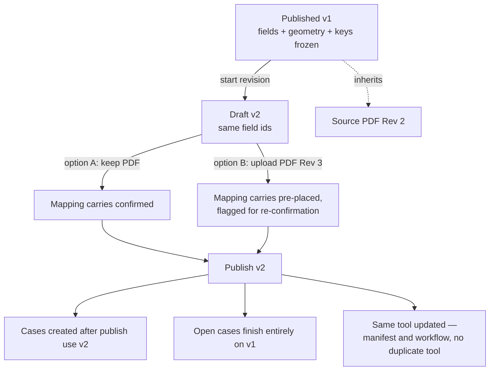
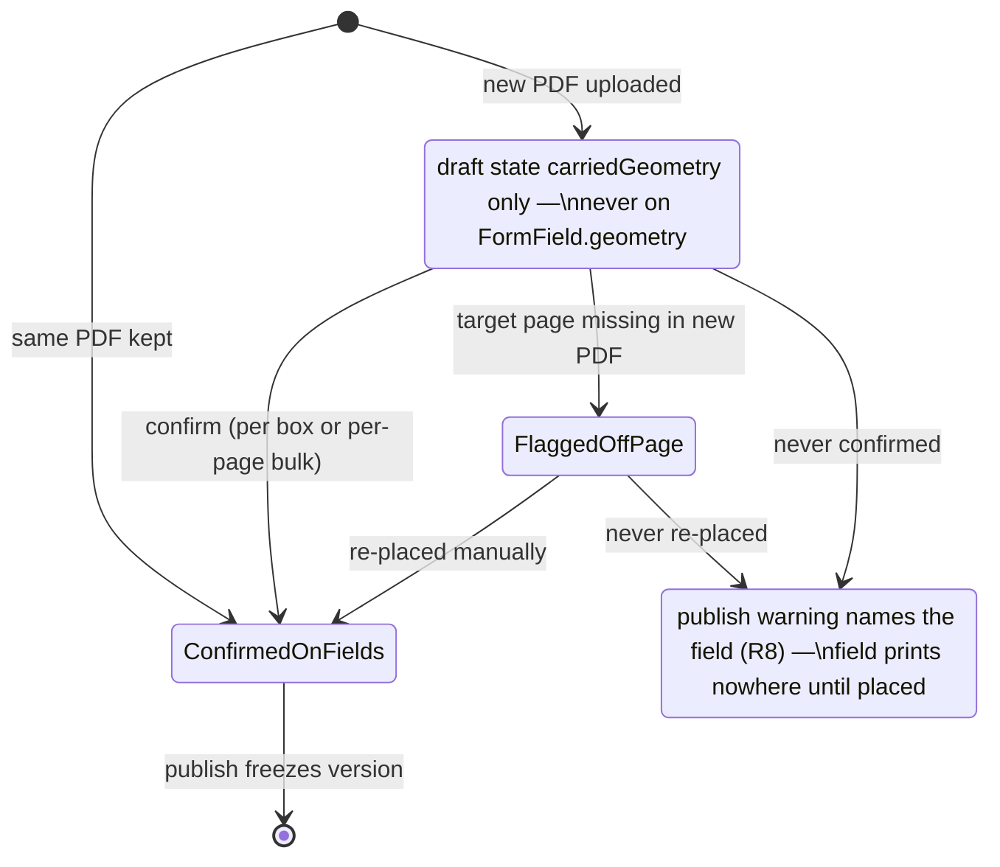

# Assessment Tool Revisions - Plan

## Goal Capsule

- **Objective:** Let a published assessment tool be revised — webform tweaks, or a new revision of the source PDF — without rebuilding the tool from scratch.
- **Product authority:** Ash Wyborn (owner); scope confirmed in brainstorm and plan-scoping dialogue 2026-08-13.
- **Authority hierarchy:** Product Contract (below) > Planning Contract > per-unit Approach. Repo conventions and CI gates override stylistic choices in this plan.
- **Stop conditions:** Surface as a blocker (do not guess): any change to published-version immutability or submission/attempt pinning beyond what U3 specifies; any need to regenerate field ids; any manifest validation gap that would let a revision publish with dangling field references.
- **Open blockers:** None.

---

## Product Contract

### Summary

A "start revision" path on a published assessment tool forks everything already built — webform fields, PDF mapping, answer keys, units and gating, workflow — into a new draft version, optionally against a newly uploaded PDF revision. Publishing v2 becomes an edit-and-touch-up job. Each version also carries the paper document's revision identity for auditors.

### Problem Frame

Authoring a tool takes days: the placement pass alone runs a couple of hours across hundreds of boxes, and answer keys wait on someone confirming them against source manuals. Yet published versions are frozen — correctly, because submissions and attempts pin to them — so today even a one-field-type fix or a section reorder has no edit path, and a routine annual review of the paper document (new rev number, same questions) would mean rebuilding the entire tool. The import wizard's re-extract path is no escape: it re-assigns every field id, silently invalidating the manifest, answer keys, and outcome targets keyed to them, and deliberately wipes geometry confirmations.

### Key Decisions

- **Revision is a builder re-entry, not a separate quick-fork surface.** One authoring path covers every kind of tweak — field type, section order, answer key, gating, workflow, mapping. A version-history shortcut would be faster for cosmetic swaps but stranded the moment a revision needs a structural edit, and would drift from the builder.
- **Field ids are the spine; a revision never re-extracts.** The manifest, answer keys, and outcome targets are all keyed to field ids, so a revision seeds from the published version's fields (ids preserved) and never re-runs AI extraction. New or removed questions are handled by manual field edits in the builder.
- **Geometry carries; confirmation does not cross PDFs.** On the same PDF, mapping carries fully confirmed. On a new PDF, boxes carry pre-placed as a starting point but flagged for re-confirmation — a box confirmed against Rev 2's layout was not confirmed against Rev 3's. This extends the import wizard's existing rule.
- **Publish keeps today's pinning semantics; the change note is the human signal.** An open case finishes all its parts against the version it started on; cases created after publish use the new version. No re-do, invalidation, or mid-case version-advance machinery — the recorded change note lets assessors judge severity themselves.
- **Paper revision identity is first-class version metadata.** Rev code, review date, and change note live on the version and surface in the UI and on printed evidence. The internal auto-sequenced version label (v1, v2) stays as the system identity.



### Requirements

**Starting a revision**

- R1. A member can start a revision from a published assessment tool; it opens the builder as a draft seeded from the tool's current published version.
- R2. The seed carries the full authored state: fields with their geometry and answer keys, units and gating, the tool manifest, the workflow, and the current source PDF.
- R3. Field ids in the seeded draft are identical to the published version's — the revision path never re-assigns them.
- R4. The upload step accepts an optional replacement PDF; skipping it keeps the existing source PDF.
- R5. A revision never re-runs AI extraction; structural changes (add, remove, retype, reorder fields and sections) are made through the builder's editing surfaces.

**Mapping carry-over**

- R6. When the source PDF is unchanged, mapping carries over confirmed — no re-placement or re-confirmation is required.
- R7. When a new PDF is uploaded, every carried box is pre-placed at its old position but treated as unconfirmed until re-confirmed in the mapping step; re-confirmation is available as a per-page bulk action, not only box-by-box.
- R8. Before publishing, the revision surfaces which fields lack confirmed mapping, so unprinted boxes are a visible choice rather than a silent loss.

**Version identity and audit**

- R9. Each version records the paper document's revision identity: revision code, review date, and a change note.
- R10. The revision identity is visible in the version history UI and on printed evidence exports.

**Publishing**

- R11. Publishing a revision follows existing semantics: submissions and attempts pin versions exactly as they do today; the tool's manifest and workflow updates apply to the same tool, never minting a duplicate.
- R12. A revision publish passes the same manifest and answer-key validation as a first publish, plus the workflow, prefill, prerequisite, and location-rule validators, against the revised fields.

**Revision integrity**

- R13. A tool has at most one revision draft; starting a second points at the existing draft (resume or discard) instead of overwriting it.
- R14. Publish refuses with a named reason when the tool's current version changed after the revision was seeded (someone else published first).
- R15. Answer-key verification state carries forward for keys whose answer is unchanged; editing a key's answer clears its verification.
- R16. Publishing a revision whose manifest would dangle against an open case's pinned fields (a removed part key or referenced field id still in flight) is refused with a named reason listing the affected cases; revisions that keep all referenced ids and part keys publish freely.

### Key Flows

- F1. Cosmetic PDF revision (annual review, same layout)
  - **Trigger:** A reviewed paper document arrives with a new rev number and unchanged questions.
  - **Steps:** Start revision → upload the new PDF → mapping step shows carried boxes for re-confirmation (per-page bulk confirm) → set rev code, review date, change note → publish.
  - **Outcome:** v2 live with the new PDF; webform, gating, keys, and workflow untouched. Covers R1–R4, R7–R11.
- F2. Webform-only tweak
  - **Trigger:** A field has the wrong type, or sections need reordering; the paper document is unchanged.
  - **Steps:** Start revision → keep the existing PDF → make the edit in the builder → publish.
  - **Outcome:** v2 live; mapping carries confirmed and is never touched. Covers R1–R3, R5, R6, R11.
- F3. Structural revision
  - **Trigger:** The new paper revision adds, removes, or moves questions.
  - **Steps:** Start revision → upload the new PDF → add or remove fields manually, adjust keys and gating → re-place and confirm mapping where the layout moved → publish.
  - **Outcome:** v2 live; everything unchanged carried over, only the diffs were authored. Covers R1–R5, R7–R12.

### Acceptance Examples

- AE1. **Covers R6.** Given published v1 with confirmed geometry, when a revision keeps the same PDF and publishes v2, then v2's geometry is identical to v1's and remains confirmed, and evidence exports render exactly as before.
- AE2. **Covers R7, R8.** Given a revision with a new PDF where three carried boxes were never re-confirmed, when the author reaches publish, then the three affected fields are named before publish proceeds.
- AE3. **Covers R11.** Given a candidate with an open case on v1, when v2 publishes, then the case continues and completes all remaining parts against v1 (evidence exports against the v1 PDF), and cases created after publish use v2.
- AE4. **Covers R9, R10.** Given v2 recorded as "Rev 3, reviewed 08/2026 — annual review, no content change", when evidence is printed from a v2 attempt, then that revision identity appears on the export.
- AE5. **Covers R13.** Given a tool with an existing revision draft, when a member starts another revision of that tool, then the attempt is refused and points at the existing draft with resume and discard options.

### Success Criteria

- A cosmetic revision (F1) requires touching only the upload, mapping, and publish steps — no step forces re-entry into generation, units, answer keys, or workflow.
- Nothing authored for v1 is ever rebuilt by hand in a revision; the only manual work is the delta — including answer-key verification, which survives for unchanged keys.

### Scope Boundaries

Deferred for later:

- Side-by-side page diffing that flags which pages of a new PDF visibly changed (review-time aid on top of this feature).
- Any machinery to invalidate, re-do, or version-advance open cases on publish — including the pointer-advance the `assessment_cases` schema comment describes but no code implements. The change note is the only severity signal.
- Assisted extraction of newly added questions during a revision (manual field addition covers it for now).
- Changes to the import wizard's re-extract path — it keeps its current behaviour.

### Dependencies / Assumptions

- The existing version-fork endpoint preserves field ids by caller convention, not server enforcement — the revision seed passes the published version's fields verbatim to uphold it.
- Only reviewer-confirmed geometry is ever written to published fields; absence means unconfirmed. R7 relies on this staying true (see KTD2).
- The builder currently has no path seeded from an existing tool — revision mode is a net-new entry into an otherwise reused builder.

### Sources / Research

- Version model and freeze semantics: `packages/db/src/schema/forms.ts`, `packages/db/src/schema/submissions.ts`.
- Attempt pinning and the stale pointer-advance comment: `packages/db/src/schema/assessments.ts` (~186–190, ~300–303).
- Fork endpoint (id preservation, PDF inherit/override) and draft-edit guard: `apps/api/src/routes/forms.ts` (~291–368, ~418–477).
- Geometry and confirmation semantics: `packages/shared/src/form-field.ts` (~239–242, ~384–390), `packages/shared/src/geometry.ts`.
- Builder draft model, autosave, and forced publish order: `packages/shared/src/builder.ts`, `packages/db/src/schema/builder-drafts.ts`, `apps/api/src/routes/builder-drafts.ts`, `apps/web/src/screens/assessments/builder/builder-publish.ts`, `apps/web/src/screens/assessments/builder/use-builder-persistence.ts`.
- Placement embedding and proposal tiers: `apps/web/src/screens/assessments/builder/steps/PlacementStep.tsx`, `apps/web/src/screens/import/GeometryEditorScreen.tsx`, `apps/web/src/screens/import/inspector/geometry-actions.ts`.
- Unplaced-mark warning pattern (PR #203): `packages/shared/src/assessment.ts` (`unplacedMarkDestinations`, ~1453–1515).
- Evidence export pipeline: `apps/api/src/routes/assessments.ts` (~2568–2713), `apps/api/src/pdf/case-export.ts`, `apps/api/src/pdf/round-trip.ts`.
- Institutional learning on field-id drift: `docs/solutions/logic-errors/reading-an-editable-template-by-hardcoded-field-id.md`.
- Import wizard re-extract (what a revision must not do): `apps/web/src/lib/data/import-session.ts`, `docs/plans/2026-07-21-002-feat-form-delete-archive-reextract-plan.md`.
- Original builder scope: `docs/plans/2026-08-05-001-feat-assessment-builder-implementation-plan.md`.

---

## Planning Contract

**Product Contract preservation:** changed: AE3 — rewritten to the pinning semantics the code actually implements (open cases finish entirely on their pinned version; nothing advances a case's version pointer — the schema comment promising advance is stale and is corrected in U1). Key Decisions publish bullet and the diagram updated to match. Added: R7 bulk-confirm clause, R13–R15, AE5 (revision-integrity behaviours confirmed during plan scoping); R16 (open-case compatibility guard, from document review — without it a structural republish would swap the shared tool manifest under open cases and break AE3's promise). All other IDs unchanged.

### Key Technical Decisions

- **KTD1 — Republish is one transactional server endpoint, not client-sequenced writes.** A second `POST /assessment-tools` for the same template violates `assessment_tools_template_uq`, and `PATCH /assessment-tools/:id` cannot carry a new parts manifest — so revision publish gets a new endpoint (`POST /assessment-tools/:id/republish`) that, in one transaction: validates the full manifest, answer keys, workflow, prefill, prerequisite, and location-part references against the draft version's fields; re-validates the incoming manifest against the pinned version fields of every open case on the tool, refusing 409 `open_cases_incompatible` naming the cases when any part key or referenced field would dangle (R16 — cosmetic revisions pass; structural revisions wait for open cases to settle); saves resolved fields onto the draft version; writes `revisionIdentity` onto it; publishes it (advancing `currentVersionId`, restoring an archived template per existing publish semantics); updates the tool's manifest while preserving admin config the create path would zero (`departmentId`, `locationPartKeys`, competency and prerequisite ids); and deletes the tool's revision draft row, freeing the one-revision-per-tool slot. Client sequencing would risk a published version with a stale tool — the exact state `builder-publish.ts` warns about.
- **KTD2 — Carried geometry on a new PDF lives in builder draft state as proposals; `FormField.geometry` keeps meaning "confirmed".** Same-PDF revision: fields keep their geometry — carries confirmed (R6). New-PDF revision: geometry is stripped from the fields written to the forked draft version; the old boxes are stashed in the draft state (`carriedGeometry`, keyed by field id) and seeded into the geometry editor as needs-review proposals; confirming writes them onto the version via the existing draft-fields PATCH. Boxes referencing pages beyond the new PDF's page count are flagged distinctly, never silently dropped. This is forced by the load-bearing invariant that stored geometry is confirmed by definition — writing carried boxes to fields would make the exporter print v1's boxes against v3's layout with no warning.
- **KTD3 — Revision draft identity is DB-enforced.** `assessment_tool_drafts` gains nullable `revisionOfToolId` with a partial unique index (one revision draft per tool). On POST with `revisionOfToolId` set, the route resolves the tool inside the caller's org (404 on mismatch — the id must never act as a cross-tenant oracle) and returns 409 `revision_draft_exists` with the existing draft's summary unless the save targets that same row, so autosaves pass; the partial unique index is a race backstop only, because the upsert-by-`(orgId, name)` arbiter would otherwise silently overwrite the existing draft (R13/AE5). The draft also records `seededFromVersionId` (in draft state); republish compares it to `template.currentVersionId` and refuses 409 `stale_revision` on mismatch (R14). Revision drafts get a distinct name (tool name + rev label) so autosave cannot collide with the original build draft.
- **KTD4 — Revision identity is a nullable jsonb on the version row.** `form_template_versions.revisionIdentity` (`{ code, reviewedOn, note }`). Plain non-assessment forms never set it. It reaches evidence exports through the version an attempt pins, and the version-history UI's existing-but-never-populated `note` render path lights up from it. Nullable column, no backfill — existing versions simply lack it (matches the repo's nullable-first migration pattern).
- **KTD5 — Seed precedence: fields and geometry from the published version; working state from the surviving build draft.** The published version is canonical for fields, geometry, and answer keys. Builder working state the version cannot reconstruct — key verification (`verifiedBy`/`verifiedAt`), structure grouping, `excludedFieldIds`, `partOverrides`, setup answers — seeds from the original builder draft row when one exists with a matching `formId`; otherwise it is reconstructed conservatively (keys present but unverified). Verification carries only for keys whose `answerKey` is unchanged (R15).
- **KTD6 — In-flight semantics stay exactly as implemented.** Nothing updates `assessmentCases.currentVersionId` after creation; open cases finish on their pinned version, new cases pin the new current version. The stale schema comment claiming republish advances the pointer is corrected in U1 so it cannot mislead again. Pointer-advance is deferred (Scope Boundaries).
- **KTD7 — Revision mode never runs extraction.** The builder's hydrate path treats a draft with fields but no `extraction` as ready; the upload step in revision mode uploads the replacement PDF only (`/pdf/upload`, never `/pdf/extract`).
- **KTD8 — Permissions ride existing gates, and the drafts surface is hardened.** Start-revision and republish sit behind the same permissions as the fork and tool-create paths (`forms.edit` / assessments gates). `builder-drafts` routes currently check only `requireTenant`; since a revision draft carries the published answer key, all four routes (create, list, read, delete) gain `hasPermission(tenant, 'forms', 'edit')` in U4 — the read route included, because that is where the answer key travels.

### High-Level Technical Design

Republish sequence (U3, U7) — the order is forced: validation must run against the draft version's fields before anything is written, and the tool update must land with the publish or not at all:

```mermaid
sequenceDiagram
  participant W as Builder publish step (web)
  participant A as POST /assessment-tools/:id/republish
  participant DB as Postgres (one transaction)
  W->>A: versionId, seededFromVersionId, manifest, revisionIdentity
  A->>A: staleness check (seededFrom vs currentVersionId) → 409 stale_revision
  A->>A: validateManifest + validateAnswerKeys + workflow/prefill/prereq/locationPartKeys vs draft fields → 400 with problems
  A->>DB: save resolved fields onto draft version
  A->>DB: publish version (state, publishedAt/By, currentVersionId, restore archived template)
  A->>DB: update tool manifest (preserve admin config columns)
  DB-->>A: commit — or rollback leaves version draft and tool untouched
  A-->>W: 200 (or named 409/400; nothing partially applied)
```

Carried-geometry lifecycle (U5, U6) — what "pre-placed but unconfirmed" means in storage:



### Assumptions

- The geometry editor's proposal machinery (`classifyProposalTier`, apply-then-save) can accept externally seeded proposals; U6 extends its input rather than building a second overlay path.
- `pdfjs-dist` rendering needs no changes for a replaced PDF — the viewer already renders whatever `sourcePdfAssetId` resolves to.

### Risks

- **Two aggregates in one transaction (U3).** The republish endpoint writes form-version and tool rows together; a partial failure must leave the version draft and the tool untouched. Mitigated by a single Drizzle transaction and rollback tests.
- **Bulk confirm can become a rubber stamp.** Per-page bulk confirm (R7) makes F1 fast but honest review depends on the page overlay being legible; U6 keeps the per-page action scoped to one visible page at a time, never a whole-document "confirm all".
- **Draft-state size.** `carriedGeometry` for hundreds of boxes rides the existing opaque `state` jsonb; autosave already ships the full state every 2s, so this adds payload but no new mechanism. Watch autosave payload size in review; not expected to need chunking.

---

## Implementation Units

### U1. Schema and shared types for revision identity and revision drafts

- **Goal:** Persistence and types exist for revision identity on versions and revision linkage on builder drafts.
- **Requirements:** R9, R13 (storage), KTD3, KTD4, KTD6.
- **Dependencies:** None.
- **Files:** `packages/db/src/schema/forms.ts`, `packages/db/src/schema/builder-drafts.ts`, `packages/db/src/schema/assessments.ts` (comment fix only), generated `packages/db/drizzle/00NN_*.sql` + journal, `packages/shared/src/builder.ts`, `packages/shared/src/form-field.ts` or a sibling shared module for the `RevisionIdentity` type, `packages/shared/src/*.test.ts` for any new parsing/validation helpers.
- **Approach:** Add nullable jsonb `revisionIdentity` (`{ code, reviewedOn, note }`, all optional strings) to `formTemplateVersions` with a JSDoc comment following the schema's narration style. Add nullable uuid `revisionOfToolId` (FK to `assessment_tools`, on delete set null) to `assessment_tool_drafts` with a partial unique index over non-null values. Extend the shared `BuilderDraft` type with `revisionOfToolId`, `seededFromVersionId`, `revisionIdentity`, and `carriedGeometry` (record of field id → `FieldGeometry`). Correct the stale `assessmentCases` doc comment: republishing does not advance the case pointer; cases finish on the version they started on (KTD6). Generate the migration with the repo's drizzle flow; nullable columns, no backfill.
- **Patterns to follow:** Column-add migration shape of `packages/db/drizzle/0022_bumpy_argent.sql`; JSDoc-narrated columns in `forms.ts`/`builder-drafts.ts`.
- **Test scenarios:**
  - Migration applies cleanly and drizzle generate produces no further drift (CI gate).
  - Shared type: a `RevisionIdentity` with only `note` set is valid; an empty object is valid; extraneous keys and over-length values (code > 64, reviewedOn > 32, note > 2000 chars) are rejected by the zod schema the republish body (U3) consumes.
  - Partial unique index: two drafts with `revisionOfToolId = null` coexist; two with the same tool id violate.
- **Verification:** `packages/db` and `packages/shared` typecheck and test suites pass; migration journal order gate passes.

### U2. Version API carries revision identity

- **Goal:** Revision identity round-trips through the forms API and reaches the web DTOs.
- **Requirements:** R9, R10 (data path), KTD4.
- **Dependencies:** U1.
- **Files:** `apps/api/src/routes/forms.ts`, `apps/api/src/routes/forms.test.ts`, `apps/web/src/lib/data/types.ts`, `apps/web/src/lib/data/store.ts`.
- **Approach:** Read side only — the republish endpoint (U3) is the sole writer of `revisionIdentity`, so version create and draft-fields PATCH stay untouched. Version list/detail responses include `revisionIdentity`; map `revisionIdentity.note` into the web `TemplateVersion.note` field (already rendered by `TemplatesScreen` but never populated) and expose the full identity on the DTO.
- **Patterns to follow:** Existing version DTO shaping in the forms routes and `apps/web/src/lib/data/store.ts`.
- **Test scenarios:**
  - Covers AE4 (data half): a version row carrying `revisionIdentity` returns code, date, and note on the version list and detail responses.
  - Version without the field returns null identity; plain-form flows unaffected.
- **Verification:** `apps/api` suite passes; web typecheck passes.

### U3. Transactional republish endpoint

- **Goal:** One server call publishes a revision's draft version and updates the existing tool, or does nothing.
- **Requirements:** R11, R12, R14, KTD1, KTD3 (staleness), KTD6.
- **Dependencies:** U1, U2.
- **Files:** `apps/api/src/routes/assessments.ts`, `apps/api/src/routes/assessments.test.ts`, reuse of validators in `packages/shared/src/assessment.ts`.
- **Approach:** `POST /assessment-tools/:id/republish` with body `{ versionId, seededFromVersionId, manifest, name?, revisionIdentity? }`. Guards in order: tenant + permission (same gate as tool create); tool exists and its `templateId` owns `versionId`; version is a draft; `seededFromVersionId === template.currentVersionId` else 409 `stale_revision`; full validation set (`validateManifest`, `validateAnswerKeys`, workflow, `profilePrefill`, `prerequisiteChecks`, `fieldDefaults`, `locationPartKeys`) against the draft version's fields, 400 `invalid_manifest` with `problems`. Also per R16: validate the incoming manifest against the pinned version fields of each open case on the tool; 409 `open_cases_incompatible` naming the affected cases when a part key or referenced field id would dangle. Then one transaction: write resolved fields and `revisionIdentity` to the draft version; publish it (existing publish semantics including archived-template restore); update the tool row's manifest (and name if provided) preserving `departmentId`, `locationPartKeys`, competency/prerequisite/awarded columns; delete the tool's revision draft row so the next start-revision seeds fresh. Audit the republish.
- **Execution note:** Start with failing route tests for the 409/400 guard matrix — the guard order is the contract.
- **Test scenarios:**
  - Happy path: draft version + valid manifest → 200; version published; `currentVersionId` advanced; tool manifest replaced; `departmentId` and `locationPartKeys` unchanged.
  - Covers AE3: an existing case created before republish keeps its `currentVersionId`; a case created after uses the new version (assert no case-row mutation).
  - Covers R14: `seededFromVersionId` ≠ current → 409 `stale_revision`, nothing written.
  - Manifest referencing a field id absent from the revised fields → 400 with `problems`; version stays draft.
  - Dropped part still named in `locationPartKeys` or `prerequisiteChecks` → 400 with `problems` naming the orphan.
  - Covers R16: open case whose pinned version still uses a part key the new manifest drops → 409 `open_cases_incompatible` naming the case, nothing written; same manifest with no open cases → 200.
  - After a 200, the tool's revision draft row is deleted — a subsequent start-revision seeds fresh instead of 409ing.
  - Rollback: force the tool update to fail → version remains draft, `currentVersionId` unmoved, revision draft still present.
  - Archived template: republish restores it (existing publish semantics preserved).
  - Wrong tenant / missing permission → 403; version belonging to a different template → 404/409.
- **Verification:** `apps/api` suite passes; no schema drift.

### U4. Revision seed and start-revision entry point

- **Goal:** "Start revision" on a published tool creates a fully seeded revision draft and opens the builder on it.
- **Requirements:** R1, R2, R3, R13, R15, KTD3, KTD5, KTD8.
- **Dependencies:** U1.
- **Files:** `apps/api/src/routes/builder-drafts.ts`, `apps/api/src/routes/builder-drafts.test.ts`, new `apps/web/src/screens/assessments/builder/revision-seed.ts` + test, `apps/web/src/lib/data/store.ts` / hooks, the assessment tools list/detail screen for the action button.
- **Approach:** Seed composition (client module, unit-testable pure function): fields + geometry + answer keys from the tool's current published version (verbatim — id preservation is the point); manifest and workflow from the tool; `assetId` from `version.sourcePdfAssetId`; working state (structure grouping, `excludedFieldIds`, `partOverrides`, setup, key verification) from the surviving builder draft row whose `formId` matches, per KTD5 — verification carried only where the seeded key's answer matches the draft's. Draft is created with `revisionOfToolId`, `seededFromVersionId` (in state), step `upload` — the revision lands on the upload step so the keep-or-replace PDF choice is explicit (see U5), and a distinct name (`<tool name> — <next rev label>`). Server: on POST with `revisionOfToolId`, resolve the tool within the caller's org first (404 `not_found` on mismatch — never a cross-tenant oracle), then return 409 `revision_draft_exists` with the existing draft's summary (id, name, updatedAt, creator) unless the save targets that same row, so autosaves pass; the partial unique index is a race backstop. The resume-or-discard dialog shows that summary, and Discard requires a confirmation naming the consequence ("deletes that draft's revision work; the published tool is unaffected"). The start-revision button shows a pending state while the seed composes; a seed-fetch failure surfaces a retryable error without creating a draft. All four `builder-drafts` routes gain `hasPermission(tenant, 'forms', 'edit')` (KTD8).
- **Patterns to follow:** Upsert-by-`(orgId, name)` draft create; store hooks in `apps/web/src/lib/data/store.ts` (`useForkDraftVersion` shape); 409-with-named-reason pattern.
- **Test scenarios:**
  - Seed function: field ids in output identical to version fields (covers R3); manifest/workflow present; assetId set.
  - Covers R15: version key unchanged from surviving draft → `verifiedBy`/`verifiedAt` carried; key differing → verification cleared.
  - No surviving draft row → keys seeded unverified, structure reconstructed from section headers, no crash.
  - Covers AE5: second start for the same tool → 409 `revision_draft_exists` with the existing draft's summary; UI shows resume/discard with that context; autosave targeting the existing draft row passes without a 409.
  - Cross-tenant: draft create naming another org's tool id → 404, nothing written.
  - Each of the four drafts routes without `forms.edit` → 403; existing fresh-draft flows still pass (regression).
- **Verification:** api + web suites pass; manual: "Start revision" opens the builder with all steps populated.

### U5. Builder revision mode: hydrate, upload, and edit steps

- **Goal:** The builder works on a seeded draft with no extraction, and the upload step becomes a keep-or-replace PDF choice.
- **Requirements:** R4, R5, KTD2 (stash side), KTD7.
- **Dependencies:** U4.
- **Files:** `apps/web/src/screens/assessments/builder/use-builder-draft.ts` + tests, upload step component under `apps/web/src/screens/assessments/builder/steps/`, `apps/web/src/screens/assessments/builder/BuilderScreen.tsx`, `packages/shared/src/builder.ts` (step guards if needed).
- **Approach:** Hydrate: treat a draft with fields but `extraction: null` as ready (KTD7). Upload step in revision mode shows the current source PDF with "keep" (default) or "replace": replace calls `/pdf/upload` only — no `/pdf/extract` — updates `assetId`, moves every field's geometry into `carriedGeometry`, and strips it from the working fields (KTD2). Keeping the PDF leaves fields untouched. After a replace, a "revert to original PDF" action restores the seeded `assetId`, moves carried geometry back onto the fields as confirmed, and clears the stash — a mis-upload never costs re-confirmation. Generate/units/answer-key steps operate on seeded fields with no extraction dependency; re-extract affordances are absent in revision mode.
- **Test scenarios:**
  - Hydrating a seeded draft without extraction reaches ready phase; step navigation works.
  - Replace PDF: `assetId` updated; every field with geometry now has an entry in `carriedGeometry` and no `geometry` on the working field (covers the R7 precondition).
  - Keep PDF: fields retain geometry unchanged (covers R6 precondition).
  - Replace then replace again: second replacement re-stashes from the *original* carried set, not from empty fields (no geometry loss on double swap).
  - Replace then revert: fields match the seed exactly — geometry back on fields as confirmed, stash cleared, `assetId` restored.
  - Field edits (retype, reorder) in revision mode keep field ids stable (covers R5, R3).
- **Verification:** web suite passes; manual walk of F2 start-to-publish-step.

### U6. Placement step: fork-version branch and carried-geometry proposals

- **Goal:** Placement runs against a forked draft version of the *existing* form, with carried boxes as reviewable proposals.
- **Requirements:** R6, R7, KTD2.
- **Dependencies:** U4, U5.
- **Files:** `apps/web/src/screens/assessments/builder/steps/PlacementStep.tsx`, `apps/web/src/screens/import/GeometryEditorScreen.tsx`, `apps/web/src/screens/import/inspector/geometry-actions.ts`, tests alongside.
- **Approach:** Revision branch in `PlacementStep`: instead of `useCreateDraftForm` (new template), fork via the existing `POST /forms/:formId/versions` with the working fields and, when the PDF was replaced, the new `sourcePdfAssetId` override — once, guarded like today's `started` ref; keep the add-only reconcile effect. Carried boxes surface in a review panel beside the geometry editor, grouped by the page they sat on, with a per-page "confirm" bulk action; confirming writes the stashed geometry onto the draft's and the version's fields together through the existing `useSaveVersionFields` PATCH, after which the editor renders the boxes at their old positions for fine-tuning. (As built, unconfirmed carried boxes are listed in the panel rather than overlaid on the canvas — seeding them into the editor's own needs-review proposal machinery is deferred polish; the stash, the confirm gate, and the publish warning are unaffected.) A whole-document confirm is deliberately absent — the honest review unit is a page. Boxes whose page exceeds the replacement PDF's page count are safe by construction: `geometrySegments` resolves an out-of-range segment to nothing and the publish warning names the field (KTD2).
- **Test scenarios:**
  - Revision placement forks the existing form (no new template row) with field ids preserved; same-PDF fork carries `sourcePdfAssetId` by inheritance.
  - Covers AE1 (placement half): same-PDF revision — placement step optional, geometry already on fields, nothing to confirm.
  - New-PDF: carried boxes appear in the review panel; confirming writes geometry to the version fields; unconfirmed ones do not.
  - Per-page bulk confirm confirms exactly that page's carried boxes (covers R7).
  - A carried box survives a double PDF swap and a revert restores it as confirmed (no geometry loss on a mis-upload).
- **Verification:** web suite passes; manual F1 walk to the publish step.

### U7. Publish step: revision publish flow and warnings

- **Goal:** The builder's publish step drives the republish endpoint, names unconfirmed mapping, and captures revision identity.
- **Requirements:** R8, R9 (capture), R11, R12, R14, KTD1, KTD3.
- **Dependencies:** U3, U5, U6.
- **Files:** `apps/web/src/screens/assessments/builder/builder-publish.ts` + tests, `apps/web/src/screens/assessments/builder/steps/WorkflowStep.tsx`.
- **Approach:** `checkPublish` gains a revision branch: existing warnings (including `unplacedMarkDestinations`) plus a named list of fields still holding carried-but-unconfirmed proposals or off-document boxes (R8) — warnings, never gates, matching the PR #203 posture. The publish UI captures rev code / review date / change note (all optional; empty identity warns but does not block). Publish calls `POST /assessment-tools/:id/republish` with `seededFromVersionId`; on 409 `stale_revision`, the blocking dialog surfaces who/when published and offers one recovery action — "Discard this draft and start a new revision from the current version" (draft DELETE, then re-run the U4 seed) — never a silent retry. On 409 `open_cases_incompatible`, the dialog names the affected cases and explains the revision can publish once they settle. On 200, navigate away — the server already freed the revision draft slot. Recovery: template archived → proceed (republish restores) with the existing warning surfaced at entry; template deleted (404) → explain the tool's template is gone and offer "publish as a new tool" as an explicit choice, never the silent re-create path used for fresh builds (PR #199 behaviour stays for non-revision drafts).
- **Execution note:** Mirror `builder-publish.ts`'s client-side pre-validation so the builder cannot send a republish the API will refuse.
- **Test scenarios:**
  - Covers AE2: three unconfirmed carried boxes → publish summary names the three fields before proceeding.
  - Happy path: republish called with `seededFromVersionId`; tool not re-created (no `createTool` call in revision mode).
  - Covers R14: 409 `stale_revision` renders a blocking explanation with the discard-and-restart recovery action; taking it re-seeds from the new current version.
  - Covers R16 (UI half): 409 `open_cases_incompatible` names the affected cases.
  - Covers AE4 (capture half): identity entered in the publish UI arrives on the published version.
  - Deleted-template 404 in revision mode → explicit choice UI, no silent `createDraftForm`.
  - Fresh-build publish path unchanged (regression: `createTool` still used, #199 recovery intact).
- **Verification:** web suite passes; manual end-to-end F1 and F2 publishes against a seeded tool.

### U8. Evidence export and version-history surfacing

- **Goal:** Revision identity prints on evidence and shows in the version history and tool views.
- **Requirements:** R10, KTD4.
- **Dependencies:** U1, U2.
- **Files:** `apps/api/src/routes/assessments.ts` (export route), `apps/api/src/pdf/case-export.ts`, `apps/api/src/pdf/round-trip.ts` + tests, `apps/web/src/screens/TemplatesScreen.tsx`.
- **Approach:** The export route reads `revisionIdentity` from the pinned version and passes it through `exportCasePdf` into the renderer; `round-trip.ts` draws a single unobtrusive identity line (`winAnsiSafe`) — exact placement (first-page footer vs sign-off block) is the implementer's call, but it must not overlap mapped boxes. Version history timeline shows rev code + review date alongside the existing label/badges and renders the change note (existing `v.note` path). Tool detail/header shows the current version's identity.
- **Test scenarios:**
  - Covers AE1 (export half): a same-PDF revision publishes v2 — a v1-pinned case's evidence export renders identically to its pre-revision output.
  - Covers AE3 (export half): a case pinned to v1 exports against v1's PDF and v1's identity after v2 publishes.
  - Covers AE4: export of a v2 attempt contains the "Rev 3, reviewed 08/2026" text.
  - Version without identity exports exactly as today (no stray text, no crash).
  - Version history renders code/date/note for versions that have them, nothing for those that don't.
- **Verification:** api + web suites pass; manual export of a revised tool's case inspected.

---

## Verification Contract

| Gate | Command / check | Applies to |
|---|---|---|
| Typecheck + build | workspace `typecheck` and `build` scripts (CI runs them repo-wide) | all units |
| Unit/route suites | vitest per affected package: `packages/db`, `packages/shared`, `apps/api`, `apps/web` | all units |
| Migration hygiene | drizzle generate produces no diff; journal order gate passes | U1 |
| API boot smoke | compiled-API node boot smoke (CI gate) | U2, U3 |
| Acceptance examples | AE1 (U6 + U8), AE2 (U7), AE3 (U3 + U8), AE4 (U2 + U7 + U8), AE5 (U4) — each mapped test named in its unit | U2–U8 |
| Manual smoke | full F1 (new PDF) and F2 (same PDF) walks on a seeded tool in the running app | U7 done |

## Definition of Done

- All eight units landed with their test scenarios implemented and green; every CI gate above passes.
- AE1–AE5 each demonstrably covered by a named automated test (manual-only coverage is not done).
- Fresh-build builder flow demonstrably unregressed (existing suites green; `createTool` path untouched for non-revision drafts).
- The stale case-pointer schema comment is corrected (U1) and no plan text or code comment still claims republish advances open cases.
- No abandoned experimental code from dead-end approaches remains in the diff.
- Product Contract preservation note in this plan still accurate at ship time — if implementation forced a product-visible deviation, it was surfaced and this plan updated, not silently diverged.
