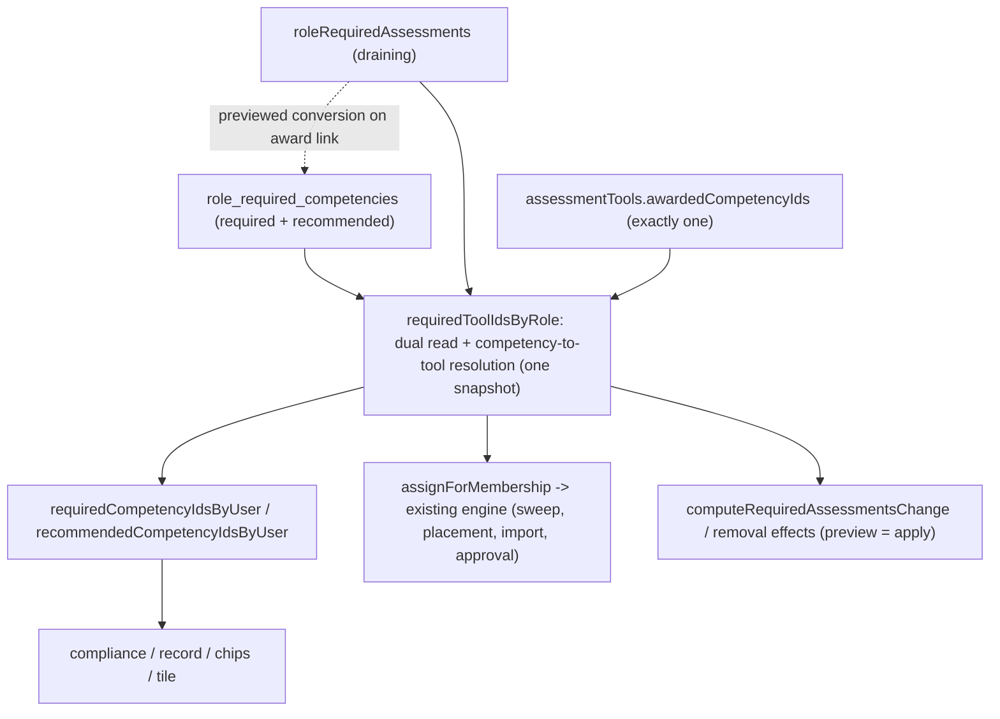

# Role Competency Links - Plan

## Goal Capsule

- **Objective:** Make competencies the language of requirements: each assessment awards exactly one linked competency (set at creation, backfillable for existing assessments), and each Role names the competencies it requires and recommends — including ones no assessment awards.
- **Product authority:** Ash Wyborn.
- **Open blockers:** None.

---

## Product Contract

### Summary

Roles store their requirements as competencies — a required set and a never-enforced recommended set — while every assessment is linked to the single competency it awards, chosen or created in the builder and backfilled once for existing assessments. Assignment resolves the chain in reverse: a required competency not held auto-assigns its awarding assessment where one exists, and stands as an evidence-based compliance gap where none does.

### Problem Frame

Requirements can only be expressed as assessment tools today, and the derivation runs Role → required tools → awarded competencies. Two things break in practice. First, the awards list has no authoring surface anywhere — every assessment created in-product awards nothing, and the assignment engine treats an empty awards list as vacuously satisfied: the tool is silently skipped, no case is ever assigned for it, and sign-off grants nothing. In-product assessments are inert as competency machinery. Second, real requirements include competencies no assessment awards at all: an Authorised Track Dozer must also hold a valid driver's licence, mine-site SME, grade control and authorised tip head, some of which arrive as imported LMS evidence rather than assessment outcomes — and a Role today has no way to require them. There is also no way to express "worth holding but never mandatory".

Linking awards therefore does not calm existing behaviour — it activates it. The moment an assessment gains its competency, holders of roles that require it become assignable and non-compliant in one step, which is why every award link below travels through the same preview-and-confirm protection a Role requirement edit gets.

### Key Decisions

- **Competencies become the stored requirement, inverting R88.** A Role points at competencies; the tool link is derived (via each assessment's awarded competency), not stored. This is what makes a licence-type requirement expressible at all.
- **Strictly one competency per assessment.** A combined course means separate assessments. In exchange, the builder can offer creating the matching competency as a one-step default.
- **Role-level compliance only.** The awarding assessment proceeds regardless of the person's other gaps; nothing blocks case creation or sign-off. Assessment-level prerequisite enforcement is explicitly deferred.
- **Recommended is visible, never enforced.** It never auto-assigns, never flags compliance, never blocks. An organisation setting (default OFF) lets candidates self-start the training; assessors and admins can always assign it.
- **One-time backfill, no guessing.** Existing assessments are linked to their corresponding competencies in a single pass; anything the pass cannot match confidently is surfaced for an admin to resolve. Existing Role → tool requirements keep working until their tool is linked, then convert.

### Requirements

**Assessment ↔ competency**

- R1. Creating an assessment asks which one competency it awards — picked from the org's competencies or created inline without leaving the flow.
- R2. An assessment awards exactly one competency; the link is editable on an existing assessment.
- R3. A one-time backfill links each existing assessment to its corresponding competency, surfacing unmatched assessments for an admin to resolve rather than guessing.
- R4. Sign-off continues to grant the linked competency with the case as evidence, unchanged.

**Role requirements**

- R5. A Role names the competencies that must be held — its required set — authored in competency terms, with inline competency creation.
- R6. A Role additionally names recommended competencies — a second set that is never mandatory.
- R7. A required competency with no awarding assessment (licence-type) is fully expressible: it is compliance-tracked and satisfied by any held grant, imported or manual.
- R8. The existing change-review protections carry over: previewing the blast radius of a requirement change, and the distinction between a Role never configured and one configured empty.

**Assignment and compliance**

- R9. A required competency the person does not hold auto-assigns the awarding assessment where one exists; where none exists it appears as a compliance gap only.
- R10. Everything that reads required-vs-optional standing today (record, Team chips, compliance report, dashboard tile) reads the new links — one derivation, no second opinion.
- R11. A person already holding the competency — including via imported LMS grants with their own evidence and expiry — is never assigned its assessment and never flagged for it.

**Recommended behaviours**

- R12. Recommended competencies are visible on the Role, the member record, and candidate-facing surfaces, marked as recommended — distinct from required and from merely-held.
- R13. Recommended never flags compliance, never auto-assigns, and never blocks anything.
- R14. An organisation setting (default OFF) lets candidates self-start recommended training via the existing voluntary training-request flow; assessors and admins can assign the awarding assessment regardless of the setting.

**Transition**

- R15. Existing Role → tool requirements keep functioning until the backfill links their tool, at which point they convert to competency links; nothing is dropped silently.
- R16. Imported LMS grants are untouched.

### Acceptance Examples

- AE1. **Covers R5, R7, R9.** Dozer Operator requires five competencies: the ATO (awarded by its assessment) plus driver's licence, mine-site SME, grade control and tip head. A new holder with none is auto-assigned only the assessments that award their gaps; the licence shows as an evidence-based gap until a grant with evidence arrives. The person reads non-compliant as a Dozer Operator until all five are held.
- AE2. **Covers R1.** Building "ATO - Grader" with no matching competency, the builder offers "Create competency: ATO - Grader" inline; accepting links it and the new assessment in one step.
- AE3. **Covers R3.** The backfill matches "Track Dozer Assessment" to the "ATO - Track Dozer" competency but cannot confidently match "Site Familiarisation v2"; the latter appears on a resolve list, and its Role links keep working through the old derivation until resolved.
- AE4. **Covers R13.** A recommended competency lapses: the Team chip, compliance report and tile are all unchanged; the record shows it as recommended-and-lapsed only.
- AE5. **Covers R14.** With self-start OFF, a candidate sees the recommendation with no start action; flipping the org setting exposes "request this training", which lands in the existing training-request queue.

### Scope Boundaries

- Assessment-level prerequisite enforcement (blocking or warning on case creation/sign-off) — deferred; the tool schema's prerequisite fields stay as they are.
- Multi-competency awards.
- Any change to imported grants, their evidence, or their expiry.
- Training content or scheduling — this links competencies; it does not deliver courses.

### Dependencies / Assumptions

- Verified: no authoring surface exists for an assessment's awards (web sends `{templateId, name, manifest}` only; no update path); no direct Role → competency link exists in the schema; the assignment engine skips people who already hold everything a tool awards; a voluntary training-request flow exists (U22) for R14 to ride.
- Assumed: existing production data has zero populated awards lists (they were never settable in-product), so the backfill's matching starts from names/codes rather than existing links.

### Outstanding Questions

None blocking. Planning resolved the deferred items: the backfill is a guided UI flow with exact case-insensitive name/code suggestions (KTD5); the self-start setting rides the taxonomy-settings surface (KTD6); storage and transition mechanics are KTD2/KTD3.

---

## Planning Contract

**Product Contract preservation:** one correction — the Problem Frame's account of empty awards was inverted (it claimed "always assign, never satisfiable"; the engine in fact treats an empty awards list as vacuously satisfied and assigns nothing). Corrected in place with the transition consequence spelled out. All R/AE-IDs unchanged.

### Key Technical Decisions

- KTD1. **A real join table stores the links: `role_required_competencies` (org, role, competency, tier `required` | `recommended`).** Unique on (roleId, competencyId) mirroring `role_required_assessments_uq`; one row per competency per role, tier is a column, and a tier change is an UPDATE. Competency FK cascades on delete, but the DELETE route itself gains a dependency check (KTD8) so the cascade is unreachable while anything depends on the row.
- KTD2. **One shared resolver inverts the derivation at the real read sites.** A new `requiredToolIdsByRole(orgId, roleIds)` helper performs the dual read (direct required links resolved to awarding tools, plus remaining legacy `roleRequiredAssessments` rows) and is called from the three places that actually read role requirements: `assignForMembership` (apps/api/src/lib/assignment.ts:286 — the seam the sweep, placement change, import and training-request approval all flow through), `computeRequiredAssessmentsChange`/`computeRemovalEffects` (apps/api/src/lib/requirement-change.ts), and `requiredCompetencyIdsByUser` (apps/api/src/lib/standing.ts). `loadMembershipContext` and `planAssignmentsForRole` keep their toolId-parameter signatures unchanged. Competency-to-tool resolution: candidate tools are the org's tools awarding the competency whose template has a non-null `currentVersionId`, ordered by (`createdAt`, `id`) ascending, first wins — one helper shared by preview and apply so the two runs cannot resolve differently. Zero candidates means evidence-only, and `hasAwardingAssessment` (U8) is computed from this same resolver, never from raw awards.
- KTD3. **Dual-read during transition; conversion is event-driven, previewed, and snapshot-consistent.** Required standing = direct links plus the legacy derivation, both halves read inside one transaction (or one joined query) so a conversion committing mid-request cannot make a requirement vanish from both halves. Conversion fires when a tool gains its award — and because production tools award nothing today, linking ACTIVATES assignment rather than preserving it: the award write therefore runs compute-then-apply with the same effects shape as a Role requirement change, and the UI confirms the counts before anything lands. The transition invariant that actually holds (and is tested): the set of required TOOLS resolved per holder is unchanged by converting a tool's role links; required-standing itself legitimately grows when an empty-award tool becomes linked, and that growth is exactly what the preview counts.
- KTD4. **Strictly-one rides the existing plural column.** `awardedCompetencyIds` stays `jsonb string[]`; new writes enforce exactly one element at the API boundary. Sign-off, assignment and standing read it unchanged (R4 for free).
- KTD5. **Backfill is a guided panel on the Competency gating screen, and every accept is a previewed change.** The unlinked read (admin-gated) lists tools with empty awards plus an exact case-insensitive name/code suggestion; each row's Accept first shows the award-link preview — "links N role requirements, creates M cases for A people" — then applies. Same converter, same preview, as the builder-adjacent award edit.
- KTD6. **The self-start toggle gates the candidate affordance and scopes the candidate's request, never the voluntary flow wholesale.** `candidate_self_start_recommended boolean default false` joins the organisations columns surfaced through taxonomy settings. A candidate's training-request POST is validated against their own roles: the requested tool must award a competency that is required or recommended for a role they hold (403 `tool_not_relevant` otherwise), and recommended-awarding requests additionally require the toggle ON. This closes the open-catalogue abuse (a candidate self-requesting the assessor skill set) while keeping required-gap requests always available; assessor/admin requests are untouched. The pre-existing candidate 201 test is updated to use a role-relevant tool and a sibling test pins the 403.
- KTD7. **`Standing` gains `'recommended'`, enforced exhaustively.** `standingOf` takes the recommended set as a required third argument so every call site fails the typecheck until updated — the held-competency read AND the holder register — and the web renders standing through an exhaustive map keyed by the union, not a two-branch ternary.
- KTD8. **Competency writes get real gates in the same round that raises their blast radius.** POST and PATCH `/competencies` require the assessments-edit tier (owner/admin/assessor — the same population that authors assessments and works the register); DELETE requires admin, records an audit entry, and 409s `competency_in_use` naming the roles that require or recommend it, the tools that award it, and the live grant count. Deleting a competency something depends on becomes an explicit act, not a cascade surprise.
- KTD9. **The requirement PUT is fingerprint-guarded and owns only the links table.** GET returns a fingerprint over the role's links + remaining legacy rows; PUT echoes it and 409s `requirements_changed` when stale — closing the race where a backfill conversion lands between an editor's GET and PUT and would otherwise be silently erased by the PUT's replace-write. The PUT writes `role_required_competencies` only; legacy rows are removed either by conversion or by an explicit remove action on an `awaitingLink` entry in the editor (which runs the same preview), so a never-to-be-linked tool has an exit. `requirementsConfigured` flips only when the required tier is authored — a recommended-only save leaves a never-configured Role reading as never-configured.
- KTD10. **Award re-links are a distinct, guarded operation.** First link (no prior award) is the backfill case. Re-link (award already set) 409s while the tool has non-terminal cases, and otherwise requires a confirmed preview showing: existing grants of the outgoing competency (which stay attached to it — history is state), roles whose requirement would lose its awarding tool, and cases the incoming competency would create. The confirm offers carrying the role links across to the new competency in the same transaction, so a correction is one reviewed act rather than a silent orphaning.

### High-Level Technical Design

---

## Implementation Units

### U1. Schema and shared standing: the links table, the tier, the third standing

- **Goal:** `role_required_competencies` exists with tier; the standing resolvers read the dual sources through one snapshot; `Standing` carries `'recommended'` with exhaustive enforcement.
- **Requirements:** R5, R6, R10, R15. **Dependencies:** none.
- **Files:** `packages/db/src/schema/taxonomy.ts`, `packages/db/src/schema/enums.ts`, `packages/db/src/schema/organizations.ts` (the `candidate_self_start_recommended` column), one generated migration in `packages/db/drizzle`, `packages/shared/src/standing.ts`, `apps/api/src/lib/standing.ts`, tests beside each.
- **Approach:** Table per KTD1. `standingOf` gains the required third `recommended` argument (KTD7); `requiredCompetencyIdsByUser` unions direct links with the legacy derivation inside one transaction (KTD3); sibling `recommendedCompetencyIdsByUser`.
- **Test scenarios:** direct link requires with no tool; legacy row still derives pre-conversion; union deduplicates; recommended never enters required; a held recommended competency resolves standing `recommended`; withdrawn roles contribute nothing; the dual read returns a consistent snapshot when rows move between tables mid-suite (transactional fixture).
- **Verification:** shared + api lib suites green; one clean generated migration.

### U2. API: award links as previewed changes, unlinked read, conversion

- **Goal:** Award writes are compute-then-apply operations: create enforces exactly-one, the award endpoint previews and applies first-links (converting legacy rows) and guards re-links (KTD10), and an admin-gated unlinked read powers the backfill.
- **Requirements:** R1, R2, R3 (server half), R4, R15. **Dependencies:** U1.
- **Files:** `apps/api/src/routes/assessments.ts`, `apps/api/src/routes/assessments.test.ts`, `apps/api/src/lib/requirement-change.ts` (shared effects computation).
- **Approach:** `createToolBody` requires exactly one award id (org-owned, 400 otherwise). `POST /assessment-tools/:id/award/preview` and `PUT /assessment-tools/:id/award` (admin, audited): first-link previews {rolesLinked, affected, created} via the shared change computation, applies conversion + assignment case inserts in one transaction (upgrading an existing recommended row to required rather than colliding with the unique index); re-link follows KTD10 (409 `open_cases` on non-terminal cases; confirmed preview; optional carry-across). `GET /assessment-tools/unlinked` (admin) registered ABOVE the `'/:id'` route, returning the suggestion per KTD5.
- **Test scenarios:** create with zero or two ids 400s; first-link preview counts equal apply results (cases created synchronously); conversion upgrades a recommended row's tier; repeat-link converts nothing; an empty-award tool plans zero cases pre-conversion (the vacuous-satisfaction fact, pinned); re-link 409s with an open case; re-link preview names outgoing-grant count and applies carry-across; unlinked read 403s non-admin, suggests on exact name and code match, and resolves ahead of `/:id`.
- **Verification:** assessments suite green.

### U3. API: role requirements in competency terms

- **Goal:** Requirement routes speak two-tier competencies with the blast-radius preview, fingerprint guard, legacy-row exits, and the shared resolver feeding every assignment path.
- **Requirements:** R5–R9, R11. **Dependencies:** U1, U2.
- **Files:** `apps/api/src/routes/taxonomy.ts` (+test), `apps/api/src/lib/requirement-change.ts` (+test), `apps/api/src/lib/assignment.ts` (+test), `packages/shared/src/assignment.ts` (effects type in competency terms), `apps/api/src/lib/sweep.test.ts`.
- **Approach:** GET returns `{ configured, required, recommended, awaitingLink, fingerprint }` (admin gate restated — it survives the rework). PUT echoes the fingerprint (409 `requirements_changed` when stale, KTD9), 400s on required/recommended overlap, validates competency ownership (mirroring the tool check it replaces), flips `requirementsConfigured` only on required-tier authoring, and writes only the links table. An explicit remove action deletes an `awaitingLink` legacy row through the same preview. `computeRequiredAssessmentsChange` diffs competency sets and resolves added ones through the KTD2 resolver; effects fields rename to competency terms. `assignForMembership` swaps its `roleRequiredAssessments` read for the resolver — which the sweep test proves end-to-end.
- **Test scenarios:** Covers AE1 (five required, one assignable, licence plans nothing, standing reads five); preview equals apply, including two tools awarding one competency with a shared `createdAt` (id tiebreak, both runs agree); the SWEEP assigns from a direct competency link (no PUT involved); fingerprint race 409s and the converted link survives; overlap 400s; recommended-only save leaves `configured` false; awaitingLink remove runs the preview and deletes the legacy row; retired role still 409s.
- **Verification:** taxonomy, requirement-change, assignment and sweep suites green; web typecheck (effects rename) lands with U6's gate.

### U4. Web: one-time backfill panel

- **Goal:** Admins work the unlinked list with a per-row previewed Accept — "links N role requirements, creates M cases" — suggestion, picker, or inline create (AE3).
- **Requirements:** R3. **Dependencies:** U2.
- **Files:** `apps/web/src/screens/enterprise/CompetencyScreen.tsx` (+test), `apps/web/src/lib/data/store.ts`, `apps/web/src/lib/data/hooks.ts`, `apps/web/src/lib/data/types.ts`.
- **Test scenarios:** Covers AE3; Accept shows the preview counts before applying and reports created cases after; unmatched row offers prefilled create; panel absent when nothing is unlinked.
- **Verification:** screen test green.

### U5. Web: the builder asks what this assessment awards

- **Goal:** Publishing a new assessment requires its one competency — picked or created inline (AE2) — on every path that creates a tool, including the deleted-form recovery.
- **Requirements:** R1, R2. **Dependencies:** U2.
- **Files:** `apps/web/src/screens/assessments/builder/steps/WorkflowStep.tsx` (+test), `apps/web/src/lib/data/store.ts`, `apps/web/src/lib/data/hooks.ts`.
- **Approach:** The control is scoped by ACTION, not by revision flag: the fresh-publish card requires it, the formGone "publish as a new tool" recovery renders it (that path calls createTool and would otherwise 400 against U2's exactly-one rule), and the republish button never shows it.
- **Test scenarios:** Covers AE2; publish disabled until chosen; the formGone recovery renders the control and sends the id; the republish path never renders it.
- **Verification:** builder step tests green.

### U6. Web: the Role editor speaks competencies

- **Goal:** Two-tier competency editor with inline create, fingerprint-aware saves, competency-term preview copy, and awaitingLink rows that can be linked (pointer to backfill) or explicitly removed.
- **Requirements:** R5, R6, R8. **Dependencies:** U3.
- **Files:** `apps/web/src/screens/enterprise/TaxonomyScreen.tsx` (+test), `apps/web/src/lib/data/store.ts`, `apps/web/src/lib/data/hooks.ts`, `apps/web/src/lib/data/types.ts`.
- **Approach:** Two toggle grids (name + code chip); required edits run preview → confirm with `EffectsSummary` reworded to competency adds/demotions; recommended edits save directly (R13); a stale fingerprint 409 reloads the editor with a "requirements changed elsewhere" notice; awaitingLink entries render with link-me and remove actions.
- **Test scenarios:** required toggle previews; recommended saves without preview AND leaves configured false on a fresh role; 409 reload path renders the notice; awaitingLink remove confirms through preview; overlap blocked client-side before the 400.
- **Verification:** screen tests + web typecheck green (picks up the effects rename).

### U7. Recommended surfaces, the org toggle, and scoped self-start

- **Goal:** Recommended is visible and actionable per R12–R14: a self-scope read powers the candidate surfaces, the toggle gates the affordance, and the request POST validates relevance (KTD6).
- **Requirements:** R12, R13, R14. **Dependencies:** U1, U3.
- **Files:** `apps/api/src/routes/competencies.ts` (`/held` standing + new self-scope `GET /competencies/recommended` registered ahead of parameterised siblings; holder-register standingOf call site), `apps/api/src/routes/taxonomy.ts` (settings), `apps/api/src/routes/training-requests.ts` (+tests), `apps/web/src/screens/enterprise/TaxonomyScreen.tsx` (settings toggle), `apps/web/src/screens/enterprise/CompetencyScreen.tsx` (exhaustive standing map), `apps/web/src/screens/enterprise/ProfileScreen.tsx` (+test), `apps/web/src/screens/DashboardScreen.tsx` (+test), web store/hooks/types.
- **Approach:** `GET /competencies/recommended` (self-scope): `{ competencyId, name, code, held, requestableToolId | null }` over the caller's non-withdrawn roles via the KTD2 resolver. Candidate record and dashboard list unheld recommended entries; "Request this training" renders only when the toggle is ON and `requestableToolId` exists, posting the existing `{ toolId }` body. The POST's candidate-relevance check per KTD6. Admin/assessor assignment path is the existing New Case flow — named here, no new endpoint.
- **Test scenarios:** Covers AE5 (toggle off hides the action; candidate 403s `tool_not_relevant` for an irrelevant tool even when ON; relevant recommended request 201s when ON and 403s when OFF); required-gap candidate request 201s regardless of toggle (the R94 voluntary flow survives); Covers AE4 (lapsed recommended changes no compliance number); holder register labels a recommended holder "Recommended".
- **Verification:** training-request, competencies and both screen suites green.

### U8. Compliance and oversight read alignment

- **Goal:** Compliance gaps distinguish bookable from evidence-based via the KTD2 resolver; oversight numbers survive the inversion unchanged on converted data.
- **Requirements:** R7, R9, R10, R11. **Dependencies:** U1, U3.
- **Files:** `apps/api/src/routes/compliance.ts` (+test), `apps/web/src/screens/enterprise/ComplianceScreen.tsx` (+test), `apps/web/src/lib/data/types.ts`.
- **Test scenarios:** AE1's licence in `neverHeld` with `hasAwardingAssessment: false` and evidence copy; a required competency whose only awarding tool has no current version reads `hasAwardingAssessment: false` (never "book the assessment" for the unbookable); an imported grant clears it (R11); chips and tile match pre-inversion values on a converted fixture.
- **Verification:** compliance suite + screen test green.

### U9. Competency route gates and the delete dependency check

- **Goal:** The competency CRUD carries gates proportional to its new blast radius (KTD8) before U4–U6 wire more surfaces into it.
- **Requirements:** R1 (inline create's safety), R5. **Dependencies:** U1.
- **Files:** `apps/api/src/routes/competencies.ts`, `apps/api/src/routes/competencies.test.ts`.
- **Approach:** POST/PATCH gated to owner/admin/assessor; DELETE gated to admin, audited, and 409 `competency_in_use` with the dependency summary (roles requiring/recommending, tools awarding, live grant count); force-delete deliberately not offered — un-requiring first is the exit.
- **Test scenarios:** builder-tier POST 403s; assessor POST 201s; non-admin DELETE 403s; DELETE of an in-use competency 409s naming all three dependency kinds; DELETE of an orphan competency succeeds and audits.
- **Verification:** competencies suite green.

---

## Verification Contract

| Gate | Command | Applies to |
|---|---|---|
| Shared + db | `cd packages/shared && npx vitest run` and `pnpm --filter @formai/db generate` (one clean migration) | U1 |
| API targeted | `cd apps/api && npx vitest run src/routes/taxonomy.test.ts src/routes/assessments.test.ts src/routes/training-requests.test.ts src/routes/compliance.test.ts src/routes/competencies.test.ts src/lib` | U1–U3, U7–U9 |
| API full + typecheck | `cd apps/api && npx vitest run && npx tsc --noEmit -p tsconfig.json` | all API |
| Web targeted | `cd apps/web && npx vitest run src/screens/enterprise src/screens/assessments/builder src/screens/DashboardScreen.test.tsx` | U4–U8 |
| Web full + typecheck | `cd apps/web && npx vitest run && npx tsc --noEmit -p tsconfig.json` | all web |

---

## Definition of Done

- All nine units implemented; every listed test scenario covered; both full suites and typechecks green.
- AE1–AE5 each enforced by at least one named test.
- The transition invariant holds under test: converting a tool's role links leaves the set of required TOOLS resolved per holder unchanged; the required-standing growth an award link causes is exactly what its preview reported.
- Preview equals apply for every previewed operation (requirement PUT, award link, award re-link) on identical data.
- No abandoned or experimental code in the diff; draft PR opened per repo convention; merge only on green CI.
