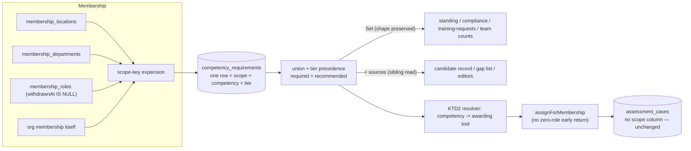

# feat: Requirement inheritance across Org, Location, Department and Role

## Product Contract

### Summary

Competency requirements gain four inheritance scopes — Organisation, Location, Department, Role — resolved per person as a union over where they are placed and what they hold. Each requirement is defined once at the scope it belongs to; every read that reports one names the scope that produced it. The engine stays fully generic: customers author all of it in the app.

### Problem Frame

The round just shipped (PR #223) lets a Role require competencies. But most requirements are not role-shaped: a site induction applies to everyone who sets foot at a location; a department induction applies to everyone placed in it, including admin staff who hold no job role; some tickets apply to everyone in the business. Under a role-only model each of those must be re-typed onto every role at every site — the requirements editor becomes a wall of ~70 chips per role, a change means editing dozens of roles, and the failure mode is silent: a role someone forgot simply doesn't require the thing.

The union model dissolves the duplication. A person's obligations follow from four definitions instead of dozens: what the org requires of everyone, what their site requires, what their department requires, what their role requires. Moving a competency up a layer (the user moved Mine Site SME from a role to its department mid-conversation) becomes one edit, not an audit of every role.

Two structural facts shape everything below (verified in the scout pass):
- **Roles have no location.** `roles.department_id` exists, but locations attach only to people (`membership_locations`). Location requirements are therefore inherently placement-scoped, and "what does this role inherit" has no single answer — it depends on where the holder is placed.
- **The assignment engine is nearly scope-agnostic already.** `decideAssignments` flattens per-role requirement arrays into one set before deciding anything (packages/shared/src/assignment.ts, `new Set(input.roleRequirements.flat())`), and `assessment_cases` carries no roleId — a case created by an org-scope requirement needs no schema change. The blockers are narrow: an early return when a membership holds zero roles, and resolvers keyed by roleId.

### Requirements

- **R1.** A required (or recommended) competency can be attached to the Organisation, a Location, a Department, or a Role. One definition per scope; no other scopes.
- **R2.** A person's required set is the union over: the org scope, every Location on their membership, every Department on their membership, and every non-withdrawn Role they hold. Same union for recommended. Precedence within a competency is unchanged: required beats recommended beats optional (`standingOf`).
- **R3.** Location and Department requirements follow PLACEMENT (`membership_locations` / `membership_departments`), never role-derivation. A person placed in a Department carries its requirements before they hold any role.
- **R4.** No exemptions. A scope requirement applies to everyone under the scope, always. The escape hatch is taxonomy (split the location), not a waiver. (Explicit user decision.)
- **R5.** Every surface that reports a requirement carries its source scope(s): the candidate record, the compliance gap list, the holders register standing, and the requirements editors. "Required — from <Location name>" not a bare item.
- **R6.** Requirement writes at every scope run the previewed compute-then-apply flow with preview == apply, exactly as role writes do today. An org-level save's preview covers every active membership in the org.
- **R7.** Changing a person's placement (add/remove location or department, transfers included) re-plans their assignments the same way changing their roles does. No placement write path may silently skip it.
- **R8.** Recommended works at all four scopes. The org self-start toggle (`candidateSelfStartRecommended`) gates the candidate affordance for a recommended competency regardless of which scope recommended it.
- **R9.** The requirements editors show inherited requirements as locked, source-named context — never silently hidden, never editable from the wrong scope. A Role editor offers an optional location lens ("as it applies at <Location>") since a role's inherited stack varies by site.
- **R10.** The competency picker gains text search and grouping by derived code family (prefix), replacing the flat chip wall. Grouping is derived from the org's own codes — no hardcoded family list.
- **R11.** Everything from the role-competency-links round that is not requirement-scope-shaped is untouched: exactly-one award per assessment, the KTD2 competency→tool resolver, award-link conversion (which stays role-scoped — legacy rows only ever lived on roles), the backfill panel, compliance bookability.
- **R12.** The engine ships fully generic. No customer names, sites, departments, roles or competencies are seeded, hardcoded or special-cased anywhere outside test fixtures and this plan's acceptance examples. (Explicit user constraint.)

### Scope Boundaries

**In:** the four scopes, placement-based resolution with provenance, scope-generalised storage/routes/preview, placement-change assignment triggers, the editor rework (org panel, location/department editors, inherited display, location lens, searchable grouped picker), compliance/record alignment.

**Out (not this product's shape):** per-person exemptions/waivers (R4); requirement scopes beyond the four (teams, projects, shifts); location-owned roles (roles stay department-owned); any change to award-link or grant machinery.

#### Deferred to Follow-Up Work

- Mapping repeatable-read serialization failures (40001) to a 409 on requirement PUTs — carried over from PR #223's residuals, unchanged by this round.
- The four >1000-line files flagged in PR #223 review (`assessments.ts`, `taxonomy.ts`, `TaxonomyScreen.tsx`, `CompetencyScreen.tsx`). U6 extracts the requirements editor out of `TaxonomyScreen.tsx` as a natural part of its work; the other three stay deferred.
- A per-request memo for `awardingToolByCompetency` (it re-reads the org's tools per call; four scopes multiply call counts). Noted in U2 as a follow-up unless profiling shows it biting during this round.
- A duplicate-open-case guard for concurrent same-competency applies at different scopes (advisory lock or a partial unique index on open cases per candidate+tool). The window pre-exists this round (sweep vs requirement change) and KTD7 deliberately claims commutation only for requirement rows; fixing the case race is its own piece of work.

### Acceptance Examples

Illustrations only — configured through the app in tests, never seeded (R12).

- **AE1 (the layered stack).** An org defines: org-scope required {First Aid}; Location "Boddington" required {Site Induction, Barricade Awareness, Vehicle Safety}; Department "Operations" required {Mine Site SME}; Role "Dozer Operator" (in Operations) required {Track Dozer ATO, Grade Control, Tip Head}. A member placed at Boddington + Operations holding Dozer Operator resolves eight required competencies; their record shows each with its source ("from Boddington", "from Operations", "from Dozer Operator", "org-wide"). A member placed at Boddington in Admin (no role) resolves {First Aid, Site Induction, Barricade Awareness, Vehicle Safety} only.
- **AE2 (placement move re-plans).** Transferring that Admin member's location from Boddington to a second location with different requirements immediately re-plans their assignments: cases for newly-required bookable competencies are created without any admin touching a requirements screen.
- **AE3 (org save blast radius).** Adding an org-scope required competency previews "affects N people, creates M cases" where N = every active membership, and apply matches the preview exactly.
- **AE4 (no double counting).** A competency required at BOTH org scope and a role resolves once per person; compliance counts it once; removing it from the role alone changes nothing for holders (org scope still requires it) and the preview says so.
- **AE5 (recommended at scope + toggle).** A location-scope recommended competency appears on the candidate record of everyone placed there as "Recommended — from <Location>"; "Request this training" renders only when the org toggle is ON and a bookable tool awards it; compliance numbers never move (the prior plan's recommended-never-counts rule, now holding at every scope).
- **AE6 (evidence-only at org scope).** An org-scope required competency with no awarding assessment (licence-type) creates zero cases everywhere, appears in every member's compliance gaps as evidence-based, and an imported grant clears it — the prior round's R7/R11 behaviour, now at org reach.

---

## Planning Contract

### Key Technical Decisions

- **KTD1 — one table, real FKs, per-scope partial uniqueness.** `role_required_competencies` is renamed to `competency_requirements` and generalised: `role_id` becomes nullable; nullable `location_id` and `department_id` are added (FK posture matching the taxonomy: locations/departments are retire-not-delete, so `restrict`; role keeps `cascade` as shipped); a CHECK enforces **at most one** scope column non-null (all null = org scope); four partial unique indexes replace the single one — `(role_id, competency_id) WHERE role_id IS NOT NULL`, same for location and department, and `(org_id, competency_id) WHERE role_id IS NULL AND location_id IS NULL AND department_id IS NULL`. Postgres treats NULLs as distinct, so partial indexes are the only honest uniqueness here (scout finding). Production has zero rows (verified 2026-08-14) and dev only test data: the migration is a rename + columns + index swap, no backfill. Tier stays a column; a tier change stays an UPDATE within its scope.
- **KTD2 — cross-scope duplicates are legal; the union dedupes.** The same competency may be required at org scope AND on a role. Uniqueness is per scope only. This keeps every write scope-local (no cross-scope merge/upgrade logic — the shipped RoleLinkStep/CarryStep machinery keeps operating on role-scope rows only, since legacy `role_required_assessments` conversion is inherently role-scoped). CAUTION (review-verified): "role-scope rows only" is NOT automatic after U1 — `computeAwardRelinkChange`'s outgoing-links read selects by orgId + competencyId + tier with no role filter today, so it would silently ingest org/location/department rows the moment the table generalises. U1 owns adding `role_id IS NOT NULL` filters to every competencyId-only read of the requirements table (requirement-change.ts at minimum, plus the competency-delete dependency guard), with a test pinning that an org-scope link of the outgoing competency is neither carried nor counted by a re-link. Removal semantics stay honest: removing a role requirement while the org still requires it changes nothing for holders, and the preview must say so (AE4).
- **KTD3 — resolution = placement expansion + scope union, provenance alongside, sets preserved.** A new shared resolver expands a membership to its scope keys (org, its locationIds, its departmentIds, its held non-withdrawn roleIds) and unions `competency_requirements` rows across them. The standing resolvers (`requiredCompetencyIdsByUser/For`, `recommendedCompetencyIdsByUser/For`) KEEP their `Set<string>`-shaped returns — every production consumer does only `has()`/`size`/iteration (scout-verified) — and gain sibling provenance reads (`…WithSources`, returning competencyId → [{scope, scopeId, scopeName, tier}]) used only by the surfaces that render sources (R5). `standingOf` is untouched. The prior round's KTD3 snapshot discipline extends: the dual-read transactions now cover the placement tables too, at repeatable read; `recommendedCompetencyIdsByUser` loses its no-transaction exemption (its "single source" justification dies with multi-scope reads — scout finding).
- **KTD4 — assignment goes membership-scoped, cases unchanged.** `assignForMembership` drops the `roleIds.length === 0` early return and derives required tools from the full scope union (`requiredToolIdsForMembership(db, orgId, membershipId)` replacing the per-role read — its only production consumer already flattens, scout-verified). `assessment_cases` needs no new column: it deliberately records neither role nor department, and `locationId` on a case remains "where assessed", not "why created". A member with NO location placement still gets zero cases (the existing `locationIds.length === 0` skip in `decideAssignments` stands — a case must be assessable somewhere) but their compliance gaps and standing still show the requirement: the gap is visible even when the booking cannot be planned. Stated as a test scenario, not left as a surprise. The dead `assignForRole` helper is deleted, not extended (no production caller — scout finding).
- **KTD5 — previews expand scopes to memberships.** `computeRequiredAssessmentsChange` generalises from roleId to a scope reference (org | location | department | role). Holder expansion per scope: role → `membership_roles` (as today); department → `membership_departments`; location → `membership_locations`; org → all active memberships. Effects stay in competency terms; per-holder post-change sets now subtract the union of the holder's OTHER scopes (so AE4's "removing here changes nothing" falls out of the same computation). `planAssignmentsForRole` gains a scope-keyed sibling used by all four; preview == apply stays the invariant.
- **KTD6 — routes generalise; the role path survives.** Requirement CRUD becomes scope-addressed: `GET/PUT /taxonomy/requirements/:scope/:scopeId?` (org has no id) with the same body/response shape as the shipped role routes ({configured?, required, recommended, awaitingLink?, fingerprint}) — `awaitingLink` and the legacy DELETE exist only for role scope. The shipped `/taxonomy/roles/:id/required-assessments` paths remain as thin delegates (deployed clients address them; same posture as the prior round's KTD9 path-keeping). Admin-gated throughout, same as today.
- **KTD7 — fingerprints are scope-local.** Each scope's fingerprint hashes only that scope's own rows (+ legacy toolIds for roles). Inherited context in an editor is read-only display and carries no fingerprint, so an org-level save does NOT invalidate open role editors: concurrent edits at different scopes commute **on the requirement rows** (they write disjoint rows; KTD2 makes overlaps legal). The commute claim deliberately stops there: two concurrent applies adding the same competency at different scopes can each plan a case for the same person and tool in their own snapshots — a pre-existing race (sweep vs requirement change has the same window today) that this round neither introduces nor widens; U4 notes it in Risks rather than solving it. The lost-update guard protects each scope's own list, exactly as the prior round's fingerprint did for roles. The inherited display may go stale mid-edit; it refreshes on save/reload, and staleness there cannot corrupt anything because it is not writable.
- **KTD8 — placement writes all re-plan.** THREE dark write sites (the scout found two; document review verified a third): `POST /taxonomy/locations/:id/transfer`, `POST /taxonomy/departments/:id/transfer`, and `POST /taxonomy/roles/:id/transfer` — all mutate placement/role rows directly and never assign. Each calls `assignForMembership` for every affected membership after its writes (fail-soft per membership, matching the workforce-import posture). Retiring a location or department is ALSO a requirement-affecting write under this round's resolver semantics, so the retire flow surfaces its requirement fallout in the existing retirement review ("N required competencies stop applying to M placed people") and re-plans affected members the same way — retirement must not be the one write that changes required sets with no preview and no re-plan (R6's spirit; two reviewers independently). The sweep remains the backstop and becomes effective for scope changes once KTD4 removes the zero-roles early return. Additionally, `PlacementContext` gains locations so a retired Location cannot be written onto a membership (the asymmetry the scout flagged: retired roles/departments are refused today, retired locations are not — indefensible once locations confer requirements).
- **KTD9 — `requirementsConfigured` survives, its copy doesn't.** The column keeps meaning "this role's OWN list was authored" (the never-set-up vs deliberately-empty distinction — the repo-wide R50 rule cited on the column's schema comment, not an ID in this plan's contract — is still real per scope). The UI stops rendering "not set up" as the whole story: the collapsed summary derives an effective line — "requires nothing of its own · N inherited" — from the resolved stack. Locations/departments/org get no configured flag; their row count is unambiguous because there is no legacy-derivation ambiguity at those scopes.
- **KTD10 — the picker groups by derived family.** Group key = the competency code's leading alpha token (split on first `-` or digit boundary, uppercased; codeless competencies group under their first name word). Groups are collapsible, count-labelled, and filtered by a search box matching name and code. Derived per org from its own data — no hardcoded families (R12). One shared picker component serves all four scope editors and both tiers.

### Assumptions

- Org-scope requirement authoring is admin-gated like every other scope (no separate owner-only tier). The blast radius argument for a stricter gate was considered and rejected: the preview makes the radius visible, and admins already run location transfers.
- The self-start toggle stays a single org-level switch (R8). Per-scope toggles were not requested and add a matrix nobody asked for.
- `GET /taxonomy` continues to return the whole taxonomy in one read; scope requirement counts ride on it only if U6 finds the extra read burdensome (editor loads stay lazy per scope, as the shipped role editor already is).

---

## High-Level Technical Design

Write path per scope (identical at all four): editor → preview (`computeRequiredAssessmentsChange` with scope ref, holders expanded per KTD5) → confirm → fingerprint-guarded PUT inside one repeatable-read transaction → planned cases inserted in the same transaction. Placement writes (`writePlacement` callers + the two transfer routes) → `assignForMembership` per affected member (KTD8).

---

## Implementation Units

### U1. Schema: `competency_requirements` with four scopes

- **Goal:** The generalised table exists (KTD1); Drizzle schema, migration, and every existing code reference compile against the new name and shape.
- **Requirements:** R1, R12. **Dependencies:** none.
- **Files:** `packages/db/src/schema/taxonomy.ts`, one generated migration in `packages/db/drizzle`, plus mechanical rename fallout across `apps/api/src/lib/*.ts` and route files (references to `schema.roleRequiredCompetencies`).
- **Approach:** Rename + alter per KTD1 (nullable roleId, new locationId/departmentId with `restrict`, CHECK at-most-one, four partial unique indexes). Export as `competencyRequirements`; keep a deprecated alias only if the rename fallout is unmanageable in one unit (prefer no alias). Verify the generated SQL renames rather than drop/create (drizzle-kit may emit drop/create — if so, hand-adjust to `ALTER TABLE ... RENAME` so the zero-rows assumption is not even needed). DEPLOY-WINDOW HONESTY: unlike the prior round's additive migration, a rename breaks OLD servers the moment it applies — code still reading `role_required_competencies` errors until the new build is live, and the readers include standing, compliance and assignment, not just the editors. Bridge it in the SAME migration with a one-release compatibility view: `CREATE VIEW role_required_competencies AS SELECT … FROM competency_requirements WHERE role_id IS NOT NULL` — a simple single-table view is auto-updatable in Postgres, so old code keeps reading AND writing through the old name until the new build is live; the view is dropped in the next round's first migration. The bridge covers ONE direction only — old code after the migration keeps working through the view; new code before the migration reads a table that does not exist and breaks standing, compliance and assignment. MIGRATE FIRST, then deploy, is therefore a hard release precondition, stated as such in the PR body (review-corrected: an earlier draft over-claimed that neither ordering breaks).
  Rename fallout also owned here (review-verified): every read of the requirements table that selects by competencyId WITHOUT a scope filter must gain `role_id IS NOT NULL` where role-scoped behaviour is intended — `computeAwardRelinkChange`'s outgoing-links read in `apps/api/src/lib/requirement-change.ts` at minimum (else re-link carry ingests org/location/department rows: miscounted confirm dialogs, null roleIds in the carry plan, possible unique-index collisions on repoint). The competency-DELETE dependency guard in `apps/api/src/routes/competencies.ts` counts by competencyId alone and reports rows as `roles` in its 409 payload — after this unit it correctly blocks on all four scopes, so its payload becomes a scope-aware breakdown and the web copy follows.
- **Test scenarios:** insert one row per scope shape and read back; the CHECK rejects two scope columns set; each partial unique index rejects its duplicate and permits the same competency at a different scope (KTD2); org-scope uniqueness holds with all three columns null; the compatibility view reads and writes role-scope rows (insert through the view lands with role_id set, org rows invisible through it); an org-scope link of a competency is neither carried nor counted by an award re-link (the KTD2 role-filter pin).
- **Verification:** db package tests green; migration applies cleanly to a scratch database; `pnpm db:status` journal/ledger consistent.

### U2. Shared resolution: scope expansion, union, provenance, snapshot

- **Goal:** One resolver answers "what does this membership/user require and why" for every consumer (KTD3); the standing reads keep their shapes; provenance is a sibling.
- **Requirements:** R2, R3, R5, R8. **Dependencies:** U1.
- **Files:** `apps/api/src/lib/standing.ts` (+`standing.test.ts`), `apps/api/src/lib/requirement-links.ts` (+test).
- **Approach:** New `scopeKeysForMemberships(db, orgId, membershipIds)` (one batched read per placement table). `requiredCompetencyIdsByUser/For` and `recommendedCompetencyIdsByUser/For` union across scopes inside their repeatable-read transactions (recommended loses its no-transaction exemption). New `requiredCompetencySourcesFor(db, orgId, userId)` (and a ByUser sibling if a consumer needs batching) returning competencyId → sources with scope names resolved. `requiredToolIdsForMembership(db, orgId, membershipId)` replaces `requiredToolIdsByRole` for assignment (the old function may remain for the requirement-change computation if still referenced, else deleted). Note the follow-up candidacy of an `awardingToolByCompetency` memo (Scope Boundaries).
- **Test scenarios:** Covers AE1 both members (with and without roles); union dedupes a cross-scope duplicate (AE4 read side); withdrawn role contributes nothing; a department placement with no role contributes department + org scopes; provenance names every contributing scope for a duplicated competency; recommended at location scope reaches only members placed there; snapshot: rows moved between scopes mid-suite read consistently (transactional fixture, prior round's pattern).
- **Verification:** standing + requirement-links suites green; `npx tsc --noEmit` clean in api.

### U3. Assignment goes membership-scoped

- **Goal:** Org/location/department requirements produce cases with no role held (KTD4); the sweep becomes an effective backstop.
- **Requirements:** R2, R3, R7. **Dependencies:** U2.
- **Files:** `apps/api/src/lib/assignment.ts` (+test), `apps/api/src/lib/sweep.test.ts`, `packages/shared/src/assignment.ts` (+test) only if the input shape is renamed (roleRequirements → requirements; flattening behaviour already scope-agnostic).
- **Approach:** Remove the zero-roles early return; derive tools via `requiredToolIdsForMembership`; keep the zero-TOOLS early return. Delete `assignForRole` (dead). Keep the no-location skip in `decideAssignments` (a case needs somewhere to be assessed) — the gap remains visible through standing/compliance (KTD4).
- **Test scenarios:** a role-less member placed at a location with a required bookable competency gets a case (sweep end-to-end, mirroring the prior round's direct-link sweep proof); org-scope requirement assigns to everyone active; a member with no location placement gets zero cases but their required set includes the competency; empty-award and unpublished-template tools still plan nothing; existing role-driven scenarios unchanged (regression pin).
- **Verification:** assignment + sweep suites green; full api suite green.

### U4. Previews, fingerprints and routes per scope

- **Goal:** All four scopes author requirements through the same previewed, fingerprint-guarded flow (KTD5–KTD7); role paths stay live.
- **Requirements:** R6, R1, R11. **Dependencies:** U2, U3.
- **Files:** `apps/api/src/routes/taxonomy.ts` (+test), `apps/api/src/lib/requirement-change.ts` (+test).
- **Approach:** `computeRequiredAssessmentsChange` takes a scope ref; holder expansion per KTD5. ORG-SCALE DISCIPLINE (review-verified concern): the scope-keyed planning sibling must batch its reads set-wise across memberships — one query per table for held competencies, placements, open cases — never a per-membership `loadMembershipContext` loop; an org-scope save at a few hundred members must not mean thousands of sequential queries inside an open write transaction. `loadRequirementState`/fingerprint keyed by scope, hashing only scope-local rows (KTD7). Scope routes per KTD6 with the role paths delegating; org route has no `:scopeId`; every scope PUT keeps the shipped `recordAudit` call with a scope-derived target (location/department/role name; the organisation's own name at org scope). Retirement semantics, decided here not in-unit: the resolver filters retired LOCATIONS and DEPARTMENTS out of resolution ("stops applying" — the user's confirmed expectation) — but NOT retired roles: a retired-but-held role keeps contributing exactly as shipped (retirement withdraws nobody, R119 posture; the withdrawal/transfer flow is what ends its obligations), preserving the R11 promise. Requirement EDITING at any retired scope 409s `scope_retired` mirroring the role_retired posture. The retire flow's preview/re-plan obligations live in KTD8/U5.
- **Test scenarios:** Covers AE3 (org preview counts every active membership, apply == preview); AE4 (role-only removal of an org-duplicated competency: preview names zero standing changes, apply changes nothing for holders); location/department previews expand the right member sets; fingerprint race 409s per scope; two admins editing different scopes both succeed (KTD7 commute pin, requirement rows only); role legacy awaitingLink flow untouched (regression); a retired location 409s on write and drops out of resolution while a retired-but-held ROLE keeps contributing (the split pinned explicitly); an audit row exists after a successful save at each of the four scopes; the org-scope preview's query count stays flat as membership count grows (batching pin — count queries against the fake, not wall clock).
- **Verification:** taxonomy + requirement-change suites green; preview == apply asserted per scope.

### U5. Placement changes re-plan; retired locations refused

- **Goal:** Every placement-affecting write path re-plans assignments (KTD8, R7) — the three transfer routes AND scope retirement; the retired-location placement hole closes.
- **Requirements:** R7, R6. **Dependencies:** U3, U4 (retirement fallout preview uses the scope-keyed computation).
- **Files:** `apps/api/src/routes/taxonomy.ts` (transfer + retire routes, +test), `apps/api/src/lib/membership-placement.ts` (+test via team-placement tests), `packages/shared/src/placement.ts` (+test), `apps/api/src/routes/team.ts` regression pins only.
- **Approach:** All THREE transfer routes (locations, departments, AND roles — the role transfer was review-verified as a third dark write site) collect affected membershipIds and run `assignForMembership` per member after commit, fail-soft per member (workforce-import posture). Location/department retirement surfaces its requirement fallout in the retirement review ("N required competencies stop applying to M placed people", computed from the same resolver) and re-plans affected members on status flip. `PlacementContext` gains active locations; `validatePlacement` refuses a location outside the offer set with the same held-value widening `admitHeldRoles` applies to roles (a member already AT a retired location keeps it; it just can't be newly placed).
- **Test scenarios:** Covers AE2 (location transfer creates the newly-required case); role transfer immediately plans the replacement role's newly-required case (the third-site pin); department transfer re-plans and its existing role-withdrawal behaviour still holds; a failed assignment for one member doesn't abort the transfer (fail-soft pin); retiring a location reports its requirement fallout and re-plans placed members; placing onto a retired location 400s; an existing placement at a retired location survives an unrelated placement edit; the direct `PUT /team/members/:id/placement` still assigns (regression pin).
- **Verification:** taxonomy + team-placement suites green.

### U6. Web: scope editors, inherited display, location lens

- **Goal:** Admins author requirements at all four scopes in the taxonomy screen; every editor shows locked inherited context (R9); role summary copy stops lying (KTD9).
- **Requirements:** R5, R9, R1, R6. **Dependencies:** U4.
- **Files:** new `apps/web/src/screens/enterprise/ScopeRequirements.tsx` (+test) — the shipped `RoleRequirements` generalised and extracted out of `TaxonomyScreen.tsx` (also serving the deferred file-size split); `apps/web/src/screens/enterprise/TaxonomyScreen.tsx` (+test); `apps/web/src/lib/data/{store,hooks,types}.ts`.
- **Approach:** `ScopeRequirements` takes a scope ref; mounts per role (as today), per department inside `DepartmentCard` above its roles, per location (LocationsPanel rows gain a wrapper), and in a new org panel between Settings and Locations. Lazy fetch on expand (shipped pattern). Inherited section: locked chips with source names, from the provenance read. THE ROLE EDITOR'S INHERITED DISPLAY MODELS A DEFINED POPULATION (review-verified ambiguity): it shows the stack for a hypothetical holder placed in the role's own department at the lensed location, and the copy states that assumption — "for a member placed in <Department> at <Location>" — because department/location requirements follow placement (R3), so a real holder placed elsewhere inherits differently; a locked chip must never assert an obligation false for some holders without naming its premise. The lens `Select` lists all active locations (works for a role with no holders yet), defaulting to unselected — org + department context shows without it; display only, never part of the save. Editors whose scope has nothing inherited render one quiet line ("Nothing inherited"), identical across all four editor types. Store/hooks generalise to scope-keyed keys with the shipped invalidation sweep extended.
- **Test scenarios:** org/location/department editors save through preview (required) and directly (recommended — the prior plan's R13 rule, direct saves for the never-enforced tier); inherited chips render with source names, the population copy, and are not toggleable; the lens swaps the displayed inherited stack; role summary reads "requires nothing of its own · N inherited" when applicable (KTD9); retired scope renders read-only; 409 reload notice per scope (shipped behaviour, re-pinned per scope); the nothing-inherited line renders identically on all four editors.
- **Verification:** web suite green; `npx tsc --noEmit` clean.

### U7. Web: searchable, grouped competency picker

- **Goal:** The chip wall becomes a searchable, family-grouped picker used by all scope editors and both tiers (R10, KTD10).
- **Requirements:** R10, R12. **Dependencies:** U6 (lands inside `ScopeRequirements`).
- **Files:** new `apps/web/src/screens/enterprise/competency-picker.tsx` (+test), `ScopeRequirements.tsx`.
- **Approach:** Pure derivation per KTD10 (leading alpha token of code; name fallback). Interaction spec (decided here so U7 needs no design round-trip): groups render COLLAPSED by default with name + count; a "Selected" strip pinned above the groups always shows current picks (both tiers); typing in the search box filters across all groups and auto-expands groups containing matches; clearing the search re-collapses. Degenerate-data fallback: when derivation yields mostly singleton groups (over half), render a flat searchable list with no group headers — grouping is a function of customer code hygiene the engine cannot assume (R12). Keyboard and screen-reader basics ride along: group headers are buttons with expanded-state announced, options are labelled checkboxes. Same component instance handles required and recommended tiers with the overlap block the shipped editor already enforces client-side.
- **Test scenarios:** grouping derives families from codes and never from a hardcoded list (fixture uses non-CHC codes to prove it, R12); search narrows across groups and auto-expands matching groups; the selected strip persists across collapse/search; degenerate fixture (prefix-free codes) renders flat; selecting in one tier removes from the other (shipped overlap rule re-pinned); codeless competencies group by name token; empty search state shows a no-matches line.
- **Verification:** picker + ScopeRequirements tests green.

### U8. Provenance and alignment on the read surfaces

- **Goal:** The candidate record, compliance gaps, and holders register name source scopes (R5); compliance and recommended surfaces resolve across scopes with unchanged semantics elsewhere (R8, R11).
- **Requirements:** R5, R8, R2. **Dependencies:** U2, and U4 for route shapes.
- **Files:** `apps/api/src/routes/compliance.ts` (+test), `apps/api/src/routes/competencies.ts` (+test), `apps/api/src/routes/training-requests.ts` (+test), `apps/web/src/screens/enterprise/{ComplianceScreen,ProfileScreen,CompetencyScreen}.tsx` (+tests), `apps/web/src/screens/recommended-training.tsx` (+screen tests), web types.
- **Approach:** Gap rows and the candidate record's required/recommended entries gain `sources: [{scope, name}]` rendered as one comma-joined line with "and" before the last — "Required — from Boddington, Operations and Dozer Operator" — no truncation needed since at most four scopes co-occur per person per competency; org renders as "org-wide". VIEWER GATE (review-verified exposure): on `GET /competencies/held/:userId` the `sources` array is visible when the caller reads their OWN record, and otherwise only under the same `profiles.view_competencies === 'all'` permission that already gates licence fields on that route and the team roster's counts column — otherwise any member could enumerate a colleague's locations, departments and roles by varying the userId. Gap rows for members with zero location placements carry an explicit marker ("cannot be scheduled — no location placement") so a permanently-unbookable gap names its own fix. `GET /competencies/recommended` unions scopes (U2 does the work; this unit carries the response/UI). Training-request relevance check (the prior plan's KTD6 rule) reads the unioned sets — behaviour identical, tests re-pinned. Compliance numbers: unchanged semantics, now over the union (AE4: duplicated competency counts once).
- **Test scenarios:** Covers AE1 record rendering (source per entry, comma-join format pinned), AE5 end-to-end (location-recommended + toggle + bookable gating), AE6 (org-scope evidence-only gap with sources and no case), AE4 compliance single-count; a competency required at location AND role renders both sources in the holders register standing for a member under both; sources hidden from a non-privileged member reading a colleague's record and visible on own-record reads (the gate pin); the unplaced-member gap marker renders; holders register standing unchanged for role-only fixtures (regression).
- **Verification:** compliance, competencies, training-requests, and all touched screen suites green.

---

## Verification Contract

- Full suites green in `apps/api`, `apps/web`, `packages/shared`, `packages/db`; `tsc --noEmit` clean in all.
- Preview == apply asserted at every scope (AE3 the heaviest case).
- The AE1 stack resolves correctly for both member shapes (with and without roles) — the round's core proof.
- Regression pins: every prior-round behaviour named in R11 (award links, backfill, bookability, KTD6 relevance check, role editor flows) passes unchanged on role-only fixtures.
- Migration: applies to a scratch db; the generated SQL is a rename (or the hand-adjusted equivalent), journal/ledger consistent.

## Definition of Done

All eight units landed with their verification; the acceptance examples AE1–AE6 hold as automated tests using generic fixtures (R12); no surface reports a requirement without its source scope; every placement-affecting write path re-plans (the three transfers and scope retirement included); deploying requires one migration and no data operations — the posture is NOT additive: the table rename would break old servers, and the compatibility view in U1's migration is what bridges the window, with the migration and redeploy still landing together as U1 requires.
