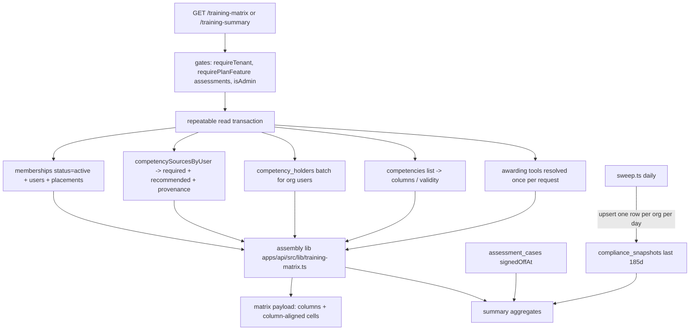

# Training Matrix and Training Summary Dashboard - Plan

## Goal Capsule

- **Objective:** Add two admin reporting surfaces to the web app — a Training matrix (people × competencies grid with held / expiring / lapsed / gap / recommended cell states, grid and grouped views, CSV export) and a Training summary dashboard (compliance KPIs, trend, gaps by competency, sign-off throughput, print-to-PDF) — backed by two new admin-gated API reads and a daily compliance snapshot.
- **Design reference:** the user-supplied prototype (three screens: matrix grid + by-crew view, summary dashboard, person record). The prototype's visual language already matches the app; its "crew" concept maps onto the app's taxonomy (location / department / role). The person-record screen is out of scope — cells link to the existing member profile.
- **Authority:** this plan's Requirements and KTDs first; then the governing decisions carried from prior rounds (R17 below); then repo docblock conventions. If implementation contradicts a carried decision (e.g. a number not derived from `packages/shared/src/competency-expiry.ts`), stop and re-derive rather than fork the semantics.
- **Stop conditions:** stop and surface if (a) the compat-view drop in U1 fails because something still selects from `role_required_competencies`, (b) matrix assembly cannot reuse `competencySourcesByUser` without schema changes, or (c) any requirement would need a second opinion of "expiring"/"required" outside the shared helpers.

---

## Product Contract

### Summary

FormAI already resolves who must hold what (`competency_requirements` across four scopes) and who holds what (`competency_holders` with derived currency), and exposes gap lists (`GET /compliance`) and per-person / per-competency reads. What no surface shows is the full cross-product — every person against every competency at once — or aggregate reporting over time. This round adds both: a matrix screen for scanning workforce competency state and a summary dashboard for reporting it, composed almost entirely from the existing resolver layer.

### Problem Frame

Admins answer "who is compliant, who is slipping, where are the gaps" today by walking three screens (Compliance buckets, Team counts, per-competency holder lists). There is no single at-a-glance view per person × competency, no way to hand a printable summary to a client or auditor, and no historical view of whether compliance is improving. Training-coordinator workflows (the prototype's audience) need exactly those three things.

### Requirements

**Training matrix**

- R1. A new admin screen at `/app/training-matrix` ("Training matrix", `navGroup: 'training'`), visible only to admin/owner with the `assessments` plan feature; the server read is gated the same way regardless of nav hygiene.
- R2. Grid view: rows are active members, columns are the org's competencies; each cell renders one state — held, expiring (days-to-expiry shown when within the selected window), grace, expired/lapsed, gap (required, never held), recommended-not-held, undated, or not-required — with a tooltip naming the competency and detail.
- R3. Each grid row shows a compliance percentage: required competencies counting as held over total required, colour-banded.
- R4. Grouped view: rows grouped by a taxonomy axis (department default; location and role selectable), each group collapsible with an aggregate held/expiring/attention bar, group compliance %, and per-member rows showing a status badge plus issue chips (up to three, then a "+N more" indicator — extra issues are never silently hidden). Members with no placement on the selected axis collect in an always-last "Unassigned" group so the grouped view never hides anyone the grid shows.
- R5. Filters: free-text search over name/role, location and department selects (from `GET /taxonomy`), quick chips (All people / Has gaps / Expiring ≤Nd), and an expiring-window control (30/60/90 days, default 60) that narrows the expiring chip and cell day-labels only — it never redefines the canonical `expiring` status.
- R6. A legend for the cell states, plus a toggle to show/hide recommended-not-held cells.
- R7. Clicking a row or cell navigates to that member's existing profile/competency record; no new person screen.
- R8. Export CSV of the currently filtered matrix, client-side, one row per person with one column per competency state plus compliance %.

**Training summary**

- R9. A new admin screen at `/app/training-summary` ("Training summary", `navGroup: 'training'`), gated as R1.
- R10. KPI cards: overall compliance (donut, N fully-compliant members / total, where fully compliant = every required competency `countsAsHeld`), expiring-soon counts at 30/60/90 days, open required gaps (with the evidence-only count — gaps whose competency has no awarding assessment — and a delta vs the snapshot ~30 days ago when available), and sign-offs this week with a delta vs the prior week.
- R11. Charts: compliance trend from daily snapshots (last 6 months, honest empty state until data accrues), gaps by competency (top 6), compliance by group (same axis choices as R4), and assessment throughput (sign-offs per week, last 8 weeks, from `assessment_cases.signedOffAt`).
- R12. A scope selector: org-wide, or any single location or department; all numbers recompute over the scoped member set, except the trend and gap delta, which render org-wide in v1 with an explicit label (snapshots are captured per scope from day one — KTD5 — but v1 UI reads only the org rows).
- R13. Export PDF via a print stylesheet and `window.print()` (repo precedent), with chrome hidden and colours preserved.
- R14. KPI cards deep-link into `/app/compliance?status=expired|expiring` where a matching bucket exists.

**Infrastructure and carried semantics**

- R15. A per-org compliance snapshot (compliant members, member count, open required-gap count) captured idempotently by the existing expiry sweep; the trend and gap-delta read from it. The sweep is externally triggered (`POST /internal/sweep` — the codebase does not schedule it), so the release notes must name the production mechanism that invokes it daily, `capturedOn` is the UTC date of the run, and the trend renders whatever dates exist — missed days appear as gaps, never fabricated points.
- R16. The round's first migration drops the `role_required_competencies` compat view — the "one release only" bridge from migration 0060, now three migrations overdue.
- R17. Carried decisions that the new surfaces must not contradict: every status/count derives from `packages/shared/src/competency-expiry.ts` and the standing resolvers (no second opinion of "expiring" or "required"); current and attention overlap by design (an expiring required competency is both); retired locations/departments drop out of resolution but a retired-yet-held role still contributes; a member with no location placement still shows requirement gaps, marked "cannot be scheduled — no location placement"; gated surfaces disappear rather than rendering zeros; compliance data never lands in the ungated `/dashboard` read.
- R18. Each new endpoint assembles its response from batched reads inside one route-level `repeatable read` transaction, resolves awarding tools once per request (not per user), and returns in one response — no pagination in v1, accepted knowingly: the matrix scales with org size × competency count (unlike `GET /compliance`, which scales with issue counts), so the route logs the response's member × competency dimensions to make "proves heavy at real scale" observable. The client virtualises rendering.

### Scope Boundaries

**Deferred to Follow-Up Work**

- Dedicated lightweight count endpoints / matrix pagination if the unpaginated read proves heavy at real scale (this is the oversight round's standing deferral; the matrix is the surface most likely to make it come due).
- Server-side PDF generation; v1 uses print CSS.
- Per-cell provenance popovers (which scope a requirement came from) — the Compliance screen already shows sources; matrix tooltips stay simple.
- A competency-column filter/search for the matrix grid — v1 accepts horizontal scroll (current org scale is ~a dozen competencies); revisit when orgs carry several dozen columns.
- Layering a `profiles.view_competencies` permission-scope check over the role-based admin gate for the per-cell `evidence` kind — v1 matches the `compliance.ts` precedent (role gate only, provenance included); revisit if orgs restrict admin roles from licence-type visibility.
- Write actions from the matrix (grant, revoke, book) — read-only in v1.
- Snapshot backfill or synthetic history; the trend starts accruing at deploy.
- Nav badge counts for the two new screens (prototype shows none).
- Splitting the four >1000-line files and the 40001→409 mapping on requirement PUTs (tracked from prior rounds, not this feature's job).

**Outside this product's identity**

- LMS/BISTrainer-specific integrations — FormAI is generic multi-tenant tooling; import evidence already flows through `importedAt`/`evidenceRef`.
- Person-record redesign; the prototype's third screen is served by existing member surfaces.

### Assumptions

Headless-run scoping bets an implementer should treat as decided unless the user redirects:

- The prototype's "crew" is not a schema concept; department is the default grouping/scope axis, with location and role as alternates (A/B-style crew rosters would be departments or locations in a real org's taxonomy).
- Expiring-window default is 60 days (prototype default); it is a view control. The window maximum is derived from `EXPIRY_WARNING_DAYS.assessor` (currently 90) rather than hardcoded, so windowed sets stay subsets of canonical assessor-audience `expiring` structurally, not coincidentally.
- The compliance trend cannot be reconstructed retroactively, so it renders from the new snapshots with an empty state — accepted for v1.
- No new frontend dependencies: charts are hand-rolled SVG (the prototype itself is inline SVG; the repo has no chart library), and row virtualisation uses CSS `content-visibility`/chunked rendering rather than a new library.
- "Sign-offs this week" counts `assessment_cases.signedOffAt` in the current ISO week to date, with the delta against the prior full ISO week — the same bucketing as the throughput chart, so the KPI card and the chart's "now" column always agree. Scoped by the R12 selector via the case's candidate membership.

---

## Planning Contract

### Key Technical Decisions

- KTD1. **Reuse the resolver layer wholesale.** Matrix and summary reads are composed from `competencySourcesByUser` (one call yields required set + recommended set + provenance), batched `competency_holders` and `competencies` reads, and `awardingToolByCompetency` — the read set `apps/api/src/routes/compliance.ts` already proves. No new resolution logic; `bestCurrency(currencies.map(competencyCurrency))` + `standingOf()` decide every cell. Transaction shape: `compliance.ts` opens no route-level transaction (its only snapshot lives inside `competencySourcesByUser`); the new routes follow the `apps/api/src/lib/assignment.ts` precedent instead — open `db.transaction(fn, { isolationLevel: 'repeatable read' })` at the route and thread the tx handle into `competencySourcesByUser`, the holders/competencies/placement reads, and the awarding resolver so its internal wrapper nests as a savepoint rather than taking a second snapshot.
- KTD2. **Two new route files, compliance-grade gates.** `GET /training-matrix` and `GET /training-summary` in `apps/api/src/routes/training-matrix.ts` / `training-summary.ts`: `requireTenant` → `requirePlanFeature('assessments')` → `isAdmin(tenant.role)`, `withErrorHandling`, 503 on no db — mirroring `compliance.ts`. Never the ungated dashboard read.
- KTD3. **Compact column-aligned payload.** Matrix response: `{ competencies: [...], members: [{ membershipId, userId, name, role, locations, departments, roles, noLocationPlacement, cells: [...] }] }` where `cells[i]` aligns to `competencies[i]` and each cell is `null` (not required/recommended) or `{ status, standing, expiresAt?, revoked?, evidence?: 'assessment'|'licence'|'import', noAward? }`. Display strings, day counts, and percentages are client-derived so the payload stays small and the window control needs no refetch.
- KTD4. **Per-request awarding-tool memo.** Resolve competency → awarding tool once per request and pass the map into assembly. This retires the deferred perf item from the scoped-inheritance round (`awardingToolByCompetency` re-reading org tools per call) for these endpoints; implement as a batch resolver in `apps/api/src/lib/requirement-links.ts` or a request-scoped map — implementer's call, provided it is one read per request.
- KTD5. **Trend = snapshots, captured by the sweep, scoped from day one.** New `compliance_snapshots` table: `orgId`, `capturedOn` (UTC date of the run), nullable `scopeType` (`'location' | 'department'`) + `scopeId`, `compliantCount`, `memberCount`, `requiredGapCount`. Idempotence via partial unique indexes per the 0060 precedent (NULLs are distinct in Postgres): unique `(orgId, capturedOn)` where `scopeType` is null, unique `(orgId, scopeType, scopeId, capturedOn)` where it is not. After its existing per-org pass, the sweep (`apps/api/src/lib/sweep.ts`) upserts the org row plus one row per active location and department — history cannot be backfilled, so scoped rows are captured now even though v1 UI renders only org rows. The sweep itself is externally triggered via `POST /internal/sweep`; the trend renders gaps for missed days. The summary read selects the last ~185 days.
- KTD6. **Migration 0064 does two things:** `DROP VIEW "role_required_competencies"` (hand-added SQL with the house-style comment, closing the 0060 bridge) and the drizzle-generated `compliance_snapshots` table. Generated via `pnpm db:generate` so CI's no-diff check passes; journal `when` strictly increasing; release order is migrate-then-deploy (the view drop only affects code no longer deployed).
- KTD7. **Exports stay client-side.** Extract the duplicated `exportCsv` (two implementations — `AuditScreen.tsx`, `SubmissionsScreen.tsx` — three call sites) into `apps/web/src/lib/csv.ts` and use it for the matrix export. The shared helper adds a formula-injection guard the copies lack: before quote-escaping, prefix any cell value starting with `=`, `+`, `-`, `@`, tab, or carriage return with a single quote so spreadsheets render it as text; all three existing call sites plus the matrix export go through the guarded helper. Summary PDF is print CSS per the CHC intake precedent (`@media print`, `-webkit-print-color-adjust: exact`, no-print class on chrome).
- KTD8. **Counting rules live in pure modules beside the screens** (`training-matrix-view.ts`, `training-summary-view.ts`), mirroring `dashboard-compliance.ts`, so window filtering, compliance %, group aggregation, and KPI derivation test without rendering.
- KTD9. **Query keys are top-level.** New keys `trainingMatrix` and `trainingSummary` in the `keys` object — not nested under `members`/`compliance`/`competencies`, because `invalidateQueries` matches by prefix and those parents are invalidated on every write (documented pitfall at `apps/web/src/lib/data/hooks.ts:84-99`).
- KTD10. **Cell-state vocabulary maps prototype → repo semantics** (no new status enum):

| Prototype | Repo derivation | Render |
|---|---|---|
| held ✓ | `standing != null` and best currency `held` | success cell |
| expiring Nd | best currency `expiring` (or `grace`) and days ≤ window | warning cell with day count |
| held (beyond window) | best currency `expiring`/`grace`, days > window | success cell |
| lapsed ! | required and best currency `expired` | danger cell |
| gap (dashed) | required, no grant counting as held, never held | dashed outline cell |
| recommended ◦ (dotted) | recommended, not held | dotted outline cell (toggleable) |
| undated | held with no derivable expiry | success cell, "no expiry" tooltip |
| not required | no requirement, no grant | empty cell |

Revoked grants never count as held (`countsAsHeld`); a revoked-only cell renders as gap (required) or recommended/empty (otherwise).

### High-Level Technical Design

Request assembly for both endpoints (one repeatable-read snapshot, all reads batched):

The client mirrors the split: screens render; pure view modules derive (window filtering, chips, percentages, group rollups, chart geometry); hooks fetch with top-level query keys.

### Sequencing

U1 (migration) first; U2–U4 (API) in order; U5–U6 (web) after their endpoints exist. U5 and U6 are independent of each other.

---

## Implementation Units

### U1. Migration: drop the compat view, add compliance snapshots

- **Goal:** Close the 0060 bridge and create the trend's backing table.
- **Requirements:** R15, R16, KTD5, KTD6.
- **Dependencies:** none.
- **Files:** `packages/db/src/schema/governance.ts` (or a new `reporting.ts` re-exported from the schema index) for `complianceSnapshots`; `packages/db/drizzle/0064_*.sql`; `packages/db/drizzle/meta/_journal.json` (generated).
- **Approach:** Add the `compliance_snapshots` table to the Drizzle schema per KTD5's shape — including the nullable `scopeType`/`scopeId` columns and the two partial unique indexes — with a docblock explaining what a snapshot is and why history cannot be derived (match the repo's rationale-dense docblock style). Run `pnpm db:generate`; hand-add `DROP VIEW "role_required_competencies";` to the generated 0064 file with a comment noting it closes the one-release bridge from 0060. Verify nothing in the codebase still references the view name before dropping (grep; the TS export was renamed in the 0060 round).
- **Test scenarios:** Test expectation: none — schema-only; CI's `check-migration-order.mjs` and `pnpm db:generate` no-diff check are the proof.
- **Verification:** `pnpm db:generate` produces no further diff; migration order check passes; `pnpm db:migrate` applies cleanly against a dev database.

### U2. Matrix assembly lib and per-request awarding memo

- **Goal:** A tested assembly module that turns batched reads into matrix rows/cells, plus one-read-per-request awarding-tool resolution.
- **Requirements:** R2, R17, R18, KTD1, KTD3, KTD4, KTD10.
- **Dependencies:** none (parallel with U1).
- **Files:** `apps/api/src/lib/training-matrix.ts` (new); `apps/api/src/lib/training-matrix.test.ts` (new); `apps/api/src/lib/requirement-links.ts` (batch awarding resolver if that shape is chosen).
- **Approach:** Pure functions taking plain data (members with placements, sources maps from `competencySourcesByUser`, holders grouped by user, competency list, awarding map) and returning the KTD3 payload shape. Cell logic: `standingOf` for standing, `bestCurrency(...map(competencyCurrency))` for status, evidence kind from `sourceCaseId` → `assessment`, `licenceNumber/licenceClass` → `licence`, `importedAt` → `import`; `noAward` when the competency has no awarding tool. `noLocationPlacement` derives from raw `membership_locations` rows of ANY status — true only when the membership has no placement rows at all — because the assignment engine books against raw rows; filtering to active placements is the exact bug the `ComplianceGap.noLocationPlacement` docblock in `apps/api/src/routes/compliance.ts` records as review-corrected. Keep DB reads in the route (U3); this module stays pure so it tests without a database.
- **Patterns to follow:** `apps/api/src/routes/compliance.ts` internals for the read set; `packages/shared/src/competency-expiry.ts` docblocks for currency semantics.
- **Test scenarios:**
  - Held grant with future derived expiry → cell `{status:'held', standing:'required'}`; counts toward row compliance.
  - Grant expiring inside the assessor horizon → status `expiring` with `expiresAt` passed through (window filtering is client-side, not here).
  - Expired grant on a required competency → `expired`; on a non-required competency → still emitted with standing `optional`/`recommended` so the client can render lapsed-optional distinctly or ignore it.
  - Required, never held → gap cell (no grant fields) even when the member has no location placement, and the member row carries `noLocationPlacement: true`.
  - Member placed only at a retired location → `noLocationPlacement: false` (raw rows count; the engine can still book).
  - Recommended, not held → `{standing:'recommended'}` cell with no status.
  - Revoked grant on required competency → renders as gap, not held.
  - Undated grant (`grantedAt` null, no `expiresAt`) → status `undated`, counts as held.
  - Not required, not held → `null` cell.
  - Member with a withdrawn role / retired department placement: requirement from that scope absent (verifying it consumes the resolver output rather than re-deriving).
  - Awarding map consulted once per request: assembly receives it as input (shape test, not a spy on db reads).

### U3. GET /training-matrix route

- **Goal:** The matrix read, gated and org-scoped, returning the KTD3 payload.
- **Requirements:** R1 (server half), R2, R17, R18, KTD2.
- **Dependencies:** U2.
- **Files:** `apps/api/src/routes/training-matrix.ts` (new); `apps/api/src/routes/training-matrix.test.ts` (new); `apps/api/src/app.ts` (register router).
- **Approach:** Gates per KTD2; register the router in `apps/api/src/app.ts`. Open the route-level `repeatable read` transaction per KTD1's `assignment.ts` precedent and thread the tx handle through every batched read: active memberships + users, placement tables (for group/filter metadata and `noLocationPlacement`), `competencySourcesByUser`, holders, competencies, awarding map; hand results to the U2 assembly. Zero active members short-circuits to the full payload shape with empty arrays, mirroring `compliance.ts`'s zero-member early return. Return members sorted by name; include per-member placement names (locations/departments/roles as names, ids for filtering) so the client groups without a second read; log the response's member × competency dimensions (R18).
- **Patterns to follow:** `apps/api/src/routes/compliance.ts` (gates, transaction, batching); `apps/api/src/routes/compliance.test.ts` (createApp + fake `Db` + `sealSession` cookie).
- **Test scenarios:**
  - Non-admin member → 403; unauthenticated → 401; org without `assessments` feature → the plan-feature failure the middleware emits; no db → 503.
  - Two-org fixture: response only contains the tenant org's members and competencies.
  - Response shape: `cells.length === competencies.length` for every member; spot-check one held, one gap, one recommended cell against fixture data.
  - Member with only a candidate/withdrawn membership excluded per the memberships `status='active'` filter.
  - Org with zero active members → 200 with the full payload shape, empty `members`, populated `competencies`.
- **Verification:** Route tests green; manual smoke via the running API returns a plausible payload for the dev org.

### U4. GET /training-summary route and sweep snapshot capture

- **Goal:** The summary aggregates read and the daily snapshot writer.
- **Requirements:** R10, R11, R12 (server half), R15, R17, R18, KTD2, KTD5.
- **Dependencies:** U1, U2.
- **Files:** `apps/api/src/routes/training-summary.ts` (new); `apps/api/src/routes/training-summary.test.ts` (new); `apps/api/src/lib/sweep.ts` (snapshot capture); `apps/api/src/lib/sweep.test.ts` (extend if present, else add); `apps/api/src/app.ts` (register).
- **Approach:** Gates per KTD2; register the router in `apps/api/src/app.ts`. Accept an optional scope query (`?location=` / `?department=`, mutually exclusive — both supplied is a 400) validated with zod; scoped member set intersects active memberships with the placement. Reuse the same expansion as U3 (same route-level transaction pattern) to derive: fully-compliant count (every required `countsAsHeld`; zero members renders 0% compliant, never NaN), expiring 30/60/90 buckets (days to `expiryOf`), open required gaps + evidence-only subset (`noAward`), gaps by competency top 6, compliance by group (all groups on the chosen axis). Sign-offs: count `assessmentCases.signedOffAt` per ISO week for 8 weeks, and current-week/prior-week delta, scoped via candidate membership. Trend + gap delta: select `compliance_snapshots` org rows for v1 regardless of scope; note this in the payload so the client labels the trend org-wide. Sweep: after the existing per-org pass, compute the snapshot numbers via a scoped-down version of the U3 expansion (the sweep does not currently load requirement data) and upsert the org row plus per-location and per-department rows per KTD5; a snapshot failure must not mask the sweep's completed assignment/notification passes (isolate with its own try/catch and a docblock note).
- **Test scenarios:**
  - Gates identical to U3 (403/401/feature/503).
  - Fixture with known grants/requirements → exact KPI numbers: compliant count excludes a member with one required gap; expiring buckets are cumulative (30 ⊆ 60 ⊆ 90); evidence-only counts gaps whose competency lacks an awarding tool.
  - Scope filter: `?department=X` recomputes over only members placed in X; unknown scope id → 400 or empty set (pick one, document in the route docblock); `?location=` and `?department=` together → 400.
  - Org with zero active members → full payload shape, zeroed KPIs, 0% compliance (no NaN).
  - Sign-off weeks: cases signed off 3 and 10 days ago land in the correct buckets; unsigned or invalidated cases don't count.
  - Sweep snapshot: running the sweep twice on the same UTC day leaves one row per scope (org + each location/department); org-row numbers match the summary read's KPIs for the same fixture; a forced snapshot failure leaves the sweep's assignment/notification results intact.
  - Summary read with zero snapshots → trend array empty, gap delta null (client renders empty state).
- **Verification:** Route + sweep tests green; a manual sweep run against dev writes one snapshot row per org.

### U5. Training matrix screen

- **Goal:** The matrix UI: registry entry, grid and grouped views, filters, legend, CSV export.
- **Requirements:** R1–R8, KTD7–KTD10.
- **Dependencies:** U3.
- **Files:** `apps/web/src/lib/screens.ts` + `apps/web/src/router.tsx` (registry entries); `apps/web/src/lib/data/hooks.ts`, `types.ts`, `store.ts` (DTO + hook, top-level `trainingMatrix` key); `apps/web/src/screens/enterprise/TrainingMatrixScreen.tsx` (new); `apps/web/src/screens/enterprise/training-matrix-view.ts` (new, pure); `apps/web/src/screens/enterprise/training-matrix-view.test.ts` (new); `apps/web/src/lib/csv.ts` (new shared helper); `apps/web/src/screens/enterprise/AuditScreen.tsx`, `apps/web/src/screens/SubmissionsScreen.tsx` (swap to the shared helper).
- **Approach:** Registry: `{ key: 'training-matrix', path: '/app/training-matrix', navGroup: 'training', minAccessLevel: 'admin', requiresFeature: 'assessments' }`, grid icon. Loading/error: reuse `ComplianceScreen.tsx`'s `isLoading`/`isError` branches (placeholder before the grid renders, inline error on fetch failure) so both new screens fail the same way. Grid view: sticky person column, vertical competency headers, cell buttons with tooltips (reuse `STATUS_STYLE`/`Badge` variants from `CompetencyScreen.tsx` for colour semantics rather than inventing hexes); rows rendered with CSS `content-visibility: auto` + a simple "show more" chunking if row count is large — no virtualisation dependency; columns scroll horizontally in v1 (competency-column filtering is a Scope Boundaries deferral). Grouped view groups client-side by the selected axis using the placement names in the payload, with aggregate bars, issue chips with the R4 "+N more" overflow, and the always-last "Unassigned" group for members without a placement on the axis. All filtering/window logic in `training-matrix-view.ts`; window options derive their maximum from `EXPIRY_WARNING_DAYS.assessor` (import the constant) rather than hardcoding 90. Row/cell click navigates to the member's existing profile route. CSV export serialises the filtered view via `apps/web/src/lib/csv.ts` (with its formula-injection guard, KTD7).
- **Patterns to follow:** `apps/web/src/screens/enterprise/ComplianceScreen.tsx` (gated screen shape, deep-link params); `apps/web/src/screens/dashboard-compliance.ts` (pure counting module); `nav-badges.tsx` untouched (no badge).
- **Test scenarios (pure module, plus one jsdom smoke if cheap):**
  - Window filtering: a cell expiring in 45d is "expiring" under window 60/90 but renders held under 30; chips count consistently.
  - Compliance %: only required cells count; undated counts held; revoked-as-gap drops the %.
  - Group rollup: held/expiring/attention totals and group % match hand-computed fixture; empty group omitted; members with no placement on the axis land in the "Unassigned" group, never dropped.
  - Issue chips: a member with five issues shows three chips plus "+2 more".
  - Window options never exceed `EXPIRY_WARNING_DAYS.assessor`.
  - Search matches name and role, case-insensitive; combined with crew/scope filters conjunctively.
  - Recommended toggle removes recommended-not-held cells from view but never affects %.
  - CSV: quotes embedded commas/quotes; a cell value starting with `=`, `+`, `-`, or `@` is prefixed so spreadsheets treat it as text; one column per competency; respects active filters.
- **Verification:** Web tests green; screen loads against the dev API showing plausible data; nav shows the item for an admin and hides it for a candidate account.

### U6. Training summary screen

- **Goal:** The reporting dashboard UI: KPI cards, four charts, scope selector, deep links, print-to-PDF.
- **Requirements:** R9–R14, KTD7, KTD8, KTD9.
- **Dependencies:** U4.
- **Files:** `apps/web/src/lib/screens.ts` + `apps/web/src/router.tsx`; `apps/web/src/lib/data/hooks.ts`, `types.ts`, `store.ts` (top-level `trainingSummary(scope)` key); `apps/web/src/screens/enterprise/TrainingSummaryScreen.tsx` (new); `apps/web/src/screens/enterprise/training-summary-view.ts` (new, pure); `apps/web/src/screens/enterprise/training-summary-view.test.ts` (new).
- **Approach:** Registry entry as U5 with key `'training-summary'`, chart icon. Loading/error: same `ComplianceScreen.tsx` `isLoading`/`isError` pattern as U5. KPI cards reuse/extend the `StatCard` shape from `DashboardScreen.tsx` (extract it only if reuse is clean; a local variant is acceptable). Charts are small hand-rolled SVG components local to the screen: donut (stroke-dasharray), area+line trend, horizontal bars, weekly columns — geometry computed in `training-summary-view.ts` so it is testable. Trend and delta render empty-state copy when the snapshot array is empty ("Trend accrues from daily snapshots — check back soon"), render missed days as gaps, and are labelled org-wide when a narrower scope is selected. Deep links per R14. Print: a `no-print` class on nav/header/controls, `@media print` block with `print-color-adjust: exact`, Export PDF button calls `window.print()`.
- **Patterns to follow:** `apps/web/src/screens/DashboardScreen.tsx` (`StatCard`, tile gating); `apps/web/src/screens/chc/chc-intake-styles.ts` (print CSS); token colours from `packages/ui/tokens` (success/warning/danger) instead of prototype hexes.
- **Test scenarios (pure module):**
  - Donut dash geometry for 0%, 87%, 100%, and zero members (0/0 renders 0%, never NaN).
  - Trend path generation from 6 snapshot points; empty input → empty-state flag, no path.
  - Weekly throughput bucketing: fixture sign-off dates land in W1..W8/now correctly across a month boundary; delta sign (▲/▼) matches this-week vs last-week.
  - Gap-delta: snapshot 30d ago present → signed delta; absent → null.
  - Top-6 gaps sorted descending, ties stable by name.
- **Verification:** Web tests green; screen renders against dev API; print preview shows the report without app chrome and with chart colours.

---

## Verification Contract

| Gate | Command / check | Applies to |
|---|---|---|
| Typecheck | `pnpm -r typecheck` (as CI runs it) | all units |
| Shared/domain tests | `pnpm --filter @formai/shared test` | touched shared helpers (none expected to change) |
| API tests | `pnpm --filter` api package `test` (vitest, colocated `*.test.ts`) | U2, U3, U4 |
| Web tests | web package `test` (vitest; jsdom opt-in per file) | U5, U6 |
| Migration order | `node scripts/check-migration-order.mjs` | U1 |
| Schema sync | `pnpm db:generate` produces no diff | U1 |
| Boot smoke | CI's compiled-API boot smoke passes | U3, U4 registration |

Quality gates: no number on either screen computed outside the shared expiry/standing helpers (R17 grep-check for a local "expiring" reimplementation); new query keys are top-level (KTD9); no new runtime dependencies.

---

## Definition of Done

- All six units implemented, dependency-ordered, with the tests named in each unit green locally and in CI.
- Migration 0064 applied cleanly (view dropped, snapshots table live); release notes carry migrate-then-deploy and name the production mechanism that invokes `POST /internal/sweep` daily (the trend depends on it).
- Both screens reachable by an admin in the dev org, absent for candidates; both API reads reject non-admins.
- CSV export downloads a well-formed file for a filtered matrix; print preview of the summary is presentable.
- No abandoned experiments in the diff (unused chart attempts, dead cell-state branches); duplicated `exportCsv` copies replaced by the shared helper.
- Requirements R1–R18 each traceable to a shipped unit or an explicit Scope Boundaries deferral.

---

## Sources & Research

- Resolver layer: `apps/api/src/lib/standing.ts` (`competencySourcesByUser`, `scopeKeysForMemberships`), `apps/api/src/lib/requirement-links.ts` (`awardingToolByCompetency`), `packages/shared/src/competency-expiry.ts` (`competencyCurrency`, `countsAsHeld`, `bestCurrency`, `EXPIRY_WARNING_DAYS`), `packages/shared/src/standing.ts`.
- Loading + gating pattern: `apps/api/src/routes/compliance.ts`; test pattern: `apps/api/src/routes/compliance.test.ts`.
- Prior rounds: `docs/plans/2026-08-13-002-feat-role-competency-links-plan.md` (tier column), `docs/plans/2026-08-14-001-feat-scoped-requirement-inheritance-plan.md` (four scopes; compat view + "next round drops it" note at `packages/db/drizzle/0060_worried_silver_sable.sql:52`; deferred awarding-tool memo), `docs/plans/2026-08-13-001-feat-admin-oversight-round-plan.md` (KTD: counts reuse screen query keys; compliance data never in ungated dashboard; overlap-by-design).
- UI precedents: `apps/web/src/screens/DashboardScreen.tsx` (`StatCard`), `apps/web/src/screens/enterprise/CompetencyScreen.tsx` (`STATUS_STYLE`, `STANDING_LABEL`), `apps/web/src/screens/dashboard-compliance.ts` (pure counting module), `apps/web/src/lib/data/hooks.ts:74-99` (query defaults + prefix-invalidation pitfall), CSV copies at `apps/web/src/screens/enterprise/AuditScreen.tsx` / `SubmissionsScreen.tsx`, print CSS at `apps/web/src/screens/chc/chc-intake-styles.ts`.
- Design reference: user-supplied prototype "Training Prototype.html" (Claude Design bundle; three screens — matrix grid/by-crew, summary, person record).
