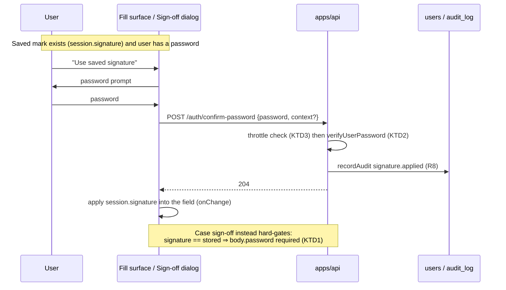

# feat: Saved digital signature — draw or upload once, apply with your password

## Product Contract

### Summary

Let a person save their signature to their profile deliberately — by drawing it
once or uploading an image — and then sign assessments by *applying* that saved
mark, with the application gated by re-entering their login password, like a
saved digital ID. The half-built version already ships: `users.signature`
exists, is silently remembered from the last case sign-off, and prefills the
next sign-off dialog. This plan makes saving intentional, adds the upload
variant, and turns "apply the stored mark" into an authenticated act with an
audit trail — while drawing a fresh signature stays exactly as cheap as today.

### Problem Frame

A signature on a competency record is evidence that a specific person attested
something. Today the mark is a drawing on a shared site tablet: anyone holding
an open session can produce it, the saved copy on the user row can only be
created as a side effect of signing off a case, and there is no way to upload
the signature people actually use on paper. The two halves of the fix serve
different purposes and must not be conflated:

- The **image** is presentation — how the mark prints on the exported record.
  Possessing it proves nothing; it must never act as authorization.
- The **password re-entry** is the signature act — identity plus intent at a
  timestamp. It is what makes an applied stored mark defensible, and it closes
  the shared-tablet hole where a session left open signs as its owner.

Three verified facts shape the whole design:

- **The canonical signature format is a PNG data URL, and only PNG.** The
  exporter's `pngDataUrlBytes` checks the regex and the PNG magic number; any
  other format silently exports a blank box. Uploads must transcode.
- **Downstream keys on the value, never on `field.type === 'signature'`** —
  extraction folds signature boxes into `text`. No type-keyed branches.
- **No password re-verification primitive and no rate limiting exist
  anywhere.** `bcrypt.compare` appears once, inline in login. This plan
  introduces both, deliberately.

### Requirements

- **R1.** A signed-in user can save a signature to their profile by drawing it
  (existing `SignaturePad`) from a "My signature" surface, and can replace or
  clear it. Saving requires only the live session — the mark is theirs.
- **R2.** A user can alternatively upload an image of their signature. The
  client transcodes it to a PNG data URL (downscaled to the pad's canvas
  bounds, aspect preserved) before it is sent, so the stored value is exactly
  what `SignaturePad` emits and what the exporter can embed. Non-image files
  and oversized results are refused client-side and server-side.
- **R3.** The saved signature stays on `users.signature` — product-wide, like
  `username`, per the documented schema rationale. No new table, no object
  storage, no org-scoped copy.
- **R4.** Where a signature field renders on the fill surface and the session
  carries a saved signature, the user can apply it in one action instead of
  redrawing — gated by R5. Drawing fresh remains available and ungated.
- **R5.** Applying the STORED signature requires the user to re-enter their
  login password at that moment. Server-enforced where the server can tell
  (case sign-off submitting a signature identical to the stored one requires a
  valid `password` in the same request), and via a dedicated
  `POST /auth/confirm-password` for fill-surface application. A fresh drawing
  never requires a password — the drawing is itself the act.
- **R6.** A user with no `passwordHash` (invite-created, never set one) simply
  has no apply-stored path: the affordance is hidden and drawing works
  unchanged. Password reset is the existing remedy.
- **R7.** Password confirmation attempts are throttled per user (small
  attempt window, lockout on repeated failure) so the new endpoint is not a
  brute-force oracle. Failures return the same shape as login's 401.
- **R8.** Every password-confirmed application writes an audit entry (existing
  `recordAudit`) naming the actor and the target (case/attempt/field context
  when supplied), so an applied mark has a who/when record behind it.
- **R9.** The end-to-end PNG contract is preserved: what profile save stores,
  what the sign-off remembers, what prefill paints, and what the exporter
  embeds are all the same PNG-data-URL string shape, validated the same way.
- **R10.** The existing silent remember-on-sign-off behavior remains (it is
  the fallback population path), but a deliberately saved signature is never
  overwritten by it silently — sign-off only writes it when none is saved.

### Scope Boundaries

**In:** profile signature management (draw/upload/clear); the password
re-verification primitive + throttle; apply-saved-signature on the fill
surface and the sign-off dialog; audit entries for applications; the
`SignaturePad` fixes this requires (post-mount value paint, upload tab).

**Out / Deferred to Follow-Up Work:**
- **Org policy toggles** ("require password for all signatures", "disallow
  uploads") — the taxonomy-settings pattern is ready for them; add when a
  customer asks.
- **A dedicated signing-events table** (per-signature cryptographic-style
  records with content hashes). R8's audit entries are the v1 evidence trail;
  a richer record is its own round.
- **SSO / non-password re-auth abstraction** — no SSO exists today; the
  confirm endpoint is the seam where it would land.
- **Durable multi-instance rate limiting** — v1's throttle is in-process
  (single-instance deploy today); see Risks.

### Acceptance Examples

- **AE1.** A user draws a signature on My signature and saves. `/auth/me` now
  returns it; opening a case sign-off dialog prefils it; the exported PDF
  embeds it in the signature cell.
- **AE2.** A user uploads a 3MB JPEG photo of their ink signature. The client
  downscales/transcodes; what is stored is a PNG data URL well under the body
  limit; the exporter embeds it (no silent blank box).
- **AE3.** On a signature field in a case part, a user with a saved signature
  clicks "Use saved signature", enters their password, and the field fills
  with the stored mark; an audit entry records the application. Entering a
  wrong password leaves the field untouched and counts toward the throttle.
- **AE4.** An assessor submits case sign-off with the prefilled (stored)
  signature: the request must carry their valid password or it is refused.
  The same assessor wiping the pad and drawing fresh signs off with no
  password prompt.
- **AE5.** Five wrong passwords in the window lock confirmation for that user;
  the sixth attempt is refused without a bcrypt compare; the lockout expires
  on its own.
- **AE6.** An invite-created user with no password sees no "Use saved
  signature" button and no password prompt at sign-off; drawing works as
  today.
- **AE7.** A user who deliberately saved signature A, then signs off a case by
  drawing signature B, still has A saved (R10) — the remember-on-sign-off
  write is skipped because a deliberate save exists.

---

## Planning Contract

### Assumptions (headless scoping — pipeline mode)

- "Sign the box at login" is read as *draw once in a signature box to save
  your digital ID*, not as capture-during-login. Nothing is added to the
  login flow.
- The stored mark lives on `users.signature` (existing, documented as
  product-wide). A `signatureSavedDeliberately`-style marker is needed for
  R10; it rides as one new nullable column on `users` rather than a new table.
- Uploads are transcoded client-side; the server never receives or stores
  non-PNG. This keeps every request under the global 2MB JSON limit and
  avoids the storage-namespace security questions entirely.
- The throttle is in-process (Map with sliding window). Single-instance
  deployment makes this adequate for v1; documented as a risk.
- Audit uses the existing org-scoped `recordAudit` in the caller's current
  tenant — acceptable because every application happens inside a tenant
  context (a case/attempt belongs to an org).

### Key Technical Decisions

- **KTD1 — The password gate is server-enforced where the server can tell.**
  `POST /assessment-cases/:id/sign-off` compares the submitted signature
  string to `users.signature`; identical ⇒ the body must carry `password`
  verified against `passwordHash` (same dummy-hash constant-time discipline
  as login). Different ⇒ no password required (fresh drawing). The fill
  surface cannot be server-gated this way (values save in bulk), so it uses
  `POST /auth/confirm-password` before the client applies the value — an
  honest split: certification is hard-gated, field application is
  soft-gated + audited.
- **KTD2 — One new primitive, shared:** `verifyUserPassword(db, userId,
  password)` in the API auth module, used by login (refactor in place),
  confirm-password, and sign-off. Constant-time discipline (dummy hash when
  no user/hash) moves into the helper so all three callers keep it.
- **KTD3 — Throttle lives in front of bcrypt, keyed by userId,** in a small
  pure module (`attempt window: 5 per 15 min, lockout 15 min`) with its own
  tests; the route consults it before any compare and records failures after.
  In-process by design for v1 (see Risks).
- **KTD4 — Upload is a client-side canvas transcode,** mirroring the logo
  upload's validation ethos (type whitelist + size cap + magic bytes) but
  producing a PNG data URL instead of a storage object: draw the picked image
  onto an offscreen canvas sized to the pad bounds (440×150 contain, white
  background flattened), `toDataURL('image/png')`. Server-side, the profile
  save route revalidates shape + PNG magic + a byte cap (~200KB) — the same
  checks the exporter will later apply, failing loud at save instead of
  silently blank at export.
- **KTD5 — R10 needs one bit of state:** `users.signatureSavedAt`
  (timestamptz, nullable). Deliberate saves stamp it; the sign-off
  remember-write becomes `WHERE signature_saved_at IS NULL`-guarded. Absent ⇒
  today's behavior exactly.
- **KTD6 — `SignaturePad` gains controlled-value repaint and an upload tab**
  rather than a parallel component: the mount-only paint effect becomes
  value-reactive (needed anyway for async session prefill — a live bug), and
  the upload input is a pad mode, so every surface that renders a pad gets
  both improvements for free.

### High-Level Technical Design

### Phase A — the primitive and the profile

### U1. Password verification helper + confirm endpoint + throttle

- **Goal:** One shared, constant-time password check; a rate-limited
  `POST /auth/confirm-password`; login refactored onto the helper.
- **Requirements:** R5, R6, R7, R8
- **Dependencies:** none
- **Files:** `apps/api/src/routes/auth.ts`,
  `apps/api/src/auth/verify-password.ts` (new),
  `apps/api/src/auth/confirm-throttle.ts` (new),
  `apps/api/src/routes/auth.test.ts`,
  `apps/api/src/auth/confirm-throttle.test.ts`
- **Approach:** Extract the login handler's compare (dummy-hash constant-time
  path included) into `verifyUserPassword`; login behavior byte-identical.
  `POST /auth/confirm-password` (mounted under the authed router,
  `requireTenant`): body `{ password, context?: { caseId?, attemptId?,
  fieldId? } }`; throttle first (KTD3); on success 204 + `recordAudit`
  (`category: 'signature'`, action naming the context); on failure 401 with
  login's exact body shape, attempt recorded. A user with no `passwordHash`
  gets the same 401 (no oracle for "this account has no password").
- **Test scenarios:**
  - Correct password ⇒ 204 and an audit row with the actor and context.
  - Wrong password ⇒ 401 (login's body shape), attempt counted.
  - `Covers AE5.` 5 failures ⇒ locked; next attempt refused before compare;
    lock expires after the window (fake timers).
  - `Covers AE6.` Null `passwordHash` ⇒ 401, constant-time path, no throw.
  - Login route still passes its existing suite unchanged (refactor guard).
  - Throttle module: window slide, per-user isolation, reset on success.
- **Verification:** `pnpm --filter @formai/api test`; login suite untouched.

### U2. Profile signature save/clear route + deliberate-save marker

- **Goal:** `PUT /auth/signature` sets or clears the saved mark with full
  server-side validation; `users.signatureSavedAt` records deliberateness;
  sign-off's remember-write respects it.
- **Requirements:** R1, R2 (server half), R3, R9, R10
- **Dependencies:** none (parallel with U1)
- **Files:** `packages/db/src/schema/organizations.ts`, new drizzle migration
  (`pnpm --filter @formai/db generate`, lands as `0067_*`),
  `apps/api/src/routes/auth.ts`, `apps/api/src/routes/auth.test.ts`,
  `apps/api/src/routes/assessments.ts` (remember-write guard),
  `apps/api/src/routes/assessments.test.ts` or the sign-off suite,
  `packages/shared/src/org.ts` (SessionInfo already carries `signature`;
  add `hasPassword: boolean` so the client can hide gated affordances, R6)
- **Approach:** Body `{ signature: string | null }`. Non-null must match the
  exporter's contract exactly — reuse/extract its regex + PNG magic check
  into a shared validator so save-time and export-time cannot drift (R9) —
  plus a ~200KB cap. Null clears both columns. Sets `signatureSavedAt = now()`
  on save. Sign-off's best-effort remember (`assessments.ts` ~:5102) gains
  `signatureSavedAt IS NULL` as its guard (KTD5/R10), still try/catch
  best-effort. `buildSessionInfo` adds `hasPassword` (`passwordHash != null`).
- **Test scenarios:**
  - Valid PNG data URL saves; `/auth/me` returns it; `signatureSavedAt` set.
  - JPEG data URL / bad base64 / oversized ⇒ 400, nothing written.
  - Null clears both columns.
  - `Covers AE7.` Deliberate save then sign-off with a different drawing ⇒
    stored signature unchanged; with NO deliberate save ⇒ remember still
    writes (today's behavior).
  - `hasPassword` true/false reflected in `/auth/me`.
- **Verification:** `pnpm --filter @formai/api test`; migration creates only
  the one column.

### Phase B — capture surfaces

### U3. SignaturePad: value repaint + upload mode

- **Goal:** The pad paints an incoming `value` whenever it changes (fixes the
  async-prefill bug), and gains an "Upload image" mode that transcodes to the
  canonical PNG data URL client-side.
- **Requirements:** R2 (client half), R4 (prefill correctness), R9
- **Dependencies:** none
- **Files:** `packages/ui/src/components/SignaturePad.tsx`, its test file
  beside it (create following the package's existing component-test pattern;
  if `packages/ui` has no test runner, tests land in
  `apps/web/src/screens/fields/FieldRenderer.test.tsx` instead)
- **Approach:** Replace the mount-only paint effect with a value-reactive one
  that skips repaint while the user is mid-stroke (KTD6). Add a mode toggle
  (Draw / Upload): file input accepting image types, drawn to an offscreen
  canvas at pad bounds, contain-fit, white background, `toDataURL('image/png')`,
  then flows through the same `onChange`. Client-side refusal for non-images
  and results over the byte cap, with a visible message (mirrors
  `FileUploadField`'s validate-before-send ethos).
- **Test scenarios:**
  - `Covers AE2 (client half).` A picked image becomes a PNG data URL via
    onChange; an unsupported file type shows an error and emits nothing.
  - A `value` prop arriving after mount paints the canvas (regression for
    the async session prefill).
  - Clearing emits `''`; typed-signature fallback unchanged.
- **Verification:** `pnpm --filter @formai/web test` (and ui package tests if
  present) green.

### U4. My signature management surface

- **Goal:** A "My signature" card where a user saves (draw or upload),
  replaces, or clears their signature.
- **Requirements:** R1, R2, R3
- **Dependencies:** U2, U3
- **Files:** `apps/web/src/screens/enterprise/ProfileScreen.tsx` (own-record
  `my-profile` variant only), `apps/web/src/lib/data/hooks.ts` +
  `apps/web/src/lib/data/store.ts` (a `useSaveSignature` mutation refreshing
  the session), the screen's test file
- **Approach:** Card renders only on the own-record variant (the value is
  users-level; admin views of member records must not show or edit it — the
  profile permission matrix is the wrong gate for a product-wide value).
  Preview of the current saved mark, pad (both modes) to replace, clear
  action. Save path: `PUT /auth/signature` then session refetch so
  `session.signature` is immediately current everywhere.
- **Test scenarios:**
  - `Covers AE1 (management half).` Save from the card updates the preview
    and the session value.
  - Card absent on the admin-viewed member-record variant.
  - Clear empties the preview and the session value.
- **Verification:** `pnpm --filter @formai/web test` green.

### Phase C — the signing act

### U5. Apply saved signature on the fill surface

- **Goal:** Signature fields offer one-action application of the saved mark,
  gated by password confirmation, audited.
- **Requirements:** R4, R5, R6, R8
- **Dependencies:** U1, U3
- **Files:** `apps/web/src/screens/fields/FieldRenderer.tsx` (signature
  case), a small confirm-dialog component beside it, `apps/web/src/lib/data/`
  (confirm-password call), `apps/web/src/screens/fields/FieldRenderer.test.tsx`
- **Approach:** When `session.signature && session.hasPassword`, the pad
  gets a "Use saved signature" affordance. It opens a password dialog; on
  confirm the client POSTs `/auth/confirm-password` with `{caseId, attemptId,
  fieldId}` context; 204 ⇒ `onChange(session.signature)` (which also triggers
  the existing companion date-stamp behavior, deliberately); 401 ⇒ inline
  error, field untouched. Affordance hidden when either session fact is
  absent (R6).
- **Test scenarios:**
  - `Covers AE3.` Confirm ⇒ field filled with the stored value + date-stamp
    fires; wrong password ⇒ error, field untouched.
  - `Covers AE6.` No saved signature, or `hasPassword: false` ⇒ no
    affordance.
  - Locked-out response surfaces the message without applying.
- **Verification:** `pnpm --filter @formai/web test` green.

### U6. Password-gated case sign-off for the stored mark

- **Goal:** Certifying a case with the stored signature requires the
  password in the same request; fresh drawings are untouched.
- **Requirements:** R5, R6, R8, R9
- **Dependencies:** U1
- **Files:** `apps/api/src/routes/assessments.ts` (sign-off route + body
  schema), its sign-off test suite,
  `apps/web/src/screens/assessments/AssessmentCaseScreen.tsx` (dialog)
- **Approach:** Body gains optional `password`. Server: when the submitted
  signature string equals `users.signature` AND the user has a `passwordHash`,
  require + verify `password` via U1's helper (throttle applies); mismatch or
  absence ⇒ 401/400 without any case write; a differing signature skips the
  check entirely (KTD1). A null `passwordHash` skips the gate — a step-up
  cannot be demanded of an account with no credential to step up with, and
  their session + permission matrix remain the (unchanged) authorization. Audit
  the confirmed application alongside the existing sign-off write.
  Client dialog: when the pad value is the untouched prefill and
  `hasPassword`, show a password field and send it; when the user redraws,
  hide it. `hasPassword: false` ⇒ never prompt (their prefill submits as
  today — no stored-vs-fresh distinction is enforceable for them, R6).
  Idempotency and server-stamped date are preserved unchanged.
- **Test scenarios:**
  - `Covers AE4.` Stored-identical signature without password ⇒ refused, no
    state change; with valid password ⇒ signs off; redrawn signature without
    password ⇒ signs off.
  - Wrong password counts toward the same throttle as U1.
  - `hasPassword: false` user signs off with prefill unchanged (no gate).
  - Existing sign-off suite (idempotency, prerequisites, self-assessment
    policy) green unchanged.
- **Verification:** `pnpm --filter @formai/api test` and web suite green.

---

## Verification Contract

| Gate | Command | Applies to |
|---|---|---|
| Types | `pnpm typecheck` | all units |
| API tests | `pnpm --filter @formai/api test` | U1, U2, U6 |
| Web tests | `pnpm --filter @formai/web test` | U3, U4, U5, U6 |
| DB tests | `pnpm --filter @formai/db test` | U2 |
| Migration | generated as `0067_*`, creates one nullable column only; **generated, never applied by the implementer** | U2 |

## Definition of Done

- A user can save (draw or upload), replace, and clear their signature from
  My signature; the stored value round-trips to the exported PDF (AE1, AE2).
- Applying the stored mark requires the password on both surfaces (AE3, AE4);
  fresh drawing never prompts; password-less users degrade cleanly (AE6).
- The throttle locks and expires as specified (AE5); confirmations are
  audited (R8).
- A deliberate save is never clobbered by the sign-off remember-write (AE7).
- All Verification Contract gates green; migration `0067` generated only.

## Risks & Mitigations

- **In-process throttle resets on restart and does not span instances.**
  Acceptable for the current single-instance deployment; the throttle module
  is pure and swappable for a table-backed one when deployment changes.
  Named in Deferred.
- **Client-side transcode variance** (EXIF rotation, huge images). Mitigate:
  contain-fit into fixed bounds caps output size regardless of input;
  orientation handled by the browser's `createImageBitmap` where available;
  server revalidates shape/magic/size so a bad client can't store junk.
- **The fill-surface gate is client-orchestrated** (KTD1's honest split). The
  audit row records the confirmation server-side; the hard server gate exists
  where certification happens (sign-off). A future signing-events round can
  tighten field-level enforcement.
- **String-equality detection of "stored mark" at sign-off** misses a
  re-encoded copy of the same image. Acceptable: re-encoding requires
  deliberate effort indistinguishable from drawing fresh, which is ungated by
  design.
